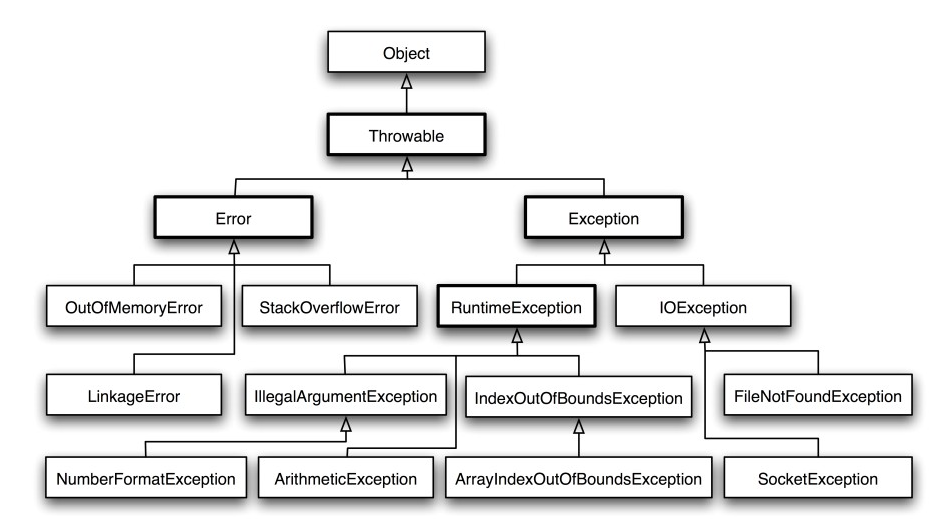

[TOC]

### 异常

#### 1 概述

Throwable 可以用来表示任何可以作为异常抛出的**类**，分为两种： **Error**  和 **Exception**。其中 Error 用来表示 JVM 无法处理的错误，Exception 分为两种：

- **受查异常** ：需要用 try...catch... 语句捕获并进行处理，并且可以从异常中恢复；就是可以检查到的，与 IO 操作相关的很多异常就是这个。比如 ：ClassNotFoundException，NoSuchFieldException，NoSuchMetodException。
- **非受查异常** ：是程序运行时错误，例如除 0 会引发 Arithmetic Exception，此时程序崩溃并且无法恢复。派生于**Error**类和**RuntimeException类**的异常。运行时才能发现的异常，所以是不能检查的异常。

常见的 RuntimeException 表（非受查异常）

|             异常              |                 类型                 |
| :---------------------------: | :----------------------------------: |
|   **NullPointerException**    |            空指针引用异常            |
|    **ClassCastException**     |           类型强制转换异常           |
| **IllegalArgumentException**  |           传递非法参数异常           |
|    **ArithmeticException**    |             算术运算异常             |
|      ArrayStoreException      | 向数组中存放与声明类型不兼容对象异常 |
| **IndexOutOfBoundsException** |             下标越界异常             |
|   **NumberFormatException**   |             数字格式异常             |
| UnsupportedOperationException |           不支持的操作异常           |


#### 2 异常体系

- 异常对象**都是派生于 Throwable 类**的一个实例。异常体系如下如所示。RuntimeException 下面是非受查异常。IOException 下面是受查异常。




#### 3 自定义异常类

继承 Exception 类或者其子类即可。

```java
class FileFormatException extends IOException{
    public FileFormatException() {
    	this("The file format is not good.");
    }
    public FileFormatException(String gripe){
        super(gripe);
    }
}
```


#### 4 Throwable类API

```java
Throwable(); 	// 构造一个新的 Throwabie 对象， 这个对象没有详细的描述信息
Throwable(String message); // 构造一个新的throwable对象， 这个对象带有特定的详细描述信息。习惯上所有派生的异常类都支持一个默认的构造器和一个带有详细描述信息的构造器
String getMessage(); // 获得Throwable 对象的详细描述信息
```


#### 5 受查异常声明与抛出

受查异常使用 ==throws== 关键词声明异常。

```java
class MyAnimation{
    // 可以同时声明多个可能抛出的异常
    public Image loadlmage(String s) throws FileNotFoundException, EOFException{
        ...
    }
}
```

非受查异常使用 ==throw== 关键词**抛出**异常。

```java
EOFException e = new EOFException();    // 构造异常对象
throw e;    // 抛出异常对象
throw new EOFException("File is not found");    // 抛出异常对象且带异常有信息
```

**再次抛出异常与异常链**

有一好的处理方法，将原始异常设置为新异常的“**原因**”：

```java
try{
    // access the database
} catch (SQLException e) {
    // 构造新的异常对象
    Throwable se = new ServletException ("database error"); 
    se.initCause(e);    // 把原来的原因e传入新对象中
    throw se;   // 抛出新对象
}
```

当捕获到异常时， 就可以使用下面这条语句重新得到原始异常：

```java
Throwable e = se.getCause();
```

**强烈建议**使用这种包装技术。


#### 6 try-catch-finally

- finally 多用于**回收资源**。涉及资源操作的都需要执行！！比如文件打开，Redis 或 MySQL 连接等。
- 不管是否有异常被捕获， finally 子句中的代码都被执行。
- try 语句可以只有 finally 子句，而没有 catch 子句。
- finally语句中可能也会产生异常！如资源关闭close()方法的异常。此时原始的异常将会丢失，转而抛出 close 方法的异常。

##### ① ==带 return 的 finally 语句==

当 **finally 子句包含 return 语句**时，将会出现一种**意想不到**的结果，假设利用 return 语句从 **try** 语句块中**退出**。**在方法返回前，finally 子句的内容将被执行**。如果 finally 子句中也有一个 return 语句，这个返回值将会==**覆盖**==原始的返回值。

```java
public static int f(int n){
    try{
        int r = n * n;
        // 如果try子句含有return
        return r;
    }
    finally{
        if (n == 2) {
            // finally中的return覆盖try中的return
            return 0;
        }
    }
}
```

如果调用 f(2), 那么 try 语句块的计算结果为 r = 4, 并执行 return 语句. 然而在方法真正**返回前**，还要执行 finally 子句。finally 子句将使得方法返回 0, 这个返回值**覆盖**了原始的返回值 4。

- **不要在 finally 语句中使用 return，这不是 finally 语句的用处。**


##### ② 带资源的 try 语句

- 如果需要关闭资源，最好使用带资源的 try 语句。
    假设资源属于一个实现了 **AutoCloseable** 接口的类， Java SE7 为这种代码模式提供了一
    个很有用的快捷方式。AutoCloseable 接口有一个方法：

```java
void close() throws Exception
```

带资源的 try 语句（try-with-resources) 的最简形式为：

```java
try (Resource res = ...){
    // work with res
}

```

try 块正常或者发生异常退出时，会**自动调用 res.close()**。就像使用了 finally 子句。

还可以指定多个资源。例如：

```java
try (Scanner in = new Scanne「(new FileInputStream('7usr/share/dict/words"),  "UTF-8");
PrintWriter out = new Pri ntWriter("out.txt")){
    while (in.hasNex())
    System.out.println(in.next().toUpperCase());
}
```

不论这个块如何退出，in 和 out 都会关闭。有的资源**没有实现这个接口**就**不能**使用带资源的 try 语句。


#### 7 覆写父类异常方法

- 如果在子类中覆盖了超类的一个方法， **子类**方法中声明的受查异常**不能比超类方法中声明的异常更通用** （子类方法中可以抛出更特定的异常， 或者根本不抛出任何异常）。
- 如果超类方法没有抛出任何受查异常，子类也不能抛出任何受查异常。超类异常范围最广泛。

```java
public class SuperClass{
    public void someMethod throws Exception1 {
        ....
    }
}

public class SubClass extends SuperClass {
    @Override
    public void someMethod throws Exception1, Exception2{	// Error 子类方法比父类异常范围更大
        ....
    }
}

public class SubClass extends SuperClass {
    @Override
    public void someMethod throws Exception3{	// OK if Exception3 exntends Exception1
        ....
    }
}

```

**覆写的方法不能拓展父类异常的范围**。


#### 8 使用异常技巧

- 多使用代码检查机制。捕获异常的开销非常大。
- 不要过分细化异常。
- 利用异常层次结构，不要只抛出 RuntimeException 异常。应该寻找更加适当的子类或创建自己的异常类。不要只捕获 Thowable 异常， 否则，会使程序代码更难读、更难维护。将一种异常转换成另一种更加适合的异常时不要犹豫。
- 不要压制异常。
- 在检测错误时，“ 苛刻 ” 要比放任更好。
- 不要羞于传递异常。
- 早抛出，晚捕获。
- 多个catch块的次序应该是具体异常放在其祖先类的前面，否则后面的catch语句可能进入不了。

- [Java 入门之异常处理](https://www.tianmaying.com/tutorial/Java-Exception)
- [Java 异常的面试问题及答案 -Part 1](http://www.importnew.com/7383.html)


