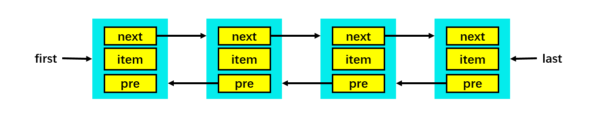
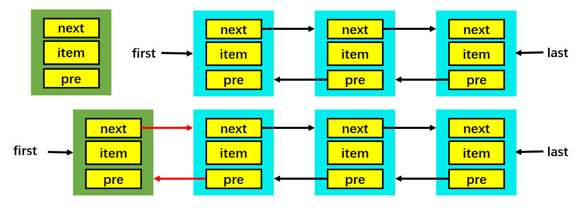
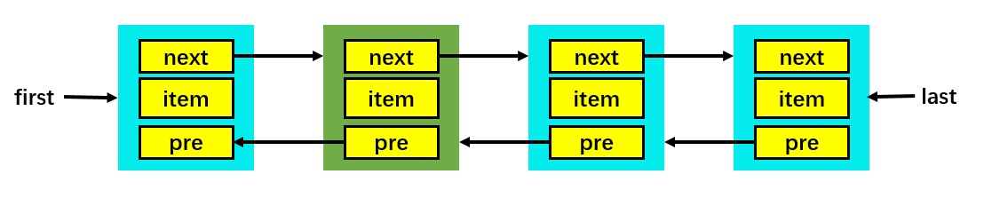
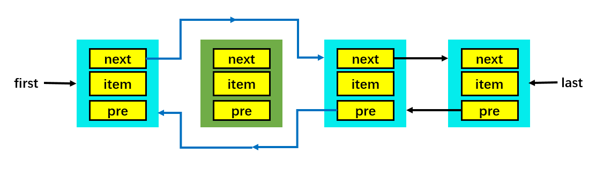

[TOC]

### LinkedList

#### 1. 概览

- 同样实现了 List 接口，其特点与 ArrayList 几乎**相反**。
- LinkedList 还实现了 **Deque** 接口，可以按照队列、栈和双端队列的方式进行操作。
- LinkedList 是线程**不安全**的队列。


#### 2. 与 ArrayList 的比较

- ArrayList 基于**动态数组**实现，LinkedList 基于**双向链表**实现；
- ArrayList 支持**随机访问**，LinkedList 不支持；
- LinkedList 在任意位置添加删除元素**更快**。

#### 3. 基本使用

```java
LinkedList() 	// 用于创建一个新的空linkedList
LinkedList(Collection<? extends E> c) // 使用一个集合创建一个新的linkedList
```

```java
public class Main {
    public static void main(String[] args) {
        LinkedList<String> linkedList1 = new LinkedList<>();
        System.out.println(linkedList1);
        String[] arr = {"H", "E", "L", "L", "O"};
        LinkedList<String> linkedList2 = new LinkedList<>(Arrays.asList(arr));
        System.out.println(linkedList2);
    }
}
```

##### 其他API

```java
int size();  	// 它返回此列表中元素的数量
void clear();  	// 它删除列表中的所有元素
Object clone();	//它用于制作现有链接列表的副本
Object set(int index，Object element);  // 它用于用新元素替换列表中的现有元素
boolean contains(Object element);		// 如果元素存在于列表中，则返回true
boolean add(Object element);			// 它将元素附加到列表的末尾
void add(int index，Object element);	   // 它将元素插入列表中'index'位置
boolean addAll(Collection C);			// 它将一个集合追加到链接列表
boolean addAll(int index，Collection C);// 它将一个集合追加到指定位置的链表中
void addFirst(Object element);			// 它将元素插入列表的开头
void addLast(Object element);			// 它将元素附加在列表的末尾
Object get(int index);	// 它返回列表中位置'index'处的元素。如果索引超出了列表的范围，它会抛出'IndexOutOfBoundsException'
Object getFirst();		// 它返回链表的第一个元素
Object getLast();		// 它返回链接列表的最后一个元素
int indexOf(Object element);	// 如果找到元素，它将返回元素第一次出现的索引。否则，它返回-1
int lastIndexOf(Object element);// 如果找到元素，它将返回元素最后一次出现的索引。否则，它返回-1
Object remove();		// 它用于从列表头部删除并返回元素
Object remove(int index);		// 它删除此列表中位置'index'处的元素。如果列表为空，它会抛出'NoSuchElementException'
boolean remove(Object O);		// 它用于从链表中移除一个特定的元素并返回一个布尔值
Object removeLast();			// 它用于删除并返回链接列表的最后一个元素
```


#### 4. 源码解析

##### ① 结点类

基于**双向链表**实现，使用 **Node** 存储链表节点信息，并维护了长度、头结点和尾结点。**双向链表**。

```java
private static class Node<E> {
    E item;
    Node<E> next;
    Node<E> prev;
     
    Node(Node<E> prev, E element, Node<E> next) {
    	this.item = element;
     	this.next = next;
     	this.prev = prev;
 	}
}
```

每个链表存储了 first 和 last 指针，LinkedList 中的属性如下

```java
// 链表的节点个数
transient int size = 0;
// 指向头节点的指针
transient Node<E> first;
// 指向尾节点的指针
transient Node<E> last;
```



##### ② 添加元素

对于链表这种数据结构来说，添加元素的操作无非就是在**表头**插入元素，又或者在**指定位置**插入元素。因为 LinkedList 有头指针和尾指针，所以在**表头**进行插入元素只需要 **O(1)** 的时间，而在指定位置插入元素则需要先遍历一下链表，所以复杂度为 O(n)。

在**表头**添加元素的过程如下：



当向**表头**插入一个节点时，很显然当前节点的**前驱**一定为 **null**，而**后继**结点是 first 指针指向的节点，当然还要修改 first 指针指向新的头节点。除此之外，原来的头节点变成了第二个节点，所以还要修改原来头节点的前驱指针，使它指向表头节点，源码的实现如下：

```java
private void linkFirst(E e) {
    final Node<E> f = first;
    // 当前节点的前驱指向 null，后继指针原来的头节点
    final Node<E> newNode = new Node<>(null, e, f);
    // 头指针指向新的头节点
    first = newNode;
    // 如果原来有头节点，则更新原来节点的前驱指针，否则更新尾指针
    if (f == null) {
        last = newNode;
    } else {
        f.prev = newNode;
    }
    size++;
    modCount++;
}
```

当向**表尾**插入一个节点时，很显然当前节点的**后继**一定为 **null**，而前驱结点是 last指针指向的节点，然后还要修改 last 指针指向新的尾节点。此外，还要修改原来尾节点的后继指针，使它指向新的尾节点，此处不赘述。

最后，在指定节点之前插入，如图所示



当向指定节点之前插入一个节点时，当前节点的**后继为指定节点**，而**前驱结点为指定节点的前驱节点**。此外，还要修改前驱节点的后继为当前节点，以及后继节点的前驱为当前节点，源码的实现如下：

```java
void linkBefore(E e, Node<E> succ) {
    // assert succ != null;
    //指定节点的前驱
    final Node<E> pred = succ.prev;
    //当前节点的前驱为指点节点的前驱，后继为指定的节点
    final Node<E> newNode = new Node<>(pred, e, succ);
    //更新指定节点的前驱为当前节点
    succ.prev = newNode;
    //更新前驱节点的后继
    if (pred == null)
        first = newNode;
    else
        pred.next = newNode;
    size++;
    modCount++;
}
```

##### ③判断存在

```java
public boolean contains(Object o) {
     return indexOf(o) != -1;
 }
 // 从前向后查找，返回“值为对象(o)的节点对应的索引”  不存在就返回-1 
 public int indexOf(Object o) {
      int index = 0;
      if (o==null) {
          for (Entry e = header.next; e != header; e = e.next) {
              if (e.element==null)
                  return index;
              index++;
         }
      } else {
         for (Entry e = header.next; e != header; e = e.next) {
             if (o.equals(e.element))
                 return index;
             index++;
        }
    }
     return -1;
 }
```

indexOf(Object o) 判断 o 链表中是否存在节点的 element 和 o 相等，若相等则返回该节点在链表中的索引位置，若不存在则返回 -1。

contains(Object o) 方法通过判断 indexOf(Object o) 方法返回的值是否是 -1 来判断链表中是否包含对象 o。

##### ④ 获取数据

get(int) 方法用于获取指定位置的数据。首先判断位置信息是否**合法**（大于等于0，小于当前 LinkedList 实例的Size），然后**遍历**到具体位置，获得节点的业务数据（element）并返回。

注意：**为了提高效率，需要根据获取的位置判断是从头还是从尾开始遍历。**这样可以提高查找效率。

```java
// 获取双向链表中指定位置的节点    
private Entry<E> entry(int index) {    
    if (index < 0 || index >= size) {
        throw new IndexOutOfBoundsException("Index: " + index + ", Size: " + size); 
    }   
   
    Entry<E> e = header;    
    // 获取index处的节点。    
    // 若index < 双向链表长度的1/2,则从前先后查找;    
    // 否则，从后向前查找。    
    if (index < (size >> 1)) {    
        for (int i = 0; i <= index; i++)    
            e = e.next;    
    } else {    
        for (int i = size; i > index; i--)    
            e = e.previous;    
    }    
    return e;    
}
```

注意细节：**位运算**与直接做除法的区别。先将 index 与长度 size 的**一半**比较，如果 index < size / 2，就只从位置0 往后遍历到位置 index 处，而如果 index > size / 2，就只从位置 size 往前遍历到位置 index 处。这样可以减少一部分不必要的遍历。

##### ⑤ 删除数据

几个 remove 方法最终都是调用了一个私有方法：**remove**(Entry\<E> e)，只是其他简单逻辑上的区别。下面分析remove(Entry\<E> e) 方法。



```java
private E remove(Entry<E> e) {
    if (e == header){
        throw new NoSuchElementException();
    }
    // 保留将被移除的节点e的内容
    E result = e.element;
    // 将前一节点的next引用赋值为e的下一节点
    e.previous.next = e.next;
    // 将e的下一节点的previous赋值为e的上一节点
    e.next.previous = e.previous;
    // 上面两条语句的执行已经导致了无法在链表中访问到e节点，而下面解除了e节点对前后节点的引用
    e.next = e.previous = null;
    // 将被移除的节点的内容设为null
    e.element = null;
    // 修改size大小
    size--;
    modCount++;
    // 返回移除节点e的内容
    return result;
}
```

由于删除了某一节点因此调整相应节点的前后指针信息，如下：

```java
e.previous.next = e.next;		// 预删除节点的前一节点的后指针指向预删除节点的后一个节点
e.next.previous = e.previous;	// 预删除节点的后一节点的前指针指向预删除节点的前一个节点
```

清空预删除节点：

```java
e.next = e.previous = null;
e.element = null;
```

交给 GC 完成资源回收，删除操作结束。

与 ArrayList 比较而言，LinkedList 的删除动作不需要“移动”很多数据，从而效率更高。


