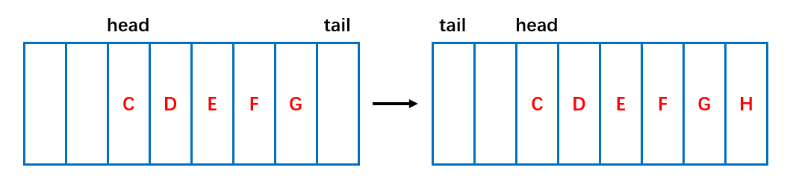
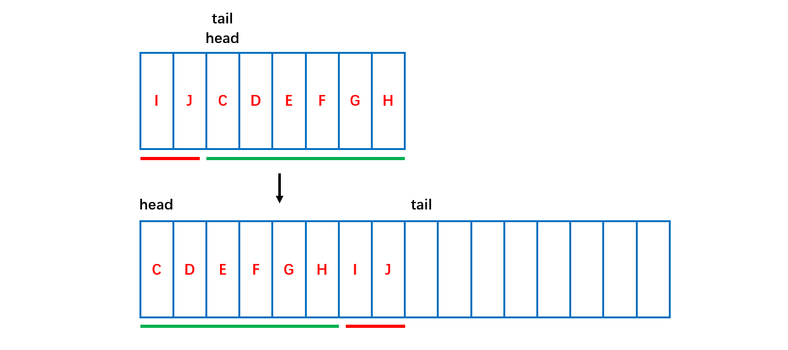

[TOC]

### Queue、Deque与ArrayDeque

#### 0 本节要点

- ArrayDeque 实现了 Dueue 接口，可用于**队列、双端队列、栈**等。
- ArrayDeque 内部依然采用**数组**进行数据存储，但是要求**数组元素个数为 2 的幂次方**个，这样可以实现**环形索引**，更加高效。
- ArrayDeque 扩容时元素会复制重排放在数组第一个位置。


#### 1 概述

- Queue 也是 Java 集合框架中定义的一种接口，直接继承自 Collection 接口。除了基本的 Collection 接口规定测操作外，Queue 接口还定义一组针对**队列**的特殊操作。通常来说，Queue 是按照**先进先出** (FIFO) 的方式来管理其中的元素的，但是优先队列是一个例外。
- **Deque** 接口继承自 **Queue** 接口，但 Deque 支持同时从**两端添加或移除**元素，因此又被成为**双端队列**。鉴于此，Deque 接口的实现可以被当作  **FIFO** 队列使用，也可以当作 **LIFO** （栈）来使用。官方也是**推荐使用 Deque 的实现来替代 Stack**。
- ArrayDeque 是 Deque 接口的一种具体实现，是依赖于**动态数组**来实现的。ArrayDeque 没有容量限制，可根据需求**自动进行扩容**。ArrayDeque **不支持**值为 **null** 的元素。
- ArrayDeque 可以作为**栈**来使用，效率要高于 Stack；ArrayDeque 也可以作为**队列**来使用，效率相较于基于双向链表的 **LinkedList** 也要更好一些。


#### 2 ArrayDeque 源码分析

##### ① **Queue 与 Deque  接口**

```java
public interface Queue<E> extends Collection<E> {
    // 向队列中插入一个元素，并返回true
    // 如果队列已满，抛出IllegalStateException异常
    boolean add(E e);

    // 向队列中插入一个元素，并返回true
    // 如果队列已满，返回false
    boolean offer(E e);

    // 取出队列头部的元素，并从队列中移除
    // 队列为空，抛出NoSuchElementException异常
    E remove();

    // 取出队列头部的元素，并从队列中移除
    // 队列为空，返回null
    E poll();

    // 取出队列头部的元素，但并不移除
    // 如果队列为空，抛出NoSuchElementException异常
    E element();

    // 取出队列头部的元素，但并不移除
    // 队列为空，返回null
    E peek();
}
```

Deque 和 **Queue** 方法的的对应关系如下：

| Queue Method | Equivalent Deque Method |
| :----------: | :---------------------: |
|    add(e)    |       addLast(e)        |
|   offer(e)   |      offerLast(e)       |
|   remove()   |      removeFirst()      |
|    poll()    |       pollFirst()       |
|  element()   |       getFirst()        |
|    peek()    |       peekFirst()       |

Deque 和 **Stack** 方法的对应关系如下：

| Stack Method | Equivalent Deque Method |
| :----------: | :---------------------: |
|   push(e)    |       addFirst(e)       |
|    pop()     |      removeFirst()      |
|    peek()    |       peekFirst()       |

**ArrayDeque** 实现了 **Deque** 接口中的所有方法。因为 ArrayDeque 会根据需求自动扩充容量，因而在插入元素的时候不会抛出IllegalStateException异常。

##### ② 基本属性

```java
// 用数组存储元素
transient Object[] elements; // non-private to simplify nested class access
// 头部元素的索引
transient int head;
// 尾部下一个将要被加入的元素的索引
transient int tail;
// 最小容量，必须为2的幂次方
private static final int MIN_INITIAL_CAPACITY = 8;
```

在 ArrayDeque 底部是使用**数组**存储元素，同时还使用了**两个索引**来表征当前数组的状态，分别是 head 和 tail。head 是头部元素的索引，但注意 **tail *不是尾部元素的索引，而是尾部元素的下一位***，即下一个将要被加入的元素的索引。

##### ③ 初始化

ArrayDeque 提供了三个构造方法，分别是默认容量，指定容量及依据给定的集合中的元素进行创建。默认容量为**16**。

```java
public ArrayDeque() {
    elements = new Object[16];
}

public ArrayDeque(int numElements) {
    allocateElements(numElements);
}

public ArrayDeque(Collection<? extends E> c) {
    allocateElements(c.size());
    addAll(c);
}
```

ArrayDeque 对**数组的大小**(即队列的容量)有特殊的要求，==必须是 **2^n**（2 的幂次方）==。通过 `allocateElements`方法计算初始容量：

```java
private void allocateElements(int numElements) {
    int initialCapacity = MIN_INITIAL_CAPACITY;
    // Find the best power of two to hold elements.
    // Tests "<=" because arrays aren't kept full.
    if (numElements >= initialCapacity) {
        initialCapacity = numElements;
        initialCapacity |= (initialCapacity >>>  1);
        initialCapacity |= (initialCapacity >>>  2);
        initialCapacity |= (initialCapacity >>>  4);
        initialCapacity |= (initialCapacity >>>  8);
        initialCapacity |= (initialCapacity >>> 16);
        initialCapacity++;

        if (initialCapacity < 0)   // Too many elements, must back off
            initialCapacity >>>= 1;// Good luck allocating 2 ^ 30 elements
    }
    elements = new Object[initialCapacity];
}
```

`>>>`是无符号右移操作，`|`是位或操作，经过五次**右移和位**或操作可以保证得到大小为 **2^k-1** 的数。看一下这个例子：

```java
0 0 0 0 1 ? ? ? ? ?     // n
0 0 0 0 1 1 ? ? ? ?     // n |= n >>> 1;
0 0 0 0 1 1 1 1 ? ?     // n |= n >>> 2;
0 0 0 0 1 1 1 1 1 1     // n |= n >>> 4;
```

在进行 5 次位移操作和位或操作后就可以得到 **2^k-1**，最后加1即可

##### ④ 添加元素

向末尾添加元素：

```java
public void addLast(E e) {
    if (e == null)
        throw new NullPointerException();
    // tail 中保存的是即将加入末尾的元素的索引
    elements[tail] = e;
    // tail 向后移动一位
    // 把数组当作环形的，越界后到0索引
    if ( (tail = (tail + 1) & (elements.length - 1)) == head)
        // tail 和 head相遇，空间用尽，需要扩容
        doubleCapacity();
}
```

这段代码中，`(tail = (tail + 1) & (elements.length - 1)) == head`这句有点难以理解。其实，在 ArrayDeque 中数组是当作**环形**来使用的，索引 0 看作是紧挨着索引 (length - 1) 之后的。参考下面的图片（tail 指向的是**下一个**即将存放元素的位置）



那么为什么`(tail + 1) & (elements.length - 1)`就能保证按照环形取得**正确的下一个索引值**呢？这就和前面说到的 ArrayDeque 对容量的**特殊要求**有关了。下面对其正确性加以验证：

```
length = 2^n，二进制表示为: 第 n 位为1，低位 (n-1位) 全为0 
length - 1 = 2^n - 1，二进制表示为：低位(n-1位)全为1

如果 tail + 1 <= length - 1，则位与后低 (n-1) 位保持不变，高位全为0
如果 tail + 1 = length，则位与后低 n 全为0，高位也全为0，结果为 0
```

可见，在容量保证为 **2^n** 的情况下，仅仅通过**位与**操作就可以完成==**环形索引**==的计算，而不需要进行边界的判断，在实现上更为**高效**。

向头部添加元素的代码如下：

```java
public void addFirst(E e) {
    if (e == null) // 不支持值为null的元素
        throw new NullPointerException();
    elements[head = (head - 1) & (elements.length - 1)] = e;
    if (head == tail)
        doubleCapacity();
}
```

其它的诸如add，offer，offerFirst，offerLast 等方法都是基于上面这两个方法实现的，不再赘述。

##### ⑤ 扩容

在每次添加元素后，如果**头索引和尾部索引**相遇，则说明数组空间**已满**，需要进行**扩容**操作。 ArrayDeque 每次扩容都会在原有的容量上**翻倍**，这也是对容量必须是 **2 的幂次方**的保证。如下图所示，扩容后会复制内容，**复制的时候会进行重排**，将 head 放在第一个。



```java
private void doubleCapacity() {
    assert head == tail; // 扩容时头部索引和尾部索引肯定相等
    int p = head;
    int n = elements.length;
    // 头部索引到数组末端(length-1处)共有多少元素
    int r = n - p; // number of elements to the right of p
    // 容量翻倍
    int newCapacity = n << 1;
    // 容量过大，溢出了
    if (newCapacity < 0)
        throw new IllegalStateException("Sorry, deque too big");
    // 分配新空间
    Object[] a = new Object[newCapacity];
    // 复制头部索引到数组末端的元素到新数组的头部
    System.arraycopy(elements, p, a, 0, r);
    // 复制其余元素
    System.arraycopy(elements, 0, a, r, p);
    elements = a;
    // 重置头尾索引
    head = 0;
    tail = n;
}
```

##### ⑥ 移除元素

ArrayDeque 支持从**头尾两端**移除元素，remove 方法是通过 poll 来实现的。因为是基于数组的，在了解了**环的原理**后这段代码就比较容易理解了。

```java
public E pollFirst() {
    int h = head;
    @SuppressWarnings("unchecked")
    E result = (E) elements[h];
    // Element is null if deque empty
    if (result == null)
        return null;
    elements[h] = null;     // Must null out slot
    head = (h + 1) & (elements.length - 1);
    return result;
}

public E pollLast() {
    int t = (tail - 1) & (elements.length - 1);
    @SuppressWarnings("unchecked")
    E result = (E) elements[t];
    if (result == null)
        return null;
    elements[t] = null;
    tail = t;
    return result;
}
```

##### ⑦ 获取队头和队尾的元素

```java
@SuppressWarnings("unchecked")
public E peekFirst() {
    // elements[head] is null if deque empty
    return (E) elements[head];
}

@SuppressWarnings("unchecked")
public E peekLast() {
    return (E) elements[(tail - 1) & (elements.length - 1)];
}
```

##### ⑧ 迭代器

ArrayDeque 在迭代是**检查并发修改并没有使用**类似于 ArrayList 等容器中使用的 **modCount**，而是通过**尾部索引**来确定的。具体参考 next 方法中的注释。但是这样**不一定**能保证检测到所有的**并发修改**情况，加入先移除了尾部元素，又添加了一个尾部元素，这种情况下迭代器是没法检测出来的。

```java
private class DeqIterator implements Iterator<E> {
    /**
     * Index of element to be returned by subsequent call to next.
     */
    private int cursor = head;

    /**
     * Tail recorded at construction (also in remove), to stop
     * iterator and also to check for comodification.
     */
    private int fence = tail;

    /**
     * Index of element returned by most recent call to next.
     * Reset to -1 if element is deleted by a call to remove.
     */
    private int lastRet = -1;

    public boolean hasNext() {
        return cursor != fence;
    }

    public E next() {
        if (cursor == fence)
            throw new NoSuchElementException();
        @SuppressWarnings("unchecked")
        E result = (E) elements[cursor];
        // This check doesn't catch all possible comodifications,
        // but does catch the ones that corrupt traversal
        // 如果移除了尾部元素，会导致tail != fence
        // 如果移除了头部元素，会导致 result == null
        if (tail != fence || result == null)
            throw new ConcurrentModificationException();
        lastRet = cursor;
        cursor = (cursor + 1) & (elements.length - 1);
        return result;
    }

    public void remove() {
        if (lastRet < 0)
            throw new IllegalStateException();
        if (delete(lastRet)) { // if left-shifted, undo increment in next()
            cursor = (cursor - 1) & (elements.length - 1);
            fence = tail;
        }
        lastRet = -1;
    }

    public void forEachRemaining(Consumer<? super E> action) {
        Objects.requireNonNull(action);
        Object[] a = elements;
        int m = a.length - 1, f = fence, i = cursor;
        cursor = f;
        while (i != f) {
            @SuppressWarnings("unchecked") E e = (E)a[i];
            i = (i + 1) & m;
            if (e == null)
                throw new ConcurrentModificationException();
            action.accept(e);
        }
    }
}
```


