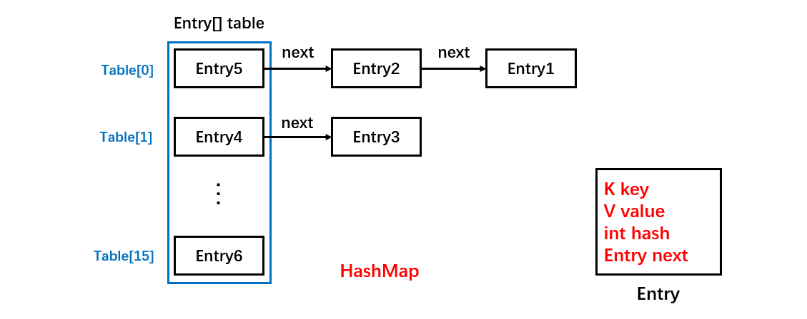
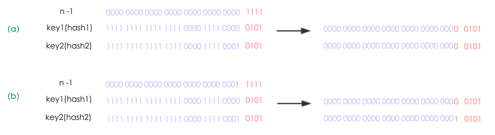
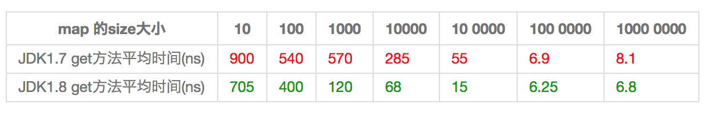
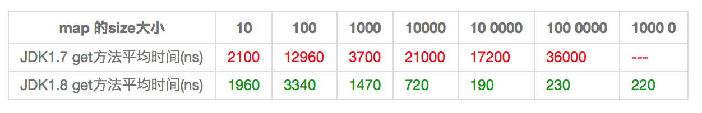

[TOC]

### HashMap

#### 本节要点

- **建议通看源码**。面试非常喜欢问！
- 内部使用 Node 数组存储数据。
- 使用**拉链法**解决哈希冲突。
- **内部数组长度**为 2 的**幂次方**，输入不是也会转为 2 的幂次方。这是为了快速的计算 hash 值，因为这可以改变成位运算。
- 不够存储时会进行**扩容再哈希**。并发环境下的 resize 扩容 JDK7 采用头插法，可能产生循环链表。JDK8 采用尾插法。
- Java8 之后链表太长会转为**红黑树**。
- 可以存储  **null** 类型的**键值**，将存放在 **0 号键槽**中。但是**键为 null** 只能存在**一个**。


#### 源码解析

源码版本 JDK 1.8。从结构实现来讲，HashMap 是**数组+链表+红黑树**（JDK1.8增加了红黑树部分）实现的。HashMap 的内部功能实现很多，重点是根据 key 获取哈希桶数组**索引位置**、put 方法的详细执行、扩容过程三个具有代表性的点。

##### 1. 存储结构

HashMap 中的元素是用**内部类** Node 进行存储。实现了 **Map.Entry 接口**，本质是就是一个映射**(键值对**)。

Node 类的源码如下：

```java
static class Node<K,V> implements Map.Entry<K,V> {
        final int hash;    // 用来定位数组索引位置
        final K key;
        V value;
        Node<K,V> next;   // 链表的下一个node

        Node(int hash, K key, V value, Node<K,V> next) { ... }
		// 覆写hashCode方法
        public final int hashCode() {
            // 使用了Objects工具类直接生成
            return Objects.hashCode(key) ^ Objects.hashCode(value);
        }
	    // 覆写equals方法
        public final boolean equals(Object o) {
            // 先判断是否是同一个对象
            if (o == this)
                return true;
            // 在判断对象类型是否正确
            if (o instanceof Map.Entry) {
                // 进行类型转换
                Map.Entry<?,?> e = (Map.Entry<?,?>)o;
                // 接着对每个域都比较
                if (Objects.equals(key, e.getKey()) &&
                    Objects.equals(value, e.getValue()))
                    return true;
            }
            return false;
        }
    
        public final K getKey(){ ... }
        public final V getValue() { ... }
	    public final V setValue(V newValue) { ... }
        public final String toString() { ... }
}
```

这里同时覆写了 hashCode 和 equals 方法。

##### 2. 拉链法与哈希碰撞

HashMap 就是使用**哈希表**来存储的。哈希表为**解决冲突**，可以采用**开放地址法**和**拉链法**等来解决问题，HashMap 采用了**拉链法**。拉链法简单来说就是**数组加链表的结合**。在每个数组元素上都一个**链表结构**，当数据被 Hash 后，得到**数组下标**，把数据放在对应下标元素的**链表**上。例如程序执行下面代码：

```java
map.put("Nano","123");
```

调用 "Nano" 这个 key 的 hashCode() 方法得到其 **hashCode** 值（该方法适用于每个 Java 对象），然后再通过 Hash 算法的后两步运算（高位运算和取模运算，下文有介绍）来**定位该键值对的存储位置**，有时两个 key 会定位到**相同**的位置，表示发生了 **Hash 碰撞**。当然 Hash 算法计算结果越分散均匀，Hash 碰撞的概率就越小，map 的存取效率就会越高。

HashMap 内部包含了一个 **Node 类型**的数组 table。

```java
transient Node<K, V>[] table;
```

Entry 存储着**键值对**。它包含了四个字段，从 next 字段我们可以看出 Entry 是一个**链表**。即数组中的每个位置被当成一个**桶**，一个桶存放一个**链表**。HashMap 使用==**拉链法**==来解决**哈希冲突**，同一个**链表中存放哈希值**相同的 Entry。



```java
HashMap<String, String> map = new HashMap<>();
map.put("K1", "V1");
map.put("K2", "V2");
map.put("K3", "V3");
```

- 插入 &lt;K1, V1> 键值对，先计算 K1 的 **hashCode** 为 115，使用除留余数法得到所在的**桶下标** 115%16 = 3。
- 插入 &lt;K2, V2> 键值对，先计算 K2 的 **hashCode** 为 118，使用除留余数法得到所在的**桶下标** 118%16 = 6。
- 插入 &lt;K3, V3> 键值对，先计算 K3 的 **hashCode** 为 118，使用除留余数法得到所在的**桶下标** 118%16 = 6，插在 &lt;K2, V2> **前面**。


如果**哈希桶数组很大**，即使较差的 Hash 算法也会比较分散，如果哈希桶数组数组很小，即使好的 Hash 算法也会出现较多碰撞，所以就需要在**空间成本和时间成本**之间权衡，其实就是在根据实际情况确定**哈希桶数组**的大小，并在此基础上设计好的 hash 算法减少 Hash 碰撞。那么通过什么方式来控制 map 使得 Hash 碰撞的概率又小，哈希桶数组（Node[] table）占用空间又少呢？答案就是好的 **Hash 算法和扩容机制**。

在理解 Hash 和扩容流程之前，我们得先了解下 HashMap 的基本属性字段。

##### 3. 基本属性

基本属性如下。

```java
public class HashMap<K,V> extends AbstractMap<K,V>
    implements Map<K,V>, Cloneable, Serializable {
	
    // 哈希桶数组
    transient Node<K, V>[] table;

	// HashMap将数据转换成set的另一种存储形式
    transient Set<Map.Entry<K, V>> entrySet;

	// 实际存储元素的数量
    transient int size;

	// 记录结构被改变的次数
    transient int modCount;

	// HashMap的扩容阈值
    int threshold;
	
    // HashMap的负载因子 threshold = loadFactor * table.length
    final float loadFactor;
}
```

可以看到实现了 Map 接口。各个字段释义如下：

- **table**：哈希桶**数组**存放 Node 结点链表， table 的长度总是 **2 的幂**。Node[] table 的初始化长度 **length 默认值**是16。
- **entrySet：HashMap** 将数据转换成 set 的另一种存储形式，这个变量主要用于**迭代功能**。
- **size**：实际存储元素的**数量**，size() 方法实际返回的就是这个值，isEmpty() 也是判断该值是否为空。
- **modCount**：记录**结构被改变的次数**，fail-fast 机制，主要用于迭代的快速失败。强调一点，内部结构发生变化指的是结构发生变化，例如 put 新键值对，但是某个 key 对应的 value 值被**覆盖**不属于结构变化。
- **loadFactor**：HashMap 的负载因子，可计算出当前 table 长度下的**扩容阈值**：**threshold = loadFactor * table.length**。
- **threshold**：HashMap 的**扩容阈值**，在 HashMap 中存储的 Node 键值对**超过这个数量**时，自动扩容容量为原来的二倍。threshold 是 HashMap 所能容纳的**最大数据量的 Node (键值对)个数**。也就是说，在数组定义好长度之后，负载因子**越大**，所能容纳的键值对**个数越多**。

结合负载因子的定义公式可知，threshold 就是在此 Load factor 和 length (数组长度)对应下**允许的最大元素数目**，超过这个数目就重新 **resize (扩容)**，扩容后的 HashMap 容量是之前容量的**两倍**。默认的负载因子 0.75 是对**空间和时间效率**的一个**平衡选择**，建议大家不要修改，除非在时间和空间比较特殊的情况下，如果内存空间很多而又对时间效率要求很高，可以降低负载因子 Load factor 的值；相反，如果内存空间紧张而对时间效率要求不高，可以增加负载因子 loadFactor 的值，这个值**可以大于 1**。

在 HashMap 中，哈希桶数组 table 的长度 length 大小必须为 **2 的 n 次方**(一定是合数)，这是一种**非常规**的设计，常规的设计是把**桶的大小设计为素数**。相对来说素数导致冲突的概率要小于合数，具体证明可以参考http://blog.csdn.net/liuqiyao_01/article/details/14475159，**Hashtable** 初始化桶大小为 **11**，就是桶大小设计为素数的应用（Hashtable 扩容后**不能**保证还是素数）。HashMap 之所以采用这种非常规设计，主要是为了在**取模和扩容时做优化**，同时为了减少冲突， HashMap 定位哈希桶索引位置时，也加入了高位参与运算的过程。

这里存在一个问题，即使负载因子和 Hash 算法设计的**再合理**，也免不了会出现**拉链过长**的情况，一旦出现拉链过长，则会严重影响 HashMap 的性能。于是，在 JDK1.8 版本中，对数据结构做了进一步的优化，引入了**红黑树**。而当**链表长度太长（默认超过 8）时，链表就转换为红黑树**，利用红黑树快速增删改查的特点提高 HashMap 的性能，其中会用到红黑树的插入、删除、查找等算法。

下面是一些静态常量。

```java
// 默认的初始容量（容量为HashMap中槽的数目）是16，且实际容量必须是2的整数次幂
static final int DEFAULT_INITIAL_CAPACITY = 1 << 4; // aka 16

// 最大容量（必须是2的幂且小于2的30次方，传入容量过大将被这个值替换）
static final int MAXIMUM_CAPACITY = 1 << 30;

// 默认装填因子0.75，如果当前键值对个数 >= HashMap最大容量*装填因子，进行rehash操作
static final float DEFAULT_LOAD_FACTOR = 0.75f;

// JDK1.8 新加，Entry链表最大长度，当桶中节点数目大于该长度时，将链表转成红黑树存储
static final int TREEIFY_THRESHOLD = 8;

// JDK1.8 新加，当桶中节点数小于该长度，将红黑树转为链表存储
static final int UNTREEIFY_THRESHOLD = 6;

// 桶可能被转化为树形结构的最小容量
// 当哈希表的大小超过这个阈值，才会把链式结构转化成树型结构，否则仅采取扩容来尝试减少冲突
// 应该至少4*TREEIFY_THRESHOLD来避免扩容和树形结构化之间的冲突
static final int MIN_TREEIFY_CAPACITY = 64;
```

##### 4. 数组容量的确定

前面说到存储数组的容量默认是 16，但是也可以自己定义数组大小。HashMap 构造函数允许用户传入的容量**不是 2 的 n 次方**，因为它可以**自动地**将传入的容量转换为 **2 的 n 次方**。

先考虑如何求一个数的掩码，对于 10010000，它的掩码为 11111111，可以使用以下方法得到：

```java
mask |= mask >> 1    11011000
mask |= mask >> 2    11111110
mask |= mask >> 4    11111111
```

mask + 1 是大于原始数字的最小的 2 的 n 次方。

```java
num     10010000
mask+1 100000000
```

看这个构造方法

```java
public HashMap(int initialCapacity, float loadFactor) {
    if (initialCapacity < 0)
        throw new IllegalArgumentException("Illegal initial capacity: " +
                                           initialCapacity);
    if (initialCapacity > MAXIMUM_CAPACITY)
        initialCapacity = MAXIMUM_CAPACITY;
    if (loadFactor <= 0 || Float.isNaN(loadFactor))
        throw new IllegalArgumentException("Illegal load factor: " +
                                           loadFactor);
    this.loadFactor = loadFactor;
    // 这里确定数组大小
    this.threshold = tableSizeFor(initialCapacity);
}
```

以下是 HashMap 初始化时计算**数组容量**的 tableSizeFor 方法 ，自动转为 2 的整数次方：

```java
static final int tableSizeFor(int cap) {
    int n = cap - 1;
    n |= n >>> 1;
    n |= n >>> 2;
    n |= n >>> 4;
    n |= n >>> 8;
    n |= n >>> 16;
    return (n < 0) ? 1 : (n >= MAXIMUM_CAPACITY) ? MAXIMUM_CAPACITY : n + 1;
}
```

##### 5. 哈希桶数组的位置定位

不管增加、删除、查找键值对，**定位到哈希桶数组的位置**都是很关键的第一步。

前面说过 HashMap 的数据结构是数组 + 链表 + 红黑树的结合，所以我们当然希望这个 HashMap 的元素位置尽量**分布均匀**些，**尽量**使得每个位置上的元素数量**只有一个**，那么当我们用 hash 算法求得这个位置的时候，马上就可以知道对应位置的元素就是我们要的，不用遍历链表，大大优化了查询的效率。HashMap 定位数组索引位置，直接决定了 hash 方法的离散性能。先看看源码的实现(方法一+方法二):

```java
方法一：// jdk1.8 & jdk1.7
static final int hash(Object key) {   
     int h;
     // h = key.hashCode() 为第一步:取hashCode值
     // h ^ (h >>> 16)  为第二步:高位参与运算
     return (key == null) ? 0 : (h = key.hashCode()) ^ (h >>> 16);
}
方法二：// jdk1.7的源码，jdk1.8没有这个方法，但是实现原理一样的
static int indexFor(int h, int length) {  
     return h & (length-1);  // 第三步:取模运算
}
```

这里的 Hash 算法本质上就是三步：**取 key 的 hashCode 值、高位运算、取模运算**。

注意上述的方法二，在 JDK8 没有，但是它只是整合到了其他方法体中而不是一个单独的方法了，其实思想一模一样。

方法一就是哈希函数，好的哈希函数应该减少哈希冲突！看看它如何实现的！

在 JDK1.8 的实现中，优化了**高位运算**的算法，通过 **hashCode**() 的==**高 16 位异或低 16 位**==实现的：

```java
(h = k.hashCode()) ^ (h >>> 16)
```

这主要是从速度、功效、质量来考虑的，这么做可以在数组 table 的 length 比较**小**的时候，也能保证考虑到**高低 Bit** 都参与到 Hash 的计算中，同时不会有太大的开销。

就通过上述的 hash(Object key) 算法将 hashCode 与 hashCode 的低 16 位做异或运算，**混合了高位和低位**得出的最终 hash 值，**冲突的概率就小多了**。举个例子：

```java
有个蒸笼，第一层是猪肉包、牛肉包、鸡肉包，第二层是白菜包，第三层是豆沙包，第四层是香菇包。这时你来买早餐，你指着第一层说除了猪肉包，随便给我一个包子，因为外表无法分辨，这时拿到猪肉包的概率就有1/3，如果将二层、三层、四层与一层混合在一起了，那么拿到猪肉包的概率就小多了。
```

hash(Object key) 算法是一个道理，最终的 hash 值**混合了高位和低位**的信息，掺杂的元素多了，那么最终 hash 值的随机性就越大。

对于任意给定的对象，只要它的 **hashCode**() 返回值相同，那么程序调用方法一所计算得到的 Hash 码值总是**相同**的。我们**首先**想到的就是把 hash 值对数组长度取模运算（即 hash % capacity），这样一来，元素的分布相对来说是比较均匀的。**但是**，模运算的**消耗**还是比较大的，如果能保证 **capacity 为 2 的 n 次方**，那么就可以将这个操作转换为==**位运算**==，这样开销就会小很多。

在 HashMap 中是这样做的：调用**方法二**来计算该对象应该保存在 **table 数组的哪个索引处**。

先看看取模过程转化成位运算的一般过程。

令 x = 1<<4，即 x 为 2 的 **4 次方**，它具有以下性质：

```
x   : 00010000
x-1 : 00001111
```

令一个数 y 与 x-1 做**与**运算，可以去除 y 位级表示的第 4 位以上数：

```
y       : 10110010
x-1     : 00001111
y&(x-1) : 00000010
```

这个性质和 y 对 x 取模**效果是一样**的：

```
y   : 10110010
x   : 00010000
y%x : 00000010
```

方法二**非常巧妙**，它通过==**h & (table.length -1)**==来得到该对象的**保存位**，而 HashMap 底层**数组的长度总是 2 的 n 次方**，这是 HashMap 在速度上的优化。当 length 总是 2 的 n 次方时，**h& (length - 1)**运算**等价于对 length 取模**，也就是**h % length**，但是 **& 比 %** 具有更高的**效率**。

---

> 为啥数组长度默认用 16 不用别的呢？

因为在使用 2 的幂的数字的时候，**length - 1 的值是所有二进制位全为 1**，这种情况下，index 的结果等同于 HashCode **后几位**的值。看下面的图就知道。

---

下面举例说明下，n 为 table 的长度。


上图计算时 n 为默认的 16，n - 1 就是 15，也就是十六进制的 **1111**。上面计算得到桶的下标为 5。

##### 6. 添加元素

分析了如果获取 hash 和数据桶的位置下标。下面看看是如何添加元素的。

HashMap 的 **put** 方法执行过程可以通过下图来理解。


① 判断键值对**数组 table[i]** 是否为**空**或为 null，否则执行 **resize**() 进行扩容；

② 根据键值 **key** 计算 **hash 值**得到插入的**数组索引 i**，如果 **table[i]==null**，表明这个桶还没有数据，直接**新建节点**添加，转向 ⑥，如果 table[i] 不为空，说明已经有数据链表，则转向 ③；

③ 判断 table[i] 的**首个**元素是否和 key 一样，如果相同直接**覆盖 value**，否则转向 ④，这里的**相同**指的是 **hashCode** 以及 **equals**；

④ 判断 **table**[i] 是否为 **treeNode**，即 **table**[i] 是否是**红黑树**，如果是红黑树，则直接在树中**插入键值对**，否则转向 ⑤；

⑤ 遍历 table[i]，判断链表**长度是否大于8**，大于 8 的话把链表转换为**红黑树**，在红黑树中执行**插入操作**，否则进行链表的插入操作；遍历过程中若发现 key 已经存在**直接覆盖** value 即可；

⑥ **插入成功**后，判断实际存在的键值对数量 size 是否超多了最大容量 threshold，如果超过，进行**扩容**。

JDK1.8 HashMap 的 put 方法源码如下:

```java
public V put(K key, V value) {
    return putVal(hash(key), key, value, false, true);
}
```

首先就是调用 hash 方法求 key 的**哈希值**。然后传入 putVal 方法。JDK7 之前是会用 indexFor 方法求 key 所在的桶的下标，但是 JDK8 则把这个过程整合到了 putVal 方法中。

```java
final V putVal(int hash, K key, V value, boolean onlyIfAbsent, boolean evict) {
    Node<K,V>[] tab; Node<K,V> p; int n, i;
    // 步骤1：tab为空则创建 table就是桶数组 这里操作tab就相当于操作table数组了
    if ((tab = table) == null || (n = tab.length) == 0)
        // 进行resize扩容 n就是扩容后的桶数组长度
        n = (tab = resize()).length;
    // 步骤2：计算key对应的桶的index，并对null做处理，这里就是替代了JDK7中的indexFor方法
    // 这里p就是桶里面存放的头结点
    if ((p = tab[i = (n - 1) & hash]) == null) {
        // 如果tab[index]处为null，说明这个桶还没有数据则直接创建数据放进去
        tab[i] = newNode(hash, key, value, null);
        // 否则说明这个桶已经有数据了
    } else {
        Node<K,V> e; K k;
        // 步骤3：节点key存在，直接覆盖value
        if (p.hash == hash &&
            ((k = p.key) == key || (key != null && key.equals(k)))) {
            e = p;
            // 步骤4：判断该链为红黑树
        } else if (p instanceof TreeNode) {
            // 如果这个桶下面已经是红黑树了，则直接使用红黑树的添加方法
            e = ((TreeNode<K,V>)p).putTreeVal(this, tab, hash, key, value);
            // 步骤5：该链为链表
        } else {
            // 遍历这条链表
            for (int binCount = 0; ; ++binCount) {
                // 如果已经到了链表末尾则直接新建一个节点
                if ((e = p.next) == null) {
                    p.next = newNode(hash, key, value, null);
                    // 这个结点添加完后如果链表长度大于8转换为红黑树进行处理
                    if (binCount >= TREEIFY_THRESHOLD - 1) // -1 for 1st
                        // 链表转红黑树操作
                        treeifyBin(tab, hash);
                    break;
                }
                // 遍历的过程中如果遇到key已经存在直接覆盖value
                if (e.hash == hash &&
                    ((k = e.key) == key || (key != null && key.equals(k))))
                    break;
                p = e;
            }
        }
        if (e != null) { // existing mapping for key
            V oldValue = e.value;
            if (!onlyIfAbsent || oldValue == null)
                e.value = value;
            afterNodeAccess(e);
            return oldValue;
        }
    }
    // 记录结构变化次数
    ++modCount;
    // 步骤6：超过最大容量 就扩容
    if (++size > threshold)
        resize();
    afterNodeInsertion(evict);
    return null;
}
```

HashMap ==**允许**==插入键为 **null** 的键值对。但是因为无法调用 null 的 hashCode() 方法，也就无法确定该键值对的桶下标，只能通过**强制指定一个桶下标**来存放。HashMap 使用**第 0 个桶存放键为 null 的键值对**。

将元素插入链表中时，**JDK7** 之前采用的是**头插法**，插入到链表头部，分析上述 JDK8 的源码可知，**JDK8 采用的是 尾插法**，即插入到链表尾部。至于 JDK1.8 的链表插入元素为什么改为了尾插法，则是为了避免出现逆序且链表死循环的问题（JDK1.7 的 HashMap 扩容导致死循环了解一哈）。


##### 7. 扩容原理

设 HashMap 的 table 长度为 M，需要存储的键值对数量为 N，如果哈希函数满足均匀性的要求，那么每条链表的**长度**大约为 **N/M**，因此平均查找次数的复杂度为 **O(N/M)**。

为了让查找的成本降低，应该尽可能使得 **N/M 尽可能小**，因此需要保证 M 尽可能大，也就是说 table 要**尽可能大**。HashMap 采用**动态扩容**来根据当前的 N 值来调整 M 值，使得空间效率和时间效率都能得到保证。

扩容(resize) 就是**重新计算容量**，向 HashMap 对象里**不停的添加元素**，而 HashMap 对象内部的数组无法装载更多的元素时，对象就需要**扩大数组的长度**，以便能装入更多的元素。

和扩容相关的**参数**主要有：capacity、size、threshold 和 load_factor。

|    参数    |                             含义                             |
| :--------: | :----------------------------------------------------------: |
|  capacity  | table 的数组大小，**默认为 16**。需要注意的是 capacity 必须保证为 **2 的 n 次方**。 |
|    size    |                     实际存放键值对数量。                     |
| threshold  | size 的**临界值**，当 size 大于等于 threshold 就必须进行**扩容**操作。 |
| loadFactor | **装载因**子，table 能够使用的**比例**，threshold = capacity * loadFactor。默认 **0.75**。 |

当然 Java 里的数组是无法自动扩容的，方法是使用一个**新的数组代替**已有的容量小的数组，就像我们用一个小桶装水，如果想装更多的水，就得换大水桶。

我们分析下 resize 的源码，鉴于 JDK1.8 融入了**红黑树**，较复杂，为了便于理解我们仍然使用 JDK1.7 的代码，好理解一些，本质上**区别不大**，具体区别后文再说。当需要扩容时，令 capacity 为原来的**两倍**。

```java
void resize(int newCapacity) {   // 传入新的容量
    Entry[] oldTable = table;    // 引用扩容前的Entry数组及容量
    int oldCapacity = oldTable.length;         
    if (oldCapacity == MAXIMUM_CAPACITY) {  // 扩容前的数组大小如果已经达到最大(2^30)了
        threshold = Integer.MAX_VALUE; // 修改阈值为int的最大值(2^31-1)，这样以后就不会扩容了
        return;
    }

    Entry[] newTable = new Entry[newCapacity];  // 初始化一个新的Entry数组
    transfer(newTable);                         // ！！将数据转移到新的Entry数组里
    table = newTable;                           // HashMap的table属性引用新的Entry数组
    threshold = (int)(newCapacity * loadFactor);// 修改阈值
}
```

这里就是使用一个容量更大的数组来代替已有的容量小的数组，**transfer**() 方法将原有 Entry 数组的元素**拷贝**到新的 Entry 数组里。

```java
void transfer(Entry[] newTable) {
    Entry[] src = table;                   // src引用了旧的Entry数组
    int newCapacity = newTable.length;
    for (int j = 0; j < src.length; j++) { // 遍历旧的Entry数组
        Entry<K,V> e = src[j];             // 取得旧Entry数组的每个元素
        if (e != null) {
            // 释放旧Entry数组的对象引用（for循环后，旧的Entry数组不再引用任何对象）
            src[j] = null;
            do {
                Entry<K,V> next = e.next;
                //！！重新计算每个元素在数组中的位置
                int i = indexFor(e.hash, newCapacity); 
                e.next = newTable[i]; // 标记[1]
                newTable[i] = e;      // 将元素放在数组上
                e = next;             // 访问下一个Entry链上的元素
            } while (e != null);
        }
    }
} 
```

newTable[i] 的引用赋给了 e.next，也就是使用了**单链表的头插入**方式，**同一位置上新元素总会被放在链表的头部位置**；这样先放在一个桶上的元素终会被放到 Entry 链的**尾部**(如果发生了hash冲突的话），这一点和 Jdk1.8 有区别，下文详解。在**旧数组**中同一条 Entry 链上的元素，通过**重新计算索引**位置后，有可能被放到了新数组的不同位置上。

下面举个例子说明下**扩容过程**。

假设了我们的 hash 算法就是简单的用 key mod 一下表的大小（也就是数组的长度）。其中的哈希桶数组 table 的 size = 2， 所以 key = 3、7、5，put 顺序依次为 5、7、3。在 mod 2 以后都冲突在 table[1] 这里了。这里假设负载因子  loadFactor = 1，即当键值对的实际大小 size 大于 table 的实际大小时进行**扩容**。接下来的三个步骤是哈希桶数组 resize 成 4，然后所有的 Node 重新 rehash 的过程。


下面我们讲解下 JDK1.8 做了**哪些优化**。经过观测可以发现，我们使用的是 2 次幂的扩展(指长度扩为**原来 2 倍**)，所以，元素的位置要么是在**原位置**，要么是在原位置再**移动 2 次幂**的位置。看下图可以明白这句话的意思，n 为 table 的长度，图（a）表示扩容前的 key1 和 key2 两种 key 确定索引位置的示例，图（b）表示扩容后 key1 和 key2 两种 key 确定索引位置的示例，其中 hash1 是 key1 对应的哈希与高位运算结果。



元素在重新计算 hash 之后，因为 n 变为 2 倍，那么 n - 1 的 mask 范围在高位**多 1bit (红色)**，因此新的 index 就会发生这样的变化：


因此，我们在扩充 HashMap 的时候，**不需要**像 JDK1.7 的实现那样**重新计算 hash**，只需要看看原来的 hash 值**新增**的那个 bit 是 1 还是 0 就好了，**是 0 的话索引没变，是 1 的话索引变成“原索引 + oldCap”**，可以看看下图为 16 扩充为 32 的 resize 示意图：


这个设计确实非常的巧妙，既**省去**了重新**计算 hash 值**的时间，而且同时，由于新增的 1bit 是 0 还是 1 可以认为是**随机**的，因此 resize 的过程，均匀的把之前的冲突的节点分散到新的 bucket 了。这一块就是 JDK1.8 新增的优化点。有一点注意区别，JDK1.7 中 rehash 的时候，旧链表迁移新链表的时候，**如果在新表的数组索引位置相同**，则链表**元素会倒置**，但是从上图可以看出，JDK1.8 不会倒置。有兴趣的同学可以研究下 JDK1.8 的 resize 源码，写的很赞，如下:

```java
final Node<K,V>[] resize() {
    Node<K,V>[] oldTab = table;
    int oldCap = (oldTab == null) ? 0 : oldTab.length;
    int oldThr = threshold;
    int newCap, newThr = 0;
    if (oldCap > 0) {
        // 超过最大值就不再扩充了，就只好随你碰撞去吧
        if (oldCap >= MAXIMUM_CAPACITY) {
            threshold = Integer.MAX_VALUE;
            return oldTab;
        }
        // 没超过最大值，就扩充为原来的2倍
        else if ((newCap = oldCap << 1) < MAXIMUM_CAPACITY &&
                 oldCap >= DEFAULT_INITIAL_CAPACITY)
            newThr = oldThr << 1; // double threshold
    }
    else if (oldThr > 0) // initial capacity was placed in threshold
        newCap = oldThr;
    else {               // zero initial threshold signifies using defaults
        newCap = DEFAULT_INITIAL_CAPACITY;
        newThr = (int)(DEFAULT_LOAD_FACTOR * DEFAULT_INITIAL_CAPACITY);
    }
    // 计算新的resize上限
    if (newThr == 0) {

        float ft = (float)newCap * loadFactor;
        newThr = (newCap < MAXIMUM_CAPACITY && ft < (float)MAXIMUM_CAPACITY ?
                  (int)ft : Integer.MAX_VALUE);
    }
    threshold = newThr;
    @SuppressWarnings({"rawtypes"，"unchecked"})
    Node<K,V>[] newTab = (Node<K,V>[])new Node[newCap];
    table = newTab;
    if (oldTab != null) {
        // 把每个bucket都移动到新的buckets中
        for (int j = 0; j < oldCap; ++j) {
            Node<K,V> e;
            if ((e = oldTab[j]) != null) {
                oldTab[j] = null;
                if (e.next == null)
                    newTab[e.hash & (newCap - 1)] = e;
                else if (e instanceof TreeNode)
                    ((TreeNode<K,V>)e).split(this, newTab, j, oldCap);
                else { // 链表优化重hash的代码块
                    Node<K,V> loHead = null, loTail = null;
                    Node<K,V> hiHead = null, hiTail = null;
                    Node<K,V> next;
                    do {
                        next = e.next;
                        // 原索引
                        if ((e.hash & oldCap) == 0) {
                            if (loTail == null)
                                loHead = e;
                            else
                                loTail.next = e;
                            loTail = e;
                        }
                        // 原索引+oldCap
                        else {
                            if (hiTail == null)
                                hiHead = e;
                            else
                                hiTail.next = e;
                            hiTail = e;
                        }
                    } while ((e = next) != null);
                    // 原索引放到bucket里
                    if (loTail != null) {
                        loTail.next = null;
                        newTab[j] = loHead;
                    }
                    // 原索引+oldCap放到bucket里
                    if (hiTail != null) {
                        hiTail.next = null;
                        newTab[j + oldCap] = hiHead;
                    }
                }
            }
        }
    }
    return newTab;
}
```

在多线程使用场景中，应该尽量避免使用**线程不安全的 HashMap**，而使用线程安全的 **ConcurrentHashMap**。那么为什么说 HashMap 是线程不安全的，下面举例子说明在并发的**多线程**使用场景中使用 HashMap 可能**造成死循环**。代码例子如下(便于理解，仍然使用 JDK1.7 的环境)：

```java
public class HashMapInfiniteLoop {  

    private static HashMap<Integer,String> map = new HashMap<Integer,String>(2，0.75f);  
    public static void main(String[] args) {  
        map.put(5, "C");  

        new Thread("Thread1") {  
            public void run() {  
                map.put(7, "B");  
                System.out.println(map);  
            };  
        }.start();  
        new Thread("Thread2") {  
            public void run() {  
                map.put(3, "A");  
                System.out.println(map);  
            };  
        }.start();        
    }  
}                        
```

其中，map 初始化为一个**长度为 2** 的数组，loadFactor = 0.75，threshold = 2*0.75 = 1，也就是说当 put 第二个 key 的时候，map 就需要进行 resize。

通过设置断点让线程 1 和线程 2 同时 debug 到 transfer 方法(3.3小节代码块)的首行。注意此时两个线程已经**成功**添加数据。放开 thread1 的断点至 transfer 方法的“Entry next = e.next;” 这一行；然后放开线程 2 的的断点，让线程 2 进行 resize。结果如下图。


注意，Thread1 的 e 指向了 key(3)，而 next 指向了 key(7)，其在线程二 rehash 后，指向了线程**二重组后的链表**。

线程一被调度回来执行，先是执行 **newTalbe[i] = e**， 然后是 e = next，导致了 e 指向了 key(7)，而下一次循环的 next = e.next 导致了 next 指向了 key(3)。


e.next = newTable[i] 导致 key(3).next 指向了 key(7)。注意：此时的 key(7).next 已经指向了 key(3)， **环形链表**就这样出现了。


于是，当我们用线程一调用 map.get(11) 时，悲剧就出现了：Infinite Loop。

> **为啥改用了尾插法？**

JDK7 之前采用头插法是因为最近到来的数据往往是查询几率较高的，所以放在头部可以提高查询速率。

头插法时 resize 的赋值方式是从链表的头部取元素进行 resize，这时候原来头部的元素先被 放到新的数组中，然后后面的元素则会因为头插而变到新链表的头部。在旧数组中同一条 Entry 链上的元素，通过重新计算索引位置后，**有可能**被放到了新数组的不同位置上。

B 的下一个指针指向了 A。


一旦几个线程都调整完成，就可能出现**环形链表**。


如果这个时候去取值，就出现了**无限循环**的状态。

Java8 采用尾插法**主要是为了安全, 防止环化**。**使用头插会改变链表的上的顺序，但是如果使用尾插，在扩容时会保持链表元素原本的顺序，就不会出现链表成环的问题了**

Java8 在同样的前提下并不会引起死循环，原因是扩容转移后前后**链表顺序不变**，保持之前节点的引用关系。

即使采用尾插法解决了循环链表的问题，但是由于方法都是没有加同步锁的，所以多线程状态下依然不安全。

##### 8. JDK8的优化

从 JDK 1.8 开始，一个桶存储的**链表长度大于 8** 时会将**链表**转换为**红黑树**。


HashMap 中，如果 key 经过 hash 算法得出的数组索引位置**全部不相同**，即 Hash 算法非常好，那样的话，getKey 方法的时间复杂度就是 O(1)，如果 Hash 算法技术的结果**碰撞非常多**，假如 Hash 算极其差，所有的 Hash 算法结果得出的索引位置一样，那样所有的键值对都**集中到一个桶**中，或者在一个链表中，或者在一个红黑树中，时间复杂度分别为 O(n) 和 **O(lgN)** 。 

鉴于 JDK1.8 做了多方面的优化，总体性能优于 JDK1.7，下面我们从两个方面用例子证明这一点。

###### ① Hash较均匀的情况

为了便于测试，我们先写一个类 Key，如下：

```java
class Key implements Comparable<Key> {

    private final int value;

    Key(int value) {
        this.value = value;
    }

    @Override
    public int compareTo(Key o) {
        return Integer.compare(this.value, o.value);
    }

    @Override
    public boolean equals(Object o) {
        if (this == o) return true;
        if (o == null || getClass() != o.getClass())
            return false;
        Key key = (Key) o;
        return value == key.value;
    }

    @Override
    public int hashCode() {
        return value;
    }
}
```

这个类覆写了 equals 方法，并且提供了相当好的 **hashCode** 函数，任何一个值的 hashCode **都不会相同**，因为直接使用 value 当做 hashcode。为了避免频繁的 GC，我将不变的 Key 实例**缓存**了起来，而不是一遍一遍的创建它们。代码如下：

```java
public class Keys {

    public static final int MAX_KEY = 10_000_000;
    private static final Key[] KEYS_CACHE = new Key[MAX_KEY];

    static {
        for (int i = 0; i < MAX_KEY; ++i) {
            KEYS_CACHE[i] = new Key(i);
        }
    }

    public static Key of(int value) {
        return KEYS_CACHE[value];
    }
}
```

现在开始我们的试验，测试需要做的仅仅是，创建不同 **size** 的 HashMap（1、10、100、……10000000），屏蔽了扩容的情况，代码如下：

```java
static void test(int mapSize) {

    HashMap<Key, Integer> map = new HashMap<Key,Integer>(mapSize);
    for (int i = 0; i < mapSize; ++i) {
        map.put(Keys.of(i), i);
    }

    long beginTime = System.nanoTime(); // 获取纳秒
    for (int i = 0; i < mapSize; i++) {
        map.get(Keys.of(i));
    }
    long endTime = System.nanoTime();
    System.out.println(endTime - beginTime);
}

public static void main(String[] args) {
    for(int i=10;i<= 1000 0000;i*= 10){
        test(i);
    }
}
```

在测试中会查找不同的值，然后度量花费的时间，为了计算 getKey 的平均时间，我们遍历所有的 get 方法，计算总的时间，除以 key 的数量，计算一个平均值，主要用来比较，绝对值可能会受很多环境因素的影响。结果如下：



通过观测测试结果可知，JDK1.8 的性能要高于 JDK1.7 15% 以上，在某些 size 的区域上，甚至高于 100%。由于 Hash 算法较**均匀，JDK1.8 引入的红黑树效果不明显**，下面我们看看 Hash 不均匀的的情况。

###### ② Hash极不均匀的情况

假设我们又一个非常差的 Key，它们所有的实例都返回**相同的 hashCode 值**。这是使用 HashMap 最坏的情况。代码修改如下：

```java
class Key implements Comparable<Key> {

    //...

    @Override
    public int hashCode() {
        // 所有的都返回一样的hashcode
        return 1;
    }
}
```

仍然执行 main 方法，得出的结果如下表所示：



从表中结果中可知，随着 size 的变大，JDK1.7 的花费时间是增长的趋势，而 JDK1.8 是明显的**降低**趋势，并且呈现对数增长稳定。当一个**链表太长**的时候，HashMap 会动态的将它替换成一个**红黑树**，这样的话会将时间复杂度从 **O(n)** 降为 **O(logn)** 。hash 算法均匀和不均匀所花费的时间明显也不相同，这两种情况的相对比较，可以说明一个好的 hash 算法的重要性。


#### 比较

##### 1. 与HashTable的比较

- HashTable 使用 **synchronized** 来进行同步。保证线程安全。
- HashMap 可以插入键值为 **null** 的 Entry。
- HashMap 的迭代器是 fail-fast 迭代器。
- HashMap 不能保证随着时间的推移 Map 中的元素**次序是不变**的。


#### 参考资料

- [美团HashMap原理讲解](https://tech.meituan.com/2016/06/24/java-hashmap.html)
- [HashMap为啥用尾插法](https://www.jianshu.com/p/0df1f25139e4)
- [HashMap原理](https://www.cnblogs.com/LiaHon/p/11149644.html)