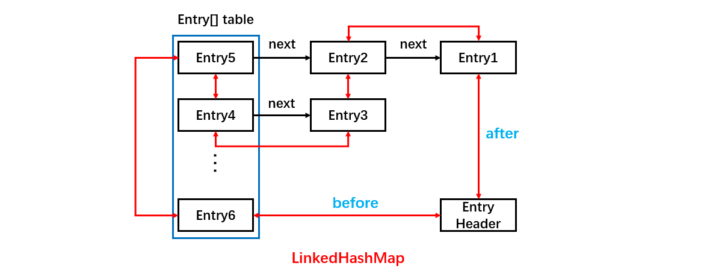
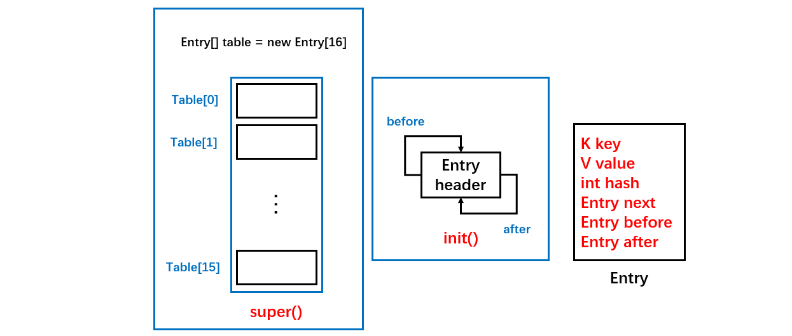
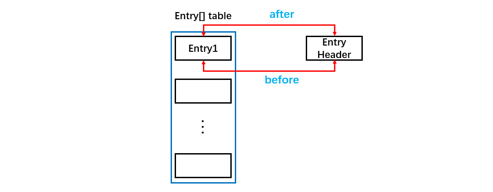
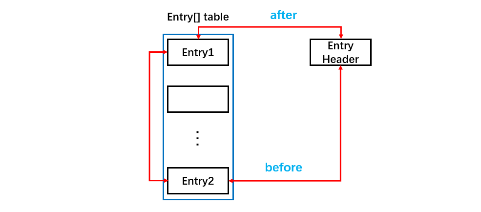
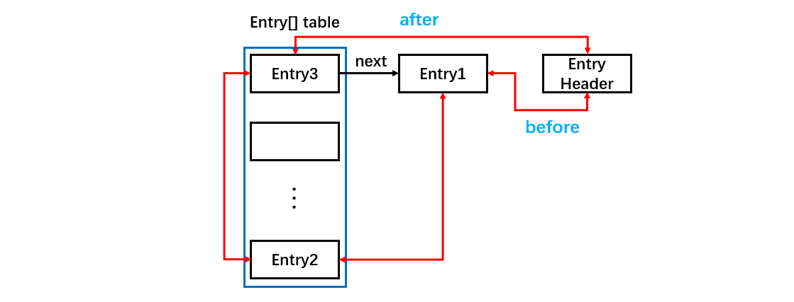
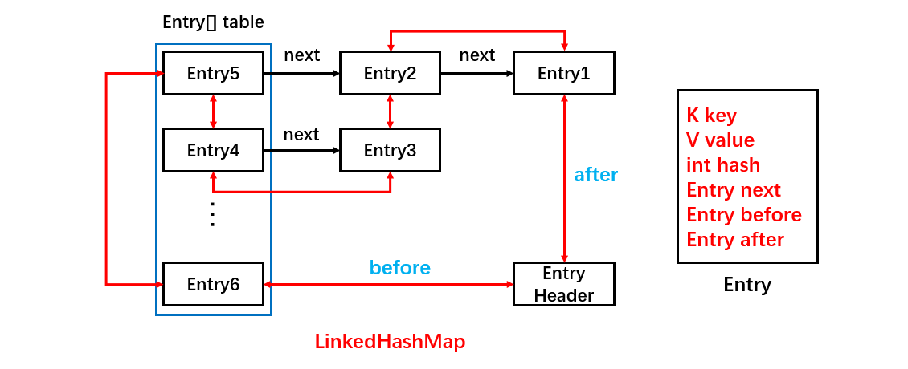

[TOC]

### LinkedHashMap

#### 1 本节要点

- LinkedHashMap 是 HashMap 的**子类**，但可以保持元素按**插入或访问有序**，与 TreeMap **按键**排序不同。
- HashMap 是**线程不安全**的，LinkedHashMap 同样是线程**不安全**的。
- LinkedHashMap 可以设置顺序为插入顺序或访问顺序。
- LinkedHashMap 其实可以看成 HashMap + 双向链表组成。


#### 2 基本使用

HashMap 是**无序**的，当我们希望有顺序地去存储 key-value 时，就需要使用 LinkedHashMap

```java
// 使用HashMap
Map<String, String> hashMap = new HashMap<String, String>();
hashMap.put("name1", "josan1");
hashMap.put("name2", "josan2");
hashMap.put("name3", "josan3");
Set<Entry<String, String>> set = hashMap.entrySet();
Iterator<Entry<String, String>> iterator = set.iterator();
while(iterator.hasNext()) {
    Entry entry = iterator.next();
    String key = (String) entry.getKey();
    String value = (String) entry.getValue();
    System.out.println("key:" + key + ",value:" + value);
}
// key:name3,value:josan3
// key:name1,value:josan1
// key:name2,value:josan2

// 使用LinkedHashMap
Map<String, String> linkedHashMap = new LinkedHashMap<>();
linkedHashMap.put("name1", "josan1");
linkedHashMap.put("name2", "josan2");
linkedHashMap.put("name3", "josan3");
Set<Entry<String, String>> set = linkedHashMap.entrySet();
Iterator<Entry<String, String>> iterator = set.iterator();
while(iterator.hasNext()) {
    Entry entry = iterator.next();
    String key = (String) entry.getKey();
    String value = (String) entry.getValue();
    System.out.println("key:" + key + ",value:" + value);
}
// key:name1,value:josan1
// key:name2,value:josan2
// key:name3,value:josan3
```

结果可知，LinkedHashMap 是有序的，且**默认**为==**插入顺序**==（还有一种访问顺序）。

跟 HashMap 一样，它也是提供了 key-value 的存储方式，并提供了 **put** 和 **get** 方法来进行数据存取。


#### 3 源码分析

LinkedHashMap 结构如下图。



继承自 HashMap，因此具有和 HashMap 一样的**快速查找**特性。

```java
public class LinkedHashMap<K,V> extends HashMap<K,V> implements Map<K,V>
```

##### ① 构造方法

有多个构造方法，无参的如下

```java
public LinkedHashMap() {
    // 调用HashMap的构造方法，其实就是初始化Entry[] table
    super();
    // 这里是指是否基于访问排序，默认为false
    accessOrder = false;
}    public LinkedHashMap() {
    // 调用HashMap的构造方法，其实就是初始化Entry[] table
    super();
    // 这里是指是否基于访问排序，默认为false
    accessOrder = false;
}
```

首先使用 super 调用了父类 **HashMap** 的构造方法，其实就是根据初始容量、负载因子去初始化 Entry[] table。

然后把 accessOrder 设置为 false，这就跟**存储的顺序**有关了，LinkedHashMap 存储数据是有序的，而且分为两种：==**插入顺序和访问顺序。**==

这里 **accessOrder** 设置为 false，表示不是访问顺序而是**插入顺序**存储的，这也是**默认值**，表示 LinkedHashMap中存储的顺序是按照调用 put 方法插入的顺序进行排序的。

LinkedHashMap 也提供了可以设置 accessOrder 的构造方法，如下设置是按照**访问顺序**进行存储，此时非常适合用于 **LRU 缓存**。

```java
// 第三个参数用于指定accessOrder值
Map<String, String> linkedHashMap = new LinkedHashMap<>(16, 0.75f, true);
linkedHashMap.put("name1", "josan1");
linkedHashMap.put("name2", "josan2");
linkedHashMap.put("name3", "josan3");
System.out.println("开始时顺序：");
Set<Entry<String, String>> set = linkedHashMap.entrySet();
Iterator<Entry<String, String>> iterator = set.iterator();
while(iterator.hasNext()) {
    Entry entry = iterator.next();
    String key = (String) entry.getKey();
    String value = (String) entry.getValue();
    System.out.println("key:" + key + ",value:" + value);
}
System.out.println("通过get方法，导致key为name1对应的Entry到表尾");
linkedHashMap.get("name1");
Set<Entry<String, String>> set2 = linkedHashMap.entrySet();
Iterator<Entry<String, String>> iterator2 = set2.iterator();
while(iterator2.hasNext()) {
    Entry entry = iterator2.next();
    String key = (String) entry.getKey();
    String value = (String) entry.getValue();
    System.out.println("key:" + key + ",value:" + value);
}
// 开始时顺序：
// key:name1,value:josan1
// key:name2,value:josan2
// key:name3,value:josan3
// 通过get方法，导致key为name1对应的Entry到表尾
// key:name2,value:josan2
// key:name3,value:josan3
// key:name1,value:josan1
```

因为调用了get("name1")导致了 name1 对应的 Entry 移动到了 Map 最后。

##### ② 初始化

在 HashMap 的构造函数中，调用了 init 方法，而在 HashMap 中 init 方法是空实现，但 LinkedHashMap 重写了该方法，所以在 LinkedHashMap 的构造方法里，调用了自身的 init 方法，init 的重写实现如下：

```java
/**
 * Called by superclass constructors and pseudoconstructors (clone,
 * readObject) before any entries are inserted into the map.  Initializes
 * the chain.
 */
@Override
void init() {
    // 创建了一个hash = -1，key、value、next都为null的Entry
    header = new Entry<>(-1, null, null, null);
    // 让创建的Entry的before和after都指向自身，注意after不是之前提到的next
    // 其实就是创建了一个只有头部节点的双向链表
    header.before = header.after = header;
}
```

##### ==③ 结点结构==

**HashMap** 中**静态内部类** Entry 是这样定义的。

```java
static class Entry<K,V> implements Map.Entry<K,V> {
    final K key;
    V value;
    Entry<K,V> next;
    int hash;
}    
```

LinkedHashMap 有自己的静态内部类 Entry，它**继承**了上述的 HashMap.Entry，定义如下:

```java
/**
 * LinkedHashMap entry.
 */
private static class Entry<K,V> extends HashMap.Entry<K,V> {
    // These fields comprise the doubly linked list used for iteration.
    Entry<K,V> before, after;

    Entry(int hash, K key, V value, HashMap.Entry<K,V> next) {
        super(hash, key, value, next);
	}
}    
```

所以 LinkedHashMap 构造函数，主要就是调用 HashMap 构造函数初始化了一个 Entry[] table，然后调用自身的init 初始化了一个**只有头结点的==双向链表==**。用来维护插入顺序或者 **LRU** 顺序。参数 **accessOrder** 用于指定是否按**访问顺序**，默认为 false，此时维护的是**插入顺序**。如果为 true，就是**访问顺序**。

```java
/**
 * The head (eldest) of the doubly linked list.
 */
transient LinkedHashMap.Entry<K,V> head;

/**
 * The tail (youngest) of the doubly linked list.
 */
transient LinkedHashMap.Entry<K,V> tail;

// 维护访问顺序
final boolean accessOrder;
```

完成了如下操作。



##### ④ put 方法

LinkedHashMap 的 put 方法如下（Java 9）：

```java
public V put(K key, V value) {
    return putVal(hash(key), key, value, false, true);
}
```

```java
/**
 * Implements Map.put and related methods
 *
 * @param hash hash for key
 * @param key the key
 * @param value the value to put
 * @param onlyIfAbsent if true, don't change existing value
 * @param evict if false, the table is in creation mode.
 * @return previous value, or null if none
 */
final V putVal(int hash, K key, V value, boolean onlyIfAbsent,
               boolean evict) {
    Node<K,V>[] tab; Node<K,V> p; int n, i;
    if ((tab = table) == null || (n = tab.length) == 0)
        n = (tab = resize()).length;
    if ((p = tab[i = (n - 1) & hash]) == null)
        tab[i] = newNode(hash, key, value, null);
    else {
        Node<K,V> e; K k;
        if (p.hash == hash &&
            ((k = p.key) == key || (key != null && key.equals(k))))
            e = p;
        else if (p instanceof TreeNode)
            e = ((TreeNode<K,V>)p).putTreeVal(this, tab, hash, key, value);
        else {
            for (int binCount = 0; ; ++binCount) {
                if ((e = p.next) == null) {
                    p.next = newNode(hash, key, value, null);
                    if (binCount >= TREEIFY_THRESHOLD - 1) // -1 for 1st
                        treeifyBin(tab, hash);
                    break;
                }
                if (e.hash == hash &&
                    ((k = e.key) == key || (key != null && key.equals(k))))
                    break;
                p = e;
            }
        }
        if (e != null) { // existing mapping for key
            V oldValue = e.value;
            if (!onlyIfAbsent || oldValue == null)
                e.value = value;
            // 重点
            afterNodeAccess(e);
            return oldValue;
        }
    }
    // 检测结构改变的量
    ++modCount;
    if (++size > threshold)
        // 扩容
        resize();
    // 重点
    afterNodeInsertion(evict);
    return null;
}
```

当 put 元素时，不但要把它加入到 **HashMap** 中去，还要加入到**双向链表**中，所以可以看出 LinkedHashMap 就是 ==**HashMap + 双向链表**== ，下面用图来表示逐步往 LinkedHashMap 中添加数据的过程，红色部分是双向链表，黑色部分是 HashMap 结构，header 是一个 Entry 类型的双向链表表头，本身不存储数据。

加入一个元素 Entry1， 假设 index 为 0，如下图。



加入 Entry2，假设 index 为 15，如下：



再添加一个 Entry3，假设其 index 为 0，如下图。



以上，就是 LinkedHashMap 的 put 的所有过程了，总体来看，跟 HashMap 的 put 类似，只不过多了把新增的Entry 加入到**双向列表**中。

##### ⑤ 扩容

在 HashMap 的 put 方法中，如果发现前元素个数超过了扩容阀值时，会调用 **resize** 方法。LinkedHashMap 重写了 **transfer** 方法，数据的迁移。可以看出，LinkedHashMap 扩容时，数据的再散列和 HashMap 是不一样的。

HashMap 是先遍历旧 table，再遍历旧 table 中每个元素的单向链表，取得 Entry 以后，重新计算 hash 值，然后存放到新 table 的对应位置。

LinkedHashMap 是遍历的双向链表，取得每一个 Entry，然后重新计算 hash 值，然后存放到新 table 的对应位置。

从遍历的效率来说，**遍历双向链表的效率要高于遍历 table**，因为遍历双向链表是 N 次（N为元素个数）；而遍历table 是 N + table 的空余个数（N为元素个数）。

##### ⑥ get 方法

代码如下（Java 9）

```java
public V get(Object key) {
    Node<K,V> e;
    if ((e = getNode(hash(key), key)) == null)
        return null;
    // 如果是true就是访问顺序，就会把最近访问的数据放到末尾
    if (accessOrder)
        // 顺序调整
        afterNodeAccess(e);
    return e.value;
}
```

##### ⑦ 顺序维护

LinkedHashMap 最重要的是以下用于**维护顺序的函数**，它们会在 **put、get** 等方法中调用。

```java
void afterNodeAccess(Node<K,V> p) { }
void afterNodeInsertion(boolean evict) { }
```

##### ⑧ ==afterNodeAccess()==

当一个节点被**访问**时，如果 accessOrder 为 **true** （即访问顺序），则会将该节点移到**链表尾部**。也就是说指定为 LRU 顺序之后，在每次访问一个节点时，会将这个节点移到**链表尾部**，保证**链表尾部是最近访问**的节点，那么**链表首部**就是==**最近最久未使用**==的节点。适合用来做 LRU。

```java
void afterNodeAccess(Node<K,V> e) { // move node to last
    LinkedHashMap.Entry<K,V> last;
    if (accessOrder && (last = tail) != e) {
        LinkedHashMap.Entry<K,V> p =
            (LinkedHashMap.Entry<K,V>)e, b = p.before, a = p.after;
        p.after = null;
        if (b == null)
            head = a;
        else
            b.after = a;
        if (a != null)
            a.before = b;
        else
            last = b;
        if (last == null)
            head = p;
        else {
            p.before = last;
            last.after = p;
        }
        tail = p;
        ++modCount;
    }
}
```

##### ⑨ ==afterNodeInsertion()==

在 put 等操作之后执行，当 removeEldestEntry() 方法返回 true 时会**移除最晚**的节点，也就是链表**首部**节点 first。

evict 只有在构建 Map 的时候才为 false，在这里为 true。

```java
void afterNodeInsertion(boolean evict) { // possibly remove eldest
    LinkedHashMap.Entry<K,V> first;
    if (evict && (first = head) != null && removeEldestEntry(first)) {
        K key = first.key;
        removeNode(hash(key), key, null, false, true);
    }
}
```

removeEldestEntry() 默认为 false，如果需要让它为 true，需要继承 LinkedHashMap 并且覆盖这个方法的实现，这在实现 **LRU 的缓存**中特别有用，通过移除最近最久未使用的节点，从而保证缓存空间足够，并且缓存的数据都是热点数据。

```java
protected boolean removeEldestEntry(Map.Entry<K,V> eldest) {
    return false;
}
```


#### 4 HashMap 与 LinkedHashMap 对比

- 看看 HashMap 和 LinkedHashMap 的存储结构图，LinkedHashMap 其实就是可以看成 HashMap 的基础上，多了一个**双向链表**来维持顺序。




- LinkedHashMap 是继承于 HashMap，是基于 HashMap 和双向链表来实现的。
- HashMap 无序；LinkedHashMap 有序，可分为插入顺序和访问顺序两种。如果是访问顺序，那 put 和 get操作已存在的 Entry 时，都会把 Entry 移动到双向链表的表尾(其实是先删除再插入)。
- LinkedHashMap 存取数据，还是跟 HashMap 一样使用的 Entry[] 的方式，双向链表只是为了保证顺序。
- LinkedHashMap 是线程不安全的。
- LinkedHashMap 及其节点类 LinkedHashMap.Entry 重写了部分方法来实现了对顺序的控制。


#### 5 LRU 缓存应用

以下是使用 LinkedHashMap 实现的一个 LRU 缓存：

- 设定**最大缓存**空间 MAX_ENTRIES  为 3；
- 使用 LinkedHashMap 的构造函数将 accessOrder 设置为 **true**，开启 LRU 顺序；
- **覆盖** removeEldestEntry() 方法实现，在节点多于 MAX_ENTRIES 就会将最近最久未使用的数据移除。

```java
class LRUCache<K, V> extends LinkedHashMap<K, V> {
    private static final int MAX_ENTRIES = 3;

    // 覆写
    protected boolean removeEldestEntry(Map.Entry eldest) {
        return size() > MAX_ENTRIES;
    }

    LRUCache() {
        super(MAX_ENTRIES, 0.75f, true);
    }
}
```

```java
public static void main(String[] args) {
    LRUCache<Integer, String> cache = new LRUCache<>();
    cache.put(1, "a");
    cache.put(2, "b");
    cache.put(3, "c");
    cache.get(1);
    cache.put(4, "d");
    System.out.println(cache.keySet());
}
```

```html
[3, 1, 4]
```


