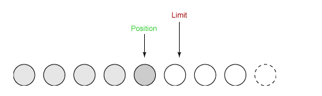
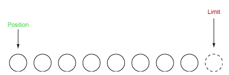

[TOC]

### Java IO

#### BIO

BIO（Blocking IO） 是面向流的阻塞 IO。Java BIO 面向流意味着每次从流中读一个或多个字节，直到读取所有字节，**没有被缓存**到任何地方。

阻塞的时候线程什么都不能做。


#### NIO

新的输入/输出 (NIO) 库是在 JDK **1.4** 中引入的，弥补了原来的 I/O 的不足，提供了**高速的、面向块**的 I/O。

##### 1. 流与块

I/O 与 NIO 最重要的区别是数据打包和传输的方式，==I/O 以**流**的方式处理数据，而 NIO 以**块**的方式处理数据==。

面向流的 I/O 一次处理**一个字节数据**：一个输入流产生一个字节数据，一个输出流消费一个字节数据。为流式数据创建过滤器非常容易，链接几个过滤器，以便每个过滤器只负责复杂处理机制的一部分。不利的一面是，面向流的 I/O 通常相当慢。

面向块的 I/O 一次处理**一个数据块**，按块处理数据比按流处理数据要快得多。但是面向块的 I/O 缺少一些面向流的 I/O 所具有的优雅性和简单性。

I/O 包和 NIO 已经很好地集成了，java.io.\* 已经以 NIO 为基础重新实现了，所以现在它可以利用 NIO 的一些特性。例如，java.io.\* 包中的一些类包含以块的形式读写数据的方法，这使得即使在面向流的系统中，处理速度也会更快。


##### 2. 通道与缓冲区

###### ① 通道 Channel

通道 **Channel** 是对原 I/O 包中的**流的模拟**，可以通过它**读取和写入**数据。

通道与流的不同之处在于，**流**只能在**一个方向**上移动(一个流必须是 **InputStream** 或者 **OutputStream** 的子类)，而**通道是==双向==**的，可以用于读、写或者**同时**用于读写。

**通道**包括以下类型，都实现了 **Channel 接口**：

- FileChannel：从**文件**中读写数据；
- DatagramChannel：通过 **UDP** 读写网络中数据；
- SocketChannel：通过 **TCP** 读写网络中数据；
- ServerSocketChannel：可以监听新进来的 TCP 连接，对每一个新进来的连接都会创建一个 SocketChannel。

###### ② 缓冲区 Buffer

发送给一个通道的**所有数据**都必须首先放到**缓冲区**中，同样地，从通道中读取的任何数据都要先**读到缓冲区**中。也就是说，==**不会直接对通道进行读写数据，而是要先经过缓冲区**==。

缓冲区实质上是一个**数组**，但它不仅仅是一个**数组**。缓冲区提供了对数据的结构化访问，而且还可以跟踪系统的读/写进程。

缓冲区包括以下常见类型，它们都继承于**抽象类 Buffer** 。

- ByteBuffer、CharBuffer、ShortBuffer、IntBuffer、LongBuffer、FloatBuffer、DoubleBuffer


##### 3. 缓冲区状态变量

- **capacity**：**最大容量**；
- **position**：当前**已经读写**的字节数；
- **limit**：**还可以读写**的字节数。

Buffer 的操作一般遵循四个步骤，操作分为**读模式和写模式**：

- 写入数据到 Buffer。
- 调用 flip() 方法。可以将写模式切换到读模式。
- 从 Buffer 中读取数据。
- 调用 clear() 方法。

状态变量的改变过程举例：

① 通过 Buffer 的 **allocate**() 方法进行内存**分配**。新建一个大小为 8 个字节的缓冲区，此时 position 为 0，而 limit = capacity = 8。**capacity** 变量**不会改变**，下面的讨论会忽略它。


② 写模式中，从输入通道中读取 5 个字节数据**写入**缓冲区中，此时 **position** 为 5，limit 保持**不变**。这时候的 limit 为可以写入的**最大值**。


③ 在将**缓冲区**的数据写到**输出通道**之前，需要先调用 **flip()** 方法，这个方法**将 limit 设置为当前 position**，并将 **position 设置为 0**。这可以保证写出的数据**正好**是之前写入缓冲区的数据，因为到了 limit 位置就截止。**flip()** 可以将写模式切换到读模式。读模式下，limit 变成写数据时的 position 值，代表能够**读出的数据量值**。


④ 从缓冲区中**取 4 个字节到输出通道**中，此时 position 设为 4。



⑤ 最后需要调用 **clear()** 方法来**清空缓冲区**，此时 **position 和 limit** 都被设置为**最初位置**。




##### 4. 选择器 Selector

NIO 常常被叫做**非阻塞 IO**，主要是因为 NIO 在**网络通信**中的非阻塞特性被广泛使用。

NIO 实现了 ==IO **多路复用**中的 **Reactor** 模型==，**一个线程** Thread 使用一个**选择器** Selector 通过**轮询**的方式去监听多个通道 Channel 上的事件，从而让一个线程就可以处理多个事件。

通过配置监听的通道 Channel 为**非阻塞**，那么当 Channel 上的 IO 事件还未到达时，就不会进入阻塞状态一直等待，而是**继续轮询**其它 Channel，找到 IO **事件已经到达**的 Channel 执行。

因为创建和切换线程的开销很大，因此使用**一个线程来处理多个事件**而不是一个线程处理一个事件，对于 IO 密集型的应用具有很好地性能。

一个 Selector 可以**同时轮询多个** Channel，因为 JDK 使用了 **epoll**() 代替传统的 select() 实现，**没有**最大连接句柄的限制，所以只需要一个线程负责 Selector 轮询，就可以接入**成千上万**的客户端。

应该注意的是，只有**套接字 Channel** 才能配置为非阻塞，而 FileChannel 不能，为 FileChannel 配置非阻塞也没有意义。


###### ① 创建选择器

```java
Selector selector = Selector.open();
```

###### ② 将通道注册到选择器上

```java
// 打开一个服务端Channel
ServerSocketChannel ssChannel = ServerSocketChannel.open();
// 设置为非阻塞 必须配置
ssChannel.configureBlocking(false);
// 将Channel注册到Selector上
ssChannel.register(selector, SelectionKey.OP_ACCEPT);
```

**通道**必须配置为**非阻塞模式**，否则使用选择器就没有任何意义了，因为如果通道在某个事件上被阻塞，那么服务器就不能响应其它事件，必须等待这个事件处理完毕才能去处理其它事件，显然这和选择器的作用背道而驰。

在将通道**注册**到选择器上时，还需要指定要**注册的具体事件**，主要有以下几类：

- SelectionKey.**OP_CONNECT**：连接就绪
- SelectionKey.**OP_ACCEPT**：接收就绪
- SelectionKey.**OP_READ**：读就绪
- SelectionKey.**OP_WRITE**：写就绪

它们在 SelectionKey 的定义如下：

```java
public static final int OP_READ = 1 << 0;
public static final int OP_WRITE = 1 << 2;
public static final int OP_CONNECT = 1 << 3;
public static final int OP_ACCEPT = 1 << 4;
```

可以看出每个事件可以被当成一个**位域**，从而组成**事件集整数**。例如：

```java
int interestSet = SelectionKey.OP_READ | SelectionKey.OP_WRITE;
```

###### ③ 监听事件

```java
int num = selector.select();
```

使用 select() 来**监听**到达的事件，它会**一直阻塞**直到有**至少一个**事件到达，可能有多个事件到达。

###### ④ 获取到达的事件

Selector 在有通道就绪的时候返回 SelectionKey 的集合，之后可以进行数据处理。这里循环遍历已经选择键集合中的**每一个键**，并检测各个**键所对应的通道就绪事件**。

```java
// 遍历SelectionKey事件
Set<SelectionKey> keys = selector.selectedKeys();
Iterator<SelectionKey> keyIterator = keys.iterator();
while (keyIterator.hasNext()) {
    SelectionKey key = keyIterator.next();
    if (key.isAcceptable()) {
        // ...
    } else if (key.isReadable()) {
        // ...
    }
    keyIterator.remove();
}
```

###### ⑤ 事件循环

因为一次 select() 调用**不能处理完所有的事件**，并且服务器端有可能需要一直监听事件，因此服务器端**处理事件**的代码一般会放在一个**死循环**内。

```java
while (true) {
    int num = selector.select();
    Set<SelectionKey> keys = selector.selectedKeys();
    Iterator<SelectionKey> keyIterator = keys.iterator();
    while (keyIterator.hasNext()) {
        SelectionKey key = keyIterator.next();
        if (key.isAcceptable()) {
            // ...
        } else if (key.isReadable()) {
            // ...
        }
        keyIterator.remove();
    }
}
```

##### 5. 文件 NIO

使用 NIO 读取数据基本流程：

- 从 FileInputStream 获取 Channel。
- 创建 Buffer。
- 将数据从 Channel 读取到 Buffer 中。

以下展示了使用 **NIO 快速复制文件**的实例：

```java
public static void fastCopy(String src, String dist) throws IOException {

    /* 获得源文件的输入字节流 */
    FileInputStream fin = new FileInputStream(src);

    /* 获取输入字节流的文件通道 */
    FileChannel fcin = fin.getChannel();

    /* 获取目标文件的输出字节流 */
    FileOutputStream fout = new FileOutputStream(dist);

    /* 获取输出字节流的文件通道 */
    FileChannel fcout = fout.getChannel();

    /* 为缓冲区分配 1024 个字节 */
    ByteBuffer buffer = ByteBuffer.allocateDirect(1024);

    while (true) {

        /* 从输入通道中读取数据到缓冲区中 */
        int r = fcin.read(buffer);

        /* read() 返回 -1 表示 EOF */
        if (r == -1) {
            break;
        }

        /* 切换读写 */
        buffer.flip();

        /* 把缓冲区的内容写入输出文件中 */
        fcout.write(buffer);

        /* 清空缓冲区 */
        buffer.clear();
    }
}
```


##### 6. 套接字 NIO 实例

NIO服务器

```java
public class NIOServer {

    public static void main(String[] args) throws IOException {
		// 创建选择器
        Selector selector = Selector.open();	
		// 创建Channel
        ServerSocketChannel ssChannel = ServerSocketChannel.open();
        // 设置Channel为非阻塞 必须
        ssChannel.configureBlocking(false);
        // 注册Channel到Selector上并制定事件
        ssChannel.register(selector, SelectionKey.OP_ACCEPT);
		// 通过Channel获取服务Socket
        ServerSocket serverSocket = ssChannel.socket();
        InetSocketAddress address = new InetSocketAddress("127.0.0.1", 8888);
        // 绑定端口
        serverSocket.bind(address);
		// 死循环监听
        while (true) {
			// 调用完成则阻塞 直到事件到达
            selector.select();
            // 遍历SelectionKey
            Set<SelectionKey> keys = selector.selectedKeys();
            Iterator<SelectionKey> keyIterator = keys.iterator();

            while (keyIterator.hasNext()) {
				
                SelectionKey key = keyIterator.next();
				// 判断SelectionKey的类型
                if (key.isAcceptable()) {

                    ServerSocketChannel ssChannel1 = (ServerSocketChannel) key.channel();

                    // 服务器会为每个新连接创建一个 SocketChannel
                    SocketChannel sChannel = ssChannel1.accept();
                    sChannel.configureBlocking(false);

                    // 这个新连接主要用于从客户端读取数据
                    sChannel.register(selector, SelectionKey.OP_READ);

                } else if (key.isReadable()) {

                    SocketChannel sChannel = (SocketChannel) key.channel();
                    System.out.println(readDataFromSocketChannel(sChannel));
                    sChannel.close();
                }

                keyIterator.remove();
            }
        }
    }

    // 从socket通道中读取数据
    private static String readDataFromSocketChannel(SocketChannel sChannel) throws IOException {
		// 分配缓冲区
        ByteBuffer buffer = ByteBuffer.allocate(1024);
        StringBuilder data = new StringBuilder();

        while (true) {
            buffer.clear();
            int n = sChannel.read(buffer);
            if (n == -1) {
                break;
            }
            // 冲刷缓冲区
            buffer.flip();
            int limit = buffer.limit();
            char[] dst = new char[limit];
            for (int i = 0; i < limit; i++) {
                dst[i] = (char) buffer.get(i);
            }
            data.append(dst);
            // 清理缓冲区
            buffer.clear();
        }
        return data.toString();
    }
}
```

NIO客户端

```java
public class NIOClient {

    public static void main(String[] args) throws IOException {
        Socket socket = new Socket("127.0.0.1", 8888);
        OutputStream out = socket.getOutputStream();
        String s = "hello world";
        out.write(s.getBytes());
        out.close();
    }
}
```

##### 7. 对比

NIO 与普通 I/O 的区别主要有以下两点：

- NIO 是**非阻塞**的；
- NIO 面向**块**，I/O 面向流。
- NIO 对于处理有**大量连接**的场景比较好，比如 P2P 网络，聊天服务器等。而 BIO 对于少量连接并发送大量数据的场景是比较适合的。


#### AIO

AIO（Asynchronous IO）是 Java7 才实现的真正**异步**的 IO。它把 IO 读写操作完全交给了操作系统。

AIO 最大的一个特性就是**异步能力**，这种能力对 socket 与文件 I/O 都起作用。AIO 其实是一种在**读写操作结束之前允许进行其他操作的 I/O 处理**。AIO 是对 JDK1.4 中提出的**同步非阻塞 I/O(NIO)** 的进一步增强。

Jdk7 主要增加了三个新的**异步通道**:

- **AsynchronousFileChannel**: 用于**文件**异步读写；
- **AsynchronousSocketChannel**: **客户端**异步 socket；
- **AsynchronousServerSocketChannel**: **服务器**异步 socket。

因为 AIO 的实施需充分调用 OS 参与，IO 需要操作系统支持、并发也同样需要操作系统的支持，所以性能方面不同操作系统差异会比较明显。

##### Reactor与Proactor

- 两种 **IO 多路复用**方案: **Reactor and Proactor。**
- Reactor 模式是基于**同步I/O**的，而 Proactor 模式是和**异步** I/O 相关的。
- Reactor：能收了你跟俺说一声。Proactor: 你给我收十个字节，收好了跟俺说一声。

##### 实例

下面以一个最简单的 Time 服务的例子演示如何使用异步 I/O。 客户端连接到服务器后服务器就发送一个当前的时间字符串给客户端。 客户端毋须发送请求。 逻辑很简单。

**Server**

```java
public class Server {
    private static Charset charset = Charset.forName("US-ASCII");
    private static CharsetEncoder encoder = charset.newEncoder();

    public static void main(String[] args) throws Exception {
        AsynchronousChannelGroup group = AsynchronousChannelGroup.withThreadPool(Executors.newFixedThreadPool(4));
        AsynchronousServerSocketChannel server = AsynchronousServerSocketChannel.open(group).bind(new InetSocketAddress("0.0.0.0", 8013));
        server.accept(null, new CompletionHandler<AsynchronousSocketChannel, Void>() {
            @Override
            public void completed(AsynchronousSocketChannel result, Void attachment) {
                server.accept(null, this); // 接受下一个连接
                try {
                    String now = new Date().toString();
                    ByteBuffer buffer = encoder.encode(CharBuffer.wrap(now + "\r\n"));
                    //result.write(buffer, null, new CompletionHandler<Integer,Void>(){...}); //callback or
                    Future<Integer> f = result.write(buffer);
                    f.get();
                    System.out.println("sent to client: " + now);
                    result.close();
                } catch (IOException | InterruptedException | ExecutionException e) {
                    e.printStackTrace();
                }
            }
            @Override
            public void failed(Throwable exc, Void attachment) {
                exc.printStackTrace();
            }
        });
        group.awaitTermination(Long.MAX_VALUE, TimeUnit.SECONDS);
    }
}
```

这个例子使用了两种方式。 `accept`使用了**回调**的方式， 而发送数据使用了`future`的方式。

**Client**

```java
public class Client {
    public static void main(String[] args) throws Exception {
        AsynchronousSocketChannel client = AsynchronousSocketChannel.open();
        Future<Void> future = client.connect(new InetSocketAddress("127.0.0.1", 8013));
        future.get();

        ByteBuffer buffer = ByteBuffer.allocate(100);
        client.read(buffer, null, new CompletionHandler<Integer, Void>() {
            @Override
            public void completed(Integer result, Void attachment) {
                System.out.println("client received: " + new String(buffer.array()));

            }
            @Override
            public void failed(Throwable exc, Void attachment) {
                exc.printStackTrace();
                try {
                    client.close();
                } catch (IOException e) {
                    e.printStackTrace();
                }

            }
        });

        Thread.sleep(10000);
    }
}
```

客户端也使用了两种方式， `connect`使用了 **future** 方式，而接收数据使用了**回调**的方式。

##### Netty AIO

Netty 也支持 AIO 并提供了相应的类： `AioEventLoopGroup`,`AioCompletionHandler`, `AioServerSocketChannel`, `AioSocketChannel`， `AioSocketChannelConfig`。
其它使用方法和 NIO 类似。