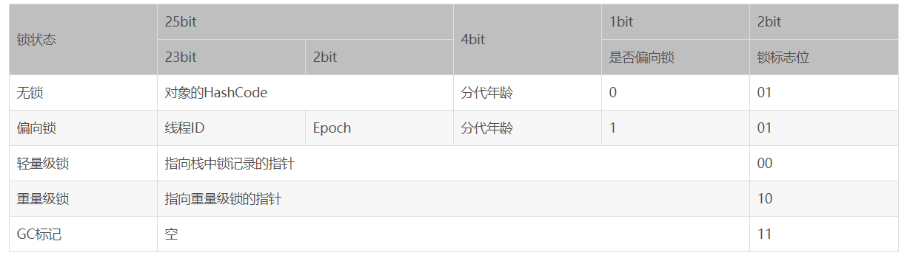

[TOC]

## 线程互斥同步

### 一、概述

每个**线程**有自己的程序计数器，有自己的**栈**，但是线程之间可能存在**共享内存**，可以访问与操作**相同的对象**。因此可能存在**竞争**问题。

#### 竞态条件

当多**个线程**访问与操作**同一个对象**时，最终执行的结果与执行时序有关，可能正确也可能不正确。

如果多个线程对同一个共享数据进行访问而不采取**同步操作**的话，那么操作的结果可能是不一致的。

以下代码演示了 1000000 个线程同时对 cnt 执行**自增**操作，操作结束之后它的值有可能小于 1000000。

```java
public class ThreadUnsafeExample {

    private int cnt = 0;
	
    //  自增操作
    public void add() {
        cnt++;
    }

    public int get() {
        return cnt;
    }
}
```

```java
public static void main(String[] args) throws InterruptedException {
    final int threadSize = 1000000;
    ThreadUnsafeExample example = new ThreadUnsafeExample();
    final CountDownLatch countDownLatch = new CountDownLatch(threadSize);
    // 线程池
    ExecutorService executorService = Executors.newCachedThreadPool();
    // 多个线程操作cnt变量
    for (int i = 0; i < threadSize; i++) {
        executorService.execute(() -> {
            example.add();
            countDownLatch.countDown();
        });
    }
    // 等待完成
    try {
        countDownLatch.await();
    } catch (InterruptedException e) {
        e.printStackTrace();
    }
    executorService.shutdown();
    System.out.println(example.get());
}
```

```html
998236
```

远远小于 100000，出大问题。

解决的方法：

- 使用 **synchronized** 关键字；
- 使用**显示锁**；
- 使用**原子变量**。


### 二、Synchronized锁

#### 概述

Java 提供了**两种锁机制**来控制多个线程对共享资源的**互斥访问**，第一个是 JVM 实现的 **synchronized**，而另一个是 JDK 实现的基于 API 的 **ReentrantLock**。

使用了**synchronized** 就变成了原子操作。

> **说一说自己对于 synchronized 关键字的了解**

synchronized 关键字解决的是多个线程之间访问资源的**同步性**，synchronized 关键字可以保证被它**修饰的方法或者代码块**在任意时刻只能有**一个线程**执行。

可以使用 **synchronized** 互斥锁来保证操作的**原子性**，以解决前述的静态条件问题。

对自增方法**加锁**，保证只有一个线程能操作此方法

```java
public class AtomicSynchronizedExample {
    private int cnt = 0;
	// 方法加锁
    public synchronized void add() {
        cnt++;
    }

    public synchronized int get() {
        return cnt;
    }
}
```

```java
public static void main(String[] args) throws InterruptedException {
    final int threadSize = 1000;
    AtomicSynchronizedExample example = new AtomicSynchronizedExample();
    final CountDownLatch countDownLatch = new CountDownLatch(threadSize);
    ExecutorService executorService = Executors.newCachedThreadPool();
    for (int i = 0; i < threadSize; i++) {
        executorService.execute(() -> {
            example.add();
            countDownLatch.countDown();
        });
    }
    countDownLatch.await();
    executorService.shutdown();
    System.out.println(example.get());
}
```

输出为：

```html
1000
```


#### synchronized基本用法

synchronized **保护的是一个对象**。

##### 1. 同步代码块和实例方法

**synchronized** 保护的是==**对象**==。

```java
// 同步代码块
public void func() {
    synchronized (this) {
        // ...
    }
}

// 同步实例方法
public synchronized void func () {
    // ...
}
```

它只作用于==**同一个对象**==，如果调用两个对象上的同步代码块，就**不会**进行同步，想一下如果是多个对象各自独立操作，其实不会存在竞争。即保护的是**同一个对象的方法调用**。再具体来说，synchronized 实例方法保护的是**当前实例对象**，**即 ==this==对象**。this 对象有一个**锁**和一个**等待队列**，锁只能被**一个线程持有**，其他线程需要锁时会尝试获取，没获取到就进入**等待队列**等待，并进入 **BLOCKED** 状态。

对于以下代码，使用 ExecutorService 执行了两个线程，由于调用的是**同一个对象的同步代码块**，因此这两个线程会进行同步，当一个线程进入**同步语句块**时，另一个线程就必须**等待**。

```java
public class SynchronizedExample {

    public void func1() {
        synchronized (this) {
            for (int i = 0; i < 10; i++) {
                System.out.print(i + " ");
            }
        }
    }
}
```

```java
public static void main(String[] args) {
    // 作用于同一个e1对象 需要等待
    SynchronizedExample e1 = new SynchronizedExample();
    ExecutorService executorService = Executors.newCachedThreadPool();
    executorService.execute(() -> e1.func1());
    executorService.execute(() -> e1.func1());
}
```

此时锁住的是 e1 这个对象，两个线程都在争取 e1 的对象锁。

```html
0 1 2 3 4 5 6 7 8 9 0 1 2 3 4 5 6 7 8 9
```

对于以下代码，两个线程调用了**不同对象**的同步代码块，两个对象**各自拥有**自己的锁和等待队列，因此这两个线程就**不需要同步**。从输出结果可以看出，两个线程交叉执行。相当于这里就有**两把锁**，不同的线程获得不同对象的锁。

```java
public static void main(String[] args) {
    // 由于同步的是代码块 所以使用两个不同对象的锁不用同步
    SynchronizedExample e1 = new SynchronizedExample();
    SynchronizedExample e2 = new SynchronizedExample();
    ExecutorService executorService = Executors.newCachedThreadPool();
    executorService.execute(() -> e1.func1());
    executorService.execute(() -> e2.func1());
}
```

```html
0 0 1 1 2 2 3 3 4 4 5 5 6 6 7 7 8 8 9 9
```

##### 2. 同步静态方法

synchronized 保护的是**对象**。对于**实例方法**，保护的是当前实例对象 this，而对于静态方法，保护的是==**类对象**==。即 **StaticCounter.class**。每个对象都有一个锁与等待队列，**类对象**也不例外。

静态成员不属于任何一个实例对象，是类成员（ static 表明这是该类的一个静态资源，不管new了多少个对象，只有一份）

synchronized 静态方法和 synchronized 实例方法保护的是不同的对象，**不同的两个线程可以一个执行 synchronized 静态方法，另一个执行 synchronized  实例方法。**因为**类对象**和**实例对象**属于**不同的对象**，两者都有其各自的锁与等待队列。

```java
public class StaticCounter {
    private static int count = 0;
    // 静态方法加锁
    public static synchronized void incr() {
        count++;
    }
}
```

锁住**静态方法**保证同时只能有一个线程在使用这个静态方法资源，如果有竞争就会等待。

##### 3. 同步一个类

```java
public void func() {
    synchronized (SynchronizedExample.class) {
        // ...
    }
}
```

作用于==**整个类**==，也就是说两个线程调用**同一个类**的**不同对象**上的这种同步语句，**也会进行同步**。

```java
public class SynchronizedExample {
    public void func2() {
        synchronized (SynchronizedExample.class) {
            for (int i = 0; i < 10; i++) {
                System.out.print(i + " ");
            }
        }
    }
}
```

```java
public static void main(String[] args) {
    // 由于是锁住整个类 所以同一个类的两个不同对象也需要等待
    SynchronizedExample e1 = new SynchronizedExample();
    SynchronizedExample e2 = new SynchronizedExample();
    ExecutorService executorService = Executors.newCachedThreadPool();
    executorService.execute(() -> e1.func2());
    executorService.execute(() -> e2.func2());
}
```

由于是锁住**整个类**，所以同一个类的**两个不同对象**也需要等待。

```html
0 1 2 3 4 5 6 7 8 9 0 1 2 3 4 5 6 7 8 9
```

**总结：** synchronized 关键字加到 **static 静态方法和 synchronized(class) 代码块上都是是给 Class 类上锁**。synchronized 关键字加到**实例方法**上或者**普通代码块**是给**对象实例**上锁。尽量**不要**使用 synchronized(String a) 因为 JVM 中，字符串常量池具有缓存功能！

#### synchronized的特性

##### 1. 可重入性

synchronized 是**可重入**的，即**同一个执行线程**，它获得了**对象锁**之后，可以**直接调用其他需要同样锁的代码**，无需等待。如在一个 synchronized **实例方法**内可以**直接调用**其他 synchronized **实例方法**。

可重入是通过记录锁的**持有线程**和持有**数量**来实现的。

##### 2. 内存可见性

synchronized 可以实现**原子操作**，避免出现**竞态条件**。同时还可以**解决内存可见性**问题，在**释放锁**时，所有的写入都会**写回内存**，获得锁后，都会从**内存**读取最新数据。而**不是利用的缓存**。

如果只是为了**保证内存可见性**，使用 synchronized 成本有点高，可以使用轻量级的 **volatile** 关键字，但是**不能解决竞态条件的问题。**

```java
private volatile boolean switch = false;
```

##### 3. 死锁

应该避免在持有一个锁的同时去申请另一个锁，如果确实需要多个锁，所有代码都应该**按照相同的顺序**去申请锁。

可以使用**显示锁 Lock** 的方式来**解决部分死锁**问题，它支持尝试获取锁和**带时间限制**的获取锁方法，使用这些方法可以在获取不到锁的时候放弃已经持有的锁。

##### 4. 性能

在 Java 早期版本中，synchronized 属于重量级锁，效率低下，因为**监视器锁**（monitor）是依赖于底层的操作系统的 Mutex Lock 来实现的，Java 的线程是映射到操作系统的原生线程之上的。如果要挂起或者唤醒一个线程，都需要操作系统帮忙完成，而操作系统实现线程之间的切换时需要从用户态转换到内核态，这个状态之间的转换需要相对比较长的时间，时间成本相对较高，这也是为什么早期的 synchronized 效率低的原因。庆幸的是在 Java 6 之后 Java 官方对从 JVM 层面对synchronized 较大优化，所以现在的 synchronized 锁效率也优化得很不错了。JDK1.6 对锁的实现引入了**大量的优化**，如**自旋锁、适应性自旋锁、锁消除、锁粗化、偏向锁、轻量级锁**等技术来减少锁操作的开销。


#### synchronized原理解析

synchronized  对应的内存间交互操作为：lock 和 unlock，在虚拟机实现上对应的字节码指令为 **monitorenter 和 monitorexit**。

**synchronized 关键字底层原理属于 JVM 层面。**

##### 1. 编译测试

###### **① synchronized 同步语句块的情况**

```java
public class SynchronizedDemo {
    public void method() {
        synchronized (this) {
            System.out.println("synchronized 代码块");
        }
    }
}
```

通过 JDK 自带的 javap 命令查看 SynchronizedDemo 类的相关**字节码**信息：首先切换到类的对应目录执行 **javac** SynchronizedDemo.java 命令生成**编译后的 .class 文件**，然后执行 **javap -c -s -v -l SynchronizedDemo.clas**s 反编译。

```java
public class javase.thread.SynchronizedDemo {
  public javase.thread.SynchronizedDemo();
    Code:
       0: aload_0
       1: invokespecial #1                  // Method java/lang/Object."<init>":()V
       4: return

  public void method();
    Code:
       0: aload_0
       1: dup
       2: astore_1
       3: monitorenter
       4: getstatic     #2                  // Field java/lang/System.out:Ljava/io/PrintStream;
       7: ldc           #3                  // String synchronized 代码块
       9: invokevirtual #4                  // Method java/io/PrintStream.println:(Ljava/lang/String;)V
      12: aload_1
      13: monitorexit
      14: goto          22
      17: astore_2
      18: aload_1
      19: monitorexit
      20: aload_2
      21: athrow
      22: return
    Exception table:
       from    to  target type
           4    14    17   any
          17    20    17   any
}
```

从上面我们可以看出：

**synchronized 同步语句块的实现使用的是 monitorenter 和 monitorexit 指令，其中 monitorenter 指令指向同步代码块的开始位置，monitorexit 指令则指明同步代码块的结束位置。** 当执行 monitorenter 指令时，线程试图**获取锁**也就是获取 **monitor**(monitor 对象存在于每个 Java 对象的**对象头**中，synchronized 锁便是通过这种方式获取锁的，也是为什么 **Java 中任意对象可以作为锁**的原因) 的持有权。当计数器为 0 则可以**成功获取**，获取后将**锁计数器**设为 1 也就是加 1。相应的在执行 **monitorexit** 指令后，将**锁计数器设为 0**，表明锁被释放。如果获取对象锁失败，那当前线程就要阻塞等待，直到锁被另外一个线程释放为止。如果有可重入的情况，锁计数器会持续**增加**。

###### **② synchronized 修饰方法的的情况**

```java
public class SynchronizedDemo2 {
	public synchronized void method() {
		System.out.println("synchronized 方法");
	}
}
```

同样执行上述操作获取字节码。

```java
{
  public javase.thread.SynchronizedDemo2();
    descriptor: ()V
    flags: (0x0001) ACC_PUBLIC
    Code:
      stack=1, locals=1, args_size=1
         0: aload_0
         1: invokespecial #1                  // Method java/lang/Object."<init>":()V
         4: return
      LineNumberTable:
        line 3: 0
      LocalVariableTable:
        Start  Length  Slot  Name   Signature
            0       5     0  this   Ljavase/thread/SynchronizedDemo2;

  public static synchronized void method();
    descriptor: ()V
    flags: (0x0029) ACC_PUBLIC, ACC_STATIC, ACC_SYNCHRONIZED
    Code:
      stack=2, locals=0, args_size=0
         0: getstatic     #2                  // Field java/lang/System.out:Ljava/io/PrintStream;
         3: ldc           #3                  // String synchronized 方法
         5: invokevirtual #4                  // Method java/io/PrintStream.println:(Ljava/lang/String;)V
         8: return
      LineNumberTable:
        line 6: 0
        line 7: 8
}
```

synchronized 修饰的方法并没有 monitorenter 指令和 monitorexit 指令，取得代之的确实是 **ACC_SYNCHRONIZED** 标识，该标识指明了该方法是一个**同步方法**（注意：要出现这个标识，javap 指令必须加 -v 参数，不然显示不完全），JVM 通过该 ACC_SYNCHRONIZED 访问标志来辨别一个方法是否声明为同步方法，从而执行相应的同步调用。

总结：Java 虚拟机中的 synchronized 是基于进入和退出 monitor 对象实现的，同步分为**显式同步和隐式同步**，同步**代码块**代表着**显式同步**，指的是有明确的 monitorenter 和 monitorexit 指令。**同步方法**代表着**隐式同步**，同步方法是由**方法调用指令**读取运行时常量池中方法的 **ACC_SYNCHRONIZED** 标志来隐式实现的。

##### 2. 对象头

在 HotSpot 虚拟机中，对象在内存中存储布局分为 **3 块区域**：**对象头（Header）、实例数据（Instance Data）、对齐填充（Padding）**，这里主要关注对象头。

HotSpot 虚拟机的对象头包括**两部分**（非数组对象）信息，如下图所示：

- 第一部分用于存储对象自身的**运行时数据**，如哈希码（HashCode）、GC 分代年龄、锁状态标志、线程持有的锁、偏向线程 ID、偏向时间戳、对象分代年龄，这部分信息称为**“Mark Word”**；Mark Word 被设计成一个非固定的数据结构以便在极小的空间内存储尽量多的信息，它会根据自己的状态**复用**自己的存储空间。
- 第二部分是**类型指针**，即对象指向它的**类元数据**的指针，虚拟机通过这个指针来确定这个对象是**哪个类**的实例；
- 如果对象是一个 Java **数组**，那在对象头中还必须有**一块**用于记录**数组长度**的数据。因为虚拟机可以通过普通 Java 对象的元数据信息确定 Java 对象的大小，但是从数组的元数据中无法确定数组的大小。

**Mark Word** 在不同的锁状态下存储的内容不同，在 32 位 JVM 中是这么存的：



重量级锁就是 synchronized 锁，锁的**标记位为 10**，其中指针指向 monitor 对象的**起始地址**。**每一个对象**都存在一个 **monitor** 与之相关联，monitor 对象可以与对象一起创建销毁或者当线程试图获取对象锁的时候自动生成，monitor 被**线程持有**之后就处于锁定的状态。JVM 中 monitor 是有 ObjectMonitor 实现的，其主要的数据结构为：

```c
ObjectMonitor() {
    _header       = NULL;
    _count        = 0; // 记录个数
    _waiters      = 0,
    _recursions   = 0;
    _object       = NULL;
    _owner        = NULL; // 指向只有monitor对象的线程
    _WaitSet      = NULL; // 处于wait状态的线程，会被加入到_WaitSet
    _WaitSetLock  = 0 ;
    _Responsible  = NULL ;
    _succ         = NULL ;
    _cxq          = NULL ;
    FreeNext      = NULL ;
    _EntryList    = NULL ; // 处于等待锁block状态的线程，会被加入到该列表
    _SpinFreq     = 0 ;
    _SpinClock    = 0 ;
    OwnerIsThread = 0 ;
  }
```

monitor 对象中有内部有**两个队列**，一个用来保存一个 **ObjectWaiter** 对象列表（每个等待这个锁的线程都会被封装成为ObjectWaiter对象)，owner 指向的是持有**持有 monitor 对象的线程**，当多个线程同时访问一段代码的时候，首先会进入 **_Entry_list 集合**，当线程获取到对象的 Monitor 后，会进入  _owner 区域并把 monitor 中的 owner 设置为**当前线程**，同时 monitor 中的**计数器 count 加 1**，如果线程调用 **wait**() 方法，将会**释放**当前持有的 **monitor**，owner 设置为 **null**， count 减 1，同时该线程进入 **WaitSet** 集合中**等待被唤醒**，如果当前线程执行完毕也将会释放 monitor 锁，owner 变为null，count 减 1。

整个过程可以参考下图。


**monitor 对象**存在每个 Java 对象的对象头中 (MarkWord 结构中存储了指向 **monitor 对象**的指针)，也就是为什么 notify，notifyall，wait 方法都**存在 Object 对象**中的原因。

总结 synchronized 修饰方法可以看出，JVM 通过判断 ACC_SYNCHRONIZED 访问标志来判别一个方法是否是同步方法，进而获取 monitor 对象，在早期 synchronized 是重量锁效率低，因为 monitor 是依赖底层操作系统来实现的，而操作系统实现线程之间的转换需要从用户太转换到核心态，这个转换要浪费很多时间，后来从 JVM 层面对 synchronized 有了很大的优化，为了减少获得锁或者是释放锁的性能消耗，引入了**轻量级锁和偏向锁**，所以现在的 synchronized 还可以。


### 三、显式锁

显式锁是基于 API 的。

#### Lock 接口

##### 1. 概述

**synchronized** 方法或语句的使用提供了对与每个**对象**相关的隐式监视器锁的访问，但却强制所有锁获取和释放均要出现在一个块结构中：当获取了**多个锁**时，它们必须以**相反的顺序释放**，且必须在与所有锁被获取时相同的词法范围内释放所有锁。

这个时候 Lock 出现。Lock 不是 Java 中的关键字而是 java.util.concurrent.**locks** 包中的一个**接口**。

`Lock` 实现提供了比使用 `synchronized` 方法和语句可获得的更广泛的**锁定**操作。此实现允许更灵活的结构，可以具有差别很大的属性，可以支持多个相关的 **`Condition`** 对象。

Lock 相对于 synchronized 关键字而言**更加灵活**，你可以自由的选择想要加锁的地方。当然更高的自由度也带来更多的责任。

我们通常会在 **try...catch 模块**之前使用 **lock** 关键字，在 **finally** 模块中**释放锁**（保证锁必须释放）。下面是示范代码。

```java
Lock myLock = ...; 
myLock.lock();
try {
    // access the resource protected by this lock
} finally {
    myLock.unlock();
}
```

锁的锁定和释放如果在不同的模块时，需要谨慎编码，确保最后锁一定能够得到**释放**。

##### 2. 源码分析

Lock 接口源码如下。

```java
// 获取锁。如果锁不可用，出于线程调度目的，将禁用当前线程，并且在获得锁之前，该线程将一直处于休眠状态
void lock() 

// 如果当前线程未被中断，则获取锁。
void lockInterruptibly() 

// 返回绑定到此Lock实例的新Condition实例。
Condition newCondition() 

// 仅在调用时锁为空闲状态才获取该锁。如果锁可用，则获取锁，并立即返回值true。如果锁不可用，则此方法将立即返回值false。
boolean tryLock() 

// 如果锁在给定的等待时间内空闲，并且当前线程未被中断，则获取锁。
boolean	tryLock(long time, TimeUnit unit) 

// 释放锁。在等待条件前，锁必须由当前线程保持。调用 Condition.await() 将在等待前以原子方式释放锁，并在等待返回前重新获取锁。
void unlock() 
```

Lock 接口有三个**实现类**分别是==**ReentrantLock**,  **ReentrantReadWriteLock.ReadLock, ReentrantReadWriteLock.WriteLock**==。后面两个是**内部类**。**ReentrantReadWriteLock** 实现了 **ReadWriteLock** 接口，同时其内部有两个内部类实现了 Lock 接口。

关系图如下所示。


#### ReentrantLock

##### 1. 基本使用

JDK 中**独占锁**的实现除了使用关键字 synchronized 外,还可以使用 ReentrantLock。虽然在性能上 ReentrantLock 和 synchronized 区别已经不大了，但 ReentrantLock 相比 synchronized 而言功能更加**丰富**，使用起来更为灵活，也更适合复杂的并发场景。

**ReentrantLock** 是 java.util.concurrent（**JUC**）包中的锁。

ReentrantLock 的 **fair** 参数是可以保证**公平**的，但是保证**公平会影响性能**，一般也不需要，所以**默认非公平**，synchronized 锁也是**不保证公平**的。

使用 **tryLock** 可以**避免死锁**。它会在持有一个锁 A 获取另一个锁 B 而获取不到 B 的时候，可以释放已持有的锁 A ，给其他线程获取锁 A 的机会，然后**重试**获取所有锁。

```java
public class LockExample {
	// 定义锁
    private Lock lock = new ReentrantLock();

    public void func() {
        lock.lock();	// 加锁
        try {
            for (int i = 0; i < 10; i++) {
                System.out.print(i + " ");
            }
        } finally {
            lock.unlock(); // 确保释放锁，从而避免发生死锁
        }
    }
}
```

```java
public static void main(String[] args) {
    LockExample lockExample = new LockExample();
    ExecutorService executorService = Executors.newCachedThreadPool();
    // 加锁效果与synchronized类似
    executorService.execute(() -> lockExample.func());
    executorService.execute(() -> lockExample.func());
}
```

```html
0 1 2 3 4 5 6 7 8 9 0 1 2 3 4 5 6 7 8 9
```

##### 2. 源码解析

###### ① 公平锁和非公平锁

构造方法如下。

```java
// 内部实例
private final Sync sync;

public ReentrantLock() {
    sync = new NonfairSync();
}

public ReentrantLock(boolean fair) {
    sync = fair ? new FairSync() : new NonfairSync();
}
```

ReentrantLock 的抽象静态内部类 **Sync** 继承了 **AQS**，分为**公平**锁 **FairSync** 和**非公平**锁 **NonfairSync**。

- 公平锁：线程获取锁的顺序和调用 lock 的顺序一样，**FIFO**；
- 非公平锁：线程获取锁的顺序和调用 lock 的**顺序无关**。

ReentrantLock 默认使用**非公平锁**是基于**性能**考虑，公平锁为了保证线程规规矩矩地排队，需要增加阻塞和唤醒的时间开销。如果直接插队获取非公平锁，跳过了对队列的处理，速度会更快。

几个静态内部类的关系如下图所示。


**抽象静态内部类** Sync 类源码如下。

```java
abstract static class Sync extends AbstractQueuedSynchronizer {
    private static final long serialVersionUID = -5179523762034025860L;
    // 抽象方法
    abstract void lock();
    // 尝试获取非公平锁
    final boolean nonfairTryAcquire(int acquires) {
        final Thread current = Thread.currentThread();
        int c = getState();
        if (c == 0) {
            if (compareAndSetState(0, acquires)) {
                setExclusiveOwnerThread(current);
                return true;
            }
        } else if (current == getExclusiveOwnerThread()) {
            int nextc = c + acquires;
            if (nextc < 0) // overflow
                throw new Error("Maximum lock count exceeded");
            setState(nextc);
            return true;
        }
        return false;
    }
	// 尝试释放锁
    protected final boolean tryRelease(int releases) {
        int c = getState() - releases;
        if (Thread.currentThread() != getExclusiveOwnerThread())
            throw new IllegalMonitorStateException();
        boolean free = false;
        if (c == 0) {
            free = true;
            setExclusiveOwnerThread(null);
        }
        setState(c);
        return free;
    }

    protected final boolean isHeldExclusively() {
        // While we must in general read state before owner,
        // we don't need to do so to check if current thread is owner
        return getExclusiveOwnerThread() == Thread.currentThread();
    }

    final ConditionObject newCondition() {
        return new ConditionObject();
    }

    // Methods relayed from outer class

    final Thread getOwner() {
        return getState() == 0 ? null : getExclusiveOwnerThread();
    }

    final int getHoldCount() {
        return isHeldExclusively() ? getState() : 0;
    }

    final boolean isLocked() {
        return getState() != 0;
    }

    /**
     * Reconstitutes the instance from a stream (that is, deserializes it).
     */
    private void readObject(java.io.ObjectInputStream s)
        throws java.io.IOException, ClassNotFoundException {
        s.defaultReadObject();
        setState(0); // reset to unlocked state
    }
}
```

公平锁 **FairSync** 类如下。是实现**公平锁**的 Sync 对象。

```java
static final class FairSync extends Sync {
    private static final long serialVersionUID = -3000897897090466540L;
	
    // 默认acquire1
    final void lock() {
        acquire(1);
    }

    /**
     * Fair version of tryAcquire.  Don't grant access unless
     * recursive call or no waiters or is first.
     */
    protected final boolean tryAcquire(int acquires) {
        final Thread current = Thread.currentThread();
        int c = getState();
        if (c == 0) {
            if (!hasQueuedPredecessors() &&
                compareAndSetState(0, acquires)) {
                setExclusiveOwnerThread(current);
                return true;
            }
        }
        else if (current == getExclusiveOwnerThread()) {
            int nextc = c + acquires;
            if (nextc < 0)
                throw new Error("Maximum lock count exceeded");
            setState(nextc);
            return true;
        }
        return false;
    }
}
```

非公平锁 **NonfairSync** 源码如下。

```java
static final class NonfairSync extends Sync {
    private static final long serialVersionUID = 7316153563782823691L;

    /**
     * Performs lock.  Try immediate barge, backing up to normal
     * acquire on failure.
     */
    final void lock() {
        if (compareAndSetState(0, 1))
            setExclusiveOwnerThread(Thread.currentThread());
        else
            acquire(1);
    }

    protected final boolean tryAcquire(int acquires) {
        return nonfairTryAcquire(acquires);
    }
}
```

###### ② 公平锁的实现

尝试**获取锁**，先来看**公平锁**的实现，**lock** 方法很简单的一句话调用 AQS 的 **acquire** 方法。

```java
final void lock() { acquire(1);}

public final void acquire(int arg) {
    if (!tryAcquire(arg) &&
        acquireQueued(addWaiter(Node.EXCLUSIVE), arg))
        selfInterrupt();
}
```

```java
protected boolean tryAcquire(int arg) {    
        throw new UnsupportedOperationException();
}
```

**AQS** 的 tryAcquire 未做具体实现，因为是否获取锁成功是由**子类决定**的，我们直接来看 ReentrantLock 的 **tryAcquire** 的实现。

```java
protected final boolean tryAcquire(int acquires) {
   final Thread current = Thread.currentThread();
   int c = getState();
   if (c == 0) {
       if (!hasQueuedPredecessors() &&
           compareAndSetState(0, acquires)) {
           setExclusiveOwnerThread(current);
           return true;
       }
   }
   else if (current == getExclusiveOwnerThread()) {
       int nextc = c + acquires;
       if (nextc < 0)
           throw new Error("Maximum lock count exceeded");
       setState(nextc);
       return true;
   }
   return false;
}
```

**获取锁成功**分为两种情况，第一个 if 判断 AQS 的 state 是否等于 0，表示锁**没有人占有**。接着，hasQueuedPredecessors 判断队列是否有排在前面的线程**在等待锁**，没有的话调用 compareAndSetState 使用 CAS 的方式修改 state，传入的 acquires 写死是1。最后线程获取锁成功，setExclusiveOwnerThread 将线程记录为独占锁的线程。

第二个 if 判断当前线程是否为**独占锁**的线程，因为 ReentrantLock 是**可重入**的，线程可以不停地 lock 来增加  state 的值，对应地需要 unlock 来解锁，直到 state 为零。

如果最后获取锁失败，下一步需要将线程加入到等待队列。

###### ③ 线程进入等待队列

AQS 内部有一条**双向队列**存放**等待线程**，节点是 **Node** 对象。每个 Node 维护了线程、前后 Node 的指针和等待状态等参数。

线程在加入队列之前，需要包装进 Node，调用方法是 addWaiter：

```java
private Node addWaiter(Node mode) {
   Node node = new Node(Thread.currentThread(), mode);
   // Try the fast path of enq; backup to full enq on failure
   Node pred = tail;
   if (pred != null) {
       node.prev = pred;
       if (compareAndSetTail(pred, node)) {
           pred.next = node;
           return node;
       }
   }
   enq(node);
   return node;
}
```

每个 Node 需要标记是**独占的还是共享**的，由传入的 mode 决定，ReentrantLock 自然是使用独占模式Node.EXCLUSIVE。

创建好 Node 后，如果队列不为空，使用 CAS 的方式将 Node 加入到队**列尾**。注意，这里只执行了一次修改操作，并且可能因为并发的原因失败。因此修改失败的情况和队列为空的情况，需要进入enq。

```java
private Node enq(final Node node) {
    for (;;) {
        Node t = tail;
        if (t == null) { // Must initialize
            if (compareAndSetHead(new Node()))
                tail = head;
        } else {
            node.prev = t;
            if (compareAndSetTail(t, node)) {
                t.next = node;
                return t;
            }
        }
    }
}
```

enq 是个死循环，保证 Node 一定能插入队列。注意到，当队列为空时，会先为头节点创建一个空的 Node，因为头节点代表获取了锁的线程，现在还没有，所以先空着。

###### ④ 阻塞等待线程

线程加入队列后，下一步是调用 **acquireQueued** 阻塞线程。

```java
final boolean acquireQueued(final Node node, int arg) {
    boolean failed = true;
    try {
        boolean interrupted = false;
        for (;;) {
            // 1
            final Node p = node.predecessor();
            if (p == head && tryAcquire(arg)) {
                setHead(node);
                p.next = null; // help GC
                failed = false;
                return interrupted;
            }
            // 2
            if (shouldParkAfterFailedAcquire(p, node) &&
                parkAndCheckInterrupt())
                interrupted = true;
        }
    } finally {
        if (failed)
            cancelAcquire(node);
    }
}
```

标记 1 是线程唤醒后尝试获取锁的过程。如果前一个节点正好是 head，表示自己排在**第一位**，可以马上调用tryAcquire 尝试。如果获取成功就简单了，直接修改自己为 head。这步是实现公平锁的**核心**，保证释放锁时，由下个排队线程获取锁。（看到线程解锁时，再看回这里）

标记 2 是线程获取锁失败的处理。这个时候，线程可能等着下一次获取，也可能不想要了，Node 变量 waitState描述了线程的等待状态，一共四种情况：

```java
static final int CANCELLED =  1;   	// 取消
static final int SIGNAL    = -1;    // 下个节点需要被唤醒
static final int CONDITION = -2;  	// 线程在等待条件触发
static final int PROPAGATE = -3; 	//（共享锁）状态需要向后传播
```

shouldParkAfterFailedAcquire 传入当前节点和前节点，根据前节点的状态，判断线程**是否需要阻塞**。

```java
private static boolean shouldParkAfterFailedAcquire(Node pred, Node node) {
  int ws = pred.waitStatus;
  if (ws == Node.SIGNAL)
      return true;
  if (ws > 0) {
      do {
          node.prev = pred = pred.prev;
      } while (pred.waitStatus > 0);
      pred.next = node;
  } else {
      compareAndSetWaitStatus(pred, ws, Node.SIGNAL);
  }
  return false;
}
```

- 前节点状态是 SIGNAL 时，当前线程需要阻塞；
- 前节点状态是 CANCELLED 时，通过循环将当前节点之前所有取消状态的节点移出队列；
- 前节点状态是其他状态时，需要设置前节点为 SIGNAL。

如果线程需要**阻塞**，由 **parkAndCheckInterrupt** 方法进行操作。

```java
private final boolean parkAndCheckInterrupt() {
    LockSupport.park(this);
    return Thread.interrupted();
}
```

parkAndCheckInterrupt 使用了 LockSupport，和 CAS 一样，最终使用 UNSAFE 调用 Native 方法实现线程阻塞（LockSupport 的 park 和 unpark 方法作用类似于 wait 和 notify ）。最后返回线程唤醒后的中断状态，关于中断，后文会分析。

到这里总结一下获取锁的过程：==**线程去竞争一个锁，可能成功也可能失败。成功就直接持有资源，不需要进入队列；失败的话进入队列阻塞，等待唤醒后再尝试竞争锁**==。

###### ⑤ 释放锁

通过上面详细的获取锁过程分析，释放锁过程大概可以猜到：**头节点是获取锁的线程，先移出队列**，再通知后面的节点获取锁。

```java
public void unlock() {
    sync.release(1);
}
```

ReentrantLock 的 unlock 方法很简单地调用了 **AQS** 的 **release**：

```java
public final boolean release(int arg) {
    if (tryRelease(arg)) {
        Node h = head;
        if (h != null && h.waitStatus != 0)
            unparkSuccessor(h);
        return true;
    }
    return false;
}
```

和 lock 的 tryAcquire 一样，unlock 的 tryRelease 同样由 **ReentrantLock** 实现：

```java
protected final boolean tryRelease(int releases) {
    int c = getState() - releases;
    if (Thread.currentThread() != getExclusiveOwnerThread())
        throw new IllegalMonitorStateException();
    boolean free = false;
    if (c == 0) {
        free = true;
        setExclusiveOwnerThread(null);
    }
    setState(c);
    return free;
}
```

因为锁是可以**重入**的，所以每次 lock 会让 state 加 1，对应地每次 unlock 要让 state 减 1，直到**为 0** 时将独占线程变量设置为空，返回**标记是否彻底释放锁**。

最后，调用 unparkSuccessor 将头节点的下个节点唤醒：

```java
private void unparkSuccessor(Node node) {
    int ws = node.waitStatus;
    if (ws < 0)
        compareAndSetWaitStatus(node, ws, 0);

    Node s = node.next;
    if (s == null || s.waitStatus > 0) {
        s = null;
        for (Node t = tail; t != null && t != node; t = t.prev)
            if (t.waitStatus <= 0)
                s = t;
    }
    if (s != null)
        LockSupport.unpark(s.thread);
}
```

寻找下个待唤醒的线程是从**队列尾向前**查询的，找到线程后调用 LockSupport 的 unpark 方法唤醒线程。被唤醒的线程重新执行 acquireQueued 里的循环，就是上文关于 acquireQueued 标记 1 部分，线程重新尝试获取锁。

###### ⑥ 中断锁

```java
static void selfInterrupt() {
    Thread.currentThread().interrupt();
}
```

在 acquire 里还有最后一句代码调用了 selfInterrupt，功能很简单，对当前线程产生一个**中断请求**。

为什么要这样操作呢？因为 LockSupport.park **阻塞**线程后，**有两种可能被唤醒**。

1、第一种情况，前节点是头节点，释放锁后，会调用 LockSupport.unpark 唤醒当前线程。整个过程没有涉及到中断，最终 acquireQueued 返回 false 时，不需要调用 selfInterrupt。

2、第二种情况，LockSupport.park 支持响应中断请求，能够被其他线程通过 interrupt() 唤醒。但这种唤醒并没有用，因为线程前面可能还有等待线程，在 acquireQueued 的循环里，线程会再次被阻塞。parkAndCheckInterrupt 返回的是 Thread.interrupted()，不仅返回中断状态，还会清除中断状态，保证阻塞线程忽略中断。最终 acquireQueued 返回 true 时，真正的中断状态已经被清除，需要调用 selfInterrupt 维持中断状态。

因此普通的 lock 方法并不能被其他线程中断，**ReentrantLock** 是可以**支持中断**，需要使用 **lockInterruptibly**。

两者的逻辑基本一样，不同之处是 parkAndCheckInterrupt 返回 true 时，lockInterruptibly 直接 **throw new InterruptedException()**。

###### ⑦ 非公平锁的实现

分析完公平锁的实现，还剩下非公平锁，主要区别是**获取锁的过程**不同。

```java
final void lock() {
    if (compareAndSetState(0, 1)) //如果一开始未上锁，直接抢占锁
        setExclusiveOwnerThread(Thread.currentThread());
    else
        acquire(1);
}
```

在 NonfairSync 的 lock 方法里，第一步直接尝试将 state 修改为 1，很明显，这是**抢先获取锁**的过程。如果修改state 失败，则和公平锁一样，调用 acquire。

```java
final boolean nonfairTryAcquire(int acquires) {
  final Thread current = Thread.currentThread();
  int c = getState();
  if (c == 0) {
      if (compareAndSetState(0, acquires)) {
          setExclusiveOwnerThread(current);
          return true;
      }
  }
  else if (current == getExclusiveOwnerThread()) {
      int nextc = c + acquires;
      if (nextc < 0) // overflow
          throw new Error("Maximum lock count exceeded");
      setState(nextc);
      return true;
  }
  return false;
}
```

nonfairTryAcquire 和 tryAcquire 乍一看几乎一样，差异只是缺少调用 hasQueuedPredecessors。这点体验出公平锁和非公平锁的不同，**公平锁会关注队列里排队的情况，老老实实按照 FIFO 的次序；非公平锁只要有机会就抢占，才不管排队的事。**


#### Synchronized 与 ReentrantLock 比较

##### ① 使用选择

除非需要使用 ReentrantLock 的高级功能，否则**优先使用 synchronized**。这是因为 synchronized 是 JVM 实现的一种锁机制，JVM 原生地支持它，而 ReentrantLock 不是所有的 JDK 版本都支持。并且使用 synchronized 不用担心没有释放锁而导致死锁问题，因为 JVM 会**确保锁的释放**。

##### ② 特点对比

1. **锁的实现**

synchronized 是 **JVM** 实现的，而 ReentrantLock 是 **JDK** 实现的。

2. **性能**

新版本 Java 对 synchronized 进行了很多优化，例如自旋锁等，synchronized 与 ReentrantLock 大致相同。**能用 synchronized 尽量用**。

3. **等待可中断**

当持有锁的线程长期**不释放锁**的时候，正在等待的线程可以选择放弃等待，改为处理其他事情。

ReentrantLock **可中断**，而 synchronized **不行**。

4. **公平性**

公平锁是指多个线程在等待同一个锁时，必须按照申请锁的时间顺序来依次获得锁。

synchronized 中的锁是**非公平**的，ReentrantLock **默认**情况下也是**非公平**的，但是也可以是**公平**的。

5. **锁绑定多个条件**

一个 ReentrantLock 可以同时绑定**多个** Condition 对象。

**① 两者都是可重入锁**

两者都是可重入锁。“可重入锁”概念是：自己可以再次获取自己的内部锁。比如一个线程获得了某个对象的锁，此时这个对象锁还没有释放，当其再次想要获取这个对象的锁的时候还是可以获取的，如果不可锁重入的话，就会造成死锁。同一个线程每次获取锁，锁的计数器都自增1，所以要等到锁的计数器下降为0时才能释放锁。

**② synchronized 依赖于 JVM 而 ReentrantLock 依赖于 API**

synchronized 是依赖于 JVM 实现的，前面我们也讲到了 虚拟机团队在 JDK1.6 为 synchronized 关键字进行了很多优化，但是这些优化都是在虚拟机层面实现的，并没有直接暴露给我们。ReentrantLock 是 JDK 层面实现的（也就是 API 层面，需要 lock() 和 unlock() 方法配合 try/finally 语句块来完成），所以我们可以通过查看它的源代码，来看它是如何实现的。

**③ ReentrantLock 比 synchronized 增加了一些高级功能**

相比synchronized，ReentrantLock增加了一些高级功能。主要来说主要有三点：**①等待可中断；②可实现公平锁；③可实现选择性通知（锁可以绑定多个条件）**

- **ReentrantLock提供了一种能够中断等待锁的线程的机制**，通过lock.lockInterruptibly()来实现这个机制。也就是说正在等待的线程可以选择放弃等待，改为处理其他事情。
- **ReentrantLock可以指定是公平锁还是非公平锁。而synchronized只能是非公平锁。所谓的公平锁就是先等待的线程先获得锁。** ReentrantLock默认情况是非公平的，可以通过 ReentrantLock类的`ReentrantLock(boolean fair)`构造方法来制定是否是公平的。
- synchronized关键字与wait()和notify()/notifyAll()方法相结合可以实现等待/通知机制，ReentrantLock类当然也可以实现，但是需要借助于Condition接口与newCondition() 方法。Condition是JDK1.5之后才有的，它具有很好的灵活性，比如可以实现多路通知功能也就是在一个Lock对象中可以创建多个Condition实例（即对象监视器），**线程对象可以注册在指定的Condition中，从而可以有选择性的进行线程通知，在调度线程上更加灵活。 在使用notify()/notifyAll()方法进行通知时，被通知的线程是由 JVM 选择的，用ReentrantLock类结合Condition实例可以实现“选择性通知”** ，这个功能非常重要，而且是Condition接口默认提供的。而synchronized关键字就相当于整个Lock对象中只有一个Condition实例，所有的线程都注册在它一个身上。如果执行notifyAll()方法的话就会通知所有处于等待状态的线程这样会造成很大的效率问题，而Condition实例的signalAll()方法 只会唤醒注册在该Condition实例中的所有等待线程。

如果你想使用上述功能，那么选择ReentrantLock是一个不错的选择。

**④ 性能已不是选择标准**


#### Condition

##### ① 概述

Condition 是在 Java5 中才出现的，它用来**替代**传统的 Object 的 **wait**()、**notify**() 实现线程间的**协作**，相比使用Object 的 wait()、notify()，使用 Condition 的 **await**()、**signal**() 这种方式实现线程间协作更加安全和高效。因此通常来说比较推荐使用 Condition。

Condition 类能实现 synchronized 和 wait、notify 搭配的功能，另外比后者更灵活，Condition 可以实现**多路通知**功能，也就是在**一个 Lock 对象**里可以创建**多个 Condition**（即对象监视器）**实例**，线程对象可以注册在指定的 Condition 中，从而**可以有选择的进行线程通知，在调度线程上更加灵活**。而 synchronized 就相当于整个 Lock 对象中只有**一个单一**的 Condition 对象，所有的线程都注册在这个对象上。线程开始 notifyAll 时，需要通知所有的 WAITING 线程，没有选择权，会有相当大的效率问题。

1、Condition是个接口，基本的方法就是 await() 和 signal() 方法。

2、Condition 依赖于 Lock 接口，生成一个 Condition 的基本代码是 lock.newCondition()。 

```java
// 获取锁对象
private Lock lock = new ReentrantLock();
// 通过锁对象获取多个Condition对象
public Condition conditionA = lock.newCondition();
public Condition conditionB = lock.newCondition();
```

3、调用 Condition 的 **await**() 和 **signal**() 方法，都必须在 **lock 保护之内**，就是说必须在 lock.**lock**() 和lock.**unlock**() 之间才可以使用。

4、**Conditon 中的 await() 对应 Object 的 wait()，Condition 中的 signal() 对应 Object 的 notify()，Condition 中的 signalAll() 对应 Object 的 notifyAll()。**

##### ② 使用

例子见线程协作部分。可以用于保证顺序输出，消费者生产者模式等。


#### ReentrantReadWriteLock

##### ① 概述

synchronized 和显式锁 ReentrantLock，对于同一受保护对象的访问，无论是读还是写，都要求获得==同样的锁==。一些场景中是不需要的，多个线程的**读**操作完全可以并行，在**读多写少**的场景中，让读操作并行可以明显提高性能。所以使用读写锁 ReentrantReadWriteLock 可以让**读操作并行**，又不影响一致性。ReentrantReadWriteLock 是**可重入**的。

JCU 包中读写锁接口 (**ReadWriteLock**) 的重要实现类 **ReentrantReadWriteLock**。主要实现**读共享，写互斥**功能，对比单纯的互斥锁在共享资源使用场景为==**频繁读取及少量修改**==的情况下可以较好的提高性能。

**只有 “读-读” 操作是可以并行的，“读-写” 和 “写-写” 都不可以**。只有一个线程可以进行写操作，在获取写锁时，只有没有任何线程持有任何锁才可以获取到，在持有**写锁**时，其他任何线程都**获取不到任何锁**。在没有其他线程持有写锁的情况下，多个线程可以获取和持有读锁。

##### ② ReadWriteLock 接口

**ReadWriteLock** 接口只定义了两个方法：

```java
public interface ReadWriteLock {
    /**
     * Returns the lock used for reading.
     * @return the lock used for reading
     */
    Lock readLock();

    /**
     * Returns the lock used for writing.
     * @return the lock used for writing
     */
    Lock writeLock();
}
```

通过调用相应方法获取读锁或写锁，获取的读锁及写锁都是 Lock 接口的实现，可以如同使用 Lock 接口一样使用（其实也有一些特性是不支持的）。

##### ③ 基本使用

```java
class RWDictionary {
    private final Map<String, Data> m = new TreeMap<String, Data>();
    // 定义读写锁
    private final ReentrantReadWriteLock rwl = new ReentrantReadWriteLock();
    // 从读写锁获取读锁与写锁
    private final Lock r = rwl.readLock();
    private final Lock w = rwl.writeLock();

    // 读方法加读锁
    public Data get(String key) {
        r.lock();
        try { return m.get(key); }
        finally { r.unlock(); }
    }
    
    public String[] allKeys() {
        r.lock();
        try { return m.keySet().toArray(); }
        finally { r.unlock(); }
    }
    
    // 写方法加写锁
    public Data put(String key, Data value) {
        w.lock();
        try { return m.put(key, value); }
        finally { w.unlock(); }
    }
    
    // 清空加写锁
    public void clear() {
        w.lock();
        try { m.clear(); }
        finally { w.unlock(); }
    }
}
```

与普通重入锁使用的主要区别在于需要**使用==不同==的锁对象引用读写锁**，并且在读写时分别调用对应的锁。

内部使用**同一个整数**变量表示锁的状态，16 位给读锁用，16 位给写锁用，使用一个变量便于进行 CAS 操作，锁的等待队列其实也只有一个。


##### ④ 源码解析

整体结构

```java
public class ReentrantReadWriteLock implements ReadWriteLock, java.io.Serializable {

    /** 读锁 */
    private final ReentrantReadWriteLock.ReadLock readerLock;

    /** 写锁 */
    private final ReentrantReadWriteLock.WriteLock writerLock;

    final Sync sync;

    /** 使用默认（非公平）的排序属性创建一个新的 ReentrantReadWriteLock */
    public ReentrantReadWriteLock() {
        this(false);
    }

    /** 使用给定的公平策略创建一个新的 ReentrantReadWriteLock */
    public ReentrantReadWriteLock(boolean fair) {
        sync = fair ? new FairSync() : new NonfairSync();
        readerLock = new ReadLock(this);
        writerLock = new WriteLock(this);
    }

    /** 返回用于写入操作的锁 */
    public ReentrantReadWriteLock.WriteLock writeLock() { return writerLock; }

    /** 返回用于读取操作的锁 */
    public ReentrantReadWriteLock.ReadLock  readLock()  { return readerLock; }


    abstract static class Sync extends AbstractQueuedSynchronizer {}

    static final class NonfairSync extends Sync {}

    static final class FairSync extends Sync {}

    public static class ReadLock implements Lock, java.io.Serializable {}

    public static class WriteLock implements Lock, java.io.Serializable {}
}
```

类的继承关系如下

```java
public class ReentrantReadWriteLock
        implements ReadWriteLock, java.io.Serializable {}
```

ReentrantReadWriteLock 实现了 **ReadWriteLock** 接口，ReadWriteLock 接口定义了获取**读锁和写锁的规范**，具体需要实现类去实现；同时其还实现了 Serializable 接口，表示可以进行序列化，在源代码中可以看到 ReentrantReadWriteLock 实现了自己的序列化逻辑。


#### 参考资料

- [1] : https://www.cnblogs.com/xiaoxi/p/7651360.html Condition 详解

- [2] : https://www.cnblogs.com/xiaoxi/p/9140541.html "ReentrantReadWriteLock 源码详解"

- [3]：https://blog.csdn.net/qq_41174684/article/details/90442798 “Synchronized底层原理详解”