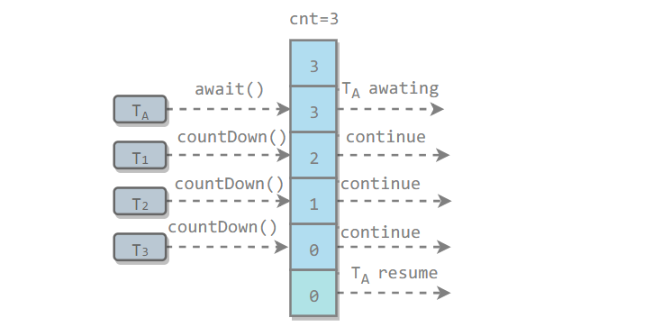
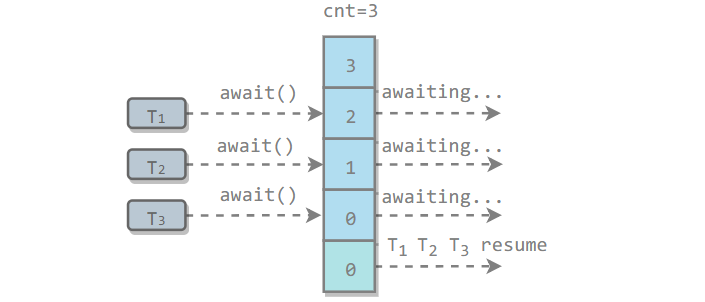
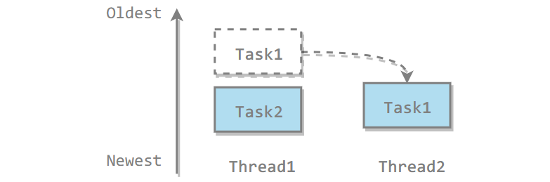

[TOC]

### 协作与同步工具类

java.util.concurrent（JUC）大大提高了并发性能，**AQS** 被认为是 JUC 的核心。AQS是AbstractQueuedSynchronizer 的简称。AQS 提供了一种实现阻塞锁和一系列依赖 FIFO 等待队列的同步器的框架。

**AQS** 是一个用来构建锁和同步工具的框架，包括常用的ReentrantLock、CountDownLatch、Semaphore等。


#### ReentrantReadWriteLock

synchronized 和显式锁 ReentrantLock，对于同一受保护对象的访问，无论是读还是写，都要求获得==同样的锁==。一些场景中是不需要的，多个线程的读操作完全可以并行，在读多写少的场景中，让读操作并行可以明显提高性能。所以使用读写锁 ReentrantReadWriteLock 可以让读操作并行，又不影响一致性。ReentrantReadWriteLock 是**可重入**的。

JCU包中读写锁接口 (ReadWriteLock) 的重要实现类 ReentrantReadWriteLock。主要实现**读共享，写互斥**功能，对比单纯的互斥锁在共享资源使用场景为**频繁读取及少量修改**的情况下可以较好的提高性能。

只有 “读-读” 操作是可以并行的，“读-写” 和 “写-写” 都不可以。只有一个线程可以进行写操作，在获取写锁时，只有没有任何线程持有任何锁才可以获取到，在持有写锁时，其他任何线程都获取不到任何锁。在没有其他线程持有写锁的情况下，多个线程可以获取和持有读锁。

ReadWriteLock 接口只定义了两个方法：

```java
public interface ReadWriteLock {
    /**
     * Returns the lock used for reading.
     * @return the lock used for reading
     */
    Lock readLock();

    /**
     * Returns the lock used for writing.
     * @return the lock used for writing
     */
    Lock writeLock();
}
```

通过调用相应方法获取读锁或写锁，获取的读锁及写锁都是Lock接口的实现，可以如同使用 Lock 接口一样使用（其实也有一些特性是不支持的）。

使用示例

```java
class RWDictionary {
    private final Map<String, Data> m = new TreeMap<String, Data>();
    private final ReentrantReadWriteLock rwl = new ReentrantReadWriteLock();
    private final Lock r = rwl.readLock();
    private final Lock w = rwl.writeLock();

    public Data get(String key) {
        r.lock();
        try { return m.get(key); }
        finally { r.unlock(); }
    }
    public String[] allKeys() {
        r.lock();
        try { return m.keySet().toArray(); }
        finally { r.unlock(); }
    }
    public Data put(String key, Data value) {
        w.lock();
        try { return m.put(key, value); }
        finally { w.unlock(); }
    }
    public void clear() {
        w.lock();
        try { m.clear(); }
        finally { w.unlock(); }
    }
}
```

与普通重入锁使用的主要区别在于需要**使用==不同==的锁对象引用读写锁**，并且在读写时分别调用对应的锁。

内部使用**同一个整数**变量表示锁的状态，16 位给读锁用，16 位给写锁用，使用一个变量便于进行 CAS 操作，锁的等待队列其实也只有一个。


#### CountDownLatch

可理解为一个倒计时**门栓**，一开始是关闭的，所有希望通过该门的线程都需要**等待**，然后开始倒计时，倒计时变为 0  之后，门栓打开，等待的所有线程都可以通过，它是**一次性**的，打开之后不能再关上。

用来控制==一个线程**等待**多个线程==。

维护了一个**计数器 cnt**，每次调用 countDown() 方法会让计数器的值**减 1**，减到 0 的时候，那些因为调用 **await()** 方法而在等待的线程就会被**唤醒**。



```java
public class CountdownLatchExample {

    public static void main(String[] args) throws InterruptedException {
        final int totalThread = 10;
        CountDownLatch countDownLatch = new CountDownLatch(totalThread);
        ExecutorService executorService = Executors.newCachedThreadPool();
        for (int i = 0; i < totalThread; i++) {
            executorService.execute(() -> {
                System.out.print("run..");
                countDownLatch.countDown();
            });
        }
        countDownLatch.await();
        System.out.println("end");
        executorService.shutdown();
    }
}
```

```html
run..run..run..run..run..run..run..run..run..run..end
```


#### CyclicBarrier

用来控制==多个线程互相等待==，只有当多个线程都到达时，这些线程才会继续执行。与上述的 CountDownLatch 类似，不过它是**循环**的，可以用作**重复**的同步。

相当于一个栅栏，特别适合用于**并行迭代计算**，每个线程负责一部分计算任务，然后在栅栏处等待其他线程完成，等待所有线程到齐后，交换数据和计算结果，进行下一次迭代。

和 CountdownLatch 相似，都是通过维护**计数器**来实现的。线程执行 await() 方法之后计数器会减 1，并进行等待，直到计数器为 0，所有调用 await() 方法而在等待的线程才能继续执行。

CyclicBarrier 和 CountdownLatch 的一个区别是，CyclicBarrier 的计数器通过调用 reset() 方法可以**循环使用**，所以它才叫做循环屏障。

CyclicBarrier 有两个构造函数，其中 parties 指示计数器的初始值，barrierAction 在所有线程都到达屏障的时候会执行一次。

```java
public CyclicBarrier(int parties, Runnable barrierAction) {
    if (parties <= 0) throw new IllegalArgumentException();
    this.parties = parties;
    this.count = parties;
    this.barrierCommand = barrierAction;
}

public CyclicBarrier(int parties) {
    this(parties, null);
}
```



```java
public class CyclicBarrierExample {

    public static void main(String[] args) {
        final int totalThread = 10;
        CyclicBarrier cyclicBarrier = new CyclicBarrier(totalThread);
        ExecutorService executorService = Executors.newCachedThreadPool();
        for (int i = 0; i < totalThread; i++) {
            executorService.execute(() -> {
                System.out.print("before..");
                try {
                    cyclicBarrier.await();
                } catch (InterruptedException | BrokenBarrierException e) {
                    e.printStackTrace();
                }
                System.out.print("after..");
            });
        }
        executorService.shutdown();
    }
}
```

```html
before..before..before..before..before..before..before..before..before..before..after..after..after..after..after..after..after..after..after..after..
```


**对比 CountDownLatch 与 CyclicBarrier**

|                        CountDownLatch                        |                        CyclicBarrier                         |
| :----------------------------------------------------------: | :----------------------------------------------------------: |
|                          减计数方式                          |                          加计数方式                          |
|                 计算为0时释放所有等待的线程                  |               计数达到指定值时释放所有等待线程               |
|                     计数为0时，无法重置                      |             计数达到指定值时，计数置为0重新开始              |
| 调用countDown()方法计数减一，调用await()方法只进行阻塞，对计数没任何影响 | 调用await()方法计数加1，若加1后的值不等于构造方法的值，则线程阻塞 |
|                         不可重复利用                         |                          可重复利用                          |


#### Semaphore

Semaphore 类似于操作系统中的**信号量**，可以控制对**互斥资源的访问线程数**。

计数信号量用来控制**同时访问**某个特定资源的操作数量，或者同时执行某个指定操作的数量。信号量还可以用来实现某种资源池，或者对**容器施加边界**。**Semaphore**管理着一组**许可（permit）**,许可的初始数量可以通过构造函数设定，操作时首先要**获取到许可**，才能进行操作，操作完成后需要**释放**许可。如果没有获取许可，则**阻塞**到有许可被释放。如果初始化了一个许可为 1 的**Semaphore**，那么就相当于一个**不可重入**的互斥锁（**Mutex**）。

以下代码模拟了对某个服务的并发请求，每次只能有 3 个客户端同时访问，请求总数为 10。

```java
public class SemaphoreExample {

    public static void main(String[] args) {
        // 访问线程数
        final int clientCount = 3;
        // 总请求数
        final int totalRequestCount = 10;
        // 构造信号量
        Semaphore semaphore = new Semaphore(clientCount);
        ExecutorService executorService = Executors.newCachedThreadPool();
        for (int i = 0; i < totalRequestCount; i++) {
            executorService.execute(()->{
                try {
                    // 获取信号量
                    semaphore.acquire();
                    // 显示还可以用的信号量个数
                    System.out.print(semaphore.availablePermits() + " ");
                } catch (InterruptedException e) {
                    e.printStackTrace();
                } finally {
                    // 释放信号量
                    semaphore.release();
                }
            });
        }
        executorService.shutdown();
    }
}
```

```html
2 1 2 2 2 2 2 1 2 2
```


#### FutureTask

在介绍 Callable 时我们知道它可以有返回值，**返回值**通过 **Future\<V>** 进行封装。FutureTask 实现了 RunnableFuture 接口，该接口继承自 **Runnable** 和 **Future\<V>** 接口，这使得 **FutureTask 既可以当做一个任务执行，也可以有返回值。**

```java
public interface RunnableFuture<V> extends Runnable, Future<V>
```

```java
public class FutureTask<V> implements RunnableFuture<V>
```

FutureTask 可用于异步**获取执行结果或取消执行任务**的场景。当一个计算任务需要执行**很长时间**，那么就可以用 FutureTask 来封装这个任务，主线程在完成自己的任务之后再去获取结果。

```java
public class FutureTaskExample {

    public static void main(String[] args) throws ExecutionException, InterruptedException {
        // 封装任务
        FutureTask<Integer> futureTask = new FutureTask<Integer>(new Callable<Integer>() 			{
            @Override
            public Integer call() throws Exception {
                int result = 0;
                for (int i = 0; i < 100; i++) {
                    Thread.sleep(10);
                    result += i;
                }
                return result;
            }
        });
		// 线程传入futureTask
        Thread computeThread = new Thread(futureTask);
        computeThread.start();

        Thread otherThread = new Thread(() -> {
            System.out.println("other task is running...");
            try {
                Thread.sleep(1000);
            } catch (InterruptedException e) {
                e.printStackTrace();
            }
        });
        otherThread.start();
        // 获取futureTask的执行结果
        System.out.println(futureTask.get());
    }
}
```

```html
other task is running...
4950
```


#### ForkJoin

主要用于**并行计算**中，和 **MapReduce** 原理类似，都是把大的计算任务**拆分**成多个小任务并行计算。

```java
public class ForkJoinExample extends RecursiveTask<Integer> {

    private final int threshold = 5;
    private int first;
    private int last;

    public ForkJoinExample(int first, int last) {
        this.first = first;
        this.last = last;
    }

    @Override
    protected Integer compute() {
        int result = 0;
        if (last - first <= threshold) {
            // 任务足够小则直接计算
            for (int i = first; i <= last; i++) {
                result += i;
            }
        } else {
            // 拆分成小任务
            int middle = first + (last - first) / 2;
            ForkJoinExample leftTask = new ForkJoinExample(first, middle);
            ForkJoinExample rightTask = new ForkJoinExample(middle + 1, last);
            leftTask.fork();
            rightTask.fork();
            result = leftTask.join() + rightTask.join();
        }
        return result;
    }
}
```

```java
public static void main(String[] args) throws ExecutionException, InterruptedException {
    ForkJoinExample example = new ForkJoinExample(1, 10000);
    ForkJoinPool forkJoinPool = new ForkJoinPool();
    Future result = forkJoinPool.submit(example);
    System.out.println(result.get());
}
```

ForkJoin 使用 **ForkJoinPool** 来启动，它是一个特殊的线程池，线程数量取决于 **CPU 核数**。

```java
public class ForkJoinPool extends AbstractExecutorService
```

ForkJoinPool 实现了**工作窃取算法**来提高 CPU 的利用率。每个线程都维护了一个**双端队列**，用来存储需要执行的任务。工作窃取算法允许空闲的线程从其它线程的双端队列中**窃取一个任务**来执行。窃取的任务必须是**最晚的**任务，避免和队列所属线程发生竞争。例如下图中，Thread2 从 Thread1 的队列中拿出futureTask的 Task1 任务，Thread1 会拿出 Task2 来执行，这样就避免发生竞争。但是如果队列中**只有一个任务**时还是会发生竞争。




