[TOC]

### 设计模式-行为型

#### 1 责任链模式（Chain Of Responsibility）

##### ① Intent

使**多个对象都有机会处理请求**，从而避免请求的发送者和接收者之间的耦合关系。将这些对象连成**一条链**，并沿着这**条链**发送该请求，直到有一个对象处理它为止。就像 Spring MVC 中的 **Interceptor 拦截器**。

由于责任链的创建完全在**客户端**，因此新增新的具体处理者对原有类库没有任何影响，只需添加新的类，然后在客户端调用时添加即可。符合开闭原则。

**现实中的场景**：

- 打牌时，轮流出牌
- 接力赛跑
- 公司里面，请假条的审批过程：如果请假天数小于3天，主任审批；如果请假天数大于等于3天，小于10天，经理审批；如果大于等于10天，小于30天，总经理审批；如果大于等于30天，提示拒绝

**开发中的常见场景：**

- Java中，**异常机制**就是一种责任链模式。一个 try 可以对应多个 catch，当第一个 catch 不匹配类型，则自动跳到第二个 catch；
- Javascript 语言中，事件的冒泡和捕获机制。Java 语言中，事件的处理采用观察者模式；
- Servlet 开发中，**过滤器**的链式处理；
- Struts2 中，**拦截器**的调用也是典型的责任链模式。
- Netty

##### ② 类图

- Handler：定义处理请求的**接口**，并且实现**==后继链==（successor）**

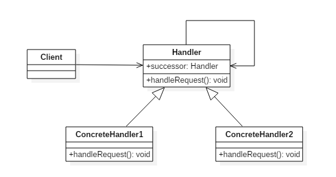

##### ③ Implementation

定义**抽象**处理器类

```java
public abstract class Handler {
	
    // 处理器
    protected Handler successor;

    public Handler(Handler successor) {
        this.successor = successor;
    }
	// 处理请求
    protected abstract void handleRequest(Request request);
}
```

具体处理器实现类1，如果当前处理器复合该请求的类型，就直接处理，否则交给下一个处理器。

```java
public class ConcreteHandler1 extends Handler {

    public ConcreteHandler1(Handler successor) {
        super(successor);
    }

    @Override
    protected void handleRequest(Request request) {
        if (request.getType() == RequestType.TYPE1) {
            System.out.println(request.getName() + " is handle by ConcreteHandler1");
            return;
        }
        if (successor != null) {
            // 交给下一个处理器进行处理
            successor.handleRequest(request);
        }
    }
}
```

具体处理器实现类2

```java
public class ConcreteHandler2 extends Handler {

    public ConcreteHandler2(Handler successor) {
        super(successor);
    }

    @Override
    protected void handleRequest(Request request) {
        if (request.getType() == RequestType.TYPE2) {
            System.out.println(request.getName() + " is handle by ConcreteHandler2");
            return;
        }
        if (successor != null) {
            // 交给下一个处理器进行处理
            successor.handleRequest(request);
        }
    }
}
```

请求类

```java
public class Request {

    private RequestType type;
    private String name;

    public Request(RequestType type, String name) {
        this.type = type;
        this.name = name;
    }

    public RequestType getType() {
        return type;
    }

    public String getName() {
        return name;
    }
}
```

请求类型枚举

```java
public enum RequestType {
    TYPE1, TYPE2
}
```

客户端类

```java
public class Client {

    public static void main(String[] args) {
        Handler handler1 = new ConcreteHandler1(null);
        Handler handler2 = new ConcreteHandler2(handler1);

        Request request1 = new Request(RequestType.TYPE1, "request1");
        handler2.handleRequest(request1);
        
        Request request2 = new Request(RequestType.TYPE2, "request2");
        handler2.handleRequest(request2);
    }
}
```

```html
request1 is handle by ConcreteHandler1
request2 is handle by ConcreteHandler2
```

##### JDK

- [java.util.logging.Logger#log()](http://docs.oracle.com/javase/8/docs/api/java/util/logging/Logger.html#log%28java.util.logging.Level,%20java.lang.String%29)
- [Apache Commons Chain](https://commons.apache.org/proper/commons-chain/index.html)
- [javax.servlet.Filter#doFilter()](http://docs.oracle.com/javaee/7/api/javax/servlet/Filter.html#doFilter-javax.servlet.ServletRequest-javax.servlet.ServletResponse-javax.servlet.FilterChain-)


#### 2 命令模式（Command）

##### Intent

将一个请求封装为一个**对象**，从而使你可用不同的**请求对客户进行参数化**，对请求**排队**或记录请求日志，以及支持可取消的操作。

将**命令**封装成对象中，具有以下作用：

- 使用命令来参数化其它对象
- 将命令放入队列中进行排队
- 将命令的操作记录到日志中
- 支持可撤销的操作

**何时使用**：在某些场合，比如要对行为进行"**==记录、撤销/重做、事务==**"等处理，这种无法抵御变化的紧耦合是不合适的。在这种情况下，如何将"行为请求者"与"行为实现者"解耦？将一组行为抽象为对象，可以实现二者之间的松耦合。

**主要解决**：在软件系统中，行为请求者与行为实现者通常是一种紧耦合的关系，但某些场合，比如需要对行为进行记录、撤销或重做、事务等处理时，这种无法抵御变化的紧耦合的设计就不太合适。

**开发中常见的场景**：

- Struts2中，action 的整个调用过程中就有命令模式。Struts 其实就是一种将请求和呈现分离的技术，其中必然涉及命令模式的思想。比如 : struts 1 中的 action 核心控制器 ActionServlet 只有一个，相当于 Invoker，而模型层的类会随着不同的应用有不同的模型类，相当于具体的 Command；
- 数据库事务机制的底层实现；
- 命令的撤销和恢复；

##### 类图

经典的命令模式包括4个角色：

- **Command**：定义命令的统一**接口**。
- **ConcreteCommand**：Command 接口的**实现**者，用来执行**具体的命令**，某些情况下可以直接用来**充当Receiver**。
- **Receiver**：命令的实际**执行者**。
- **Invoker**：命令的**请求者**，是命令模式中最重要的角色。这个角色用来对各个命令进行控制。

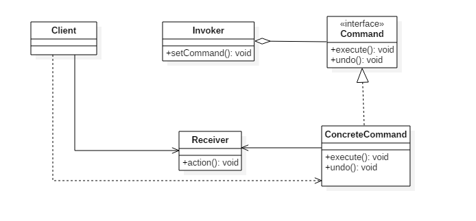

##### Implementation

设计一个遥控器，可以控制电灯开关。

定义命令统一接口。

```java
public interface Command {
    void execute();
}
```

命令接口实现者，打开灯的命令。

```java
public class LightOnCommand implements Command {
    Light light;

    public LightOnCommand(Light light) {
        this.light = light;
    }

    @Override
    public void execute() {
        light.on();
    }
}
```

命令接口实现者，关闭灯的命令。

```java
public class LightOffCommand implements Command {
    Light light;

    public LightOffCommand(Light light) {
        this.light = light;
    }

    @Override
    public void execute() {
        light.off();
    }
}
```

```java
public class Light {
    
    public void on() {
        System.out.println("Light is on!");
    }

    public void off() {
        System.out.println("Light is off!");
    }
}
```

命令的请求者

```java
/**
 * 遥控器
 */
public class Invoker {
    private Command[] onCommands;
    private Command[] offCommands;
    private final int slotNum = 7;

    public Invoker() {
        this.onCommands = new Command[slotNum];
        this.offCommands = new Command[slotNum];
    }

    public void setOnCommand(Command command, int slot) {
        onCommands[slot] = command;
    }

    public void setOffCommand(Command command, int slot) {
        offCommands[slot] = command;
    }

    public void onButtonWasPushed(int slot) {
        onCommands[slot].execute();
    }

    public void offButtonWasPushed(int slot) {
        offCommands[slot].execute();
    }
}
```

客户端

```java
public class Client {
    public static void main(String[] args) {
        Invoker invoker = new Invoker();
        Light light = new Light();
        Command lightOnCommand = new LightOnCommand(light);
        Command lightOffCommand = new LightOffCommand(light);
        invoker.setOnCommand(lightOnCommand, 0);
        invoker.setOffCommand(lightOffCommand, 0);
        invoker.onButtonWasPushed(0);
        invoker.offButtonWasPushed(0);
    }
}
```

##### JDK

- [java.lang.Runnable](http://docs.oracle.com/javase/8/docs/api/java/lang/Runnable.html)
- [Netflix Hystrix](https://github.com/Netflix/Hystrix/wiki)
- [javax.swing.Action](http://docs.oracle.com/javase/8/docs/api/javax/swing/Action.html)


#### 3 解释器模式（Interpreter）

##### Intent

为语言创建解释器，通常由语言的语法和语法分析来定义。定义一个语言，定义它的文法的一种表示，并定义一个解释器，该解释器使用该表示来解释语言中的句子。

- 是一种**不常用**的设计模式；
- 用于描述如何构成一个简单的语言解释器，主要用于使用面向对象语言开发的编译器和解释器设计；
- 当我们需要开发一种新的语言时，可以考虑使用解释器模式；
- **尽量不要使用**解释器模式，后期维护会有很大麻烦。在项目中，可以使用 Jruby，Groovy、java 的 js 引擎来替代解释器的作用，弥补 java 语言的不足。

开发中场景：

1. EL **表达式**的处理；
2. **正则表达式**解释器；
3. SQL 语法的**解释器**；
4. 数学表达式解析器，如现成的工具包:Math Expression String Parser、Expression4J 等。

##### Class Diagram

- TerminalExpression：**终结符**表达式，每个终结符都需要一个 TerminalExpression。
- Context：上下文，包含解释器之外的一些**全局信息**。

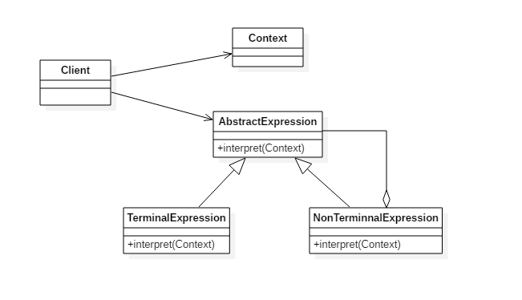

##### Implementation

以下是一个**规则检验器**实现，具有 and 和 or 规则，通过规则可以构建一颗**解析树**，用来检验一个文本是否满足解析树定义的规则。

例如一颗解析树为 D And (A Or (B C))，文本 "D A" 满足该解析树定义的规则。

这里的 Context 指的是 String。

```java
public abstract class Expression {
    // 解释
    public abstract boolean interpret(String str);
}
```

```java
public class TerminalExpression extends Expression {

    private String literal = null;

    public TerminalExpression(String str) {
        literal = str;
    }

    // 实现解释方法
    public boolean interpret(String str) {
        StringTokenizer st = new StringTokenizer(str);
        while (st.hasMoreTokens()) {
            String test = st.nextToken();
            if (test.equals(literal)) {
                return true;
            }
        }
        return false;
    }
}
```

```java
public class AndExpression extends Expression {

    private Expression expression1 = null;
    private Expression expression2 = null;

    public AndExpression(Expression expression1, Expression expression2) {
        this.expression1 = expression1;
        this.expression2 = expression2;
    }

    public boolean interpret(String str) {
        return expression1.interpret(str) && expression2.interpret(str);
    }
}
```

```java
public class OrExpression extends Expression {
    private Expression expression1 = null;
    private Expression expression2 = null;

    public OrExpression(Expression expression1, Expression expression2) {
        this.expression1 = expression1;
        this.expression2 = expression2;
    }

    public boolean interpret(String str) {
        return expression1.interpret(str) || expression2.interpret(str);
    }
}
```

```java
public class Client {

    /**
     * 构建解析树
     */
    public static Expression buildInterpreterTree() {
        // Literal
        Expression terminal1 = new TerminalExpression("A");
        Expression terminal2 = new TerminalExpression("B");
        Expression terminal3 = new TerminalExpression("C");
        Expression terminal4 = new TerminalExpression("D");
        // B C
        Expression alternation1 = new OrExpression(terminal2, terminal3);
        // A Or (B C)
        Expression alternation2 = new OrExpression(terminal1, alternation1);
        // D And (A Or (B C))
        return new AndExpression(terminal4, alternation2);
    }

    public static void main(String[] args) {
        Expression define = buildInterpreterTree();
        String context1 = "D A";
        String context2 = "A B";
        System.out.println(define.interpret(context1));
        System.out.println(define.interpret(context2));
    }
}
```

```html
true
false
```

##### JDK

- [java.util.Pattern](http://docs.oracle.com/javase/8/docs/api/java/util/regex/Pattern.html)
- [java.text.Normalizer](http://docs.oracle.com/javase/8/docs/api/java/text/Normalizer.html)
- All subclasses of [java.text.Format](http://docs.oracle.com/javase/8/docs/api/java/text/Format.html)
- [javax.el.ELResolver](http://docs.oracle.com/javaee/7/api/javax/el/ELResolver.html)


#### 4 迭代器模式（Iterator）

##### Intent

在现实生活以及程序设计中，经常要访问一个聚合对象中的**各个元素**，如数据结构中的**链表遍历**，通常的做法是将链表的创建和遍历都放在同一个类中，但这种方式不利于程序的扩展，如果要更换遍历方法就必须修改程序源代码，这违背了 “开闭原则”。

既然将遍历方法封装在聚合类中不可取，那么聚合类中**不提供遍历方法**，将遍历方法由用户自己实现是否可行呢？答案是同样不可取，因为这种方式会存在两个缺点：

1. 暴露了聚合类的内部表示，使其数据不安全；
2. 增加了客户的负担。


“迭代器模式”能较好地克服以上缺点，它在**客户访问类与聚合类**之间**插入一个迭代器**，这分离了聚合对象与其遍历行为，对客户也隐藏了其内部细节，且满足“单一职责原则”和“开闭原则”，如  Java 中的 Collection、List、Set、Map 等都包含了迭代器。

提供一种**顺序访问聚合对象元素**的方法，并且**不暴露**聚合对象的**内部表示**。

**开发中常见的场景**：

- JDK 内置的迭代器(List/Set)

##### Class Diagram

- **Aggregate** 是**聚合类**，其中 createIterator() 方法可以产生一个 Iterator；
- **Iterator** 主要定义了 hasNext() 和 next() 方法。
- **Client** 组合了 Aggregate，为了迭代遍历 Aggregate，也需要组合 Iterator。

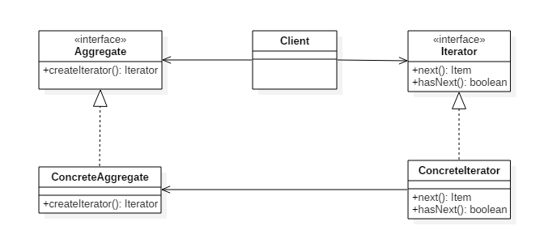

##### Implementation

聚合接口

```java
public interface Aggregate {
    Iterator createIterator();
}
```

```java
public class ConcreteAggregate implements Aggregate {

    private Integer[] items;

    public ConcreteAggregate() {
        items = new Integer[10];
        for (int i = 0; i < items.length; i++) {
            items[i] = i;
        }
    }

    @Override
    public Iterator createIterator() {
        return new ConcreteIterator<Integer>(items);
    }
}
```

```java
public interface Iterator<Item> {

    Item next();

    boolean hasNext();
}
```

```java
public class ConcreteIterator<Item> implements Iterator {

    private Item[] items;
    private int position = 0;

    public ConcreteIterator(Item[] items) {
        this.items = items;
    }

    @Override
    public Object next() {
        return items[position++];
    }

    @Override
    public boolean hasNext() {
        return position < items.length;
    }
}
```

```java
public class Client {

    public static void main(String[] args) {
        Aggregate aggregate = new ConcreteAggregate();
        // 获取迭代器
        Iterator<Integer> iterator = aggregate.createIterator();
        // 遍历
        while (iterator.hasNext()) {
            System.out.println(iterator.next());
        }
    }
}
```

##### JDK

- [java.util.Iterator](http://docs.oracle.com/javase/8/docs/api/java/util/Iterator.html)
- [java.util.Enumeration](http://docs.oracle.com/javase/8/docs/api/java/util/Enumeration.html)


#### 5 中介者（Mediator）

##### Intent

集中相关对象之间复杂的沟通和控制方式。解耦多个**同事对象**之间的交互关系。每个对象都持有**中介者对象**的**引用**，**只跟中介者对象打交道**。我们通过中介者对象统一管理这些交互关系。

如果一个系统中，对象之间的联系呈网状结构，对象之间存在大量的多对多关系，导致关系很复杂。这是可以引入一个中介者对象，各个同事对象只跟中介者对象打交道，将复杂的网络结构化解成为如下的星型结构：

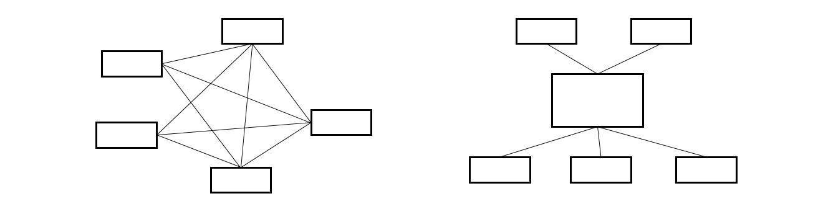

开发中常见的场景：

- MVC 模式(其中的 C，控制器就是一个**中介者**对象。M 和 V 都和它打交道)
- 窗口游戏程序，窗口软件开发中**窗口对象**也是一个中介者对象
- 图形界面开发 GUI 中，多个组件之间的交互，可以通过引入一个中介者对象来解决，可以是整体的窗口对象或者 DOM 对象
- Java.lang.reflect.Method#invoke()

##### 类图

比如说，一个公司有三个部门：财务部、市场部、研发部。那么**总经理**就扮演**中介者**的角色。

- **Mediator**：中介者，定义一个接口用于与各同事（Colleague）对象通信。
- **Colleague**：同事，相关对象

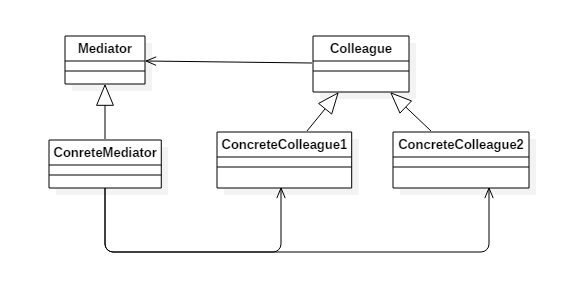

##### Implementation

Alarm（闹钟）、CoffeePot（咖啡壶）、Calendar（日历）、Sprinkler（喷头）是一组相关的对象，在某个对象的事件产生时需要去操作其它对象，形成了下面这种依赖结构：

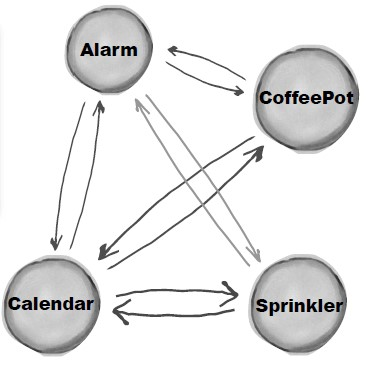

使用中介者模式可以将复杂的依赖结构变成**星形结构**：

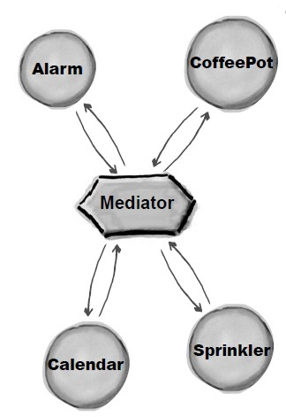

抽象同事类

```java
public abstract class Colleague {
    public abstract void onEvent(Mediator mediator);
}
```

闹钟

```java
public class Alarm extends Colleague {

    @Override
    public void onEvent(Mediator mediator) {
        mediator.doEvent("alarm");
    }

    public void doAlarm() {
        System.out.println("doAlarm()");
    }
}
```

咖啡壶

```java
public class CoffeePot extends Colleague {
    @Override
    public void onEvent(Mediator mediator) {
        mediator.doEvent("coffeePot");
    }

    public void doCoffeePot() {
        System.out.println("doCoffeePot()");
    }
}
```

日历

```java
public class Calender extends Colleague {
    @Override
    public void onEvent(Mediator mediator) {
        mediator.doEvent("calender");
    }

    public void doCalender() {
        System.out.println("doCalender()");
    }
}
```

喷头

```java
public class Sprinkler extends Colleague {
    @Override
    public void onEvent(Mediator mediator) {
        mediator.doEvent("sprinkler");
    }

    public void doSprinkler() {
        System.out.println("doSprinkler()");
    }
}
```

**中介者接口**

```java
public abstract class Mediator {
    public abstract void doEvent(String eventType);
}
```

中介者实现类

```java
public class ConcreteMediator extends Mediator {
    // 各个同事类
    private Alarm alarm;
    private CoffeePot coffeePot;
    private Calender calender;
    private Sprinkler sprinkler;

    public ConcreteMediator(Alarm alarm, CoffeePot coffeePot, Calender calender, Sprinkler sprinkler) {
        this.alarm = alarm;
        this.coffeePot = coffeePot;
        this.calender = calender;
        this.sprinkler = sprinkler;
    }

    @Override
    public void doEvent(String eventType) {
        switch (eventType) {
            case "alarm":
                doAlarmEvent();
                break;
            case "coffeePot":
                doCoffeePotEvent();
                break;
            case "calender":
                doCalenderEvent();
                break;
            default:
                doSprinklerEvent();
        }
    }

    public void doAlarmEvent() {
        alarm.doAlarm();
        coffeePot.doCoffeePot();
        calender.doCalender();
        sprinkler.doSprinkler();
    }

    public void doCoffeePotEvent() {
        // ...
    }

    public void doCalenderEvent() {
        // ...
    }

    public void doSprinklerEvent() {
        // ...
    }
}
```

客户端

```java
public class Client {
    public static void main(String[] args) {
        Alarm alarm = new Alarm();
        CoffeePot coffeePot = new CoffeePot();
        Calender calender = new Calender();
        Sprinkler sprinkler = new Sprinkler();
        Mediator mediator = new ConcreteMediator(alarm, coffeePot, calender, sprinkler);
        // 闹钟事件到达，调用中介者就可以操作相关对象
        alarm.onEvent(mediator);
    }
}
```

```java
doAlarm()
doCoffeePot()
doCalender()
doSprinkler()
```

##### JDK

- All scheduleXXX() methods of [java.util.Timer](http://docs.oracle.com/javase/8/docs/api/java/util/Timer.html)
- [java.util.concurrent.Executor#execute()](http://docs.oracle.com/javase/8/docs/api/java/util/concurrent/Executor.html#execute-java.lang.Runnable-)
- submit() and invokeXXX() methods of [java.util.concurrent.ExecutorService](http://docs.oracle.com/javase/8/docs/api/java/util/concurrent/ExecutorService.html)
- scheduleXXX() methods of [java.util.concurrent.ScheduledExecutorService](http://docs.oracle.com/javase/8/docs/api/java/util/concurrent/ScheduledExecutorService.html)
- [java.lang.reflect.Method#invoke()](http://docs.oracle.com/javase/8/docs/api/java/lang/reflect/Method.html#invoke-java.lang.Object-java.lang.Object...-)


#### 6 备忘录模式（Memento）

##### Intent

在**不违反封装**的情况下获得对象的**内部状态**，从而在需要时可以将对象**恢复**到**最初状态**。就是保存某个对象**内部状态**的拷贝，这样**以后**就可以将该对象**恢复到原先的状态**。

**开发中常见的应用场景** ：

1. 棋类游戏中的，悔棋
2. 普通软件中的，**撤销**操作
3. 数据库软件中的，事务管理中的，**回滚**操作
4. Photoshop 软件中的，**历史记录**

##### Class Diagram

- **Originator**：原始对象
- **Caretaker**：负责**保存**好备忘录
- **Menento**：**备忘录**，**存储原始对象的的状态**。备忘录实际上有两个接口，一个是提供给 Caretaker 的窄接口：它只能将备忘录传递给其它对象；一个是提供给 Originator 的宽接口，允许它访问到先前状态所需的所有数据。理想情况是只允许 Originator 访问本备忘录的内部状态。

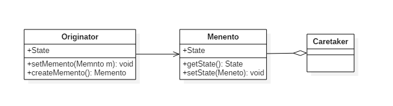

##### Implementation

步骤1：定义源发器类（Originator），负责创建一个备忘录Memento,用以记录当前时刻它的内部状态，并可使用备忘录恢复内部状态

```java
/**
 * 源发器类 Originator
 */
public class Emp {
	private String ename;
	private int age;
	private double salary;

	// 进行备忘操作，并返回备忘录对象
	public EmpMemento memento(){
		return new EmpMemento(this);
	}

	// 进行数据恢复，恢复成制定备忘录对象的值
	public void recovery(EmpMemento mmt){
		this.ename = mmt.getEname();
		this.age = mmt.getAge();
		this.salary = mmt.getSalary();
	}

	public Emp(String ename, int age, double salary) {
		super();
		this.ename = ename;
		this.age = age;
		this.salary = salary;
	}
	public String getEname() {
		return ename;
	}
	public void setEname(String ename) {
		this.ename = ename;
	}
	public int getAge() {
		return age;
	}
	public void setAge(int age) {
		this.age = age;
	}
	public double getSalary() {
		return salary;
	}
	public void setSalary(double salary) {
		this.salary = salary;
	}	
}
```

步骤2：定义备忘录类（Memento）,负责存储 Oreginator 对象的**内部状态**，并可防止 Originator 以外的其它对象访问备忘录（Memento）。

```java
/**
 * 备忘录类 Memento
 */
public class EmpMemento {
	private String ename;
	private int age;
	private double salary;

	public EmpMemento(Emp e) {
		this.ename = e.getEname();
		this.age = e.getAge();
		this.salary = e.getSalary();
	}
	
	//get/set方法
	public String getEname() {
		return ename;
	}
	public void setEname(String ename) {
		this.ename = ename;
	}
	public int getAge() {
		return age;
	}
	public void setAge(int age) {
		this.age = age;
	}
	public double getSalary() {
		return salary;
	}
	public void setSalary(double salary) {
		this.salary = salary;
	}
}
```

步骤3：定义 负责人类（CareTaker），负责**保存好备忘录**（Memento）。

```java
/**
 * 负责人类 :负责管理备忘录对象
 */
public class CareTaker {
	
	private EmpMemento memento;

	// private List<EmpMemento> list = new ArrayList<EmpMemento>();

	public EmpMemento getMemento() {
		return memento;
	}

	public void setMemento(EmpMemento memento) {
		this.memento = memento;
	}
}
```

步骤4：测试

```java
/**
 * 测试
 */
public class Client {
	public static void main(String[] args) {
		CareTaker taker = new CareTaker();
		
		Emp emp = new Emp("张三丰", 48, 900);
		System.out.println("第一次打印对象--- 姓名："+emp.getEname()+" 年龄："+emp.getAge()+" 薪水："+emp.getSalary());
		
		taker.setMemento(emp.memento());   //备忘一次
		System.out.println("注意：备忘一次---");
		
		emp.setAge(18);
		emp.setEname("张无忌");
		emp.setSalary(9000);
		System.out.println("第二次打印对象--- 姓名："+emp.getEname()+" 年龄："+emp.getAge()+" 薪水："+emp.getSalary());
		
		emp.recovery(taker.getMemento()); //恢复到备忘录对象保存的状态
		System.out.println("注意：恢复到备忘录对象保存的状态---");
		
		System.out.println("第三次打印对象--- 姓名："+emp.getEname()+" 年龄："+emp.getAge()+" 薪水："+emp.getSalary());
	}
}
```

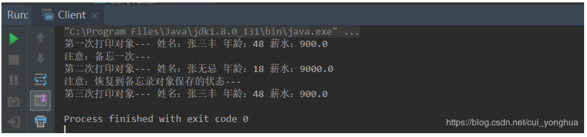


#### 7 观察者模式（发布订阅）（Observer）

##### Intent

定义对象之间的**一对多**依赖，当一个对象状态改变时，它的所有依赖都会**收到通知并且自动更新状态**。

**主题**（Subject）是**被观察的对象**，而其所有**依赖者**（Observer）称为**观察者**。

简单来说，就是 **发布-订阅模式**，发布者发布信息，订阅者获取信息，订阅了就能收到信息，没订阅就收不到信息。比如：有一个微信公众号服务，不定时发布一些消息，关注公众号就可以收到推送消息，取消关注就收不到推送消息。

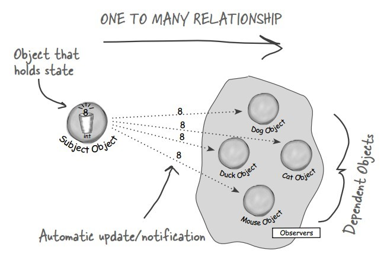

观察者模式的优缺点：

**优点：**

- 观察者和被观察者之间抽象**耦合**。观察者模式容易扩展，被观察者只持有观察者集合，并不需要知道具体观察者内部的实现。
- 对象之间的保持高度的协作。当被观察者发生变化时，所有被观察者**都会通知**到，然后做出相应的动作。
    **缺点：**

- 如果观察者太多，被观察者通知观察者消耗的时间很多，影响系统的性能。
- 当观察者集合中的某一观察者错误时就会导致系统卡壳，因此一般会**采用异步**方式。

**跟代理模式对比**：观察者模式和代理模式主要区别在它们**功能不一样**，观察者模式强调的是***被观察者反馈结果***，而代理模式是***同根负责做同样的事情***。

**开发中常见的场景**：

1. 聊天室程序的，服务器转发给所有客户端
2. 京东商城中，群发某商品打折信息
3. Servlet中，监听器的实现
4. 邮件订阅
5. 网络游戏(多人联机对战)场景中，服务器将客户端的状态进行分发

##### Class Diagram

**主题**（Subject）具有注册和移除观察者、并通知所有观察者的功能，主题是通过维护一张观察者列表来实现这些操作的。

**观察者**（Observer）的注册功能需要调用主题的 registerObserver() 方法。

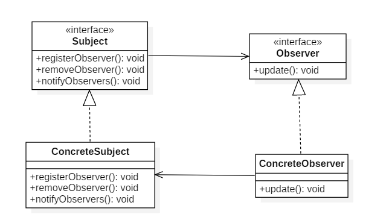

##### Implementation

比如天气预报系统会不定时发布一些消息，关注的用户就可以收到推送消息，取消关注就收不到推送消息。

用观察者模式完成该案例，大概有以下五步：

第一，定义**被观察者接口**：也就是一个**抽象主题**，它把所有对观察者对象的引用保存在一个集合中，每个主题都可以有任意数量的观察者。抽象主题提供一个接口，可以增加和删除观察者角色。(也可以用抽象类来实现)

```java
/**
 * 抽象被观察者接口:声明了添加、删除、通知观察者方法
 */
public interface Topic {
	// 注册观察者
    public void registerObserver(Observer o);
    // 移除观察者
    public void removeObserver(Observer o);
    // 通知观察者
    public void notifyObserver();
}
```

第二，定义**观察者接口**：为所有的具体观察者定义一个接口，在得到主题通知时更新自己。

```java
/**
 * 抽象观察者:定义了一个update()方法，当被观察者调用notifyObservers()方法时，
 * 观察者的update()方法会被回调。
 */
public interface Observer {
    // 收到主题时更新消息
    public void update(String message);
}
```

第三，定义具体被观察者角色，也就是一个**具体的主题**，在集体主题的内部状态改变时，所有登记过的观察者发出通知。比如下面代码，实现了 Topic 接口，对 Topic 接口的三个方法进行了具体实现，同时有一个 List 集合，用以保存注册的观察者，等需要通知观察者时，遍历该集合即可。

```java
/**
 *被观察者，也就是天气服务发布系统
 *实现了Observerable接口，对Observerable接口的三个方法进行了具体实现
 */
public class WeatherServer implements Topic {

    // 注意到这个List集合的泛型参数为Observer接口，
    // 设计原则：面向接口编程而不是面向实现编程
    private List<Observer> list;
    private String message;

    public WeatherServer() {
        list = new ArrayList<Observer>();
    }
    @Override
    public void registerObserver(Observer o) {
        list.add(o);
    }
    @Override
    public void removeObserver(Observer o) {
        if(!list.isEmpty()){
            list.remove(o);
        }
    }
    @Override
    public void notifyObserver() {
        for(int i=0;i<list.size();i++){
            Observer observer = list.get(i);
            observer.update(message);
        }
    }
    public void setInfomation(String s) {
        this.message = s;
        System.out.println("天气系统更新消息： " + s);
        //消息更新，通知所有观察者
        notifyObserver();
    }
}
```

第四，**实现观察者接口**：实现抽象观察者角色所需要的更新接口，一边使本身的状态与系统的状态相协调。

```java
/**
 * 定义具体观察者：实现了update方法
 */
public class User implements Observer{
    private String name;
    private String message;

    public User(String name) {
        this.name = name;
    }

    @Override
    public void update(String message) {
        this.message = message;
        read();
    }

    public void read() {
        System.out.println(name + " 收到推送消息： " + message);
    }
}
```

第五，测试类：
首先注册了三个用户，zhangsan、lisi、wangwu。公众号发布了一条消息 " 今天有大雨！！！"，三个用户都收到了消息。若用户 zhangsan 不想看到天气预报推送的消息，于是取消订阅了，这时公众号又推送了一条消息 " 明天是晴天~~~"，此时用户 zhangsan 已经收不到消息，其他用户还是正常能收到推送消息。

```java
/**
 * 测试类
 */
public class TestObserver {
    public static void main(String[] args) {
        WeatherServer server = new WeatherServer();

        Observer userZhang = new User("zhangsan");
        Observer userLi = new User("lisi");
        Observer userWang = new User("wangwu");

        server.registerObserver(userZhang);
        server.registerObserver(userLi);
        server.registerObserver(userWang);
        server.setInfomation("今天有大雨！！！");

        System.out.println("----------------------------------------------");
        server.removeObserver(userZhang);
        server.setInfomation("明天是晴天~~~");
    }
}
```

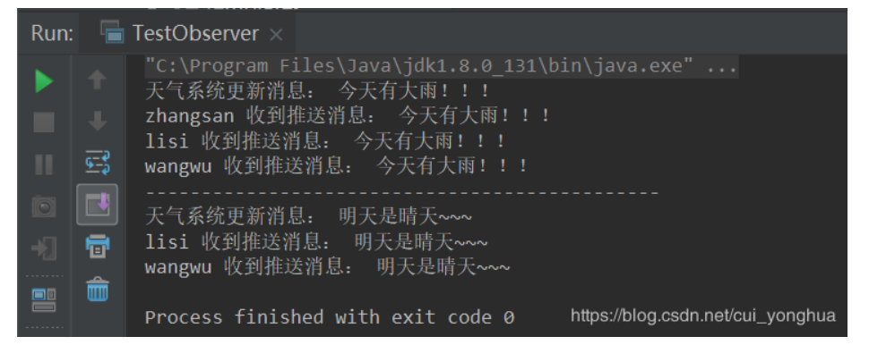


##### JDK

- [java.util.Observer](http://docs.oracle.com/javase/8/docs/api/java/util/Observer.html)
- [java.util.EventListener](http://docs.oracle.com/javase/8/docs/api/java/util/EventListener.html)
- [javax.servlet.http.HttpSessionBindingListener](http://docs.oracle.com/javaee/7/api/javax/servlet/http/HttpSessionBindingListener.html)
- [RxJava](https://github.com/ReactiveX/RxJava)


#### 8 状态模式（State）

##### Intent

允许对象在内部状态改变时改变它的行为，对象看起来好像修改了它所属的类。用于解决系统中复杂对象的状态转换 以及不同状态下行为 的封装问题。

**开发中常见的场景**：

1. 银行系统中账号状态的管理；
2. OA 系统中公文状态的管理；
3. 酒店系统中，房间状态的管理；
4. 线程对象各状态之间的切换

##### Class Diagram

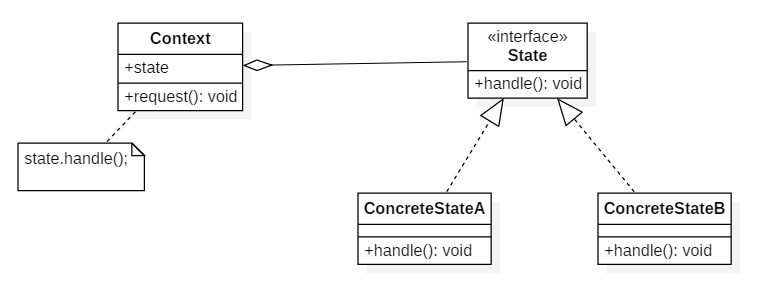

##### Implementation

在酒店系统中，房间的状态变化：已预订，已入住，空闲。（当遇到这种需要频繁的修改状态时，考虑状态模式）

该过程用状态模式实现，大致有以下4步：

步骤1：定义 State **抽象状态类**，定义一个接口以封装与 Context 的一个特定状态相关的行为。

```java
public interface State {
	void handle();
}
```

步骤2：定义 Context 环境类，维护一个 ConcreteState 子类的实例，这个实例定义当前的状态。

```java
/**
 * Context类 : 房间对象
 * 如果是银行系统，这个Context类就是账号。根据金额不同，切换不同的状态！
 */
public class HomeContext {
	// 传入状态
	private State state;
    
	public void setState(State s){
		System.out.println("修改状态！");
		state = s;
		state.handle();
	}
}
```

步骤3：定义 ConcreteState 具体状态类，每一个类封装了一个状态对应的行为

1. 已预订状态

```java
/**
 * 已预订状态
 */
public class BookedState implements State {

	@Override
	public void handle() {
		System.out.println("房间已预订！别人不能定！");
	}
}
```

2. 已入住状态

```java
/**
 * 已入住状态
 */
public class CheckedInState implements State {

	@Override
	public void handle() {
		System.out.println("房间已入住！请勿打扰！");
	}
}
```

3. 空闲状态

```java
/**
 * 空闲状态
 */
public class FreeState implements State {

	@Override
	public void handle() {
		System.out.println("房间空闲！！！没人住！");
	}
}
```

步骤4：测试

```java
public class Client {
	public static void main(String[] args) {
		HomeContext ctx = new HomeContext();
		ctx.setState(new FreeState());
		ctx.setState(new BookedState());	
	}
}
```

```jade
修改状态！
房间空闲！！！没人住！
修改状态！
房间已预订！别人不能定！
```


#### 9 策略模式（Strategy）

##### Intent

定义**一系列算法**，封装**每个算法**，并使它们可以**互换**。策略模式对应于解决某一个问题的一个算法族，允许用户从该算法族中任选一个算法解决某一问题，同时可以方便的更换算法或者增加新的算法。并且由客户端决定调用哪个算法。

策略模式可以让算法**独立于**使用它的客户端。

**策略模式本质是**：分离算法，选择实现。

开发中常见的场景：

- JAVASE 中 GUI 编程中，布局管理 ；
- Spring 框架中，Resource 接口，**资源访问**；
- javax.servlet.http.HttpServlet#service()；
- 如果一个方法有大量 if else 语句，可通过**策略模式**来消除掉；
- 一个系统，需要**动态地在几个算法中选择一种**，可用策略模式实现；
- 系统有很多类，而他们的区别仅仅在于他们的行为不同。

**策略模式的优点**：

- 开闭原则；
- 避免使用多重条件转移语句；
- 提高了算法的保密性和安全性：可使用策略模式以避免暴露复杂的，与算法相关的数据结构。

**策略模式体现了面向对象程序设计中非常重要的两个原则**：

1. 封装变化的概念。
2. 编程中使用接口，而不是使用的是具体的实现类(面向接口编程)。


##### Class Diagram

- Strategy 接口定义了一个算法族，它们都实现了  behavior() 方法。
- Context 是使用到该算法族的类，其中的 doSomething() 方法会调用 behavior()，setStrategy(Strategy) 方法可以动态地改变 strategy 对象，也就是说能动态地改变 Context 所使用的算法。

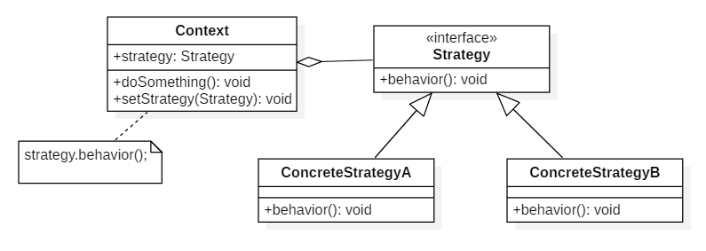

##### 与状态模式的比较

状态模式的类图和策略模式类似，并且都是能够动态改变对象的行为。但是状态模式是通过状态转移来改变 Context 所组合的 State 对象，而策略模式是通过 Context 本身的决策来改变组合的 Strategy 对象。所谓的状态转移，是指 Context 在运行过程中由于一些条件发生改变而使得 State 对象发生改变，注意必须要是在运行过程中。

状态模式主要是用来解决状态转移的问题，当状态发生转移了，那么 Context 对象就会改变它的行为；而策略模式主要是用来封装一组可以互相替代的算法族，并且可以根据需要动态地去替换 Context 使用的算法。

##### Implementation

设计一个鸭子，它可以动态地改变叫声。这里的**算法族**是鸭子的叫声行为。

叫声接口

```java
public interface QuackBehavior {
    void quack();
}
```

呱呱声

```java
public class Quack implements QuackBehavior {
    @Override
    public void quack() {
        System.out.println("quack!");
    }
}
```

吱吱声

```java
public class Squeak implements QuackBehavior{
    @Override
    public void quack() {
        System.out.println("squeak!");
    }
}
```

鸭子

```java
public class Duck {

    private QuackBehavior quackBehavior;

    public void performQuack() {
        if (quackBehavior != null) {
            quackBehavior.quack();
        }
    }

    public void setQuackBehavior(QuackBehavior quackBehavior) {
        this.quackBehavior = quackBehavior;
    }
}
```

测试

```java
public class Client {

    public static void main(String[] args) {
        Duck duck = new Duck();
        duck.setQuackBehavior(new Squeak());
        duck.performQuack();
        duck.setQuackBehavior(new Quack());
        duck.performQuack();
    }
}
```

```html
squeak!
quack!
```

再比如：去买衣服

1. 新客户小批量：原价，不打折
2. 新客户大批量：打九折
3. 老客户小批量：打八五折
4. 老客户大批量：打8折

可用 if else 来实现，弊端也很明显，如代码注释中解释，代码参考如下：

```java
/**
 * 实现起来比较容易，符合一般开发人员的思路
 * 假如，类型特别多，算法比较复杂时，整个条件语句的代码就变得很长，难于维护。
 * 如果有新增类型，就需要频繁的修改此处的代码！
 * 不符合开闭原则！
 */
public class TestStrategy {
	public double getPrice(String type, double price) {
		if (type.equals("普通客户小批量")) {
			System.out.println("不打折,原价");
			return price;
		} else if (type.equals("普通客户大批量")) {
			System.out.println("打九折");
			return price * 0.9;
		} else if (type.equals("老客户小批量")) {
			System.out.println("打八五折");
			return price * 0.85;
		} else if (type.equals("老客户大批量")) {
			System.out.println("打八折");
			return price * 0.8;
		}
		return price;
	}
}
```

下面用策略模式来实现去买衣服打折的问题：
第一步：定义**抽象策略角色**，通常情况下使用接口或者抽象类去实现

```java
public interface Strategy {
	public double getPrice(double standardPrice);
}
```

第二步：实现策略接口，定义具体策略角色

```java
/**
 * 新客户小批量
 */
public class NewCustomerFewStrategy implements Strategy {

	@Override
	public double getPrice(double standardPrice) {
		System.out.println("不打折，原价");
		return standardPrice;
	}
}
```

```java
/**
 * 新客户大批量
 */
public class NewCustomerManyStrategy implements Strategy {

	@Override
	public double getPrice(double standardPrice) {
		System.out.println("打九折");
		return standardPrice*0.9;
	}
}
```

```java
/**
 * 老客户小批量
 */
public class OldCustomerFewStrategy implements Strategy {

	@Override
	public double getPrice(double standardPrice) {
		System.out.println("打八五折");
		return standardPrice*0.85;
	}
}
```

```java
/**
 * 老客户大批量
 */
public class OldCustomerManyStrategy implements Strategy {

	@Override
	public double getPrice(double standardPrice) {
		System.out.println("打八折");
		return standardPrice*0.8;
	}
}
```

第三步：定义环境角色，负责和具体的策略类交互，内部持有一个策略类的引用，给客户端调用。

```java
/**
 * 负责和具体的策略类交互
 * 这样的话，具体的算法和直接的客户端调用分离了，使得算法可以独立于客户端独立的变化。
 * 如果使用spring的依赖注入功能，还可以通过配置文件，动态的注入不同策略对象，动态的切换不同的算法.
 */
public class Context {
	private Strategy strategy;	//当前采用的算法对象

	//可以通过构造器来注入
	public Context(Strategy strategy) {
		super();
		this.strategy = strategy;
	}
	//可以通过set方法来注入
	public void setStrategy(Strategy strategy) {
		this.strategy = strategy;
	}
	
	public void pringPrice(double s){
		System.out.println("您该报价："+strategy.getPrice(s));
	}
}
```

第四步：测试

```java
/**
 * 测试类
 */
public class Client {
	public static void main(String[] args) {
		// 自己选择使用何种策略
		Strategy s1 = new OldCustomerManyStrategy();
        // 根据选择的策略使用不同的算法
		Context ctx = new Context(s1);
		ctx.pringPrice(500);
	}
}
```

```
打八折
您该报价:400.0
```

##### JDK

- java.util.Comparator#compare()
- javax.servlet.http.HttpServlet
- javax.servlet.Filter#doFilter()


#### 10 模板方法模式（Template Method）

##### Intent

定义**算法框架**，并将一些步骤的实现**延迟到子类**。

通过模板方法，子类可以重新定义算法的某些步骤，而不用改变算法的结构。

**核心**：处理步骤父类中定义好，具体实现延迟到子类实现。

**什么时候用到模板方法模式**：实现一个算法时，整体步骤很固定。但是某些部分易变，易变部分可以抽象出来，供子类实现。

**开发中常见的场景**：非常频繁，各个框架，类库中都有他的影子。比如：

1. 数据库访问的封装；
2. Junit 单元测试；
3. servlet 中关于 doGet/doPost 方法调用；
4. Hibernate 中模板程序；
5. Spring 中 JDBCTemplate , HibernateTemplate 等。

##### Class Diagram

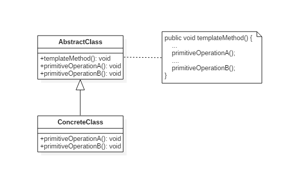

##### Implementation

冲咖啡和冲茶都有类似的流程，但是**某些步骤**会有点不一样，要求**复用那些相同步骤**的代码。如下图有两个方法不同，两个方法相同。

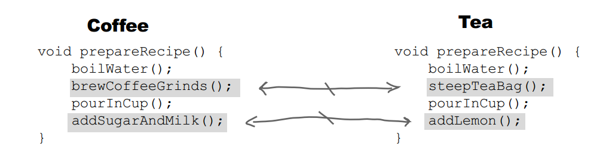

抽象接口

```java
public abstract class CaffeineBeverage {
	// 泡茶和冲咖啡都具有的步骤
    final void prepareRecipe() {
        boilWater();
        brew();
        pourInCup();
        addCondiments();
    }

    abstract void brew();

    abstract void addCondiments();

    // 以下两个方法是都有的方法
    void boilWater() {
        System.out.println("boilWater");
    }

    void pourInCup() {
        System.out.println("pourInCup");
    }
}
```

咖啡实现

```java
public class Coffee extends CaffeineBeverage {
    // 覆写第二个特殊的方法
    @Override
    void brew() {
        System.out.println("Coffee.brew");
    }

    @Override
    void addCondiments() {
        System.out.println("Coffee.addCondiments");
    }
}
```

```java
public class Tea extends CaffeineBeverage {
    // 覆写第三个特殊的方法
    @Override
    void brew() {
        System.out.println("Tea.brew");
    }

    // 覆写第三个特殊的方法
    @Override
    void addCondiments() {
        System.out.println("Tea.addCondiments");
    }
}
```

测试

```java
public class Client {
    public static void main(String[] args) {
        CaffeineBeverage caffeineBeverage = new Coffee();
        caffeineBeverage.prepareRecipe();
        System.out.println("-----------");
        caffeineBeverage = new Tea();
        caffeineBeverage.prepareRecipe();
    }
}
```

```html
boilWater
Coffee.brew
pourInCup
Coffee.addCondiments
-----------
boilWater
Tea.brew
pourInCup
Tea.addCondiments
```

##### JDK

- java.util.Collections#sort()
- java.io.InputStream#skip()
- java.io.InputStream#read()
- java.util.AbstractList#indexOf()


#### 11 访问者模式（Visitor）

##### Intent

为一个对象结构（比如组合结构）**增加新能力**。表示一个作用于某对象结构中的各元素的操作。它使你可以在不改变各元素类别的前提下**定义**作用于这些元素的**新操作**。

**模式动机**：对于存储在一个集合中的对象，他们可能具有不同的类型(即使有一个公共的接口)，对于该集合中的对象，可以接受一类称为访问者的对象来访问，**不同的访问者其访问方式也有所不同**。

**开发中的场景** : (应用范围非常窄，了解即可)：

1. XML 文档解析器设计;
2. 编译器的设计;
3. 复杂集合对象的处理

##### Class Diagram

- **Visitor**：访问者，为每一个 ConcreteElement 声明一个 visit 操作
- **ConcreteVisitor**：具体访问者，存储遍历过程中的累计结果
- **ObjectStructure**：对象结构，可以是组合结构，或者是一个集合。

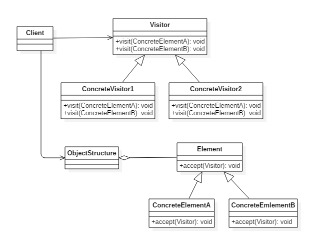

##### Implementation

元素接口

```java
public interface Element {
    void accept(Visitor visitor);
}
```

```java
class CustomerGroup {

    private List<Customer> customers = new ArrayList<>();

    void accept(Visitor visitor) {
        for (Customer customer : customers) {
            customer.accept(visitor);
        }
    }

    void addCustomer(Customer customer) {
        customers.add(customer);
    }
}
```

顾客

```java
public class Customer implements Element {

    private String name;
    private List<Order> orders = new ArrayList<>();

    Customer(String name) {
        this.name = name;
    }

    String getName() {
        return name;
    }

    void addOrder(Order order) {
        orders.add(order);
    }

    public void accept(Visitor visitor) {
        visitor.visit(this);
        for (Order order : orders) {
            order.accept(visitor);
        }
    }
}
```

订单

```java
public class Order implements Element {

    private String name;
    private List<Item> items = new ArrayList();

    Order(String name) {
        this.name = name;
    }

    Order(String name, String itemName) {
        this.name = name;
        this.addItem(new Item(itemName));
    }

    String getName() {
        return name;
    }

    void addItem(Item item) {
        items.add(item);
    }

    public void accept(Visitor visitor) {
        visitor.visit(this);

        for (Item item : items) {
            item.accept(visitor);
        }
    }
}
```

条目

```java
public class Item implements Element {

    private String name;

    Item(String name) {
        this.name = name;
    }

    String getName() {
        return name;
    }

    public void accept(Visitor visitor) {
        visitor.visit(this);
    }
}
```

访问者接口

```java
public interface Visitor {
    void visit(Customer customer);

    void visit(Order order);

    void visit(Item item);
}
```

访问者接口实现类

```java
public class GeneralReport implements Visitor {

    private int customersNo;
    private int ordersNo;
    private int itemsNo;

    public void visit(Customer customer) {
        System.out.println(customer.getName());
        customersNo++;
    }

    public void visit(Order order) {
        System.out.println(order.getName());
        ordersNo++;
    }

    public void visit(Item item) {
        System.out.println(item.getName());
        itemsNo++;
    }

    public void displayResults() {
        System.out.println("Number of customers: " + customersNo);
        System.out.println("Number of orders:    " + ordersNo);
        System.out.println("Number of items:     " + itemsNo);
    }
}
```

测试

```java
public class Client {
    public static void main(String[] args) {
        Customer customer1 = new Customer("customer1");
        customer1.addOrder(new Order("order1", "item1"));
        customer1.addOrder(new Order("order2", "item1"));
        customer1.addOrder(new Order("order3", "item1"));

        Order order = new Order("order_a");
        order.addItem(new Item("item_a1"));
        order.addItem(new Item("item_a2"));
        order.addItem(new Item("item_a3"));
        Customer customer2 = new Customer("customer2");
        customer2.addOrder(order);

        CustomerGroup customers = new CustomerGroup();
        customers.addCustomer(customer1);
        customers.addCustomer(customer2);

        GeneralReport visitor = new GeneralReport();
        customers.accept(visitor);
        visitor.displayResults();
    }
}
```

```html
customer1
order1
item1
order2
item1
order3
item1
customer2
order_a
item_a1
item_a2
item_a3
Number of customers: 2
Number of orders:    4
Number of items:     6
```

##### JDK

- javax.lang.model.element.Element and javax.lang.model.element.ElementVisitor
- javax.lang.model.type.TypeMirror and javax.lang.model.type.TypeVisitor


#### 12 空对象（Null）

##### Intent

使用什么都不做的**空对象来代替 NULL**。

一个方法返回 NULL，意味着方法的调用端需要去检查返回值是否是 NULL，这么做会**导致非常多的冗余的检查代码**。并且如果某一个调用端忘记了做这个检查返回值，而直接使用返回的对象，那么就有可能抛出空指针异常。

##### Class Diagram

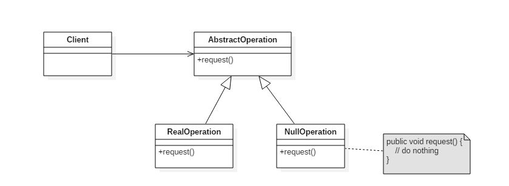

##### Implementation

```java
public abstract class AbstractOperation {
    abstract void request();
}
```

```java
public class RealOperation extends AbstractOperation {
    @Override
    void request() {
        System.out.println("do something");
    }
}
```

```java
public class NullOperation extends AbstractOperation{
    @Override
    void request() {
        // do nothing
    }
}
```

```java
public class Client {
    public static void main(String[] args) {
        AbstractOperation abstractOperation = func(-1);
        abstractOperation.request();
    }

    public static AbstractOperation func(int para) {
        if (para < 0) {
            return new NullOperation();
        }
        return new RealOperation();
    }
}
```


