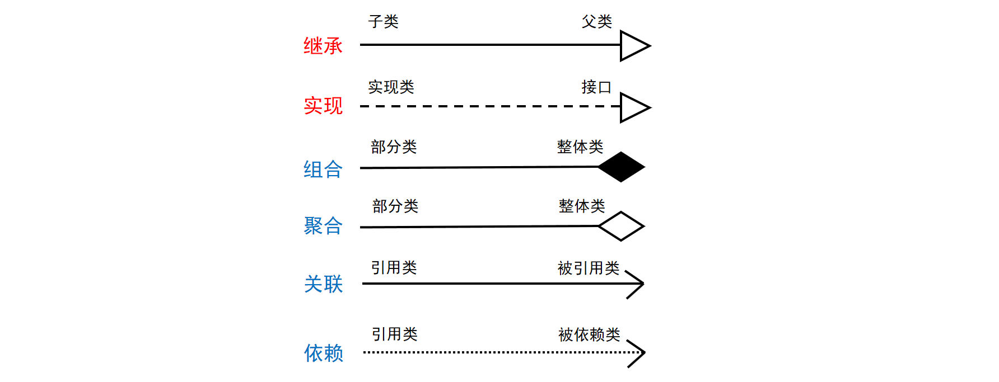
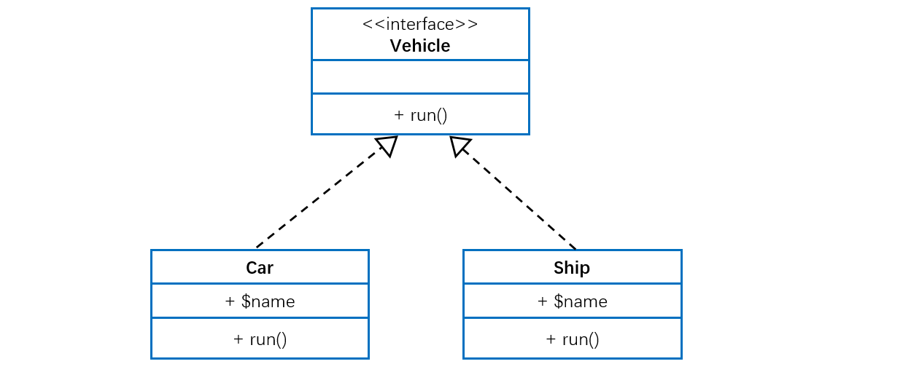
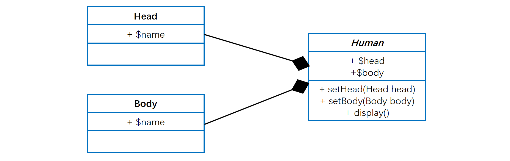
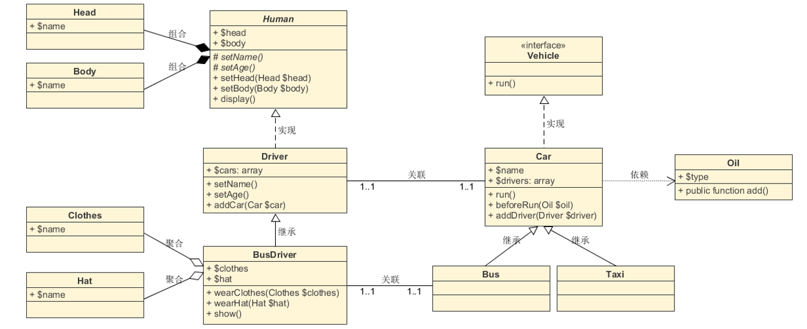

[TOC]

### UML类图

UML 类图是一种**结构图**，用于描述一个系统的**静态结构**。类图以反映类结构和类之间**关系**为目的，用以描述软件系统的结构，是一种**静态建模方法**。类图中的类，与面向对象语言中的类的概念是对应的。

#### 类结构

在类的 UML 图中，使用**长方形**描述一个**类的主要构成**，长方形垂直地分为**三层**，以此放置类的**名称、属性和方法**。

其中

- 一般类的**类名**用正常字体粗体表示，如上图。抽象类名用斜体字粗体，如 *User*；接口则需在上方加上`<<interface>>`。

- 属性和方法都需要标注**可见性符号**，`+`代表`public`，`#`代表`protected`，`-`代表`private`。

- 另外，还可以用冒号`:`表明属性的类型和方法的返回类型，如`+$name:string`、`+getName():string`。当然，类型说明**并非必须**。

#### 类关系

类与类之间的关系主要有六种：**继承、实现、组合、聚合、关联和依赖**，这六种关系的箭头表示如下。

接着我们来了解类关系的具体内容。六种类关系中，**组合、聚合、关联**这三种类关系的代码结构一样，都是用属性来保存另一个类的引用，所以要通过内容间的关系来区别。

##### 1. 继承

继承关系也称**泛化关系**（Generalization），用于描述**==父类与子类==**之间的关系。父类又称作基类，子类又称作派生类。

继承关系中，子类继承父类的所有功能，父类所具有的属性、方法，子类应该都有。子类中除了与父类一致的信息以外，还包括额外的信息。

例如：公交车、出租车和小轿车都是汽车，他们都有名称，并且都能在路上行驶。

##### 2. 实现

实现关系（Implementation），主要用来规定**接口和实现类**的关系。

接口（包括抽象类）是方法的集合，在实现关系中，类实现了接口，类中的方法实现了接口声明的所有方法。

例如：汽车和轮船都是交通工具，而交通工具只是一个可移动工具的抽象概念，船和车实现了具体移动的功能。

##### 3. 组合

组合关系（Composition）：**整体与部分的关系**，但是整体与部分不可以分开。

组合关系表示类之间整体与部分的关系，整体和部分有一致的生存期。一旦整体对象不存在，部分对象也将不存在，是同生共死的关系。

例如：人由头部和身体组成，两者不可分割，共同存在。

##### 4. 聚合

聚合关系（Aggregation）：整体和部分的关系，整体与部分可以分开。

聚合关系也表示类之间整体与部分的关系，成员对象是整体对象的一部分，但是成员对象可以脱离整体对象独立存在。

例如：公交车司机和工衣、工帽是整体与部分的关系，但是可以分开，工衣、工帽可以穿在别的司机身上，公交司机也可以穿别的工衣、工帽。

##### 5. 关联

关联关系（Association）：表示一个**类的属性保存了对另一个类的一个实例**（或多个实例）的引用。

关联关系是类与类之间最常用的一种关系，表示一类对象与另一类对象之间有联系。组合、聚合也属于关联关系，只是关联关系的类间关系比其他两种要弱。

关联关系有四种：双向关联、单向关联、自关联、多重数关联。

例如：汽车和司机，一辆汽车对应特定的司机，一个司机也可以开多辆车。

在UML图中，双向的关联可以有两个箭头或者没有箭头，单向的关联或自关联有一个箭头。

在多重性关系中，可以直接在关联直线上增加一个数字，表示与之对应的另一个类的对象的个数。

- `1..1`：仅一个
- `0..*`：零个或多个
- `1..*`：一个或多个
- `0..1`：没有或只有一个
- `m..n`：最少m、最多n个 (m<=n)

##### 6. 依赖

依赖关系（Dependence）：假设 A 类的**变化引起**了 B 类的变化，则说名 B 类依赖于 A 类。

大多数情况下，依赖关系体现在**某个类的方法使用另一个类的对象作为参数**。

依赖关系是一种“使用”关系，特定事物的改变有可能会影响到使用该事物的其他事物，在需要表示一个事物使用另一个事物时使用依赖关系。

例如：汽车依赖汽油，如果没有汽油，汽车将无法行驶。

#### 总结

这六种类关系中，组合、聚合和关联的代码结构一样，可以从关系的强弱来理解，各类关系从强到弱依次是：继承→实现→组合→聚合→关联→依赖。如下是完整的一张 UML 关系图。

**参考资料**

- https://www.cnblogs.com/ldj3/p/9143821.html

