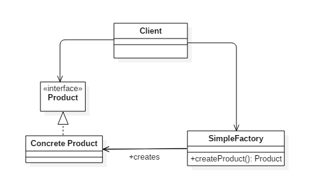
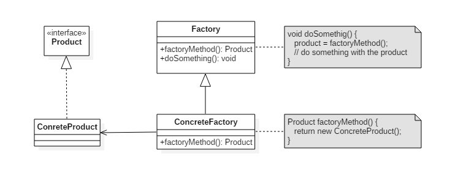
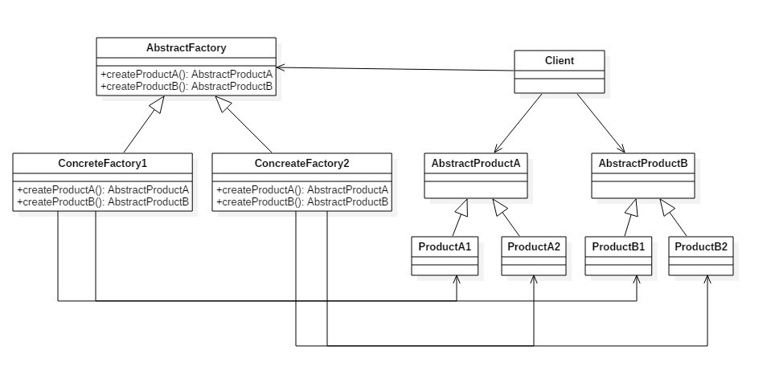
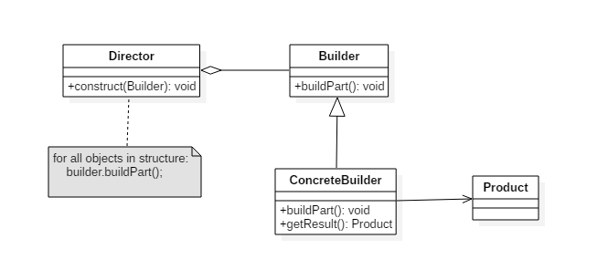
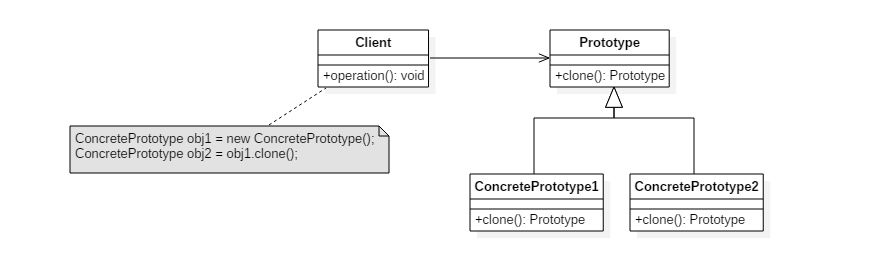

[TOC]

### 设计模式-创建型

#### 单例模式（Singleton）

确保**一个类==只有一个实例==**，并提供该实例的**全局访问点**。

使用一个**私有构造函数**、一个**私有静态变量**以及一个**公有静态函数**来实现。

私有构造函数保证了不能通过构造函数来创建对象实例，只能通过公有静态函数返回**唯一的私有静态变量**。


单例模式有好几种实现方式，如下。


##### 1. 懒汉式-线程不安全

以下实现中，私有静态变量 uniqueInstance 被**延迟实例化**，这样做的好处是，如果没有用到该类，那么就不会实例化 uniqueInstance，从而节约资源。

这个实现在**多线程环境下是不安全**的，如果多个线程能够同时进入 `if (uniqueInstance == null)` ，并且此时 uniqueInstance 为 null，那么会有==**多个线程**==执行 `uniqueInstance = new Singleton();` 语句，这将导致实例化多次 uniqueInstance。

```java
public class Singleton {
	
    // 私有静态变量 唯一实例
    private static Singleton uniqueInstance;

    private Singleton() {
    }

    public static Singleton getUniqueInstance() {
        // 这里在多线程下不安全，如果多个判断为null就初始化多个实例
        if (uniqueInstance == null) {
            uniqueInstance = new Singleton();
        }
        return uniqueInstance;
    }
}
```

##### 2. 饿汉式-线程安全

线程不安全问题主要是由于 uniqueInstance 被**实例化多次**，采取**直接实例化** uniqueInstance 的方式就不会产生线程不安全问题。

但是**直接实例化**的方式也丢失了延迟实例化带来的节约资源的好处。

```java
// 自己直接实例化
private static Singleton uniqueInstance = new Singleton();
```

##### 3. 懒汉式-线程安全

只需要对 getUniqueInstance() 方法**加锁**，那么在一个时间点只能有**一个线程**能够进入该方法，从而避免了实例化多次 uniqueInstance。

但是当一个线程进入该方法之后，其它试图进入该方法的线程都必须**等待**，即使 uniqueInstance 已经被实例化了。这会让线程阻塞时间过长，因此该方法有性能问题，**不推荐使用**。

```java
// 对整个方法加锁
public static synchronized Singleton getUniqueInstance() {
    if (uniqueInstance == null) {
        uniqueInstance = new Singleton();
    }
    return uniqueInstance;
}
```

##### 4. ==双重校验锁-线程安全※==

uniqueInstance 只需要被实例化一次，之后就可以直接使用了。加锁操作只需要对实例化那部分的代码进行，只有当 uniqueInstance **没有被实例化时**，才需要进行**加锁**。

**双重校验锁**先判断 uniqueInstance 是否已经被实例化，如果没有被实例化，那么才对实例化语句进行加锁。

```java
public class Singleton {
	// 如果不加volatile关键字的话，可能会引发空指针异常
    private volatile static Singleton uniqueInstance;

    private Singleton() {
    }
	
    // 双重校验锁
    public static Singleton getUniqueInstance() {
        if (uniqueInstance == null) {
            // 仅仅在初始化的时候才加锁
            synchronized (Singleton.class) {
                // 再加一层判断
                if (uniqueInstance == null) {
                    uniqueInstance = new Singleton();
                }
            }
        }
        return uniqueInstance;
    }
}
```

考虑下面的实现，也就是只使用了一个 if 语句。在 uniqueInstance == null 的情况下，如果两个线程都执行了 if 语句，那么两个线程都会进入 if 语句块内。虽然在 if 语句块内有加锁操作，但是两个线程都会执行 `uniqueInstance = new Singleton();` 这条语句，只是先后的问题，那么就会进行**两次实例化**。因此必须使用双重校验锁，也就是需要使用==**两个 if 语句**==。

```java
if (uniqueInstance == null) {
    synchronized (Singleton.class) {
        uniqueInstance = new Singleton();
    }
}
```

uniqueInstance 采用 ==**volatile**== 关键字修饰也是**很有必要**的（否则可能出现空指针异常）， `uniqueInstance = new Singleton();` 这段代码其实是分为三步执行：

1. 为 uniqueInstance 分配内存空间
2. 初始化 uniqueInstance
3. 将 uniqueInstance 指向分配的内存地址

但是由于 JVM 具有**指令重排**的特性，执行顺序有可能变成 1>3>2。指令重排在单线程环境下不会出现问题，但是在多线程环境下会导致一个线程获得还没有初始化的实例。例如，线程 T<sub>1</sub> 执行了 1 和 3，此时 T<sub>2</sub> 调用 getUniqueInstance() 后发现 uniqueInstance 不为空，因此返回 uniqueInstance，但此时 uniqueInstance 还未被初始化。

**使用 volatile 可以==禁止== JVM 的指令重排**，保证在多线程环境下也能正常运行。

##### 5. ==静态内部类实现Holder方式==

当 Singleton 类加载时，静态内部类 SingletonHolder 没有被加载进内存。只有当调用 `getUniqueInstance()` 方法从而触发 `SingletonHolder.INSTANCE` 时 SingletonHolder 才会被加载 ，此时初始化 INSTANCE 实例，并且 JVM 能确保 INSTANCE **只被实例化一次**。

这种方式**不仅具有延迟初始化**的好处，而且由 JVM 提供了对线程安全的支持。目前使用比较多的方法。

```java
public class Singleton {

    private Singleton() {
    }

    // 使用静态内部类 可延迟加载
    private static class SingletonHolder {
        private static final Singleton INSTANCE = new Singleton();
    }

    public static Singleton getUniqueInstance() {
        return SingletonHolder.INSTANCE;
    }
}
```

##### 6. ==枚举实现==

```java
public enum Singleton {

    INSTANCE;

    private String objName;


    public String getObjName() {
        return objName;
    }


    public void setObjName(String objName) {
        this.objName = objName;
    }


    public static void main(String[] args) {

        // 单例测试
        Singleton firstSingleton = Singleton.INSTANCE;
        firstSingleton.setObjName("firstName");
        System.out.println(firstSingleton.getObjName());
        Singleton secondSingleton = Singleton.INSTANCE;
        secondSingleton.setObjName("secondName");
        System.out.println(firstSingleton.getObjName());
        System.out.println(secondSingleton.getObjName());

        // 反射获取实例测试
        try {
            Singleton[] enumConstants = Singleton.class.getEnumConstants();
            for (Singleton enumConstant : enumConstants) {
                System.out.println(enumConstant.getObjName());
            }
        } catch (Exception e) {
            e.printStackTrace();
        }
    }
}
```

```html
firstName
secondName
secondName
secondName
```

该实现在多次序列化再进行反序列化之后，不会得到多个实例。而其它实现需要使用 **transient** 修饰所有字段，并且实现序列化和反序列化的方法。

该实现可以==**防止反射攻击**==。在其它实现中，通过 setAccessible() 方法可以将**私有**构造函数的访问级别设置为 **public**，然后调用构造函数从而实例化对象，如果要防止这种攻击，需要在构造函数中添加防止多次实例化的代码。该实现是**由 JVM 保证**只会实例化一次，因此不会出现上述的反射攻击。

**举例**

- Logger Classes
- Configuration Classes
- Accesing resources in shared mode
- Factories implemented as Singletons

**JDK**

- [java.lang.Runtime#getRuntime()](http://docs.oracle.com/javase/8/docs/api/java/lang/Runtime.html#getRuntime%28%29)
- [java.awt.Desktop#getDesktop()](http://docs.oracle.com/javase/8/docs/api/java/awt/Desktop.html#getDesktop--)
- [java.lang.System#getSecurityManager()](http://docs.oracle.com/javase/8/docs/api/java/lang/System.html#getSecurityManager--)


#### 简单工厂模式（Simple Factory）

在**创建一个对象**时不向客户暴露内部细节，并提供一个**创建对象的==通用接口==**。

简单工厂把实例化的操作单独放到一个类中，这个类就成为**简单工厂类**，让简单工厂类来决定应该用哪个**具体子类来实例化**。创建对象的任务交给简单工厂。

这样做能把**客户类**和具体**子类**的实现解耦，客户类不再需要知道有哪些子类以及应当实例化哪个子类。客户类往往有**多个**，如果不使用简单工厂，那么所有的客户类都要知道所有子类的细节。而且一旦子类发生改变，例如增加子类，那么所有的客户类都要进行修改。



##### 实现方式

```java
// 产品接口
public interface Product {
}
```

Product的三种实现

```java
public class ConcreteProduct implements Product {
}
```

```java
public class ConcreteProduct1 implements Product {
}
```

```java
public class ConcreteProduct2 implements Product {
}
```

以下的 Client 类包含了实例化的代码，这是一种**错误**的实现。如果在客户类中存在这种实例化代码，就需要**考虑将代码放到简单工厂**中。

```java
// 不好的实现
public class Client {

    public static void main(String[] args) {
        int type = 1;
        // 自己定义产生Product对象
        Product product;
        if (type == 1) {
            product = new ConcreteProduct1();
        } else if (type == 2) {
            product = new ConcreteProduct2();
        } else {
            product = new ConcreteProduct();
        }
        // do something with the product
    }
}
```

以下的 SimpleFactory 是简单工厂实现，它被所有需要进行实例化的客户类调用。

```java
// 简单工厂类
public class SimpleFactory {
	// 返回接口类型
    public Product createProduct(int type) {
        if (type == 1) {
            return new ConcreteProduct1();
        } else if (type == 2) {
            return new ConcreteProduct2();
        }
        return new ConcreteProduct();
    }
}
```

```java
// 客户类
public class Client {

    public static void main(String[] args) {
        // 构造简单工厂
        SimpleFactory simpleFactory = new SimpleFactory();
        Product product = simpleFactory.createProduct(1);	// 往工厂传入类型
        // do something with the product
    }
}
```


#### 工厂方法模式（Factory Method）

定义了一个**创建对象的接口**，但由子类决定要实例化哪个类。**工厂方法把实例化操作推迟到子类**。工厂方法模式是对简单工厂模式进一步的**解耦**，因为在工厂方法模式中是**一个子类对应一个工厂类**，而这些**工厂类都实现于一个抽象接口**。这相当于是把原本会因为业务代码而庞大的简单工厂类，拆分成了**==一个个的工厂类==**，这样代码就不会都耦合在同一个类里了。

在简单工厂中，创建对象的是**另一个类**，而在工厂方法中，是由**子类来创建对象**。

下图中，Factory 有一个 doSomething() 方法，这个方法需要用到一个**产品对象**，这个产品对象由 factoryMethod() 方法创建。该方法是**抽象**的，需要由**子类去实现**。



##### 实现方式

```java
// 抽象工厂类
public abstract class Factory {
    // 工厂方法 产生Product对象
    abstract public Product factoryMethod();
    
    public void doSomething() {
        Product product = factoryMethod();
        // do something with the product
    }
}
```

之后下面有好几个**小工厂**，负责产生具体的对象，而不是简单工厂模式那样把全部都综合在一个类中。

```java
// 具体工厂
public class ConcreteFactory extends Factory {
    public Product factoryMethod() {
        return new ConcreteProduct();
    }
}
```

```java
// 具体工厂
public class ConcreteFactory1 extends Factory {
    public Product factoryMethod() {
        return new ConcreteProduct1();
    }
}
```

```java
// 具体工厂
public class ConcreteFactory2 extends Factory {
    public Product factoryMethod() {
        return new ConcreteProduct2();
    }
}
```

工厂方法把简单工厂的内部逻辑判断转移到了客户端代码来进行。

你想要**加功能**，本来是改工厂类的，而现在是**修改客户端**。而且各个不同功能的实例对象的创建代码，也没有耦合在同一个工厂类里，这也是工厂方法模式对简单工厂模式解耦的一个体现。工厂方法模式克服了简单工厂会违背开-闭原则的缺点，又保持了封装对象创建过程的优点。

但工厂方法模式的缺点是每增加一个**产品类**，就需要增加一个对应的**工厂类**，增加了额外的开发量。

**JDK**

- [java.util.Calendar](http://docs.oracle.com/javase/8/docs/api/java/util/Calendar.html#getInstance--)
- [java.util.ResourceBundle](http://docs.oracle.com/javase/8/docs/api/java/util/ResourceBundle.html#getBundle-java.lang.String-)
- [java.text.NumberFormat](http://docs.oracle.com/javase/8/docs/api/java/text/NumberFormat.html#getInstance--)
- [java.nio.charset.Charset](http://docs.oracle.com/javase/8/docs/api/java/nio/charset/Charset.html#forName-java.lang.String-)
- [java.net.URLStreamHandlerFactory](http://docs.oracle.com/javase/8/docs/api/java/net/URLStreamHandlerFactory.html#createURLStreamHandler-java.lang.String-)
- [java.util.EnumSet](https://docs.oracle.com/javase/8/docs/api/java/util/EnumSet.html#of-E-)
- [javax.xml.bind.JAXBContext](https://docs.oracle.com/javase/8/docs/api/javax/xml/bind/JAXBContext.html#createMarshaller--)


#### 抽象工厂（Abstract Factory）

提供一个接口，用于创建  **相关的对象家族** 。抽象工厂与工厂方法模式的区别在于：抽象工厂是可以**生产多个产品**的，例如 MysqlFactory 里可以生产 MysqlUser 以及 MysqlLogin 两个产品，而这两个产品又是属于一个系列的，因为它们都是属于MySQL数据库的表。而**工厂方法**模式则只能生产**一个产品**，例如之前的 MysqlFactory 里就只可以生产一个 MysqlUser 产品。

抽象工厂模式创建的是**对象家族**，也就是**很多对象**而不是一个对象，并且这些对象是**相关**的，也就是说必须一起创建出来。而工厂方法模式只是用于创建一个对象，这和抽象工厂模式有很大不同。

抽象工厂模式用到了工厂方法模式来创建**单一对象**，AbstractFactory 中的 createProductA() 和 createProductB() 方法都是让子类来实现，这两个方法单独来看就是在创建一个对象，这符合工厂方法模式的定义。

至于创建对象的家族这一概念是在 **Client** 体现，Client 要通过 AbstractFactory 同时调用两个方法来创建出两个对象，在这里这两个对象就有很大的相关性，Client 需要同时创建出这两个对象。

从高层次来看，**抽象工厂使用了==组合==，即 Cilent 组合了 AbstractFactory，而工厂方法模式使用了==继承==**。



##### 实现方法

```java
public class AbstractProductA {
}
```

```java
public class AbstractProductB {
}
```

```java
public class ProductA1 extends AbstractProductA {
}
```

```java
public class ProductA2 extends AbstractProductA {
}
```

```java
public class ProductB1 extends AbstractProductB {
}
```

```java
public class ProductB2 extends AbstractProductB {
}
```

```java
// 组合成抽象工厂
public abstract class AbstractFactory {
    abstract AbstractProductA createProductA();
    abstract AbstractProductB createProductB();
}
```

```java
public class ConcreteFactory1 extends AbstractFactory {
    AbstractProductA createProductA() {
        return new ProductA1();
    }

    AbstractProductB createProductB() {
        return new ProductB1();
    }
}
```

```java
public class ConcreteFactory2 extends AbstractFactory {
    AbstractProductA createProductA() {
        return new ProductA2();
    }

    AbstractProductB createProductB() {
        return new ProductB2();
    }
}
```

```java
public class Client {
    public static void main(String[] args) {
        AbstractFactory abstractFactory = new ConcreteFactory1();
        AbstractProductA productA = abstractFactory.createProductA();
        AbstractProductB productB = abstractFactory.createProductB();
        // do something with productA and productB
    }
}
```

抽象工厂模式最大的好处是易于交换产品系列。抽象工厂模式的另一个好处就是它**让具体的创建实例过程与客户端分离**，客户端是通过它们的抽象接口操作实例，产品实现类的具体类名也被具体的工厂实现类分离，不会出现在客户端代码中。


##### 抽象工厂的==改进==

- 1、简单工厂 + 抽象工厂

- 2、**反射**  + 简单工厂
- 3、反射 + 配置文件 + 简单工厂

**JDK**

- [javax.xml.parsers.DocumentBuilderFactory](http://docs.oracle.com/javase/8/docs/api/javax/xml/parsers/DocumentBuilderFactory.html)
- [javax.xml.transform.TransformerFactory](http://docs.oracle.com/javase/8/docs/api/javax/xml/transform/TransformerFactory.html#newInstance--)
- [javax.xml.xpath.XPathFactory](http://docs.oracle.com/javase/8/docs/api/javax/xml/xpath/XPathFactory.html#newInstance--)


#### 生成器（Builder）

封装一个对象的**构造过程**，并允许按**步骤**构造。



##### 实现方法

以下是一个简易的 StringBuilder 实现，参考了 JDK 1.8 源码。

```java
public class AbstractStringBuilder {
    protected char[] value;

    protected int count;
	
    // 构造方法设置初始容量
    public AbstractStringBuilder(int capacity) {
        count = 0;
        value = new char[capacity];
    }

    public AbstractStringBuilder append(char c) {
        ensureCapacityInternal(count + 1);
        value[count++] = c;
        return this;
    }
	
    // 保证容量足够
    private void ensureCapacityInternal(int minimumCapacity) {
        // overflow-conscious code
        if (minimumCapacity - value.length > 0)
            expandCapacity(minimumCapacity);
    }
	
    // 扩容
    void expandCapacity(int minimumCapacity) {
        int newCapacity = value.length * 2 + 2;
        if (newCapacity - minimumCapacity < 0)
            newCapacity = minimumCapacity;
        if (newCapacity < 0) {
            if (minimumCapacity < 0) // overflow
                throw new OutOfMemoryError();
            newCapacity = Integer.MAX_VALUE;
        }
        value = Arrays.copyOf(value, newCapacity);
    }
}
```

```java
public class StringBuilder extends AbstractStringBuilder {
    public StringBuilder() {
        // 默认的大小16
        super(16);
    }

    @Override
    public String toString() {
        // Create a copy, don't share the array
        return new String(value, 0, count);
    }
}
```

```java
public class Client {
    public static void main(String[] args) {
        StringBuilder sb = new StringBuilder();
        final int count = 26;
        for (int i = 0; i < count; i++) {
            sb.append((char) ('a' + i));
        }
        System.out.println(sb.toString());
    }
}
```

```html
abcdefghijklmnopqrstuvwxyz
```

**JDK**

- [java.lang.StringBuilder](http://docs.oracle.com/javase/8/docs/api/java/lang/StringBuilder.html)
- [java.nio.ByteBuffer](http://docs.oracle.com/javase/8/docs/api/java/nio/ByteBuffer.html#put-byte-)
- [java.lang.StringBuffer](http://docs.oracle.com/javase/8/docs/api/java/lang/StringBuffer.html#append-boolean-)
- [java.lang.Appendable](http://docs.oracle.com/javase/8/docs/api/java/lang/Appendable.html)
- [Apache Camel builders](https://github.com/apache/camel/tree/0e195428ee04531be27a0b659005e3aa8d159d23/camel-core/src/main/java/org/apache/camel/builder)


#### 原型模式（Prototype）

使用**原型实例**指定要创建**对象的类型**，通过**复制**这个**原型来创建新对象**。如小明的水果点即将开业，需要做一些宣传和优惠券，这时我们只需要一张优惠券然后通过打印店复制一大堆，下次还需要搞活动的时候直接拿去复印就好了，不需要每一张每一张手动的去重新制作。



##### 实现方法

Prototype 原型类：声明**克隆方法**的接口，是所有具体原型类的公共类。

```java
// 原型类
public abstract class Prototype {
    abstract Prototype myClone();
}
```

ConcretePrototype（具体原型类）：它**实现**抽象类中声明的克隆方法，返回一个自己的克隆对象。

```java
public class ConcretePrototype extends Prototype {

    private String filed;

    public ConcretePrototype(String filed) {
        this.filed = filed;
    }

    @Override
    Prototype myClone() {
        return new ConcretePrototype(filed);
    }

    @Override
    public String toString() {
        return filed;
    }
}
```

Client（客户端）：客户让一个原型对象克隆自身，从而创建一个**新的对象**。

```java
public class Client {
    public static void main(String[] args) {
        Prototype prototype = new ConcretePrototype("abc");
        Prototype clone = prototype.myClone();
        System.out.println(clone.toString());
    }
}
```

```html
abc
```

根据在复制原型对象的同时是否复制在原型对象中的引用类型成员变量，原型模式分为两种：**深克隆**（Shallow Clone）、**浅克隆**（Deep Clone）。


**原型模式的优点：**

- 扩展性好，增加或减少**具体原型**对系统没有任何影响
- 原型模式提供了简化的创建结构，常常与**工厂方法**模式一起使用
- 如果创建对象的实例比较复杂的时候，原型模式可以简化对象的创建过程
- 可以使用深克隆的方式保存对象的状态，在操作过程中可以追溯操作日志，做撤销和回滚操作

**原型模式的缺点：**

- 需要为每一个类配置一个克隆方法，而且该克隆方法位于一个类的内部，当对已有的类进行改造时，需要修改源代码，违背了开闭原则
- 在做深克隆的时候，如果对象之间存在多重嵌套的引用时，为了实现克隆，对每一层对象对应的类都必须支持深克隆实现起来比较麻烦

**原型模式的适用环境：**

- 创建成本比较大，比如初始化需要较长时间、占用太多CPU、占用大量网络资源等
- 系统需要保存对象状态
- 避免使用分层创建的对象，并且实例对象只有一个或少数几个组合状态

**JDK**

- [java.lang.Object#clone()](http://docs.oracle.com/javase/8/docs/api/java/lang/Object.html#clone%28%29)


