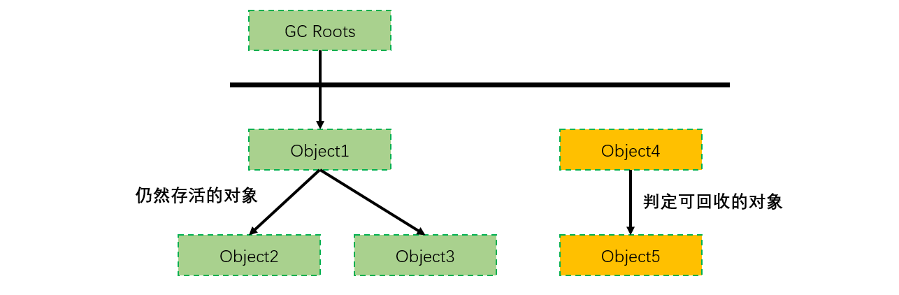
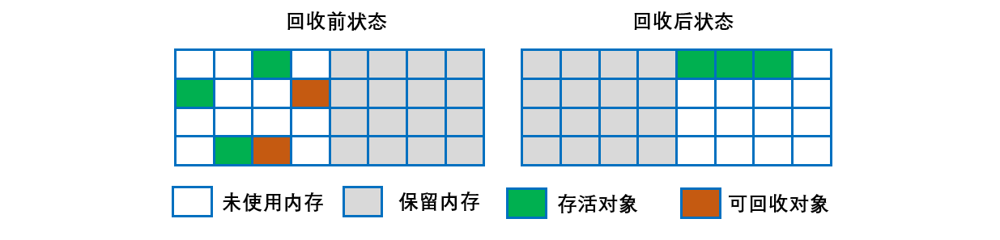
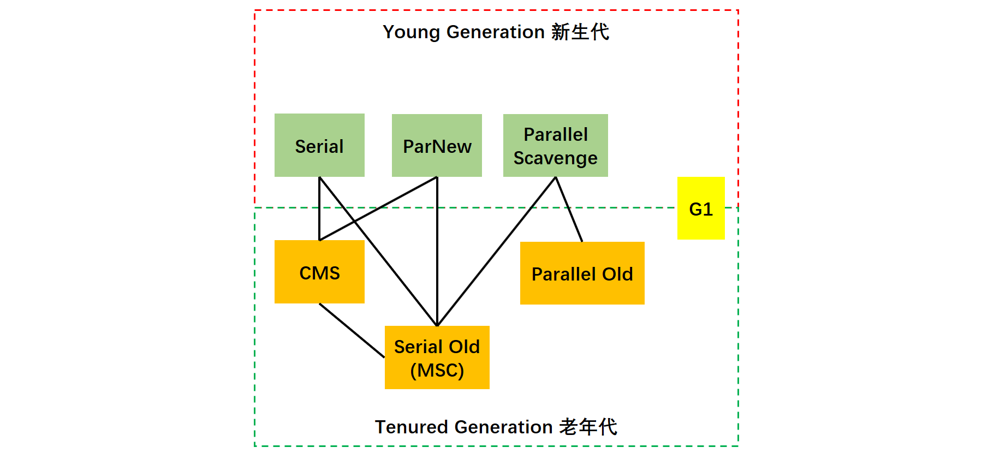
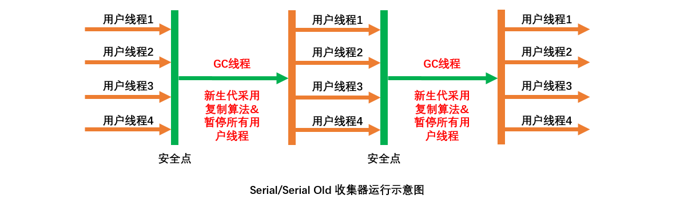
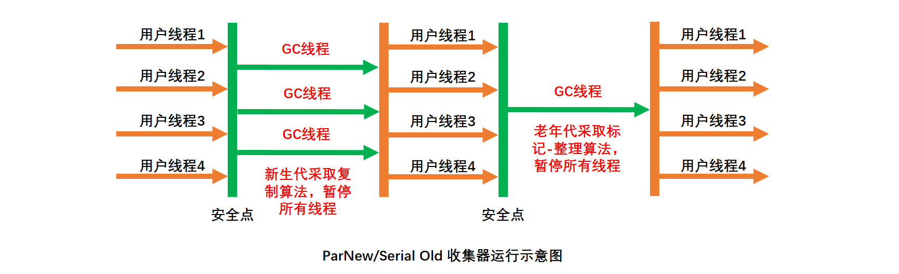
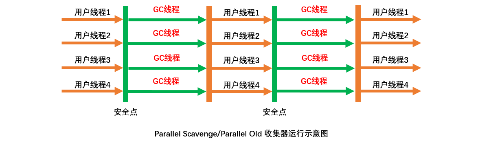
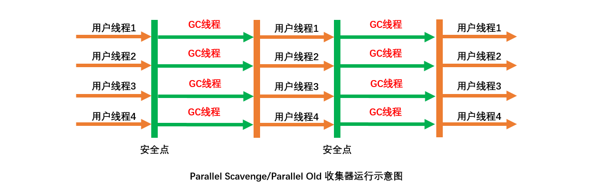
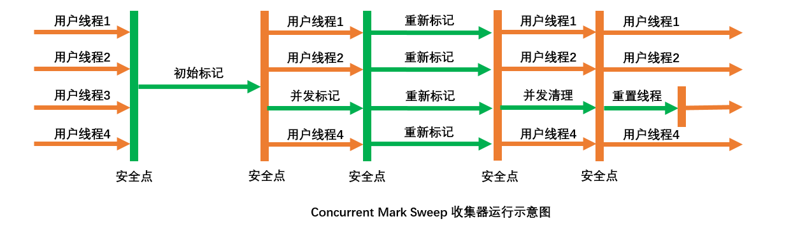
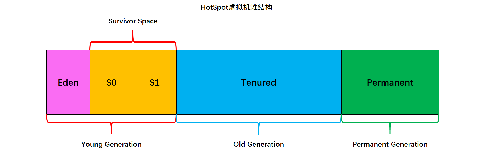
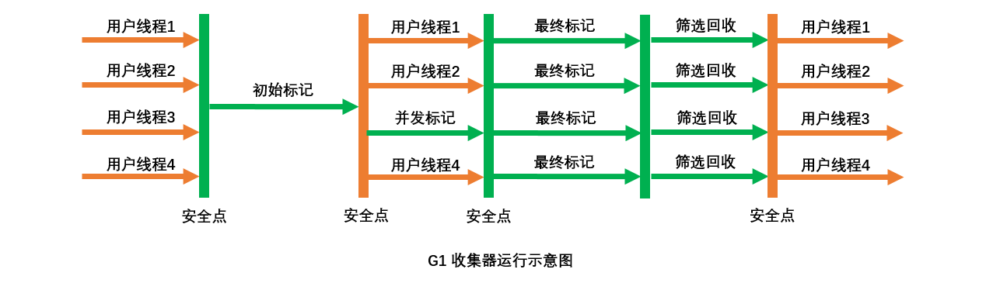

[TOC]

### 垃圾收集

垃圾收集（GC）主要是针对**==堆和方法区==**进行。**程序计数器、虚拟机栈和本地方法栈这三个区域属于线程私有**的，只存在于线程的生命周期内，线程结束之后就会消失，因此**不需要**对这三个区域进行垃圾回收。


#### 判断对象是否可回收？

##### 1. 引用计数算法

为对象添加一个**引用计数器**，当对象增加一个引用时计数器加 1，引用失效时计数器减 1。引用计数为 0 的对象可被回收。

在两个对象出现**循环引用**的情况下，此时引用计数器永远不为 0，导致无法对它们进行回收。正是因为循环引用的存在，因此 Java 虚拟机**不使用**引用计数算法。

```java
public class Test {

    public Object instance = null;

    public static void main(String[] args) {
        Test a = new Test();
        Test b = new Test();
        a.instance = b;
        b.instance = a;
        a = null;
        b = null;
        doSomething();
    }
}
```

在上述代码中，a 与 b 引用的对象实例互相持有了对象的引用，因此当我们把对 a 对象与 b 对象的引用去除之后，由于两个对象还存在互相之间的引用，导致两个 Test 对象无法被回收。

##### 2. 可达性分析算法

以 **GC Roots** 为起始点进行搜索，可达的对象都是存活的，不可达的对象可被回收。主流实现是通过这个实现的。

Java 虚拟机使用该算法来判断对象是否可被回收，GC Roots 一般包含以下内容：

- 虚拟机栈中局部变量表中引用的对象
- 本地方法栈中 JNI 中引用的对象
- 方法区中类静态属性引用的对象
- 方法区中的常量引用的对象



##### 3. 方法区的回收

因为方法区主要存放**永久代**对象，而永久代对象的回收率比新生代低很多，所以在方法区上进行**回收性价比不高**，且回收的条件非常**苛刻**。

主要是对常量池的回收和对**类的卸载**。

为了避免内存溢出，在大量使用**反射和动态代理**的场景都需要虚拟机具备**类卸载功能**。

类的卸载条件很多，需要满足以下三个条件，并且满足了条件也不一定会被卸载，同时满足以下的条件才是无用的类：

- 该类所有的**实例都已经被回收**，此时堆中不存在该类的任何实例。
- 加载该类的 **ClassLoader** 已经被回收。
- 该类对应的 Class 对象没有在任何地方被引用，也就无法在任何地方通过反射访问该类方法。

##### 4. finalize()

类似 C++ 的析构函数，用于关闭外部资源。但是 try-finally 等方式可以做得更好，并且该方法运行代价很高，不确定性大，无法保证各个对象的调用顺序，因此**最好不要使用**。

当一个对象可被回收时，如果需要执行该对象的 finalize() 方法，那么就有可能在该方法中让对象**重新被引用**，从而实现自救。自救只能进行一次，如果回收的对象之前调用了 finalize() 方法自救，后面回收时不会再调用该方法。

建议忘记这个方法的存在。

##### 5. 引用类型

无论是通过引用计数算法判断对象的引用数量，还是通过可达性分析算法判断对象是否可达，判定对象是否可被回收都与引用有关。

Java 提供了四种强度不同的引用类型。**==强软弱虚==**。

###### 5.1 强引用

被强引用关联的对象**不会**被回收。

使用 new 一个新对象的方式来创建强引用。

```java
Object obj = new Object();
```

###### 5.2 软引用

被软引用关联的对象只有在**内存不够**的情况下才会被回收。

使用 **SoftReference** 类来创建软引用。

```java
Object obj = new Object();
SoftReference<Object> sf = new SoftReference<Object>(obj);
obj = null;  // 使对象只被软引用关联
```

###### 5.3 弱引用

被弱引用关联的对象**一定会被回收**，也就是说它只能存活到下一次垃圾回收发生之前。

使用 WeakReference 类来创建弱引用。

```java
Object obj = new Object();
WeakReference<Object> wf = new WeakReference<Object>(obj);
obj = null;
```

###### 5.4 虚引用

又称为幽灵引用或者幻影引用，一个对象是否有虚引用的存在，不会对其生存时间造成影响，也无法通过虚引用得到一个对象。

为一个对象设置虚引用的唯一目的是能在这个对象被回收时收到一个系统通知。

使用 **PhantomReference** 来创建虚引用。

```java
Object obj = new Object();
PhantomReference<Object> pf = new PhantomReference<Object>(obj, null);
obj = null;
```


#### 垃圾收集算法

##### 1. 标记-清除算法

主要分为标记与清除两个步骤。

在标记阶段，程序会检查每个对象是否为**活动对象**，如果是活动对象，则程序会在**对象头部**打上标记。

在清除阶段，会进行对象回收并取消标志位，另外，还会判断回收后的分块与前一个空闲分块是否连续，若连续，会**合并这两个分块**。回收对象就是把对象作为分块，**连接到被称为 “空闲链表” 的单向链表**，之后进行分配时只需要**遍历**这个空闲链表，就可以找到分块。

在分配时，程序会搜索空闲链表寻找空间大于等于新对象大小 size 的块 block。如果它找到的块等于 size，会直接返回这个分块；如果找到的块大于 size，会将块分割成大小为 size 与 (block - size) 的两部分，返回大小为 size 的分块，并把大小为 (block - size) 的块返回给空闲链表。


不足：

- 标记和清除过程效率都不高；
- 会产生大量不连续的**内存碎片**，导致无法给**大对象**分配内存。如果后面一直没有内存给大对象就会一直触发Full GC。


##### 2. 标记-整理算法

让所有存活的对象都**向一端移动**，然后直接清理掉端边界以外的内存。


优点:

- **不会产生内存碎片**

不足:

- 需要移动大量对象，处理效率比较低。


##### 3. ==复制算法==

将内存划分为大小相等的**两块**，每次只使用其中一块，当这一块内存用完了就将还存活的对象复制到另一块上面，然后再把使用过的内存空间进行一次清理。

主要不足是只使用了内存的**一半**。



现在的商业虚拟机**==都采用==**这种收集算法回收新生代，但是**并不是划分为大小相等**的两块，而是一块**较大的 Eden 空间和两块较小的 Survivor 空间**，每次使用 Eden 和其中一块 Survivor。在回收时，将 Eden 和 Survivor 中还存活着的对象全部复制到另一块 Survivor 上，最后清理 Eden 和使用过的那一块 Survivor。

HotSpot 虚拟机的 Eden 和 Survivor 大小比例默认为 ==**8:1**==，保证了内存的利用率达到 90%。如果每次回收有多于 10% 的对象存活，那么一块 Survivor 就不够用了，此时需要依赖于老年代进行空间分配担保，也就是借用老年代的空间存储放不下的对象。

不足：存活对象过多的话导致复制开销较大。


##### 4. ==分代收集算法==

现在的商业虚拟机采用**分代收集算法**，它根据对象存活周期将内存划分为**几块**，不同块采用适当的收集算法。

一般将堆分为**新生代和老年代**。

- 新生代使用：复制算法
- 老年代使用：标记 - 清除 或者 标记 - 整理 算法（老年代中对象存活率较高）


#### HotSpot虚拟机的垃圾收集算法实现

##### 1. 枚举根节点

从可达性分析中从 **GC Roots** 节点找引用链这个操作为例，可以作为 GC Roots 的节点主要在全局性的引用（例如常量或者类静态属性）与执行上下文（例如栈帧中的本地变量表）中。

但是现在很多应用仅仅方法区就有数百兆，如果要**逐个检查**这里面的引用，那么必然会消耗很多的时间。

另外，可达性分析对执行时间的敏感还体现在 **GC 停顿**上，因为这项分析工作必须在一个能确保一致性的快照中进行 —— 这里的“一致性”指的是在整个分析过程中整个执行系统看起来就像是被冻结在某个时间点上，不可以出现分析过程中对象引用关系还在不停变化的情况，该点不满足的话分析结果准确性就无法得到保证。

这点是导致 GC 进行时必须停顿所有 Java 执行线程的其中一个重要原因，即使是号称不会发生停顿的 CMS 收集器中，枚举根节点也是必须要停顿的。

由于目前主流 Java 虚拟机使用的都是**准确式 GC**，所以当执行系统停顿下来后，并不需要一个不漏的检查完成所有执行上下文和全局的引用位置，**虚拟机应当是有办法直接得知那些地方存放着对象引用的。** 在 HotSpot  的实现中，是使用一组被称为 **OopMap** 的数据结构来达到这个目的的，在类加载的时候，HotSpot 就把对象内什么偏移量上是什么类型的数据计算出来，在 JIT 编译过程中，也会在特定的位置记录下栈和寄存器中哪些位置是引用。这样， GC 在扫描时就可以直接得知这些信息了。

##### 2. 安全点

在 OopMap 的帮助下，HotSpot 可以快速并且准确的完成 GC Roots 枚举，但是一个很现实的问题随之而来：可能导致引用关系变化，或者说 OopMap 内容变化的指令非常多，如果为每一条指令都生成对应的 OopMap，那么将需要大量的额外空间，这样 GC 的空间成本将会变得很高。

实际上，HotSpot 也的确没有为每一条指令都生成 OopMap，只是在“特定的位置” 记录了这些信息，这些位置被称为是安全点，**即程序执行时并非是在所有地方都能停顿下来开始 GC ，只有到达安全点时才能暂停。**

安全点的选择既不能太少以至于让 GC 等待太长时间，也不能过于频繁以至于过分增大运行时负荷。

**所以，安全点的选定基本上是以程序“是否具有让程序长时间执行的特征”为标准进行选定的——因为每条指令执行的时间都非常短暂，程序不太可能因为指令流长度太长这个原因而过长时间运行，“长时间执行”的最明显特征就是指令序列复用，例如方法调用、循环跳转、异常跳转等，所以具有这些功能的指令才会产生安全点。**

对于安全点，另一个需要考虑的问题就是如何让 GC 发生时让所有线程（这里不包括执行 JNI 调用的线程）都“跑”到最近的安全点再停顿下来。这里有两种方案可供选择：抢先式中断和主动式中断。

- 抢先式中断：无需线程的执行代码主动配合，在 GC 发生时，首先把所有线程全部中断，如果发现有线程中断的地方不再安全点上，就会发线程，让它“跑”到安全点上。现在几乎没有虚拟机实现采用抢先式中断来暂停线程从而响应GC事件
- 主动式中断：当 GC 需要中断线程时，不直接对线程操作，仅仅简单地设置一个标志，各个线程执行时主动去轮询这个标志，发现中断标志为真时就自己中断挂起。轮询标志的地方和安全点是重合的，另外再加上创建对象需要分配内存的地方。

##### 3. 安全区域

使用安全点似乎已经完美解决了如何进入 GC 的问题，但实际情况却并不一定，安全点机制保证了程序执行，在不太长的时间内就会遇到可以进入 GC 的安全点。

但是线程“不执行”的时候呢？所谓不执行就是没有分配 CPU 时间，典型的例子就是线程处于 Sleep 状态或者 Blocked 状态，这时候线程无法响应 JVM 的中断请求，“走”到安全点去中断挂起，JVM 显然也不太可能等待线程重新被分配 CPU 时间。对于这种状况，就需要安全区域来解决。

**安全区域就是在一段代码片段中，引用关系不会发生变化，在这个区域中的任意地方开始 GC 都是安全的。**

在线程执行到安全区域中的代码时，首先标识自己已经进入了安全区域，那样，当这段时间里 JVM 要发起 GC 时，就不用管标识自己为安全区域状态的线程了。

当线程要离开安全区域时，它要检查系统是否已经完成了根节点枚举（或者是整个 GC 过程），如果完成了，那线程就继续执行，否则它就必须等待直到收到可以安全离开安全区域的信号为止。


#### 垃圾收集器

下图是 HotSpot 虚拟机中的 7 个垃圾收集器，**连线**表示垃圾收集器可以**配合使用**。

- 单线程与多线程：单线程指的是垃圾收集器**只使用一个线程**，而多线程使用多个线程；
- 串行与并行：串行指的是垃圾收集器与用户程序交替执行，这意味着在执行垃圾收集的时候需要**停顿用户程序**；并行指的是垃圾收集器和用户程序同时执行。只有**CMS 和 G1 是并行**方式执行。



##### 1. Serial 收集器

Serial 翻译为串行，也就是说它以**串行的方式执行**。

它是**单线程**的收集器，只会使用一个线程进行垃圾收集工作。它在垃圾收集时**必须暂停其他**的工作线程，直到收集结束。参考下图。GC 线程是单线程的。



它的优点是简单高效，在单个 CPU 环境下，由于没有线程交互的开销，因此拥有最高的单线程收集效率。

它是虚拟机运行在 **Client** 模式下的默认新生代收集器，因为在该场景下内存一般来说不会很大。它收集一两百兆垃圾的停顿时间可以控制在一百多毫秒以内，只要不是太频繁，这点停顿时间是可以接受的。


##### 2. ParNew 收集器

它是 Serial 收集器对应的**多线程**版本。多条垃圾收集线程并行工作，但此时用户线程仍然处于等待状态。

它是虚拟机在 **Server** 模式下默认的**新生代收集器**，除了性能原因外，主要是因为除了 Serial 收集器，只有它能与 **CMS** 收集器配合使用。




##### 3. Parallel Scavenge 收集器

与 ParNew 一样是**多线程**收集器。

其它收集器目标是尽可能缩短垃圾收集时用户线程的停顿时间，而它的目标是达到一个可控制的吞吐量，因此它被称为**“吞吐量优先”**收集器。这里的**吞吐量指 CPU 用于运行用户程序的时间占总时间的比值**。

**停顿时间越短就越适合需要与用户交互的程序，良好的响应速度能提升用户体验。而高吞吐量则可以高效率地利用 CPU 时间，尽快完成程序的运算任务，适合在后台运算而不需要太多交互的任务。**



缩短停顿时间是以牺牲吞吐量和新生代空间来换取的：新生代空间变小，垃圾回收变得频繁，导致吞吐量下降。

可以通过一个开关参数打开 GC 自适应的调节策略（GC Ergonomics），就不需要手工指定新生代的大小（-Xmn）、Eden 和 Survivor 区的比例、晋升老年代对象年龄等细节参数了。虚拟机会根据当前系统的运行情况收集性能监控信息，动态调整这些参数以提供最合适的停顿时间或者最大的吞吐量。

**自适应调节策略**是 Parallel Scavenge 与 ParNew 收集器的一个重要区别。


##### 4. Serial Old 收集器

是 **Serial** 收集器的**老年代**版本，也是给 **Client** 场景下的虚拟机使用。使用多线程和标记-整理算法。


如果用在 Server 场景下，它有两大用途：

- 在 JDK 1.5 以及之前版本（Parallel Old 诞生以前）中与 Parallel Scavenge 收集器搭配使用。
- 作为 CMS 收集器的后备预案，在并发收集发生 Concurrent Mode Failure 时使用。


##### 5. Parallel Old 收集器

是 **Parallel Scavenge** 收集器的**老年代**版本。



在注重**吞吐量**以及 CPU 资源敏感的场合，都可以优先考虑 Parallel Scavenge 加 Parallel Old 收集器。


##### 6. ==CMS 收集器==

CMS（Concurrent Mark Sweep），Mark Sweep 指的是**标记 - 清除算法**。是一种以**==获取最短回收停顿时间==**为目标的收集器。比如服务器尤其重视服务响应速度，希望系统的停顿时间最短。

**分为以下四个流程：**

- **初始标记**：仅仅只是标记一下 GC Roots 能直接关联到的对象，速度很快，需要停顿。
- **并发标记**：进行 GC Roots Tracing 的过程，它在整个回收过程中耗时最长，不需要停顿。
- **重新标记**：为了修正并发标记期间因用户程序继续运作而导致标记产生变动的那一部分对象的标记记录，需要停顿。
- **并发清理**：不需要停顿。

在整个过程中耗时最长的并发标记和并发清除过程中，收集器线程都可以与用户线程一起工作，**不需要进行停顿**。



**具有以下缺点：**

- **吞吐量低**：低停顿时间是以牺牲吞吐量为代价的，导致 CPU 利用率不够高。
- **无法处理浮动垃圾**，可能出现 Concurrent Mode Failure。**浮动垃圾**是指并发清除阶段由于用户线程继续运行而产生的垃圾，这部分垃圾只能到下一次 GC 时才能进行回收。由于浮动垃圾的存在，因此需要预留出一部分内存，意味着 CMS 收集不能像其它收集器那样等待老年代快满的时候再回收。如果预留的内存不够存放浮动垃圾，就会出现 Concurrent Mode Failure，这时虚拟机将临时启用 Serial Old 来替代 CMS。
- **标记 - 清除算法导致的空间碎片**，往往出现老年代空间剩余，但无法找到足够大连续空间来分配当前对象，不得不提前触发一次 **Full GC**。


##### 7. G1收集器

**G1**（Garbage-First），它是一款**面向服务端**应用的垃圾收集器，在多 CPU 和大内存的场景下有很好的性能。HotSpot 开发团队赋予它的**使命是未来可以替换**掉 CMS 收集器。

堆被分为新生代和老年代（Hotspot 虚拟机堆结构如下图所示），其它收集器进行收集的范围都是整个新生代或者老年代，而 **G1 可以直接对新生代和老年代一起回收。**



G1 把**堆**划分成多个大小相等的**独立区域**（Region），新生代和老年代不再物理隔离。如下图所示。


通过引入 **Region** 的概念，从而将原来的一整块内存空间划分成多个的**小空间**，使得每个**小空间**可以**单独**进行垃圾回收。这种划分方法带来了很大的灵活性，使得可预测的停顿时间模型成为可能。通过记录每个 Region 垃圾回收时间以及回收所获得的空间（这两个值是通过过去回收的经验获得），并维护一个**优先列表**，每次根据允许的收集时间，优先回收**价值最大**的 Region。

每个 Region 都有一个 **Remembered Set**，用来记录该 Region 对象的引用对象所在的 Region。通过使用 Remembered Set，在做可达性分析的时候就可以**避免全堆扫描**。



如果**不计算**维护 Remembered Set 的操作，G1 收集器的运作大致可划分为以下几个步骤：

- **初始标记**
- **并发标记**
- **最终标记**：为了修正在并发标记期间因用户程序继续运作而导致标记产生变动的那一部分标记记录，虚拟机将这段时间对象变化记录在线程的 Remembered Set Logs 里面，最终标记阶段需要把 Remembered Set Logs 的数据合并到 Remembered Set 中。这阶段需要停顿线程，但是可并行执行。
- **筛选回收**：首先对各个 Region 中的回收价值和成本进行排序，根据用户所期望的 GC 停顿时间来制定回收计划。此阶段其实也可以做到与用户程序一起并发执行，但是因为只回收一部分 Region，时间是用户可控制的，而且停顿用户线程将大幅度提高收集效率。

具备如下特点：

- 空间整合：整体来看是基于“**标记 - 整理**”算法实现的收集器，从局部（两个 Region 之间）上来看是基于“**复制**”算法实现的，这意味着运行期间**不会产生内存空间碎片**。
- 可预测的停顿：能让使用者明确指定在一个长度为 M 毫秒的时间片段内，消耗在 GC 上的时间不得超过 N 毫秒。


#### GC 日志

一份摘自深入理解 Java 虚拟机中的一段 GC 日志

```java
33.125:[GC[DefNew:3324K->152K(3712K), 0.0025925 secs]3324K->152K(11904K), 0.0031680 secs]
100.667:[Full GC[Tenured:0 K->210K(10240K), 0.0149142secs]4603K->210K(19456K), [Perm:2999K->2999K(21248K)], 0.0150007 secs][Times:user=0.01 sys=0.00, real=0.02 secs]
```

如何理解？

- 首先 33.125 和 100.667 这个数值的意义是代表 GC 发生的**时间**，该数字是 GC 启动以来的时间
- GC 和 Full GC 则代表这次 GC 发生的**类型**，如果为 Full GC。则代表这次 GC 是S top The World 的。如果通      过 System.gc() 方法触发的则会显示 Full GC(System)。
- DefNew、Tenured、Perm 表示 GC 发生的**区域**，这里显示的区域名称与使用的 GC 收集器是密切相关的。
- 3324K-＞152K（3712K）则代表 **GC 前**该区域内已使用的**容量**->**GC后**该区域内已使用的容量（该区域内      的总容量）。
- 之后的 0.0025925 secs 表示这次 GC 所占用的时间单位为**秒**。
- 3324K->152K(11904K) 则是 **GC 前** Java 堆已使用容量-＞**GC 后** Java 堆已使用容量（Java 堆总容量）。
- [Times:user=0.01 sys=0.00, real=0.02 secs]这里面的 user、sys、real 分别代表用户态消耗 CPU 的时间      和内核态消耗的 CPU 的时间和操作开始到结束所经历的时间。


#### 垃圾收集器参数总结

垃圾收集相关的常用参数：

|              参数              |                             描述                             |
| :----------------------------: | :----------------------------------------------------------: |
|          UseSerialGC           | 虚拟机运行在 Client 模式下的默认值，打开此开关后，使用 Serial + Serial Old 的收集器组合进行内存回收 |
|          UseParNewGC           | 打开此开关后，使用  ParNew + Serial Old 的收集器组合进行内存回收 |
|       UseConcMarkSweepGC       | 打开此开关后，使用 ParNew+ CMS + Serial Old 的收集器组合进行内存回收。Serial Old 收集器将作为 CMS 收集器出现 Concurrent Mode Failure 失败后的后备收集器使用 |
|         UseParallelGC          | 虚拟机运行在 Server 模式下的默认值，打开此开关后，使用 Parallel Scavenge + Serial Old (PS Mark Sweep) 的收集器组合进行内存回收 |
|       UserParallelOldGC        | 打开此开关后，使用 Parallel Scavenge + Parallel Old 的收集器组合进行内存回收 |
|       **SurvivorRatio**        | 新生代中 Eden 区域与 Survivor 区域的容量比值，默认为 8，代表Eden: Survivor = **8:1** |
|     PretenureSizeThreshold     | 直接晋升到老年代的对象大小，设置这个参数后，大于这个参数的对象将直接在老年代分配 |
|      MaxTenuringThreshold      | 晋升到老年代的对象年龄。每个对象在坚持过一次 Minor GC 之后，年龄就增加1，当超过这个参数值时就进入老年代 |
|     UseAdaptiveSizePolicy      |     动态调整 Java 堆中各个区域的大小以及进入老年代的年龄     |
|     HandlePromotionFailure     | 是否允许分配担保失败，即老年代的剩余空间不足以应付新生代的整个Eden 和 Survivor 区的所有对象都存活的极端情况 |
|       ParallelGCThreads        |              设置并行 GC 时进行内存回收的线程数              |
|          GCTimeRatio           | GC 时间占总时间的比率，默认值是 99， 即允许 1% 的 GC 时间。仅在使用 Parallel Scavenge 收集器时生效 |
|        MaxGCPauseMillis        | 设置 GC 的**最大停顿**时间。仅在使用 Parallel Scavenge 收集器时生效 |
| CMSInitiatingOccupancyFraction | 设置 CMS 收集器在老年代时间被使用多少后触发垃圾收集。默认值为68%，仅在使用 CMS 收集器时生效 |
| UseCMSCompactAtFullCollection  | 设置 CMS 收集器在完成垃圾收集后是否要进行一次内存碎片整理。仅在使用 CMS 收集器时生效 |
|   CMSFullGCsBeforeCompaction   | 设置 CMS 收集器在进行若干次垃圾收集后再启动一次内存碎片整理，仅在使用 CMS 收集器时生效 |


**参考资料**

- 如何阅读GC日志：https://www.jianshu.com/p/4e508ed55155


