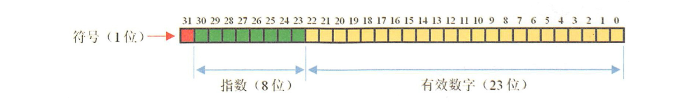
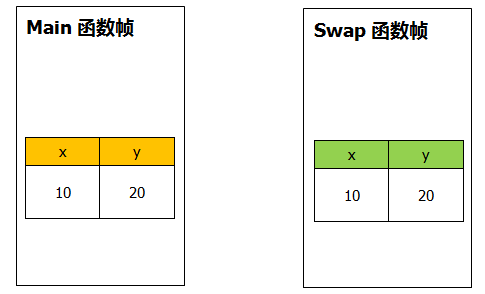

[TOC]

### 数据类型与程序结构

#### 进制表示

##### 1. 整数的二进制表示

**原码**：**第一位是符号位，0表示正数，1表示负数**。其余31位为具体的值，例如：

```java
10的原码: 00000000000000000000000000001010;
-10的原码: 10000000000000000000000000001010;
```

**反码**：在原码的基础上，符号位不变，其余的按位取反，例如：

```java
10的反码: 11111111111111111111111111110101; // 在java中没有用到
-10的反码: 11111111111111111111111111110101;
```

**补码**：负数的补码就是反码 + 1，整数的补码就是原码本身

```java
10的补码: 00000000000000000000000000001010;
-10的补码: 11111111111111111111111111110110;
```

**关联**

在 Java 中整数是用**补码**来表示的，记住**正数的补码就是原码**本身，**负数的补码是反码 + 1**

二进制整数最终都是以**补码**形式出现的。正数的补码与原码、 反码是一样的，而负数的补码是反码加 1 的结果。 

##### 2. 浮点数的二进制表示

浮点数有 float 与 long 类型。


float 浮点数格式如下：



指数称为“**阶码**”，有效数字称为“**尾数**”。符号位一位，**0 为正数，1 为负数**。阶码位 8 位存储**指数的移码**。尾数位共  **23 位**存储有效数字。

###### 浮点数计算不精确

计算机不能精确的表示很多数，因为很多数是**二进制**格式存储的。二进制仅能精确表示那些为 2 的**某次方和**的数。所以 0.9 不能用有限二进制位进行精确表示，所以 1 - 0.9 **并不精确地等于 0.1**。

```java
float a = 1f;
float b = 0.9f;
// 结果为：0.100000024
float f = a - b;	
```

==比较的时候别用 float==。**浮点数运算也是不精确的**。

在大多数的商业计算中，一般采用 java.math.**BigDecimal** 类来进行精确计算。

##### 3. 二进制运算

二进制运算符如下。

| 运算符 |             释义             |
| :----: | :--------------------------: |
|   <<   |      **左移**保留符号位      |
|   >>   |      **右移**保留符号位      |
|  >>>   |        **无符号右移**        |
|   ~    |         按位**取反**         |
|   ^    | **异或**，相同为 0，不同为 1 |
|   &    |          逻辑**与**          |
|   \|   |          逻辑**或**          |

###### ① **二进制移位运算**

- value << N ：保留符号位，其余的向左移动 N 位，整数和负数都是低位补 0，相当于乘以 2 的 N 次方，这种方式用来做**2的整数倍乘法**运算效率很高。

- \>>：保留符号位，即符号位不动，其余的向右移动 N 位，整数高位补 0，负数高位补 1；

- \>>>：**无符号右移**。无论是正数还是负数，高位通通补 0。

    对于正数而言，>> 和 >>> 没区别。

    对于负数而言，-2 >>> 1，结果是 2147483647（Integer.MAX_VALUE），-1 >>> 1，结果是2147483647（Integer.MAX_VALUE）。

```java
@org.junit.Test
public void test6(){
    int a = 10; //00000000000000000000000000001010
    int b = -10; //11111111111111111111111111110110
    System.out.println(a << 2); //40，00000000000000000000000000101000，相当于乘以4
    System.out.println(b << 2); //-40，11111111111111111111111111011000，相当于乘以4
    System.out.println(a >> 2); //2，00000000000000000000000000000010，正数向左移动后，高位是补0，跟符号位一致
    System.out.println(b >> 2); //-3，11111111111111111111111111111101，负数向左移动后，高位时补1，跟符号位一致
    System.out.println(a >>> 2); //40，00000000000000000000000000101000，相当于乘以4
    System.out.println(b >>> 2); //1073741821，00111111111111111111111111111101，将符号位也一起向右移动，高位补0，所以负数会变成一个正数。
}
```


###### ② **二进制逻辑运算**

- **&**：按位逻辑与，都为 1 则为 1，否则为 0；

- **|**：按位逻辑或，都为 0 则为 0，有一个为 1 则为 1；

- **\^**：异或，两个都相同为 0，两个不相同为 1，1 \^ 1 = 0，1 ^ 0 = 1；

- **~**：按位取反，**包括符号位**；

```java
@org.junit.Test
public void test7(){
    int a = 10; // 00000000000000000000000000001010
    int b = 9;  // 00000000000000000000000000001001
    System.out.println(a & b); // 8，00000000000000000000000000001000，都为1则为1，否则为0
    System.out.println(a | b); // 11，00000000000000000000000000001011，只要有一个为1就为1
    System.out.println(a ^ b); // 3，00000000000000000000000000000011，相同为0，不同为1
    System.out.println(~a);    // -11，11111111111111111111111111110101，按位取反
}
```


#### 数据类型

##### 1. 基本类型

- 除了基本类型，其他都是**对象类型**。

- Java 中所有数据类型所占字节数与**平台无关**。
- **整数**常量默认为 **int**。因此要注意某些**范围是否超出**。小数默认为 **double** 类型。

> **基本类型所占字节数**

- boolean/ ~

- byte/ 1字节
- char/ 2字节（可存放中文字符）
- short/ 2字节
- int/ 4字节，范围：**(-2 ^ 31, 2 ^ 31 - 1)**，因为有一位是符号位。
- float/ 4字节
- long/ 8字节,范围：**(-2 ^ 63, 2 ^ 63 - 1)**
- double/ 8字节

boolean 只有两个值：true、false，可以使用 **1 bit** 来存储，但是具体大小没有明确规定。JVM 会在**编译时期将 boolean 类型的数据转换为 ==int==，使用 1 来表示 true，0 表示 false**。JVM 支持 boolean 数组，但是是通过读写 byte 数组来实现的。

字节数记忆法：**11224488**

##### 2. char

- char 用于表示一个字符，这个字符可以是中文字符，也可以是英文字符，赋值时用单引号括起来。
- char 本质上是一个固定占用**两个字节**的无符号**正整数**，这个正整数对应Unicode编号，用于表示那个 Unicode 编号对应的字符。
- char 的**本质就是整数**，char 的比较就是 Unicode 的比较。

3. float 与 double

Java 不能隐式执行向下转型，因为这会使得精度降低。

1.1 字面量属于 **double** 类型，**不能**直接将 1.1 直接赋值给 float 变量，因为这是向下转型。

```java
// float f = 1.1;
```

1.1 F 字面量才是 float 类型。

```java
float f = 1.1F;
```

注意：==不要进行浮点数之间的相等判断==。

4. 隐式类型转换

因为字面量 1 是 int 类型，它比 short 类型精度要高，因此不能隐式地将 int 类型下转型为 short 类型。

```java
short s1 = 1;
// s1 = s1 + 1;
```

但是使用 **+= 或者 ++ 运算符**可以执行**隐式**类型转换。

```java
s1 += 1;
// s1++;
```

上面的语句相当于将 s1 + 1 的计算结果进行了向下转型：

```java
s1 = (short) (s1 + 1);
```

##### 5. 数组

- 数组有**两块**内存空间，一块存储数组**内容**，一块存储内容的**位置**。


#### 按值传递参数

Java 的参数是以**==值传递==**的形式传入方法中，而**不是**引用传递。

##### 1. 基本数据类型

一个方法**不可能修改**一个基本类型的数据。

```java
public class Swap {

    public static void main(String[] args) {
        int x = 10;
        int y = 20;
        swap(x, y);
        System.out.println("x(2) = " + x);
        System.out.println("y(2) = " + y);
    }
    
    public static void swap(int x, int y) {
        int temp = x;
        x = y;
        y = temp;
        System.out.println("x(1) = " + x);
        System.out.println("y(1) = " + y);
    }
}
```

```java
x(1) = 20
y(1) = 10
x(2) = 10
y(2) = 20
```

上面程序 main 函数调用 swap 函数来**交换 x，y 的值**，然而调用函数之后发现 main 中 x，y 的值**并未交换**。包括在 Java api 中找不到一个可以交换两个变量的方法。这与 Java 语言的特性有关。通过一个图就可以知道上面程序的运行结果了。



由上图可知，main 函数中的 x，y 和 swap 函数中的 x，y 分别存放在**不同的区域**，在 main 中调用 swap 函数的时候，会将 main 中的 x，y 的**值赋给** swap 中的 x，y。当 swap 函数中对 x，y 交换时只是对 swap 帧中的 x，y 做交换，并不会改变 main 中的 x，y。所以当函数返回时 main 中的 x，y 并**不会改变**。

##### 2. 引用类型

引用类型也是按值传递！不过传递的是对象的==**地址值**==！

以下代码中 Dog dog 的 dog 是一个指针，存储的是**对象的地址**。在将一个对象参数传入一个方法时，本质上是**将对象的地址以值**的方式传递到形参中。

```java
public class Dog {
    String name;
    Dog(String name) {
        this.name = name;
    }
	// Getter and setter
}
```

```java
public class PassByValueExample {
    public static void main(String[] args) {
        // dogA
        Dog dog = new Dog("A");
        System.out.println(dog.toString()); // Dog@30c7da1e
        func(dog);
        System.out.println(dog.toString()); // Dog@30c7da1e
        System.out.println(dog.getName());  // A
    }

    private static void func(Dog dog) {
        System.out.println(dog.toString()); // Dog@30c7da1e
        // 此时dog指向另一个对象的地址 
        // 因此在方法中使指针引用其它对象，那么这两个指针此时指向的是完全不同的对象
        // 在一方改变其所指向对象的内容时对另一方没有影响
        dog = new Dog("B");
        System.out.println(dog.toString()); // Dog@5b464ce8
        System.out.println(dog.getName());  // B
    }
}
```

方法得到的是所有**参数值**的一个**拷贝**，即**值拷贝**的方式，方法不能修改传递给它的任何参数变量的内容。**但是如果在方法中改变对象的字段值会改变原对象该字段值**，因为改变的是**同一个地址**指向的内容。对象引用作为参数**可以**改变对象的**状态**！如下所示。

```java
class PassByValueExample {
    public static void main(String[] args) {
        Dog dog = new Dog("A");
        func(dog);
        System.out.println(dog.getName());          // B
    }

    private static void func(Dog dog) {
        // 改变了原来对象指向的值
        dog.setName("B");
    }
}
```

总结

- 基本类型在传递值的时候就是传递的**基本值**，而引用类型方法传递的时候是传递的**地址值**。
- 一个方法不能修改一个**基本数据类型**的参数(即数值型或布尔型)。但一个方法可以改变一个对象参数的**状态**。


#### 参数数量可变的方法

多参数在方法中会转化成为==数组==。如 printf 方法的定义如下：

```java
public SprintStream printf(String fmt, Object... args){     // ...代表能接收任意数量的参数, ...挨着类型
    return format(fmt, args);   	// 多个参数其实会转化为数组 即Object[]数组
}
```

另一个多参数的例子：

```java
public static double max(double... values){
    for(double v : values){     // 可以使用foreach语法遍历
        // Other code
    }
}
```


#### switch 结构

switch 表达式支持的类型可以是 ==**byte, short, int, char，枚举， String（Java7之后）**==。都是**整数**类型（String 转为 hashCode 也为整数）。

```java
String s = "a";
switch (s) {
    case "a":
        System.out.println("aaa");
        break;
    case "b":
        System.out.println("bbb");
        break;
}
```

switch **不支持 null**。

switch ==**不支持 long**==。

以下错误示范。

```java
// long x = 111;
// switch (x) { // Incompatible types. Found: 'long', required: 'char, byte, short, int, Character, Byte, Short, Integer, String, or an enum'
//     case 111:
//         System.out.println(111);
//         break;
//     case 222:
//         System.out.println(222);
//         break;
// }
```

##### 1. 实现原理

switch 语句如果分支比较少，可以直接转换为**跳转指令**。如果分支较多，则会使用**跳转表**（32 位）。

| 条件值 |      跳转地址       |
| :----: | :-----------------: |
|  值1   | 代码块 1 的**地址** |
|  值2   |   代码块 2 的地址   |

跳转表的值必须是==**整数**==，且按大小顺序排序（编译器自动排序），可以使用高效的**二分查找**。

由于值必须是整数，所以 **String** 会通过 hashCode() 转换为**整数**。

> **switch 表达式类型为啥不支持 long？**

是因为 switch 的设计初衷是对那些只有**少数**的几个值进行等值判断，如果值过于复杂，那么还是用 if 比较合适。此外，下述的**==跳转表值==**的存储空间一般为 **32** 位（4 字节），**存储不下** long 型值（64 位 / 8 字节）。


