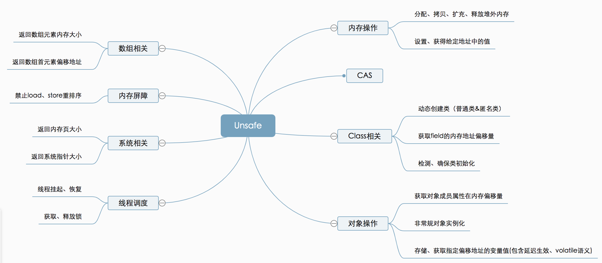
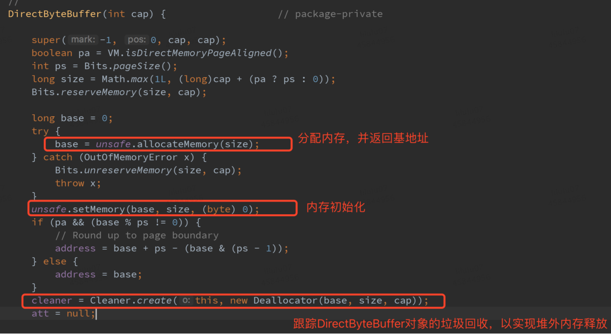
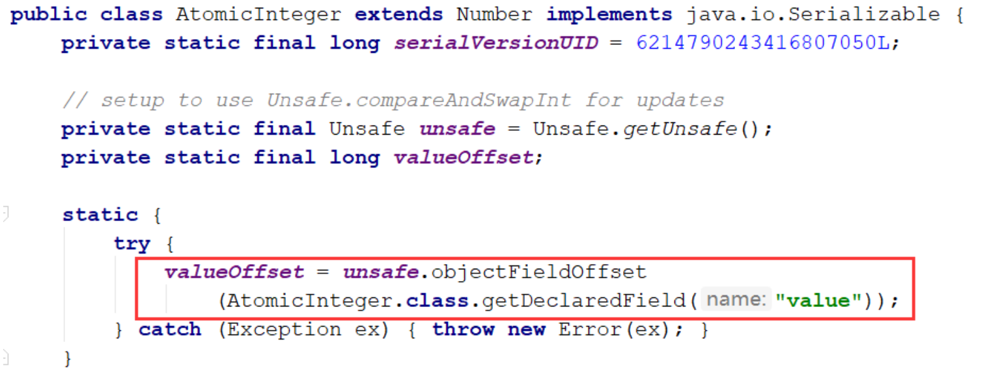

[TOC]

### Atomic原子变量与Unsafe类

之前的 Java 内存模型中提到，一些**看起来是原子**的操作其实不是滴。比如

```java
count++;
```

这一步自增操作在内存中会存在好几个步骤。针对 cnt++ 这类**复合**操作，可以使用并发包中的原子操作类。原子操作类是通过循环 **CAS** 的方式来保证其原子性的。

Atomic 翻译成中文是原子的意思。在化学上，我们知道原子是构成一般物质的最小单位，在化学反应中是不可分割的。在我们这里 Atomic 是指一个操作是不可中断的。即使是在多个线程一起执行的时候，一个操作一旦开始，就不会被其他线程干扰。

所以，所谓原子类说简单点就是具有原子/原子操作特征的类。


#### 什么是原子操作

原子（atom）本意是“不能被进一步分割的最小粒子”，而**原子操作（atomic operation）意为”不可被中断的一个或一系列操作”** 。在多处理器上实现原子操作就变得有点复杂。本文让我们一起来聊一聊在 Intel 处理器和 Java 里是如何实现原子操作的。  

32 位 IA-32 处理器使用**基于对缓存加锁或总线加锁**的方式来实现多处理器之间的**原子操作**。  

在 Java 中可以通过**锁和循环 CAS 的方式**来实现原子操作。  JVM 中的 CAS 操作正是利用了处理器提供的 **CMPXCHG** 指令实现的。**自旋 CAS 实现的基本思路就是循环进行 CAS 操作直到成功为止**，具体的类可以参见 JUC 下的 atomic 包内的原子类。  


#### Atomic包

并发包 `java.util.concurrent` 的原子类都存放在`java.util.concurrent.atomic`下,如下图所示。


在 Atomic 包里一共有 12 个类，四种原子更新方式，分别是原子更新基本类型，原子更新数组，原子更新引用和原子更新字段。Atomic 包里的类基本都是使用 **Unsafe 类实现**的包装类。 

- **原子更新基本类型类**：AtomicInteger、AtomicLong、AtomicBoolean；
- **原子更新引用类型**：AtomicReference、AtomicReference 的 ABA 实例、AtomicStampedRerence、AtomicMarkableReference；
- **原子更新数组类**：AtomicIntegerArray、AtomicLongArray、AtomicReferenceArray；
- **原子更新字段类（Updater）**：AtomicIntegerFieldUpdater、AtomicLongFieldUpdater、AtomicReferenceFieldUpdater。


#### 原子变量的基本概念

##### 1. **悲观的解决方案（阻塞同步）**

在并发环境下，如果不做任何同步处理，就会有线程安全问题。最直接的处理方式就是**加锁**。我们先看一段 **synchronized** 关键字保证变量原子性的代码：

```java
public class Counter {
    private int count;

    public synchronized void addCount(){
        this.count++;
    }
}
```

简单的 count++ 操作，线程对象首先需要获取到 Counter 类实例的**对象锁**，然后完成自增操作，最后释放对象锁。整个过程中，无论是获取锁还是释放锁都是相当**消耗成本**的，一旦不能获取到锁，还需要**阻塞**当前线程等等。

使用独占锁机制来解决，是一种**悲观的**并发策略，抱着一副“总有刁民想害朕”的态势，每次操作数据的时候都认为别的线程会参与竞争修改，所以直接加锁。同一刻只能有一个线程持有锁，那其他线程就会阻塞。线程的挂起恢复会带来很大的性能开销，尽管 JVM 对于非竞争性的锁的获取和释放做了很多优化，但是一旦有多个线程竞争锁，频繁的阻塞唤醒，还是会有很大的性能开销的。所以，使用 synchronized 或其他重量级锁来处理显然不够合理。

##### 2. **乐观的解决方案（非阻塞同步）**

对于这种情况，我们可以将 count 变量声明成**原子变量**，那么对于 count 的自增操作都可以以**原子的**方式进行，就不存在脏数据的读取了。

乐观的解决方案，顾名思义，就是很大度乐观，每次操作数据的时候，**都认为别的线程不会参与竞争修改**，也不加锁。如果操作成功了那最好；如果失败了，比如中途确有别的线程进入并修改了数据（依赖于冲突检测），也不会阻塞，可以采取一些补偿机制，一般的**策略就是反复重试**。很显然，这种思想相比简单粗暴利用锁来保证同步要合理的多。

**原子变量**最主要的一个特点就是所有的操作都是**原子**的，synchronized 关键字也可以做到对变量的原子操作。只是 synchronized 的成本相对较高，需要获取锁对象，释放锁对象，如果不能获取到锁，还需要阻塞在阻塞队列上进行等待。而如果单单只是为了解决对**变量的原子操作**，建议使用原子变量。

Java 给我们提供了以下几种**原子类型**：

- **AtomicInteger** 和 **AtomicIntegerArray**：基于 **Integer** 类型
- **AtomicBoolean**：基于 Boolean 类型
- **AtomicLong** 和 **AtomicLongArray**：基于 Long 类型
- **AtomicReference** 和 **AtomicReferenceArray**：基于**引用**类型

以下将主要介绍 AtomicInteger 和 AtomicReference 两种类型，AtomicBoolean  和 AtomicLong 的使用和内部实现原理几乎和 AtomicInteger 一样。

原子变量保证了该**变量的**所有操作都是**原子**的，不会因为多线程的同时访问而导致脏数据的读取问题。

##### 3. 原子变量与 synchronized 比较

从思维模式上看，原子变量代表一种==**乐观的非阻塞式**==思维，它假定更新冲突比较少，假定没有别人会和我同时操作某个变量，于是在实际修改变量的值的之前不会锁定该变量，但是修改变量的时候是使用 CAS 进行的，一旦发现冲突，**继续尝试**直到成功修改该变量。

而 synchronized 关键字则是一种**悲观的阻塞式**思维，它假定先更新很可能冲突，认为所有人都会和自己同时来操作某个变量，于是在将要操作该变量之前会**加锁**来锁定该变量，得不到锁的时候进入**等待队列**，因此会有**线程切换**等开销，进而继续操作该变量。


#### AtomicInteger

##### 1. AtomicInteger 的基本使用

​     首先看它的两个构造函数：

```java
private volatile int value;
// 构造方法一
public AtomicInteger(int initialValue) {
    value = initialValue;
}
// 构造方法二
public AtomicInteger() {}
```

可以看到，我们在通过构造函数构造 AtomicInteger 原子变量的时候，如果指定一个 **int 的参数**，那么该原子变量的值就会被**赋值**，否则就是默认的**数值 0**。

也有获取和设置这个 value 值的方法：

```java
// 非原子操作 用得少
public final int get()
public final void set(int newValue) 
```

当然，这两个方法**并不是原子**的，所以一般也**很少**使用，而以下的这些基于**原子操作的方法**则相对使用的频繁。之所以称为原子变量，是因为它包含一些以**原子方式实现组合操作**的方法。这些方法**都依赖**于下面讲的 ==CAS== 方法。

```java
// 基于原子操作，获取当前原子变量中的值并为其设置新值
public final int getAndSet(int newValue)
// 基于原子操作，比较当前的value是否等于expect，如果是设置为update并返回true，否则返回false
public final boolean compareAndSet(int expect, int update)
// 基于原子操作，获取当前的value值并自增一
public final int getAndIncrement()
// 基于原子操作，获取当前的value值并自减一
public final int getAndDecrement()
// 基于原子操作，获取当前的value值并为value加上delta
public final int getAndAdd(int delta)
// 此外还有一些反向的方法，比如：先自增在获取值的等等
```

下面我们实现一个**计数器**的例子，之前我们使用 synchronized 实现过，现在我们使用原子变量再次实现该问题。

```java
// 自定义一个线程类
public class MyThread extends Thread {
	// 定义一个静态原子变量
    public static AtomicInteger value = new AtomicInteger();

    @Override
    public void run(){
        try {
            Thread.sleep((long) ((Math.random())*100));
            // 原子自增
            value.incrementAndGet();
        } catch (InterruptedException e) {
            e.printStackTrace();
        }
    }
}
// main函数中启动100条线程并让他们启动
public static void main(String[] args) throws InterruptedException {
    Thread[] threads = new Thread[100];
    for (int i = 0; i < 100; i++){
        threads[i] = new MyThread();
        threads[i].start();
    }

    for (int j = 0;j < 100; j++){
        threads[j].join();
    }

    System.out.println("value:" + MyThread.value);
}
```

多次运行会得到相同的结果：

```
value: 100
```

##### 2. AtomicInteger源码解析

###### ① Java8之前

AtomicInteger 的实现原理有点像我们的**包装类**，内部主要操作的是 **value 字段**，这个字段**保存**就是原子变量的数值。value 字段定义如下：

```java
private volatile int value;
```

首先 value 字段被 volatile 修饰，即**不存在内存可见性问题**。由于其内部实现原子操作的代码几乎类似，我们主要学习下 **incrementAndGet** 方法的实现。

```java
public final int incrementAndGet() {
    for (;;) {	// 无限循环
        // 获取当前值
        int current = get();
        // 计算期望的next值
        int next = current + 1;
        // 进行比较
        if (compareAndSet(current, next)) {
            // 只有设置成果才返回
            return next;
        }
    }
}
```

方法体是一个死循环，current 获取到当前原子变量中的值，由于 value 被修饰 volatile，所以不存在内存可见性问题，数据一定是**最新**的。然后 current 加一后赋值给 next，调用 CAS 原子操作判断 value 是否被别的线程修改过，如果还是原来的值，那么将 next 的值赋值给 value 并返回 next，否则重新获取当前 value的值，再次进行判断，**直到操作完成**。

incrementAndGet 方法的一个很核心的思想是，在加一之前先去看看 value 的值是多少，**真正加**的时候再去看一下，如果发现变了，不操作数据，否则为 value 加一。

调用了 compareAndSet 方法。

```java
// ※ CAS方法
public final boolean compareAndSet(int expect, int update) {
     return unsafe.compareAndSwapInt(this, valueOffset, expect, update);
}
```

==**compareAndSet** 方法==又被称为 **==CAS==**（**比较并设置**），该方法调用 **unsafe** 的一个 **compareAndSwapInt** 方法，这个方法是 **native**，我们看不到源码，但是我们需要知道该方法完成的一个目标：比较当前原子变量的值**是否等于 expect**，如果是则将其修改为 **update** 并返回 **true**，否则直接返回 false。即**如果与期望值相等才更新，否则不更新**。当然，这个操作本身就是原子的，较为底层的实现。

###### ② Java8

但是在 JDK8 以后，做了一些**优化**，但是最后还是调用的 **compareAndSwapInt** 方法。但基本思想还是没变。

内部依然 有 value 变量保存数值，构造方法传入数值。

```java
private volatile int value;

public AtomicInteger(int initialValue) {
    value = initialValue;
}
```

Java8 中 **incrementAndGet**() 方法。

```java
private static final jdk.internal.misc.Unsafe U = jdk.internal.misc.Unsafe.getUnsafe();

public final int incrementAndGet() {
    // U就是UnSafe类的静态实例
    return U.getAndAddInt(this, VALUE, 1) + 1;
}
```

Java8 之后很多操作都放到 Unsafe 类中了。如下：

```java
// UnSafe中的getAndAddInt
@HotSpotIntrinsicCandidate
public final int getAndAddInt(Object o, long offset, int delta) {
    int v;
    do {
        v = getIntVolatile(o, offset);
    } while (!weakCompareAndSetInt(o, offset, v, v + delta));
    return v;
}

// UnSafe中的compareAndSetInt
@HotSpotIntrinsicCandidate
public final native boolean compareAndSetInt(Object o, long offset, int expected; int x);
```

AtomicInteger 类主要利用 **CAS (compare and swap) + volatile 和 native 方法来保证原子操作**，从而避免 synchronized 的高开销，执行效率大为提升。

CAS的原理是拿期望的值和原本的一个值作比较，如果相同则更新成新的值。UnSafe 类的 objectFieldOffset() 方法是一个本地方法，这个方法是用来拿到“原来的值”的内存地址，返回值是 valueOffset。另外 value 是一个volatile变量，在内存中可见，因此 JVM 可以保证任何时刻任何线程总能拿到该变量的最新值。

#### AtomicReference

对于一些**自定义类或者字符串**等这些==**引用类型**==，Java 并发包也提供了原子变量的接口支持。AtomicReference 内部使用**泛型**来实现的。

```java
// 泛型保存引用类型
private volatile V value;

public AtomicReference(V initialValue) {
    value = initialValue;
}

public AtomicReference() {}
```

有关其他的一些原子方法如下：

```java
// 获取并设置value的值为newvalue
public final V getAndSet(V newValue) {
    return (V)unsafe.getAndSetObject(this, valueOffset, newValue);
}
```

AtomicReference 中**少了**一些自增自减的操作，但是对于 value 的修改依然是原子的。


#### 原子更新字段类

使用 FieldUpdater 操作非原子变量的字段属性

**FieldUpdater** 允许我们**不必**将字段设置为**原子变量**，利用**反射**直接以**原子方式操作字段**。例如：

```java
// 定义一个计数器
public class Counter {
    // 定义一个普通非原子变量，需用volatile修饰，保证可见性
    private volatile int count;

    public int getCount() {
        return count;
    }

    public void addCount(){
        // 传入类信息与变量信息
        AtomicIntegerFieldUpdater<Counter> updater  = 
            AtomicIntegerFieldUpdater.newUpdater(Counter.class, "count");
        updater.getAndIncrement(this);
    }
}
```

然后我们创建一百个线程随机调用同一个 Counter 对象的 addCount 方法，无论运行多少次，结果都是一百。这种方式实现的原子操作，对于被操作的变量**不需要**被包装成原子变量，但是却可以**直接以原子方式操作它的数值**。


####  ABA问题

普通的原子变量 AtomicInteger 可能也会存在 ABA 问题。

我们的原子变量都依赖一个核心的方法，那就是 **CAS**。这个方法最核心的思想就是，更改变量值之前先获取该变量当前最新的值，然后在实际更改的时候再次获取该变量的值，如果没有被修改，那么进行更改，否则**循环**上述操作直至更改操作完成。

假如一个线程想要对变量 count 进行修改，实际操作之前获取 count 的值为 A，此时来了一个线程将 count 值修改为 B，又来一个线程获取 count 的值为 B 并将 count 修改为 A，此时第一个线程**全然不知道** count 的值已经被修改两次了，虽然值还是 A，但是实际上数据**已经是脏**的。

这就是典型的 ABA 问题，一个解决办法是，对 count 的每次操作都记录下当前的一个**时间戳**，这样当我们原子操作 count 之前，不仅查看 count 的最新数值，还记录下该 count 的**时间戳**，在实际操作的时候，只有在 count 的数值和时间戳都没有被更改的情况之下才完成修改操作。

```java
public static void main(String[] args){
    int count = 0;
    int stamp = 1;
    // 引入时间戳防止ABA问题
    AtomicStampedReference reference = new AtomicStampedReference(count, stamp);
    int next = count++;
    reference.compareAndSet(count, next, stamp, stamp);
}
```

**AtomicStampedReference** 的 CAS 方法要求传入**四个参数**，该方法的内部会同时比较 count 和 stamp，只有这两个值都没有发生改变的前提下，CAS 才会修改 count 的值。


#### Unsafe类

##### 1. 概述

Unsafe 是位于 sun.misc 包下的一个类，主要提供一些用于执行**低级别、不安全操作**的方法，如**直接访问系统内存资源、自主管理内存资源**等，这些方法在提升 Java 运行效率、增强 Java 语言底层资源操作能力方面起到了很大的作用。

Unsafe 类为一**单例实现**，提供**静态方法 getUnsafe 获取 Unsafe 实例**，当且仅当调用 getUnsafe 方法的类为**引导类加载器 BootstrapClassLoader** 所加载时才合法，否则抛出 SecurityException 异常。

```java
public final class Unsafe {
    // 单例
    private static final Unsafe theUnsafe;

    @CallerSensitive
    public static Unsafe getUnsafe() {
        Class var0 = Reflection.getCallerClass();
        if (!VM.isSystemDomainLoader(var0.getClassLoader())) {
            throw new SecurityException("Unsafe");
        } else {
            return theUnsafe;
        }
    }
}
```

##### 2. 如何获取Unsafe实例  

1、把调用 Unsafe 相关方法的类 Demo 所在 jar 包路径追加到默认的 **bootstrap** 路径中，使得类 A 被引导类加载器加载。从而通过 Unsafe.getUnsafe 方法安全的获取 Unsafe 实例。  

```java
java -Xbootclasspath/a:${path} // 其中path为调用Unsafe相关方法的类所在jar包路径
```

2、通过**反射**获取单例对象 theUnsafe。

```java
public class UnsafeInstance {    
    public static Unsafe reflectGetUnsafe() {        
        try {            
            Field field = Unsafe.class.getDeclaredField("theUnsafe");           
            field.setAccessible(true);            
            return (Unsafe) field.get(null);        
        } catch (Exception e) {            
            e.printStackTrace();        
        }        
        return null;    
    }
}
```

##### 3. Unsafe功能介绍

Unsafe 提供的 API 大致可分为内存操作、CAS、Class 相关、对象操作、线程调度、系统信息获取、内存屏障、数组操作等几类，下面将对其相关方法和应用场景进行详细介绍。  



###### (1) 内存操作

这部分主要包含**堆外内存**的分配、拷贝、释放、给定地址值操作等方法。

```java
// 分配内存, 相当于C++的malloc函数
public native long allocateMemory(long bytes);
// 扩充内存
public native long reallocateMemory(long address, long bytes);
// 释放内存
public native void freeMemory(long address);
// 在给定的内存块中设置值
public native void setMemory(Object o, long offset, long bytes, byte value);
// 内存拷贝
public native void copyMemory(Object srcBase, long srcOffset, Object destBase, long destOffset, long bytes);
// 获取给定地址值，忽略修饰限定符的访问限制。与此类似操作还有: getInt，getDouble，getLong，getChar等
public native Object getObject(Object o, long offset);
// 为给定地址设置值，忽略修饰限定符的访问限制，与此类似操作还有:putInt,putDouble，putLong，putChar等
public native void putObject(Object o, long offset, Object x);
public native byte getByte(long address);
// 为给定地址设置byte类型的值（当且仅当该内存地址为allocateMemory分配 时，此方法结果才是确定的）
public native void putByte(long address, byte x);  
```

通常，我们在 Java 中创建的对象都处于堆内内存（heap）中，堆内内存是由 JVM 所管控的 Java 进程内存，并且它们遵循 JVM 的内存管理机制，JVM 会采用垃圾回收机制统一管理堆内存。与之相对的是堆外内存，存在于 JVM 管控之外的内存区域，Java 中对堆外内存的操作，依赖于 Unsafe 提供的操作堆外内存的 **native** 方法。
**使用堆外内存的原因**

- 对垃圾回收停顿的改善。由于堆外内存是直接受操作系统管理而不是 JVM，所以当我们使用堆外内存时，即可保持较小的堆内内存规模。从而在 GC 时减少回收停顿对于应用的影响。
- 提升程序 **I/O 操作的性能**。通常在 I/O 通信过程中，会存在堆内内存到堆外内存的**数据拷贝**操作，对于需要**频繁进行内存间数据拷贝**且生命周期较短的暂存数据，都建议**存储到堆外内存**。  

**典型应用**

**DirectByteBuffer** 是 Java 用于实现**堆外内存**的一个重要类，通常用在通信过程中做**缓冲池**，如在 **Netty**、MINA 等 NIO 框架中应用广泛。DirectByteBuffer 对于堆外内存的创建、使用、销毁等逻辑均由 Unsafe 提供的堆外内存 API 来实现。

下图为 DirectByteBuffer 构造函数，创 建DirectByteBuffer 的时候，通过 Unsafe.allocateMemory 分配内存、 Unsafe.setMemory 进行内存初始化，而后构建 Cleaner 对象用于跟踪 DirectByteBuffer 对象的垃圾回收，以实现当 DirectByteBuffer 被垃圾回收时，分配的堆外内存一起被释放。  



###### (2) CAS相关

如下源代码释义所示，这部分主要为 CAS 相关操作的方法。  

```java
/**
* CAS
* @param o 包含要修改field的对象
* @param offset 对象中某field的偏移量
* @param expected 期望值
* @param update 更新值
* @return true | false
*/
public final native boolean compareAndSwapObject(Object var1, long var2, Object var4, Object var5);
public final native boolean compareAndSwapInt(Object var1, long var2, int var4, int var5);
public final native boolean compareAndSwapLong(Object var1, long var2, long var4, long var6);
```

**典型应用**
如下图所示，AtomicInteger 的实现中，静态字段 **valueOffset** 即为字段 value 的**内存偏移地址**，valueOffset 的值在 AtomicInteger 初始化时，在**静态代码块**中通过 Unsafe 的 **objectFieldOffset** 方法获取。在 AtomicInteger 中提供的线程安全方法中，通过字段 valueOffset 的值可以定位到 AtomicInteger 对象中 value 的**内存地址**，从而可以根据 CAS 实现对 value 字段的**原子操作**。  



下图为某个 AtomicInteger 对象自增操作前后的**内存**示意图，对象的**基地址** baseAddress =“0x110000”，通过baseAddress+valueOffset 得到 value 的内存地址 valueAddress =“0x11000c”；然后通过 **CAS** 进行**原子性的更新操作**，成功则返回，否则继续重试，直到更新成功为止。


###### (3) 线程调度

包括**线程挂起、恢复、锁机制**等方法。  

```java
// 取消阻塞线程
public native void unpark(Object thread);
// 阻塞线程
public native void park(boolean isAbsolute, long time);
// 获得对象锁（可重入锁）
@Deprecated
public native void monitorEnter(Object o);
// 释放对象锁
@Deprecated
public native void monitorExit(Object o);
// 尝试获取对象锁
@Deprecated
public native boolean tryMonitorEnter(Object o);
```

方法 **park、unpark** 即可实现**线程的挂起与恢复**，将一个线程进行**挂起是通过 park 方法**实现的，调用 park 方法后，线程将一直**阻塞直到超时或者中断等条件**出现；**unpark** 可以终止一个挂起的线程，使其恢复正常。

**典型应用**

Java 锁和同步器框架的核心类 **AbstractQueuedSynchronizer**，就是通过调用 **LockSupport.park()** 和**LockSupport.unpark()** 实现线程的**阻塞和唤醒**的，而 LockSupport 的 park、unpark 方法实际是调用 Unsafe 的 park、unpark 方式来实现。  

###### (4) 内存屏障

在 Java 8 中引入，用于定义**内存屏障**（也称内存栅栏，内存栅障，屏障指令等，是一类同步屏障指令，是 CPU 或编译器在对内存随机访问的操作中的一个同步点，使得此点之前的所有读写操作都执行后才可以开始执行此点之后的操作），**避免代码重排序。**  

```java
// 内存屏障，禁止load操作重排序。屏障前的load操作不能被重排序到屏障后，屏障后的load操作不能被重排序到屏障前
public native void loadFence();
// 内存屏障，禁止store操作重排序。屏障前的store操作不能被重排序到屏障后，屏障后的store操作不能被重排序到屏障前
public native void storeFence();
// 内存屏障，禁止load、store操作重排序
public native void fullFence();
```

**典型应用**
在 Java 8 中引入了一种锁的新机制——**StampedLock**，它可以看成是**读写锁的一个改进版本**。StampedLock 提供了一种**乐观读锁**的实现，这种乐观读锁类似于无锁的操作，完全不会阻塞写线程获取写锁，从而缓解读多写少时写线程“饥饿”现象。由于 StampedLock 提供的乐观读锁不阻塞写线程获取读锁，当线程共享变量从**主内存 load 到线程工作内存**时，会存在**数据不一致**问题。


