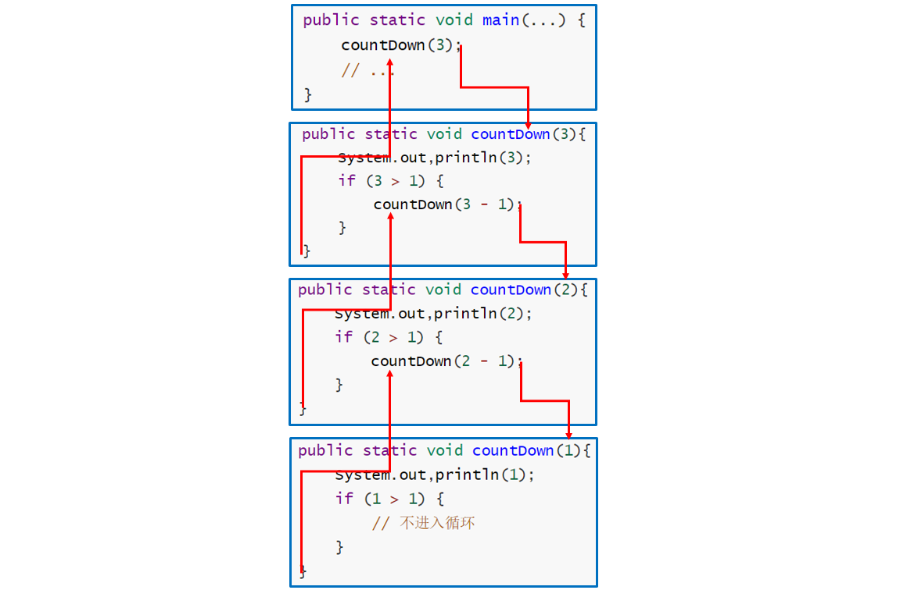

[TOC]

### 递归

- 递归是将一个问题分成==同样的但更小的问题==的求解过程。
- 调用**自己**的方法称为递归方法。
- 需要设置递归终止场景。
- 递归一般更消耗内存。无限递归可能发生栈溢出。


#### 基础递归

递归的两个法则：

- **基准情形**：必须总要有某些基准的情形，它们不用递归就能求解。
- **不断推进**：对于那些要递归求解的情形，递归调用必须总能够朝着一个**基准情形**推进。

```java
public static void countDown(int integer){
    System.out,println(integer);
    if (integer > 1) {
        countDown(integer - 1);
    }
}
```

其执行过程如下：





#### 尾递归

当递归方法执行的**最后一个动作**是**递归调用**时就是尾递归。例如：

```java
public static void countDown(int integer) {
    System.out,println(integer);
    if (integer > 1) {
        countDown(integer - 1);	// 递归方法的最后一个动作
    }
}
```

尾递归可以很容易转化成为**迭代**算法。如下。

```java
public static void countDown(int integer) {
    while(integer >= 1) {
        System.out,println(integer);
        integer--;
    }
}
```

如果必须节省**内存空间**，可以考虑用迭代替换递归。


