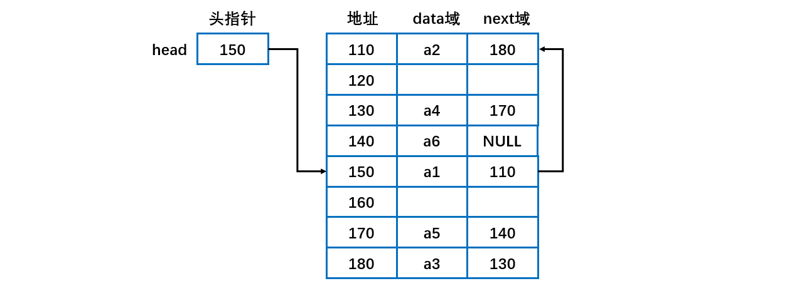

[TOC]

### 线性表

#### 概述

线性表存储方式分为**==顺序存储和链式存储==**。顺序存储使用数组进行存储。链式存储使用链表进行存储。

对比表格如下：

|                |             顺序表             |                    链式表                    |
| :------------: | :----------------------------: | :------------------------------------------: |
|  **存储方式**  |            **数组**            |                   **链表**                   |
| **地址连续性** |      内存地址**连续**存储      | 节点的地址不是连续的，是通过**指针**连起来的 |
|    **查找**    |       方便。直接内存寻址       |             不方便。需要遍历链表             |
|    **插入**    | 不方便。后面的元素需要整体后移 |              方便。修改指针即可              |
|    **删除**    | 不方便。后面的元素需要整体前移 |              方便。修改指针即可              |

**使用**

- 当线性表中的元素个数变化较大或者根本不知道有多大时，最好用单链表结构，这样可以不需要考虑存储空间的大小问题。而如果事先知道线性表的大致长度，用顺序存储结构效率会高很多。

#### 数组实现线性表

**特点**

- 元素的存储空间是**连续**的。在内存中是以顺序存储，内存划分的**区域是连续**的。如下图。

- 缺点就是，添、删、改的时候特别麻烦，特别是添和改的时候要移动数组，数组容易越界。可能出现数组存储满的情况，需要进行**扩容并复制**。

**插入元素**：在**指定的位置**添加元素时，需要把**后面的元素整体移动**，效率不高。位置编号越大， 插入时所需要移动的元素越少，时间越快。当加入的元素**超过容量之后也需要扩展数组**，并把原来的数组内容进行**复制**，这里也是效率不高。如插入 11 需要将 10 和 2 整体后移再插入。

**删除元素**：删除指定位置的元素之后，也需要把后面的元素**整体往前移动补空位**。如下图删除 3 之后，需要把后面的数据整体前移。

####  单向链表

##### 1. 特点

元素在内存中不一定是连续存储的。如下图所示。

- 链表是以**结点**方式来存储数据。
- 每个结点包含 **data 域， next 域**，用于指向下一个结点。
- 链表中的节点不一定是连续存储的。如上图头结点指针 head 指向 150 地址的 a1 元素。
- 链表分带**头节点**的链表和**没有头节点**的链表，根据实际的需求来确定。
- 单向链表**不能自我删除**，需要靠**辅助节点** 。

##### 2. 单链表效率分析

- 在尾部添加元素、替换元素、获取元素等操作使用数组实现通常更快。
- 在给定位置添加与删除元素使用数组通常会需要移动其他元素，会较慢。
- 如果主要在近表头与表头位置添加元素，则使用链式较好。如果操作多接近表尾，则可用数组实现。
- 对于链式实现，只有头引用和同时有头引用与尾引用两种情况效率有时会有差别。
- 为了方便操作，可以维护一个指向链尾的结点。这样在链尾操作时可以不需要每次都遍历整个链。

#### 双向链表

- 单向链表，**查找的方向只能是一个方向**，而双向链表可以向前或者向后查找。
- 单向链表**不能自我删除**，需要靠**辅助节点** ，而双向链表，则可以**自我删除**，所以前面我们单链表删除节点时，总是需要先找到 temp, temp 是待删除节点的前一个节点。
- 双向链表维护了一个 next 指向下一个结点，维护了一个 pre 指向上一个结点。因此添加删除操作等需要**同时操作 next 和 pre** ，不要遗忘了。

