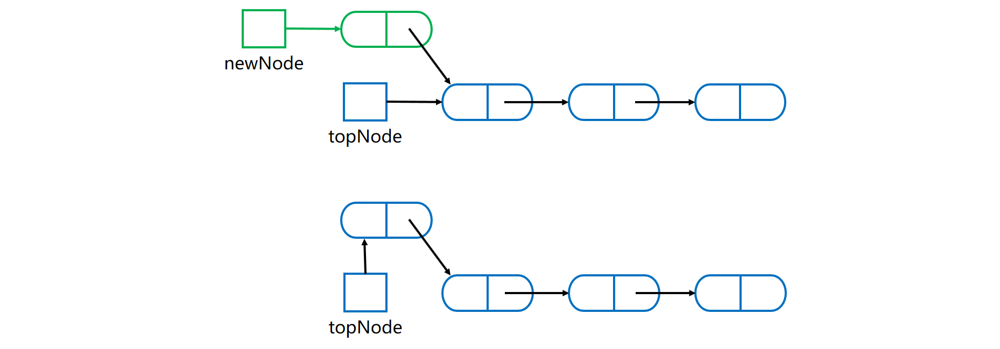

[TOC]

### 栈

#### 概述

- 栈的操作端通常被称为**栈顶**，另一端被称为**栈底**。
- 所有添加都位于**栈顶**。栈顶是最新的数据。删除也是先删除栈顶。**后进先出**（LIFO）结构。
- 基本操作：**入栈**（push）：增加元素；**出栈**（pop）：删除元素；**查看**（peak）：获取栈顶但不删除。
- 顺序存储的栈称为**顺序栈**；链式存储的栈称为**链式栈**。、
- 栈的常见应用：十进制转 N 进制、行编辑器、校验括号是否匹配、中缀表达式转后缀表达式、表达式求值等。


#### 栈的实现

##### 1. 栈的抽象接口

```java
public interface Stack<T> {
	// 压栈
    void push(T newEntry);
	// 弹栈 删除元素
    T pop();
	// 查看栈顶元素但不删除
    T peek();
	// 是否为空
    boolean isEmpty();
	// 清空栈
    void clear();
}
```

##### 2. 栈的数组实现

使用可变大小数组实现栈，容量不够时可以自动**扩容**。

使用数组实现栈则数组的第一个位置是**栈底**，数组**最后占用**的位置才指向**栈顶**，否则压栈会整体**移动**元素位置。


弹栈操作可以将所有的元素依次弹栈即可。

可以看看 ArrayDeque 的源码。

##### 3. 栈的链式实现

需要使用链表的**头插法或尾插法**来实现，因为头插法中最后压入栈的元素在**链表的开头**，它的 next 指针指向前一个压入栈的元素，在弹出元素时就可以通过 **next** 指针遍历到前一个压入栈的元素从而让这个元素成为新的栈顶元素。

使用链式实现栈，则**首节点**应该指向==**栈顶**==元素。首节点指向链尾是不合理的。


==**压栈**==操作就是分配一个新结点，使之指向目前的栈链，如下图所示。



a) 构造**新结点**并指向栈顶结点；

b) 头指针指向**栈顶新节点**。

**==弹栈==**操作就是将**首节点的引用赋给 topNode**，从而出栈。故将 topNode 指向链中的第二个结点。如下图所示。


可以参考 LinkedList 的源码实现。

单链表一般使用头插法，而双链表则头插法和尾插法都可。

##### 4. 栈的向量Vector类实现

Java 类库 **Vector 类**，其实例（称为向量）的行为类似于一个可变大小的**数组**。可用于构造栈。Vector 类的实现基于**==动态可变大小的数组==**，但是其内部已经实现了许多方法，可以轻松实现栈结构。

如果使用向量实现栈，则向量的**首元素**应该指向**栈底元素**。而向量的最后的占用位置指向栈顶元素。


