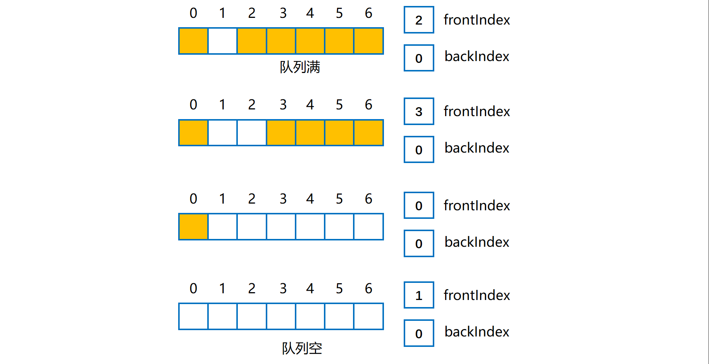
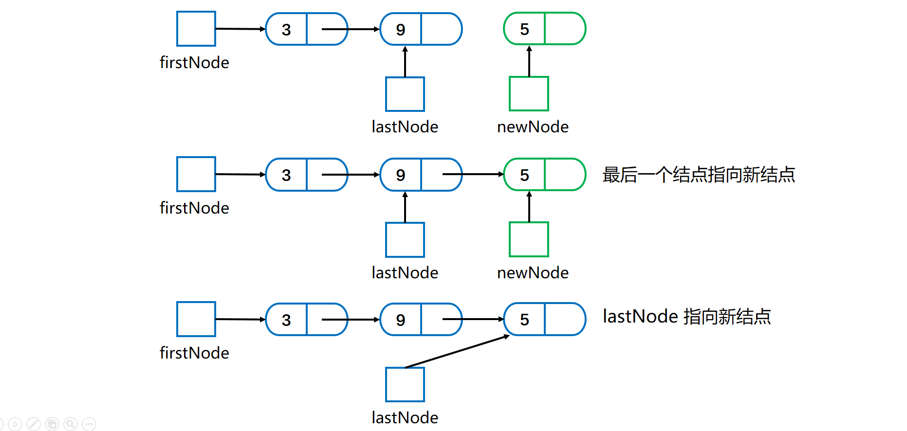
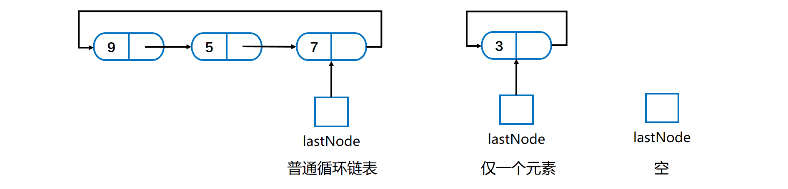

[TOC]

## 队列

#### 概述

- 先进先出 **FIFO** 结构。
- 添加元素在**后端**，出队列在**前端**。
- 基本操作：**入队**（enqueue）；**出队**（dequeue）获取队头且删除；**取值**（getFront）获取队头但是不删除。
- 队列为空时出队或者取值可能抛出自定义异常 EmptyQueueException。


#### 队列的实现

##### 1. 队列的数组实现

使用**数组**来存放队列，维护一个 **frontIndex** 和 **backIndex** 来指示**队头队尾**。

使用==**循环数组**==。使用**一般的循环数组**实现队列的话，~~放队列空或者队列满的时候，都满足 frontIndex 等于 backIndex，这是有问题的。~~

因此使用==**带一个不用位置的循环数组**==来实现队列。即该数组中始终有一个位置**空缺**， 可以将其放在**队尾**。此时判断队列的**空与满有不同的条件**。

所以存储对象的数组应比设定的大小**多 1**。

下图是队列满与空流程图。




队列**满**时（公式源自《数据结构与抽象 Java 版》）

```java
frontIndex == (backIndex + 2) % queue.length
6 == (4 + 2)% 7    
```

队列**空**时

```java
frontIndex == (backIndex + 1) % queue.length
```

**入队**即在**队列后端**添加元素，数组是**循环**的，需要使用 **==%==** 来确定索引位置。

**出队**过程即把 frontIndex 指向下一个元素。

**数组扩容**

容量不足实现**扩容**时，与之前的数组扩容有所差距如下图。将原来的循环队列**全都复制到新队列的开始**处。


##### 2. 队列的链式实现

队列的两端在**链的两端**。队列的**前端**放在链的**开头**，队列的**后端**放在链的**链尾**。

**firstNode** 指向队列前端，**lastNode** 指向队列后端，如下图所示。当队列为**空**时两个**都为 null**。


**入队**是添加新结点到后端，需要判断链是否为**空**！如果是空链，则添加元素之后如下，即 firstNode 和 lastNode 均指向新结点。


如果是一般结点**入队**，则链中最后一个结点和 lastNode 指向新结点，如下。

- **最后一个结点**指向新结点；
- **lastNode** 指向新结点。



如果有多个结点，**出队**将 firstNode 指向链的第二个结点。如果队列中**仅有一个节点**，则出队之后为空。如下所示。


##### 3. 队列的循环链式实现

循环链中，最后一个结点指向第一个结点。每个结点的 **nextNode** 域**不会为 null**。如下图有指向最后结点的外部引用的循环链。



只需要**一个 lastNode** 数据域即可，它属于**链尾**，使用 

```java
lastNode.getNextNode();
```

 就可以获取到**链头**。


#### 双端队列（deque）

- 能在队列的**前端和后端**进行添加、删除与获取操作。
- 行为上类似于**双端栈**。


#### 优先级队列（Priority Queue）

- 根据**优先级**组织队列中的对象。
- 对象优先级通过 **compareTo()** 方法确定。
- Java中有对应的类库：**PriorityQueue** 类。
- 可以使用数组、链表或者向量来实现优先队列。
- 需要按项的优先级对项进行排序。

详细见优先队列部分。重点是**堆**实现。


#### Java队列实现

##### 1. Queue接口

```java
// 将元素插入队列
boolean add(E e);
// 将元素插入队列，与add相比，在容量受限时应该使用这个
boolean offer(E e);
// 将队首的元素删除，队列为空则抛出异常
E remove();
// 将队首的元素删除，队列为空则返回null
E poll();
// 获取队首元素，但不移除，队列为空则抛出异常
E element();
// 获取队首元素，但不移除，队列为空则返回null
E peek();
void clear();
int size();
```

入队、出队和取值两个一组，一个**抛出异常，一个返回 null**。

##### 2. Deque接口

继承于 Queue 接口。两种方法**成对**，出现问题时一个出现**异常**一个返回 **NULL**。

| 操作类型 | 第一个元素（Deque实例的开头） | 最后一个元素（Deque实例的结尾） |
| :------: | :---------------------------: | :-----------------------------: |
|   插入   |  addFirst(e)  offerFirst(e)   |    addLast(e)  offerLast(e)     |
|   移除   |  removeFirst()  pollFirst()   |    removeLast()  pollLast()     |
|   检索   |    getFirst()  peekFirst()    |      getLast()  peekLast()      |

##### 3. ArrayDeque类

实现了 **Deque 接口**。

因为 Deque 接口声明了对应于**双端队列、队列和栈**的方法，因此可以用 ArrayDeque 类来创建这些数据集合的实例。

==**不要**使用 Stack 类来创建栈，使用这个类==。

可以使用双向链实现双端队列。


