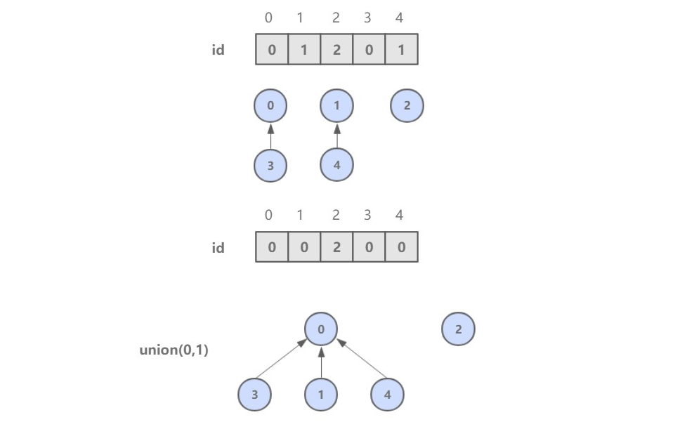
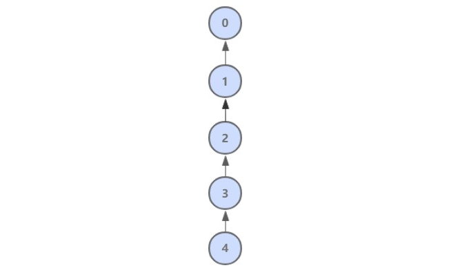
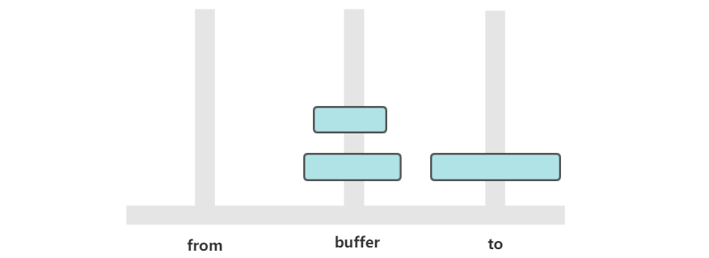
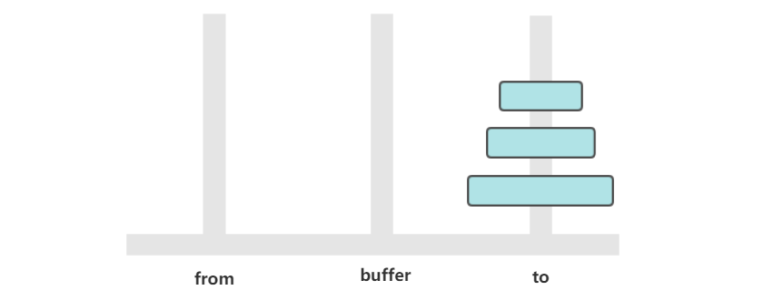

[TOC]

### 其他

#### 并查集UnionFind

##### 1. 概述

并查集，在一些有 **N 个元素**的**集合应用问题**中，我们通常是在开始时让每个元素构成一个单元素的集合，然后按一定**顺序将属于同一组**的元素所在的**集合合并**，其间要**反复查找一个元素在哪个集合**中。

用于解决动态**连通性问题**，能动态连接两个点，并且判断两个点是否连通。


|                方法                 |             描述              |
| :---------------------------------: | :---------------------------: |
|            **UF**(int N)            | **构造**一个大小为 N 的并查集 |
|    void **union**(int p, int q)     |     **连接 p 和 q 节点**      |
|         int **find**(int p)         | **查找 p 所在的连通分量编号** |
| boolean **connected**(int p, int q) | 判断 p 和 q 节点**是否连通**  |

##### 2. 抽象类

```java
public abstract class UF {

    protected int[] id;

    public UF(int N) {
        id = new int[N];
        for (int i = 0; i < N; i++) {
            id[i] = i;
        }
    }
	// 直接判断两个点是否在一个集合中
    public boolean connected(int p, int q) {
        return find(p) == find(q);
    }

    public abstract int find(int p);

    public abstract void union(int p, int q);
}
```

有不同的实现方式，性能也有所不同。

##### 3. Quick Find

可以快速进行 **find** 操作，也就是可以**快速判断两个节点是否连通**。

需要保证同一连通分量的所有节点的 **id 值**相等。

但是 union 操作代价却很高，需要将其中一个连通分量中的所有节点 id 值都修改为另一个节点的 id 值。



```java
public class QuickFindUF extends UF {

    public QuickFindUF(int N) {
        super(N);
    }


    @Override
    public int find(int p) {
        return id[p];
    }


    @Override
    public void union(int p, int q) {
        int pID = find(p);
        int qID = find(q);

        if (pID == qID) {
            return;
        }

        for (int i = 0; i < id.length; i++) {
            if (id[i] == pID) {
                id[i] = qID;
            }
        }
    }
}
```

##### 4. Quick Union

可以快速进行 union 操作，只需要**修改一个节点的 id 值**即可。

但是 **find 操作开销很大**，因为同一个连通分量的节点 id 值不同，id 值只是用来指向另一个节点。因此需要一直向上查找操作，直到找到最上层的节点。


```java
public class QuickUnionUF extends UF {

    public QuickUnionUF(int N) {
        super(N);
    }


    @Override
    public int find(int p) {
        while (p != id[p]) {
            p = id[p];
        }
        return p;
    }


    @Override
    public void union(int p, int q) {
        int pRoot = find(p);
        int qRoot = find(q);

        if (pRoot != qRoot) {
            id[pRoot] = qRoot;
        }
    }
}
```

这种方法可以**快速进行 union 操作**，但是 find 操作和树高成正比，最坏的情况下树的高度为节点的数目。



##### 5. 加权Quick Union

为了解决 quick-union 的**树通常会很高**的问题，加权 quick-union 在 union 操作时会让**较小的树连接较大的树上面**。

理论研究证明，加权 quick-union 算法构造的树深度最多**不超过 logN**。


```java
public class WeightedQuickUnionUF extends UF {

    // 保存节点的数量信息
    private int[] sz;

    public WeightedQuickUnionUF(int N) {
        super(N);
        this.sz = new int[N];
        for (int i = 0; i < N; i++) {
            this.sz[i] = 1;
        }
    }

    @Override
    public int find(int p) {
        while (p != id[p]) {
            p = id[p];
        }
        return p;
    }

    @Override
    public void union(int p, int q) {

        int i = find(p);
        int j = find(q);

        if (i == j) return;

        if (sz[i] < sz[j]) {
            id[i] = j;
            sz[j] += sz[i];
        } else {
            id[j] = i;
            sz[i] += sz[j];
        }
    }
}
```

##### 6. 路径压缩的加权 Quick Union

在检查节点的同时将它们直接链接到根节点，只需要在 find 中添加一个循环即可。

##### 7. 比较

|              算法              |   union    |    find    |
| :----------------------------: | :--------: | :--------: |
|         **Quick Find**         |     N      |     1      |
|        **Quick Union**         |    树高    |    树高    |
|      **加权 Quick Union**      |    logN    |    logN    |
| **路径压缩的加权 Quick Union** | 非常接近 1 | 非常接近 1 |


#### 汉诺塔


有三个柱子，分别为 from、buffer、to。需要将 from 上的圆盘全部移动到 to 上，并且要保证小圆盘始终在大圆盘上。

这是一个经典的递归问题，分为三步求解：

① 将 n-1 个圆盘从 from -> buffer


② 将 **1 个**圆盘从 from -> to



③ 将 **n-1 个**圆盘从 buffer -> to



如果只有**一个**圆盘，那么只需要进行**一次移动**操作。

如果我们有 n ≥ 2 的情况，我们总是可以看做是两个盘。 1.最下边的盘。2.上面所有的盘看成一个盘。

从上面的讨论可以知道，a<sub>n</sub> = 2 * a<sub>n-1</sub> + 1，显然 a<sub>n</sub> = 2<sup>n</sup> - 1，n 个圆盘需要移动 2<sup>n</sup> - 1 次。

```java
public class Hanoi {
    public static void move(int num, String from, String buffer, String to) {
        if (num == 1) {
            System.out.println("from " + from + " to " + to);
            return;
        } else {
            // num ≥ 2 的情况，我们总是可以看做是两个盘。1.最下边的盘。2.上面所有的盘看成一个盘
            // 把上面的n-1个盘移动到buffer
            move(num - 1, from, to, buffer);
            // 把最下面的盘从from移动到to
            move(1, from, buffer, to);
            // 把buffer的所有盘移动到to
            move(num - 1, buffer, from, to);
        }
    }

    public static void main(String[] args) {
        Hanoi.move(3, "H1", "H2", "H3");
    }
}
```

```html
from H1 to H3
from H1 to H2
from H3 to H2
from H1 to H3
from H2 to H1
from H2 to H3
from H1 to H3
```


