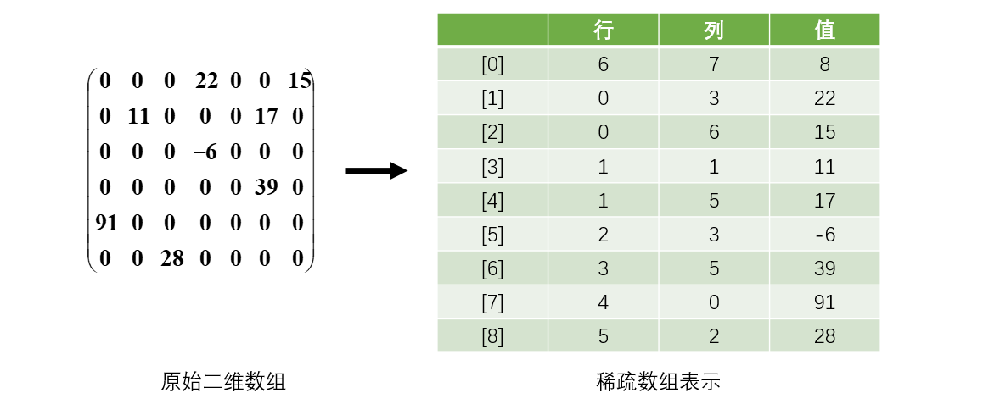
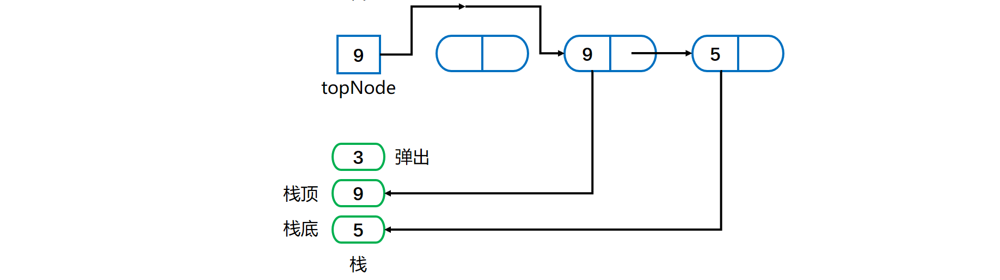

[TOC]

### 基本数据结构

#### 结构与存储

##### 1. 线性结构与非线性结构

###### ① 线性结构

线性结构作为最常用的数据结构，其特点是数据元素之间存在**一对一**的线性关系。

线性结构有两种不同的存储结构，即顺序存储结构和链式存储结构。顺序存储的线性表称为顺序表，顺序表中的存储元素是连续的。链式存储的线性表称为链表，链表中的存储元素不一定是连续的，元素节点中存放数据元素以及相邻元素的地址信息。

线性结构见的有：**组队列、链表和栈**。

###### ② 非线性结构

非线性结构包括：二维数组，多维数组，广义表，树结构，图结构。

##### 2. 存储方式的分析

###### ① 数组存储

优点：通过下标方式访问元素，速度快。**对于有序数组**，还可使用二分查找提高检索速度。
缺点：如果要检索具体某个值，或者插入值(按一定顺序)**会整体移动**，效率较低。可能还涉及到数组扩容，这中间的数据复制开销较大。

###### ② 链式存储

优点：在一定程度上对数组存储方式有优化 (比如：插入一个数值节点，只需要将插入节点，链接到链表中即可，
删除效率也很好)。
缺点：在进行检索查找时，效率仍然较低，比如(检索某个值，需要从头节点开始遍历) 。

###### ③ 树存储

能提高数据**存储，读取**的效率,  比如利用 **二叉排序树**(Binary Sort Tree)，既可以保证数据的检索速度，同时也可以保证数据的插入，删除，修改的速度。


#### 数组

##### 1. 稀疏数组

应用场景：记录一个**棋盘**。或者**地图**等，如下所示。


因为该二维数组的很多值是**默认值 0**, 因此记录了很多没有意义的数据，考虑使用稀疏数组。

当一个数组中**大部分元素为０**，或者为同一个值的数组时，可以使用稀疏数组来保存该数组。

稀疏数组的处理方法是:

- 记录数组一共有**几行几列**，有多少个**不同的值**；
- 把具有不同值的元素的行列及值记录在一个小规模的数组中，从而缩小程序的规模。
- 行不确定，但是列是三列的动态数组。

**转化举例**



上述数组 0 较多，使用稀疏数组表示，该数组第 0 个元素记录原始数组的 行数、列数和有效数据数。后面的值就是记录有效的位置和数据值。

##### 2. 递归处理数组

一般是可以使用**循环迭代**的方式实现。

显示数组元素：

###### ① 从array[first]开始

使用迭代其实很方便。

显示数组的其余元素是比显示整个数组更小的任务，复合递归的场景。

```java
public static void displayArray(int array[], int first, int last){
    System.out,println(array[first] + "");
    if (first < last) {
    	displayArray(array, first + 1, last);
    }
}
```

###### ② 将数组分半

递归处理数组的常用方法是将**数组分成两部分**。然后分别处理两部分。两部分是比原来数组更小的任务。


两个部分数组长度上的小小差别也没关系。

```java
public static void displayArray(int array[], int first, int last){
    if (first == last) {
        System.out,println(array[first] + "");
    } else {
     	int mid = (first + last) / 2;
        displayArray(array, first, mid);
        displayArray(array, mid + 1, last);
    }
}
```


#### 线性表

##### 1. 概述

线性表存储方式分为**==顺序存储和链式存储==**。顺序存储使用数组进行存储。链式存储使用链表进行存储。

对比表格如下：

|                |             顺序表             |                    链式表                    |
| :------------: | :----------------------------: | :------------------------------------------: |
|  **存储方式**  |            **数组**            |                   **链表**                   |
| **地址连续性** |      内存地址**连续**存储      | 节点的地址不是连续的，是通过**指针**连起来的 |
|    **查找**    |       方便。直接内存寻址       |             不方便。需要遍历链表             |
|    **插入**    | 不方便。后面的元素需要整体后移 |              方便。修改指针即可              |
|    **删除**    | 不方便。后面的元素需要整体前移 |              方便。修改指针即可              |

**使用**

- 当线性表中的元素个数变化较大或者根本不知道有多大时，最好用单链表结构，这样可以不需要考虑存储空间的大小问题。而如果事先知道线性表的大致长度，用顺序存储结构效率会高很多。

##### 2. 数组实现线性表

**特点**

- 元素的存储空间是**连续**的。在内存中是以顺序存储，内存划分的**区域是连续**的。如下图。


- 缺点就是，添、删、改的时候特别麻烦，特别是添和改的时候要移动数组，数组容易越界。可能出现数组存储满的情况，需要进行**扩容并复制**。

**插入元素**：在**指定的位置**添加元素时，需要把**后面的元素整体移动**，效率不高。位置编号越大， 插入时所需要移动的元素越少，时间越快。当加入的元素**超过容量之后也需要扩展数组**，并把原来的数组内容进行**复制**，这里也是效率不高。如插入 11 需要将 10 和 2 整体后移再插入。


**删除元素**：删除指定位置的元素之后，也需要把后面的元素**整体往前移动补空位**。如下图删除 3 之后，需要把后面的数据整体前移。


#####  3. 单向链表

###### ① 特点

元素在内存中不一定是连续存储的。如下图所示。


- 链表是以**结点**方式来存储数据。
- 每个结点包含 **data 域， next 域**，用于指向下一个结点。
- 链表中的节点不一定是连续存储的。如上图头结点指针 head 指向 150 地址的 a1 元素。
- 链表分带**头节点**的链表和**没有头节点**的链表，根据实际的需求来确定。
- 单向链表**不能自我删除**，需要靠**辅助节点** 。

###### ② 单链表效率分析

- 在尾部添加元素、替换元素、获取元素等操作使用数组实现通常更快。
- 在给定位置添加与删除元素使用数组通常会需要移动其他元素，会较慢。
- 如果主要在近表头与表头位置添加元素，则使用链式较好。如果操作多接近表尾，则可用数组实现。
- 对于链式实现，只有头引用和同时有头引用与尾引用两种情况效率有时会有差别。
- 为了方便操作，可以维护一个指向链尾的结点。这样在链尾操作时可以不需要每次都遍历整个链。

##### 4. 双向链表

- 单向链表，**查找的方向只能是一个方向**，而双向链表可以向前或者向后查找。
- 单向链表**不能自我删除**，需要靠**辅助节点** ，而双向链表，则可以**自我删除**，所以前面我们单链表删除节点时，总是需要先找到 temp, temp 是待删除节点的前一个节点。
- 双向链表维护了一个 next 指向下一个结点，维护了一个 pre 指向上一个结点。因此添加删除操作等需要**同时操作 next 和 pre** ，不要遗忘了。


#### 栈

##### 1. 概述

- 栈的操作端通常被称为**栈顶**，另一端被称为**栈底**。
- 所有添加都位于**栈顶**。栈顶是最新的数据。删除也是先删除栈顶。**后进先出**（LIFO）结构。
- 基本操作：**入栈**（push）：增加元素；**出栈**（pop）：删除元素；**查看**（peak）：获取栈顶但不删除。
- 顺序存储的栈称为**顺序栈**；链式存储的栈称为**链式栈**。、
- 栈的常见应用：十进制转 N 进制、行编辑器、校验括号是否匹配、中缀表达式转后缀表达式、表达式求值等。

```java
public interface MyStack<Item> extends Iterable<Item> {

    MyStack<Item> push(Item item);

    Item pop() throws Exception;

    boolean isEmpty();

    int size();

}
```

##### 2. 栈的实现

###### ① 栈的数组实现

使用可变大小数组实现栈，容量不够时可以自动**扩容**。

使用数组实现栈则数组的第一个位置是**栈底**，数组**最后占用**的位置才指向**栈顶**，否则压栈会整体**移动**元素位置。


弹栈操作可以将所有的元素依次弹栈即可。

可以看看 ArrayDeque 的源码。

这里给个demo。

```java
public class ArrayStack<Item> implements MyStack<Item> {

    // 栈元素数组，只能通过转型来创建泛型数组
    private Item[] a = (Item[]) new Object[1];

    // 元素数量
    private int N = 0;


    @Override
    public MyStack<Item> push(Item item) {
        check();
        a[N++] = item;
        return this;
    }


    @Override
    public Item pop() throws Exception {

        if (isEmpty()) {
            throw new Exception("stack is empty");
        }

        Item item = a[--N];

        check();

        // 避免对象游离
        a[N] = null;

        return item;
    }


    private void check() {

        if (N >= a.length) {
            resize(2 * a.length);

        } else if (N > 0 && N <= a.length / 4) {
            resize(a.length / 2);
        }
    }


    /**
     * 调整数组大小，使得栈具有伸缩性
     */
    private void resize(int size) {

        Item[] tmp = (Item[]) new Object[size];

        for (int i = 0; i < N; i++) {
            tmp[i] = a[i];
        }

        a = tmp;
    }


    @Override
    public boolean isEmpty() {
        return N == 0;
    }


    @Override
    public int size() {
        return N;
    }


    @Override
    public Iterator<Item> iterator() {

        // 返回逆序遍历的迭代器
        return new Iterator<Item>() {

            private int i = N;

            @Override
            public boolean hasNext() {
                return i > 0;
            }

            @Override
            public Item next() {
                return a[--i];
            }
        };
    }
}
```

###### ② 栈的链式实现

需要使用链表的**头插法或尾插法**来实现，因为头插法中最后压入栈的元素在**链表的开头**，它的 next 指针指向前一个压入栈的元素，在弹出元素时就可以通过 **next** 指针遍历到前一个压入栈的元素从而让这个元素成为新的栈顶元素。

使用链式实现栈，则**首节点**应该指向==**栈顶**==元素。首节点指向链尾是不合理的。


==**压栈**==操作就是分配一个新结点，使之指向目前的栈链，如下图所示。


a) 构造**新结点**并指向栈顶结点；

b) 头指针指向**栈顶新节点**。

**==弹栈==**操作就是将**首节点的引用赋给 topNode**，从而出栈。故将 topNode 指向链中的第二个结点。如下图所示。



可以参考 LinkedList 的源码实现。

单链表一般使用头插法，而双链表则头插法和尾插法都可。

```java
public class ListStack<Item> implements MyStack<Item> {

    private Node top = null;
    private int N = 0;


    private class Node {
        Item item;
        Node next;
    }


    @Override
    public MyStack<Item> push(Item item) {

        Node newTop = new Node();

        newTop.item = item;
        newTop.next = top;

        top = newTop;

        N++;

        return this;
    }


    @Override
    public Item pop() throws Exception {

        if (isEmpty()) {
            throw new Exception("stack is empty");
        }

        Item item = top.item;

        top = top.next;
        N--;

        return item;
    }


    @Override
    public boolean isEmpty() {
        return N == 0;
    }


    @Override
    public int size() {
        return N;
    }


    @Override
    public Iterator<Item> iterator() {

        return new Iterator<Item>() {

            private Node cur = top;


            @Override
            public boolean hasNext() {
                return cur != null;
            }


            @Override
            public Item next() {
                Item item = cur.item;
                cur = cur.next;
                return item;
            }
        };

    }
}
```

###### ③ 栈的向量Vector类实现

Java 类库 **Vector 类**，其实例（称为向量）的行为类似于一个可变大小的**数组**。可用于构造栈。Vector 类的实现基于**==动态可变大小的数组==**，但是其内部已经实现了许多方法，可以轻松实现栈结构。

如果使用向量实现栈，则向量的**首元素**应该指向**栈底元素**。而向量的最后的占用位置指向栈顶元素。


#### 队列

##### 1. 概述

- 先进先出 **FIFO** 结构。
- 添加元素在**后端**，出队列在**前端**。
- 基本操作：**入队**（enqueue）；**出队**（dequeue）获取队头且删除；**取值**（getFront）获取队头但是不删除。
- 队列为空时出队或者取值可能抛出自定义异常 EmptyQueueException。

##### 2. 队列的实现

###### ① 队列的数组实现

使用**数组**来存放队列，维护一个 **frontIndex** 和 **backIndex** 来指示**队头队尾**。

使用==**循环数组**==。使用**一般的循环数组**实现队列的话，~~放队列空或者队列满的时候，都满足 frontIndex 等于 backIndex，这是有问题的。~~

因此使用==**带一个不用位置的循环数组**==来实现队列。即该数组中始终有一个位置**空缺**， 可以将其放在**队尾**。此时判断队列的**空与满有不同的条件**。

所以存储对象的数组应比设定的大小**多 1**。

下图是队列满与空流程图。


队列**满**时（公式源自《数据结构与抽象 Java 版》）

```java
frontIndex == (backIndex + 2) % queue.length
6 == (4 + 2)% 7    
```

队列**空**时

```java
frontIndex == (backIndex + 1) % queue.length
```

**入队**即在**队列后端**添加元素，数组是**循环**的，需要使用 **==%==** 来确定索引位置。

**出队**过程即把 frontIndex 指向下一个元素。

**数组扩容**

容量不足实现**扩容**时，与之前的数组扩容有所差距如下图。将原来的循环队列**全都复制到新队列的开始**处。


###### ② 队列的链式实现

队列的两端在**链的两端**。队列的**前端**放在链的**开头**，队列的**后端**放在链的**链尾**。

**firstNode** 指向队列前端，**lastNode** 指向队列后端，如下图所示。当队列为**空**时两个**都为 null**。


**入队**是添加新结点到后端，需要判断链是否为**空**！如果是空链，则添加元素之后如下，即 firstNode 和 lastNode 均指向新结点。


如果是一般结点**入队**，则链中最后一个结点和 lastNode 指向新结点，如下。

- **最后一个结点**指向新结点；
- **lastNode** 指向新结点。


如果有多个结点，**出队**将 firstNode 指向链的第二个结点。如果队列中**仅有一个节点**，则出队之后为空。如下所示。


###### ③ 队列的循环链式实现

循环链中，最后一个结点指向第一个结点。每个结点的 **nextNode** 域**不会为 null**。如下图有指向最后结点的外部引用的循环链。


只需要**一个 lastNode** 数据域即可，它属于**链尾**，使用 

```java
lastNode.getNextNode();
```

 就可以获取到**链头**。

##### 3. 双端队列（deque）

- 能在队列的**前端和后端**进行添加、删除与获取操作。
- 行为上类似于**双端栈**。

##### 4. 优先级队列（Priority Queue）

- 根据**优先级**组织队列中的对象。
- 对象优先级通过 **compareTo()** 方法确定。
- Java中有对应的类库：**PriorityQueue** 类。
- 可以使用数组、链表或者向量来实现优先队列。
- 需要按项的优先级对项进行排序。

详细见优先队列部分。重点是**堆**实现。

##### 5. Java队列实现

###### ① Queue接口

```java
// 将元素插入队列
boolean add(E e);
// 将元素插入队列，与add相比，在容量受限时应该使用这个
boolean offer(E e);
// 将队首的元素删除，队列为空则抛出异常
E remove();
// 将队首的元素删除，队列为空则返回null
E poll();
// 获取队首元素，但不移除，队列为空则抛出异常
E element();
// 获取队首元素，但不移除，队列为空则返回null
E peek();
void clear();
int size();
```

入队、出队和取值两个一组，一个**抛出异常，一个返回 null**。

###### ② Deque接口

继承于 Queue 接口。两种方法**成对**，出现问题时一个出现**异常**一个返回 **NULL**。

| 操作类型 | 第一个元素（Deque实例的开头） | 最后一个元素（Deque实例的结尾） |
| :------: | :---------------------------: | :-----------------------------: |
|   插入   |  addFirst(e)  offerFirst(e)   |    addLast(e)  offerLast(e)     |
|   移除   |  removeFirst()  pollFirst()   |    removeLast()  pollLast()     |
|   检索   |    getFirst()  peekFirst()    |      getLast()  peekLast()      |

###### ③ ArrayDeque类

实现了 **Deque 接口**。

因为 Deque 接口声明了对应于**双端队列、队列和栈**的方法，因此可以用 ArrayDeque 类来创建这些数据集合的实例。

==**不要**使用 Stack 类来创建栈，使用这个类==。

可以使用**双向链**实现双端队列。


#### 符号表

符号表是一种**存储键值对**的数据结构，支持两种操作：**插入**，即将一组新的键值存存入表中；**快速查找**，即根据特定的键得到相应的值。

符号表的主要目的就是将**一个键和一个值**联系起来。

符号表分为**有序和无序**两种，有序符号表主要指支持 min()、max() 等根据键的大小关系来实现的操作。

有序符号表保证的是键的有序性，比较的是键。

```java
Key extends Comparable<Key>
```

有序符号表的键需要实现 **Comparable** 接口。

```java
public interface UnorderedST<Key, Value> {

    int size();

    Value get(Key key);

    void put(Key key, Value value);

    void delete(Key key);
}
```

```java
public interface OrderedST<Key extends Comparable<Key>, Value> {

    int size();

    void put(Key key, Value value);

    Value get(Key key);

    Key min();

    Key max();

    int rank(Key key);

    List<Key> keys(Key l, Key h);
}
```

符号表有**多种实现**方式。**树或者散列表**等都可以。散列表的查找算法也可以基于前一节的基础查找算法，只需要有适当改变即可。

##### 1. 基础实现

###### ① 链表实现无序符号表

```java
public class ListUnorderedST<Key, Value> implements UnorderedST<Key, Value> {

    private Node first;

    private class Node {
        Key key;
        Value value;
        Node next;

        Node(Key key, Value value, Node next) {
            this.key = key;
            this.value = value;
            this.next = next;
        }
    }

    @Override
    public int size() {
        int cnt = 0;
        Node cur = first;
        while (cur != null) {
            cnt++;
            cur = cur.next;
        }
        return cnt;
    }

    @Override
    public void put(Key key, Value value) {
        Node cur = first;
        // 如果在链表中找到节点的键等于 key 就更新这个节点的值为 value
        while (cur != null) {
            if (cur.key.equals(key)) {
                cur.value = value;
                return;
            }
            cur = cur.next;
        }
        // 否则使用头插法插入一个新节点
        first = new Node(key, value, first);
    }

    @Override
    public void delete(Key key) {
        if (first == null)
            return;
        if (first.key.equals(key))
            first = first.next;
        Node pre = first, cur = first.next;
        while (cur != null) {
            if (cur.key.equals(key)) {
                pre.next = cur.next;
                return;
            }
            pre = pre.next;
            cur = cur.next;
        }
    }

    @Override
    public Value get(Key key) {
        Node cur = first;
        while (cur != null) {
            if (cur.key.equals(key))
                return cur.value;
            cur = cur.next;
        }
        return null;
    }
}
```

###### ② 二分查找实现有序符号表

使用一对平行数组，一个存储键一个存储值。

二分查找的 rank() 方法至关重要，当键在表中时，它能够知道该键的位置；当键不在表中时，它也能知道在何处插入新键。

二分查找最多需要 logN+1 次比较，使用二分查找实现的符号表的查找操作所需要的时间最多是对数级别的。但是插入操作需要移动数组元素，是线性级别的。

```java
public class BinarySearchOrderedST<Key extends Comparable<Key>, Value> implements OrderedST<Key, Value> {

    private Key[] keys;
    private Value[] values;
    private int N = 0;

    public BinarySearchOrderedST(int capacity) {
        keys = (Key[]) new Comparable[capacity];
        values = (Value[]) new Object[capacity];
    }

    @Override
    public int size() {
        return N;
    }

    @Override
    public int rank(Key key) {
        int l = 0, h = N - 1;
        while (l <= h) {
            int m = l + (h - l) / 2;
            int cmp = key.compareTo(keys[m]);
            if (cmp == 0)
                return m;
            else if (cmp < 0)
                h = m - 1;
            else
                l = m + 1;
        }
        return l;
    }

    @Override
    public List<Key> keys(Key l, Key h) {
        int index = rank(l);
        List<Key> list = new ArrayList<>();
        while (keys[index].compareTo(h) <= 0) {
            list.add(keys[index]);
            index++;
        }
        return list;
    }

    @Override
    public void put(Key key, Value value) {
        int index = rank(key);
        // 如果找到已经存在的节点键为 key，就更新这个节点的值为 value
        if (index < N && keys[index].compareTo(key) == 0) {
            values[index] = value;
            return;
        }
        // 否则在数组中插入新的节点，需要先将插入位置之后的元素都向后移动一个位置
        for (int j = N; j > index; j--) {
            keys[j] = keys[j - 1];
            values[j] = values[j - 1];
        }
        keys[index] = key;
        values[index] = value;
        N++;
    }

    @Override
    public Value get(Key key) {
        int index = rank(key);
        if (index < N && keys[index].compareTo(key) == 0)
            return values[index];
        return null;
    }

    @Override
    public Key min() {
        return keys[0];
    }

    @Override
    public Key max() {
        return keys[N - 1];
    }
}
```

##### 2. 其他实现

其他实现参考**二叉查找树、红黑树、散列表**等。

##### 3. 符号表算法比较

|           算法           | 插入 | 查找 | 是否有序 |
| :----------------------: | :--: | :--: | :------: |
|   链表实现的无序符号表   |  N   |  N   |   yes    |
| 二分查找实现的有序符号表 |  N   | logN |   yes    |
|        二叉查找树        | logN | logN |   yes    |
|        2-3 查找树        | logN | logN |   yes    |
|    拉链法实现的散列表    | N/M  | N/M  |    no    |
|  线性探测法实现的散列表  |  1   |  1   |    no    |

应当优先考虑散列表，当需要有序性操作时使用红黑树。

符号表的各种实现方式对比。

|       数据结构       |                          优点                          |                          缺点                          |
| :------------------: | :----------------------------------------------------: | :----------------------------------------------------: |
|   链表（顺序查找）   |                     适用于小型问题                     |                   对大型符号表效率低                   |
| 有序数组（二分查找） | 最优的**查找效率和空间**需求，能够进行有序性相关的操作 |                  **插入**操作很**慢**                  |
|        散列表        |         能够快速的**查找和插入**常见类型的数据         | **无法进行有序性**相关的操作，链接与空节点需要额外空间 |
|      二叉查找树      |         实现简单，能够进行**有序性**的相关操作         |          没有性能上界的保证，链接需要额外空间          |
|    平衡二叉查找树    |   最优的**查找和插入**效率，能够进行有序性相关的操作   |                   链接需要额外的空间                   |

##### 4. Java的符号表实现

- java.util.TreeMap：红黑树
- java.util.HashMap：拉链法的散列表

##### 5. 稀疏向量乘法

当向量为稀疏向量时，可以使用符号表来存储向量中的非 0 索引和值，使得乘法运算只需要对那些非 0 元素进行即可。

```java
public class SparseVector {
    private HashMap<Integer, Double> hashMap;

    public SparseVector(double[] vector) {
        hashMap = new HashMap<>();
        for (int i = 0; i < vector.length; i++)
            if (vector[i] != 0)
                hashMap.put(i, vector[i]);
    }

    public double get(int i) {
        return hashMap.getOrDefault(i, 0.0);
    }

    public double dot(SparseVector other) {
        double sum = 0;
        for (int i : hashMap.keySet())
            sum += this.get(i) * other.get(i);
        return sum;
    }
}
```


