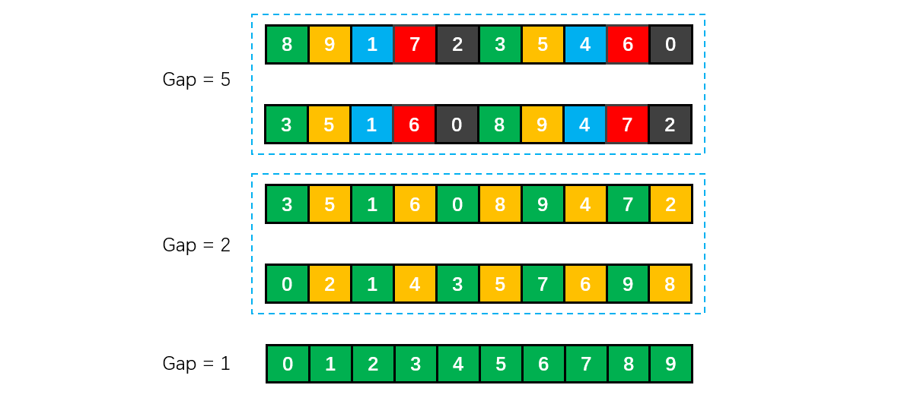

[TOC]

## 初级排序

### 1 选择排序

将未排序的数组的第一个数作为最小元素，往后进行遍历比较，如果找到比其更小的数就重置最小的数，找到本轮最小的数之后将其与未排序的数组的第一个进行交换，如此往复。

从未排序的数组中**选择最小元素**，将它与数组的**第一个元素交换位置**。再从数组剩下的元素中选择出最小的元素，将它与数组的第二个元素交换位置。不断进行这样的操作，直到将整个数组排序。

选择排序需要 \~**N<sup>2</sup>/2 次比较和 \~N 次**交换，它的运行时间与输入无关，这个特点使得它对一个已经排序的数组也需要这么多的比较和交换操作。


```java
/**
 * 选择排序
 */
public static void selectionSort(Comparable[] a) {
    // 数组长度
    int N = a.length;
    // N次循环
    for (int i = 0; i < N - 1; i++) {
        // 首先取第一个元素为最小元素
        int min = i;
        // 第i次遍历之后前面已经有i个有序元素，因此后面从i + 1开始比较
        for (int j = i + 1; j < N; j++) {
            // 寻找最小的元素
            if (less(a[j], a[min])) {
                min = j;
            }
        }
        // 将每次的第一个元素与最小元素交换
        swap(a, i, min);
    }
}

private static boolean less(Comparable v, Comparable w) {
    return v.compareTo(w) < 0;
}

private static void swap(Comparable[] a, int i, int j) {
    Comparable t = a[i];
    a[i] = a[j];
    a[j] = t;
}
```

需要O(n^2^)次比较和O(n)次交换。时间复杂度是O(n^2^)。最优时，最坏时和平均时都是O(n^2^)。


### 2 冒泡排序

从左到右**不断交换相邻逆序**的元素，在一轮的循环之后，可以让未排序的最大元素**上浮到右侧**。

在一轮循环中，如果没有发生交换，那么说明数组已经是有序的，此时可以直接退出。


```java
/**
 * 冒泡排序
 */
public static void bubbleSort(int []arr) {
    // 几个元素就循环几次
    for(int m = 1;m < arr.length; m++) {
        // 第n轮循环的时候，后面的n个元素已经有序，故只比较前面的length - n个元素
        for(int n = 0;n < arr.length - m; n++) {
            // 此处是比较的条件，可以更改实现逆序或者顺序排序
            if(arr[n] > arr[n + 1]) {
                // 交换元素
                int temp = arr[n];
                arr[n] = arr[j + 1];
                arr[n + 1] = temp;
            }
        }    
    }
}
```


### 3 插入排序

每次都将当前元素插入到**左侧已经排序**的数组中，使得插入之后左侧数组**依然有序**。

对于数组 {3, 5, 2, 4, 1}，它具有以下逆序：(3, 2), (3, 1), (5, 2), (5, 4), (5, 1), (2, 1), (4, 1)，插入排序每次**只能交换相邻元素**，令**逆序数量减少 1**，因此插入排序需要==交换的次数为逆序数量==。

插入排序的时间复杂度取决于数组的**初始顺序**，如果数组已经部分有序了，那么逆序较少，需要的交换次数也就较少，时间复杂度较低。

- **平均**情况下插入排序需要 \~N<sup>2</sup>/4 比较以及 \~N<sup>2</sup>/4 次交换；
- **最坏**情况下需要 \~N<sup>2</sup>/2 比较以及 \~N<sup>2</sup>/2 次交换，最坏的情况是数组是**倒序**的；
- **最好**情况下需要 N-1 次比较和 0 次交换，最好的情况就是数组已经**有序**了。

插入排序的效率最优时是 O(n)，**最坏时是 O(n^2^)**，数组越接近有序，需要做的工作越少。


上述是插入排序流程。分成了有序和无序两部分，在比较时，需要将有序部分数组右移，为插入腾出空间。

当 10 插入到 6 和 11 之间 时，需要将 6 往右移动才有空间给 10.

```java
/**
 * 插入排序
 */
public class InsertSort {
    public static void insertSort(int[] a) {
        
        int length = a.length;
        // 只有一个元素时不操作
        if (length <= 1) {
            return;
        } else {
            // insertNote为要插入的数据
            int i, j, insertNote;
            // 从数组的第二个元素开始循环将数组中的元素插入
            for (i = 1; i < a.length; i++) {
                // 设置数组中的第2个元素为第一次循环要插入的数据
                insertNote = a[i];
                j = i - 1;
                while (j >= 0 && insertNote < a[j]) {
                    // 如果要插入的元素小于第j个元素,就将第j个元素向后移动
                    a[j + 1] = a[j];
                    j--;
                }
                // 直到要插入的元素不小于第j个元素,将insertNote插入到数组中
                a[j + 1] = insertNote;
            }
        }
    }
    
	// 测试
    public static void main(String[] args) {
        int a[] = { 38,65,97,76,13,27,49 };
        insertSort(a);
        System.out.println(Arrays.toString(a));
    }
} 
```


### 4 希尔排序

#### 概述

简单插入排序的问题：

数组 arr = {2, 3, 4, 5, 6, 1} 这时需要插入的数 1(最小), 这样的过程是：

```java
{2,3,4,5,6,6}
{2,3,4,5,5,6}
{2,3,4,4,5,6}
{2,3,3,4,5,6}
{2,2,3,4,5,6}
{1,2,3,4,5,6}
```

**结论**:当需要插入的数是较小的数时，后移的次数明显增多，对效率有影响。

希尔排序也是一种直接插入排序，只是是对直接插入排序算法的优化。

对于**大规模**的数组，插入排序很慢，因为它只能交换**相邻**的元素，每次只能将逆序数量减少 1。希尔排序的出现就是为了解决插入排序的这种局限性，它通过**交换不相邻的元素，每次可以将逆序数量减少大于 1**。希尔排序也是一种插入排序，它是简单插入排序经过改进之后的一个更高效的版本，也称为==**缩小增量排序**==。

希尔排序使用==插入排序==对==间隔 h 的序列进行排序==。通过不断==减小 h，最后令 h = 1==，就可以使得整个数组是有序的。

#### 增量序列

来看下希尔排序的基本步骤，在此我们**选择增量 gap = length / 2，缩小增量继续以 gap = gap / 2的方式**，这种增量选择我们可以用一个序列来表示

```java
n/2, (n/2)/2, ..., 1
```

这称为**增量序列**。

希尔排序的增量序列的选择与证明是个数学难题，我们选择的这个增量序列是比较常用的，也是希尔建议的增量，称为**希尔增量**，但其实这个增量序列不是最优的。此处我们做示例使用**希尔增量**。

可以证明采用希尔增量时**最坏情况**下运行时间是 **O(n^2^)**。

Hibbard 提出一个不同的增量序列，形如

```java
1, 3, 7, ..., 2^k-1 
```

可以证明采用 Hibbard 增量时**最坏情况**下运行时间是 **O(n^1.5^)**。

采用其他的增量序列还可能降低最坏运行时间。


#### 图解举例

初始增量步长 **gap = length / 2**，意味着整个数组被分为 5 组，如下图颜色分别对应。然后在各自组内进行插入排序。第二次 gap = 5 / 2 = 2，所以数组被分为 2 组，如颜色对应所示，再对两组分别进行直接插入排序，使得整体更加有序，最后再缩小增量 gap = 2 / 2 = 1，此时再次进行插入排序就很快了。




在希尔排序的理解时，我们倾向于对于每一个分组，逐组进行处理，但在代码实现中，我们可以不用这么按部就班地处理完一组再调转回来处理下一组（这样还得加个 for 循环去处理分组）比如 [5, 4, 3, 2, 1, 0] ，首次增量设 gap = length / 2 = 3,则为 3 组 [5, 2] [4, 1] [3, 0]，实现时不用循环按组处理，我们可以从第 gap 个元素开始，逐个跨组处理。同时在插入数据时，可以采用元素交换法寻找最终位置，也可以采用数组元素移动法寻觅。

#### 代码实现

希尔排序的代码比较简单，如下：

```java
/**
 * 希尔排序
 * @param a 数组
 */
private void shellSort(int[] a){
    // 数组长度
    int n = a.length;
    // 初始间隔取为原始长度一半
    int gap = n / 2;
    // 循环直到间隔为1
    while(gap >= 1){
        for(int i = gap; i < a.length; i++){
            int j = 0;
            int temp = a[i];
            for(j = i - gap; j >= 0 && temp < a[j]; j = j - gap){
                a[j + gap] = a[j];
            }
            a[j + gap] = temp;
        }
        // 间隔取一半
        gap = gap / 2;
    }
}
```

以下是《数据结构与算法分析》的实现方法。这种方法可以**避免显式的进行交换**操作。

```java
/**
 * 希尔排序
 * 
 * @param array 待排序数组
 * @param <AnyType> 泛型类型
 */
public static <AnyType extends Comparable<? super AnyType>> void shellSort(AnyType[] array) {
    int j;

    for(int gap = array.length / 2; gap > 0; gap /= 2) {
        for(int i = gap; i < array.length; i++) {
            AnyType tmp = array[i];
            for(j = i; j >= gap && tmp.compareTo(array[j - gap]) < 0; j -= gap) {
                array[j] = array[j - gap];
            }
            array[j] = tmp;
        }
    }
}
```

**尚硅谷的希尔排序方法**

1) 希尔排序时， 对有序序列在插入时采用**交换法**, 并测试排序速度。此时测试时效率比普通的希尔排序更低。**不可用**！

```java
/**
 * 希尔排序
 * 有序序列在插入时采用交换法 不可用
 *
 * @param arr 待排序数组
 */
public static void shellSort(int[] arr) {
    
    // 根据前面的逐步分析，使用循环处理
    for (int gap = arr.length / 2; gap > 0; gap /= 2) {
        for (int i = gap; i < arr.length; i++) {
            // 遍历各组中所有的元素(共gap组，每组有N个元素),步长为gap
            for (int j = i - gap; j >= 0; j = j - gap) {
                // 如果当前元素大于加上步长后的那个元素，说明需要交换，其实此处的交换非常有损性能
                if (arr[j] > arr[j + gap]) {
                    // 以下执行交换动作
                    int temp = arr[j];
                    arr[j] = arr[j + gap];
                    arr[j + gap] = temp;
                }
            }
        }
        // 测试每轮后的结果，可注释
        System.out.println("希尔排序中间结果: " + Arrays.toString(arr));
    }

    System.out.println("希尔排序结果:" + Arrays.toString(arr));
}
```

2) 希尔排序时， 对有序序列在插入时**采用移位法**, 并测试排序速度，发现快了许多。合理可用。

```java
/**
 * 希尔排序
 * 有序序列在插入时采用移位法 可用
 * 
 * @param arr 待排序数组
 */
public static void shellSort2(int[] arr) {

    // 增量gap, 并逐步的缩小增量
    for (int gap = arr.length / 2; gap > 0; gap /= 2) {
        // 从第gap个元素，逐个对其所在的组进行直接插入排序
        for (int i = gap; i < arr.length; i++) {

            int j = i;
            int temp = arr[j];
            if (arr[j] < arr[j - gap]) {
                while (j - gap >= 0 && temp < arr[j - gap]) {
                    // 移动
                    arr[j] = arr[j - gap];
                    j = j - gap;
                }
                // 当退出while后，就给temp找到插入的位置
                arr[j] = temp;
            }
        }
    }
}
```

希尔排序的运行时间达不到平方级别，使用递增序列 1, 4, 13, 40, ...  的希尔排序所需要的比较次数不会超过 N 的若干倍乘于递增序列的长度。后面介绍的高级排序算法只会比希尔排序快两倍左右。

**希尔排序的效率**

调整间隔能改善其效率，一般是**避免间隔 gap 是偶数值**。因为当 gap 是偶数时的比较会在增量是 gap / 2 的下一题排序中**重复**。在此种情况下，当 gap 为偶数时，只需将其加 1 。即可将最坏情形改进为 O(n^1.5^)。


