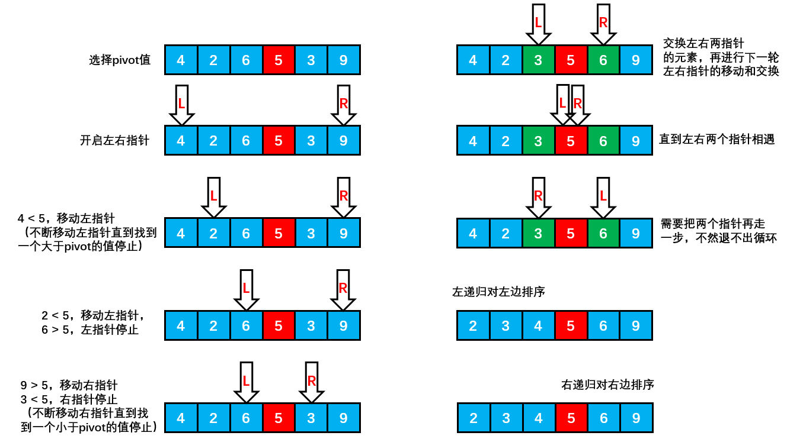

[TOC]

### ==**快速排序**==

- 快排是对冒泡排序的改进。

#### 1 基本算法

- 它的平均运行时间是 ==***O(N log N)***==。最坏情形是***O(N^2^)***。
- 快排也是一种**分治**的递归算法。
- 快速排序是一种**原地排序**算法。
- 归并排序将数组分为**两个子数组**分别排序，并将有序的子数组归并使得整个数组排序；
- 快速排序通过一个==**切分枢轴元**（pivot）==将数组分为两个子数组，==左子数组**小于等于**切分元素==，右子数组大于等于切分元素，将这两个子数组排序也就将整个数组排序了。


#### 2 枢轴元的选取

十分重要，直接影响排序的时间。

一种较为安全的做法是**随机选取**枢轴元。

更为保险的做法是选取**左端、右端以及中间三个元素**，并取其**中值**作为枢轴元。称为三数中值分割法。

可以用下面的随机选

```java
pivot = left + (int) (Math.random() * (right - left + 1))
```





代码实现

```java
/**
 * 快速排序
 * @param array 待排序数组
 * @param left 数组左index
 * @param right 数组右index
 */
public static void quickSort(int[] array, int left, int right) {

    // pivot 中轴值 此处仅取中值
    int pivot = array[(left + right) / 2];
    // pivot = left + (int) (Math.random() * (right - left + 1))  // 随机选一个数

    // 左下标
    int leftIndex = left;

    // 右下标
    int rightIndex = right;

    // while循环的目的是让比pivot 值小放到左边,比pivot值大放到右边,即从小到大排序
    while( leftIndex < rightIndex) {

        // 在pivot的左边一直找,找到大于等于pivot值才退出此小循环
        while(array[leftIndex] < pivot) {
            // 指针不断往右移动
            leftIndex++;
        }

        // 在pivot的右边一直找,找到小于等于pivot值,才退出此小循环
        while(array[rightIndex] > pivot) {
            // 指针不断往左移动
            rightIndex--;
        }

        // 如果leftIndex >= rightIndex 说明pivot左边全部是
        // 小于等于pivot值，右边全部是大于等于pivot值放置
        if( leftIndex >= rightIndex) {
            break;
        }

        // 交换两个指针指向的值
        int temp = array[leftIndex];
        array[leftIndex] = array[rightIndex];
        array[rightIndex] = temp;

        // 如果交换完后，发现这个arr[leftIndex] == pivot值，则rightIndex--，前移一步
        if(array[leftIndex] == pivot) {
            rightIndex--;
        }
        // 如果交换完后，发现这个arr[rightIndex] == pivot值 相等 leftIndex++， 后移
        if(array[rightIndex] == pivot) {
            leftIndex++;
        }
    }

    // 上述步骤把全部元素都放到了pivot的两边

    // 如果 leftIndex == rightIndex, 必须leftIndex++, rightIndex--, 否则为出现栈溢出
    if (leftIndex == rightIndex) {
        leftIndex++;
        rightIndex--;
    }

    // 向左递归 实现pivot左边全部排序
    if(left < rightIndex) {
        quickSort(array, left, rightIndex);
    }

    // 向右递归 实现pivot右边全部排序
    if(right > leftIndex) {
        quickSort(array, leftIndex, right);
    }
}

public static void main(String[] args) {
    int[] arr = {-9, 78, 0, 23, -567, 70, -1, 900, 4561};
    quickSort(arr, 0, arr.length-1);
    System.out.println("arr =" + Arrays.toString(arr));
}
```


#### 3 性能分析

快速排序是**原地排序**，**不需要辅助数组，但是==递归调用==需要辅助栈**。

快速排序**最好情况**下是每次都正好将数组**对半分**，这样递归调用次数才是最少的。这种情况下比较次数为 C<sub>N</sub>=2C<sub>N/2</sub>+N，复杂度为 **O(NlogN)**。

可以证明**平均情况**也是 **O(NlogN)**。

**最坏情况**下，第一次从最小的元素切分，第二次从第二小的元素切分，如此这般。因此最坏的情况下需要比较 N<sup>2</sup>/2，此时复杂度是 **O(N^2^)**。为了防止数组最开始就是有序的，在**进行快速排序时需要随机打乱数组**。


#### ==4 快速排序算法改进==

1.**切换到插入排序**

因为快速排序在小数组中也会递归调用自己，对于**小数组（小于 20 项），插入排序比快速排序的性能更好**，因此在小数组中可以切换到插入排序。

**2. 三数取中**

最好的情况下是每次都能取数组的中位数作为切分元素，但是计算中位数的代价很高。一种折中方法是取第一项、中间项和最后一项 3 个元素，并将大小居中的元素作为切分元素。

3.**三向切分**

对于有**大量重复元素**的数组，可以将数组切分为**三部分**，分别对应**小于、等于和大于切分元素**。

三向切分快速排序对于有**大量重复元素**的随机数组可以在线性时间内完成排序。

```java
public class ThreeWayQuickSort<T extends Comparable<T>> extends QuickSort<T> {

    @Override
    protected void sort(T[] nums, int l, int h) {
        if (h <= l) {
            return;
        }
        int lt = l, i = l + 1, gt = h;
        T v = nums[l];
        while (i <= gt) {
            int cmp = nums[i].compareTo(v);
            if (cmp < 0) {
                swap(nums, lt++, i++);
            } else if (cmp > 0) {
                swap(nums, i, gt--);
            } else {
                i++;
            }
        }
        sort(nums, l, lt - 1);
        sort(nums, gt + 1, h);
    }
}
```


#### 5 快排应用

##### 基于切分的快速选择算法

**求一个数组的第 k 大元素，可以使用堆排序，也可以使用基于快排思想的快速选择算法**。

快速排序的 partitionSort() 方法，会返回一个整数 j 使得 a[l..j-1] 小于等于 a[j]，且 a[j+1..h] 大于等于 a[j]，此时 a[j] 就是数组的第 j 大元素。

可以利用这个特性**找出数组**的**第 k 个元素**。

该算法是线性级别的，假设每次能将数组二分，那么比较的总次数为 (N+N/2+N/4+..)，直到找到第 k 个元素，这个和显然小于 2N。

```java
public T select(T[] nums, int k) {
    int l = 0, h = nums.length - 1;
    while (h > l) {
        int j = partition(nums, l, h);

        if (j == k) {
            return nums[k];

        } else if (j > k) {
            h = j - 1;

        } else {
            l = j + 1;
        }
    }
    return nums[k];
}
```

Java 中的 Array 类的 sort 方法使用快速排序对基本类型的数组进行升序排序。


**参考资料**

- 另一种快排实现-左神算法班快排--https://blog.csdn.net/u010452388/article/details/81218540