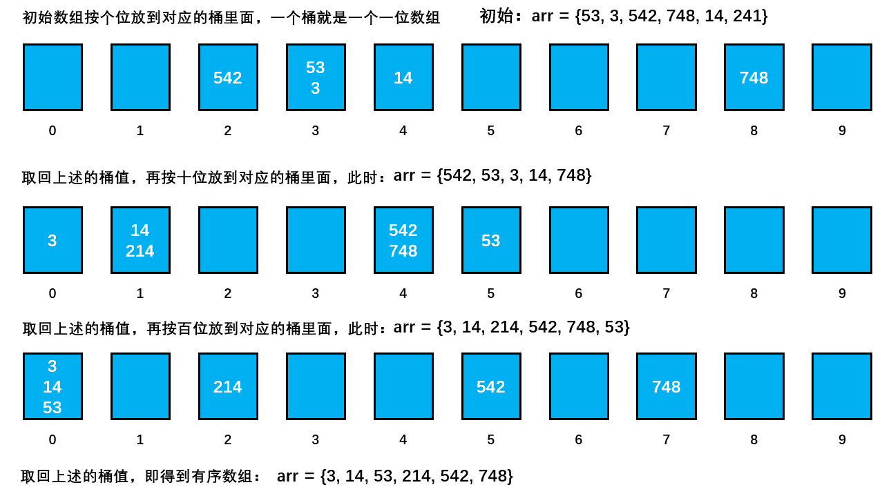

[TOC]

## 其他

### 1 基数排序

- 基数排序是**线性时间**的排序。但是使用情况比较特殊。

- 属于“分配式排序”（distribution sort），又称“**桶子法**”（bucket sort）或 bin sort，是桶排序的拓展，顾名思义，它是通过键值的各个位的值，将要排序的元素分配至某些“桶”中，达到排序的作用。

- **不作为**通用排序算法。
- 负数的数组最好不要使用基数排序。
- 整数排序需要10个桶，字母排序需要26个桶。
- 基数排序是使用**空间换时间**的经典算法，基数排序所需要的**内存比较大**。如果排序的数据量较大，可能造成**内存溢出**。

比如排序

```java
arr = {53, 3, 542, 748, 14, 241}
```

将其看成字符串进行排序，小于 100 的前面补 0占位。

从个位到十位再到百位排序，每一位可能情况有 0-9 共10种情况，因此需要十个桶，将对应的数字放到对应的桶里面，桶里面是**有序**的。重排之后将桶里面的数据再次按照十位分入不同的桶中。最后按照百位分入桶中。最后实现排列。



代码如下

```java
/**
 * 基数排序
 * @author cz
 */
public class RadixSort {

    public static void main(String[] args) {
        int arr[] = { 53, 3, 542, 748, 14, 214};
        System.out.println("基数排序前: " + Arrays.toString(arr));
        radixSort(arr);
        System.out.println("基数排序后: " + Arrays.toString(arr));
    }

    /**
     * 基数排序方法
     * @param array 待排数组
     */
    public static void radixSort(int[] array) {

        // 首先得到数组中最大的数的位数，需要先寻找数组中最大的数
        int max = array[0];
        for(int i = 1; i < array.length; i++) {
            if (array[i] > max) {
                max = array[i];
            }
        }
        // 得到最大数是几位数
        int maxLength = (max + "").length();
        
        // 定义一个二维数组，表示10个桶, 每个桶就是一个一维数组
        // 说明
        // 1. 二维数组包含10个一维数组
        // 2. 为了防止在放入数的时候数据溢出，则每个一维数组(桶)大小定为array.length
        int[][] bucket = new int[10][array.length];

        // 为了记录每个桶中实际存放了多少个数据,定义一个一维数组来记录各个桶的每次放入的数据个数
        // 比如：bucketElementCounts[0] , 记录的就是 bucket[0] 桶的放入数据个数
        // 这个数组的长度就是桶的个数即10
        int[] bucketElementCounts = new int[10];

        for(int i = 0 , n = 1; i < maxLength; i++, n = n * 10) {
            // (针对每个元素的对应位进行排序处理)， 第一次是个位，第二次是十位，第三次是百位...
            // 处理的轮数与数组中最大的数据的位数相同
            for(int j = 0; j < array.length; j++) {
                // 取出每个元素的对应位的值 ※
                int digitOfElement = array[j] / n % 10;
                // 放入到对应的桶的对应的桶的元素个数指针的地方
                bucket[digitOfElement][bucketElementCounts[digitOfElement]] = array[j];
                // 记录对应桶已经存放数据量的值
                bucketElementCounts[digitOfElement]++;
            }

            // 按照这个桶的顺序(一维数组的下标依次取出数据，放入原来数组)
            int index = 0;
            // 遍历每一个桶，并将桶中是数据，放入到原数组
            for(int k = 0; k < bucketElementCounts.length; k++) {
                // 如果桶中有数据放入到原数组（说明这个桶有数据）
                if(bucketElementCounts[k] != 0) {
                    // 循环该桶即第k个桶(即第k个一维数组), 放入
                    for(int l = 0; l < bucketElementCounts[k]; l++) {
                        // 取出元素放入到array
                        array[index] = bucket[k][l];
                        index ++;
                    }
                }
                // 第 i+1 轮处理后，需要将每个 bucketElementCounts[k] 记录的数据个数值清空
                bucketElementCounts[k] = 0;
            }
             System.out.println("第" + (i+1) + "轮排序处理 arr =" + Arrays.toString(array));
        }
    }

}
```

结果如下：

```java
基数排序前: [53, 3, 542, 748, 14, 214]
第1轮排序处理 arr =[542, 53, 3, 14, 214, 748]
第2轮排序处理 arr =[3, 14, 214, 542, 748, 53]
第3轮排序处理 arr =[3, 14, 53, 214, 542, 748]
基数排序后: [3, 14, 53, 214, 542, 748]
```


