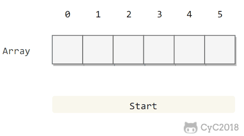

[TOC]

### 符号表

#### 概述

符号表是一种**存储键值对**的数据结构，支持两种操作：**插入**，即将一组新的键值存存入表中；**查找**，即根据特定的键得到相应的值。

符号表的主要目的就是将**一个键和一个值**联系起来。

一般不允许重复的键。

键不能为空。

符号表保证的是键的有序性，比较的是键。

```java
Key extends Comparable<Key>
```

符号表有**多种实现**方式。**树或者散列表**等都可以。散列表的查找算法也可以基于前一节的基础查找算法，只需要有适当改变即可。

符号表的各种实现方式对比。

|       数据结构       |                          优点                          |                          缺点                          |
| :------------------: | :----------------------------------------------------: | :----------------------------------------------------: |
|   链表（顺序查找）   |                     适用于小型问题                     |                   对大型符号表效率低                   |
| 有序数组（二分查找） | 最优的**查找效率和空间**需求，能够进行有序性相关的操作 |                  **插入**操作很**慢**                  |
|        散列表        |         能够快速的**查找和插入**常见类型的数据         | **无法进行有序性**相关的操作，链接与空节点需要额外空间 |
|      二叉查找树      |         实现简单，能够进行**有序性**的相关操作         |          没有性能上界的保证，链接需要额外空间          |
|    平衡二叉查找树    |   最优的**查找和插入**效率，能够进行有序性相关的操作   |                   链接需要额外的空间                   |


#### 符号表

符号表（Symbol Table）是一种存储**==键值对==**的数据结构，可以支持**快速查找**操作。

符号表分为**有序和无序**两种，有序符号表主要指支持 min()、max() 等根据键的大小关系来实现的操作。

有序符号表的键需要实现 **Comparable** 接口。

```java
public interface UnorderedST<Key, Value> {

    int size();

    Value get(Key key);

    void put(Key key, Value value);

    void delete(Key key);
}
```

```java
public interface OrderedST<Key extends Comparable<Key>, Value> {

    int size();

    void put(Key key, Value value);

    Value get(Key key);

    Key min();

    Key max();

    int rank(Key key);

    List<Key> keys(Key l, Key h);
}
```

##### 1. 基础实现

###### ① 链表实现无序符号表

```java
public class ListUnorderedST<Key, Value> implements UnorderedST<Key, Value> {

    private Node first;

    private class Node {
        Key key;
        Value value;
        Node next;

        Node(Key key, Value value, Node next) {
            this.key = key;
            this.value = value;
            this.next = next;
        }
    }

    @Override
    public int size() {
        int cnt = 0;
        Node cur = first;
        while (cur != null) {
            cnt++;
            cur = cur.next;
        }
        return cnt;
    }

    @Override
    public void put(Key key, Value value) {
        Node cur = first;
        // 如果在链表中找到节点的键等于 key 就更新这个节点的值为 value
        while (cur != null) {
            if (cur.key.equals(key)) {
                cur.value = value;
                return;
            }
            cur = cur.next;
        }
        // 否则使用头插法插入一个新节点
        first = new Node(key, value, first);
    }

    @Override
    public void delete(Key key) {
        if (first == null)
            return;
        if (first.key.equals(key))
            first = first.next;
        Node pre = first, cur = first.next;
        while (cur != null) {
            if (cur.key.equals(key)) {
                pre.next = cur.next;
                return;
            }
            pre = pre.next;
            cur = cur.next;
        }
    }

    @Override
    public Value get(Key key) {
        Node cur = first;
        while (cur != null) {
            if (cur.key.equals(key))
                return cur.value;
            cur = cur.next;
        }
        return null;
    }
}
```

###### ② 二分查找实现有序符号表

使用一对平行数组，一个存储键一个存储值。

二分查找的 rank() 方法至关重要，当键在表中时，它能够知道该键的位置；当键不在表中时，它也能知道在何处插入新键。

二分查找最多需要 logN+1 次比较，使用二分查找实现的符号表的查找操作所需要的时间最多是对数级别的。但是插入操作需要移动数组元素，是线性级别的。

```java
public class BinarySearchOrderedST<Key extends Comparable<Key>, Value> implements OrderedST<Key, Value> {

    private Key[] keys;
    private Value[] values;
    private int N = 0;

    public BinarySearchOrderedST(int capacity) {
        keys = (Key[]) new Comparable[capacity];
        values = (Value[]) new Object[capacity];
    }

    @Override
    public int size() {
        return N;
    }

    @Override
    public int rank(Key key) {
        int l = 0, h = N - 1;
        while (l <= h) {
            int m = l + (h - l) / 2;
            int cmp = key.compareTo(keys[m]);
            if (cmp == 0)
                return m;
            else if (cmp < 0)
                h = m - 1;
            else
                l = m + 1;
        }
        return l;
    }

    @Override
    public List<Key> keys(Key l, Key h) {
        int index = rank(l);
        List<Key> list = new ArrayList<>();
        while (keys[index].compareTo(h) <= 0) {
            list.add(keys[index]);
            index++;
        }
        return list;
    }

    @Override
    public void put(Key key, Value value) {
        int index = rank(key);
        // 如果找到已经存在的节点键为 key，就更新这个节点的值为 value
        if (index < N && keys[index].compareTo(key) == 0) {
            values[index] = value;
            return;
        }
        // 否则在数组中插入新的节点，需要先将插入位置之后的元素都向后移动一个位置
        for (int j = N; j > index; j--) {
            keys[j] = keys[j - 1];
            values[j] = values[j - 1];
        }
        keys[index] = key;
        values[index] = value;
        N++;
    }

    @Override
    public Value get(Key key) {
        int index = rank(key);
        if (index < N && keys[index].compareTo(key) == 0)
            return values[index];
        return null;
    }

    @Override
    public Key min() {
        return keys[0];
    }

    @Override
    public Key max() {
        return keys[N - 1];
    }
}
```

##### 2. 其他实现

其他实现参考**二叉查找树、红黑树、散列表**等。

##### 3. 符号表算法比较

|           算法           | 插入 | 查找 | 是否有序 |
| :----------------------: | :--: | :--: | :------: |
|   链表实现的无序符号表   |  N   |  N   |   yes    |
| 二分查找实现的有序符号表 |  N   | logN |   yes    |
|        二叉查找树        | logN | logN |   yes    |
|        2-3 查找树        | logN | logN |   yes    |
|    拉链法实现的散列表    | N/M  | N/M  |    no    |
|  线性探测法实现的散列表  |  1   |  1   |    no    |

应当优先考虑散列表，当需要有序性操作时使用红黑树。

##### 4. Java 的符号表实现

- java.util.TreeMap：红黑树
- java.util.HashMap：拉链法的散列表


#### 散列表

散列表类似于数组，可以把散列表的散列值看成数组的索引值。访问散列表和访问数组元素一样快速，它可以在常数时间内实现**查找和插入**操作。

由于无法通过散列值知道键的大小关系，因此散列表**无法实现有序性**操作。

散列表（Hash table，也叫哈希表），是根据**键值(Key value)** 而直接进行访问的数据结构。也就是说它通过把**键值映射到表中一个位置**来访问记录，以加快查找的速度。这个**映射函数叫做==散列函数==**，存放记录的数组叫做散列表。


#### 散列函数

##### 1. 定义

每个**关键字**被映射到从 **0 到 TableSize - 1** 这个范围的某个数，并被放到合适的单元中，这个映射就是**==散列函数==**。

对于一个大小为 **M** 的散列表，散列函数能够把任意键转换为 **[0, M - 1]** 内的正整数，该正整数即为 **hash** 值。

我们需要寻找一个散列函数，该函数要在单元之间**均匀的分配**关键字。

散列函数应该满足以下**三个条件**：

- **一致性**：相等的键应当有相等的 hash 值，两个键相等表示调用 equals() 返回的值相等。
- **高效性**：计算应当简便，有必要的话可以把 hash 值缓存起来，在调用 hash 函数时直接返回。
- **均匀性**：所有键的 hash 值应当均匀地分布到 [0, M-1] 之间，如果不能满足这个条件，有可能产生很多冲突，从而导致散列表的性能下降。

##### 2. 常见散列函数

**除留余数法（取模）**可以将整数散列到 [0, M-1] 之间，例如一个正整数 k，计算 k % M 既可得到一个 [0, M-1] 之间的 hash 值。注意 **M 最好是一个素数**，否则无法利用键包含的所有信息。例如 M 为 10<sup>k</sup>，那么只能利用键的后 k 位。

对于其它数，可以将其**转换成整数**的形式，然后利用除留余数法。例如对于**浮点数**，可以将其的**二进制形式**转换成整数。

对于**多部分组合**的类型，每个部分都需要计算 hash 值，这些 hash 值都具有同等重要的地位。为了达到这个目的，可以将该类型看成 R 进制的整数，每个部分都具有不同的**权值**。

例如，字符串的散列函数实现如下：

```java
int hash = 0;
for (int i = 0; i < s.length(); i++)
    hash = (R * hash + s.charAt(i)) % M;
```

再比如，拥有**多个成员**的自定义类的哈希函数如下：

```java
int hash = (((day * R + month) % M) * R + year) % M;
```

R 通常取 **31**。

Java 中的 **hashCode**() 实现了哈希函数，但是默认使用对象的**内存地址值**。在使用 hashCode() 时，应当结合除留余数法来使用。因为**内存地址是 32 位整数**，我们只需要 **31 位**的非负整数，因此应当屏蔽符号位之后再使用除留余数法。

```java
int hash = (x.hashCode() & 0x7fffffff) % M;
```

使用 Java 的 HashMap 等自带的哈希表实现时，只需要去实现 **Key 类型**的 hashCode() 函数即可。Java 规定 hashCode() 能够将键均匀分布于所有的 32 位整数，Java 中的 String、Integer 等对象的 hashCode() 都能实现这一点。以下展示了**自定义类型**如何实现 hashCode()：

```java
public class Transaction {

    private final String who;
    private final Date when;
    private final double amount;

    public Transaction(String who, Date when, double amount) {
        this.who = who;
        this.when = when;
        this.amount = amount;
    }

    // 自定义散列函数
    public int hashCode() {
        int hash = 17;
        int R = 31;
        hash = R * hash + who.hashCode();
        hash = R * hash + when.hashCode();
        hash = R * hash + ((Double) amount).hashCode();
        return hash;
    }
}
```


#### 散列冲突

当两个关键字散列到**同一个值**的时候，就产生了散列冲突。散列表存在**==冲突==**，也就是两个**不同的键可能有相同的 hash 值**。

解决冲突的简单方法有：**拉链法和开放定址法**。

#####  1. 拉链法

拉链法使用**数组 + 链表**来存储 hash 值相同的键，从而解决冲突。

**查找**需要分两步，首先查找 Key 所在的**链表**（对应的数据槽），然后在链表中**顺序查找**。

对于 N 个键，M 条链表 (N > M)，如果哈希函数能够满足均匀性的条件，每条链表的**长度趋向于 N/M**，因此未命中的查找和插入操作所需要的比较次数为 \~N/M。


插入的新元素被插入到链表的**前端**。

散列表存储一个**链表数组**，它们在构造方法中被指定。

**装填因子**：散列表中的元素个数对该表大小的比。

这个详细可看 **HashMap** 的源码。

##### 2. 开放地址法

线性探测法使用**空位**来解决冲突，当冲突发生时，**向前探测一个空位**来存储冲突的键。

更常见的是，单元 h~0~(x), h~1~(x), ....  相继被试选，其中

***h ~i~ (x) = (hash(x) + f ~i~ (x) ) mod TableSize, 且 f(0) = 0*。**

**函数 f  是解决冲突解决方法（冲突函数）**。此时**所有的数据都需要放入表**内，所以**需要的表比拉链法散列需要的表更大**。把这样的表叫做**探测散列表**。

使用线性探测法，数组的大小 M 应当**大于键的个数 N**（M>N)。

<div align="center">  </div><br>
现考察三种通常的冲突 解决方案。线性探测法、平方探测法、双散列法。

###### ① 线性探测法

线性探测法中典型的情形是**冲突函数 f 为一次函数**：

```
f(i) = i
```

这相当于相继**逐个探测单元**（必要时可以回绕）以查找出一个**空**单元。

存在的**问题**：有时候占据的单元会形成一些**区块**，其结果成为==**一次聚集**==，就是说散列到**区块**中的任何关键字都需要**多次尝试**才能解决冲突。

**装填因子**的选取很重要。

**代码实现**

```java
public class LinearProbingHashST<Key, Value> implements UnorderedST<Key, Value> {

    private int N = 0;
    private int M = 16;
    private Key[] keys;
    private Value[] values;

    public LinearProbingHashST() {
        init();
    }

    public LinearProbingHashST(int M) {
        this.M = M;
        init();
    }

    private void init() {
        keys = (Key[]) new Object[M];
        values = (Value[]) new Object[M];
    }

    private int hash(Key key) {
        return (key.hashCode() & 0x7fffffff) % M;
    }
}
```

**查找**

```java
public Value get(Key key) {
    for (int i = hash(key); keys[i] != null; i = (i + 1) % M)
        if (keys[i].equals(key))
            return values[i];

    return null;
}
```

**插入**

```java
public void put(Key key, Value value) {
    resize();
    putInternal(key, value);
}

private void putInternal(Key key, Value value) {
    int i;
    for (i = hash(key); keys[i] != null; i = (i + 1) % M)
        if (keys[i].equals(key)) {
            values[i] = value;
            return;
        }

    keys[i] = key;
    values[i] = value;
    N++;
}
```

**删除**

删除操作应当将右侧所有相邻的键值对重新插入散列表中。

```java
public void delete(Key key) {
    int i = hash(key);
    while (keys[i] != null && !key.equals(keys[i]))
        i = (i + 1) % M;

    // 不存在，直接返回
    if (keys[i] == null)
        return;

    keys[i] = null;
    values[i] = null;

    // 将之后相连的键值对重新插入
    i = (i + 1) % M;
    while (keys[i] != null) {
        Key keyToRedo = keys[i];
        Value valToRedo = values[i];
        keys[i] = null;
        values[i] = null;
        N--;
        putInternal(keyToRedo, valToRedo);
        i = (i + 1) % M;
    }
    N--;
    resize();
}
```

**调整数组大小**

线性探测法的成本取决于连续条目的长度，连续条目也叫**聚簇**。当聚簇很长时，在查找和插入时也需要进行很多次探测。例如下图中 2\~4 位置就是一个聚簇。


α = N/M，把 α 称为**使用率**。理论证明，当 α 小于 1/2 时探测的预计次数只在 1.5 到 2.5 之间。为了保证散列表的性能，应当调整数组的大小，使得 α 在 [1/4, 1/2] 之间。

```java
private void resize() {
    if (N >= M / 2)
        resize(2 * M);
    else if (N <= M / 8)
        resize(M / 2);
}

private void resize(int cap) {
    LinearProbingHashST<Key, Value> t = new LinearProbingHashST<Key, Value>(cap);
    for (int i = 0; i < M; i++)
        if (keys[i] != null)
            t.putInternal(keys[i], values[i]);

    keys = t.keys;
    values = t.values;
    M = t.M;
}
```

###### ② 平方探测法

平方探测是**消除**线性探测中**一次聚集**问题的散列冲突解决方法。

平方探测就是**冲突函数为二次**的探测方法。

典型的情形是 

```
f(i) = i * i
```

> **定理**：如果使用平方探测，且表的大小是**素数**，那么当表至少有**一半是空**的时候，**总能够**插入一个新的元素。

即使表被填充的位置仅仅比**一半多一个**，那么插入都**可能失败**。

平方探测也可能产生**二次聚集**问题。

###### ③ 双散列法

双散列法一般的选择是

```
f(i) = i * hash2(x)
```

这个公式是说将第二个散列函数应用到 x 并在距离 ***hash~2~(x)***,  ***2 hash~2~(x)....*** 等处进行探测。

##### 3. 再散列

如果散列表装的太满，那么再插入新元素的时候可能消耗时间很长，而且可能失败。解决方法是建立另一个大约 2 倍大的表，然后扫描整个原始散列表，**重新计算元素的新散列值**并装入到新的散列表中。这个操作就是**再散列**。

再散列显然开销较大。

**再散列策略**

- 散列表到一半满就再散列。
- 当插入元素失败才再散列（比较极端）。
- **途中策略**：当散列表达到一个**装填因子**时进行再散列（较好）。


#### 高级散列

介绍几个高级一定的散列表。

##### 1. 完美散列

**完美散列的定义**

在关键字集不再变化的情况下，运用某种散列技术，将所有的关键字存入散列表中，可以在最坏运行时间为 O(1) 的情况下完成对散列表的查找工作，这种散列方法就是**完美散列**。

我们期望最坏的情况下，查找的时间函数也是 O(1) — **完美散列**。

使用**二级散列表**可以实现完美散列。每个二级散列表将用一个**不同的散列函数**进行构造，直到没有冲突为止。

##### 2. 布谷鸟散列

CuckooHash（布谷鸟散列）是为了解决**哈希冲突问题**而提出，利用较少的计算换取较大的**空间**。

假设有 N 个项，分别维护**两个**超过半空的表，且有**两个独立的散列函数**，可以把每个项分配到每个表的一个位置。布谷鸟散列保持不变的是一个项总是会被存储在这两个位置之一。

**算法描述**

使用 hashA、hashB 计算对应的 key 位置：

1、两个位置均为空，则任选一个插入；
2、两个位置中一个为空，则插入到空的那个位置
3、两个位置均不为空，则踢出一个位置后插入，被踢出的对调用该算法，再执行该算法找其另一个位置，循环直到插入成功。
4、如果被踢出的次数达到一定的阈值，则认为 hash 表已满，并进行再哈希 rehash。

布谷鸟散列通常被实现成一张巨大的表，且带有**两个（或多个）可以探测整表的散列函数**。

具体实现参考：https://www.jianshu.com/p/68220564f341

##### 3. 跳房子散列

线性探测法是在散列位置的相邻点开始探测，这会引起很多问题，于是各种优化版本例如平方探测、双散列等被提出来改进其中的聚集问题。但是探测相邻位置和第二次散列相比，显然探测相邻位置更有优势，所以线性探测仍然是实用的，甚至是最佳选择。

跳房子散列的思路：**用事先确定的，对计算机底层体系结构而言最优的一个常数**，给探测序列的最大长度加个上界。这样做可以给出常数级的最坏查询时间，并且与**布谷鸟散列**一样，查询可以并行化，以同时检查可用位置 的有限集。

 **要点：**

 a）依然是线性探测

 b）探测长度 *i* 有个上限

 c）上限是提前定好的，跟计算机底层体系结构有关系

 但是布谷鸟散列和跳房子散列还处于实验室状态，能否在实际中代替线性探测法或者平方探测法，还有待验证。


#### 小结

##### 1. 符号表算法比较

|           算法           | 插入 | 查找 | 是否有序 |
| :----------------------: | :--: | :--: | :------: |
|   链表实现的无序符号表   |  N   |  N   |   yes    |
| 二分查找实现的有序符号表 |  N   | logN |   yes    |
|        二叉查找树        | logN | logN |   yes    |
|        2-3 查找树        | logN | logN |   yes    |
|    拉链法实现的散列表    | N/M  | N/M  |    no    |
|  线性探测法实现的散列表  |  1   |  1   |    no    |

应当优先考虑散列表，当需要有序性操作时使用红黑树。

##### 2. Java的符号表实现

- java.util.TreeMap：红黑树
- java.util.HashMap：拉链法的散列表

##### 3. 稀疏向量乘法

当向量为稀疏向量时，可以使用符号表来存储向量中的非 0 索引和值，使得乘法运算只需要对那些非 0 元素进行即可。

```java
public class SparseVector {
    private HashMap<Integer, Double> hashMap;

    public SparseVector(double[] vector) {
        hashMap = new HashMap<>();
        for (int i = 0; i < vector.length; i++)
            if (vector[i] != 0)
                hashMap.put(i, vector[i]);
    }

    public double get(int i) {
        return hashMap.getOrDefault(i, 0.0);
    }

    public double dot(SparseVector other) {
        double sum = 0;
        for (int i : hashMap.keySet())
            sum += this.get(i) * other.get(i);
        return sum;
    }
}
```


#### **参考资料**

- https://www.jianshu.com/p/68220564f341


