[TOC]

## 2-3树与红黑树

### 2-3树

#### 1 概述

2-3 查找树引入了 2 节点和 3 节点，目的是为了让**树平衡**。一颗完美平衡的 2-3 查找树的所有空链接到根节点的距离应该是相同的。

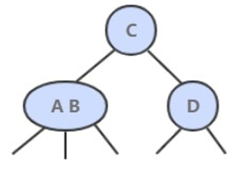

2-3 树是**最简单的 B 树**结构, 具有如下特点:

- 2-3 树的所有**叶子节点**都在**同一层**.(只要是 B 树都满足这个条件)
- 2-3 树是由**二节点和三节点**构成的树。
- 有两个子节点的节点叫**二节点**，二节点要么**没有**子节点，要么有**两个**子节点.
- 有三个子节点的节点叫**三节点**，三节点要么**没有**子节点，要么有**三个**子节点.
- 2-3 树中结点的顺序**也要满足排序树**的特点，即左边的结点的值大于根结点的值，根结点的值小于右结点的值。


#### 2 构造过程

给定数列构造 2-3 树。{16, 24, 12, 32, 14, 26, 34, 10, 8, 28, 38, 20} 。


##### 1. 插入操作

插入操作和 BST 的插入操作有很大区别，BST 的插入操作是先进行一次未命中的查找，然后再将节点插入到对应的空链接上。但是 2-3 查找树如果也这么做的话，那么就会破坏了平衡性。**它是将新节点插入到叶子节点上**。

根据叶子节点的类型不同，有不同的处理方式：

- 如果插入到 2 节点上，那么直接将新节点和原来的节点组成 3 节点即可。


- 如果是插入到 3 节点上，就会产生一个临时 4 节点时，需要将 4 节点分裂成 3 个 2 节点，并将中间的 2 节点移到上层节点中。如果上移操作继续产生临时 4 节点则一直进行分裂上移，直到不存在临时 4 节点。


##### 2. 性质

2-3 查找树插入操作的变换都是局部的，除了相关的节点和链接之外不必修改或者检查树的其它部分，而这些局部变换不会影响树的全局有序性和平衡性。

2-3 查找树的查找和插入操作复杂度和插入顺序无关，在最坏的情况下查找和插入操作访问的节点必然不超过 logN 个，含有 10 亿个节点的 2-3 查找树最多只需要访问 30 个节点就能进行任意的查找和插入操作。


2-3 树是一棵自平衡的**多路查找树**，它并不是一棵二叉树，具有如下性质：

（1）每个节点有 1 个或 2 个 key，对应的子节点为 2 个子节点（称为 2- 结点）或 3 个子节点（称为 3- 结点）；

（2）所有**叶子节点到根节点的长度一致**；

（3）每个节点的 key 从左到右保持了从小到大的顺序，两个 key 之间的子树中所有的 key 一定大于它的父节点的左 key，小于父节点的右 key。

如下图所示。

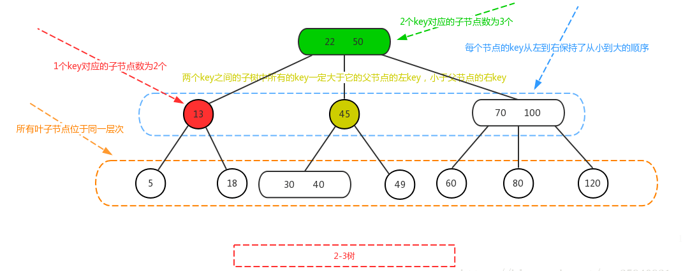


因为 2-3 树是一棵自平衡的多路查找树，所以构建跟维系一棵2-3树，就比二叉平衡树要复杂的多了。

#### 插入结点

整个过程中树是**由下往上**生长的。

2-3 树的插入操作，首先一定是在**叶子节点**，另外如果 2-3 树中已存在当前插入的 key，则更新值， 下面就在这两点的前提下，进行 2-3 树插入流程的分析：

（1）如果待插入的节点只有 1 个 key，则直接插入即可；

（2）如果待插入的节点有 2 个 key，则对节点进行分裂，即 2 个 key 加上待插入的 key，这 3 个 key 分裂成 1 个key 跟两个子节点，然后将分裂之后的 3 个 key 中的父节点看作向上层插入的 key，然后重复（1）、（2）步骤，直到满足 2-3 树的定义性质。

如下图所示，插入“7”，而此时节点 “5” 只有一个key，则直接插入即可，形成节点 “5 7”。
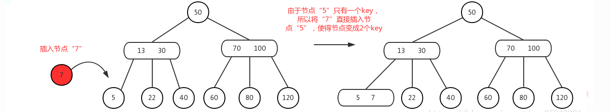

此时如果再插入“6”，而节点 “5 7” 已经有 2 个key了，所以需要先进行**分裂**。

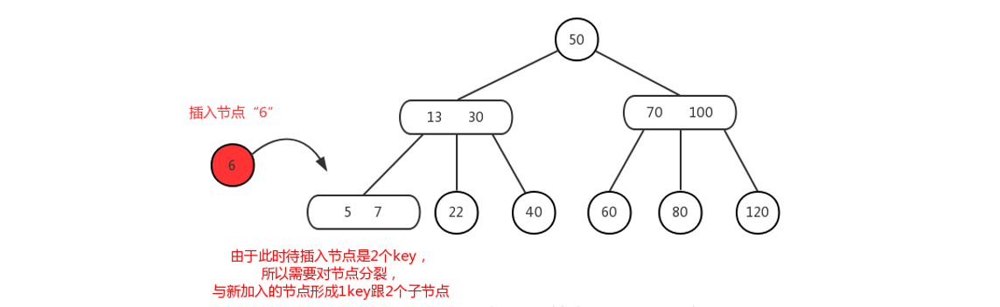

“5 7” 节点与新插入的 “6” 分裂之后，如下图所示。

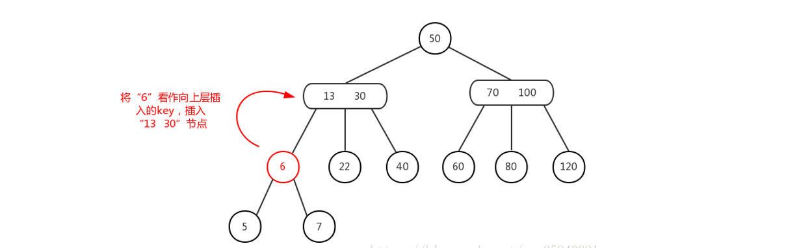

此时需要将 “6” **向父节点**插入，而父节点 “13 30” 又包含 2 个 key，则需要**再次分裂**，即如下图所示，“13 30” 与 “6” 分裂成父节点为 “13”，子节点为 “6” 跟 “30”。

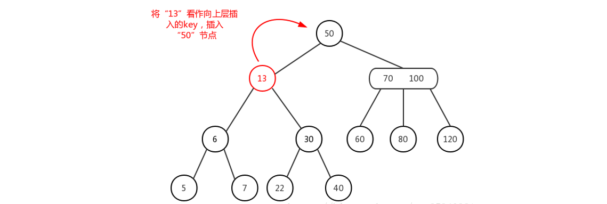

再将节点 “13” 看作**向父节点插入**，而此时父节点 “50” 只有一个key，则将 “13” 与 “50” 直接**合并**即可，如下图所示，完成节点的插入调整。


### 2-3-4树

2-3-4 树只是在 2-3 树的基础上进行了扩展。2-3-4 树也是一棵自平衡的**多路查找树**，具有如下性质：

（1）任一节点只能是 1 个或 2 个或 3 个 key，对应的子节点为 2 个子节点或 3 个子节点或 4 个子节点；

（2）所有叶子节点到**根节点的长度一致**；

（3）每个节点的 key 从左到右保持了从小到大的顺序，两个 key 之间的子树中所有的 key 一定大于它的父节点的左 key，小于父节点的右 key，对于 3 个 key 的节点，两两 key 之间也是如此。

如下图所示。

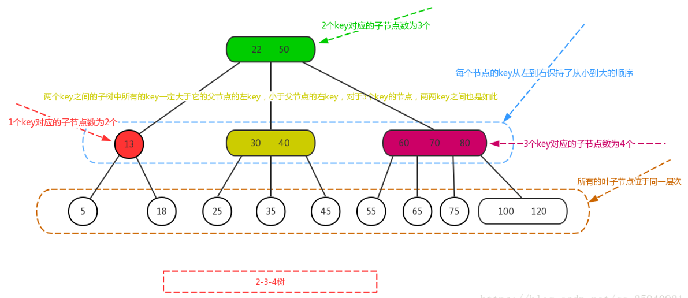

2-3-4 树插入节点跟删除节点的处理，实际上跟 2-3 树**很像**，特别是插入节点，基本上跟 2-3 树是一模一样，只是**分裂的条件由 2 个 key 变成了 3 个 key而已**，即，

（1）如果待插入的节点不是 3 个 key，则直接插入即可；

（2）如果待插入的节点有 3 个 key，则对节点进行**分裂**，即 3 个 key 加上待插入的 key，这 4 个 key 分裂成 1 个key 跟 2 个子节点，然后将分裂之后的 4 个 key 中的父节点看作**向上层插入**的 key，然后重复 (1) (2) 步骤，直到满足 2-3-4 树的定义性质。

插入结点的过程如下图所示。插入 125，过程略去，见图。

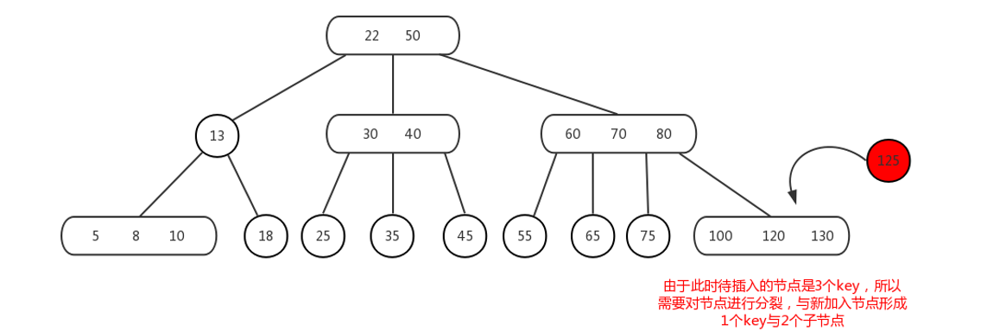

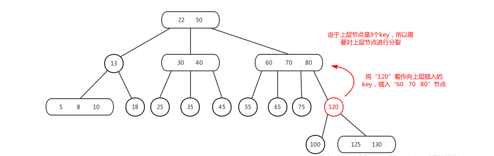

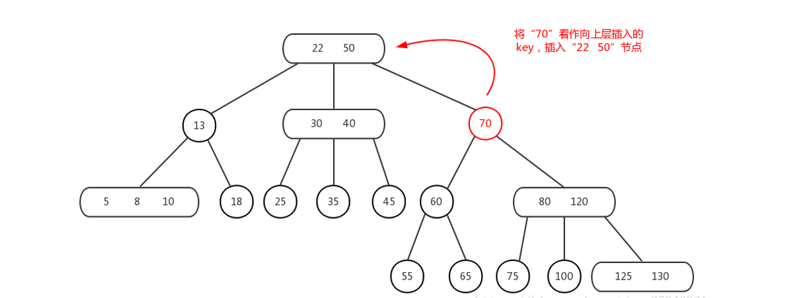

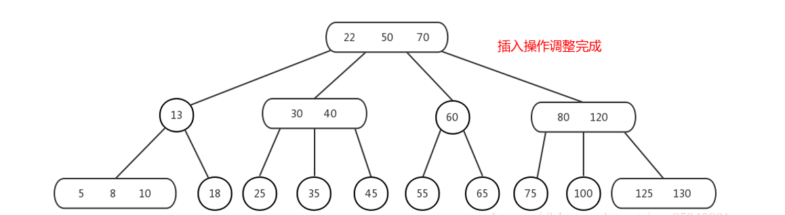


### 红黑树

#### 概述

红黑树也是**二叉查找树**，我们知道，二叉查找树这一数据结构并不难，而红黑树之所以难是难在它是**自平衡**的二叉查找树，在进行插入和删除等可能会破坏树的平衡的操作时，需要**重新自处理达到平衡状态**。

2-3 树不太好写代码，红黑树借鉴了 2-3 树的思想对其进行了转换，方便编码。

红黑树背后的思想是用标准的二叉查找树（完全由 2- 结点构成）和一些额外的信息（替换 3- 结点）来表示 2-3 树。

如下图中上半部分示一个2-3 树的 3- 结点，改变成红黑树如下。

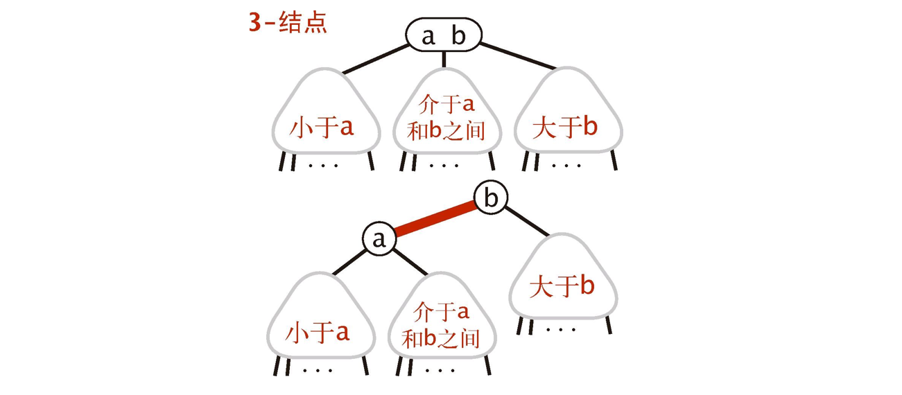

将树中的连接分成两种：

**红链接**：将两个 2- 结点连接起来构成一个 3- 结点。

**黑链接**：2-3 树中的普通结点。

可以将 **3- 结点**视为一条**左斜的红色**链接。

一种等价的定义：

- **红链接**均为**左连接**。
- **没有**任何一个结点**同时和两条红链接**相连。
- 该树是**完美黑色平衡**的，即任意**空链接**到**根节点路径上的黑链接数量相同**。


如果将红链接链接的结点合并，得到的就是一颗 2-3 树。红黑树既是 2-3 树，又是二叉查找树。

如果把红链接画平，即可明显看出任意**空链接**到**根节点路径上的黑链接数量相同**，放平后红黑树就是 2-3 树。如下图。

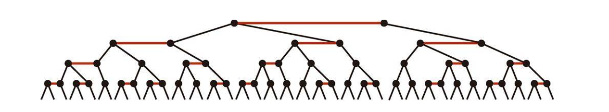

红黑树与 2-3 树的一一对应关系如下图。

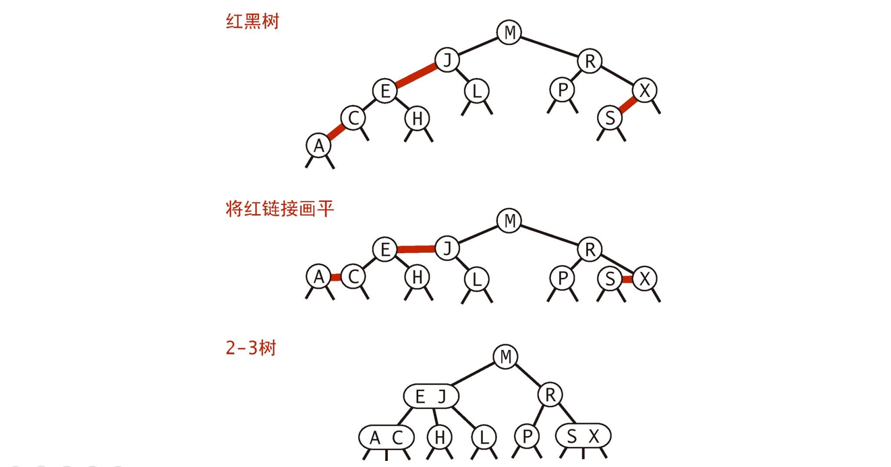


#### 颜色表示

我们在这里加入了一个**表示颜色的布尔变量**。这里的一个关键是**一个节点的颜色**指的是**指向这个节点的链接的颜色**。


结点类如下。

```java
private static final boolean RED = true;//定义RED为true
private static final boolean BLACK = false;
private Node root;
// 结点类
private class Node{
    // 键
    Key key;
    // 值
    Value value;
    // 这棵树的总结点数
    int N;
    // 左右子树
    Node left, right;
    // 父节点指向它的链接的颜色 
    boolean color; 

    Node(Key key, Value value,int N,boolean color){
        this.key = key;
        this.value = value;
        this.N = N;
        this.color = color;
    }
}
private boolean isRed(Node x){
    if (x==null) return false;
    return x.color == RED;
}
```


#### 旋转

旋转是一项非常重要的操作。我们在**不改变树的有序性**的情况下，将某个**红链接从左链接变成右链接**，或者从右链接变成左链接，这在处理一些情况比如对应于 2-3 树中向 3 节点**插入元素**的时候，更新整个树是很有用的。

旋转操作会改变红链接的指向。

1. **左旋转**

因为合法的**红链接**都为**左链接**，如果出现右链接为红链接，那么就需要进行左旋转操作。

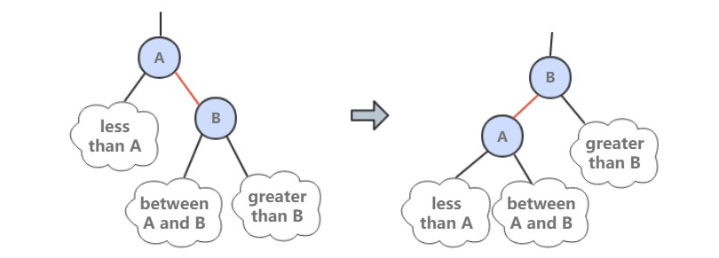


##### 2. 右旋转

进行**右旋转**是为了转换两个连续的**左红链接**，这会在之后的插入过程中探讨。

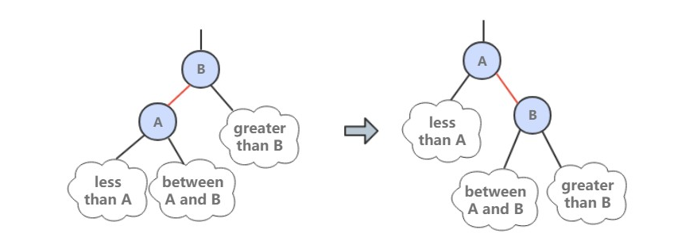

下面是左旋转 h 的右链接。

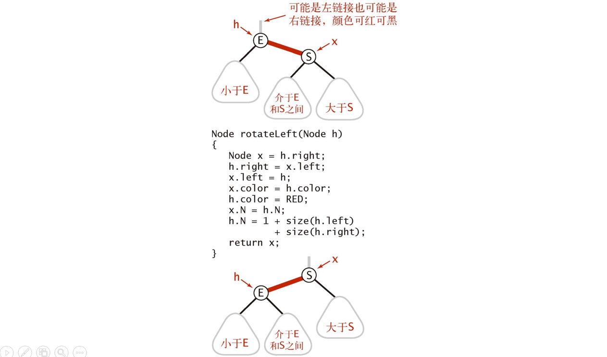

下面是右旋转 h 的左链接。

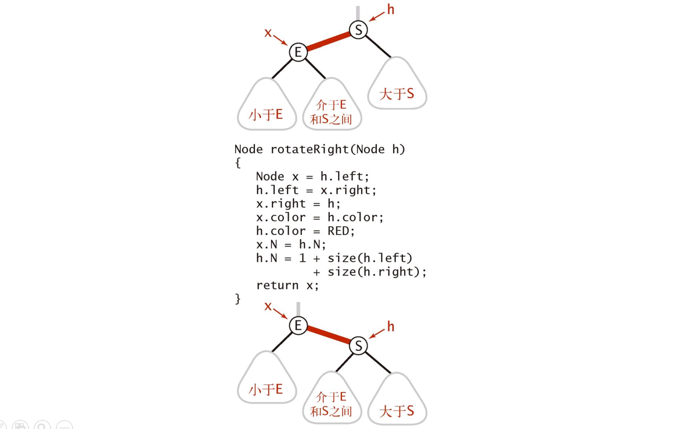

##### 3. 颜色转换

一个 4- 节点在红黑树中表现为一个节点的左右子节点都是红色的。分裂 4- 节点除了需要将子节点的颜色由红变黑之外，同时需要将父节点的颜色由黑变红，从 2-3 树的角度看就是将中间节点移到上层节点。


flipColors() 的操作

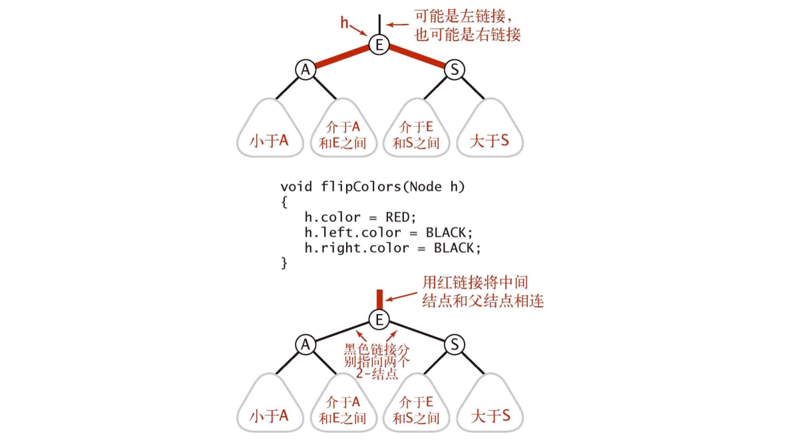

可以看出这个函数就对应于 2-3 树中将**中间元素插入父节点**的操作，因为它把原来的**两条红链接变成黑链接**，相当于**分裂**成了两个 2 节点，而中间元素因为颜色是**红**的，所以就加入了父节点。

**注意：根节点都是黑色的**。


#### 查找

红黑树的查找算法和二叉查找树的查找算法是完全一样的，也就是说，对于查找算法来说，红黑树中节点或者说链接的颜色是没有用到的，但是没有关系，虽然红黑树只是黑链接平衡，但是即使**不考虑颜色**的查找，整个树也不会出现像二叉树里面那种最极端的情况，所以性能依然是有保障的。

#### 插入

红黑树的插入的算法是比较复杂的，对于 2-3 树来说相对较简单，但是在具体实现的时候，每个 3 节点中是有着具体结构的，那么我们在插入后就要调节这些具体的结构，才能实现 2-3 树中的功能。

##### 向单个 2 节点插入新键

在 2-3 树中向 2 节点插入非常简单，直接**合并**成一个 3 节点就行。但是具体实现时，因为相对于父节点可能有大有小，那么在插入的时候就可能在父节点的左边或者右边，而**红链接只能是左链接**，那么当在**右边插入**的时候，**就需要进行旋转操作将右链接变成左链接**。

过程如下：

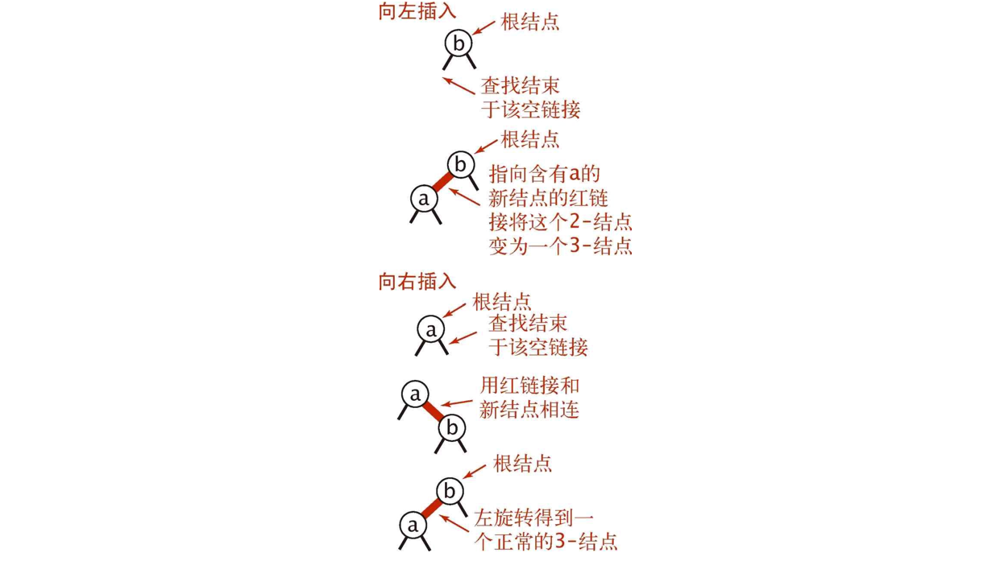


##### 向树底部的 2 节点插入新键

跟上述的过程类似，如果是在右边插入新键那么需要进行旋转操作，让红链接到左边。

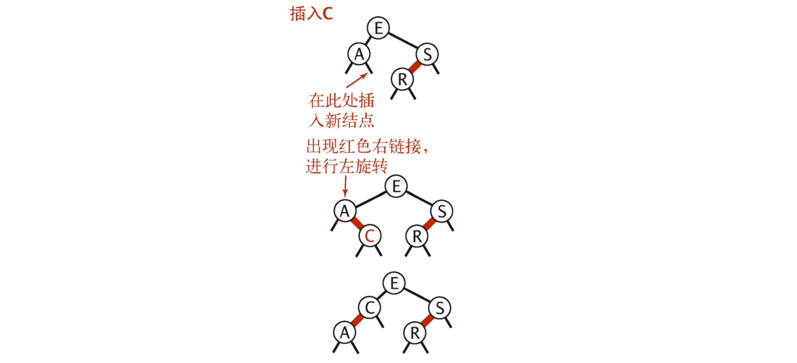


##### 向 3- 节点插入新键

向 3- 节点插入就更加复杂了，因为此时不仅有插入方向的问题，还有父节点也是红色的问题，我们要调整几个节点的结构，实现2-3树中将中间节点插入到父节点的操作。这里主要分三种情况。

###### 1 新键大于原树两个键

如果插入后一个节点的两个子节点都是红色的，那么我们通过 flipColors() 可以很容易的实现 2-3 树中将中间节点插入父节点，两边节点独立成两个 2 节点，同时保持有序性（这里默认中间节点是黑色的，因为默认在插入之前整个树是有序的，这个可以通过正确的插入来保证）。

###### 2 新键小于原树两个键

第二种情况下，需要先将第一个红链接进行右旋转，这样就变成了第一种情况，可以按照情况1 处理。

###### 3 新键介于原树两个键之间

第三种情况下，需要先将下面的红链接进行左旋转就变成了第二种情况，然后就可以按照第二种情况处理。

如下图所示。

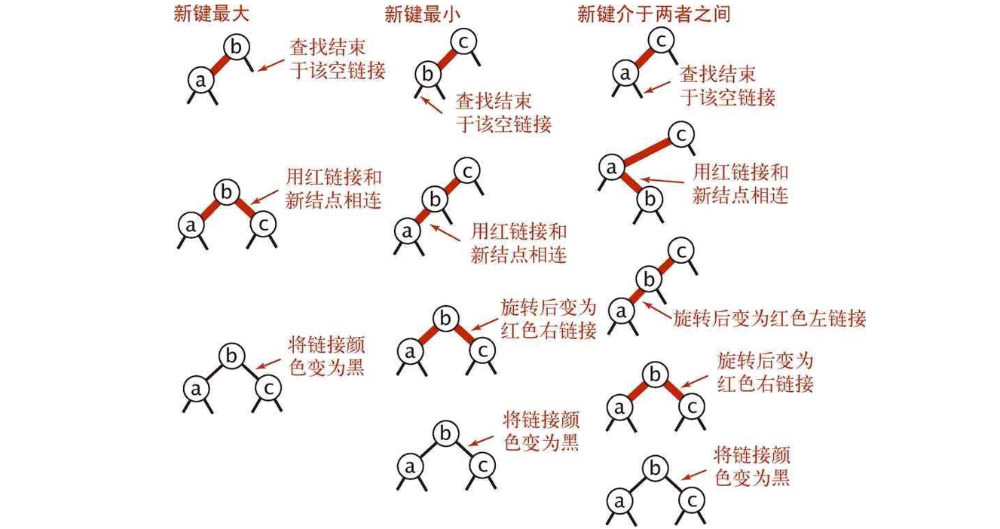


红黑树的插入代码

```java
public void put(Key key, Value value){
    root = put(root,key, value);
    //查找键值，找不到就新建一个
    root.color = BLACK;
}

private Node put(Node h, Key key, Value value){
    if (h==null) return new Node(key, value, 1, RED);
    int cmp = key.compareTo(h.key);
    if   (cmp<0) h.left = put(h.left, key, value);
    //递归查找
    else if   (cmp>0) h.right = put(h.right, key, value);
    else     h.value = value;

    if (isRed(h.right) && !isRed(h.left)) h=rotateLeft(h);
    if (isRed(h.left) && isRed(h.left.left)) h=rotateRight(h);
    if (isRed(h.left) && isRed(h.right))    flipColors(h);

    h.N = size(h.left)+size(h.right)+1;
    //更新走过的节点的N值
    return h;
}
```

这里面值得注意的一点就是那三行 if 条件句，因为是放在**递归**语句之后的，所以是相当于沿着树往下走到底或者找到相等值，处理完再返回的时候运行的，可以看到这三句刚好可以将**情况三处理**完成，同时也容易检验，这个语句是完全可以兼容前两种情况。所以不断再返回根节点的过程运行这三句，相当于 2-3 树中把可能的多余节点移到根节点的过程。最后树是平衡的。


插入操作总结：

- **如果右子节点是红色的而左子节点是黑色的，进行左旋转。**
- **如果左子节点是红色的且它的左子节点是红色的，进行右旋转。**
- **如果左右子节点均为红色，进行颜色转换。**

如下图所示。

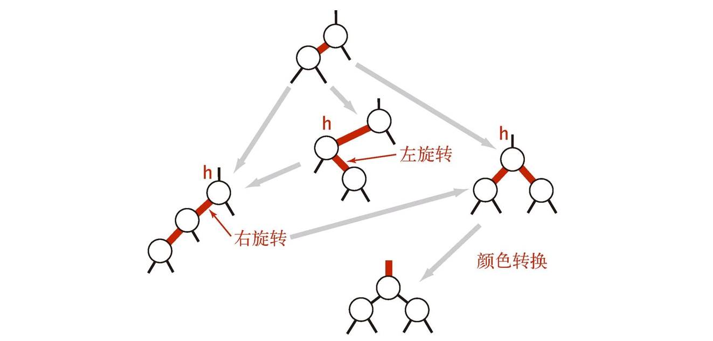

代码如下

```java
@Override
public void put(Key key, Value value) {
    root = put(root, key, value);
    root.color = BLACK;
}

private Node put(Node x, Key key, Value value) {
    if (x == null) {
        Node node = new Node(key, value, 1);
        node.color = RED;
        return node;
    }
    int cmp = key.compareTo(x.key);
    if (cmp == 0)
        x.val = value;
    else if (cmp < 0)
        x.left = put(x.left, key, value);
    else
        x.right = put(x.right, key, value);

    if (isRed(x.right) && !isRed(x.left))
        x = rotateLeft(x);
    if (isRed(x.left) && isRed(x.left.left))
        x = rotateRight(x);
    if (isRed(x.left) && isRed(x.right))
        flipColors(x);

    recalculateSize(x);
    return x;
}
```


#### 删除操作

删除比较麻烦，我们先考虑删除**最小值**，当我们删除一个 3- 节点中的元素的时候倒还好，直接删除之后留下了一个 2- 节点，树的平衡性没有发生变化。但是直接删除 2- 节点会造成树的高度的变化。所以，我们还是要处理一下，从上往下进行变换，最终的目标就是保证在删除的时候当前节点不只是一个 2- 节点。

##### 删除最小值

最小值在**最左边**，我们沿着左边下去的时候需要合并三个 2 节点形成一个 4- 节点，或者右边是三节点的话从右边节点**“借”**一个形成一个 3- 节点或者 4- 节点，这样就能保证当前节点大于 2- 节点。

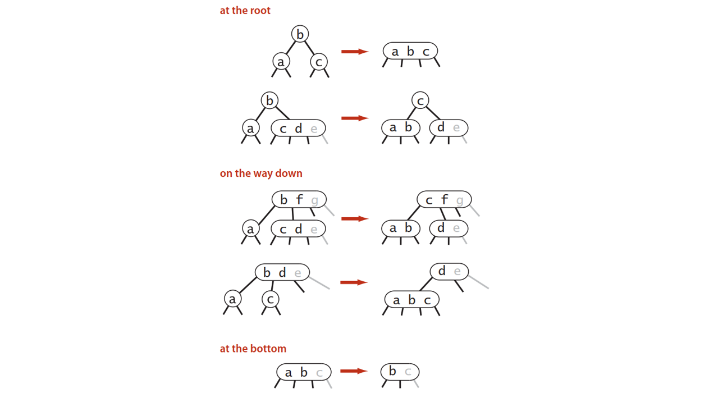

代码如下

```java
private Node moveRedLeft(Node h){ // 这个函数是用来处理2节点的
    flipColors(h); // 把上面的节点"拉下来"，形成一个大节点
    if (isRed(h.right.left)){//
        h.right = rotateRight(h.right);
        h = rotateLeft(h);
        flipColors(h); // 注意！！！《算法4》书中这一章的习题中的代码缺少这一行，这一行代表借了一个节点之后，再还一个给父节点。否则我们就连着兄弟节点一起变成一个大节点了。
    }
    return h;
}
public void delMin(){
    if (!isRed(root.left) && !isRed(root.right))
        root.color = RED;
    root = delMin(root);
    if (!isEmpty()) root.color = BLACK;
}
private Node delMin(Node h) {
    if (h.left == null) return null;
    // 意味着h的左子节点为一个2节点
    if (!isRed(h.left) && !isRed(h.left.left)) {
        h= moveRedLeft(h);
    }
    h.left= delMin(h.left);
    return balance(h);
}
```


#### 红黑树的性质

一颗大小为 N 的红黑树的高度**不会**超过 **2logN**。**最坏**的情况下是它所对应的 **2-3 树**，构成最左边的路径节点全部都是 3 节点而其余都是 2 节点。

红黑树大多数的操作所需要的时间都是**对数级别**的。


