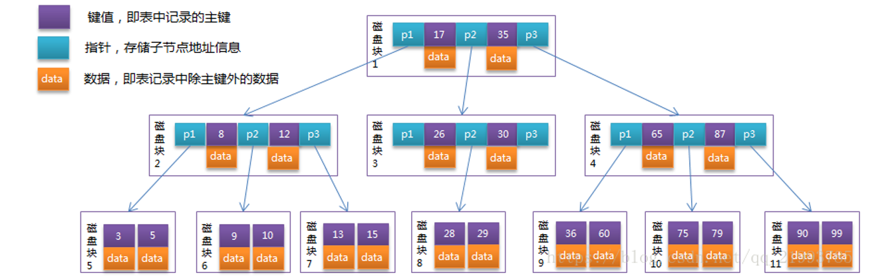
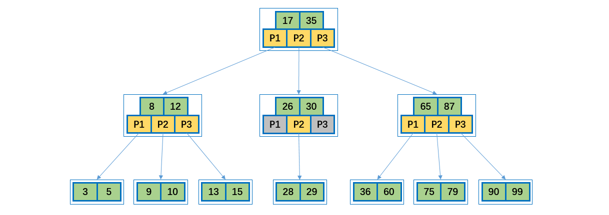
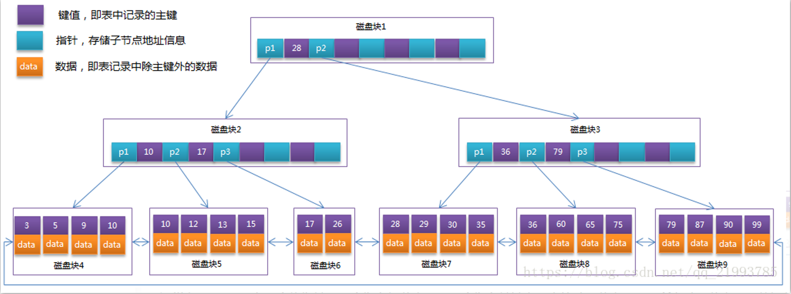
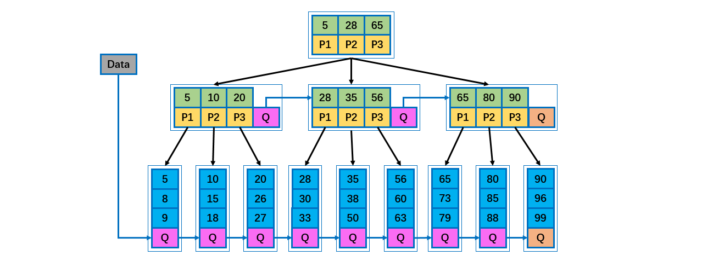

[TOC]

## B树

### 1 多路查找树

**为什么会有多路查找树树这种数据结构呢？是因为他的查询效果比平衡二叉树还高吗？**

其实不是的，实际上 2-3 树的查询时间复杂度也是为 **O(logN)** ，而出现这种多路查找树，主要是跟**内存与磁盘**交互有关。我们知道在内存 IO 的速度比磁盘 IO 要快的多的多，但是同样空间大小的内存比硬盘要贵的多的多，像 TB 级别的数据库不可能全部读出来放到内存中去，太过昂贵，而且也没必要，大部分数据是不经常用的，所以就需要**内存与外存互相结合**，而如果用平衡二叉树这种数据结构，在大数据量的情况下，树肯定会很高，此时查个数据对磁盘读个几千上万次那肯定是不行的（有人可能说把数据的索引文件全部放到内存中，然后把源数据放在硬盘中，这样在内存中定位到源数据 Id，然后去外存中取源数据，这样肯定是不行的，不要以为索引文件很小，像搜索引擎的倒排索引文件比源文件还要大），所以用多路查找树这种数据结构，高阶的情况下，树不用很高就可以标识很大的数据量了，检索次数就大大减少了，用这种数据结构去磁盘中存取数据，磁盘 IO 次数的次数也会很少。

二叉树的操作效率较高，但是也存在问题。比如对于数据库存储，在构建二叉树存储数据时，需要多次进行 i/o 操作(海量数据存在数据库或文件中)，节点海量，构建二叉树时，速度有影响。如果节点海量，也会造成二叉树的高度很大，会降低操作速度。

在二叉树中，每个节点有数据项，最多有两个子节点。如果允许每个节点可以有更多的数据项和更多的子节点，就是**多叉树**（multiway tree）。
2 - 3 树，2 - 3 - 4 树就是多叉树，多叉树通过重新组织节点，**减少树的高度**，能对二叉树进行优化。

B 树通过重新组织节点，降低树的高度，并且减少 IO 读写次数来提升效率。

文件系统及数据库系统的设计者利用了磁盘预读原理，将一个节点的大小设为等于一个页(页得大小通常为 4k)，这样每个节点只需要一次 I/O 就可以完全载入。
将树的度 M 设置为 1024，在 600 亿个元素中最多只需要 4 次 I/O 操作就可以读取到想要的元素, B 树广泛应用于文件存储系统以及数据库系统中。

 


### 2 B-Tree

B-Tree 就是我们常说的 B 树，一定不要读成 B 减树，否则就很丢人了。B 树这种数据结构常常用于实现**数据库索引**，因为它的查找效率比较高。

B-Tree 是为磁盘等外存储设备设计的一种**平衡查找树**。因此在讲 B-Tree 之前先了解下磁盘的相关知识。

系统从磁盘读取数据到内存时是以磁盘**块**（block）为基本单位的，位于同一个磁盘块中的数据会被一次性读取出来，而不是需要什么取什么。

InnoDB 存储引擎中有**页（Page）**的概念，页是其磁盘管理的最小单位。InnoDB 存储引擎中默认每个页的大小为16KB，可通过参数 innodb_page_size 将页的大小设置为 4K、8K、16K，在 MySQL 中可通过如下命令查看页的大小：

```mysql
 mysql> show variables like 'innodb_page_size';
```

而系统一个磁盘块的存储空间往往没有这么大，因此 InnoDB 每次申请磁盘空间时都会是若干地址连续磁盘块来达到页的大小 16KB。InnoDB 在把磁盘数据读入到磁盘时会以**页**为基本单位，在查询数据时如果一个页中的每条数据都能有助于定位数据记录的位置，这将会减少磁盘 I/O 次数，提高查询效率。
B-Tree 结构的数据可以让系统高效的找到数据所在的磁盘块。为了描述 B-Tree，首先定义一条记录为一个二元组[key, data] ，key 为记录的键值，对应表中的**主键值**，data 为一行记录中除主键外的**数据**。对于不同的记录，key 值互不相同。

一棵 M 阶的 B-Tree 有如下特性： 

1. 每个节点**最多有 M** 个孩子。 
2. 除了根节点和叶子节点外，其它每个节点**至少**有 Ceil(M/2) 个孩子。 
3. 若根节点不是叶子节点，则至少有 2 个孩子 。
4. 所有**叶子节点**都在**同一层**，且不包含其它关键字信息 。
5. 每个非终端节点包含 N 个关键字信息（P0, P1, … Pn,  k1, … kn） 。
6. 关键字的个数 N 满足：ceil(M/2)-1 <= N <= M - 1 。
7. ki(i = 1, … N)为关键字，且关键字升序排序。 
8. Pi(i = 1, … N)为指向子树根节点的指针。P(i - 1)指向的子树的所有节点关键字均小于 ki，但都大于 k( i - 1)。

说明：

- B 树的阶：节点的**最多子节点**个数。比如 2-3 树的阶是 3，2-3-4 树的阶是 4。
- B- 树的搜索，从根结点开始，对结点内的关键字（有序）序列进行**二分查找**，如果命中则结束，否则进入查询关键字所属范围的**儿子结点**；重复，直到所对应的儿子指针为空，或已经是叶子结点。
- 关键字集合分布在**整颗树**中, 即叶子节点和非叶子节点**都存放数据**。
- 搜索有可能在非叶子结点结束。
- 其搜索性能等价于在关键字**全集内**做**一次二分查找**。


#### B-Tree图示

B-Tree 中的每个节点根据实际情况可以包含大量的**关键字信息和分支**，如下图所示为一个 3 阶的 B-Tree（注：图中的 “磁盘块” 应修改为 “**页**”，因为 InnoDB 存储引擎中默认每个页的大小为 16KB，而磁盘块默认为 4KB，而B-/B+ 树**一个节点应该是一个页**）：



每个**节点**占用一个**盘**块的磁盘空间，一个节点上有两个升序排序的关键字和三个指向子树根节点的指针，指针存储的是**子节点**所在磁盘块的地址。两个关键词划分成的**三个范围域**对应三个指针指向的子树的数据的**范围域**。以根节点为例，关键字为 17 和 35，P1 指针指向的子树的数据范围为小于 17，P2 指针指向的子树的数据范围为17~35，P3 指针指向的子树的数据范围为大于 35。

**模拟查找关键字 29 的过程：**

- 根据根节点找到磁盘块 1，读入内存。【磁盘 I/O 操作第 1 次】
    比较关键字 29 在区间（17,35），找到磁盘块 1 的指针 P2。
- 根据 P2 指针找到磁盘块 3，读入内存。【磁盘 I/O 操作第 2 次】
    比较关键字 29 在区间（26,30），找到磁盘块 3 的指针 P2。
- 根据 P2 指针找到磁盘块 8，读入内存。【磁盘 I/O 操作第 3 次】
    在磁盘块 8 中的关键字列表中找到关键字 29。

分析上面过程，发现需要 3 次磁盘 I/O 操作，和 3 次内存查找操作。由于内存中的关键字是一个有序表结构，可以利用**二分法**查找提高效率。而 **3 次磁盘 I/O** 操作是影响整个 B-Tree 查找效率的**决定因素**。B-Tree 相对于AVLTree 缩减了节点个数，使每次磁盘 I/O 取到内存的数据都发挥了作用，从而提高了查询效率。

下图是另一个 B-Tree 图示。



**操作图示**

B 树的插入及平衡化操作和 2-3 树很相似，下面是往 B 树中依次插入下列数据的过程。

```java
6 10 4 14 5 11 15 3 2 12 1 7 8 8 6 3 6 21 5 15 15 6 32 23 45 65 7 8 6 5 4
```


**插入或者删除元素**都会导致节点发生**裂变反应**，有时候会非常麻烦，但正因为如此才让 B 树能够始终保持多路平衡，这也是 B 树自身的一个优势：**自平衡**；B 树主要应用于**文件系统**以及部分数据库索引，如 MongoDB，大部分关系型数据库**索引**则是使用 **B+ 树**实现。


### 3 B+Tree

B+Tree 是在 B-Tree 基础上的一种**优化**，使其更适合实现**外存储索引**结构，==**InnoDB 存储引擎就是用 B+Tree 实现其索引结构。**==

从上一节中的 **B-Tree** 结构图中可以看到**每个节点中不仅包含数据的 key 值，还有 data 值**。而每一个页的存储空间是有限的，如果 data 数据较大时将会导致每个节点（即一个页）能存储的 key 的数量很小，当存储的数据量很大时同样会导致 B-Tree 的深度较大，增大查询时的磁盘I/O次数，进而影响查询效率。

在 **B+Tree** 中，所有**==数据记录==节点都是按照键值大小顺序存放在==同一层的叶子节点==上，而非叶子节点上只存储 key 值信息**，这样可以大大**加大每个节点存储的 key 值数量**，降低 B+Tree 的**高度**。

B+Tree 相对于 B-Tree 有几点不同：

- B+Tree 非叶子节点只存储键值信息。
- B+Tree 所有叶子节点之间都有一个链指针。
- B+Tree 数据记录都存放在叶子节点中。

特性：

1. 有 n 棵子树的非叶子结点中含有 n 个关键字（ B 树是 n - 1 个），这些关键字**不保存数据**，只用来**索引**，所有**数据都保存在叶子节点**（B 树是**每个关键字都保存数据**）。
2. 所有的叶子结点中包含了全部关键字的信息，及指向含这些**关键字记录的指针**，且叶子结点本身依关键字的大小自小而大顺序链接。
3. 所有的**非叶子结点**可以看成是**索引部分**，结点中仅含其子树中的最大（或最小）关键字。
4. 通常在 B+ 树上有两个头指针，一个指向根结点，一个指向关键字最小的叶子结点。
5. 同一个数字会在不同节点中重复出现，**根节点**的最大元素就是 B+ 树的**最大元素**。

将上一节中的 B-Tree 优化，由于 B+Tree 的非叶子节点只存储键值信息，假设每个磁盘块能存储 4 个键值及指针信息，则变成 B+Tree 后其结构如下图所示：



通常在 B+Tree 上有**两个头指针**，一个指向**根节点**，另一个指向**关键字最小的叶子节点**，而且所有叶子节点（即数据节点）之间是一种**链式环结构**。因此可以对 B+Tree 进行**两种查找运算**：一种是对于**主键的范围查找和分页查找**，另一种是从**根节点开始进行随机查找**。

下图是 B+Tree 的另一个图示。


说明：

- B+ 树元素**自底向上**插入。

- B+ 树的搜索与 B 树也基本相同，**区别是 B+ 树只有达到叶子结点才命中**（B 树可以在非叶子结点命中），其性能也等价于在关键字全集做一次二分查找。
- 所有**关键字**都出现在**叶子结点**的链表中（即**数据只能在叶子节点**【也叫稠密索引】），且链表中的关键字(数据)恰好是**有序**的。
- B+ 树的特点是能够**保持数据稳定有序**，其插入与修改拥有较稳定的对数时间复杂度。 
- 不可能在非叶子结点命中。
- 非叶子结点相当于是叶子结点的索引（稀疏索引），叶子结点相当于是存储（关键字）数据的数据层。
- 更适合**文件索引**系统。
- B 树和 B+ 树各有自己的应用场景，不能说 B+ 树完全比 B 树好，反之亦然。


#### B+Tree 与数据库

可能上面例子中只有 22 条数据记录，看不出 B+Tree 的优点，下面做一个推算：

InnoDB 存储引擎中页的大小为 16KB，一般表的主键类型为 INT（占用4个字节）或 BIGINT（占用8个字节），指针类型也一般为 4 或 8个字节，也就是说一个**页**（B+Tree中的一个节点）中大概存储 16KB/(8B+8B) = 1K 个**键值**（因为是估值，为方便计算，这里的 K 取值为10^3^）。也就是说一个深度为 3 的 B+Tree 索引可以维护10^3 * 10^3 * 10^3 = 10亿 条记录。

实际情况中每个节点可能不能填充满，因此在数据库中，B+Tree 的高度一般都在 2 ~ 4 层。MySQL 的 InnoDB 存储引擎在设计时是将**根节点常驻内存**的，也就是说查找某一键值的行记录时最多只需要 1~3 次磁盘 I/O 操作。

数据库中的 B+Tree 索引可以分为**聚集索引**（clustered index）和**辅助索引**（secondary index）。上面的 B+Tree 示例图在数据库中的实现即为聚集索引，聚集索引的 B+Tree 中的叶子节点存放的是**整张表的行记录数据**。辅助索引与聚集索引的区别在于辅助索引的叶子节点并不包含行记录的全部数据，而是存储相应行数据的聚集索引键，即主键。当通过辅助索引来查询数据时，InnoDB 存储引擎会遍历辅助索引找到主键，然后再通过主键在聚集索引中找到完整的行记录数据。


### 4 B* 树

B* 树是 B+ 树的变体，在 B* 树的**非根和非叶子结点**再增加**指向兄弟**的指针。

- B* 树定义了非叶子结点关键字个数至少为 (2/3) * M，即块的最低使用率为 2 / 3，而 B+ 树的块的最低使用率为B+ 树的1/2。

- B* 树分配新结点的概率比 B+ 树要低，**空间使用率更高**。




**参考资料**

- https://blog.csdn.net/qq_21993785/article/details/80576642
- B-Tree与二叉查找树的对比 http://m.elecfans.com/article/662237.html


