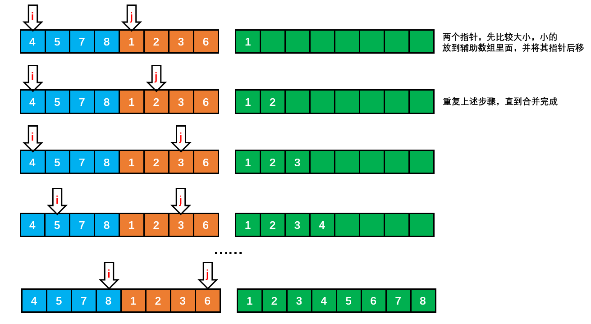
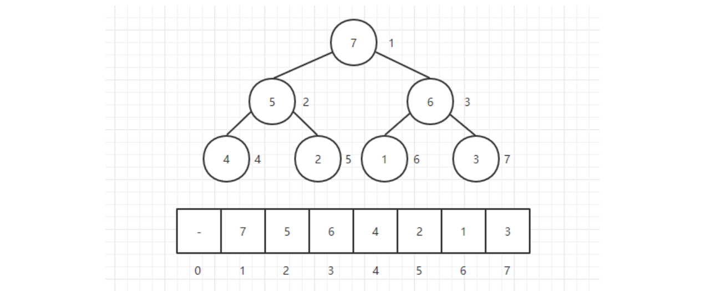
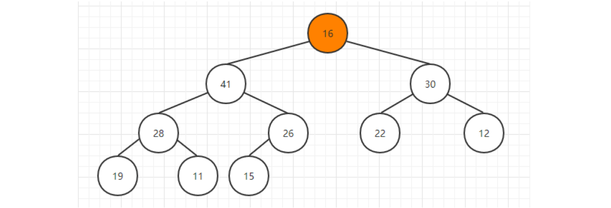

## 排序

#### 基础

##### 1. 约定

待排序的元素需要实现 Java 的 **Comparable 接口**，该接口有 **compareTo()** 方法，可以用它来判断两个元素的大小关系。

约定都是**基于比较**的排序。

使用**辅助函数 less() 和 swap() 来进行比较和交换**的操作，使得代码的可读性和可移植性更好。

排序算法的成本模型是==比较和交换的次数==。

```java
public abstract class Sort<T extends Comparable<T>> {

    public abstract void sort(T[] nums);

    // 比较
    protected boolean less(T v, T w) {
        return v.compareTo(w) < 0;
    }

    // 交换
    protected void swap(T[] a, int i, int j) {
        T t = a[i];
        a[i] = a[j];
        a[j] = t;
    }
}
```

##### 2. 相关术语

- **稳定**：如果 a 原本在 b 前面，而 a = b，排序之后 a 仍然在 b 的前面；如果排序算法不改变**相等对象**的相对次序，则成为**稳定的**。
- **不稳定**：如果 a 原本在 b 的前面，而 a = b，排序之后 a 可能会出现在 b 的后面；
- **内排序**：所有排序操作都在内存中完成；
- **外排序**：由于数据太大，因此把数据放在磁盘中，而排序通过磁盘和内存的数据传输才能进行；
- 时间复杂度：一个算法执行所耗费的时间。
- 空间复杂度：运行完一个程序所需内存的大小。
- In-place:  不占用额外内存
- Out-place: 占用额外内存

##### 3. 相关定理

- N 个互异数的数组的平均逆序数是 ***N(N - 1) / 4***。
- 通过**交换相邻元素**进行排序的任何算法平均都需要 **Ω(N^2^)** 时间。
- 只使用**元素间比较**的任何排序算法均需要 **Ω(N log N)** 次比较。
- 对任何基于**比较**的算法，找**最小元**都必须至少用 N - 1 次比较。 
- 平均来说，基于**切分**的选择算法的运行时间是**线性**级别的。

##### 4. 排序算法总结

- **快速排序是最快的通用排序算法**。---《算法第 4 版》

**排序算法的比较**

|       算法       | 稳定性 |          时间复杂度          | 空间复杂度 |           备注           |
| :--------------: | :----: | :--------------------------: | :--------: | :----------------------: |
|     选择排序     |   ×    |        N<sup>2</sup>         |     1      |                          |
|     冒泡排序     |   √    |        N<sup>2</sup>         |     1      |                          |
|     插入排序     |   √    |      N \~ N<sup>2</sup>      |     1      | 时间复杂度和初始顺序有关 |
|     希尔排序     |   ×    | N 的若干倍乘于递增序列的长度 |     1      |      改进版插入排序      |
|     快速排序     |   ×    |            NlogN             |    logN    |                          |
| 三向切分快速排序 |   ×    |          N \~ NlogN          |    logN    |   适用于有大量重复主键   |
|     归并排序     |   √    |            NlogN             |     N      |                          |
|      堆排序      |   ×    |            NlogN             |     1      |    无法利用局部性原理    |
|     基数排序     |   √    |             N*k              |            |        空间换时间        |

**原地排序**：选择排序、插入排序、希尔排序、快速排序、三向快速排序、堆排序

**非原地排序**：归并排序。


快速排序是最快的通用排序算法，它的内循环的指令很少，而且它还能利用缓存，因为它总是顺序地访问数据。它的运行时间近似为 \~cNlogN，这里的 c 比其它线性对数级别的排序算法都要小。

使用三向切分快速排序，实际应用中可能出现的某些分布的输入能够达到线性级别，而其它排序算法仍然需要线性对数时间。

##### 5.**Java的排序算法实现**

Java 主要排序方法为 java.util.Arrays.**sort**()，对于**基本数据类型**使用三向切分的**快速排序**，对于**引用类型**使用**归并排序**。


#### 选择排序

从未排序的数组中**选择最小元素**，将它与数组的**第一个元素交换位置**。再从数组剩下的元素中选择出最小的元素，将它与数组的第二个元素交换位置。不断进行这样的操作，直到将整个数组排序。

选择排序需要 \~**N<sup>2</sup>/2 次比较和 \~N 次**交换，它的运行时间与输入无关，这个特点使得**它对一个已经排序的数组也需要这么多的比较和交换操作。**


```java
/**
     * 自己实现的选择排序
     *
     * @param array 数组
     */
public static void selectionSort(int[] array) {
    // Base case
    if (array == null || array.length < 2) {
        return;
    }
    // 直接假设第一个是最小的元素，然后跟后面的逐一比较，如果更小则交换
    for (int i = 0; i < array.length; i++) {
        // 从当前元素起找后面的元素
        for (int j = i; j < array.length; j++) {
            if (array[i] > array[j]) {
                swap(array, i, j);
            }
        }
    }
}

public static void main(String[] args) {
    int[] array = {3, 5, 2, 9, 9, 10, 7, 4, 6, 8, 1};
    selectionSort(array);
    System.out.println(Arrays.toString(array));
}

public static void swap(int[] arr, int i, int j) {
    int tmp = arr[i];
    arr[i] = arr[j];
    arr[j] = tmp;
}
```

需要 O(n^2^) 次比较和 O(n) 次交换。**平均**时间复杂度是 O(n^2^)。最优时，**最坏时和平均时都是O(n^2^)**。


#### 冒泡排序

从左到右**不断交换相邻逆序**的元素，在一轮的循环之后，可以让未排序的最大元素**上浮到右侧**。

在一轮循环中，如果没有发生交换，那么说明数组已经是有序的，此时可以直接退出。


```java
public static void bubbleSort(int[] array) {
    // Base case
    if (array == null || array.length < 2) {
        return;
    }
    // 从尾部开始遍历
    for (int end = array.length - 1; end > 0; end--) {
        // 从前开始
        for (int i = 0; i < end; i++) {
            // 不断比较前一个值大于后一个
            if (array[i] > array[i + 1]) {
                // 如果前一个值大于后一个则交换两者位置
                swap(array, i, i + 1);
            }
        }
    }
}
```

平均复杂度为 O(N^2)，如果是有序数组，那么最好时间复杂度为 O(N)，最坏就是顺序是反着的，此时复杂度为 O(N^2)。 

 

#### 插入排序

每次都将当前元素插入到**左侧已经排序**的数组中，使得插入之后左侧数组**依然有序**。

对于数组 {3, 5, 2, 4, 1}，它具有以下**逆序**：(3, 2), (3, 1), (5, 2), (5, 4), (5, 1), (2, 1), (4, 1)，插入排序每次**只能交换相邻元素**，令**逆序数量减少 1**，因此插入排序需要**==交换的次数为逆序数量==**。

插入排序的时间复杂度取决于数组的**初始顺序**，如果数组已经部分有序了，那么逆序较少，需要的交换次数也就较少，时间复杂度较低。

- **平均**情况下插入排序需要 \~N<sup>2</sup>/4 比较以及 \~N<sup>2</sup>/4 次交换；
- **最坏**情况下需要 \~N<sup>2</sup>/2 比较以及 \~N<sup>2</sup>/2 次交换，最坏的情况是数组是**倒序**的；
- **最好**情况下需要 N-1 次比较和 0 次交换，最好的情况就是数组已经**有序**了。

插入排序的效率最优时是 O(n)，**最坏时是 O(n^2^)**，数组越接近有序，需要做的工作越少。


上述是插入排序流程。分成了**有序和无序两部分**，在比较时，需要将有序部分数组**右移**，为插入腾出空间。

当 10 插入到 6 和 11 之间 时，需要将 6 往右移动才有空间给 10.

```java
/**
 * 插入排序
 */
public class InsertSort {
    public static void insertSort(int[] a) {
        
        int length = a.length;
        // 只有一个元素时不操作
        if (length <= 1) {
            return;
        } else {
            // insertNote为要插入的数据
            int i, j, insertNote;
            // 从数组的第二个元素开始循环将数组中的元素插入
            for (i = 1; i < a.length; i++) {
                // 设置数组中的第2个元素为第一次循环要插入的数据
                insertNote = a[i];
                j = i - 1;
                while (j >= 0 && insertNote < a[j]) {
                    // 如果要插入的元素小于第j个元素,就将第j个元素向后移动
                    a[j + 1] = a[j];
                    j--;
                }
                // 直到要插入的元素不小于第j个元素,将insertNote插入到数组中
                a[j + 1] = insertNote;
            }
        }
    }
    
	// 测试
    public static void main(String[] args) {
        int a[] = { 38,65,97,76,13,27,49 };
        insertSort(a);
        System.out.println(Arrays.toString(a));
    }
} 
```

简单的版本。

```java
public static void insertionSort(int[] array) {
    // Base case
    if (array == null || array.length < 2) {
        return;
    }
    // 从第一个开始遍历
    for (int i = 1; i < array.length; i++) {
        for (int j = i - 1; j >= 0 && array[j] > array[j + 1]; j--) {
            swap(array, j, j + 1);
        }
    }
}

public static void swap(int[] arr, int i, int j) {
    arr[i] = arr[i] ^ arr[j];
    arr[j] = arr[i] ^ arr[j];
    arr[i] = arr[i] ^ arr[j];
}
```


#### 希尔排序

##### 1. 概述

简单插入排序的问题：

数组 arr = {2, 3, 4, 5, 6, 1} 这时需要插入的**数 1**(最小), 这样的过程是：

```java
{2,3,4,5,6,6}
{2,3,4,5,5,6}
{2,3,4,4,5,6}
{2,3,3,4,5,6}
{2,2,3,4,5,6}
{1,2,3,4,5,6}
```

**结论**：当需要插入的数是较小的数时，后移的次数明显增多，对效率有影响。

希尔排序也是一种**直接插入**排序，只是是对直接插入排序算法的**优化。**

对于**大规模**的数组，插入排序很慢，因为它只能交换**相邻**的元素，每次**只能将逆序数量减少 1**。希尔排序的出现就是为了解决插入排序的这种局限性，它通过**交换不相邻的元素，每次可以将逆序数量减少大于 1**。希尔排序也是一种插入排序，它是简单插入排序经过改进之后的一个更高效的版本，也称为==**缩小增量排序**==。

**希尔排序使用==插入排序==对==间隔 h 的序列进行排序==。通过不断==减小 h，最后令 h = 1==，就可以使得整个数组是有序的**。

##### 2. 增量序列

来看下希尔排序的基本步骤，在此我们**选择增量 gap = length / 2，缩小增量继续以 gap = gap / 2的方式**，这种增量选择我们可以用一个**序列**来表示：

```java
n/2, (n/2)/2, ..., 1
```

这称为**增量序列**。

希尔排序的增量序列的选择与证明是个数学难题，我们选择的这个增量序列是比较常用的，也是希尔建议的增量，称为**希尔增量**，但其实这个增量序列**不是最优**的。此处我们做示例使用**希尔增量**。

可以证明采用希尔增量时**最坏情况**下运行时间是 **O(n^2^)**。

Hibbard 提出一个**不同的增量序列**，形如：

```java
1, 3, 7, ..., 2^k-1 
```

可以证明采用 Hibbard 增量时**最坏情况**下运行时间是 **O(n^1.5^)**。

采用其他的增量序列还可能降低最坏运行时间。

##### 3. 图解

初始增量步长 **gap = length / 2**，意味着整个数组被分为 5 组，如下图颜色分别对应。然后在各自组内进行插入排序。第二次 gap = 5 / 2 = 2，所以数组被分为 2 组，如颜色对应所示，再对两组分别进行直接插入排序，使得整体更加有序，最后再缩小增量 gap = 2 / 2 = 1，此时**再次进行插入排序**就很快了。


在希尔排序的理解时，我们倾向于对于**每一个分组**，逐组进行处理，但在代码实现中，我们可以不用这么按部就班地处理完一组再调转回来处理下一组（这样还得加个 for 循环去处理分组）比如 [5, 4, 3, 2, 1, 0] ，首次增量设 gap = length / 2 = 3,则为 3 组 [5, 2] [4, 1] [3, 0]，实现时不用循环按组处理，我们可以从第 gap 个元素开始，逐个跨组处理。同时在插入数据时，可以采用元素交换法寻找最终位置，也可以采用数组元素移动法寻觅。

##### 4. 代码实现

希尔排序的代码比较简单，如下，采用的是交换法。

```java
/**
 * 希尔排序 针对有序序列在插入时采用交换法
 * @param arr
 */
public static void sort(int []arr){
    // 增量gap，并逐步缩小增量
    for(int gap = arr.length / 2; gap > 0; gap /= 2){
        // 从第gap个元素，逐个对其所在组进行直接插入排序操作
        for(int i = gap; i < arr.length; i++){
            int j = i;
            while(j - gap >= 0 && arr[j] < arr[j - gap]){
                // 插入排序采用交换法
                swap(arr, j, j - gap);
                j -= gap;
            }
        }
    }
}
```

以下是《数据结构与算法分析》的实现方法。这种方法可以**避免显式的进行交换**操作。

```java
/**
 * 希尔排序
 * 
 * @param array 待排序数组
 * @param <AnyType> 泛型类型
 */
public static <AnyType extends Comparable<? super AnyType>> void shellSort(AnyType[] array) {
    int j;

    for(int gap = array.length / 2; gap > 0; gap /= 2) {
        for(int i = gap; i < array.length; i++) {
            AnyType tmp = array[i];
            for(j = i; j >= gap && tmp.compareTo(array[j - gap]) < 0; j -= gap) {
                array[j] = array[j - gap];
            }
            array[j] = tmp;
        }
    }
}
```

2) 希尔排序时， 对有序序列在插入时**采用移位法**, 并测试排序速度，发现快了许多。合理可用。

```java
/**
 * 希尔排序
 * 有序序列在插入时采用移位法 可用
 * 
 * @param arr 待排序数组
 */
public static void shellSort2(int[] arr) {

    // 增量gap, 并逐步的缩小增量
    for (int gap = arr.length / 2; gap > 0; gap /= 2) {
        // 从第gap个元素，逐个对其所在的组进行直接插入排序
        for (int i = gap; i < arr.length; i++) {

            int j = i;
            int temp = arr[j];
            if (arr[j] < arr[j - gap]) {
                while (j - gap >= 0 && temp < arr[j - gap]) {
                    // 移动
                    arr[j] = arr[j - gap];
                    j = j - gap;
                }
                // 当退出while后，就给temp找到插入的位置
                arr[j] = temp;
            }
        }
    }
}
```

希尔排序的运行时间达不到平方级别，使用递增序列 1, 4, 13, 40, ...  的希尔排序所需要的比较次数不会超过 N 的若干倍乘于递增序列的长度。后面介绍的高级排序算法只会比希尔排序快两倍左右。

**希尔排序的效率**

调整间隔能改善其效率，一般是**避免间隔 gap 是偶数值**。因为当 gap 是偶数时的比较会在增量是 gap / 2 的下一题排序中**重复**。在此种情况下，当 gap 为偶数时，只需将其加 1 。即可将最坏情形改进为 O(n^1.5^)。

一般增量序列时，最佳复杂度：T(n) = O(**nlogn**)。最坏情况：T(n) = O(n)。平均情况：T(n) = O(nlogn)。

##### 5. 优化

> 如何优化希尔排序？

- 优化增量序列。采用其他的增量序列还可能降低最坏运行时间。
- 因为是基于**插入排序**的，所以可以使用其插入排序及其优化中给出的优化方案。即：进行了预处理操作，并在内循环中，总是将**较大的元素向右移动**。原方案是交换。


#### 归并排序

##### 1. 概述

归并排序的思想是将数组分成**两部分**，分别进行排序，然后归并起来。基本操作就是**合并两个已排序的数组**，由于两个数组是已经排序的，所以若将**输出放到==第三个==数组**中，则该算法可以通过对输入数据**一趟排序**完成。

归并排序是一种**分治**策略。


将两个**数组合并**起来的步骤如下图所示，即维护**两个指针**分别指向两个有序的数组，然后分别比较两者的值，**值小的拷贝到辅助数组**里面，并将此索引进行移动，直到某一边全部移动完毕，然后把**剩余的没有复制完成的全部拷贝**到辅助数组（如下图中 1 2 3 6 全部拷贝到辅助数组中后，左边还剩下 7、8），最后把辅助数组**拷贝到原数组**即可。



维护**两个指针**分别比较，然后将较小的项复制到**第三个数组**中， 因此需要额外的**辅助数组**，会消耗**内存**空间。

一般使用递归归并排序，逐层排序。真正的排序发生在**合并步骤**而不是递归调用的步骤。8 个数据会 merge 7 次，80000 个数据会 merge 8000 - 1 = 79999 次。

##### 2. 代码实现

以下是归并排序的算法，类似于树的后序遍历，即先处理左右再进行数据处理。

```java
/**
 * 归并排序 对外暴露的接口
 *
 * @param array 数组
 */
public static void mergeSort(int[] array) {
    // Base case
    if (array == null || array.length < 2) {
        return;
    }
    mergeSort(array, 0, array.length - 1);
}

/**
 * 归并排序 内部排序接口
 *
 * @param array 数组
 */
private static void mergeSort(int[] array, int left, int right) {
    // Base case
    if (left == right) {
        return;
    }
    // 寻找中间值等价于 mid = (left + right) / 2
    int mid = left + ((right - left) >> 1);
    mergeSort(array, left, mid);
    mergeSort(array, mid + 1, right);
    // 对两部分进行合并
    merge(array, left, mid, right);
}

/**
     * 使用外排的方式合并两个已经排序的数组
     *
     * @param array 整个数组
     * @param left 左
     * @param mid 中
     * @param right 右
     */
private static void merge(int[] array, int left, int mid, int right) {
    // 定义一个辅助数组用于外排
    int[] temp = new int[right - left + 1];
    int i = 0;
    int pointer1 = left;
    int pointer2 = mid + 1;
    // 不断复制左右两个数组中较小的元素到辅助数组中
    while (pointer1 <= mid && pointer2 <= right) {
        // 这句很6啊
        temp[i++] = array[pointer1] < array[pointer2] ? array[pointer1++] : array[pointer2++];
    }
    // 此时说明已经其中有一个数组越界了
    while (pointer1 <= mid) {
        temp[i++] = array[pointer1++];
    }
    while (pointer2 <= right) {
        temp[i++] = array[pointer2++];
    }
    // 将辅助数组元素复制回原数组
    for (i = 0; i < temp.length; i++) {
        array[left + i] = temp[i];
    }
}
```

##### 3. **归并排序效率**

归并排序在**所有情形下**都是 **O(NlogN)** 的，其缺点是需要临时辅助数组进行**合并**。归并排序是**稳定**的。merge 过程是不管是否有序的。

归并排序的运行时间严重依赖于比较元素和在数组中移动位置的相对开销，这些开销是与**编程语言**相关的。

归并排序是一种渐进最优的基于比较排序的算法。

> 如何优化归并排序？

对于**小规模**的子数组可以采用**插入排序**。


#### **快速排序**

##### 1. 基本算法

- 快排是对冒泡排序的改进。

- 它的平均运行时间是 ==***O(N log N)***==。最坏情形是***O(N^2^)***。
- 快排也是一种**分治**的递归算法。
- 快速排序是一种**原地排序**算法。
- 归并排序将数组分为**两个子数组**分别排序，并将有序的子数组归并使得整个数组排序；
- 快速排序通过一个==**切分枢轴元**（pivot）==将数组分为两个子数组，==左子数组**小于等于**切分元素==，右子数组大于等于切分元素，将这两个子数组排序也就将整个数组排序了。

##### 2. 枢轴元的选取

十分重要，直接影响排序的**时间**。

一种较为安全的做法是**随机选取**枢轴元。

更为保险的做法是选取**左端、右端以及中间三个元素**，并取其**中值**作为枢轴元。称为**三数中值分割法**。

可以用下面的随机选

```java
pivot = left + (int) (Math.random() * (right - left + 1))
```


代码实现：以下是左神算法班版本。实现过程图解参考：https://blog.csdn.net/u010452388/article/details/81218540

```java
// 对外暴露的方法
public static void quickSort(int[] array) {
    // Base case
    if (array == null || array.length < 2) {
        return;
    }
    // 传入待排数组和两个边界
    quickSort(array, 0, array.length - 1);
}

private static void quickSort(int[] array, int left, int right) {
    // 仅在没有越界的情况下进行
    if (left < right) {
        // 将pivot放到最末尾的位置
        // 每次随即选一个数与最后一个数交换进行快排 随机快排
        swap(array, left + (int) (Math.random() * (right - left + 1)), right);
        // //此数组长度永远为2,p[0]为等于区的左边界，p[1]为等于区的右边界
        int[] p = partition(array, left, right);
        // 将分出来的小于区重复上面的动作
        quickSort(array, left, p[0] - 1);
        // 将分出来的大于区重复上面的动作
        quickSort(array, p[1] + 1, right);
    }
}

/**
 * 对数组进行切分成三部分，最后返回等于的范围
 *
 * @param array 数组
 * @param left 左
 * @param right 右
 * @return 等于的范围
 * 总有一个等于pivot的位置，就是等于pivot自身
 * 返回等于区域(左边界，右边界), 所以返回一个长度为2的数组res, res[0] res[1]
 */
public static int[] partition(int[] array, int left, int right) {
    // 声明一个小于区的索引
    int less = left - 1;
    // 声明一个大于区的索引
    int more = right;
    // left 表示当前数的位置   arr[R]->划分值
    while (left < more) {
        // 小于pivot值
        if (array[left] < array[right]) {
            swap(array, ++less, left++);
            // 大于pivot值
        } else if (array[left] > array[right]) {
            swap(array, --more, left);
        } else {
            // 等于pivot值
            left++;
        }
    }
    // 如果index索引与more相遇，则退出循环，并且right位置数与more位置数交换
    swap(array, more, right);
    // 用来记录等于区的左边界和右边界对应的索引
    return new int[] {less + 1, more};
}

public static void swap(int[] array, int i, int j) {
    int tmp = array[i];
    array[i] = array[j];
    array[j] = tmp;
}
```

以下是另一个版本：

```java
public class QuickSort {
    public static void main(String[] args) {
        int[] arr = {5, 1, 7, 3, 1, 6, 9, 4};
        quickSort(arr, 0, arr.length - 1);
        for (int i : arr) {
            System.out.print(i + "\t");
        }
    }

    /**
     * @param arr        待排序列
     * @param leftIndex  待排序列起始位置
     * @param rightIndex 待排序列结束位置
     */
    private static void quickSort(int[] arr, int leftIndex, int rightIndex) {
        // Base case
        if (leftIndex >= rightIndex) {
            return;
        }
		
        int left = leftIndex;
        int right = rightIndex;
        // 待排序的第一个元素作为基准值
        int key = arr[left];

        // 从左右两边交替扫描，直到left = right
        while (left < right) {
            while (right > left && arr[right] >= key) {
                // 从右往左扫描，找到第一个比基准值小的元素
                right--;
            }

            // 找到这种元素将arr[right]放入arr[left]中
            arr[left] = arr[right];

            while (left < right && arr[left] <= key) {
                //从左往右扫描，找到第一个比基准值大的元素
                left++;
            }

            // 找到这种元素将arr[left]放入arr[right]中
            arr[right] = arr[left];
        }
        // 基准值归位
        arr[left] = key;
        // 对基准值左边的元素进行递归排序
        quickSort(arr, leftIndex, left - 1);
        // 对基准值右边的元素进行递归排序。
        quickSort(arr, right + 1, rightIndex);
    }
}
```

##### 3. 性能分析

快速排序是**原地排序**，**不需要辅助数组，但是==递归调用==需要辅助栈**。

快速排序**最好情况**下是每次都正好将数组**对半分**，这样递归调用次数才是最少的。这种情况下比较次数为 C<sub>N</sub>=2C<sub>N/2</sub>+N，复杂度为 **O(NlogN)**。

可以证明**平均情况**也是 **O(NlogN)**。

**最坏情况**下，第一次从最小的元素切分，第二次从第二小的元素切分，如此这般。因此**最坏**的情况下需要比较 N<sup>2</sup>/2，此时复杂度是 **O(N^2^)**。为了防止数组最开始就是有序的，在**进行快速排序时需要随机打乱数组**。

综上：平均 **O(NlogN)**，最好 **O(NlogN)**，最坏 **O(N^2^)**。

##### 4. 快速排序算法改进

**1. 切换到插入排序**

因为快速排序在小数组中也会递归调用自己，对于**小数组（小于 20 项），插入排序比快速排序的性能更好**，因此在**小数组**中可以切换到插入排序。

**2. 三数取中**

最好的情况下是每次都能取数组的中位数作为切分元素，但是计算中位数的代价很高。一种折中方法是取第一项、中间项和最后一项 3 个元素，并将大小居中的元素作为切分元素。

**3. 三向切分**

对于有**大量重复元素**的数组，可以将数组切分为**三部分**，分别对应**小于、等于和大于切分元素**。

**三向切分快速排序**对于有**大量重复元素**的随机数组可以在线性时间内完成排序。

```java
public class ThreeWayQuickSort<T extends Comparable<T>> extends QuickSort<T> {

    @Override
    protected void sort(T[] nums, int l, int h) {
        if (h <= l) {
            return;
        }
        int lt = l, i = l + 1, gt = h;
        T v = nums[l];
        while (i <= gt) {
            int cmp = nums[i].compareTo(v);
            if (cmp < 0) {
                swap(nums, lt++, i++);
            } else if (cmp > 0) {
                swap(nums, i, gt--);
            } else {
                i++;
            }
        }
        sort(nums, l, lt - 1);
        sort(nums, gt + 1, h);
    }
}
```

##### 5. 快排应用

###### 基于切分的快速选择算法

**求一个数组的第 k 大元素，可以使用堆排序，也可以使用基于快排思想的快速选择算法**。

快速排序的 partitionSort() 方法，会返回一个整数 j 使得 a[l..j-1] 小于等于 a[j]，且 a[j+1..h] 大于等于 a[j]，此时 a[j] 就是数组的第 j 大元素。

可以利用这个特性**找出数组**的**第 k 个元素**。

该算法是线性级别的，假设每次能将数组二分，那么比较的总次数为 (N+N/2+N/4+..)，直到找到第 k 个元素，这个和显然小于 2N。

```java
public T select(T[] nums, int k) {
    int l = 0, h = nums.length - 1;
    while (h > l) {
        int j = partition(nums, l, h);

        if (j == k) {
            return nums[k];

        } else if (j > k) {
            h = j - 1;

        } else {
            l = j + 1;
        }
    }
    return nums[k];
}
```

Java 中的 Array 类的 **sort 方法**使用**快速排序**对**基本类型的数组**进行升序排序。


#### 堆与堆排序与优先队列

##### 1. 概述

**优先队列**有多种实现方法，对比如下表。

|  数据结构  |  插入元素  | 删除最大元素 |
| :--------: | :--------: | :----------: |
|  有序数组  |     N      |      1       |
|  无序数组  |     1      |      N       |
| **二叉堆** | ***logN*** |  ***logN***  |
| 理想情况1  |     1      |      1       |

用堆实现优先队列比较香。

##### 2. 二叉堆

###### ① 概述

根结点是堆有序的二叉树中的最大结点或最小结点。

**堆中**某个节点的值总是**大于等于**其子节点的值，并且堆是**一颗完全二叉树**。

堆可以用==**数组**==来表示，这是因为**堆是完全二叉树**，而**完全二叉树**很容易就存储在**数组**中。位置 **k** 的节点的父节点位置为 **k / 2**，而它的两个子节点的位置分别为 **2k 和 2k+1**。这里**不使用数组索引为 0** 的位置，是为了更清晰地描述节点的**位置关系**。



来看堆是怎样使用**数组**表示的，因为**堆**在形式上是一颗**完全二叉树**，用数组来存储它**不会浪费**任何空间。

|     结点     |    位置     |
| :----------: | :---------: |
| **当前**结点 |  **a[i]**   |
|  **父结点**  | **a[i/2]**  |
| **左子结点** |  **a[2i]**  |
| **右子结点** | **a[2i+1]** |

注意父节点位置这里是**整数除**，**2 和 3 除以 2 都为 1**。

**注意：**这里是把下标为 **0** 的地方**空出来**了的，主要是为了方便理解，如果 0 不空出来只需要在计算的时候把 i值往右偏移一个位置就行了。

###### ② 特征分析

一个堆的高度为 logN，因此在堆中插入元素和删除最大元素的**复杂度都为 logN**。

对于**堆排序**，由于要对 **N 个节点**进行**下沉操作**，因此复杂度为 **NlogN**。

堆排序是一种**原地排序**，没有利用额外的空间。

现代操作系统**很少**使用堆排序，因为它无法利用局部性原理进行缓存，也就是数组元素很少和相邻的元素进行比较和交换。

##### 3. 二叉堆基本操作与代码实现

以下是**二叉堆类**的基本属性与基本操作。

```java
/**
 * 二叉堆
 *
 * @param <AnyType> 泛型类型
 * @author cz
 */
public class BinaryHeap<AnyType extends Comparable<? super AnyType>> {

    // 默认容量
    private static final int DEFAULT_CAPACITY = 10;

    // 当前堆中的元素个数
    private int currentSize;

    // 存放堆元素的数组
    private AnyType[] dataArray;

    // 构造器
    public BinaryHeap() {
        this(DEFAULT_CAPACITY);
    }
    
    // 构造器
    public BinaryHeap(int capacity) {
        currentSize = 0;
        dataArray = (AnyType[]) new Comparable[ capacity + 1 ];
    }
    
    /**
     * 数组扩容
     *
     * @param newSize 新数组容量
     */
    private void enlargeArray(int newSize) {
        AnyType[] old = dataArray;
        dataArray = (AnyType[]) new Comparable[newSize];
        for(int i = 0; i < old.length; i++) {
            dataArray[i] = old[i];
        }
    }

	// 返回二叉堆最小值
    public AnyType findMin() {
        if( isEmpty() ) {
            throw new RuntimeException( );
        }
        // 当前构造的最小堆，数组第一个元素就是最小值 注意索引0是不用的
        return dataArray[1];
    }
    
	// 判断是否为空
    public boolean isEmpty() {
        return currentSize == 0;
    }

    // 清空二叉堆
    public void makeEmpty() {
        currentSize = 0;
    }


    /**
     * 测试用
     */
    public static void main( String [ ] args ) {
        int numItems = 10000;
        BinaryHeap<Integer> h = new BinaryHeap<>();
        int i = 37;

        for(i = 37; i != 0; i = (i + 37) % numItems) {
            h.insert(i);
        }
        for(i = 1; i < numItems; i++) {
            if(h.deleteMin() != i) {
                System.out.println("Oops! " + i);
            }
        }

    }
}
```

###### ① 插入元素

当**插入**一个元素到堆中时，它可能不满足堆的性质，在这种情况下，需要**调整堆中元素的位置使之重新变成堆**，这个过程称为**堆化**（**heapify**）；在最大堆中，要堆化一个元素，需要**找到它的父亲结点**，如果不满足堆的基本性质则**交换两个元素的位置**，重复该过程直到每个结点都满足堆的性质为止。

在堆的**==下一个可用位置（也就是存放元素数组的下一个位置）创建一个空穴==**，否则该堆将不是完全树。将**待插入的元素**与**空穴的父结点**进行比较，如果比父节点小就交换空穴与父节点位置，空穴**==上浮==**，循环此过程。

将新元素放到**==数组末尾==**，然后**==上浮==**到合适的位置。

下面我们在该堆中插入一个新的元素 **26**：

在二叉堆的下一个可用位置放置一个**空穴**，该空穴假定值为 26，但是**不赋值**，可以**==减少比较与交换操作==**。


我们通过**索引**（上面的公式）可以很容易地找到新插入元素的**父亲结点**，然后**比较它们的大小**，如果新元素更大则交换两个元素的位置，这个操作就相当于把该元素**==上浮==**了一下。如下图中 26 与 16 交换位， 26 上浮。


重复该操作直到 26 到了一个满足堆条件的位置，此时就完成了插入的操作，下图插入 26 完成。


插入元素代码实现如下。下面的方法中，如果空穴上浮 **d 层**，那么反复交换需要执行 **3d 次**操作，而下面的方法只用到了 **d + 1** 次幅值。

```java
/**
 * 插入元素 注：下面的代码是插入元素到小顶堆中
 */
public void insert(AnyType newNode) {
    // 先检查数组容量是否需要扩容
    if( currentSize == dataArray.length - 1 ) {
        enlargeArray( dataArray.length * 2 + 1 );
    }

    // 空穴位置是当前元素数量＋1
    int hole = ++currentSize;

    // 不断将插入元素与空穴的父节点进行比较
    for(dataArray[0] = newNode; newNode.compareTo( ataArray[hole / 2]) < 0; hole /= 2) {
        // 交换空穴与其父节点位置 空穴上浮
        dataArray[hole] = dataArray[hole / 2];
    }

    // 最后才将插入值赋给空穴处 可以减少每次的交换操作
    dataArray[hole] = newNode;
}
```

###### ② 删除顶部元素

取出堆中的堆顶元素就是用**最后一个元素替换掉栈顶元素**，然后把最后一个元素删除掉，这样一来元素的总个数也满足条件，然后只需要把**栈顶元素依次往下调整**就好了，这个操作就叫做 **sink（下沉）**。

操作也是将**堆顶元素置换为空穴**，然后将空穴的**两个儿子中较小者**与其交换位置，直到下沉到对应位置。但是可能遇到**只有一个子结点**的情况，此时一种解决方法是始终保证算法把每一个结点都**看成有两个子结点**。为了实施这种解法，当堆的大小为偶数时在每个**下沉开始处**，可将其值**大于堆中任何元素的标记**放到堆的**终端后面**的位置上。也就是假想有一个大于或者小于任何元素的结点此时正在堆的**最后一个位置**上。

从数组**顶端删除最大**的元素，并将数组的**最后一个元素放到顶端**，并让这个元素**==下沉到合适==**的位置。

例如删除堆顶元素 62。


用数组最后的一个元素**==替换==**掉堆顶元素，然后删除最后一个元素并返回堆顶元素：



然后比较其孩子结点的大小：


如果**不满足堆**的条件，那么就跟**孩子结点中较大**的一个交换位置：41 ＞ 30，所以16 与 41 **交换**位置。


重复该步骤，直到 16 到达合适的位置：


**完成**取出堆顶元素的操作：


代码实现如下

```java
/**
 * 删除最小值 注意下面的代码是移除小顶堆的最小值代码
 *
 * @return 返回删除后的最小值
 */
public AnyType deleteMin() {
    // 判空
    if( isEmpty() ) {
        throw new RuntimeException( );
    }
	// 找到堆顶的元素
    AnyType minItem = findMin();
    // 交换堆顶元素与最后一个元素
    dataArray[1] = dataArray[currentSize--];
    // 执行下沉操作 
    sink(1);
    // 返回堆顶的元素
    return minItem;
}

/**
 * 下沉操作
 *
 * @param hole 空穴
 */
private void sink(int hole) {
    int child;
    AnyType tmp = dataArray[hole];
    for( ; hole * 2 <= currentSize; hole = child) {
        child = hole * 2;
        if(child != currentSize && dataArray[child + 1].compareTo(dataArray[child]) < 0 ) {
            child++;
        }
        if(dataArray[child].compareTo(tmp) < 0) {
            dataArray[hole] = dataArray[child];
        } else {
            break;
        }
    }
    dataArray[hole] = tmp;
}
```

###### ③ 根据数组构造堆

下列的代码是根据数组**构造**小顶堆。就是不断对每个元素执行 **sink下沉**操作。

```java
/**
 * 通过给定的任意数组构造一个二叉堆
 */
public BinaryHeap(AnyType[] items) {
    currentSize = items.length;
    dataArray = (AnyType[]) new Comparable[(currentSize + 2) * 11 / 10];
    // 默认从1索引开始，第0个位置不管
    int i = 1;
    for(AnyType item : items) {
        dataArray[i++] = item;
    }
    // 构建堆
    buildHeap();
}

/**
 * 构建堆
 */
private void buildHeap() {
    for(int i = currentSize / 2; i > 0; i--) {
        // 执行下沉操作
        sink(i);
    }
}
```

##### 4. 堆排序

堆排序是利用**堆**这种数据结构而设计的一种排序算法，堆排序是一种**选择排序，**它的**最坏，最好，平均时间复杂度均为****O(NlogN)**，它也是**不稳定**排序。

堆排序能同时最优的利用时间和空间。

堆是具有以下性质的**==完全二叉树==**：每个结点的值都大于或等于其左右孩子结点的值，称为**大顶堆**。**注意** : 没有要求结点的左孩子的值和右孩子的值的大小关系。每个结点的值都小于或等于其左右孩子结点的值，称为**小顶堆**。

一般**升序**采用**大顶堆**，**降序**采用**小顶堆**。

**堆排序基本思想**

将待排序序列构造成一个**大顶堆**。此时，整个序列的**最大值**就是堆顶的**根节点**。将堆顶元素与**末尾元素进行交换**，此时**末尾**就为**最大值**。然后将剩余 n - 1 个元素**重新构造成一个堆**，这样会得到 n - 1 个元素的**最大值**，再将当前堆顶的最大值与 n - 1 个元素的末尾值进行交换。**如此反复执行**，便能得到一个有序序列。

把**最大元素**和当前堆中数组的**最后一个元素**交换位置，并且**不删除它**，那么就可以得到一个**从尾到头的递减**序列，从正向来看就是一个递增序列，这就是**堆排序**。

###### ① 构建堆

**无序数组**建立堆最直接的方法是从**左到右遍历数组**进行**上浮**操作。**==一个更高效的方法是从右至左进行下沉操作==**，如果一个节点的两个节点都**已经是堆有序**，那么进行下沉操作可以使得这个节点为根节点的堆有序。叶子节点不需要进行下沉操作，可以忽略叶子节点的元素，因此只需要**遍历一半**的元素即可。

构建完后的堆**不是完全有序**的，此时需要再进行进一步的排序。

<div align="center">  </div><br>

###### ② 交换堆顶元素与最后一个元素

交换之后需要进行**下沉**操作维持堆的**有序状态**。

<div align="center">  </div><br>

```java
public static void heapSort(int[] array) {
    // Base case
    if (array == null || array.length < 2) {
        return;
    }
    // 这一步是不断取元素构造大顶堆 构建完成之后堆值并不是完全有序的 后面还需要进行sink操作进行排序
    for (int i = 0; i < array.length; i++) {
        heapInsert(array, i);
    }
    // 当前size等于数组大小 size表示结构的大小
    int size = array.length;
    // 交换堆的对顶元素与最后一个元素
    swap(array, 0, --size);
    // 不断把堆顶元素与最后一个元素进行交换 然后进行下沉
    while (size > 0) {
        // 重组堆使其满足大顶堆
        sink(array, 0, size);
        // 再交换堆顶与最后一个元素
        swap(array, 0, --size);
    }
}

/**
 * 将元素插入堆并进行上浮
 *
 * @param array 数组
 * @param index 索引
 */
public static void heapInsert(int[] array, int index) {
    // 如果子节点元素比父节点小就交换
    while (array[index] > array[(index - 1) / 2]) {
        // 交换结点及其父节点位置
        swap(array, index, (index - 1) / 2);
        // 索引变成父节点索引
        index = (index - 1) / 2;
    }
}

/**
 * 堆顶元素下沉操作
 *
 * @param array 数组
 * @param index 索引
 * @param size 堆的大小
 */
private static void sink(int[] array, int index, int size) {
    // 左子节点
    int left = index * 2 + 1;
    while (left < size) {

        int largest = left + 1 < size && array[left + 1] > array[left] ? left + 1 : left;
        largest = array[largest] > array[index] ? largest : index;
        if (largest == index) {
            break;
        }
        swap(array, largest, index);
        index = largest;
        left = index * 2 + 1;
    }
}

private static void swap(int[] arr, int i, int j) {
    int tmp = arr[i];
    arr[i] = arr[j];
    arr[j] = tmp;
}
```

##### 5. Java中的PriorityQueue

在 Java 中也实现了自己的优先队列`java.util.PriorityQueue`，默认为**最小堆**，与上述相比有一些函数名不一样，底层还是维护了一个 **Object 类型的数组**，另外如果想要把最小堆变成**最大堆**可以给 PriorityQueue 传入自己的**比较器**，例如：

```java
// 默认为最小堆
PriorityQueue<Integer> pq = new PriorityQueue<>();

pq.add(5);
pq.add(2);
pq.add(1);
pq.add(10);
pq.add(3);

while (!pq.isEmpty()) {
    System.out.println(pq.poll() + ", ");
}
System.out.println();
System.out.println("————————————————————————");

// 使用Lambda表达式传入自己的比较器转换成最大堆
PriorityQueue<Integer> pq2 = new PriorityQueue<>((a, b) -> b - a);
pq2.add(5);
pq2.add(2);
pq2.add(1);
pq2.add(10);
pq2.add(3);

while (!pq2.isEmpty()) {
    System.out.println(pq2.poll() + ", ");
}
```

##### 6. 优先队列的应用

应用很多：

- 数据压缩：赫夫曼编码算法；
- 最短路径算法：Dijkstra 算法；
- 最小生成树算法：Prim 算法；
- 事件驱动仿真：顾客排队算法；
- 选择问题：查找第 k 个最小元素；

###### ① 动态数据排序找前 K 个值

在某些数据处理的例子中，总数据量太大，无法排序（甚至无法全部装进内存）。例如，需要从十亿个元素中选出**最大的十个**，你真的想把一个 **10 亿规模**的数组排序（或者是**无限的数据流**）吗？但有了优先队列，你只用一个能存储**十个元素的队列**即可。具体做法是让元素一个个输入，只要优先队列的个数大于 10，就不断删除最小元素，最后优先队列长度不大于 10 时停止删除，只剩 10 个自然就是所有元素中最大的 10 个了。很多情况我们会收集一些元素，处理当前键值最大（或最小）的元素，然后再收集更多的元素，再处理当前最大的（或最小的）元素，这可以看成我们按照事件的优先级顺序来处理，生活中很多任务都是有优先级高低之分的，所以优先队列可以高效地处理这些情况。

###### ② 找中值

可以维护两个堆，一个大顶堆、一个小顶堆，用于找很多数或者无界数的中值。

##### 7. 左式堆

设计一种堆结构像二叉堆那样高效的支持合并操作而且**只使用一个数组**似乎很困难。原因在于，**合并**似乎需要把一个数组拷贝到另一个数组中去，对于相同大小的堆，这将花费O(N)。正因为如此，所有**支持高效合并**的高级数据结构都需要使用指针。

像二叉堆那样，**左式堆**也有结构性和堆序性。不仅如此，左式堆也是二叉树，它和二叉堆之间的唯一区别在于：**左式堆不是理想平衡的，而实际上是趋向于非常不平衡**。
把任意节点 X 的**零路径长**(null path length, **NPL**) NPL(X) 定义为从 X 到一个**没有两个儿子**的节点的**最短路径**长。因此，具有 0 个或 1 个儿子的节点的 NPL 值为 0，而 NPL(NULL) = -1。注意，任意节点的零路径长比它的各个儿子节点的最小值多 1。

左式堆的性质是：对于堆中的每一个节点 X，**==左儿子==的零路径长==至少==与==右儿子==的零路径长一样大**。这个性质使左式堆明显更偏重于**使树向左增加深度**，左式堆的名称也由此而来。

##### 8. 斜堆

斜堆是左式堆的自调节形式，实现起来较为简单。

斜堆是具有堆序的二叉树，但不存在对树的结构限制。


#### 非比较排序

计数排序，基数排序，桶排序等**非比较排序**算法，平均时间复杂度都是 **O(n)**。这些排序因为其待排序**元素本身**就含有了定位特征，因而不需要比较就可以确定其前后位置，从而可以突破比较排序算法时间复杂度 O(nlgn) 的理论下限。

##### 1. 计数排序

计数排序需要占用大量空间，它仅适用于**数据比较集中**的情况。比如 [0 \~ 100]，[10000 ~ 19999] 这样的数据。

假设我们有[1, 2, 3, 1, 0, 4] 这六个数，这里面最大的值为 4，那么我们创建一个**长度为 4 的数组**，每个元素默认为 0，每个位置相当于一个计数器君。然后遍历数组，在数字对应的位置处的**计数器 + 1** 即可。

然后将计数用的数组中数的个数按序取出即可。

##### 2. 桶排序

桶排序与计数排序很相似，不过现在的**桶不单计数**，是实实在在地**放入元素**。举个例子，学校要对所有老师按年龄进行排序，这么多老师很难操作，那么先让他们按年龄段进行分组，20－30 岁的一组，30－40 岁一组，50－60 岁一组，然后**组内再排序**。这样效率就大大提高了。桶排序也是于这种思想。

操作步骤：

1. 确认范围，亦即求取原数组的最大值与最小值。
2. 确认需要**多少个桶**（这个通常作为参数传入，不能大于原数组长度），然后最大值减最小值，除以桶的数量，但得每个桶最多能放多个元素，我们称这个数为桶的**最大容量**。
3. 遍历原数组的所有元素，除以这个最大容量，就能得到它要放入的桶的编号了。在放入时可以使用插入排序，也可以在合并时才使用快速排序。
4. 对**所有桶进行遍历**，如果桶内的元素已经排好序，直接一个个取出来，放到结果数组就行了。

##### 3. 基数排序

###### ① 概述

基数排序是一种非比较型的整数排序算法。其基本原理是，按照**整数的每个位数分组**。在分组过程中，对于不足位的数据用 0 补位。

基数排序按照对**位数分组的顺序**的不同，可以分为 **LSD**（Least significant digit）基数排序和 **MSD**（Most significant digit）基数排序。

LSD 基数排序，是按照**从低位到高位**的顺序进行分组排序。MSD 基数排序，是按照从**高位到低位**的顺序进行分组排序。上述两种方式不仅仅是对位数分组顺序不同，其实现原理也是不同的。

- 基数排序是**线性时间**的排序。但是使用情况比较特殊。

- **不作为**通用排序算法。
- 负数的数组最好不要使用基数排序。
- 整数排序需要 10 个桶，字母排序需要 27 个桶。
- 基数排序是使用**空间换时间**的经典算法，基数排序所需要的**内存比较大**。如果排序的数据量较大，可能造成**内存溢出**。

比如排序：

```java
arr = {53, 3, 542, 748, 14, 241}
```

将其看成字符串进行排序，小于 100 的前面补 0 占位。

从个位到十位再到百位排序，每一位可能情况有 0-9 共 10 种情况，因此需要十个桶，将对应的数字放到对应的桶里面，桶里面是**有序**的。重排之后将桶里面的数据再次按照十位分入不同的桶中。最后按照百位分入桶中。最后实现排列。


代码如下

```java
/**
 * 基数排序
 * @author cz
 */
public class RadixSort {

    public static void main(String[] args) {
        int arr[] = { 53, 3, 542, 748, 14, 214};
        System.out.println("基数排序前: " + Arrays.toString(arr));
        radixSort(arr);
        System.out.println("基数排序后: " + Arrays.toString(arr));
    }

    /**
     * 基数排序方法
     * @param array 待排数组
     */
    public static void radixSort(int[] array) {

        // 首先得到数组中最大的数的位数，需要先寻找数组中最大的数
        int max = array[0];
        for(int i = 1; i < array.length; i++) {
            if (array[i] > max) {
                max = array[i];
            }
        }
        // 得到最大数是几位数
        int maxLength = (max + "").length();

        // 定义一个二维数组，表示10个桶, 每个桶就是一个一维数组
        // 说明
        // 1. 二维数组包含10个一维数组
        // 2. 为了防止在放入数的时候数据溢出，则每个一维数组(桶)大小定为array.length
        int[][] bucket = new int[10][array.length];

        // 为了记录每个桶中实际存放了多少个数据,定义一个一维数组来记录各个桶的每次放入的数据个数
        // 比如：bucketElementCounts[0] , 记录的就是 bucket[0] 桶的放入数据个数
        // 这个数组的长度就是桶的个数即10
        int[] bucketElementCounts = new int[10];

        for(int i = 0 , n = 1; i < maxLength; i++, n = n * 10) {
            // (针对每个元素的对应位进行排序处理)， 第一次是个位，第二次是十位，第三次是百位...
            // 处理的轮数与数组中最大的数据的位数相同
            for(int j = 0; j < array.length; j++) {
                // 取出每个元素的对应位的值 ※
                int digitOfElement = array[j] / n % 10;
                // 放入到对应的桶的对应的桶的元素个数指针的地方
                bucket[digitOfElement][bucketElementCounts[digitOfElement]] = array[j];
                // 记录对应桶已经存放数据量的值
                bucketElementCounts[digitOfElement]++;
            }

            // 按照这个桶的顺序(一维数组的下标依次取出数据，放入原来数组)
            int index = 0;
            // 遍历每一个桶，并将桶中是数据，放入到原数组
            for(int k = 0; k < bucketElementCounts.length; k++) {
                // 如果桶中有数据放入到原数组（说明这个桶有数据）
                if(bucketElementCounts[k] != 0) {
                    // 循环该桶即第k个桶(即第k个一维数组), 放入
                    for(int l = 0; l < bucketElementCounts[k]; l++) {
                        // 取出元素放入到array
                        array[index] = bucket[k][l];
                        index ++;
                    }
                }
                // 第 i+1 轮处理后，需要将每个 bucketElementCounts[k] 记录的数据个数值清空
                bucketElementCounts[k] = 0;
            }
            System.out.println("第" + (i+1) + "轮排序处理 arr =" + Arrays.toString(array));
        }
    }

}
```

结果如下：

```java
基数排序前: [53, 3, 542, 748, 14, 214]
第1轮排序处理 arr =[542, 53, 3, 14, 214, 748]
第2轮排序处理 arr =[3, 14, 214, 542, 748, 53]
第3轮排序处理 arr =[3, 14, 53, 214, 542, 748]
基数排序后: [3, 14, 53, 214, 542, 748]
```

###### ② 字符串使用基数排序实现字典排序

此外，基数排序不局限于数字，可以稍作变换，就能应用于字符串的字典排序中。我们先来一个简单的例子，只对都是小写字母的字符串数组进行排序。

小写字母一共 26 个，考虑到长度不一样的情况，我们需要对够短的字符串进行补充，这时补上什么好呢？我们不能直接上0，而是补空白。然后根据字母与数字的对应关系，弄 **27 个桶**，空字符串对应 0，a 对应 1，b 对应 2.... 字典排序是从左边开始比较， 因此我们需要用到 MST 基数排序。


#### **参考资料**

- 《算法 第四版》
- 《数据结构与算法分析 Java语言描述》
- https://www.cnblogs.com/wmyskxz/p/9301021.html

