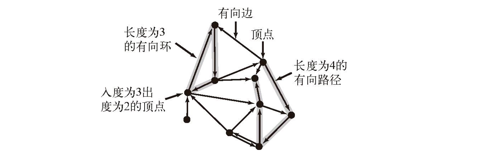
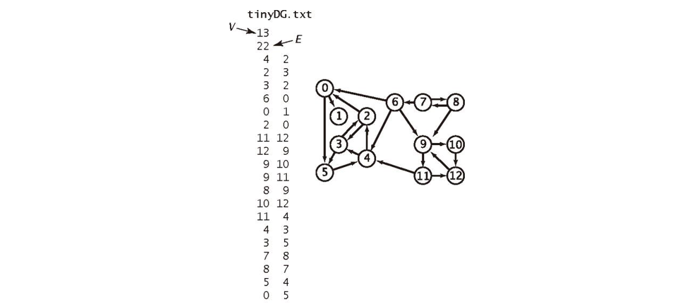
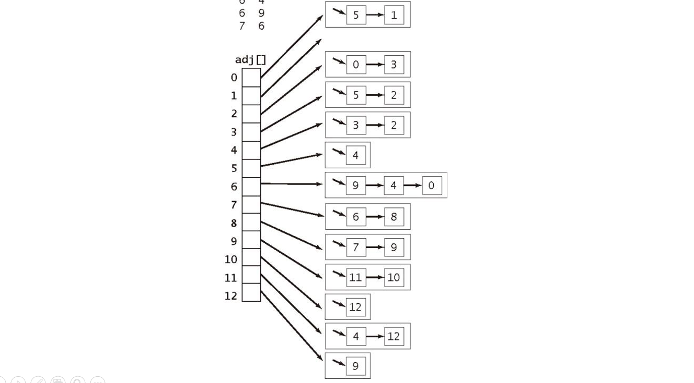
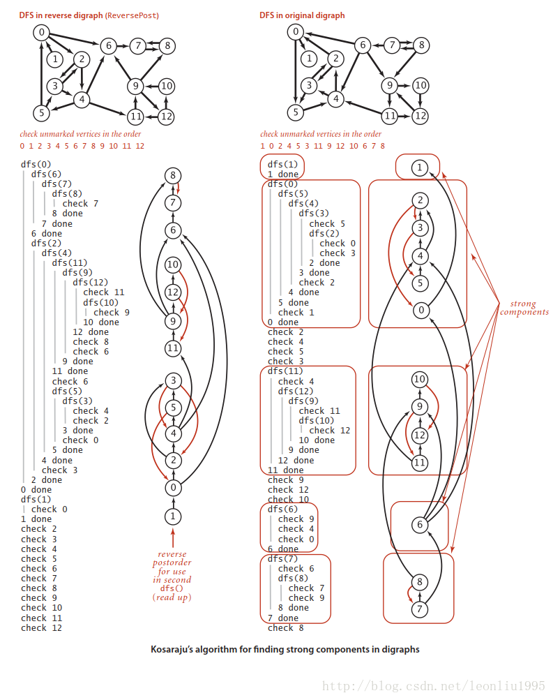

[TOC]

## 有向图

### 1 概述

简单的来说有向图就是**连接带方向**的图。有向图的例子在现实生活中也很多，比如在一段时间内银行间的现金流动，或者在某些地方的一些道路是单向的啊，那么这些现金流以及单向的道路就要用带方向的边来描述，这时有向图就有了用武之地。一个有向图的例子如下：



有向图该怎么实现呢？对于无向图我们使用邻接表来实现，这种表达方式非常高效，并且略加思考就可以发现，**邻接表完全可以直接套用在有向图上**。假设要添加一条 v->w 的边，只要每次调用 add() 函数的时候只在 adj[v] 所指向的 Bag 添加 w 即可，这么看来无向图可以看作是有向图的特殊情况，即凡是有边相连的两个顶点一定有两个互相来回的边，所以对于无向图，在添加一条边的时候需要在两个顶点都添加一条边。每条边**只会出现一次**。





下面给出有向图的实现：

```java
public class Digraph {
    private final int V; // number of vertex
    private  int E;      // number of edge
    private Bag<Integer>[] adj;  //adjacent list

    public Digraph(int V){
        this.V  = V;
        this.E = 0;
        adj = (Bag<Integer>[]) new Bag[V];
        for (int v=0;v<V;v++){
            adj[v] = new Bag<Integer>();
        }

    }

    public Digraph(In in){
        this(in.readInt());
        int E = in.readInt();
        for(int i=0;i<E;i++){
            int v = in.readInt();
            int w = in.readInt();
            addEdge(v,w);
        }
    }

    public int V(){return V;}
    public int E(){return E;}

    public void addEdge(int v,int w){
        // 只需要添加一次边即可
        adj[v].add(w);
        E++;
    }

    public Iterable<Integer> adj(int v){
        return adj[v];
    }

    public Digraph reverse(){
        Digraph  R= new Digraph(V);
        for (int v = 0;v<V;v++)
            for (int w:adj(v))
                R.addEdge(w, v);
        return R;
    }
}
```

可以看出有向图 Digraph 的实现中多了一个 reverse() 函数，这是将**所有边全部反向**，这个函数在后面会有作用。


### 2 可达性

对于有向图我们依然有**搜索**的需要，并且我们依然可以使用深度优先以及广度优先搜索，首先可以解决的问题是**可达性，从一个或一组顶点出发能否到达一点**，使用深度优先或者广度优先都可以实现，然后还能找到一个路径，同时利用广度优先还能找出最短路径，这些问题的解决方式**和无向图基本没有差别**，只是将 Graph 替换为 Digraph 就行，所以不再详述。


### 3 DAG

DAG（Directed Acyclic Graph）即为**有向无环图**，就是没有有向的环路的有向图，这在现实生活中也很常见，比如一些具有优先级的任务流程。

DAG 就是一幅不含有有向环的有向图。

对 DAG 有一些处理算法，不过在那之前，先来看看**怎么判断一副有向图是否为 DAG**。

其实很简单，首先**只要有一个有向环，这个图就不是 DAG**，所以只要检测出一个有向环，就可以返回了，不用再找下去了。第二这里我们使用深度优先搜索，深度优先沿着一条路径一直找下的特性刚好符合这里的要求，广度优先搜索是没有用的，那么我们什么时候判断存在一个有向环呢就是我们在走的时候碰到了还没有返回的顶点，用一个布尔数组 onStack 为每一个顶点保存一个是否还处于堆栈上没有返回的标志，这样，一旦在深度优先搜索的时候碰到了一个还在栈上的顶点，那么就能够确认这个有向图含有有向环，即不是 DAG。代码如下：

```java
public class DirectedCycle {
    private boolean[] marked;
    private int[] edgeTo;
    private Stack<Integer> cycle;
    private boolean[] onStack;

    public DirectedCycle(Digraph G){
        onStack = new boolean[G.V()];
        edgeTo = new int[G.V()];
        marked = new boolean[G.V()];
        for(int v=0;v<G.V();v++){
            if (!marked[v]) dfs(G,v);
        }
    }

    private void dfs(Digraph G, int v){
        onStack[v] =true;
        marked[v] = true;
        for(int w:G.adj(v)){
            if (this.hasCycle()) return;
            else if (!marked[w] ){
                edgeTo[w] = v;
                dfs(G, w);
            }
            else if(onStack[w]){
                cycle = new Stack<Integer>();
                for(int x = v;x!=v;x=edgeTo[x])
                    cycle.push(x);

                cycle.push(w);
                cycle.push(v);
            }

        }
        // 这里要注意没有这句话，在沿着路经返回的时候会不断往cycle栈里面压入数据
        onStack[v] = false;
    }

    public boolean hasCycle(){
        return cycle != null;
    }

    public Iterable<Integer> cycle(){
        return cycle();
    }

}
```

代码最后能够返回一个**路径**。


#### ==拓扑排序==

下面先介绍一个概念**拓扑排序：给定一副有向图，将所有的顶点排序，使得所有的有向边均从排在前面的元素指向排在后面的元素**，拓扑排序有着很多应用，比如任务调度，课程安排，类之间的继承等等。
排成之后的效果如下图:


**当且仅当一幅有向图是无环图时它才能进行拓扑排序**。

这是显然的，存在环的话无论怎么排都不可能让图中的左右边都朝着同一方向。我们应该利用上面的方法判断是否有环，然后再进行全面的搜索，但是我们可以以一定的顺序将遍历完成后的结果保存在一个数据结构中，下面是三种典型的排序：

**前序**：在递归调用前将顶点加入队列
**后序**：在递归调用后将顶点加入队列
**逆后序**：在归调用后将顶点压入栈

这实现起来也很简单，只需要在深度优先搜索的代码中加入相应的对数据结构的处理。

```java
// 有向图中基于深度优先搜索的顶点排序
public class DepthFirstOrder {
    private boolean[] marked;
    // 所有顶点的前序排序
    private Queue<Integer> pre;
    // 所有顶点的后序排序
    private Queue<Integer> post;
    // 所有顶点的逆后序排序
    private Stack<Integer> reversePost;

    public DepthFirstOrder(Digraph G){
        pre =new Queue<Integer>();
        post =new Queue<Integer>();
        reversePost = new Stack<Integer>();
        marked = new boolean[G.V()];

        for(int v =0 ;v<G.V();v++)
            if(!marked[v]) dfs(G,v);
    }

    private void dfs(Digraph G, int v){
        pre.enqueue(v);

        for(int w:G.adj(v))
            if (!marked[w]) dfs(G,  w);

        post.enqueue(v);
        reversePost.push(v);

    }

    public Iterable<Integer> pre(){
        return pre();
    }
    public Iterable<Integer> post(){
        return post();
    }
    public Iterable<Integer> reversePost(){
        return reversePost;
    }
}
```

代码中，pre(), post(), reversePost() 分别能够**返回顶点的前序，后序以及逆后序**。

现在我们已经很容易就能够实现拓扑排序了，因为有一个定理：

**==一幅有向无环图的拓扑排序即为所有顶点的逆后序排序。==**

证明：假设我们访问到了任意一个顶点 v，他有一个相邻顶点 w，在 dfs(v) 函数内部一定会访问到 w，此时只会有两种情况：

1.  w已经被访问过并且返回了，这是完全有可能的。
2.  w 还未被访问，这时就会递归的调用 dfs(w)，还有一种情况，w 已经被访问过但是没有返回，这个参照上面判断 DAG 的代码里面已经讨论过，这种情况正好证明存在有向环，而我们在拓扑排序时首先要保证的就是图要是 DAG，所以这种情况不会出现。

然后对于**逆后序**我们还使用了**栈**来存储数据，这能够保证后压入的数据至少不会是在之前压入数据之前，并且最后栈最后返回数据的时候可以看做是链接全部向右，对应于现实中比如，返回的就是需要**先安排**的任务，这就很方便。对于前序它是不能实现拓扑排序的，因为它就单纯的是记录的是深度优先搜索的路径，而后序的顺序反了，队列弹出的数据是优先级较高的，就好比是给出了最后需要完成的任务，所以我们才用栈将这个顺序反过来，这也就是为什么叫**“逆后序”**。

下面是拓扑排序的代码：

```java
public class Topological {
    private Iterable<Integer> order;

    public Topological(Digraph G){
        DirectedCycle cyclefinderCycle = new DirectedCycle(G);
        // 先检测是否有环只有在是DAG的时候才继续排序
        if (!cyclefinderCycle.hasCycle()){
            DepthFirstOrder dfs = new DepthFirstOrder(G);
            // 得到逆后序
            order = dfs.reversePost();
        }
    }

    public Iterable<Integer> order(){
        return order;
    }
    public boolean isDAG(){
        return order != null;
    }

}
```

**拓扑排序和有向环的检测**总是会一起出现，因为有向环的检测是拓扑排序的前提。

解决任务调度类问题的步骤：

- 指明任务和优先级条件。
- 不断检测并去除有向图中的所有环，以确保存在可行方案。
- 使用**拓扑排序**解决调度问题。


### 4 Kosaraju算法

Kuosaraju 算法是用来**找出强连通分量**的，前面的一些方法在这里也有一些作用，不过在那之前先介绍清楚几个概念。
**强连通**：对于两个顶点 v 和 w，分别存在一条从 v 到 w 和从 w 到 v 的有向路径，即两个顶点是**互相可达**的。那么称这两个顶点是强连通的。
**强连通分量**：是有向图 G 的一个子集，它的**所有顶点**都互相是强连通的。

下图含有  5 个强连通分量。


**两个顶点是强连通的当且仅当它们都在一个普通的有向环中**。

**Kosaraju 算法可以给出有向图中有几个强连通分量以及两个顶点是否在一个强连通分量里面。**

算法的步骤主要是：对有向图 G 的**反向图** G^R^ 进行**==拓扑排序==**，**然后根据这个顺序使用==深度优先==处理有向图 G，然后每一次递归所经过的顶点都在一个强连通分量里面。**

下面给出一个比较直观的证明：首先对于每一个强连通分量为了直观起见，我们将其视作一个**点**，那么我们的目标就是找出这个收缩过之后的图有几个顶点，联系之前的无向图的连通分量的算法，我们希望每个节点返回一次。这该怎么达到呢？这时**拓扑排序**就派上用场了，我们先对图求反，再对其做拓扑排序，这时候得到的结果，我们不考虑强连通分量中的点，在强连通分量之间就是完全的拓扑排序的反序，按照这个顺序在 G 中进行深度优先搜索，我们就会每次搜索完强连通分量内的点，然后无法到达其他连通分量，就只能返回，达到了我们前面说的对每个强连通分量缩成的节点每次都返回一次。



上图是《算法4》中的一个例子，右边的图中，每一个方框内都是一个**强连通分量**，然后可以发现，按照反向图的逆后序进行深度优先搜索的话，强联通分量之间的边都是逆着的，这就完成了上面所说的每个收缩后的节点返回一次的目的。

最后说一点可能不对的想法，在思考证明方法的过程中我想到一种情况，我们第一次搜索反向图是为了得到缩点之后的连通分量之间的边是逆着的图，但是好像单纯对原图搜索，取其后序好像也行，但是实验之后发现结果不对，但是百思不得其解，后来找了个小例子发现了一个可能性，关键在于强连通分量之间是可达的，这个道理好像是显而易见的，但是应该就是这种方法行不通的原因，举个极端例子，在某个顶点出发是完全有可能一次就遍历整个图，并且第一个完成遍历的顶点就和它相连，那么当我们按照后序第二次遍历的时候就会一下子遍历整个图，那么最后我们就会只得到一个连通分量，这显然是不对的。

下面是计算强连通分量的 Kosaraju 算法代码的实现：

```java
public class KosarajuSCC {
    private boolean[] marked;
    private int[] id;
    private int count;

    public KosarajuSCC(MyDigraph G){
        marked = new boolean[G.V()];
        id = new int[G.V()];
        DepthFirstOrder order = new DepthFirstOrder(G.reverse());
        for(int s:order.reversePost())
            if(!marked[s]){
                dfs(G,s);
                count++;
            }
    }

    private void dfs(MyDigraph G, int v){
        marked[v] =true;
        id[v] =count;
        for(int w:G.adj(v))
            if(!marked[w])
                dfs(G, w);
    }

    public boolean stronglyConnected(int v, int w){
        return id[v] == id[w];
    }

    public int id(int v){
        return id[v];
    }
    public int count(){
        return count;
    }
}
```

Kosaraju 算法的预处理所需的时间和空间与 V+E 成正比且支持**常数时间**的**有向图强连通性**的查询。


