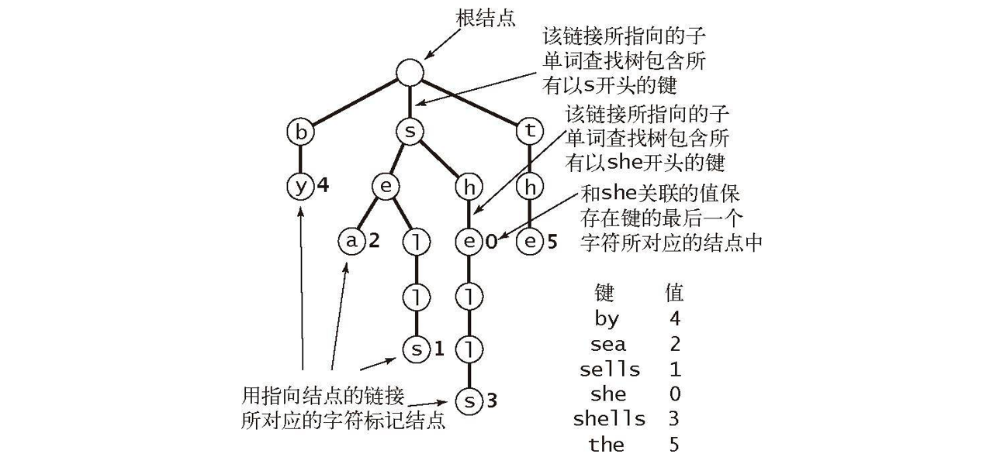
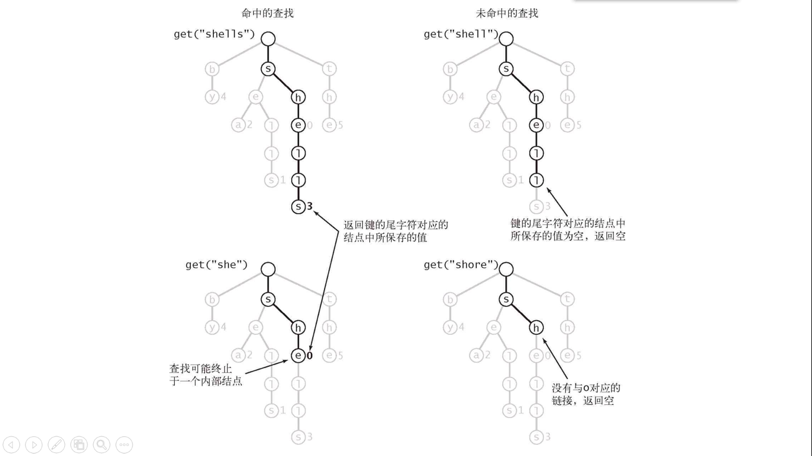
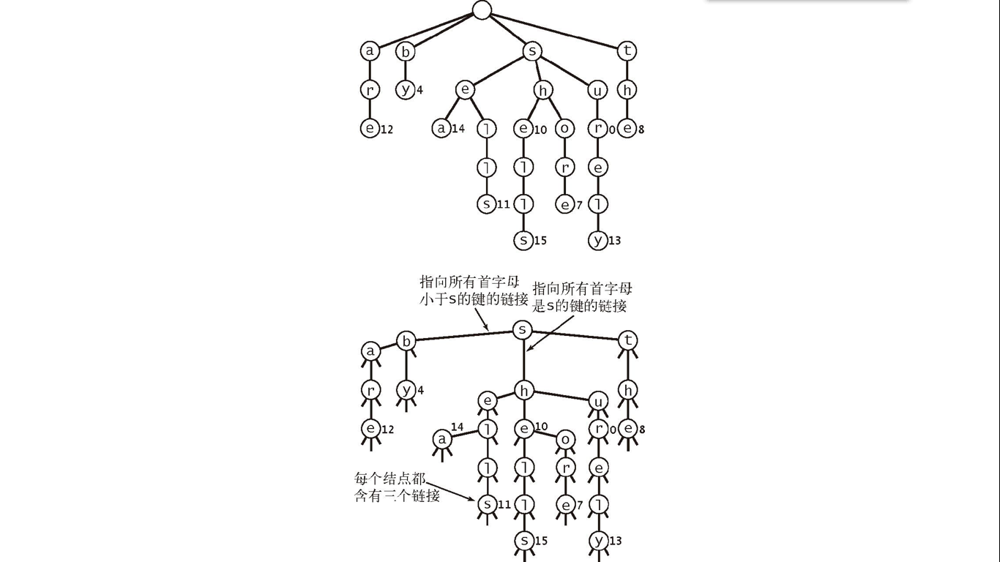

[TOC]

## 单词查找树

在进行文法分析的时候，通常需要检测一个单词**是否在我们的单词列表**里。为了提高查找和定位的速度，通常都要画出与单词列表所对应的单词查找树，其特点如下：

- 根节点不包含字母，除根节点外每一个节点都仅包含一个英文字母；
- 从根节点到某一节点，路径上经过的字母依次连起来所构成的字母序列，称为该节点对应的单词。单词列表中的每个词，都是该单词查找树某个节点所对应的单词；
- 在满足上述条件下，该单词查找树的节点数最少。

单词列表对应的单词查找树

单词查找树的查找

值为**空**的结点表示符号表中**没有对应的键**。

#### 单词查找树的性质

- 单词查找树中查找一个键或者插入一个键时，访问数组的次数最多为键的长度加 1。

- 查找未命中的成本与键的长度无关。
- 一颗单子查找树中的链接总数在 RN 到 RNw 之间，其中 w 为键的平均长度。R 为字母表字母个数。

#### 三向单词查找树

三向单词查找树（TST）中每个结点都包含一个字符、三条链接和一个值。这**三条链接**分别对应着当前字母**小于、等于、大于**结点字母的所有键。跟二叉查找树类似。

如下图所示。

性质：

- 所需空间远小于一般单词查找树。

- 由 N 个平均长度为 w 的字符串构造的三向单词查找树中的链接总数在 **3N 到 3Nw** 之间。

- 适用于**非随机**的键。

