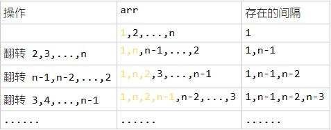

[TOC]

### 数组与矩阵题目

#### 优美的排列

##### 1. 题目

给定两个整数 n 和 k，你需要实现一个数组，这个数组包含**从 1 到 n** 的 n 个不同整数，同时满足以下条件：

① 如果这个数组是 [a1, a2, a3, ... , an] ，那么数组 [|a1 - a2|, |a2 - a3|, |a3 - a4|, ... , |an-1 - an|] 中应该**有且仅有 k 个不同**整数；.

② 如果存在多种答案，你只需实现并返回其中任意一种.

```java
示例 1:
输入: n = 3, k = 1
输出: [1, 2, 3]
解释: [1, 2, 3] 包含 3 个范围在 1-3 的不同整数， 并且 [1, 1] 中有且仅有 1 个不同整数 : 1

示例 2:
输入: n = 3, k = 2
输出: [1, 3, 2]
解释: [1, 3, 2] 包含 3 个范围在 1-3 的不同整数， 并且 [2, 1] 中有且仅有 2 个不同整数: 1 和 2
```


链接：https://leetcode-cn.com/problems/beautiful-arrangement-ii

##### 2. 题解

啊这个题注意数据范围是 1 - n 。一开始还以为是随便自己凑 n 个数据。

由于是 1 - N，如果正常排列那么肯定是只有一个不同的整数，所以必须要转换一下。

- 假设有一个数组: 1, 2, ..., n; 此时只有 1 种间隔;
- 一种巧妙的方式是进行翻转。如下图。



- 可以发现每次**反转**会**多出一种间隔**，k 种间隔就**反转 k 次**即可；一般想到这里就会开始写代码，然后不断的反转数数组。但是这样不是最好的。
- 进一步观察发现; 如果需要 k 个不同的间隔；
- **前 k 个数需要间隔从两端取**；
- 剩下的数字则按**照降序或者升序**排列；

```java
class Solution {
    public int[] constructArray(int n, int k) {
		int[] arr = new int[n];
		int l = 1, r = n;

		// 前 k 个数需要间隔从两端取；
		int i = 0;
		while (true) {
			if(i < k) { arr[i] = l; i++; l++; } else break;
			if(i < k) { arr[i] = r; i++; r--; } else break;
		}
		
		// 剩下的数字则按照降序或者升序排列；
		if(k % 2 == 1) {
			for (int j = k; j < arr.length; j++) {
				arr[j] = l;
				l++;
			}
		} else {
			for (int j = k; j < arr.length; j++) {
				arr[j] = r;
				r--;
			}
		}
		return arr;
	}
}
```


#### 最大交换

##### 1. 题目

给定一个非负整数，你至多可以交换一次数字中的任意两位。返回你能得到的最大值。

```java
示例 1 :
输入: 2736
输出: 7236
解释: 交换数字2和数字7。
    
示例 2 :
输入: 9973
输出: 9973
解释: 不需要交换。
```

链接：https://leetcode-cn.com/problems/maximum-swap

##### 2. 题解

###### 贪心思想

尽量交换**前面的大数位**，并且和它交换的数还得是在它后面大于它的最大数。

倒序使用数组存储下来每个位置，在它及它以后的最大数的索引。
然后再正序从一个数开始**遍历**，如果它及它以后的最大数不是它本身，那么这个数就是我们需要交换的。

```java
public int maximumSwap(int num) {
    // 将数字转为char数组
    char[] c = String.valueOf(num).toCharArray();
    // 最大值
    int max = Integer.MIN_VALUE;
    // 最大值所在索引
    int maxIndex = 0;
    // 初始化一个数组
    int [] arr = new int[c.length];
    // 拷贝个位数
    arr[c.length - 1] = c.length - 1;

    // 从个位往高位遍历
    for (int i = c.length - 1; i >= 0; i--) {
        // char运算！！！
        if (c[i] - '0' > max) {
            // 更新最大值和最大值指针
            max = c[i] - '0';
            maxIndex = i;
        }
        arr[i] = maxIndex;
    }
    // 交换元素
    for (int i = 0; i < c.length; i ++) {
        if (arr[i] != i && c[arr[i]] != c[i]) {
            char tmp = c[i];
            c[i] = c[arr[i]];
            c[arr[i]] = tmp;
            break;
        }
    }
    return Integer.parseInt(new String(c));
}
```


#### 盛水最多的容器

给你 n 个非负整数 a1，a2，...，an，每个数代表坐标中的一个点 (i, ai) 。在坐标内画 n 条垂直线，垂直线 i 的两个端点分别为 (i, ai) 和 (i, 0)。找出其中的两条线，使得它们与 x 轴共同构成的容器可以容纳最多的水。

说明：你不能倾斜容器，且 n 的值至少为 2。


图中垂直线代表输入数组 [1,8,6,2,5,4,8,3,7]。在此情况下，容器能够容纳水（表示为蓝色部分）的最大值为 49。

```java
示例：
输入：[1,8,6,2,5,4,8,3,7]
输出：49
```

链接：https://leetcode-cn.com/problems/container-with-most-water

##### 2. 题解

###### 双指针法

这种方法背后的思路在于，两线段之间形成的区域总是会受到其中较短那条长度的限制。此外，两线段距离越远，得到的面积就越大。

我们在由线段长度构成的数组中使用两个指针，一个放在开始，一个置于末尾。 此外，我们会使用变量 maxareamaxarea 来持续存储到目前为止所获得的最大面积。 在每一步中，我们会找出指针所指向的两条线段形成的区域，更新 maxareamaxarea，并将指向较短线段的指针向较长线段那端移动一步。

这种方法如何工作？

最初我们考虑由**最外围两条线段**构成的区域。现在，为了使面积最大化，我们需要考虑更长的两条线段之间的区域。如果我们试图将指向较长线段的**指针向内侧移动**，矩形区域的面积将受限于较短的线段而不会获得任何增加。但是，在同样的条件下，移动指向较短线段的指针尽管造成了矩形宽度的减小，但却可能会有助于面积的增大。因为**移动较短线段的指针会得到一条相对较长的线段**，这可以克服由宽度减小而引起的面积减小。

具体动图流程参考：https://leetcode-cn.com/problems/container-with-most-water/solution/sheng-zui-duo-shui-de-rong-qi-by-leetcode/

```java
public int maxArea(int[] height) {
    // 记录最大值
    int max = 0;
    // 双指针遍历数组，直到两个指针相遇
    for(int i = 0, j = height.length - 1; i < j;) {
        // 计算当前两个指针下的面积
        int area = (j - i) * Math.min(height[i], height[j]);
        // 更新最大值
        max = Math.max(max, area); 
        // 根据高度判断该移动哪个指针--移动短的指针
        if(height[i] < height[j]) {
            i++;
        } else {
            j--;
        }
    }
    return max;
}
```


#### 三数之和

##### 1. 题目

给你一个包含 n 个整数的数组 nums，判断 nums 中是否存在三个元素 a，b，c ，使得 **a + b + c = 0** ？请你找出所有满足条件且**不重复**的三元组。

注意：答案中不可以包含重复的三元组。

 ```
示例：
给定数组 nums = [-1, 0, 1, 2, -1, -4]，
满足要求的三元组集合为：
[
  [-1, 0, 1],
  [-1, -1, 2]
]
 ```

链接：https://leetcode-cn.com/problems/3sum

##### 2. 题解

###### 排序+双指针法

这个题排序很关键呀！直接用系统的排序算法即可，**Arrays.sort()**。

- 标签：数组遍历
- 首先对数组进行**排序**，排序后固定一个数 **nums[i]**，再使用**左右指针指向 nums[i]后面的两端**，数字分别为 nums[L] 和 nums[R]，计算三个数的和 sum 判断是否满足为 0，满足则添加进结果集。
- 如果 nums[i] **大于 0**，则三数之和**必然无法等于 0**，结束循环
- 如果 nums[i] == nums[i-1]，则说明该数字**重复**，会导致结果重复，所以应该**跳过**
- 当 sum == 0 时，nums[L] == nums[L+1] 则会导致结果重复，应该**跳过**，L++
- 当 sum == 0 时，nums[R] == nums[R−1] 则会导致结果重复，应该**跳过**，R--
- 时间复杂度：O(n^2)，n 为数组长度。
- 算法动图链接：https://leetcode-cn.com/problems/3sum/solution/hua-jie-suan-fa-15-san-shu-zhi-he-by-guanpengchn/

```java
class Solution {
    public static List<List<Integer>> threeSum(int[] nums) {
        List<List<Integer>> ans = new ArrayList();
        // Base case
        int len = nums.length;
        if(nums == null || len < 3) return ans;
        // 对原始数组排序
        Arrays.sort(nums); 

        for (int i = 0; i < len ; i++) {
            // 如果当前数字大于0，则三数之和一定大于0，所以结束循环
            if(nums[i] > 0) break; 
            // 去重相同的数就判断一次即可
            if(i > 0 && nums[i] == nums[i-1]) continue; 
            // 当前元素右边部分的左右指针
            int L = i + 1;
            int R = len - 1;
            while(L < R){
                int sum = nums[i] + nums[L] + nums[R];
                if(sum == 0){
                    ans.add(Arrays.asList(nums[i],nums[L],nums[R]));
                    while (L < R && nums[L] == nums[L + 1]) L++; // 去重
                    while (L < R && nums[R] == nums[R - 1]) R--; // 去重
                    L++;
                    R--;
                }
                else if (sum < 0) L++;
                else if (sum > 0) R--;
            }
        }        
        return ans;
    }
}
```


#### 最接近的三数之和

##### 1. 题目

三数之和题目的变形。

给定一个包括 n 个整数的数组 nums 和 一个目标值 target。找出 nums 中的**三个整数**，使得它们的**和与 target 最接近**。返回这三个数的和。假定每组输入只存在**唯一答案**。

```java
例如，给定数组 nums = [-1，2，1，-4], 和 target = 1.
与 target 最接近的三个数的和为 2. (-1 + 2 + 1 = 2).
```

链接：https://leetcode-cn.com/problems/3sum-closest

##### 2. 题解

###### 排序+双指针

三数之和题目的变形。所以直接利用三数之和的排序+双指针方法进行求解，原理是一样的。只是注意编码的问题。

动图连接：[算法动图](https://leetcode-cn.com/problems/3sum-closest/solution/hua-jie-suan-fa-16-zui-jie-jin-de-san-shu-zhi-he-b/)

```java
class Solution {
    public int threeSumClosest(int[] nums, int target) {
        // 对数组排序
        Arrays.sort(nums);
        // 用前三个元素初始化一个值
        int ans = nums[0] + nums[1] + nums[2];
        for (int i = 0; i < nums.length; i++) {
            // 对当前索引位置后面的元素进行双指针遍历
            int start = i + 1, end = nums.length - 1;
            // 不断移动双指针
            while (start < end) {
                int sum = nums[start] + nums[end] + nums[i];
                // 如果距离值更小则更小ans值
                if (Math.abs(target - sum) < Math.abs(target - ans))
                    ans = sum;
                // 然后根据情况移动左右指针    
                if (sum > target)
                    end--;
                else if (sum < target)
                    start++;
                else
                    // 如果刚好等于，则直接返回ans=0即可。
                    return ans;
            }
        }
        return ans;
    }
}
```


#### 删除排序数组中的重复项

##### 1. 题目

给定一个排序数组，你需要在 **原地** 删除重复出现的元素，使得每个元素**只出现一次**，返回移除后数组的**新长度**。

不要使用额外的数组空间，你必须在 原地 修改输入数组 并在使用 **O(1)** 额外空间的条件下完成。

```java
示例 1:
给定数组 nums = [1,1,2], 
函数应该返回新的长度 2, 并且原数组 nums 的前两个元素被修改为 1, 2。 
你不需要考虑数组中超出新长度后面的元素。
    
示例 2:
给定 nums = [0,0,1,1,1,2,2,3,3,4],
函数应该返回新的长度 5, 并且原数组 nums 的前五个元素被修改为 0, 1, 2, 3, 4。
你不需要考虑数组中超出新长度后面的元素。
```

链接：https://leetcode-cn.com/problems/remove-duplicates-from-sorted-array

##### 2. 题解

###### 双指针法

这个题AC方式有点怪异。

首先注意数组是**有序**的，那么**重复的元素一定会相邻**。

要求删除重复元素，实际上就是将**不重复的**元素移到数组的**左侧**。

考虑用 **2 个指针**，一个在**慢指针记作 p**，一个在**快指针记作 q**，算法流程如下：

比较 p 和 q 位置的元素是否**相等**。

- 如果**相等**，q 后移 **1 位**，相当于跳过重复元素。
- 如果**不相等**，将 q 位置的元素**复制到 p + 1** 位置上（先将 p + 1），p 后移一位，q 后移 1 位
  重复上述过程，直到 q 等于数组长度。

返回 p + 1，即为新数组长度。


```java
public int removeDuplicates(int[] nums) {
    // Base case
    if (nums.length == 0) return 0;
    // 慢指针
    int p = 0;
    // 快指针从1处开始
    for (int q = 1; q < nums.length; q++) {
        // 如果快慢指针所指的内容不同，则把快指针处的数据复制到慢指针的下一个位置
        if (nums[q] != nums[p]) {
            // 先将慢指针移动到下一个位置
            p++;
            // 拷贝值
            nums[p] = nums[q];
        }
    }
    return p + 1;
}
```


#### 删除全部指定元素

##### 1. 题目

给你一个数组 nums 和一个值 val，你需要 **原地 移除所有数值等于 val 的元素**，并返回移除后数组的**新长度**。

不要使用额外的数组空间，你必须仅使用 O(1) 额外空间并 原地 修改输入数组。

元素的顺序可以改变。**你不需要考虑数组中超出新长度后面的元素**。（这里的条件跟上一题类似）

```java
示例 1:
给定 nums = [3,2,2,3], val = 3,
函数应该返回新的长度 2, 并且 nums 中的前两个元素均为 2。
你不需要考虑数组中超出新长度后面的元素。
    
示例 2:
给定 nums = [0,1,2,2,3,0,4,2], val = 2,
函数应该返回新的长度 5, 并且 nums 中的前五个元素为 0, 1, 3, 0, 4。
注意这五个元素可为任意顺序。
你不需要考虑数组中超出新长度后面的元素。
```


链接：https://leetcode-cn.com/problems/remove-element

##### 2. 题解

###### 交换移除

用后面的元素替换前面需要删除的元素，同时将有效的数组长度 - 1。

```java
public int removeElement(int[] nums, int val) {
    int i = 0;
    int len = nums.length;
    // 遍历
    while (i < len) {
        // 这个元素是需要删除的
        if (nums[i] == val) {
            // 用当前数组有效范围的最后一个元素替换需要删除的元素
            nums[i] = nums[len - 1];
            // 由于删除了一个元素，缩小数组范围
            len--;
        } else {
            i++;
        }
    }
    // 返回最终还剩多少有效数组长度即可
    return len;
}
```

###### 拷贝覆盖

顺序遍历数组，如果遇到某个值与目标值不同，则直接将其复制到索引 ans 之下，同时 ans 索引依次增加。

```java
class Solution {
    public int removeElement(int[] nums, int val) {
        // 索引从0开始
        int ans = 0;
        for(int num: nums) {
            // 某个值与目标值不同
            if(num != val) {
                // 值覆盖
                nums[ans] = num;
                ans++;
            }
        }
        return ans;
    }
}
```


#### 字典序的下一个排列

##### 1. 题目

实现获取下一个排列的函数，算法需要将给定数字**序列**重新排列成字典序中**下一个更大**的排列。

如果**不存在**下一个更大的排列，则将数字重新排列成**最小的排列**（即升序排列）。

必须**原地**修改，只允许使用额外**常数**空间。

以下是一些例子，输入位于左侧列，其相应输出位于右侧列。

```java
1,2,3 → 1,3,2
3,2,1 → 1,2,3
1,1,5 → 1,5,1
```


链接：https://leetcode-cn.com/problems/next-permutation

##### 2. 题解

###### 遍历法

具体流程参考下图，详细解释看：https://leetcode-cn.com/problems/next-permutation/solution/xia-yi-ge-pai-lie-by-leetcode/


```java
public class Solution {
    public void nextPermutation(int[] nums) {
        // 初始索引，即数组的倒数第二个数开始
        int i = nums.length - 2;
        // 从右往左找到第一个非单调增的数字对应的索引
        while (i >= 0 && nums[i + 1] <= nums[i]) {
            // 指针左移
            i--;
        }
        // 说明索引有效（即当前数不是最大的，可以整下一个字典序）
        if (i >= 0) {
            // 从右往左寻找第一个大于索引值的元素
            int j = nums.length - 1;
            while (j >= 0 && nums[j] <= nums[i]) {
                j--;
            }
            // 交换这两个元素即可生成
            swap(nums, i, j);
        }
        // 如果当前数是最大的，则将其变为最小的，即反转整个数组
        reverse(nums, i + 1);
    }

    // 反转整个数组
    private void reverse(int[] nums, int start) {
        int i = start, j = nums.length - 1;
        while (i < j) {
            swap(nums, i, j);
            i++;
            j--;
        }
    }
	// 交换两个元素
    private void swap(int[] nums, int i, int j) {
        int temp = nums[i];
        nums[i] = nums[j];
        nums[j] = temp;
    }
}
```

