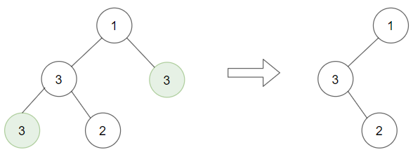

[TOC]

### 树题目

- 递归解深度相关的题，可以设置一个全局的最大深度，用于记录已经访问到的最大深的深度。
- 掌握二叉树的迭代层序遍历，很多题可用！只需少量修改即可。
- 掌握二叉树的序列化 与反序列化方法，可用用于子树问题的判断。
- 递归遍历的时候，如果需要改变顺序，可以考虑先递归右树。

#### 判断是否是平衡二叉树

##### 1. 题目

给定一个二叉树，判断它是否是**高度平衡的二叉树**。

本题中，一棵高度平衡二叉树定义为：

一个二叉树每个节点 的左右两个子树的高度差的**绝对值不超过 1**。

**示例 1:**

给定二叉树 [3, 9, 20, null, null, 15, 7]

```java
    3
   / \
  9  20
    /  \
   15   7
```
返回 true 。

**示例 2:**

给定二叉树 [1,2,2,3,3,null,null,4,4]

```java
       1
      / \
     2   2
    / \
   3   3
  / \
 4   4
```
返回 false 。
链接：https://leetcode-cn.com/problems/balanced-binary-tree

##### 2. 题解

###### 暴力递归法

直接使用树形 dp 套路求解。

```java
class Solution {
    public boolean isBalanced(TreeNode root) {
        return process(root).isBalanced;
    }
	// 递归函数
    private Info process(TreeNode root) {
        // Base case
        if(root == null) {
            return new Info(true, 0);
        }
		// 默认获取到左右的信息
        Info left = process(root.left);
        Info right = process(root.right);
        // 构造自己的返回信息
        boolean isBalanced = left.isBalanced && right.isBalanced && (Math.abs(left.height - right.height) <= 1);
        // 最大高度+1
        int height = Math.max(left.height, right.height) + 1;
        return new Info(isBalanced, height);
    }
}
// 定义一个返回类
class Info {
    // 是否平衡
    boolean isBalanced;
    // 最大高度
    int height;

    public Info(boolean isBalanced, int height) {
        this.isBalanced = isBalanced;
        this.height = height;
    }
}
```

---

#### 求二叉树的深度

##### 1. 题目

输入一棵二叉树的根节点，求该树的深度。从根节点到叶节点依次经过的节点（含根、叶节点）形成树的一条路径，**最长**路径的长度为树的深度。

例如：

给定二叉树 [3, 9, 20, null, null, 15, 7]

        3
       / \
      9  20
        /  \
       15   7
返回它的最大深度 3 。

链接：https://leetcode-cn.com/problems/er-cha-shu-de-shen-du-lcof

##### 2. 题解

树的遍历方式总体分为**两类**：**深度优先搜索（DFS）、广度优先搜索（BFS）**；

**常见的 DFS** ： **先序遍历、中序遍历、后序遍历；**
**常见的 BFS** ： **层序遍历（即按层遍历）。**

求树的深度需要遍历树的所有节点，本文将介绍基于 **后序遍历（DFS） 和 层序遍历（BFS）**的两种解法。

###### 递归法 DFS（后序遍历）

树形 dp 套路求解，但是此处的**返回值就是 int** 本身，其实都不用额外构造返回的数据结构了。

树的后序遍历 / 深度优先搜索往往利用 **递归 或 栈** 实现，本文使用**递归**实现。
关键点： 此树的深度和其左（右）子树的深度之间的**关系**。显然，此树的深度 等于 左子树的深度 与 右子树的深度 中的 **最大值 +1** 。

```java
public int maxDepth(TreeNode root) {
    // Base case
    if(root == null) {
        return 0;
    }
    // 默认从左右获取信息
    int left = maxDepth(root.left);
    int right = maxDepth(root.right);
    // 构造自己的高度信息
    return Math.max(left, right) + 1;
}
```

简化一点 ....

```java
public int maxDepth(TreeNode root) {
    if(root == null) return 0;
    return Math.max(maxDepth(root.left), maxDepth(root.right)) + 1;
}
```

###### ② 层序遍历（BFS）

树的层序遍历 / 广度优先搜索往往利用 **队列** 实现。

**关键点：** 每遍历一层，则计数器 +1 ，直到**遍历完成**，则可得到树的深度。

这种方式慢一点只能击败 20%，但是面试经常考非递归。

```java
class Solution {
    public int maxDepth(TreeNode root) {
        // Base case
        if(root == null)
            return 0;
        // 维护一个队列
        Queue<TreeNode> queue = new LinkedList<>();
        // 初始化高度为0
        int h = 0;
        // 根节点入队列
        queue.offer(root);
        // 循环直到队列为空
        while(!queue.isEmpty()){
            // 高度+1
            h++;
            // 获取当前队列的尺寸，也就是这一层的元素
            int size = queue.size();
            // 弹出当前这一层的元素，并把其左右子节点放入队列中
            for(int i = 0; i < size; i++){
                // 取队列
                TreeNode node =  queue.poll();
                if(node.left != null)
                    queue.offer(node.left);
                if(node.right != null)
                    queue.offer(node.right);
            }
        }
        return h;
    }
}
```


#### 二叉树的最小深度

##### 1. 题目

给定一个二叉树，找出其最小深度。

最小深度是**从根节点到最近叶子节点**的最短路径上的节点数量。

说明: 叶子节点是指没有子节点的节点。

示例:

给定二叉树 [3, 9, 20, null, null, 15, 7]。

```java
    3
   / \
  9  20
    /  \
   15   7
```

返回它的最小深度  2.

链接：https://leetcode-cn.com/problems/minimum-depth-of-binary-tree

##### 2. 题解

###### ① 递归法

直接使用暴力递归非常 easy。

```java
class Solution {
    public int minDepth(TreeNode root) {
        // Base case
        if(root == null) {
            return 0;
        }
        // 直接获取左边的信息和右边信息
        int minLeft = minDepth(root.left);
        int minRight = minDepth(root.right);
        // 构造自己的返回信息
        if(minLeft != 0 && minRight == 0) {
            return minLeft + 1;
        } 
        if(minLeft == 0 && minRight != 0) {
            return minRight + 1;
        } 
        // 左右高度较小的+1
        return Math.min(minLeft, minRight) + 1;
    }
}
```

###### ② 深度优先搜索迭代

我们可以利用**栈**将上述解法中的递归变成**迭代**。

想法是对于**每个节点**，按照**深度优先搜索**的策略访问，同时在**访问到叶子节点**时**更新最小深度**。

我们从一个**包含根节点**的栈开始，当前深度为 1 。

然后开始迭代：**弹出**当前栈顶元素，将它的孩子节点**压入栈**中。当遇到叶子节点时**更新最小深度**。

```java
import javafx.util.Pair;
public int minDepth(TreeNode root) {
    // 使用：使用了Pair类来管理当前结点和它的高度
    LinkedList<Pair<TreeNode, Integer>> stack = new LinkedList<>();
    // Base case
    if (root == null) {
        return 0;
    } else {
        // 将root入栈
        stack.add(new Pair(root, 1));
    }
	// 最小深度
    int minDepth = Integer.MAX_VALUE;
    // 栈不为空持续弹出
    while (!stack.isEmpty()) {
        // 弹出元素并处理数据
        Pair<TreeNode, Integer> current = stack.pollLast();
        root = current.getKey();
        int currentDepth = current.getValue();
        if ((root.left == null) && (root.right == null)) {
            minDepth = Math.min(minDepth, currentDepth);
        }
        // 添加数据到栈
        if (root.left != null) {
            stack.add(new Pair(root.left, currentDepth + 1));
        }
        if (root.right != null) {
            stack.add(new Pair(root.right, currentDepth + 1));
        }
    }
    return minDepth;
}
```

- 时间复杂度：每个节点恰好被访问一遍，复杂度为 O(N)。
- 空间复杂度：最坏情况下我们会在栈中保存整棵树，此时空间复杂度为 O(N)。

###### ③ 广度优先搜索迭代

前面**深度优先搜索方法**的**缺陷**是**所有节点**都必须访问到，以保证能够找到最小深度。因此复杂度是 O(N) 。

一个**优化**的方法是利用**广度优先搜索**，我们按照树的**层去迭代**，**第一个访问到的叶子就是最小深度的节点**，这样就不用遍历所有的节点了。

```java
import javafx.util.Pair;
public int minDepth(TreeNode root) {
    // 使用栈
    LinkedList<Pair<TreeNode, Integer>> stack = new LinkedList<>();
    if (root == null) {
        return 0;
    } else {
        stack.add(new Pair(root, 1));
    }

    int currentDepth = 0;
    while (!stack.isEmpty()) {
        // 弹出元素
        Pair<TreeNode, Integer> current = stack.poll();
        // 获取当前元素的结点与值
        root = current.getKey();
        currentDepth = current.getValue();
        // 如果当前元素是一个叶子结点，直接跳出循环，然后返回高度即可
        if ((root.left == null) && (root.right == null)) {
            break;
        }
        // 否则先将左子节点压栈，再将右子节点压栈即可
        if (root.left != null) {
            stack.add(new Pair(root.left, currentDepth + 1));
        }
        if (root.right != null) {
            stack.add(new Pair(root.right, currentDepth + 1));
        }
    }
    return currentDepth;
}
```


#### N叉树的最大深度

##### 1. 题目

给定一个 N 叉树，找到其最大深度。

最大深度是指从根节点到最远叶子节点的最长路径上的节点总数。

例如，给定一个 `3叉树` :


我们应返回其最大深度，3。

连接：https://leetcode-cn.com/problems/maximum-depth-of-n-ary-tree/

##### 2. 题解

###### ① 递归法

也是使用递归法，也是用暴力递归即可。过程不多说了，只是获取默认信息的时候默认是从全部的子树获取的信息。

```java
public int maxDepth(Node root) {
    // Base case：为null
    if(root == null) {
        return 0;
    }
    // 当为叶子结点直接返回1
    if(root.children == null || root.children.size() == 0) {
        return 1;
    }
    // 使用列表存储各个子树的高度信息值
    List<Integer> heightList = new ArrayList();
    // 获取各个子树的高度信息并存入列表
    for(Node head : root.children) {
        heightList.add(maxDepth(head));
    }
    // 返回最大的高度+1
    return Collections.max(heightList) + 1;
}
```

###### ② 迭代法

我们还可以在**堆栈**的帮助下将上面的递归转换为**迭代**。

思路是是使用**深度优先**搜索策略访问每个节点，同时**更新每次访问时的最大深度**。

所以可以从包含根节点的、对应深度为 1 的栈开始。
然后继续迭代，**从栈中弹出当前节点并将子节点压入栈中**，每次都**更新对应深度**。

```java
import javafx.util.Pair;
import java.lang.Math;

class Solution {
    public int maxDepth(Node root) {
        // 使用栈保存结点和高度信息
        Queue<Pair<Node, Integer>> stack = new LinkedList<>();
		// 加入root结点
        if (root != null) {
            stack.add(new Pair(root, 1));
        }
		// 最大深度为0
        int depth = 0;
        while (!stack.isEmpty()) {
            // 弹出一个结点
            Pair<Node, Integer> current = stack.poll();
            // 获取当前节点和高度值
            root = current.getKey();
            int currentDepth = current.getValue();
            // 当前节点不为null时
            if (root != null) {
                // 更新最大深度值
                depth = Math.max(depth, currentDepth);
                // 并将子节点全部加入栈中
                for (Node c : root.children) {
                    stack.add(new Pair(c, currentDepth + 1));    
                }
            }
        }
        return depth;
    }
}
```


### 二叉树遍历相关

#### 二叉树遍历

##### 1. 题目

写出二叉树的前序、中序、后续遍历。

##### 2. 题解

###### ① 递归方式前序遍历

```java
/**
 * 递归方式前序遍历
 *
 * @param head 头结点
 */
public void preOrderRecursive(Node head) {
    if (head == null) {
        return;
    }
    // 第一次到达结点时处理数据
    System.out.println(head.value + " ");
    preOrderRecursive(head.left);
    preOrderRecursive(head.right);
}
```

###### ② 递归方式中序遍历

```java
/**
 * 递归方式中序遍历
 *
 * @param head 头结点
 */
public void midOrderRecursive(Node head) {
    if (head == null) {
        return;
    }
    preOrderRecursive(head.left);
    // 第二次到达结点时处理数据
    System.out.println(head.value + " ");
    preOrderRecursive(head.right);
}
```

######  ③ 递归方式后序遍历

```java
/**
 * 递归方式后序遍历
 *
 * @param head 头结点
 */
public void postOrderRecursive(Node head) {
    if (head == null) {
        return;
    }
    preOrderRecursive(head.left);
    preOrderRecursive(head.right);
    // 第三次到达结点时处理数据
    System.out.println(head.value + " ");
}
```

###### ④ 非递归方式前序遍历

使用栈，先将根节点压栈，只要栈不为空则一直弹出，弹出一个处理数据，然后先压入右孩子，再压入左孩子（一定是先右后左）。

   1.先将**根节点**入栈
   2.访问根节点
   3.如果根节点存在右孩子，则将**右孩子**入栈
   4.如果根节点存在左孩子，则将**左孩子**入栈（注意：**一定是右孩子先入栈，然后左孩子入栈**）
   5.重复 2 - 4

```java
/**
 * 非递归方式前序遍历
 *
 * @param head 头结点
 */
public void preOrderUnRecursive(Node head) {
    if (head != null) {
        // 准备一个栈并把根节点压栈
        Stack<Node> stack = new Stack<>();
        stack.push(head);
        // 不断从栈中弹出元素弹出时处理数据，并先将右孩子压栈再讲左孩子压栈
        while(!stack.isEmpty()) {
            // 弹出栈顶的结点
            head = stack.pop();
            // 处理数据
            System.out.println(head.value + " ");
            // 右孩子压栈
            if (head.right != null) {
                stack.push(head.right);
            }
            // 左孩子压栈
            if (head.left != null) {
                stack.push(head.left);
            }
        }
    }

}
```

###### ⑤ 非递归方式中序遍历

   1.先将**根节点**入栈
   2.将当前节点的**所有左孩子**入栈，直到**左孩子为空**
   3.访问**栈顶**元素，如果栈顶元素**存在右孩子**，则继续第 2 步
   4.重复第 2、3 步，直到**栈为空**并且所有的节点都被访问

```java
/**
 * 非递归方式中序遍历
 *
 * @param head 头结点
 */
public void midOrderUnRecursive(Node head) {

    if (head != null) {
        // 准备一个栈
        Stack<Node> stack = new Stack<>();
        while (!stack.isEmpty() || head != null) {
            // 持续将左子节点压栈直到左子树全部压栈
            if (head != null) {
                stack.push(head);
                head = head.left;
            } else {
                // 弹出一个结点并处理数据
                head = stack.pop();
                System.out.println(head.value + " ");
                // 当前节点变到右子树
                head = head.right;
            }
        }
    }
}
```

###### ⑥ 非递归方式后序遍历

使用**两个栈** s1 和 s2。

1. 将**根节点**压入 s1 中。
2. 从 s1 中弹出元素，并依次将其**左孩子和右孩子压入 s1** 中。此过程中**每从 s1 弹出一个元素都将其压入到栈 s2 中**。直到 s1 **为空**为止。
3. 从 s2 中依次弹出元素处理即是**后序遍历**。

```java
/**
 * 非递归方式后序遍历
 *
 * @param head 头结点
 */
public void postOrderUnRecursive(Node head) {
    if (head != null) {
        // 准备两个栈
        Stack<Node> s1 = new Stack<>();
        Stack<Node> s2 = new Stack<>();
        // 根节点压入栈1
        s1.push(head);
        // 退出条件为栈1为空
        while (!s1.isEmpty()) {
            // 栈1弹出一个元素就放入栈2
            head = s1.pop();
            s2.push(head);
            // 再将弹出结点的左右子节点分别入栈S1
            if (head.left != null) {
                s1.push(head.left);
            }
            if (head.right != null) {
                s1.push(head.right);
            }
        }
        // 当栈1的全部元素进入栈2时 栈2依次弹出即可
        while (!s2.isEmpty()) {
            System.out.println(s2.pop().value + "");
        }
    }
    
}
```

###### ⑦ 二叉树的 Morris 遍历

参考

https://www.jianshu.com/p/484f587c967c

可以根据 Morris 遍历加工出二叉树的前中后序遍历。空间复杂度 **O(1)**。

#### N叉树的后序遍历

##### 1. 题目

使用后序遍历方式遍历一颗 N 叉树。

连接：https://leetcode-cn.com/problems/n-ary-tree-postorder-traversal/

##### 2. 题解

###### ① DFS法

直接使用递归的方式进行遍历。比较简单，参考普通的递归后序遍历。

```java
class Solution {
    private List<Integer> res;
    public List<Integer> postorder(Node root) {
        res = new LinkedList<>();
        dfs(root);
        return res;
    }
    private void dfs(Node root) {
        if(root == null) {
            return;
        }
        // 整体后序遍历的架构，先遍历再处理数据
        for(Node child : root.children)
            dfs(child);
        res.add(root.val);
    }
}
```

###### ② 迭代法

可以使用和 **N叉树的前序遍历** 相同的方法，使用一个**栈**来得到**后序遍历**。我们首先把**根节点入栈**。当每次我们从**栈顶**取出一个节点 u 时，就把 u 的**所有子节点顺序推入栈**中。例如 u 的子节点从左到右为 **v1, v2, v3**，那么推入栈的顺序应当为 v1, v2, v3，这样就保证了**下一个遍历到的节点**（即 u 的第一个子节点 v3）出现在**栈顶**的位置。在遍历结束之后，我们把遍历结果**反转**，就可以得到后序遍历。

```java
class Solution {
    public List<Integer> postorder(Node root) {
        // 使用一个栈存储结点
        LinkedList<Node> stack = new LinkedList<>();
        // 存放结果
        LinkedList<Integer> output = new LinkedList<>();
        // Base case
        if (root == null) {
            return output;
        }
		// 根节点入栈
        stack.add(root);
        // 结束条件是栈为空
        while (!stack.isEmpty()) {
            // 弹出一个结点
            Node node = stack.pollLast();
            // 将节点元素加入结果
            output.addFirst(node.val);
            // 顺序压入其他子节点
            for (Node item : node.children) {
                if (item != null) {
                    stack.add(item);    
                } 
            }
        }
        return output;
    }
}
```


### 二叉树层序遍历相关

#### 二叉树的层序遍历 I

##### 1. 题目

给你一个二叉树，请你返回其按 **层序遍历** 得到的节点值。 （即**逐层地**，从左到右访问所有节点）。

示例：
二叉树：[3, 9, 20, null, null, 15, 7]

```java
    3
   / \
  9  20
    /  \
   15   7
```
返回其层次遍历结果：

```java
[
  [3],
  [9,20],
  [15,7]
]
```

链接：https://leetcode-cn.com/problems/binary-tree-level-order-traversal

##### 2. 题解

###### ① 迭代法BFS

对二叉树的层序遍历就是使用 BFS 遍历，那么可以使用**队列**进行辅助。

- 根节点入队
- 循环直到队列为空，每次出队一个结点，并将其左右子节点入队
- 为了控制按层进行打印，需要有个循环记录一下这一层的结点个数，所以使用一个 for 循环来遍历这一层。
- 当一层的元素处理完的时候，下一层的结点又已经全部入队，持续循环即可。

```java
    public List<List<Integer>> levelOrder(TreeNode root) {
        // Base case
        if(root == null) {
            return new ArrayList();
        }
        Queue<TreeNode> queue = new LinkedList<TreeNode>() ;
        // 根节点入队列
        queue.add(root);
        List<List<Integer>> resList = new ArrayList();
        // 队列为空时推退出循环
        while(queue.size() != 0) {
            // 获取当前队列中的元素个数，也就是当前这一层有多少个结点
            int len = queue.size();
            List<Integer> levelList = new ArrayList();
            // 将当前层的元素依次出队列并处理数据，每弹出一个结点并再次将其左右子节点入队列
            for(int i = 0; i < len; i++) {
                // 出队列并处理数据
                TreeNode temp = queue.poll();
                levelList.add(temp.val);
                // 将出队结点的左右子节点入队
                if(temp.left != null) queue.add(temp.left);
                if(temp.right != null) queue.add(temp.right);
            }
            // 这一层弹出的元素处理完毕
            resList.add(levelList);
            // 此时下一层的全部节点已经到队列中，再次循环即可
        }
        return resList;
    }
```

###### ② 递归法DFS

最简单的解法就是递归，首先确认树非空，然后调用递归函数 helper(node, level)，参数是当前节点和节点的层次。程序过程如下：

- 输出列表称为 levels，当前**最高层数**就是列表的**长度 len(levels)**。比较访问节点**所在的层次 level** 和**当前最高层**次 len(levels) 的大小，如果前者**更大就向 levels 添加一个空列表**。
- 将当前节点插入到**对应层的列表** **levels[level]** 中。
- 递归**非空的孩子节点**：helper(node.left / node.right, level + 1)。

```java
class Solution {
    List<List<Integer>> levels = new ArrayList<List<Integer>>();
	// 辅助方法
    public void helper(TreeNode node, int level) {
        // start the current level
        if (levels.size() == level)
            // 添加一层新的到结果中
            levels.add(new ArrayList<Integer>());

         // fulfil the current level
         levels.get(level).add(node.val);

         // process child nodes for the next level
         if (node.left != null)
            helper(node.left, level + 1);
         if (node.right != null)
            helper(node.right, level + 1);
    }
    
    public List<List<Integer>> levelOrder(TreeNode root) {
        if (root == null) return levels;
        helper(root, 0);
        return levels;
    }
}
```

##### 3. 变形

给定一个二叉树，返回其节点值**自底向上的层次遍历**。 （即按从叶子节点所在层到根节点所在的层，逐层从左向右遍历）。

例如：
给定二叉树 [3, 9, 20, null, null, 15, 7]

```java
	3
   / \
  9  20
    /  \
   15   7
```

返回其自底向上的层次遍历为：

```java
[
  [15,7],
  [9,20],
  [3]
]
```

链接：https://leetcode-cn.com/problems/binary-tree-level-order-traversal-ii

##### 2. 题解

思路类似前面的普通层序遍历，但是是反过来的，其实很容易想到只需要把上述题目的解逆序即可。

参考上述的 BFS 解法，只需在最后调用

```java
Collections.reverse(resList);
```

将结果逆序即可。

---

#### N叉树的层序遍历

##### 1. 题目

给定一个 N 叉树，返回其节点值的*层序遍历*。 (即从左到右，逐层遍历)。

例如，给定一个 `3叉树` :


返回其层序遍历:

```java
[
   [1],
   [3,2,4],
   [5,6]
]
```

连接：https://leetcode-cn.com/problems/n-ary-tree-level-order-traversal/

##### 2. 题解

###### ① 迭代法BFS

参考普通的层序遍历方法，很容易写出来，就是使用一个队列，每出一个队列元素就将其子元素放入队列中。

详细图示：https://leetcode-cn.com/problems/n-ary-tree-level-order-traversal/solution/ncha-shu-de-ceng-xu-bian-li-by-leetcode/

```java
public List<List<Integer>> levelOrder(Node root) {
	// Base case
    if(root == null) {
        return new ArrayList();
    }
    // 使用辅助队列
    Queue<Node> queue = new LinkedList();
    List<List<Integer>> resList = new ArrayList();
    // 根节点入队列
    queue.offer(root);
    while(!queue.isEmpty()) {
        // 记录当前层的结点个数
        int len = queue.size();
        List<Integer> levelList = new ArrayList();
        // 依次弹出当前层结点并将其子节点放入队列中同时处理数据
        for(int i = 0; i < len; i++) {
            Node temp = queue.poll();
            levelList.add(temp.val);
            for(Node node : temp.children) {
                queue.offer(node);
            }
        }
        resList.add(levelList);
    }
    return resList;
}
```

###### ② 递归DFS

可以使用**递归**来解决这个问题，通常我们**不能使用递归进行广度优先搜索**。这是因为广度优先搜索基于队列，而递归运行时使用**堆栈**，适合**深度**优先搜索。但我们可以**以不同的顺序添加到最终列表**中，只要**我们知道节点在哪一层并确保在那一层的列表顺序正确**就可以了。

```java
class Solution {
	// 结果列表
    private List<List<Integer>> result = new ArrayList<>();
	
    public List<List<Integer>> levelOrder(Node root) {
        // 从第0层开始
        if (root != null) traverseNode(root, 0);
        return result;
    }
	
    // 递归方法 传入层数
    private void traverseNode(Node node, int level) {
        // 说明当前层大于结果List的size，需要新建一个list来存储当前层的元素
        if (result.size() <= level) {
            result.add(new ArrayList<>());
        }
        // 获取当前level所对应的list，并将数据加入到后面
        result.get(level).add(node.val);
        // 递归其子节点，level + 1
        for (Node child : node.children) {
            traverseNode(child, level + 1);
        }
    }
}
```

---

#### 二叉树的层平均值

##### 1. 题目

给定一个非空二叉树, 返回一个由每层节点**平均值**组成的数组.

输入:

```java
    3
   / \
  9  20
    /  \
   15   7
```

输出: [3, 14.5, 11]
解释:
第 0 层的平均值是 3,  第 1 层是 14.5, 第 2 层是 11。因此返回 [3, 14.5, 11]。
链接：https://leetcode-cn.com/problems/average-of-levels-in-binary-tree

##### 2. 题解

###### ① 广度优先遍历方式

参考层序遍历二叉树的代码，求每一层的平均值即可。在原来的代码上小改即可。

```java
public List<Double> averageOfLevels(TreeNode root) {
    // Base case
    if(root == null) {
        return new ArrayList();
    }
    Queue<TreeNode> queue = new LinkedList<TreeNode>() ;
    // 根节点入队列
    queue.add(root);
    List<Double> resList = new ArrayList();
    // 队列为空时推退出循环
    while(queue.size() != 0) {
        // 获取当前队列中的元素个数，也就是当前这一层有多少个结点
        int len = queue.size();
        double sum = 0;
        // 将当前层的元素依次出队列并处理数据，每弹出一个结点并再次将其左右子节点入队列
        for(int i = 0; i < len; i++) {
            // 出队列并处理数据
            TreeNode temp = queue.poll();
            // 转换成double类型
            sum = sum + (double)temp.val;
            // 将出队结点的左右子节点入队
            if(temp.left != null) queue.add(temp.left);
            if(temp.right != null) queue.add(temp.right);
        }
        // 这一层弹出的元素处理完毕
        resList.add(sum / len);
        // 此时下一层的全部节点已经到队列中，再次循环即可
    }
    return resList;
}
```

###### ② 深度优先搜索

我们可以使用**深度优先搜索**遍历整颗二叉树。我们使用**两个数组 sum** 存放树中**每一层的节点数值之和**，以及 count 存放树中每一层的**节点数量之和**。在遍历时，我们需要**额外记录当前节点所在的高度**，并根据高度 h **更新数组元素 sum[h]** 和 count[h]。在遍历结束之后，**res = sum / cnt** 即为答案。

```java
public class Solution {
    public List <Double> averageOfLevels(TreeNode root) {
        // 每层的元素个数数组
        List <Integer> count = new ArrayList<>();
        // 每层元素和数组
        List <Double> sum = new ArrayList<>();
        // 递归求上述的两个数组的值
        average(root, 0, sum, count);
        // 求平均值
        for (int i = 0; i < res.size(); i++)
            res.set(i, sum.get(i) / count.get(i));
        return sum;
    }
    
    public void average(TreeNode t, int i, List<Double> sum, List<Integer> count) {
        // Base case
        if (t == null)
            return;
        if (i < sum.size()) {
            sum.set(i, sum.get(i) + t.val);
            count.set(i, count.get(i) + 1);
        } else {
            sum.add(1.0 * t.val);
            count.add(1);
        }
        average(t.left, i + 1, sum, count);
        average(t.right, i + 1, sum, count);
    }
}
```


#### 二叉树的右视图

##### 1. 题目

给定一棵二叉树，想象自己站在它的右侧，按照从顶部到底部的顺序，返回从右侧所能看到的节点值。

示例:

输入: [1, 2, 3, null, 5, null, 4]
输出: [1, 3, 4]
解释:

```java
   1            <---
 /   \
2     3         <---
 \     \
  5     4       <---
```

链接：https://leetcode-cn.com/problems/binary-tree-right-side-view

##### 2. 题解

###### ① 广度优先遍历法BFS

其实就是类似二叉树的层序遍历的广度优先算法，只不过每次处理的数据的时候仅处理**这一层的最后一个结点**即可。依然采用**队列**进行辅助。

```java
public List<Integer> rightSideView(TreeNode root) {
	// Base case
    if(root == null) {
        return new ArrayList();
    }
	// 使用队列来操作
    Queue<TreeNode> queue = new LinkedList<>();
    List<Integer> resList = new ArrayList();
    // 根节点入队列
    queue.offer(root);
    while(!queue.isEmpty()) {
        // 得到当前层的元素个数
        int len = queue.size();
        // 弹出当前层的所有元素并将其左右结点入队
        for(int i = 0; i < len; i++) {
            TreeNode node = queue.poll();
            // 注意！当且仅当弹出结点是这一层最后一个的时候才进行处理
            if(i == len - 1) {
                resList.add(node.val);
            }
            if(node.left != null) {
                queue.offer(node.left);
            }
            if(node.right != null) {
                queue.offer(node.right);
            }
        }
    }
    return resList;
}
```

###### ② 深度优先遍历（前序遍历方式）

设定一个**全局变量**记录当前插入ans 的**最大层数**，递归**先序遍历右子树**即可得到二叉树的右视图。

注意整个框架是先序遍历！即第一次访问这个结点时就处理数据，这时候先判断当前层是不是比当前最大深度高，如果是，说明是新来到了一层，而且是新的一层的最右边的结点（因为是遍历**右子树**，所以是**先递归右子树**）。

```java
class Solution {
    // 当前最大层数
    int level = -1;
    public List<Integer> rightSideView(TreeNode root) {
        List<Integer> ans = new ArrayList<>();
        traversingBinaryTree(root, 0, ans);
        return ans;
    }

    // 辅助方法：传入根节点，层数，结果集
    public void traversingBinaryTree(TreeNode root, int n, List<Integer> ans) {
        // Base case
        if (root == null) return;
        // 代表是新的一层，仅添加一次
        if (n > level) {
            level = n;
            ans.add(root.val);
        }
        // 先递归右子树
        traversingBinaryTree(root.right, n + 1, ans);
        traversingBinaryTree(root.left, n + 1, ans);
    }
}
```


#### 之字形按层打印二叉树

##### 1. 题目

给定一个二叉树，返回其节点值的锯齿形层次遍历。（即先从左往右，再从右往左进行下一层遍历，以此类推，层与层之间**交替进行**）。

例如：
给定二叉树 [3, 9, 20, null, null, 15, 7]

```java
   3
  / \
  9  20
    /  \
   15   7
```

 返回锯齿形层次遍历如下：

```java
[
  [3],
  [20,9],
  [15,7]
]
```

链接：https://leetcode-cn.com/problems/binary-tree-zigzag-level-order-traversal

##### 2. 题解

###### ① 广度优先遍历BFS

都是一个套路啊，一定要记住 普通的层序遍历思路。

这个题也是，按照普通的层序遍历，然后加一个记录层数的标志，判断是在单层还是双层，然后决定是否反转数据即可。

```java
public List<List<Integer>> zigzagLevelOrder(TreeNode root) {
    // Base case
    if(root == null) {
        return new ArrayList();
    }
    // 使用队列来操作
    Queue<TreeNode> queue = new LinkedList<>();
    List<List<Integer>> resList = new ArrayList();
    // 根节点入队列
    queue.offer(root);
	// 当前层的标志位
    int level = 1;
    
    while(!queue.isEmpty()) {
        // 得到当前层的元素个数
        int len = queue.size();
        // 弹出当前层的所有元素并将其左右结点入队
        List<Integer> levelList = new ArrayList();
        // 依次弹出当前层的全部节点并插入levelList中
        for(int i = 0; i < len; i++) {
            TreeNode node = queue.poll();
            levelList.add(node.val);
            // 将左右子节点入队列
            if(node.left != null) {
                queue.offer(node.left);
            }
            if(node.right != null) {
                queue.offer(node.right);
            }
        }
        // 当一层数据处理完后，判断当前层是单层还是双层，如果是双层则反转数据
        if(level % 2 == 0) {
            Collections.reverse(levelList);
        }
        level++;
        resList.add(levelList);
    }
    return resList;
}
```

---

#### 判断是否是完全二叉树

##### 1. 题目

给定一个二叉树，确定它是否是一个*完全二叉树*。

##### 2. 题解

- 按层遍历，每层都从左到右进行遍历（所以整体是**层序 BFS 遍历**的框架，只是加了一些逻辑）。
- 如果当前节点有右子节点但是没有左子节点，直接返回 false。
- 如果当前节点并不是左右孩子都有，那么之后的节点必须全都为叶子结点，否则返回 false。
- 维护一个标志位，标志遇到第一个不是左右孩子都有的结点时打开。

```java
public boolean isCompleteTree(TreeNode root) {
    if(root == null) {
        return true;
    }
    // 遇到第一个不是左右孩子都有的结点时打开的标志位
    boolean flag = false;
	
    Queue<TreeNode> queue = new LinkedList();
    // 根节点入队列
    queue.offer(root);
    // 左右子节点
    TreeNode left = null;
    TreeNode right = null;
    while(!queue.isEmpty()) {
        TreeNode node = queue.poll();
        left = node.left;
        right = node.right;
        // 如果当前flag=true，那么结点必须为叶子结点，否则为 false
        // 如果当前节点只有右结点没有左，则为 false
        if(flag && (left != null || right != null) || (left == null && right != null)) {
            return false;
        }
        if(left != null) {
            queue.offer(left);
        }
        if(right != null) {
            queue.offer(right);
        } else {
            // 遇到右子节点为空时开启标志位
            flag = true;
        }
    }
    return true;
}
```

---

#### 二叉树每层的最大值

##### 1. 题目

您需要在二叉树的**每一行中找到最大的值**。

示例：

输入: 

          1
         / \
        3   2
       / \   \  
      5   3   9 

输出: [1, 3, 9]
链接：https://leetcode-cn.com/problems/find-largest-value-in-each-tree-row

##### 2. 题解

###### ① 按层遍历 BFS

按照普通的按层遍历方式进行层序遍历，然后统计每一层的最大值即可。

```java
public List<Integer> largestValues(TreeNode root) {
    List<Integer> resList = new ArrayList();
    if(root == null) {
        return resList;
    }
    Queue<TreeNode> queue = new LinkedList();
    queue.offer(root);
    while(!queue.isEmpty()) {
        int len = queue.size();
        // 存放当前层最大值
        int max = Integer.MIN_VALUE;
        for(int i = 0; i < len; i++) {
            TreeNode node = queue.poll();
            // 更新最大值
            max = Math.max(max, node.val);
            if(node.left != null) {
                queue.offer(node.left);
            }
            if(node.right != null) {
                queue.offer(node.right);
            }
        }
        resList.add(max);
    }
    return resList;
}
```

###### ② 递归法 DFS

递归方式遍历，每次到某一层时判断这个结点与这一层已有的最大值的大小关系。整体是先序遍历结构。

```java
class Solution {
    // 全局存放结果
    static List<Integer> ans;
	
    public List<Integer> largestValues(TreeNode root) {
        ans = new ArrayList<>();
        reCur(root, 0);
        return ans;
    }
	// 递归方法
    public static void reCur(TreeNode p, int level) {
        // Base case
        if (p == null) {
            return;
        }
        // 如果当前的结点所在的层是新的层，则添加当前值到列表中作为最大值    
        if (ans.size() <= level) {
            ans.add(p.val);
        } else {
            // 否则是已经遍历过的层，只需要判断是否要更新数据
            ans.set(level, Math.max(ans.get(level), p.val));
        }
        // 递归左右子树
        reCur(p.left, level + 1);
        reCur(p.right, level + 1);

    }
}
```


### 构造二叉树

技巧：

- 使用 HashMap 存储位置关系。

#### 使用先序遍历构造搜索二叉树

##### 1. 题目

返回与给定先序遍历 `preorder` 相匹配的二叉搜索树（binary **search** tree）的根结点。

```java
输入：[8,5,1,7,10,12]
输出：[8,5,10,1,7,null,12]
```


连接：https://leetcode-cn.com/problems/construct-binary-search-tree-from-preorder-traversal/

##### 2. 题解

###### ① 递归法

先序遍历数组的第一个节点一定是搜索二叉树的根节点。根结点后面的值被分为左子树部分（小于根）和右子树（大于根）部分（严格区分）。

找到比**根小**的值为根的左子树，找到比根大的值为右子树。

递归找出所有树形关系。返回即为二叉搜索树。

**递归套路还是蛮多**的，都是默认得到下一级的信息然后构造自己的信息返回。

```java
public TreeNode bstFromPreorder(int[] preorder) {
    return helper(preorder, 0, preorder.length - 1);
}
// 辅助函数：传入先序数组，数组左边界，右边界
private TreeNode helper(int[] preorder, int left, int right){
    // Base case
    if (left > right)
        return null;
    // 用来找比根节点大的第一个点，也就是右子节点的开始
    int index = -1;
    // 从左边界left开始寻找
    for (int i = left; i<= right; i++){
        if (preorder[i] > preorder[left]){
            // 找到第一个大于根节点的索引
            index = i;
            break;
        }
    }
    // 构造自己的返回值 创建当前深度的根节点，使用的是当前数组的第一个节点
    TreeNode node = new TreeNode(preorder[left]);
    // 满足则说明左子树不为空
    if (index != left) {
        // 分情况构造左子树
        if (index != -1)
            node.left = helper(preorder, left + 1, index - 1);
        else
            node.left = helper(preorder, left + 1, right);
    }
    // 满足则说明右子树不为空
    if (index != -1)
        // 构造右子树
        node.right = helper(preorder, index, right);
    return node;
}
```

---

#### 从中序与后序遍历序列构造二叉树

##### 1. 题目

根据一棵树的**中序遍历与后序遍历**构造二叉树。

注意:
你可以假设树中**没有重复**的元素。

例如，给出

```java
中序遍历 inorder = [9,3,15,20,7]
后序遍历 postorder = [9,15,7,20,3]
```

返回如下的二叉树：

    	3
       / \
      9  20
        /  \
       15   7
链接：https://leetcode-cn.com/problems/construct-binary-tree-from-inorder-and-postorder-traversal

##### 2. 题解

图解可以看看这个：https://leetcode-cn.com/problems/construct-binary-tree-from-inorder-and-postorder-traversal/solution/tu-jie-gou-zao-er-cha-shu-wei-wan-dai-xu-by-user72/

贼6。

根据中序遍历和后续遍历的特性我们进行树的还原过程分析

- 首先在**后序**遍历序列中找到**根节点(最后一个元素)**
- 根据**根节点**在**中序**遍历序列中找到**根节点的位置**
- 根据根节点的位置将**中序遍历序列分为左子树和右子树**
- 根据**根节点**的位置确定**左子树和右子树**在中序数组和后续数组中的**左右边界位置**。（重要！！）确定边界之后将左右边界的数组传入递归函数。
- **递归构造左子树和右子树**
- 返回根节点结束


```java
class Solution {
	// 使用辅助的HashMap存储元素，键为中序数组元素值，值为中序数组索引
    HashMap<Integer, Integer> memo = new HashMap<>();
    int[] post;
	
    public TreeNode buildTree(int[] inorder, int[] postorder) {
        // 将中序数组全部放入到Map中
        for(int i = 0;i < inorder.length; i++) memo.put(inorder[i], i);
        post = postorder;
        // 使用辅助方法
        return buildTree(0, inorder.length - 1, 0, post.length - 1);
    }

    
    public TreeNode buildTree(int is, int ie, int ps, int pe) {
        // Base case
        if(ie < is || pe < ps) return null;
		// 根节点等于后续数组的最后一个元素值
        int root = post[pe];
        // 从Map中找到等于这个值的元素的索引
        int ri = memo.get(root);
		// 构造根节点
        TreeNode node = new TreeNode(root);
        // 分别构造左右子树 左右子树的边界确定是最重要的 自己画个图看看！
        node.left = buildTree(is, ri - 1, ps, ps + ri - is - 1);
        node.right = buildTree(ri + 1, ie, ps + ri - is, pe - 1);
        // 返回构造好的根节点
        return node;
    }
}
```

---

#### 有序数组构造成搜索二叉树

##### 1. 题目

将一个按照**升序排列**的有序数组，转换为一棵**高度平衡**二叉搜索树。

本题中，一个高度平衡二叉树是指一个二叉树每个节点 的左右两个子树的高度差的绝对值**不超过 1**。

示例:

给定有序数组: [-10, -3, 0, 5, 9]。

一个**可能的答案**是：[0, -3, 9, -10, null, 5]，它可以表示下面这个高度平衡二叉搜索树：

          0
         / \
        -3  9
       /   /
     -10  5
链接：https://leetcode-cn.com/problems/convert-sorted-array-to-binary-search-tree

##### 2. 题解

###### ① 递归法

由于是高度平衡，所以考虑使用二分方式进行。

每次取数组的中间元素作为根节点，根节点左边的作为左子树，右边的作为右子树。如果只有一个元素，那么直接返回这个结点。

```java
public TreeNode sortedArrayToBST(int[] nums) {
    return helper(nums, 0, nums.length - 1);
}
// 辅助数组，传入nums，需要构造树的起始和结束索引
private TreeNode helper(int[] nums, int start, int end) {
    // Base case
    if(start > end) {
        return null;
    }
    // 仅一个元素了
    if(start == end) {
        return new TreeNode(nums[start]);
    }

    // Mid Index
    int mid = (start + end) / 2;
	// 用中间结点构造根节点
    TreeNode root = new TreeNode(nums[mid]);
    // 构造左右子树
    root.left = helper(nums, start, mid - 1);
    root.right = helper(nums, mid + 1, end);
    return root;
}
```


### 二叉搜索树

#### 二叉搜索树的范围和

##### 1. 题目

给定二叉搜索树的根结点 `root`，返回 `L` 和 `R`（含）之间的所有结点的值的和。

二叉搜索树保证具有唯一的值。

**示例 1：**

```
输入：root = [10,5,15,3,7,null,18], L = 7, R = 15
输出：32
```

连接：https://leetcode-cn.com/problems/range-sum-of-bst/

##### 2. 题解

###### ① 递归法 DFS

我们对树进行**深度优先搜索**，对于**当前节点 node**，如果 node.val **小于等于 L**，那么**只需要继续搜索它的右子树**；如果 **node.val 大于等于 R**，那么只需要继续搜索它的**左子树**；如果 **node.val 在区间 (L,  R)** 中，则需要搜索它的**所有子树**。

这个题就是利用二叉搜索树的特性，**不用每个节点都去遍历的**。

我们在代码中用**递归和迭代**的方法分别实现了深度优先搜索。

```java
class Solution {
    int ans;
    public int rangeSumBST(TreeNode root, int L, int R) {
        ans = 0;
        dfs(root, L, R);
        return ans;
    }

    public void dfs(TreeNode node, int L, int R) {
        if (node != null) {
            // 这个值OK，加上
            if (L <= node.val && node.val <= R)
                ans += node.val;
            // 递归左子树
            if (L < node.val)
                dfs(node.left, L, R);
            // 递归右子树
            if (node.val < R)
                dfs(node.right, L, R);
        }
    }
}
```

###### ② 迭代 DFS

也可以使用**迭代**的方式实现上述的 DFS。

```java
class Solution {
    public int rangeSumBST(TreeNode root, int L, int R) {
        int ans = 0;
        // 使用栈
        Stack<TreeNode> stack = new Stack();
		// 根节点压栈
        stack.push(root);
        while (!stack.isEmpty()) {
            // 弹出一个节点
            TreeNode node = stack.pop();
            if (node != null) {
                // 如果符合条件
                if (L <= node.val && node.val <= R)
                    ans += node.val;
                // 先压左边再压右边
                if (L < node.val)
                    stack.push(node.left);
                if (node.val < R)
                    stack.push(node.right);
            }
        }
        return ans;
    }
}
```

---

#### 两棵儿叉搜索树值的合并

##### 1. 题目

给你 `root1` 和 `root2` 这两棵二叉搜索树。

请你返回一个列表，其中包含 **两棵树** 中的所有整数并按 **升序** 排序。.


```java
输入：root1 = [2,1,4], root2 = [1,0,3]
输出：[0,1,1,2,3,4]
```

连接：https://leetcode-cn.com/problems/all-elements-in-two-binary-search-trees/

##### 2. 题解

###### ① 暴力法

**遍历 + 排序**方法。对两棵树进行任意形式的遍历（深度优先搜索、广度优先搜索、前序遍历、中序遍历、后序遍历），并将遍历到的所有元素放入一个**数组**中，最后对这个数组进行**排序**即可。

###### ② 遍历 + 归并

方法一中并没有用到二叉搜索树本身的性质。如果我们对二叉搜索树进行**中序遍历**，就可以直接得到树中所有元素**升序排序后**的结果。因此我们可以对两棵树分别进行中序遍历，得到数组 v1 和 v2，它们分别存放了两棵树中的所有元素，且均已有序。在这之后，我们通过**归并排序的方法对 v1 和 v2 进行排序**，就可以得到最终的结果。

关键点是合并两个有序的链表。

```java
public class Solution {
    
    public List<Integer> getAllElements(TreeNode root1, TreeNode root2) {
        List<Integer> ansList1 = new ArrayList<>();
        List<Integer> ansList2 = new ArrayList<>();
        // 采用中序遍历方式将值分别放入列表
        dfs(root1, ansList1);
        dfs(root2, ansList2);
		// 归并排序
        return merge(ansList1, ansList2);
    }

    private void dfs(TreeNode root, List<Integer> ansList) {
        if (root == null) {
            return;
        }
        // 中序遍历放入值
        dfs(root.left, ansList);
        ansList.add(root.val);
        dfs(root.right, ansList);
    }
	// 归并排序两个有序链表
    private List<Integer> merge(List<Integer> list1, List<Integer> list2) {
        List<Integer> ansList = new ArrayList<>();
        int size1 = list1.size();
        int size2 = list2.size();
        int index1, index2;
        for (index1 = 0, index2 = 0; index1 < size1 && index2 < size2;) {
            int num1 = list1.get(index1);
            int num2 = list2.get(index2);
            if (num1 < num2) {
                ansList.add(num1);
                index1++;
            } else {
                ansList.add(num2);
                index2++;
            }
        }

        while (index1 < size1) {
            ansList.add(list1.get(index1++));
        }

        while (index2 < size2) {
            ansList.add(list2.get(index2++));
        }

        return ansList;
    }
}
```

时间复杂度：O(n) 两次的中序遍历和一次的归并操作都是 O(n) 的时间复杂度。
空间复杂度：O(n)。

###### ③ **遍历+优先队列**

1. 在树遍历的时候用一个优先队列（默认**小根堆**）来添加元素；
2. 然后将优先队列的元素逐个取出到 list 中即可。

````java
public class Problem02_2 {
	// 使用优先队列
    private PriorityQueue<Integer> priorityQueue;
	
    private void dfs(TreeNode root) {
        if (root == null) {
            return;
        }
		
        priorityQueue.offer(root.val);
        dfs(root.left);
        dfs(root.right);
    }

    public List<Integer> getAllElements(TreeNode root1, TreeNode root2) {
        priorityQueue = new PriorityQueue<>();
        // 两个树的值分别放入优先队列
        dfs(root1);
        dfs(root2);
        List<Integer> ansList = new ArrayList<>();
        // 取值放入结果列表
        while (!priorityQueue.isEmpty()) {
            ansList.add(priorityQueue.poll());
        }
        return ansList;
    }

}
````


### 距离问题

#### 二叉树中所有距离为 K 的结点

##### 1. 题目

给定一个二叉树（具有根结点 root）， 一个**目标结点** **target** ，和一个**整数值 K** 。

返回**到目标结点 target 距离为 K** 的所有结点的值的列表。 答案可以以**任何顺序**返回。

示例 1：

输入：root = [3, 5, 1, 6, 2, 0, 8, null, null, 7, 4],  target = 5, K = 2

输出：[7, 4, 1]


解释：
所求结点为与目标结点（**值为 5**）距离**为 2** 的结点，
值分别为 7，4，以及 1。

链接：https://leetcode-cn.com/problems/all-nodes-distance-k-in-binary-tree

##### 2. 题解

还没做。。。做一下。。。


### 其他

#### 把二叉搜索树转换为累加树

##### 1. 题目

给定一个二叉搜索树（Binary Search Tree），把它转换成为**累加树**（Greater Tree)，使得每个节点的值是**原来的节点值加上所有大于它的节点值之和**。

例如：

输入: 原始二叉搜索树:

```java
	  5
    /   \
   2     13
```

输出: 转换为累加树:

```java
      18
    /   \
  20     13
```

链接：https://leetcode-cn.com/problems/convert-bst-to-greater-tree

##### 2. 题解

主要是靠思考！

二叉搜索树的中序遍历就是按照升序排列的。

那如果**先遍历右子树则就是降序排列**的！

这个题的思路是先处理最大的数据，最大的就是其本身，所以不变，后续的结点都是当前的结点+后面的比它大的所有结点之和，所以维护一个 **sum 变量**，用于记录已经求**的和**。

注意：整个代码是属于**中序遍历**的框架，但是是**先递归右子树，再递归左子树**，这样处理顺序就是**从大到小**了。

```java
class Solution {
	// 全局变量，用于记录累加和
    int sum = 0;

    public TreeNode convertBST(TreeNode root) {
        TreeNode cur = root;
        helper(cur);
        return root;
    }
	// 改变成累加树
    private void helper(TreeNode root) {
        // Base case
        if(root == null) {
            return;
        }
        // 先递归右子树
        convertBST(root.right);
        // 更新sum值
        sum = sum + root.val;
        // 将当前节点的值设置为sum
        root.val = sum;
        // 再递归左子树
        convertBST(root.left);
    }
}
```


#### 层数最深叶子节点的和

##### 1. 题目

给你一棵二叉树，请你返回**层数最深**的叶子节点的和。


```java
输入：root = [1,2,3,4,5,null,6,7,null,null,null,null,8]
输出：15
```

##### 2. 题解

###### ① 递归法

使用递归的方式，需要和与深度的全局变量。

整个框架是属于前序遍历的框架。只是处理数据的时候携带上了已经遍历的深度值。

```java
class Solution {
    // 结点和
    private int sum = 0;
    // 二叉树最大深度
    private int deep = 0;
    public int deepestLeavesSum(TreeNode root) {
        // 当前深度为0
        helper(root, 0);
        return sum;
    }
    
    private void helper(TreeNode node, int index){
        // Base case
        if (node == null)
            return;
        // 当前层等于已经来的深度
        if (index == deep) {
            sum = sum + node.val;
            // 如果有更深的深度则更新sum和最大深度deep
        } else if (index > deep){
            sum = node.val;
            deep = index;
        }
        // 递归左子树和右子树
        helper(node.left, index + 1);
        helper(node.right, index + 1);
    }
}
```

###### ② BFS层序遍历法

层序遍历二叉树，利用 sum 求**每一行的节点数之和**，每遍历一层，判断**队列是否还有元素**，如果还有说明**还没到最后一层**，则清空 sum，比较容易想到。

```java
public int deepestLeavesSum(TreeNode root) {
    // Base case
    if(root == null) {
        return 0;
    }
    // 一层元素的和
    int sum = 0; 
    Queue<TreeNode> queue = new LinkedList<TreeNode>() ;
    // 根节点入队列
    queue.add(root);
    // 队列为空时推退出循环
    while(queue.size() != 0) {
        // 获取当前队列中的元素个数，也就是当前这一层有多少个结点
        int len = queue.size();
        // 将当前层的元素依次出队列并处理数据，每弹出一个结点并再次将其左右子节点入队列
        for(int i = 0; i < len; i++) {
            // 出队列并处理数据
            TreeNode temp = queue.poll();
            // 求这一层的元素之和
            sum = sum + temp.val;
            // 将出队结点的左右子节点入队
            if(temp.left != null) queue.add(temp.left);
            if(temp.right != null) queue.add(temp.right);
        }
        // 判断队列是否还有元素，如果还有说明还没到最后一层，则清空sum
        if(!queue.isEmpty()) {
            sum = 0;
        }
    }
    return sum;
}
```


#### 删除给定值的叶子节点

##### 1. 题目

给你一棵以 root 为根的二叉树和一个整数 target ，请你删除所有值为 target 的 叶子节点 。

注意，一旦删除值为 target 的**叶子节点**，它的父节点就可能**变成叶子节点**；如果新叶子节点的**值恰好也是 target** ，那么这个节点**也应该被删除**。

也就是说，你需要**重复此过程直到不能继续删除**。





连接：https://leetcode-cn.com/problems/delete-leaves-with-a-given-value/

##### 2. 题解

由于我们需要删除所有值为 target 的**叶子节点**，那么我们的操作**顺序**应当从二叉树的**叶子节点开始**，**逐步向上**直到二叉树的根为止。因此我们可以使用**递归**的方法遍历整颗二叉树，并在**回溯时**进行删除操作。这样对于二叉树中的每个节点，它**的子节点一定先于它被操作。这其实也就是二叉树的后序遍历**。

具体地，当我们回溯到某个节点 u 时，如果 u 的左右孩子均不存在（这里有两种情况，一是节点 u 的孩子本来就不存在，二是节点 u 的孩子变成了叶子节点并且值为 target，导致其被删除），并且值为 target，那么我们**要删除节点 u**，递归函数的返回值为**空节点**；如果节点 u **不需要被删除**，那么递归函数的**返回值为节点 u 本身**。

```java
public TreeNode removeLeafNodes(TreeNode root, int target) {
    // Base case
    if (root == null) {
        return null;
    }
	// 整个是后序遍历的过程
    root.left = removeLeafNodes(root.left, target);
    root.right = removeLeafNodes(root.right, target);
	// 判断是否是等于target的子节点
    if (root.left == null && root.right == null && root.val == target) {
        // 直接返回null代表删除
        return null;
    }
	// 这个结点不删除则直接返回
    return root;
}
```

---

#### 找树左下角的值

给定一个二叉树，在树的最后一行找到最左边的值。

**示例 1:**

输入:

    	2
       / \
      1   3
输出:

```java
1
```

**示例** 2:

输入:

        1
       / \
      2   3
     /   / \
    4   5   6
       /
      7

输出:

```java
7
```

链接：https://leetcode-cn.com/problems/find-bottom-left-tree-value

##### 2. 题解

###### ① 递归法 DFS

其实就是求最后一行的第一个节点。

利用递归方式：整体采用先序遍历的方式，同时维护两个变量，一个是某一层第一个数的值，另一个是当前遍历到的最深的高度。

当**第一次**当前层**大于**目前遍历到的**最深的层**的时候**更新数据**，由于是先序遍历，所以一定是每行左边第一个节点开启新的一行。

```java
class Solution {
    // 最终的结果
    int num = Integer.MIN_VALUE;
    // 当前已经遍历的最深层数
    int deepestLevel = 0;
    
    public int findBottomLeftValue(TreeNode root) {
        // 从第一层开始
        helper(root, 1);
        return num;
    }
	
    // 辅助函数：传入根节点以及当前所在的层数
    private void helper(TreeNode root, int level) {
        // Base case
        if(root == null) {
            return;
        }
        // 当第一次当前层大于目前遍历到的最深的层的时候更新数据，由于是先序遍历，所以一定是每行左边第一个节点开启新的一行
        if(level > deepestLevel) {
            deepestLevel = level;
            num = root.val;
        }
		// 递归左右子树并深度+1
        helper(root.left, level + 1);
        helper(root.right, level + 1);

    }
}
```

###### ② 层序遍历法

也可以按照层序的方式求最后的一行的第一个节点。这个就比较简单了。

```java
public int findBottomLeftValue(TreeNode root) {

    // Base case
    if(root == null) {
        return 0;
    }
    int num = Integer.MAX_VALUE; 
    Queue<TreeNode> queue = new LinkedList<TreeNode>() ;
    // 根节点入队列
    queue.add(root);
    // 队列为空时退出循环
    while(queue.size() != 0) {
        // 获取当前队列中的元素个数，也就是当前这一层有多少个结点
        int len = queue.size();
        // 将当前层的元素依次出队列并处理数据，每弹出一个结点并再次将其左右子节点入队列
        for(int i = 0; i < len; i++) {
            // 出队列并处理数据
            TreeNode temp = queue.poll();
            // 记录每一行的第一个数！！！！！！关键步骤
            if(i == 0) {
                num = temp.val;
            }
            // 将出队结点的左右子节点入队
            if(temp.left != null) queue.add(temp.left);
            if(temp.right != null) queue.add(temp.right);
        }  
    }
    return num;
}
```

---

#### 二叉树的序列化与反序列化

```java
请实现两个函数，分别用来序列化和反序列化二叉树
```

二叉树的序列化是指：把一棵二叉树按照某种遍历方式的结果以某种格式保存为字符串，从而使得内存中建立起来的二叉树可以持久保存。序列化可以基于先序、中序、后序、层序的二叉树遍历方式来进行修改，序列化的结果是一个字符串，序列化时通过 某种符号表示空节点（#），以  ！表示一个**结点值的结束**（value!）。

二叉树的反序列化是指：根据某种遍历顺序得到的序列化字符串结果 str，重构二叉树。

使用先序遍历的方式序列化与反序列化二叉树，如下。

```java
/**
 * 采用先序遍历方式进行序列化
 *
 * @param head 根节点
 * @return 序列化后的字符串
 */
public String serializeByPre(Node head) {
    if (head == null) {
        return "#!";
    }
    String res = head.value + "!";
    res = res + serializeByPre(head.left);
    res = res + serializeByPre(head.right);
    return res;
}

/**
 * 结点索引，用全局变量来保证顺序取
 */
private int index = -1;

/**
 * 先序方式反序列化二叉树
 *
 * @param str 字符串
 * @return 序列化后的二叉树
 */
public Node Deserialize(String str) {
    // 切分出结点值
    String[] arr = str.split("!");
    Node node = null;
    // 增加索引
    index++;
    if(!arr[index].equals("#")) {
        // 先反序列化根节点，再反序列化左右子树
        node = new Node(Integer.valueOf(arr[index]));
        node.left = Deserialize(str);
        node.right = Deserialize(str);
    }
    return node;
}
```

---

#### 叶子相似的树

请考虑一颗二叉树上所有的叶子，这些叶子的值按**从左到右**的顺序排列形成一个 ***叶值序列*** 。


举个例子，如上图所示，给定一颗叶值序列为 **(6, 7, 4, 9, 8)** 的树。

如果有两颗二叉树的**叶值序列是相同**，那么我们就认为它们是 **叶相似** 的。

如果给定的两个头结点分别为 root1 和 root2 的树是叶相似的，则返回 true；否则返回 false 。
链接：https://leetcode-cn.com/problems/leaf-similar-trees

##### 2. 题解

###### DFS遍历叶子节点法

首先，让我们找出给定的两个树的叶值序列。之后，我们可以比较它们，看看它们是否相等。

要找出树的叶值序列，我们可以使用 DFS。如果结点是**叶子**，那么 dfs 函数会**写入结点的值**，然后**递归**地探索每个子结点。这可以保证按**从左到右的顺序**访问每片叶子，因为在右孩子结点之前完全探索了左孩子结点。

```java
class Solution {
    public boolean leafSimilar(TreeNode root1, TreeNode root2) {
        List<Integer> leaves1 = new ArrayList();
        List<Integer> leaves2 = new ArrayList();
        dfs(root1, leaves1);
        dfs(root2, leaves2);
        return leaves1.equals(leaves2);
    }
	// 深度优先遍历树，将叶子节点值保存
    public void dfs(TreeNode node, List<Integer> leafValues) {
        // 整体是先序遍历的架构
        if (node != null) {
            if (node.left == null && node.right == null) {
                leafValues.add(node.val);
            }
            dfs(node.left, leafValues);
            dfs(node.right, leafValues);
        }
    }
}
```

---

#### 二叉树的直径

##### 1. 题目

给定一棵二叉树，你需要计算它的直径长度。一棵二叉树的直径长度是任意两个结点路径长度中的最大值。这条路径可能穿过也可能不穿过根结点。

示例 :
给定二叉树

          1
         / \
        2   3
       / \     
      4   5    
返回 3, 它的长度是路径 [4, 2, 1, 3] 或者 [5, 2, 1, 3]。

注意：两结点之间的路径长度是以它们之间边的数目表示。
链接：https://leetcode-cn.com/problems/diameter-of-binary-tree

##### 2. 题解

###### ① 深度优先搜索

首先我们知道一条路径的长度为**该路径经过的节点数减一**，所以求直径（即求路径长度的最大值）等效于求路径经过节点数的最大值减一。

而任意一条路径均可以被看作由某个节点为起点，从其**左儿子和右儿子向下遍历的路径拼接**得到。所以整体架构是后序遍历。也是典型的树形 dp 的方法。

[过程图示](https://leetcode-cn.com/problems/diameter-of-binary-tree/solution/shi-pin-jie-shi-di-gui-dai-ma-de-yun-xing-guo-chen/)

```java
class Solution {
    int ans;
    public int diameterOfBinaryTree(TreeNode root) {
        ans = 1;
        depth(root);
        return ans - 1;
    }
    public int depth(TreeNode node) {
        // Base case
        if (node == null) return 0; 
        // 获取左右子树的信息
        int L = depth(node.left);  // 左儿子为根的子树的深度
        int R = depth(node.right); // 右儿子为根的子树的深度
        // 计算d_node即L+R+1 并更新ans
        ans = Math.max(ans, L + R + 1); 
        // 返回该节点为根的子树的深度
        return Math.max(L, R) + 1; 
    }
}
```

---

#### 二叉树反转（镜像）

##### 1. 题目

翻转一棵二叉树。

示例：

输入：

     	  4
        /   \
      2     7
     / \   / \
    1   3 6   9

输出：

          4
        /   \
      7     2
     / \   / \
    9   6 3   1

链接：https://leetcode-cn.com/problems/invert-binary-tree

##### 2. 题解

观察一下，其实就是交换了一个结点的左右子树。

所以可以用递归的方式从下往上进行交换，这样先操作子节点再操作根节点就是典型的**后序遍历**。所以整体递归的架构是后序遍历。

```java
public TreeNode invertTree(TreeNode root) {
    // Base case
    if(root == null) {
        return null;
    }
    invertTree(root.left);
    invertTree(root.right);
    // Swap
    TreeNode temp = root.left;
    root.left = root.right;
    root.right = temp;
    return root;
}
```

---

#### 合并二叉树

给定两个二叉树，想象当你将它们中的一个覆盖到另一个上时，两个二叉树的一些节点便会重叠。

你需要将他们合并为一个新的二叉树。合并的规则是如果两个节点重叠，那么将他们的值相加作为节点合并后的新值，否则不为 NULL 的节点将直接作为新二叉树的节点。

示例 1:

输入: 

```java
          1                         2                             
         / \                       / \                            
        3   2                     1   3                        
       /                           \   \                      
      5                             4   7      
```

输出合并后的树:

```java
	     3
	    / \
	   4   5
	  / \   \ 
	 5   4   7
```

注意: 合并必须从两个树的**根节点**开始。
链接：https://leetcode-cn.com/problems/merge-two-binary-trees

##### 2. 题解

###### ① 递归法

我们可以对这两棵树**同时进行前序遍历**，并将对应的节点进行**合并**。在遍历时，如果两棵树的当前节点**均不为空**，我们就将它们的值进行**相加**，并对它们的左孩子和右孩子进行**递归合并**；如果其中**有一棵树为空**，那么我们返回**另一颗树作为结果**；如果两棵树均为空，此时返回任意一棵树均可（因为都是空）。

下面合并的时候把 t1 t2 的值直接合并到 t1 之上。

[过程图解](https://leetcode-cn.com/problems/merge-two-binary-trees/solution/he-bing-er-cha-shu-by-leetcode/)

```java
public TreeNode mergeTrees(TreeNode t1, TreeNode t2) {
    // Base case
    if (t1 == null)
        return t2;
    if (t2 == null)
        return t1;
    // 合并到t1树上
    t1.val += t2.val;
    // 递归左右子树
    t1.left = mergeTrees(t1.left, t2.left);
    t1.right = mergeTrees(t1.right, t2.right);
    return t1;
}
```

###### ② 迭代法

我们也可以用迭代的方法解决这个问题。

我们首先把两棵树的**根节点入栈**，栈中的**每个元素都会存放两个根节点**，并且**栈顶的元素表示当前需要处理的节点**。在迭代的每一步中，我们取出栈顶的元素并把它移出栈，并将它们的值**相加**。随后我们分别考虑这两个节点的**左孩子和右孩子**，如果两个节点**都有左孩子**，那么就将左孩子**入栈**；如果**只有一个节点有左孩子**，那么将其作为第一个节点的左孩子，不入栈；如果都没有左孩子，那么不用做任何事情。对于右孩子同理。

最后我们返回第一棵树的根节点作为答案。

```java
public class Solution {
    public TreeNode mergeTrees(TreeNode t1, TreeNode t2) {
        // Base case
        if (t1 == null)
            return t2;
        Stack<TreeNode[]> stack = new Stack<>();
        stack.push(new TreeNode[] {t1, t2});
        while (!stack.isEmpty()) {
            TreeNode[] t = stack.pop();
            // 都为空
            if (t[0] == null || t[1] == null) {
                continue;
            }
            t[0].val += t[1].val;
            if (t[0].left == null) {
                t[0].left = t[1].left;
            } else {
                stack.push(new TreeNode[] {t[0].left, t[1].left});
            }
            if (t[0].right == null) {
                t[0].right = t[1].right;
            } else {
                stack.push(new TreeNode[] {t[0].right, t[1].right});
            }
        }
        return t1;
    }
}
```

---

#### 二叉树左子节点的和

##### 1. 题目

计算给定二叉树的所有左叶子之和。

示例：

        3
       / \
      9  20
        /  \
       15   7
在这个二叉树中，有两个左叶子，分别是 9 和 15，所以返回 24。
链接：https://leetcode-cn.com/problems/sum-of-left-leaves

##### 2. 题解

###### ① 递归法

整体先序遍历。维护一个变量，用于判断当前节点是否是左子节点，如果是则加上，否则继续递归。

```java
class Solution {

    private int res;
    public int sumOfLeftLeaves(TreeNode root) {
        process(root, false);
        return res;
    }

    private void process(TreeNode root, boolean isLeft) {
        if(root == null) {
            return;
        }

        if(root.left == null && root.right == null && isLeft) {
            res = res + root.val;
        }
        // 递归左子树时默认为true，如果此时为子节点则加起来
        process(root.left, true);
        process(root.right, false);
    }
}
```

---

#### 单值二叉树

##### 1. 题目

如果二叉树每个节点**都具有相同的值**，那么该二叉树就是*单值*二叉树。

只有给定的树是单值二叉树时，才返回 `true`；否则返回 `false`。

连接：https://leetcode-cn.com/problems/univalued-binary-tree/

##### 2. 题解

###### ① 递归法

一棵树是单值的，说明后面的每一个结点值都与根节点值一样。首先保存根节点值，然后依次判断是不是相同的即可。

整体是先序遍历。

```java
class Solution {
    int res;
    public boolean isUnivalTree(TreeNode root) {
        if(root == null) {
            return false;
        }
        // 首先保存根节点的值
        res = root.val;
        return process(root);
    }

    private boolean process(TreeNode root) {
        // Base case
        if(root == null) {
            return true;
        }
        // 如果这个值与根节点不同则不是单值的
        if(root.val != res) {
            return false;
        }
        // 获取左右子树的信息
        boolean left = process(root.left);
        boolean right = process(root.right);
        // 必须左右子树都为true才是true
        return left && right;
    }
}
```

---

#### 相同的树

##### 1. 题目

给定两个二叉树，编写一个函数来检验它们是否相同。

如果两个树在结构上相同，并且节点具有相同的值，则认为它们是相同的。

示例 1:

输入:  [1,2,3],   [1,2,3]

               1         1
              / \       / \
             2   3     2   3

输出: true
链接：https://leetcode-cn.com/problems/same-tree

##### 2. 题解

###### ① 递归

这个题是典型的操作两棵树的题目，直接使用递归的方式进行判断即可。

整体是先序遍历

```java
public boolean isSameTree(TreeNode p, TreeNode q) {
    // Base case 如果两个都为空返回true
    if(p == null && q == null) {
        return true;
    }
    // 如果其中一个结点为空或者两个的值不同，返回false
    if((p == null && q != null) || (p != null && q == null) || (p.val != q.val)) {
        return false;
    }
    // 递归获取左右子树信息
    boolean left = isSameTree(p.left, q.left);
    boolean right = isSameTree(p.right, q.right);
    // 必须左右子树都是true才为true
    return left && right;
}
```

---

#### 最长同值路径

##### 1. 题目

给定一个二叉树，找到最长的路径，这个路径中的每个节点具有相同值。 这条路径可以经过也**可以不经过根节点**。

注意：两个节点之间的路径长度由它们之间的边数表示。

示例 1:

输入:

              5
             / \
            4   5
           / \   \
          1   1   5

输出：3。
链接：https://leetcode-cn.com/problems/longest-univalue-path

##### 2. 题解

###### ① 递归法

**思路**

我们可以将任何路径（具有相同值的节点）看作是最多**两个从其根延伸出的箭头**。

具体地说，路径的根将是唯一节点，因此该节点的父节点不会出现在该路径中，而箭头将是根在该路径中只有一个子节点的路径。

然后，对于每个节点，我们想知道向左延伸的最长箭头和向右延伸的最长箭头是什么？我们可以用递归来解决这个问题。

**算法**

令 **arrow_length(node)** 为从节点 node 延伸出的最长箭头的长度。如果 node.Left 存在且与节点 node 具有相同的值，则该值就会是 **1 + arrow_length(node.left)**。在 node.right 存在的情况下也是一样。

当我们计算箭头长度时，候选答案将是该节点在**两个方向上的箭头之和**。我们将这些候选答案记录下来，并返回最佳答案。

```java
class Solution {
    int ans;
    public int longestUnivaluePath(TreeNode root) {
        ans = 0;
        // 递归
        arrowLength(root);
        return ans;
    }

    public int arrowLength(TreeNode node) {
        // Base case
        if (node == null) return 0;
        // 获取左右结点信息
        int left = arrowLength(node.left);
        int right = arrowLength(node.right);
        // 左右两个长度
        int arrowLeft = 0, arrowRight = 0;
        if (node.left != null && node.left.val == node.val) {
            arrowLeft += left + 1;
        }
        if (node.right != null && node.right.val == node.val) {
            arrowRight += right + 1;
        }
        ans = Math.max(ans, arrowLeft + arrowRight);
        return Math.max(arrowLeft, arrowRight);
    }
}
```


