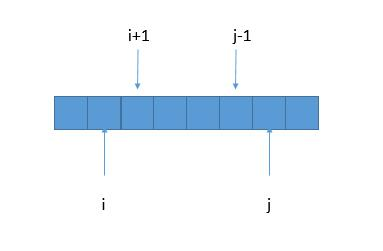
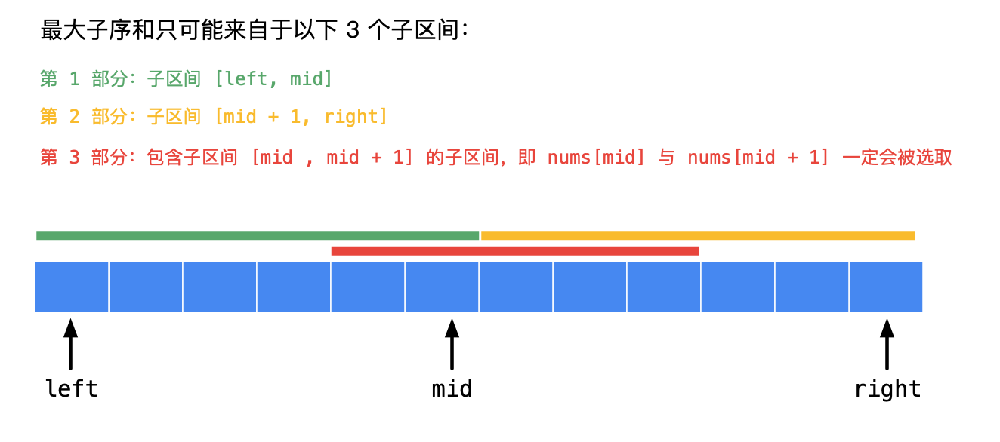

[TOC]

### 递归与动态规划题目

#### 最长回文子串

##### 1. 题目

给定一个字符串 s，找到 s 中最长的回文子串。你可以假设 s 的最大长度为 1000。

**示例 1：**

```java
输入: "babad"
输出: "bab"
```

注意: "aba" 也是一个有效答案。
**示例 2：**

```java
输入: "cbbd"
输出: "bb"
```


链接：https://leetcode-cn.com/problems/longest-palindromic-substring

##### 2. 题解

###### ① 暴力解法

暴力求解，列举所有的子串，判断是否为回文串，保存最长的回文串。

```java
public boolean isPalindromic(String s) {
    int len = s.length();
    for (int i = 0; i < len / 2; i++) {
        if (s.charAt(i) != s.charAt(len - i - 1)) {
            return false;
        }
    }
    return true;
}

// 暴力解法
public String longestPalindrome(String s) {
    String ans = "";
    int max = 0;
    int len = s.length();
    for (int i = 0; i < len; i++)
        for (int j = i + 1; j <= len; j++) {
            String test = s.substring(i, j);
            if (isPalindromic(test) && test.length() > max) {
                ans = s.substring(i, j);
                max = Math.max(max, ans.length());
            }
        }
    return ans;
}
```

时间复杂度：两层 for 循环 O(n²），for 循环里边判断是否为回文 O(n），所以时间复杂度为 O(n³）。

空间复杂度：O(1），常数个变量。

###### ② 动态规划

暴力解法时间复杂度太高，我们可以考虑，去掉一些暴力解法中重复的判断。

首先定义：字符串 s 从下标 i 到下标 j 的字串为 P(i, j)，若 s 从下标 i 到下标 j 的字串为回文串，则 P(i, j) = true，否则 P(i, j) = false。如下图所示：


则 P(i, j) = (P(i + 1, j - 1) && s[i] == s[j])。

所以如果我们想知道 P（i, j）的情况，不需要调用判断回文串的函数了，只需要知道 P（i+1，j−1）的情况就可以了，这样时间复杂度就少了 O(n)。因此我们可以用动态规划的方法，空间换时间，把已经求出的 P（i，j）存储起来。



如果 s[i+1, j-1] 是回文串，那么只要 s[i] == s[j]，就可以确定 s[i, j] 也是回文串了。

注意：

求 长度为 1 和长度为 2 的 P(i, j) 时不能用上边的公式，因为我们代入公式后会遇到 P\[i][j] 中 i > j 的情况，比如求P\[1][2] 的话，我们需要知道 P\[1+1][2-1]=P\[2][1] ，而 P\[2][1] 代表着 S[2, 1] 是不是回文串，这显然是不对的，所以我们需要单独判断。

所以我们先初始化长度是 1 的回文串的 P [i , j]，这样利用上边提出的公式 P(i,j)=(P(i+1,j-1) && S[i]==S[j])，然后两边向外各扩充一个字符，长度为 3 的，为 5 的，所有奇数长度的就都求出来了。同理，初始化长度是 2 的回文串 P[i,i+1]，利用公式，长度为 4 的，6 的所有偶数长度的就都求出来了。

```java
public static String longestPalindrome(String s) {
    int sLen = s.length();
    int maxLen = 0;
    String ans = "";
    boolean[][] P = new boolean[sLen][sLen];
    // 遍历所有长度
    for (int len = 1; len <= sLen; len++) {
        for (int start = 0; start < sLen; start++) {
            int end = start + len - 1;
            // 下标越界，结束循环
            if (end >=sLen) {
                break;
            }
            P[start][end] = (len == 1 || len == 2 || P[start + 1][end - 1]) && s.charAt(start) == s.charAt(end);
            if (P[start][end] && len > maxLen) {
                maxLen = len;
                ans = s.substring(start, end + 1);
            }
        }
    }
    return ans;
}
```

时间复杂度：两层循环 O(n²）。

空间复杂度：用二维数组 P 保存每个子串的情况 O(n²)。

下面分析空间使用情况：（以”babad“为例）


当我们求长度为 5  的子串的情况时，其实只用到了 4 长度的情况，而长度为 1 和 2  和 3 的子串情况其实已经不需要了。

但是由于我们并不是用 P 数组的下标进行的循环，暂时没有想到优化的方法。

那么我们换种思路，公式不变：

其实从递推公式中我们可以看到，我们首先知道了 i +1 才会知道 i ，所以我们只需要倒着遍历就行了。

###### ③ 中心扩展算法

我们知道回文串一定是**对称**的，所以我们可以**每次循环选择一个中心**，进行左右扩展，判断**左右字符是否相等**即可。


每个位置向两边扩散都会出现一个窗口大小（len）。如果 len>maxLen(用来表示最长回文串的长度）。则更新 maxLen 的值。
因为我们最后要返回的是具体子串，而不是长度，因此，还需要记录一下 maxLen 时的起始位置（maxStart），即此时还要 maxStart=len。


```java
public String longestPalindrome1(String s) {

    if (s == null || s.length() == 0) {
        return "";
    }
    int strLen = s.length();
    int left = 0;
    int right = 0;
    int len = 1;
    int maxStart = 0;
    int maxLen = 0;

    for (int i = 0; i < strLen; i++) {
        left = i - 1;
        right = i + 1;
        while (left >= 0 && s.charAt(left) == s.charAt(i)) {
            len++;
            left--;
        }
        while (right < strLen && s.charAt(right) == s.charAt(i)) {
            len++;
            right++;
        }
        while (left >= 0 && right < strLen && s.charAt(right) == s.charAt(left)) {
            len = len + 2;
            left--;
            right++;
        }
        if (len > maxLen) {
            maxLen = len;
            maxStart = left;
        }
        len = 1;
    }
    return s.substring(maxStart + 1, maxStart + maxLen + 1);

}
```

优化：
中心扩散的方法，其实做了很多**重复计算**。动态规划就是为了减少重复计算的问题。动态规划听起来很高大上。其实说白了就是空间换时间，将计算结果暂存起来，避免重复计算。
我们用一个 boolean **dp\[l][r] 表示字符串从 i 到 j 这段是否为回文**。试想如果 dp\[l][r]=true，我们要判断 dp\[l-1][r+1] 是否为回文。只需要判断字符串在(l-1)和（r+1)两个位置是否为相同的字符，是不是减少了很多重复计算。
进入正题，动态规划关键是找到初始状态和状态转移方程。
初始状态，l=r 时，此时 dp\[l][r]=true。
状态转移方程，dp\[l][r]=true 并且(l-1)和（r+1)两个位置为相同的字符，此时 dp\[l-1][r+1]=true。

```java
public String longestPalindrome(String s) {
    if (s == null || s.length() < 2) {
        return s;
    }
    // 字符串长度
    int strLen = s.length();
    int maxStart = 0;  // 最长回文串的起点
    int maxEnd = 0;    // 最长回文串的终点
    int maxLen = 1;    // 最长回文串的长度
	// dp数组
    boolean[][] dp = new boolean[strLen][strLen];

    for (int r = 1; r < strLen; r++) {
        for (int l = 0; l < r; l++) {
            if (s.charAt(l) == s.charAt(r) && (r - l <= 2 || dp[l + 1][r - 1])) {
                dp[l][r] = true;
                if (r - l + 1 > maxLen) {
                    maxLen = r - l + 1;
                    maxStart = l;
                    maxEnd = r;
                }
            }
        }
    }
    // 根据索引找到最长回文字符串
    return s.substring(maxStart, maxEnd + 1);
}
```

###### ④ Manacher 算法

这个就了解了。

---

#### 最大子序列和

##### 1. 题目


##### 2. 题解

###### ① 动态规划


```java
public class Solution {

    public int maxSubArray(int[] nums) {
        // 数组长度
        int len = nums.length;
        if (len == 0) {
            return 0;
        }
        // 构造dp数组 dp数组存放的是以当前索引位置结束的子数组中的最大子序列和
        int[] dp = new int[len];
        // Base case
        dp[0] = nums[0];
        // 遍历nums数组
        for (int i = 1; i < len; i++) {
            // 说明之前是正增益
            if (dp[i - 1] >= 0) {
                dp[i] = dp[i - 1] + nums[i];
            } else {
                // 直接取值
                dp[i] = nums[i];
            }
        }
        // 最后不要忘记遍历dp数组找到子序列和最大值
        int res = dp[0];
        for (int i = 1; i < len; i++) {
            res = Math.max(res, dp[i]);
        }
        return res;
    }
}
```

可以进一步压缩空间。状态压缩 , 来看看代码，我们只需要一个变量subMax保存前面子组合的最大值，另外一个max保存全局最大值。

```java
public int maxSubArray(int[] nums) {
    if (nums == null) {
        return 0;
    }
    int max = nums[0];    // 全局最大值
    int subMax = nums[0];  // 前一个子组合的最大值,状态压缩
    for (int i = 1; i < nums.length; i++) {
        if (subMax > 0) {
            // 前一个子组合最大值大于0，正增益
            subMax = subMax + nums[i];
        } else {
            // 前一个子组合最大值小于0，抛弃前面的结果
            subMax = nums[i];
        }
        // 计算全局最大值 滚动更新即可
        max = Math.max(max, subMax);
    }

    return max;
}
```

###### ② 分治法

分治法是将整个**数组切分成几个小组**，然后每个小组再切分成几个**更小的小组**，一直到不能继续切分也就是**只剩一个数字**为止。每个小组会**计算出最优值**，汇报给上一级的小组，一级一级汇报，上级拿到下级的汇报找到最大值，得到最终的结果。和**归并排序**的算法类似，先切分，再合并结果。

这个问题中的关键就是**如何切分**这些组合才能使每个小组之间**不会有重复的组合**（有重复的组合意味着有重复的计算量）。

首先是切分分组方法，就这个案例中的例子来，我们有一个数组 [-2, 1, -3, 4, -1, 2, 1, -5, 4] ，一共有 9 个元素，我们 center = (start + end) / 2 这个原则，得到中间元素的索引为 4 ，也就是 -1，拆分成**三个组合**：

- [-2, 1, -3, 4, -1] 以及它的子序列（在 -1 左边的并且包含它的为一组）。
- [2, 1, -5, 4] 以及它的子序列（在 -1 右边不包含它的为一组）。
- 任何包含 -1 以及它右边元素 2 的序列为一组（换言之就是包含左边序列的最右边元素以及右边序列最左边元素的序列，比如 [4, -1, 2, 1]，这样就保证这个组合里面的任何序列都不会和上面两个重复）。

以上的三个组合内的序列没有任何的重复的部分，而且一起构成所有子序列的全集，计算出这个三个子集合的最大值，然后取其中的最大值，就是这个问题的答案了。

然而前两个子组合可以用递归来解决，一个函数就搞定，第三个跨中心的组合应该怎么计算最大值呢？

答案就是先计算左边序列里面的包含最右边元素的子序列的最大值，也就是从左边序列的最右边元素向左一个一个累加起来，找出累加过程中每次累加的最大值，就是左边序列的最大值。

同理找出右边序列的最大值，就得到了右边子序列的最大值。左右两边的最大值相加，就是包含这两个元素的子序列的最大值。

在计算过程中，累加和比较的过程是关键操作，一个长度为 n 的数组在递归的每一层都会进行 n 次操作，分治法的递归层级在 logNlogN 级别，所以整体的时间复杂度是 O(nlogn)O(nlogn)，在时间效率上不如动态规划的 O(n)O(n) 复杂度。

分治法的思路是这样的，其实也是分类讨论。

连续子序列的最大和主要由这三部分子区间里元素的最大和得到：

- 第 1 部分：子区间 [left, mid]；
- 第 2 部分：子区间 [mid + 1, right]；
- 第 3 部分：包含子区间[mid , mid + 1]的子区间，即 nums[mid] 与nums[mid + 1]一定会被选取。

对它们三者求最大值即可。



```java
public int maxSubArray(int[] nums) {
    return maxSubArrayDivideWithBorder(nums, 0, nums.length-1);
}

private int maxSubArrayDivideWithBorder(int[] nums, int start, int end) {
    if (start == end) {
        // 只有一个元素，也就是递归的结束情况
        return nums[start];
    }

    // 计算中间值
    int center = (start + end) / 2;
    int leftMax = maxSubArrayDivideWithBorder(nums, start, center); // 计算左侧子序列最大值
    int rightMax = maxSubArrayDivideWithBorder(nums, center + 1, end); // 计算右侧子序列最大值

    // 下面计算横跨两个子序列的最大值

    // 计算包含左侧子序列最后一个元素的子序列最大值
    int leftCrossMax = Integer.MIN_VALUE; // 初始化一个值
    int leftCrossSum = 0;
    for (int i = center ; i >= start ; i --) {
        leftCrossSum += nums[i];
        leftCrossMax = Math.max(leftCrossSum, leftCrossMax);
    }

    // 计算包含右侧子序列最后一个元素的子序列最大值
    int rightCrossMax = nums[center+1];
    int rightCrossSum = 0;
    for (int i = center + 1; i <= end ; i ++) {
        rightCrossSum += nums[i];
        rightCrossMax = Math.max(rightCrossSum, rightCrossMax);
    }

    // 计算跨中心的子序列的最大值
    int crossMax = leftCrossMax + rightCrossMax;

    // 比较三者，返回最大值
    return Math.max(crossMax, Math.max(leftMax, rightMax));
}
```


