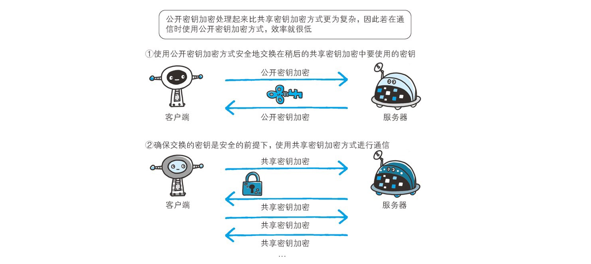

[TOC]

### HTTPS

#### HTTP的安全性问题

HTTP 有以下安全性问题：

- ①使用**明文**进行通信，内容可能会被**窃听**；
- ②**不验证**通信方的身份，通信方的身份有可能遭遇**伪装**；
- ③无法证明报文的完整性，报文有可能遭**篡改**。

HTTPS 并不是新协议，而是让 HTTP 先和 **SSL**（Secure Sockets Layer）通信，再由 **SSL 和 TCP** 通信，也就是说 HTTPS 使用了**隧道**进行通信。

通过使用 SSL，HTTPS 具有了**加密（防窃听）、认证（防伪装）和完整性保护（防篡改）**。

**==HTTP + 加密 + 认证 +  完整性保护 = HTTPS==**

以下看看 HTTPS 是**如何解决加密、认证与完整性保护**的问题。

#### 加密

##### 1. 对称密钥加密

**对称密钥加密**（Symmetric-Key Encryption），加密和解密使用**同一密钥**。

- 优点：运算速度快；
- 缺点：无法安全地将**密钥**传输给通信方。

常用的对称加密算法：**AES**、3DES。

##### 2.非对称密钥加密

非对称密钥加密，又称**公开密钥加密**（Public-Key Encryption），加密和解密使用**不同的密钥**。

非对称加密一般有两种密钥，公钥和私钥，**公钥一般用于加密，私钥一般用于解密**。

常用的非对称加密算法：**RSA**（安全基于大质数的分解难度）、ECC、SM2 等。

公开密钥所有人都可以获得，**通信发送方获得接收方的公开密钥之后，就可以==使用公开密钥进行加密==，==接收方收到通信内容后使用私有密钥解密==。**

非对称密钥除了用来**加密**，还可以用来进行**签名**。因为私有密钥无法被其他人获取，因此通信发送方使用其**==私有密钥进行签名==**，通信接收方使用发送方的公开密钥**==对签名进行解密==**，就能判断这个签名是否正确。

- 优点：可以更安全地将公开密钥传输给通信发送方；
- 缺点：运算速度慢，消耗更多的资源。

##### 3. HTTPS 采用的加密方式

HTTPS 采用==**混合的加密机制**==，**在==交换密钥==环节使用==非对称加密==（公开密钥）方式，之后建立==通信==交换报文阶段（普通数据）则使用==对称加密==（共享密钥加密）方式**。

数据通信时需要用到一个**对称加密**的密钥，但是**直接**发过去是**不安全**的，所以使用**非对称加密**的方式将需要得**对称加密密钥**发送过去。

一个非常好懂的**加密流程图**。

上述的流程还差一步，就是服务器发送**公钥**给客户端的时候，也会一起**发送 CA 数字签名**给客户端用于**认证。**（下面详述）

#### 认证

当服务器接收到客户端发来的请求时，会向客户端发送服务器自己的公钥，但是**黑客有可能中途篡改公钥**，将其改成黑客自己的，所以有个问题，客户端怎么信赖这个公钥是自己想要访问的服务器的公钥而不是黑客的呢？所以客户端也需要对服务器发送过来的公钥认证其合法性。 这时候就需要用到**数字证书**。

通过使用  **证书**  来对通信方进行认证。

数字证书认证机构（**CA**，Certificate Authority）是客户端与服务器双方**都可信赖**的第三方机构。

> **如何认证**？

① 首先阿里需要将自己的**公钥**发送给 CA 机构进行公钥申请，如果通过，则 CA 机构（CA 机构**自己也有公钥和私钥**）则利用其私钥对阿里的**公钥进行非对称加密**，这就是加密后的明文（**数字签名**）。加密完之后，得到的密文再加上证书的过期时间、颁发给、颁发者等信息，就组成了**数字证书**。（**数字证书就是数字签名加上各种附加信息**）

② 用户浏览器向阿里发起 HTTPS 连接请求，阿里会将其**公钥 + 数字证书**发送给客户端。

③ 客户端首先需要对接收到的公钥进行验证，以确保公钥是真实的且没有被人篡改。不论什么平台，设备的操作系统中都会**内置** 100 多个全球公认的 **CA 的公钥**。所以客户端使用 CA 机构的公钥对数字证书中的数字签名进行认证：

- 首先客户端会用设备中内置的 CA 的**公钥**尝试**解密数字证书**，如果所有内置的 CA 的公钥都**无法解密**该数字证书，说明该数字证书不是由一个全球知名的 CA 签发的，这样客户端就**无法信任**该服务器的**数字证书**。
- 如果有一个 CA 的公钥能够成功**解密**该数字证书，说明该数字证书就是由该 CA 的私钥**签发**的，因为被私钥加密的密文只能被与其成对的公钥解密。
- 除此之外，还需要检查客户端当前访问的服务器的域名是与数字证书中提供的“颁发给”这一项吻合，还要检查数字证书是否过期等。

只有通过**认证之后**才能继续后面的加密与通信步骤。

进行 HTTPS 通信时，服务器会把**CA 证书**发送给**客户端**。客户端取得其中的**公开密钥**之后，先使用**数字签名**进行**验证**，如果验证通过，就可以开始通信了。

下图很有趣！

#### 完整性保护

SSL 提供一种叫做 **MAC** 的==**报文摘要**==功能来进行**完整性保护**。

HTTP 也提供了 **MD5** 报文摘要功能，但不是安全的。例如报文内容被篡改之后，同时重新计算 MD5 的值，通信接收方是无法意识到发生了篡改。

HTTPS 的报文摘要功能之所以安全，是因为它结合了**加密和认证**这两个操作。试想一下，加密之后的报文，遭到篡改之后，也很难重新计算报文摘要，因为无法轻易获取明文。

#### ==HTTPS 通信流程总结==

**服务器端的公钥和私钥，用来进行非对称加密。**

**客户端生成的随机密钥，用来进行对称加密。**

一个 HTTPS 请求实际上包含了**两次 HTTP** 传输，可以细分为 8 步。

1.客户端向服务器发起 **HTTPS 请求**，连接到服务器的 **443 端口**。

2.服务器端有一个密钥对，即**公钥和私钥**，是用来进行非对称加密使用的，**服务器端保存着私钥**，不能将其泄露，公钥可以发送给任何人。

3.服务器将自己的**公钥发送给客户端**。

4.客户端收到服务器端的公钥之后，会对**公钥进行检查**，验证其**合法性**，如果发现发现公钥有问题，那么 HTTPS 传输就无法继续。严格的说，这里应该是**验证服务器发送的==数字证书==的合法性**，关于客户端如何验证数字证书的合法性，上文已经说明。如果**公钥合格**，那么**客户端**会生成一个**随机值**，这个随机值就是用于进行对称加密的**密钥**，我们将该密钥称之为 client key，即**客户端密钥**，这样在概念上和服务器端的密钥容易进行区分。然后用服务器的**公钥**对**客户端密钥进行==非对称加密==**，这样客户端密钥就变成密文了，至此，HTTPS 中的第一次 HTTP 请求结束。

5.**客户端**会发起 HTTPS 中的**第二个** HTTP 请求，将**加密之后的客户端密钥发送给服务器**。

6.服务器接收到客户端发来的密文之后，会用自己的**私钥**对其进行**非对称解密**，解密之后的明文就是**客户端密钥**，然后用客户端密钥对数据进行==**对称加密**==，这样数据就变成了**密文**。

7.然后服务器将**加密后的密文**发送给客户端。

8.客户端收到服务器发送来的密文，用客户端密钥对其进行对称解密，得到服务器发送的数据。这样 HTTPS 中的第二个 HTTP 请求结束，整个 HTTPS 传输完成。

#### HTTPS 的缺点

- 因为需要进行**加密解密**等过程，对 CPU 的额外**开销较大**，因此速度会更慢；
- 需要支付证书授权的**高额费用**。

#### TLS

##### 1. SSL 与 TLS

TLS/SSL是一种**加密通道的规范**。

- **SSL**：（Secure Socket Layer） 安全套接层，于 1994 年由网景公司设计，并于 1995 年发布了 3.0 版本。
- **TLS**：（Transport Layer Security）**传输层安全性协议**，是 IETF 在 SSL3.0 的**基础上**设计的协议。

故以下全部使用 TLS 来表示。

在**发送方**，SSL 接收**应用层**的数据，对数据进行**加密**，然后把加了密的数据送往 **TCP 套接字**。在**接收方**，SSL 从 TCP 套接字**读取**数据，**解密**后把数据交给应用层。 

