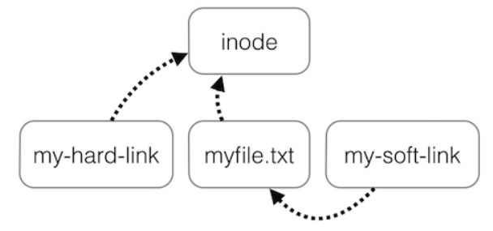
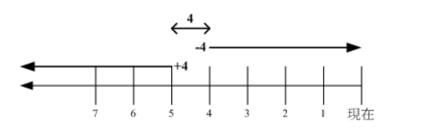

[TOC]

### 文件

#### 文件属性

用户分为三种：文件拥有者、群组以及其它人，对不同的用户有不同的文件权限。

使用 ls 查看一个文件时，会显示一个文件的信息，例如 

```shell
drwxr-xr-x 3 root root 17 May 6 00:14 .config
```

对这个信息的解释如下：

- drwxr-xr-x：文件**类型以及权限**，第 1 位为文件**类型字段**，后 9 位为文件**权限字段**
- 3：**链接数**
- root：文件**拥有者**
- root：所属**群组**
- 17：文件大小
- May 6 00:14：文件最后被修改的时间
- .config：文件名

常见的文件类型及其含义有：

- d：**目录**
- -：**文件**
- l：链接文件

9 位的文件权限字段中，每 3 个为一组，共 3 组，每一组分别代表对**文件拥有者、所属群组以及其它人**的文件权限。一组权限中的 3 位分别为 **r、w、x** 权限，表示可读、可写、可执行。

文件时间有以下三种：

- modification time (mtime)：文件的内容更新就会更新；
- status time (ctime)：文件的状态（权限、属性）更新就会更新；
- access time (atime)：读取文件时就会更新。

---

#### 链接

```shell
# ln [-sf] source_filename dist_filename
-s ：默认是 hard link，加 -s 为 symbolic link
-f ：如果目标文件存在时，先删除目标文件
```



##### 1. 实体链接（硬链接）

在目录下创建一个条目，记录着文件名与 inode 编号，这个 inode 就是**源文件的 inode**。

**删除任意一个**条目，文件还是**存在**，只要**引用数量不为 0**。

有以下限制：**不能跨越文件系统、不能对目录进行链接**。

```bash
# ln /etc/crontab .
# ll -i /etc/crontab crontab
34474855 -rw-r--r--. 2 root root 451 Jun 10 2014 crontab
34474855 -rw-r--r--. 2 root root 451 Jun 10 2014 /etc/crontab
```

##### 2. 符号链接（软链接）

符号链接文件保存着**源文件所在的绝对路径**，在读取时会定位到**源文件**上，可以理解为 **Windows 的快捷方式。**

当**源文件**被删除了，链接文件就**打不开**了。

因为记录的是**路径**，所以可以为**==目录==建立链接**。

```bash
# ll -i /etc/crontab /root/crontab2
34474855 -rw-r--r--. 2 root root 451 Jun 10 2014 /etc/crontab
53745909 lrwxrwxrwx. 1 root root 12 Jun 23 22:31 /root/crontab2 -> /etc/crontab
```

---

#### 文件权限

##### 1. 修改权限

可以将一组权限用数字来表示，此时一组权限的 3 个位当做二进制数字的位，从左到右每个位的权值为 4、2、1，即每个权限对应的**数字权值为 r : 4、w : 2、x : 1**。

```bash
# chmod [-R] xyz dirname/filename
```

示例：将 .bashrc 文件的权限修改为 **-rwxr-xr--。**

```bash
# chmod 754 .bashrc
```

也可以使用**符号**来设定权限。

```bash
# chmod [ugoa]  [+-=] [rwx] dirname/filename
- u：拥有者
- g：所属群组
- o：其他人
- a：所有人
- +：添加权限
- -：移除权限
- =：设定权限
```

示例：为 .bashrc 文件的所有用户添加写权限。

```bash
# chmod a+w .bashrc
```

##### 2.文件默认权限

- **文件**默认权限：文件**默认没有可执行权限**，因此为 **666**，也就是 ==-rw-rw-rw-== 。
- **目录**默认权限：目录必须要能够进入，也就是必须拥有可执行权限，因此为 **777** ，也就是 ==drwxrwxrwx==。

可以通过 **umask** 设置或者查看文件的**默认权限**，通常以掩码的形式来表示，例如 002 表示其它用户的权限去除了一个 2 的权限，也就是写权限，因此建立新文件时默认的权限为 -rw-rw-r--。

##### 3. 目录的权限

**文件名不是存储在一个文件的内容中，而是存储在一个文件所在的目录中**。因此，拥有文件的 **w 权限并不能对文件名进行修改**。文件名是存放在目录的 block 中的，所以要新增、删除、修改文件名需要**目录的 w 权限**。

==目录存储文件列表，一个目录的权限也就是对其**文件列表**的权限==。

因此，目录的 **r 权限**表示可以读取文件列表；

**w 权限**表示可以**修改**文件列表，就是添加、删除文件、对文件名**进行修改**；

**x 权限**可以让该目录成为工作目录（表示可以进入这个目录），x **权限是 r 和 w 权限**的**基础**，如果这个目录都不能进，也就没办法读取文件列表以及对文件列表进行修改了。

---

#### 文件与目录的基本操作

##### 1. ls

列出文件或者目录的信息，目录的信息就是其中包含的文件。

```shell
# ls [-aAdfFhilnrRSt] file|dir
-a ：列出全部的文件
-d ：仅列出目录本身
-l ：以长数据串行列出，包含文件的属性与权限等等数据
```

##### 2. cd

更换当前目录。

```shell
cd [相对路径或绝对路径]
cd # 进入home目录
```

##### 3. mkdir

创建目录。

```shell
# mkdir [-mp] 目录名称
-m ：配置目录权限
-p ：递归创建目录
```

##### 4. rmdir

删除目录，目录**必须为空**。

```bash
rmdir [-p] 目录名称
-p ：递归删除目录
```

##### 5. touch

更新**文件时间**或者**建立新文件**。

```bash
# touch [-acdmt] filename
-a ： 更新 atime
-c ： 更新 ctime，若该文件不存在则不建立新文件
-m ： 更新 mtime
-d ： 后面可以接更新日期而不使用当前日期，也可以使用 --date="日期或时间"
-t ： 后面可以接更新时间而不使用当前时间，格式为[YYYYMMDDhhmm]
```

##### 6. cp

**复制文件**。

如果源文件有两个以上，则目的文件一定要是**目录**才行。

```bash
cp [-adfilprsu] source destination
-a ：相当于 -dr --preserve=all 的意思，至于 dr 请参考下列说明
-d ：若来源文件为链接文件，则复制链接文件属性而非文件本身
-i ：若目标文件已经存在时，在覆盖前会先询问
-p ：连同文件的属性一起复制过去
-r ：递归持续复制
-u ：destination 比 source 旧才更新 destination，或 destination 不存在的情况下才复制
--preserve=all ：除了 -p 的权限相关参数外，还加入 SELinux 的属性, links, xattr 等也复制了
```

##### 7. rm

**删除**文件。

```bash
# rm [-fir] 文件或目录
-r ：递归删除
```

##### 8. mv

**移动**文件。

```bash
# mv [-fiu] source destination
# mv [options] source1 source2 source3 .... directory
-f ： force 强制的意思，如果目标文件已经存在，不会询问而直接覆盖
```

----

#### 获取文件内容

##### 1. cat

取得文件内容。

```bash
# cat [-AbEnTv] filename
-n ：打印出行号，连同空白行也会有行号，-b 不会
```

##### 2. tac

是 cat 的**反向操作**，从最后一行开始打印。

##### 3. more

和 cat 不同的是它可以**一页一页**查看文件内容，比较适合大文件的查看。

##### 4. less

和 more 类似，但是多了一个向前翻页的功能。

##### 5. head

取得文件**前几行**。

```bash
# head [-n number] filename
-n ：后面接数字，代表显示几行的意思
```

##### 6. tail

是 head 的反向操作，只是取得是**后几行**。

##### 7. od

以字符或者十六进制的形式显示二进制文件。

----

#### 指令与文件搜索

##### 1. which

**指令搜索**。

```bash
# which [-a] command
-a ：将所有指令列出，而不是只列第一个
```

##### 2. whereis

**文件搜索**。速度比较快，因为它只搜索**几个特定的目录**。

```bash
# whereis [-bmsu] dirname/filename
```

##### 3. locate

**文件搜索**。可以用关键字或者正则表达式进行搜索。

locate 使用 /var/lib/mlocate/ 这个数据库来进行搜索，它存储在内存中，并且每天**更新一次**，所以无法用 locate 搜索新建的文件。可以使用 updatedb 来立即更新数据库。

```bash
# locate [-ir] keyword
-r：正则表达式
```

##### 4. find

**文件搜索**。可以使用文件的属性和权限进行搜索。

```bash
# find [basedir] [option]
example: find . -name "shadow*"
```

**① 与时间有关的选项** 

```bash
-mtime  n ：列出在 n 天前的那一天修改过内容的文件
-mtime +n ：列出在 n 天之前 (不含 n 天本身) 修改过内容的文件
-mtime -n ：列出在 n 天之内 (含 n 天本身) 修改过内容的文件
-newer file ： 列出比 file 更新的文件
```

+4、4 和 -4 的指示的时间范围如下：



**② 与文件拥有者和所属群组有关的选项** 

```bash
-uid n
-gid n
-user name
-group name
-nouser ：搜索拥有者不存在 /etc/passwd 的文件
-nogroup：搜索所属群组不存在于 /etc/group 的文件
```

**③ 与文件权限和名称有关的选项** 

```bash
-name filename
-size [+-]SIZE：搜寻比 SIZE 还要大 (+) 或小 (-) 的文件。这个 SIZE 的规格有：c: 代表 byte，k: 代表 1024bytes。所以，要找比 50KB 还要大的文件，就是 -size +50k
-type TYPE
-perm mode  ：搜索权限等于 mode 的文件
-perm -mode ：搜索权限包含 mode 的文件
-perm /mode ：搜索权限包含任一 mode 的文件
```


