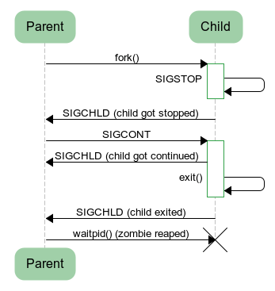

[TOC]

### Linux系统管理

#### Linux启动流程

大体过程如下。

- 内核的引导。
- 运行 init。
- 系统初始化。
- 建立终端 。
- 用户登录系统。

##### 1. 内核引导

当计算机打开电源后，首先是 **BIOS 开机自检**，按照 BIOS 中设置的启动设备（通常是硬盘）来启动。自检完成后从 **MBR（主引导记录）** 中读取 BootLoader（启动引导程序），Linux 中最常见的 BootLoader 就是 GRUB。

启动引导程序用于**加载系统内核**。

操作系统接管硬件以后，首先**读入 /boot 目录下的内核文件**。

##### 2. 运行init

内核加载完毕，会完成硬件检测和驱动程序加载。完成之后则会运行第一个进程，也就是 **/sbin/init**。

**init 进程**是系统所有进程的**起点**，你可以把它比拟成系统所有进程的老祖宗，没有这个进程，系统中任何进程都不会启动。

init 程序首先是需要**读取配置文件 /etc/inittab**。

配置文件就各种调用进行设置。

##### 3. 系统初始化

许多程序需要开机启动。它们在 Windows 叫做"服务"（service），在 Linux 就叫做"守护进程"（daemon）。

init 进程的一大任务，就是去运行这些**开机启动的程序**。

但是，不同的场合需要启动不同的程序，比如用作服务器时，需要启动 Apache，用作桌面就不需要。

Linux 允许为不同的场合，分配不同的开机启动程序，这就叫做"**运行级别**"（runlevel）。也就是说，启动时根据"运行级别"，确定要运行哪些程序。

Linux 系统有 7 个运行级别(runlevel)：

- 运行级别 0：系统停机状态，系统默认运行级别不能设为 0，否则不能正常启动。
- 运行级别 1：单用户工作状态，root 权限，用于系统维护，禁止远程登陆。
- 运行级别 2：多用户状态(没有 NFS)。
- 运行级别 3：完全的多用户状态(有 NFS)，登陆后进入控制台命令行模式。
- 运行级别 4：系统未使用，保留。
- 运行级别 5：X11 控制台，登陆后进入图形 GUI 模式。
- 运行级别 6：系统正常关闭并重启，默认运行级别不能设为 6，否则不能正常启动。

在 init 的配置文件中有这么一行： **si::sysinit:/etc/rc.d/rc.sysinit**　

它调用执行了 **/etc/rc.d/rc.sysinit**，而 rc.sysinit 是一个 bash shell 的脚本，它主要是**完成一些系统初始化**的工作， rc.sysinit 是每一个运行级别都要首先运行的重要脚本。

它主要完成的工作有：激活交换分区，检查磁盘，加载硬件模块以及其它一些需要优先执行任务。

```
l5:5:wait:/etc/rc.d/rc 5
```

这一行表示以 5 为参数运行 **/etc/rc.d/rc**，/etc/rc.d/rc 是一个 Shell 脚本，它接受 5 作为参数，去执行 /etc/rc.d/rc5.d/ 目录下的**所有的 rc 启动脚本**，/etc/rc.d/rc5.d/ 目录中的这些启动脚本实际上都是一些连接文件，而不是真正的 rc 启动脚本，真正的 rc 启动脚本实际上都是放在 **/etc/rc.d/init.d/** 目录下。

而这些 rc 启动脚本有着类似的用法，它们一般能接受 start、stop、restart、status 等参数。

/etc/rc.d/rc5.d/ 中的 rc 启动脚本通常是 K 或 S 开头的连接文件，对于以 S 开头的启动脚本，将以 start 参数来运行。

而如果发现存在相应的脚本也存在 K 打头的连接，而且已经处于运行态了(以 /var/lock/subsys/ 下的文件作为标志)，则将首先以 stop 为参数停止这些已经启动了的守护进程，然后再重新运行。

这样做是为了保证是当 **init** 改变运行级别时，所有相关的守护进程都将重启。

至于在每个运行级中将运行哪些守护进程，用户可以通过 chkconfig 或 setup 中的 "System Services" 来自行设定。

##### 4. 建立终端

rc 执行完毕后，返回 init。这时基本系统环境已经设置好了，各种守护进程也已经启动了。

init 接下来会打开 6 个终端，以便用户登录系统。在 inittab 中的以下 6 行就是定义了 6 个终端：

```java
1:2345:respawn:/sbin/mingetty tty1
2:2345:respawn:/sbin/mingetty tty2
3:2345:respawn:/sbin/mingetty tty3
4:2345:respawn:/sbin/mingetty tty4
5:2345:respawn:/sbin/mingetty tty5
6:2345:respawn:/sbin/mingetty tty6
```


#### Linux 进程管理

##### 1. 查看进程

###### ① ps

查看某个时间点的**进程信息**。

示例一：查看自己的进程

```sh
# ps -l
```

示例二：查看系统所有进程

```sh
[nano@localhost ~]$ ps aux
USER        PID %CPU %MEM    VSZ   RSS TTY      STAT START   TIME COMMAND
root          1  0.0  0.0 128116  6664 ?        Ss   May14   0:08 /usr/lib/systemd/systemd --system --deserialize 18
root          2  0.0  0.0      0     0 ?        S    May14   0:00 [kthreadd]
root          3  0.0  0.0      0     0 ?        S    May14   0:00 [ksoftirqd/0]
root          5  0.0  0.0      0     0 ?        S<   May14   0:00 [kworker/0:0H]
root          7  0.0  0.0      0     0 ?        S    May14   0:03 [migration/0]
root          8  0.0  0.0      0     0 ?        S    May14   0:00 [rcu_bh]
root          9  0.0  0.0      0     0 ?        S    May14   5:05 [rcu_sched]
root         10  0.0  0.0      0     0 ?        S<   May14   0:00 [lru-add-drain]
root         11  0.0  0.0      0     0 ?        S    May14   0:03 [watchdog/0]
root         12  0.0  0.0      0     0 ?        S    May14   0:03 [watchdog/1]
root         13  0.0  0.0      0     0 ?        S    May14   0:02 [migration/1]
root         14  0.0  0.0      0     0 ?        S    May14   0:04 [ksoftirqd/1]
root         16  0.0  0.0      0     0 ?        S<   May14   0:00 [kworker/1:0H]
root         18  0.0  0.0      0     0 ?        S    May14   0:00 [kdevtmpfs]
root         19  0.0  0.0      0     0 ?        S<   May14   0:00 [netns]
```

示例三：查看**特定的进程**

```sh
# ps aux | grep threadx
```

###### ② pstree

查看**进程树**。

示例：查看所有进程树

```sh
# pstree -A
```

###### ③ top

**实时显示进程信息**。包含任务队列信息、进程信息、CPU 信息、物理内存信息、交换分区信息。

示例：两秒钟刷新一次

```sh
$ top -d 2
```

指定查看某个进程

```basic
$ top -p 14253
```

###### ④ netstat

查看**占用端口的进程**

示例：查看特定端口的进程

```sh
# netstat -anp | grep port
```

##### 2. 进程状态

| 状态 | 说明                                                         |
| :--: | ------------------------------------------------------------ |
|  R   | running or runnable (on run queue)                           |
|  D   | uninterruptible sleep (usually I/O)                          |
|  S   | interruptible sleep (waiting for an event to complete)       |
|  Z   | zombie (terminated but not reaped by its parent)             |
|  T   | stopped (either by a job control signal or because it is being traced) |


##### 3. SIGCHLD

当一个子进程改变了它的状态时（停止运行，继续运行或者退出），有两件事会发生在父进程中：

- 得到 **SIGCHLD** 信号；
- waitpid() 或者 wait() 调用会返回。

其中子进程发送的 SIGCHLD 信号包含了子进程的信息，比如进程 ID、进程状态、进程使用 CPU 的时间等。

在子进程退出时，它的进程描述符不会立即释放，这是为了让父进程得到子进程信息，父进程通过 wait() 和 waitpid() 来获得一个已经退出的子进程的信息。



##### 4. wait()

```c
pid_t wait(int *status)
```

父进程调用 wait() 会一直阻塞，直到收到一个子进程退出的 SIGCHLD 信号，之后 wait() 函数会销毁子进程并返回。

如果成功，返回被收集的子进程的进程 ID；如果调用进程没有子进程，调用就会失败，此时返回 -1，同时 errno 被置为 ECHILD。

参数 status 用来保存被收集的子进程退出时的一些状态，如果对这个子进程是如何死掉的毫不在意，只想把这个子进程消灭掉，可以设置这个参数为 NULL。

##### 5. waitpid()

```c
pid_t waitpid(pid_t pid, int *status, int options)
```

作用和 wait() 完全相同，但是多了两个可由用户控制的参数 pid 和 options。

pid 参数指示一个子进程的 ID，表示只关心这个子进程退出的 SIGCHLD 信号。如果 pid=-1 时，那么和 wait() 作用相同，都是关心所有子进程退出的 SIGCHLD 信号。

options 参数主要有 WNOHANG 和 WUNTRACED 两个选项，WNOHANG 可以使 waitpid() 调用变成非阻塞的，也就是说它会立即返回，父进程可以继续执行其它任务。

##### 6. 孤儿进程

一个**父进程**退出，而它的一个或多个子进程还在运行，那么这些子进程将成为孤儿进程。

孤儿进程将被 **init 进程**（进程号为 1）所收养，并由 init 进程对它们完成状态收集工作。

由于孤儿进程会被 init 进程收养，所以孤儿进程不会对系统造成危害。

##### 7. 僵尸进程

一个子进程的进程描述符在子进程退出时不会释放，只有当父进程通过 wait() 或 waitpid() 获取了子进程信息后才会释放。如果子进程退出，而父进程并没有调用 wait() 或 waitpid()，那么子进程的**进程描述符**仍然保存在系统中，这种进程称之为僵尸进程。

僵尸进程通过 ps 命令显示出来的状态为 **Z（zombie）**。

系统所能使用的进程号是有限的，如果产生大量僵尸进程，将因为没有可用的进程号而导致系统不能产生新的进程。

要**消灭**系统中大量的僵尸进程，只需要将其**父进程**杀死，此时僵尸进程就会变成孤儿进程，从而被 init 进程所收养，这样 init 进程就会释放所有的僵尸进程所占有的资源，从而结束僵尸进程。

##### 8. 关闭进程

###### ① kill命令

关掉进程。

命令格式：

```bash
$ kill [信号] PID
```

进程信息常用 1, 9，15。

只能识别进程号。

###### ② killall命令

关掉进程。使用**进程名**杀死进程。

##### 9. 进程优先级

表示进程优先级的参数有 **Priority 和 Nice**。

```bash
[nano@localhost ~]$ ps -el
F S   UID    PID   PPID  C PRI  NI ADDR SZ WCHAN  TTY          TIME CMD
4 S     0      1      0  0  80   0 - 32029 ep_pol ?        00:00:08 systemd
1 S     0      2      0  0  80   0 -     0 kthrea ?        00:00:00 kthreadd
1 S     0      3      2  0  80   0 -     0 smpboo ?        00:00:00 ksoftirqd/0
1 S     0      5      2  0  60 -20 -     0 worker ?        00:00:00 kworker/0:0H
```

这里 PRI 和 NI 就是这两个参数。数值越小优先级越高，PRI 是内核动态调整的，普通用户只能调整 NI 值，且只能增大。仅 root 用户可以将 NI 值设为负值。

nice 命令可以给新执行的命令直接赋予 NI 值，但是不能修改已经存在进程的 NI 值。

关闭 Apache 服务并重启设置优先级为 5.

```bash
$ service http stop
$ nice -n -5 service httpd start
```

renice 命令可以给已经存在的进程设置优先级。

```bash
renice -10 12345
```


#### 系统资源

##### 1. vmstat命令

用于监控系统资源，可以监控 CPU 使用、进程状态、内存使用等信息。

```bash
[nano@localhost ~]$ vmstat
procs -----------memory---------- ---swap-- -----io---- -system-- ------cpu-----
 r  b   swpd   free   buff  cache   si   so    bi    bo   in   cs us sy id wa st
 1  0      0 3245952   4172 3792448    0    0     0     4    5   26  0  0 99  0  0
```

##### 2. free命令

查看内存使用状态。

```bash
[nano@localhost ~]$ free
              total        used        free      shared  buff/cache   available
Mem:        7990280      947708     3245952       12108     3796620     6724556
Swap:       2519036           0     2519036
```

##### 3. 查看CPU信息

CPU 主要信息保存在 **/proc/cpuinfo** 这个文件中。查看就行。


#### 开机启动

假如我们装了一个 zookeeper，我们每次开机到要求其自动启动该怎么办？

1. 新建一个脚本 zookeeper
2. 为新建的脚本 zookeeper 添加可执行权限，命令是: `chmod +x zookeeper`
3. 把 zookeeper 这个脚本添加到开机启动项里面，命令是：` chkconfig --add  zookeeper`
4. 如果想看看是否添加成功，命令是：`chkconfig --list`


#### 网络

**网络通信命令：**

- 查看当前系统的**网卡**信息：**ifconfig**
- 查看与某台机器的连接情况：ping 
- 查看当前系统的**端口**使用：**netstat -an**