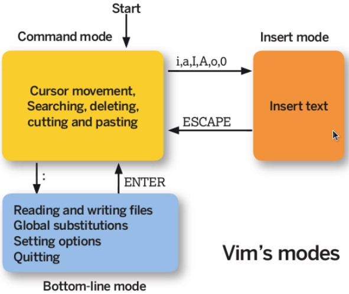

[TOC]

### Linux常用操作

#### 快捷键

- Tab：命令和文件名补全；
- Ctrl+C：**中断**正在运行的程序；
- Ctrl+D：结束键盘输入（End Of File，EOF）

---

#### 求助

##### 1. --help

指令的基本用法与选项介绍。

##### 2. man

man 是 manual 的缩写，将指令的具体信息显示出来。

当执行 `man date` 时，有 DATE(1) 出现，其中的数字代表指令的类型，常用的数字及其类型如下：

| 代号 | 类型                                            |
| :--: | ----------------------------------------------- |
|  1   | 用户在 shell 环境中可以操作的指令或者可执行文件 |
|  5   | 配置文件                                        |
|  8   | 系统管理员可以使用的管理指令                    |

##### 3. info

info 与 man 类似，但是 info 将文档分成一个个页面，每个页面可以进行跳转。

##### 4. doc

/usr/share/doc 存放着软件的一整套说明文件。

---

#### 关机

##### 1. who

在关机前需要先使用 who 命令查看有没有其它用户在线。

##### 2. sync

为了**加快对磁盘文件的读写速度**，位于内存中的文件数据不会立即同步到磁盘上，因此关机之前需要先进行 **sync 同步**操作。

##### 3. shutdown

```html
# shutdown [-krhc] 时间 [信息]
-k ： 不会关机，只是发送警告信息，通知所有在线的用户
-r ： 将系统的服务停掉后就重新启动
-h ： 将系统的服务停掉后就立即关机
-c ： 取消已经在进行的 shutdown 指令内容
```

---

#### ==PATH==

可以在环境变量 PATH 中声明**可执行文件的路径**，路径之间用 **:** 分隔。

```html
/usr/local/bin:/usr/bin:/usr/local/sbin:/usr/sbin:/home/dmtsai/.local/bin:/home/dmtsai/bin
```

-----

#### sudo

sudo 允许一般用户使用 root 可执行的命令，不过只有在 /etc/sudoers 配置文件中添加的用户才能使用该指令。

----

#### 包管理工具

**RPM** 和 **DPKG** 为最常见的两类软件包管理工具：

- RPM 全称为 Redhat Package Manager，最早由 Red Hat 公司制定实施，随后被 GNU 开源操作系统接受并成为很多 Linux 系统 (RHEL) 的既定软件标准。
- 与 RPM 竞争的是基于 Debian 操作系统 (Ubuntu) 的 DEB 软件包管理工具 DPKG，全称为 **Debian Package**，功能方面与 RPM 相似。

YUM 基于 RPM，具有依赖管理和软件升级功能。

----

#### 发行版

Linux 发行版是 Linux 内核及各种应用软件的集成版本。

| 基于的包管理工具 | 商业发行版 |   社区发行版    |
| :--------------: | :--------: | :-------------: |
|       RPM        |  Red Hat   | Fedora / CentOS |
|       DPKG       |   Ubuntu   |     Debian      |

---

#### VIM 三个模式

- 一般指令模式（Command mode）：VIM 的默认模式，可以用于移动游标查看内容；
- 编辑模式（Insert mode）：按下 "i" 等按键之后进入，可以对文本进行编辑；
- 指令列模式（Bottom-line mode）：按下 ":" 按键之后进入，用于保存退出等操作。




在指令列模式下，有以下命令用于离开或者保存文件。

| 命令 |                             作用                             |
| :--: | :----------------------------------------------------------: |
|  :w  |                           写入磁盘                           |
| :w!  | 当文件为只读时，强制写入磁盘。到底能不能写入，与用户对该文件的权限有关 |
|  :q  |                             离开                             |
| :q!  |                        强制离开不保存                        |
| :wq  |                      **写入磁盘后离开**                      |
| :wq! |                      强制写入磁盘后离开                      |

----

#### GNU

GNU 计划，译为革奴计划，它的目标是创建一套完全自由的操作系统，称为 GNU，其内容软件完全以 **GPL** 方式发布。其中 GPL 全称为 GNU 通用公共许可协议，包含了以下内容：

- 以任何目的运行此程序的自由；
- 再复制的自由；
- 改进此程序，并公开发布改进的自由。

---

#### 压缩

##### 压缩文件名

Linux 底下有很多压缩文件名，常见的如下：

|   扩展名   |                 压缩程序                 |
| :--------: | :--------------------------------------: |
|    \*.Z    |                 compress                 |
|   \*.zip   |                   zip                    |
|   \*.gz    |                 **gzip**                 |
|   \*.bz2   |                  bzip2                   |
|   \*.xz    |                    xz                    |
|   \*.tar   | tar 程序**打包**的数据，**没有经过压缩** |
| \*.tar.gz  | **tar 程序打包的文件，经过 gzip 的压缩** |
| \*.tar.bz2 |  tar 程序打包的文件，经过 bzip2 的压缩   |
| \*.tar.xz  |    tar 程序打包的文件，经过 xz 的压缩    |


##### 压缩指令

###### 1. gzip

gzip 是 Linux 使用最广的压缩指令，可以解开 compress、zip 与 gzip 所压缩的文件。

经过 gzip 压缩过，源文件就**不存在**了。

有 9 个不同的压缩等级可以使用。

可以使用 zcat、zmore、zless 来读取压缩文件的内容。

```bash
$ gzip [-cdtv#] filename
-c ：将压缩的数据输出到屏幕上
-d ：解压缩
-t ：检验压缩文件是否出错
-v ：显示压缩比等信息
-# ： # 为数字的意思，代表压缩等级，数字越大压缩比越高，默认为 6
```

###### 2. bzip2

提供比 gzip 更高的压缩比。

查看命令：bzcat、bzmore、bzless、bzgrep。

```bash
$ bzip2 [-cdkzv#] filename
-k ：保留源文件
```

###### 3. xz

提供比 bzip2 更佳的压缩比。

可以看到，gzip、bzip2、xz 的压缩比不断优化。不过要注意的是，压缩比越高，压缩的时间也越长。

查看命令：xzcat、xzmore、xzless、xzgrep。

```bash
$ xz [-dtlkc#] filename
```

----

#### 打包

压缩指令只能对一个文件进行压缩，而打包能够将多个文件打包成**一个大文件**。tar 不仅可以用于打包，也可以使用 gzip、bzip2、xz 将打包文件进行压缩。

```bash
$ tar [-z|-j|-J] [cv] [-f 新建的 tar 文件] filename...  ==打包压缩
$ tar [-z|-j|-J] [tv] [-f 已有的 tar 文件]              ==查看
$ tar [-z|-j|-J] [xv] [-f 已有的 tar 文件] [-C 目录]     ==解压缩
-z ：使用 zip；
-j ：使用 bzip2；
-J ：使用 xz；
-c ：新建打包文件；
-t ：查看打包文件里面有哪些文件；
-x ：解打包或解压缩的功能；
-v ：在压缩/解压缩的过程中，显示正在处理的文件名；
-f : filename：要处理的文件；
-C 目录 ： 在特定目录解压缩。
```

| 使用方式 |                         命令                          |
| :------: | :---------------------------------------------------: |
| 打包压缩 | tar -jcv -f filename.tar.bz2 要被压缩的文件或目录名称 |
|  查 看   |             tar -jtv -f filename.tar.bz2              |
|  解压缩  |    tar -jxv -f filename.tar.bz2 -C 要解压缩的目录     |


#### 管道指令

管道是将一个命令的标准输出作为另一个命令的标准输入，在数据需要经过多个步骤的处理之后才能得到我们想要的内容时就可以使用管道。

在命令之间使用 **==| 分隔==**各个管道命令。

```bash
$ ls -al /etc | less
```

---

#### 提取指令

**cut** 对数据进行**切分**，取出想要的部分。

切分过程**一行一行**地进行。

```bash
$ cut
-d ：分隔符
-f ：经过 -d 分隔后，使用 -f n 取出第 n 个区间
-c ：以字符为单位取出区间
```

示例 1：last 显示登入者的信息，取出用户名。

```bash
$ last
root pts/1 192.168.201.101 Sat Feb 7 12:35 still logged in
root pts/1 192.168.201.101 Fri Feb 6 12:13 - 18:46 (06:33)
root pts/1 192.168.201.254 Thu Feb 5 22:37 - 23:53 (01:16)

$ last | cut -d ' ' -f 1
```

示例 2：将 export 输出的信息，取出第 12 字符以后的所有字符串。

```bash
$ export
declare -x HISTCONTROL="ignoredups"
declare -x HISTSIZE="1000"
declare -x HOME="/home/dmtsai"
declare -x HOSTNAME="study.centos.vbird"
.....(其他省略).....

$ export | cut -c 12-
```

---

#### 排序指令

**sort**  用于排序。

```bash
$ sort [-fbMnrtuk] [file or stdin]
-f ：忽略大小写
-b ：忽略最前面的空格
-M ：以月份的名字来排序，例如 JAN，DEC
-n ：使用数字
-r ：反向排序
-u ：相当于 unique，重复的内容只出现一次
-t ：分隔符，默认为 tab
-k ：指定排序的区间
```

示例：/etc/passwd 文件内容以 : 来分隔，要求以第三列进行排序。

```bash
$ cat /etc/passwd | sort -t ':' -k 3
root:x:0:0:root:/root:/bin/bash
dmtsai:x:1000:1000:dmtsai:/home/dmtsai:/bin/bash
alex:x:1001:1002::/home/alex:/bin/bash
arod:x:1002:1003::/home/arod:/bin/bash
```

**uniq**  可以将重复的数据只取一个。

```bash
$ uniq [-ic]
-i ：忽略大小写
-c ：进行计数
```

示例：取得每个人的登录总次数

```bash
$ last | cut -d ' ' -f 1 | sort | uniq -c
1
6 (unknown
47 dmtsai
4 reboot
7 root
1 wtmp
```

----

#### 双向输出重定向

输出重定向会将输出内容重定向到文件中，而  **tee**  不仅能够完成这个功能，还能保留屏幕上的输出。也就是说，使用 tee 指令，一个输出会同时传送到文件和屏幕上。

```bash
$ tee [-a] file
```

---

#### 字符转换指令

**tr**  用来删除一行中的字符，或者对字符进行**替换**。

```bash
$ tr [-ds] SET1 ...
-d ： 删除行中 SET1 这个字符串
```

示例，将 last 输出的信息所有小写转换为大写。

```bash
$ last | tr '[a-z]' '[A-Z]'
```

 **col**  将 tab 字符转为空格字符。

```bash
$ col [-xb]
-x ： 将 tab 键转换成对等的空格键
```

**expand**  将 tab 转换一定数量的空格，默认是 8 个。

```bash
$ expand [-t] file
-t ：tab 转为空格的数量
```

**join**  将有相同数据的那一行**合并**在一起。

```bash
$ join [-ti12] file1 file2
-t ：分隔符，默认为空格
-i ：忽略大小写的差异
-1 ：第一个文件所用的比较字段
-2 ：第二个文件所用的比较字段
```

**paste**  直接将两行粘贴在一起。

```bash
$ paste [-d] file1 file2
-d ：分隔符，默认为 tab
```

-----

#### 分区指令

**split**  将一个文件划分成多个文件。

```bash
$ split [-bl] file PREFIX
-b ：以大小来进行分区，可加单位，例如 b, k, m 等
-l ：以行数来进行分区。
- PREFIX ：分区文件的前导名称
```

----

#### grep

g/re/p（globally search a regular expression and print)，使用**正则表示式**进行**全局查找**并打印。

```bash
$ grep [-acinv] [--color=auto] 搜寻字符串 filename
-c ： 统计个数
-i ： 忽略大小写
-n ： 输出行号
-v ： 反向选择，也就是显示出没有 搜寻字符串 内容的那一行
--color=auto ：找到的关键字加颜色显示
```

示例：把含有 the 字符串的行提取出来（注意默认会有 --color=auto 选项，因此以下内容在 Linux 中有颜色显示 the 字符串）

```shell
$ grep -n 'the' regular_express.txt
8:I can't finish the test.
12:the symbol '*' is represented as start.
15:You are the best is mean you are the no. 1.
16:The world Happy is the same with "glad".
18:google is the best tools for search keyword
```

因为 { 和 } 在 shell 是有特殊意义的，因此必须要使用转义字符进行转义。

```bash
$ grep -n 'go\{2,5\}g' regular_express.txt
```

---

#### printf

用于格式化输出。它不属于管道命令，在给 printf 传数据时需要使用 $( ) 形式。

```bash
$ printf '%10s %5i %5i %5i %8.2f \n' $(cat printf.txt)
    DmTsai    80    60    92    77.33
     VBird    75    55    80    70.00
       Ken    60    90    70    73.33
```

----

#### awk

是由 Alfred Aho，Peter Weinberger, 和 Brian Kernighan 创造，awk 这个名字就是这三个创始人名字的首字母。

awk 每次处理**一行**，处理的最小单位是**字段**，每个字段的命名方式为：\$n，n 为字段号，从 1 开始，\$0 表示一整行。

示例：取出最近五个登录用户的用户名和 IP

```bash
$ last -n 5
dmtsai pts/0 192.168.1.100 Tue Jul 14 17:32 still logged in
dmtsai pts/0 192.168.1.100 Thu Jul 9 23:36 - 02:58 (03:22)
dmtsai pts/0 192.168.1.100 Thu Jul 9 17:23 - 23:36 (06:12)
dmtsai pts/0 192.168.1.100 Thu Jul 9 08:02 - 08:17 (00:14)
dmtsai tty1 Fri May 29 11:55 - 12:11 (00:15)
```

```bash
$ last -n 5 | awk '{print $1 "\t" $3}'
```

可以根据字段的某些条件进行匹配，例如匹配字段小于某个值的那一行数据。

```bash
$ awk '条件类型 1 {动作 1} 条件类型 2 {动作 2} ...' filename
```

示例：/etc/passwd 文件第三个字段为 UID，对 UID 小于 10 的数据进行处理。

```bash
$ cat /etc/passwd | awk 'BEGIN {FS=":"} $3 < 10 {print $1 "\t " $3}'
root 0
bin 1
daemon 2
```

**awk 变量：**

| 变量名称 |           代表意义           |
| :------: | :--------------------------: |
|    NF    |     每一行拥有的字段总数     |
|    NR    |   目前所处理的是第几行数据   |
|    FS    | 目前的分隔字符，默认是空格键 |

示例：显示正在处理的行号以及每一行有多少字段

```bash
$ last -n 5 | awk '{print $1 "\t lines: " NR "\t columns: " NF}'
dmtsai lines: 1 columns: 10
dmtsai lines: 2 columns: 10
dmtsai lines: 3 columns: 10
dmtsai lines: 4 columns: 10
dmtsai lines: 5 columns: 9
```

---

