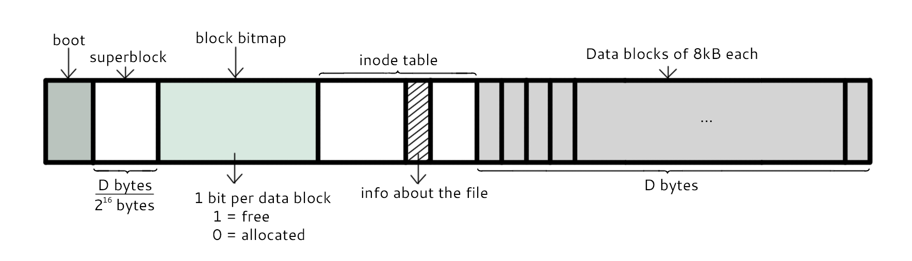
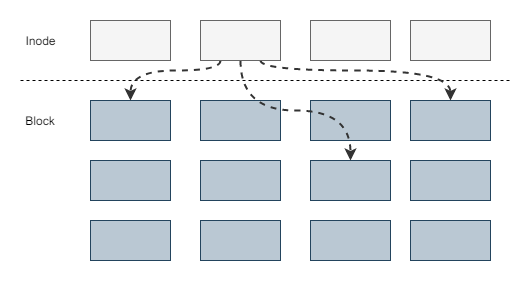
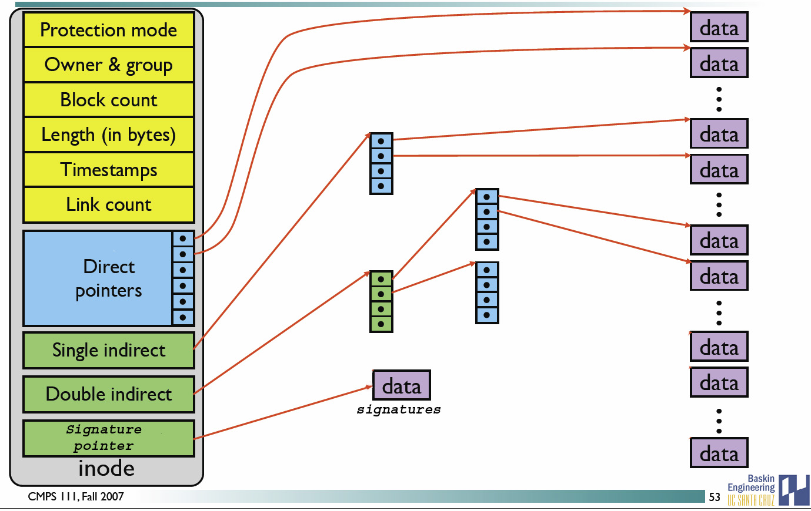

[TOC]

### 文件系统

#### 分区与文件系统

对分区进行格式化是为了在**分区上建立文件系统**。一个分区通常只能格式化为一个文件系统，但是**磁盘阵列**等技术可以将一个分区格式化为**多个**文件系统。

---

#### 组成

最主要的几个组成部分如下：

- ==inode==：一个**文件**占用一个 inode，记录文件的**属性**，同时记录此文件的**内容所在的 block 编号**；
- ==block==：记录文件的**内容**，文件太大时，会占用多个 block。

除此之外还包括：

- ==superblock==：记录文件系统的**整体信息**，包括 inode 和 block 的总量、使用量、剩余量，以及文件系统的格式与相关信息等；
- block bitmap：记录 block 是否被使用的位域。

---

#### 文件读取

对于 ==Ext2== 文件系统，当要读取一个文件的内容时，先在 **inode** 中去查找文件内容所在的所有 **block**，然后把所有 block 的内容读出来。

而对于 ==FAT== 文件系统，它**没有 inode**，每个 block 中存储着**下一个 block** 的编号，链式存储block编号。

----

#### 磁盘碎片

指一个文件内容所在的 block 过于**分散**，导致磁盘磁头移动距离过大，从而降低磁盘读写性能。

----

#### block

在 **Ext2** 文件系统中所支持的 block 大小有 **1K，2K 及 4K** 三种，不同的大小限制了单个文件和文件系统的最大大小。

|     大小     | 1KB  |  2KB  | 4KB  |
| :----------: | :--: | :---: | :--: |
| 最大单一文件 | 16GB | 256GB | 2TB  |
| 最大文件系统 | 2TB  |  8TB  | 16TB |

一个 block 只能被**一个文件**所使用，未使用的部分直接浪费了。因此如果需要存储大量的小文件，那么最好选用比较小的 block。

-----

#### inode

inode 具体包含以下信息：

- 权限 (read/write/excute)；
- 拥有者与群组 (owner/group)；
- 容量；
- 建立或状态改变的时间 (ctime)；
- 最近一次的读取时间 (atime)；
- 最近修改的时间 (mtime)；
- 定义文件特性的旗标 (flag)，如 SetUID...；
- 该文件真正内容的**指向** (pointer)。

inode 具有以下特点：

- 每个 inode 大小均**固定为 128 bytes** (新的 ext4 与 xfs 可设定到 256 bytes)；
- **每个文件**都仅会占用一个 **inode**。

inode 中记录了文件内容所在的 block 编号，但是每个 block 非常小，一个大文件随便都需要几十万的 block。而一个 inode 大小有限，无法直接引用这么多 block 编号。因此引入了**间接、双间接、三间接引用**。间接引用是指，让 inode 记录的引用 **block 块记录引用信息**。

---

#### 目录

建立一个**目录**时，会分配一个 **inode** 与至少一个 block。**block 记录**的内容是目录下所有**文件的 inode 编号以及文件名**。

可以看出文件的 inode 本身不记录文件名，文件名记录在目录中，因此新增文件、删除文件、更改文件名这些操作与**目录的 w 权限**有关。

-----

#### 日志

如果突然断电，那么文件系统会发生错误，例如断电前只修改了 block bitmap，而还没有将数据真正写入 block 中。

ext3/ext4 文件系统引入了日志功能，可以利用日志来修复文件系统。

----

#### 挂载

挂载利用**目录**作为**文件系统的进入点**，也就是说，进入**目录**之后就可以读取**文件系统**的数据。

-----

#### 目录配置

为了使不同 **Linux 发行版本**的目录结构保持一致性，Filesystem Hierarchy Standard (FHS) 规定了 Linux 的目录结构。最基础的三个目录如下：

- ==/== (root, 根目录)
- ==/usr== (unix software resource)：所有系统**默认软件**都会安装到这个目录；
- ==/var== (variable)：存放系统或程序运行过程中的**数据文件**。

----

