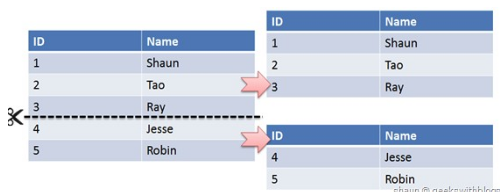
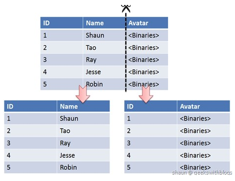

[TOC]

### MySQL分区与切分

#### 水平切分

水平切分又称为 **Sharding**，它是将**同一个表**中的记录拆分到**多个结构相同的表**中。

当一个表的数据不断增多时，Sharding 是必然的选择，它可以将数据分布到**集群**的不同节点上，从而缓解**单个数据库**的压力。

---

#### 垂直切分

垂直切分是将一张表**按列切分**成多个表，通常是按照列的**关系密集程度**进行切分，也可以利用垂直切分将**经常被使用的列**和不**经常被使用的列**切分到不同的表中。

在数据库的层面使用垂直切分将按数据库中表的密集程度部署到不同的库中，例如将原来的电商数据库垂直切分成商品数据库、用户数据库等。

如果一个表中某个字段的内容长度过长，通常需要单独切分出去，比如 TEXT 类型的字段，可以考虑单独切分。

----

#### Sharding 策略

- **哈希取模**：**hash(key) % N**；
- **范围**：可以是 **ID 范围**也可以是**时间范围**；
- **映射表**：使用**单独**的一个数据库来存储映射关系。

#### Sharding 存在的问题

##### 1. 事务问题

使用**分布式事务**来解决，比如 XA 接口。

##### 2. 连接

可以将原来的连接分解成**多个单表查询**，然后在**用户程序**中进行**连接**。

##### 3. ID 唯一性

- 使用**全局唯一 ID（GUID）**
- 为每个**分片指定一个 ID 范围**
- **分布式 ID 生成器** (如 Twitter 的 **Snowflake** 算法)

