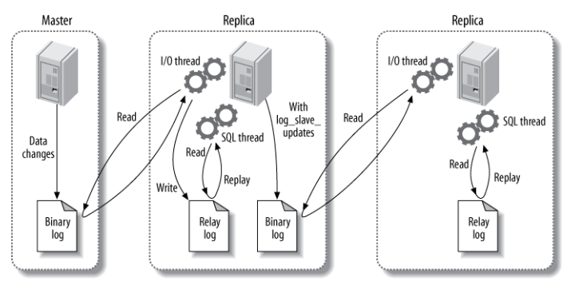

[TOC]

### MySQL复制

#### 主从复制

复制步骤

- master记录**更改**的明细，存入到**二进制日志**（binary log），如记录增删改的过程，不记录查询的过程。
- master 发送同步消息给 slave。
- slave 收到消息后，将 master 的二进制日志复制到本地的**中继日志**（relay log）。
- slave **重现**中继日志中的消息，从而改变数据库的数据。 

主要涉及三个线程：**binlog 线程、I/O 线程和 SQL 线程**。

-  **binlog 线程** ：负责将主服务器上的数据更改写入**二进制日志**（Binary log）中。
-  **I/O 线程** ：负责从主服务器上读取二进制日志，并写入从服务器的**中继日志**（Relay log）。
-  **SQL 线程** ：负责读取中继日志，解析出主服务器已经执行的数据更改并在从服务器中执行。

 MySQL复制的日志格式有三种，根据主库存放数据的方式不同有以下三种，也就对应三种复制方式： 

| 复制方式  |                             特点                             |                             优点                             |                             缺点                             |
| :-------: | :----------------------------------------------------------: | :----------------------------------------------------------: | :----------------------------------------------------------: |
|    row    | 基于行的格式复制，记录需要修改的每行的数据信息。 如果一个SQL修改了2w行的数据，那么就会记录2w行的日志格式 | 保证了数据的强一致性，且由于记录的是执行后的结果，在从库上执行还原也会比较快 | 日志记录**数量很多**，日志文件巨大，主从之间的传输需要更多的时间。 |
| statement | 基于段的日志格式复制，也就是记录下更改的 SQL 记录，而不是更改的行的记录。 |                       日志记录量最小。                       | 对于一些输出结果不确定的函数，在从库上执行一遍很可能会出现问题，如 uuid，从库根据日志还原主库数据的时候需要执行一遍SQL，时间相对较慢。 |
|   mixed   | 混合上面两种日志格式记录记录日志，至于什么时候使用哪种日志方式由MySQL本身决定。 |              可以平衡上面两种日志格式的优缺点。              |                                                              |

**复制方式：**

 **异步复制**：主库写入一个事务 commit 提交并执行完之后，，将日志记录到binlog，将结果反馈给**客户端**，最后将日志传输到从库。  该复制经常遇到的问题是：因为binlog日志是推送的，所有主库和从库之间存在一定的延迟。 这样就会造成很多问题，比如主库因为磁盘损坏等故障突然崩掉，导致binlog日志不存在，同时因为延迟binlog还没有推送到从库，从库也就会丢失很多被主库提交的事物，从而造成**主从不一致**。 

 **半同步复制**：主库写入一个事务 commit 提交并执行完之后，并不直接将请求反馈给前端应用用户，而是等待从库也接收到 binlog 日志并成功写入中继日志后，主库才返回 commit 操作成功给客户端。半同步复制保障了事物执行后，至少有两份日志记录，一份在主库的binlog上 ，另一份至少在从库的中继日志Relay log上，这样就极大的**保证了数据的一致性**。 

#### 读写分离

**主服务器处理写操作**以及**实时性要求比较高的读**操作，而**从服务器处理读**操作。

读写分离能提高性能的原因在于：

- 主从服务器负责各自的读和写，极大程度**缓解了锁的争用**；
- **从服务器**可以**使用 MyISAM**，提升查询性能以及节约系统开销；
- 增加冗余，提高可用性。

读写分离常用**代理方式**来实现，代理服务器接收应用层传来的读写请求，然后决定转发到哪个服务器。

