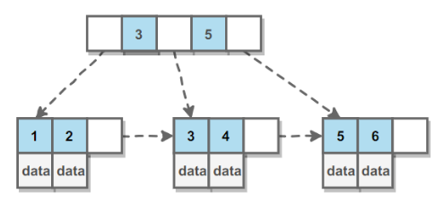
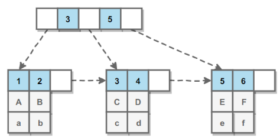
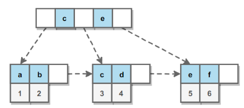

[TOC]

### MySQL索引

#### 索引的优点

- 大大减少了服务器需要扫描的**数据行数**，可以大大加快数据的**检索速度**（大大减少的检索的数据量）, 这也是创建索引的最主要的原因。
- 通过创建唯一性索引，可以保证数据库表中每一行数据的**唯一性**。
- 帮助服务器**避免进行排序和分组**，以及**避免创建临时表**（B+Tree 索引是**有序**的，可以**用于 ORDER BY 和 GROUP BY 操作**。临时表主要是在排序和分组过程中创建，因为不需要排序和分组，也就不需要创建临时表）。
- 将随机 I/O 变为**顺序 I/O**（B+Tree 索引是**有序**的，会将相邻的数据都**存储在一起**）。
- 可以加速表和表之间的**连接**，特别是在实现数据的参考完整性方面特别有意义。

> **索引这么多优点，为什么不对表中的每一个列创建一个索引呢？**

1. 当对表中的数据进行增加、删除和修改的时候，索引也要**动态的维护**，这样就降低了数据的维护速度。
2. 索引需要占**物理空间**，除了数据表占数据空间之外，每一个索引还要占一定的物理空间，如果要建立**聚簇索引**，那么需要的空间就会更大。
3. **创建索引和维护索引**要耗费时间，这种时间随着数据量的增加而增加。


#### B+Tree原理

##### 1. 数据结构

B Tree 指的是 **Balance Tree**，也就是**平衡树**。平衡树是一颗==**查找树**==，并且**所有==叶子节点位于同一层==**。

B+ Tree 是基于 B Tree 和**叶子节点顺序访问指针**进行实现，它具有 B Tree 的平衡性，并且通过**顺序访问指针**来提高区间查询的性能。

在 **B+ Tree** 中，一个节点中的 **key 从左到右非递减排列**，如果某个指针的左右相邻 key 分别是 key<sub>i</sub> 和 key<sub>i+1</sub>，且不为 null，则该指针指向节点的所有 key 大于等于 key<sub>i</sub> 且小于等于 key<sub>i+1</sub>。



B+ 树的**数据**都存在**叶子结点**上，而且叶子结点还有顺序指针，这样可以方便进行范围查询。而 B 树中数据可能在非叶子结点上，而且不含有指针。

##### 2. 操作

进行查找操作时，首先在**根节点**进行**二分查找**，找到一个 key 所在的指针，然后递归地在指针所指向的节点进行查找。直到查找到叶子节点，然后在叶子节点上进行二分查找，找出 key 所对应的 data。

插入删除操作会破坏平衡树的平衡性，因此在插入删除操作之后，需要对树进行一个分裂、合并、旋转等操作来**维护平衡性**。

##### 3. 与红黑树的比较

红黑树等平衡树也可以用来实现**索引**，但是文件系统及数据库系统普遍采用 **B+ Tree 作为索引结构**，主要有以下两个原因：

（一）**更少的查找次数**

平衡树查找操作的时间复杂度和**树高 h 相关**，O(h)=O(log<sub>d</sub>N)，其中 d 为每个节点的出度。

红黑树的出度为 2，而 B+ Tree 的出度一般都非常大，所以红黑树的树高 h 很明显比 B+ Tree 大非常多，查找的次数也就更多。

B+ 树比红黑树更加**矮平**。

（二）**利用磁盘预读特性**

为了减少磁盘 I/O 操作，磁盘往往不是严格按需读取，而是每次都会**预读**。预读过程中，磁盘进行**顺序读取**，顺序读取不需要进行磁盘寻道，并且只需要很短的旋转时间，速度会非常快。

操作系统一般将内存和磁盘分割成**固定大小的块**，每一块称为**一页**，内存与磁盘以**页为单位**交换数据。数据库系统将索引的一个**节点**的大小设置为页的大小，使得一次 I/O 就能完全载入一个节点。并且可以利用**预读特性**，相邻的节点也能够被**预先载入**。

##### 4. B树与B+树的比较

关于 B 树与 B+ 树的比对看下面：

https://www.cnblogs.com/xueqiuqiu/articles/8779029.html

----

#### MySQL索引

索引是在**存储引擎层**实现的，而不是在服务器层实现的，所以**不同存储引擎具有不同的索引类型**和实现。

MySQL 索引使用的数据结构主要有 **BTree索引** 和 **哈希索引** 。对于哈希索引来说，底层的数据结构就是哈希表，因此在绝大多数需求为单条记录查询的时候，可以选择哈希索引，查询性能最快；其余大部分场景，建议选择 BTree 索引。

MySQL 的 BTree 索引使用的是 B 树中的 B+Tree，但对于主要的两种存储引擎的实现方式是不同的。

- **MyISAM：**B+Tree 叶节点的 data 域存放的是数据记录的地址。在索引检索的时候，首先按照 B+Tree 搜索算法搜索索引，如果指定的 Key 存在，则取出其 data 域的值，然后以 data 域的值为地址读取相应的数据记录。这被称为“非聚簇索引”。
- **InnoDB：**其数据文件本身就是索引文件。相比 MyISAM，索引文件和数据文件是分离的，其表数据文件本身就是按 B+Tree 组织的一个索引结构，树的叶节点 data 域保存了完整的数据记录。这个索引的 key 是数据表的主键，因此 InnoDB 表数据文件本身就是主索引。这被称为“聚簇索引（或聚集索引）”。而其余的索引都作为辅助索引，辅助索引的 data 域存储相应记录主键的值而不是地址，这也是和 MyISAM 不同的地方。**在根据主索引搜索时，直接找到key所在的节点即可取出数据；在根据辅助索引查找时，则需要先取出主键的值，再走一遍主索引。** **因此，在设计表的时候，不建议使用过长的字段作为主键，也不建议使用非单调的字段作为主键，这样会造成主索引频繁分裂。** PS：整理自《Java工程师修炼之道》

##### 1. B+Tree索引

是大多数 MySQL 存储引擎的**默认索引**类型。

因为不再需要进行全表扫描，只需要对**树进行搜索**即可，所以查找速度快很多。

除了用于查找，还可以用于**排序和分组**（数据在叶子结点的存储方式决定）。

可以指定**多个列**作为索引列，多个索引列**共同**组成键。

适用于**全键值、键值范围和键前缀**查找，其中键前缀查找只适用于==**最左前缀**==查找。如果**不是按照索引列的顺序进行查找，则无法使用索引。**

InnoDB 的 B+Tree 索引分为**主索引和辅助索引**。主索引的**叶子节点** data 域记录着**完整**的**数据**记录，这种索引方式被称为==**聚簇索引**==。因为无法把数据行存放在两个不同的地方，所以一个表只能有**一个**聚簇索引。



**辅助索引**的**叶子节点**的 data 域记录着**主键的值**，因此在使用**辅助索引**进行查找时，需要先查找到**主键值**，然后再到主索引中进行查找。



##### 2. 哈希索引

**哈希索引**能以 **O(1)** 时间进行查找，但是**失去了有序性**：

- **无法**用于**排序与分组**；
- 只支持**精确查找**，无法用于**部分查找和范围查找**。

InnoDB 存储引擎有一个特殊的功能叫“**自适应哈希索引**”，当某个索引值被使用的**非常频繁**时，会在 **B+Tree 索引之上**再创建一个**哈希索引**，这样就让 B+Tree 索引具有哈希索引的一些优点，比如**快速**的哈希查找。

##### 3. 全文索引

MyISAM 存储引擎支持**全文索引**，用于查找文本中的**关键词**，而不是直接比较是否相等。

查找条件使用 ==**MATCH AGAINST**==，而不是普通的 WHERE。

全文索引使用**倒排索引**实现，它记录着关键词到其所在**文档的映射**。

InnoDB 存储引擎在 MySQL 5.6.4 版本中也开始支持全文索引。

##### 4. 空间数据索引

MyISAM 存储引擎支持空间数据索引（R-Tree），可以用于**地理数据**存储。空间数据索引会从所有维度来索引数据，可以有效地使用任意维度来进行组合查询。

必须使用 GIS 相关的函数来维护数据。

---

#### 索引优化

##### 1. 独立的列

在进行查询时，索引列**不能是表达式的一部分**，也不要对其**施加函数**或者成为**函数的参数**，否则**无法**使用索引。这会造成无法命中索引。

例如下面的查询不能使用 actor_id 列的索引：

```sql
SELECT actor_id FROM sakila.actor WHERE actor_id + 1 = 5;  
```

##### 2. 多列索引

在需要使用**多个列**作为条件进行查询时，使用**多列索引比使用多个单列索引性能更好**。例如下面的语句中，最好把 actor_id 和 film_id 设置为多列索引。

```sql
SELECT film_id, actor_ id FROM sakila.film_actor
WHERE actor_id = 1 AND film_id = 1;
```

##### 3. 索引列的顺序

让**==选择性最强==的索引列放在前面**。

索引的选择性是指：**不重复的索引值和记录总数的比值**。最大值**为 1**，此时**每个记录都有唯一的索引与其对应**。选择性越高，查询效率也越高。

例如下面显示的结果中 customer_id 的选择性比 staff_id 更高，因此最好把 customer_id 列放在多列索引的前面。

```sql
SELECT COUNT(DISTINCT staff_id)/COUNT(*) AS staff_id_selectivity,
COUNT(DISTINCT customer_id)/COUNT(*) AS customer_id_selectivity,
COUNT(*)
FROM payment;
```

```html
   staff_id_selectivity: 0.0001
customer_id_selectivity: 0.0373
               COUNT(*): 16049
```

##### 4. 前缀索引

对于 **BLOB、TEXT 和 VARCHAR** 类型的列，必须使用==**前缀索引**==，只索引**开始的部分字符**。

对于前缀长度的选取需要根据索引选择性来确定。

##### 5. 覆盖索引

索引包含**所有需要查询**的字段的值。

具有以下优点：

- 索引通常远小于数据行的大小，只读取索引能大大减少数据访问量。
- 一些存储引擎（例如 MyISAM）在内存中只缓存索引，而数据依赖于操作系统来缓存。因此，只访问索引可以不使用系统调用（通常比较费时）。
- 对于 InnoDB 引擎，若**辅助索引**能够覆盖查询，则**无需访问主索引**。

----

#### 索引的使用条件（注意事项）

- 对于**非常小**的表、大部分情况下简单的全表扫描比建立索引更高效；
- 对于**中到大型的表，索引就非常有效**；
- 但是对于**特大型**的表，建立和维护索引的代价将会随之增长。这种情况下，需要用到一种技术可以**直接区分**出需要查询的一组数据，而不是一条记录一条记录地匹配，例如可以使用**分区技术**。
- **主键，使用唯一索引。**
- 经常用作**查询条件**的字段需要创建索引
- 经常需要**排序、分组和统计**的字段需要建立索引
- 查询中与其他表**关联**的字段，外键关系建立索引。
- 在经常使用在 **WHERE 子句**中的列上面创建索引，加快条件的判断速度。
- 将打算**加索引**的列设置为 **NOT NULL** ，否则将导致引擎放弃使用索引而进行**全表**扫描。

哪些情况**不要**建索引：

- 表的记录太少，百万级以下的数据不需要创建索引。
- 经常**增删改**的表不需要创建索引
- 数据**重复**且分布平均的字段**不需要**创建索引，如 true, false 之类。
- **频繁更新**的字段不适合创建索引
- WHERE 条件里**用不到**的字段不需要创建索引

#### 使用索引的注意事项？

1. 避免 where 子句中对宇段施加函数，这会造成无法命中索引。
2. 在使用InnoDB时使用与业务无关的自增主键作为主键，即使用逻辑主键，而不要使用业务主键。
3. 删除长期未使用的索引，不用的索引的存在会造成不必要的性能损耗 MySQL 5.7 可以通过查询 sys 库的 chema_unused_indexes 视图来查询哪些索引从未被使用。
4. 在使用 limit offset 查询缓慢时，可以借助索引来提高性能。


#### 索引设计规范

> **限制每张表上的索引数量,建议单张表索引不超过 5 个**

索引并不是越多越好！索引可以提高效率同样可以降低效率。

索引可以增加查询效率，但同样也会降低插入和更新的效率，甚至有些情况下会降低查询效率。

因为 MySQL 优化器在选择如何优化查询时，会根据统一信息，对每一个可以用到的索引来进行评估，以生成出一个最好的执行计划，如果同时有很多个索引都可以用于查询，就会增加 MySQL 优化器生成执行计划的时间，同样会降低查询性能。

> **禁止给表中的每一列都建立单独的索引**

5.6 版本之前，一个 sql 只能使用到一个表中的一个索引，5.6 以后，虽然有了合并索引的优化方式，但是还是远远没有使用一个**联合索引**的查询方式好。

> **每个 Innodb 表必须有个主键**

Innodb 是一种**索引组织表**：数据的存储的逻辑顺序和索引的顺序是相同的。每个表都可以有多个索引，但是表的存储顺序只能有一种。

Innodb 是按照主键索引的顺序来组织表的。

- 不要使用更新频繁的列作为主键，不适用多列主键（相当于联合索引）。
- 不要使用 UUID, MD5, HASH, 字符串列作为主键（无法保证数据的顺序增长）。
- 主键建议使用自增 ID 值。

> **常见索引列建议**

- 出现在 SELECT、UPDATE、DELETE 语句的 WHERE 从句中的列。
- 包含在 ORDER BY、GROUP BY、DISTINCT 中的字段。
- 并不要将符合 1 和 2 中的字段的列都建立一个索引， 通常将 1、2 中的字段建立联合索引效果更好。
- 多表 join 的关联列。

> **如何选择索引列的顺序**

建立索引的目的是：希望通过索引进行数据查找，减少随机 IO，增加查询性能 ，索引能过滤出越少的数据，则从磁盘中读入的数据也就越少。

- 区分度最高的放在联合索引的最左侧（区分度=列中不同值的数量/列的总行数）。
- 尽量把字段长度小的列放在联合索引的最左侧（因为字段长度越小，一页能存储的数据量越大，IO 性能也就越好）。
- 使用最频繁的列放到联合索引的左侧（这样可以比较少的建立一些索引）。

> **避免建立冗余索引和重复索引（增加了查询优化器生成执行计划的时间）**

- 重复索引示例：primary key(id)、index(id)、unique index(id)
- 冗余索引示例：index(a,b,c)、index(a,b)、index(a)

> **对于频繁的查询优先考虑使用覆盖索引**

**覆盖索引**：就是包含了所有查询字段 (where,select,ordery by,group by 包含的字段) 的索引。

**覆盖索引的好处：**

- **避免 Innodb 表进行索引的二次查询:** Innodb 是以聚集索引的顺序来存储的，对于 Innodb 来说，二级索引在叶子节点中所保存的是行的主键信息，如果是用二级索引查询数据的话，在查找到相应的键值后，还要通过主键进行二次查询才能获取我们真实所需要的数据。而在覆盖索引中，二级索引的键值中可以获取所有的数据，避免了对主键的二次查询 ，减少了 IO 操作，提升了查询效率。
- •**可以把随机 IO 变成顺序 IO 加快查询效率:** 由于覆盖索引是按键值的顺序存储的，对于 IO 密集型的范围查找来说，对比随机从磁盘读取每一行的数据 IO 要少的多，因此利用覆盖索引在访问时也可以把磁盘的随机读取的 IO 转变成索引查找的顺序 IO。

> **索引 SET 规范**

**尽量避免使用外键约束**

- 不建议使用外键约束（foreign key），但一定要在表与表之间的关联键上建立索引。
- 外键可用于保证数据的参照完整性，但建议在业务端实现。
- 外键会影响父表和子表的写操作从而降低性能


看看这个帖子：美团的：https://www.cnblogs.com/php-rearch/p/5034118.html


