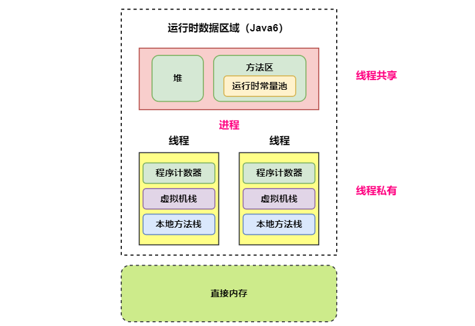
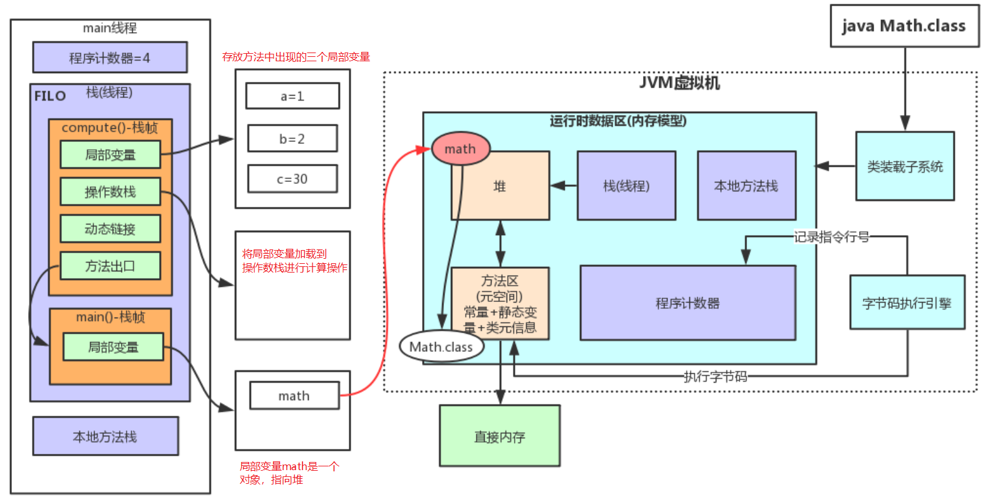
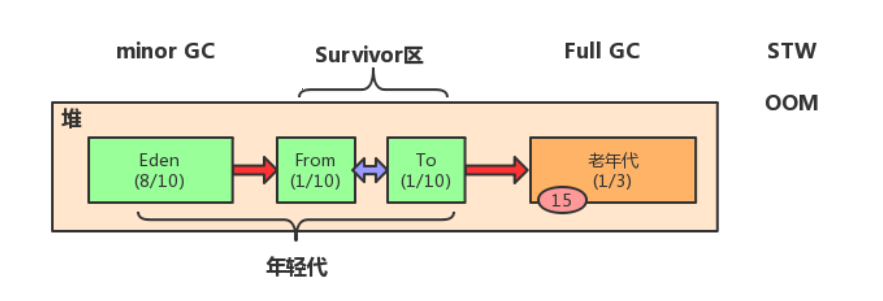
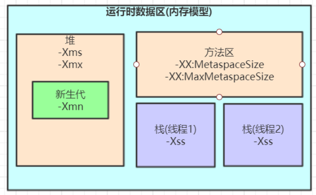

[TOC]

### JVM运行时数据区域

运行时数据区：经过编译生成的字节码文件（class文件），由 Classloader（类加载子系统）加载后交给执行引擎执行。在执行引擎执行的过程中产生的数据会存储在一块内存区域。这块内存区域就是运行时区域。

**程序计数器、Java 虚拟机栈和本地方法栈**是线程==**私有**==的，每个线程都有分配这些内存。其余的是线程共享部分，分为 Java6 和 Java8 版本。线程私有即随着线程的创建而创建，随着线程的死亡而死亡。

以下是 Java6 版本，方法区在虚拟机进程中存在于单独的内存中，线程共享。



以下是 **Java8** 版本的**运行时数据区**，方法区由**元空间**实现。元空间存在于**直接内存**中。


#### 虚拟机栈

线程**私有**。

**栈内存**说的就是**虚拟机栈**。由一个个**栈帧**组成。栈也就是基于平时的普通 **LIFO** 栈实现的，里面存放的就是**栈帧**。

每个 Java 方法在执行的同时会创建一个栈帧用于**存储局部变量表**、操作数栈、常量池引用、返回地址（方法出口）等信息。程序中的**局部变量**就是存放在**栈帧**上的。

**局部变量表主要存放了编译器可知的各种数据类型**（boolean、byte、char、short、int、float、long、double）、**对象引用**（reference 类型，它不同于对象本身，可能是一个指向对象起始地址的引用指针，也可能是指向一个代表对象的句柄或其他与此对象相关的位置）。

从方法调用直至执行完成的过程，就对应着一个**栈帧**在 Java 虚拟机栈中**入栈和出栈**的过程。

**栈帧结构**如下。

每个 **Java 方法**在执行的同时会创建一个==**栈帧**==用于存储**局部变量表、操作数栈、常量池**引用等信息。从方法调用直至执行完成的过程，就对应着一个**栈帧**在 Java ==虚拟机栈==中**入栈和出栈**的过程。栈及栈帧结构如下。


程序中每执行一个**方法**都会分配一个**栈帧**来保存方法内的各种数据。

进行计算的时候，会把**变量值加载到操作数栈**进行操作。比如求 a + b 的值，就会把 a 和 b 都加载到操作数栈并进行计算。

可以通过 **-Xss** 这个虚拟机参数来指定**每个线程**的 Java 虚拟机**栈内存**大小：

```java
java -Xss512M TestJava
```

该区域可能抛出以下异常：

- 当**线程请求的栈深度超过最大值**，会抛出 **StackOverflowError** 异常；
- 栈可以进行动态扩展，但如果无法申请到**足够内存**，会抛出 **OutOfMemoryError** 异常。

> **扩展：方法如何调用？**

Java 栈可用类比数据结构中栈，Java 栈中保存的主要内容是**栈帧**，每一次函数调用都会有一个对应的栈帧被压入 Java 栈，每一个函数调用结束后，都会有一个栈帧被弹出。

Java 方法有两种返回方式：

1. return 语句。
2. 抛出异常。

不管哪种返回方式都会**导致栈帧被弹出**。


#### 程序计数器

线程私有。

记录正在执行的虚拟机**字节码指令的地址**（如果正在执行的是本地方法则为空）。

可以看成是当前线程执行字节码的**行号指示器**，每执行一句代码都会改变程序计数器。

**每个线程**都需要有一个**独立的程序计数器**，各个线程之间计数器**互不影响**，独立存储，使线程切换后能够恢复到正确的执行位置。

此内存区域是唯一一个**没有**规定 **OutOfMemoryError** 的区域。程序计数器私有主要是为了**线程切换后能恢复到正确的执行位置**。


#### 本地方法栈

本地方法栈与 Java 虚拟机栈类似，它们之间的区别只不过是虚拟机栈为虚拟机执行 Java 方法服务，而本地方法栈则为虚拟机使用 **Native 方法**服务。也是线程**私有**的。

本地方法一般是用其它语言（C、C++ 或汇编语言等）编写的，并且被编译为基于本机硬件和操作系统的程序，对待这些方法需要特别处理。

本地方法被执行的时候，在本地方法栈也会创建一个栈帧，用于存放该本地方法的局部变量表、操作数栈、动态链接、出口信息。方法执行完毕后相应的栈帧也会出栈并释放内存空间，也会出现 StackOverFlowError 和 OutOfMemoryError 两种错误。


#### 堆

线程共享。

所有==**对象实例**==及数组都在这里分配**内存**，是垃圾收集的主要区域（"**GC 堆**"）。

现代的垃圾收集器基本都是采用**分代收集算法**，其主要的思想是针对**不同类型的对象**采取不同的垃圾回收算法。可以将堆分成**两块**：

- **新生代**（Young Generation）
- **老年代**（Old Generation）

也可以细致一点分为 Eden 空间、From Survivor 空间、To Survivor 空间等，进一步划分的目的是更好地回收内存，或者更快地分配内存。

> **OutOfMemoryError 异常** 

堆不需要连续内存，并且可以**动态增加**其内存，增加失败会抛出 **OutOfMemoryError** 异常。并且出现这种错误之后的表现形式还会有几种：

1. **OutOfMemoryError: GC Overhead Limit Exceeded**：当 JVM 花太多时间执行垃圾回收并且只能回收很少的堆空间时，就会发生此错误。
2. **java.lang.OutOfMemoryError: Java heap space**：假如在创建新的对象时, 堆内存中的空间不足以存放新创建的对象, 就会引发 java.lang.OutOfMemoryError: Java heap space 错误。(和本机物理内存无关，和你配置的内存大小有关！)
3. ......

> **堆内存参数配置**

可以通过 ==-Xms 和 -Xmx== 这两个虚拟机参数来指定一个程序的**堆内存**大小，第一个参数设置初始值，第二个参数设置最大值。

```java
java -Xms1M -Xmx2M HackTheJava
```

> **实例对象内存中存储在哪？**

**==如果实例对象存储在堆区时==**：实例对象内存存在**堆区**，实例的**引用**存在**栈上**，实例的**元数据 Class 存在方法区或者元空间**。

**实例对象**也不一定存在堆区的。不一定，如果实例对象**没有线程逃逸行为**，那么是**有可能**在**线程的栈**上**创建实例**的。


#### 方法区

线程共享区域。

用于存放已被加载的**类信息、常量、静态变量、即时编译器编译后的代码**等数据。有人喜欢称其为**永久代**。

和堆一样不需要连续的内存，并且可以动态扩展，动态扩展失败一样会抛出 **OutOfMemoryError** 异常。

对这块区域进行垃圾回收的主要目标是对**常量池的回收和对类的卸载**，但是一般比较难实现，回收效果与效率很低。

HotSpot 虚拟机把它当成**永久代**来进行垃圾回收。但很难确定永久代的大小，因为它受到很多因素影响，并且每次 Full GC 之后永久代的大小都会改变，所以经常会抛出 OutOfMemoryError 异常。为了更容易管理方法区，从 JDK 1.8 开始，移除永久代，并把**方法区移至==元空间==**，它位于直接内存中，而不是虚拟机内存中。

**方法区是一个 JVM 规范，永久代与元空间都是其一种实现方式**。在 JDK 1.8 之后，原来永久代的数据被分到了==堆和元空间==中。**元空间存储类的元信息，静态变量和常量池等放入堆中。**

> **方法区与永久代和元空间的关系**

《Java 虚拟机规范》只是规定了有方法区这么个概念和它的作用，并没有规定如何去实现它。那么，在不同的 JVM 上方法区的实现肯定是不同的了。 **方法区和永久代的关系很像 Java 中接口和类的关系，类实现了接口。方法区就是定义的标准定义的接口，而永久代就是 HotSpot 虚拟机对虚拟机规范中方法区的一种实现方式，元空间则是另一种实现方式。** 也就是说，永久代是 HotSpot 的概念，方法区是 Java 虚拟机规范中的定义，是一种规范，而永久代是一种实现，一个是标准一个是实现，其他的虚拟机实现并没有永久代这一说法。

> **参数设置**

JDK 1.8 的时候，方法区（HotSpot 的永久代）被彻底移除了（JDK1.7 就已经开始了），取而代之是元空间，**元空间**使用的是**直接内存**。

下面是一些常用参数：

```java
-XX:MetaspaceSize = N 		// 设置 Metaspace 的初始（和最小大小）
-XX:MaxMetaspaceSize = N 	// 设置 Metaspace 的最大大小
```

与永久代很大的不同就是，如果不指定大小的话，随着更多类的创建，虚拟机会耗尽所有可用的系统内存。

>  **为什么要将永久代 (PermGen) 替换为元空间 (MetaSpace) 呢?**

1、整个永久代有一个 JVM 本身设置固定大小上限，无法进行调整，而元空间使用的是直接内存，受本机可用内存的限制，虽然元空间仍旧可能溢出，但是比原来出现的几率会更小。

当你元空间溢出时会得到如下错误： java.lang.OutOfMemoryError: MetaSpace

你可以使用 `-XX：MaxMetaspaceSize` 标志设置最大元空间大小，默认值为 unlimited，这意味着它只受系统内存的限制。`-XX：MetaspaceSize` 调整标志定义元空间的初始大小如果未指定此标志，则 Metaspace 将根据运行时的应用程序需求动态地重新调整大小。

2、元空间里面存放的是类的元数据，这样加载多少类的元数据就不由 `MaxPermSize` 控制了, 而由系统的实际可用空间来控制，这样能加载的类就更多了。

3、在 JDK8，合并 HotSpot 和 JRockit 的代码时, JRockit 从来没有一个叫永久代的东西, 合并之后就没有必要额外的设置这么一个永久代的地方了。


#### **运行时常量池**


运行时常量池是**方法区**的一部分。

Class 文件中的**常量池**（编译器生成的字面量和符号引用）会在**类加载**后被放入这个区域。

除了在编译期生成的常量，还允许**动态生成**（即运行期间将新的常量放入池中），例如 String 类的 intern()。

**JDK1.7 及之后版本的 JVM 已经将运行时常量池从方法区中移了出来，在 Java 堆（Heap）中开辟了一块区域存放运行时常量池。**


#### 直接内存

元空间就是在直接内存中。

**直接内存并不是虚拟机运行时数据区的一部分，也不是虚拟机规范中定义的内存区域，但是这部分内存也被频繁地使用。而且也可能导致 OutOfMemoryError 错误出现。**

在 JDK 1.4 中新引入了 ==**NIO 类**==，它可以使用 Native 函数库直接分配**堆外内存**，然后通过 Java 堆里的 **DirectByteBuffer** 对象作为这块内存的引用进行操作。这样能在一些场景中显著提高性能，因为**避免**了在堆内存和堆外内存来回**拷贝**数据。

大量 NIO 操作会用到直接内存。

本机直接内存的分配**不会受到 Java 堆**大小的限制，但是受到本机总内存限制。


#### 拓展

看一个 Test 类：

```java
public class Test {
	// 计算方法 一个方法对应一个栈帧
	public int compute() {
		int a = 1;
		int b = 2;
		int c = (a + b) * 10;
		return c;
	}
	// main方法
	public static void main(String[] args) {
		Test test = new Test();
		test.compute();
	}
}
```

使用 javap -c 对 Test.class 类进行反编译得到如下字节码指令。

```java
D:\code\JavaNotesCode\jvm\target\classes\com\nano\jvm>javap -c Math.class
Compiled from "Math.java"
public class com.nano.jvm.Math {
  public com.nano.jvm.Math();
    Code:
       0: aload_0
       1: invokespecial #1                  // Method java/lang/Object."<init>":()V
       4: return
  // 计算方法	
  public int compute();
    Code:
       0: iconst_1
       1: istore_1
       2: iconst_2
       3: istore_2
       4: iload_1
       5: iload_2
       6: iadd
       7: bipush        10
       9: imul
      10: istore_3
      11: iload_3
      12: ireturn

  // main方法        
  public static void main(java.lang.String[]);
    Code:
       0: new           #2                  // class com/nano/jvm/Math
       3: dup
       4: invokespecial #3                  // Method "<init>":()V
       7: astore_1
       8: aload_1
       9: invokevirtual #4                  // Method compute:()I
      12: pop
      13: return
}
```

可以看到两个方法都被反编译出来。Code 下面各个字节码指令之前的号码就可以看成是行号，**程序计数器**就是记录执行时的这些行号。

上面的计算过程可以通过下面的**架构**表示：



可以看到这个 main 线程中分配了两个栈帧，一个是 main 方法的栈帧，一个是 compute 方法的栈帧，局部变量 a b c 都在局部变量表中，计算 a + b 的时候需要把它们加载到操作数栈进行加法，具体可以看字节码的指令就是这个过程。

在 main 方法对应的栈帧中，math 变量是一个普通对象，它指向堆中。

栈溢出 **StackOverflowError** demo。设置 -Xss128k。这里 128K 指的是**一个线程**的最大栈空间，而不是全部线程。

```java
// JVM设置  -Xss128k(默认1M)
public class StackOverflowTest {
    // 记录栈深度
    static int count = 0;
    
    static void redo() {
        count++;
        redo();
    }

    public static void main(String[] args) {
        try {
            redo();
        } catch (Throwable t) {
            t.printStackTrace();
            System.out.println(count);
        }
    }
}
```

运行结果，栈溢出：

```java
java.lang.StackOverflowError
    at com.tuling.jvm.StackOverflowTest.redo(StackOverflowTest.java:12)
    at com.tuling.jvm.StackOverflowTest.redo(StackOverflowTest.java:13)
    at com.tuling.jvm.StackOverflowTest.redo(StackOverflowTest.java:13)
    ......
12354    
```

这里一直调用一个方法，直到栈溢出，打印出当前线程可以调用的最大深度。

-Xss 设置越小，栈深值越小，说明一个线程栈里能分配的栈帧就越少，但是对 JVM 整体来说能开启的线程数会更多。


接下来，在使用 javap -v 参数反编译 Math.class，可以看到反编译出更多的信息。

```java
D:\code\2_Study\JavaNotesCode\jvm\target\classes\com\nano\jvm>javap -v Math.class
Classfile /D:/code/2_Study/JavaNotesCode/jvm/target/classes/com/nano/jvm/Math.class
  Last modified 2020年6月19日; size 577 bytes
  MD5 checksum bc7052bfb6a3c55c76b7fd36721067da
  Compiled from "Math.java"
public class com.nano.jvm.Math
  minor version: 0
  major version: 52
  flags: (0x0021) ACC_PUBLIC, ACC_SUPER
  this_class: #2                          // com/nano/jvm/Math
  super_class: #5                         // java/lang/Object
  interfaces: 0, fields: 0, methods: 3, attributes: 1

// 常量池信息      
Constant pool:
   #1 = Methodref          #5.#26         // java/lang/Object."<init>":()V
   #2 = Class              #27            // com/nano/jvm/Math
   #3 = Methodref          #2.#26         // com/nano/jvm/Math."<init>":()V
   #4 = Methodref          #2.#28         // com/nano/jvm/Math.compute:()I
   #5 = Class              #29            // java/lang/Object
   #6 = Utf8               <init>
   #7 = Utf8               ()V
   #8 = Utf8               Code
   #9 = Utf8               LineNumberTable
  #10 = Utf8               LocalVariableTable
  #11 = Utf8               this
  #12 = Utf8               Lcom/nano/jvm/Math;
  #13 = Utf8               compute
  #14 = Utf8               ()I
  #15 = Utf8               a
  #16 = Utf8               I
  #17 = Utf8               b
  #18 = Utf8               c
  #19 = Utf8               main
  #20 = Utf8               ([Ljava/lang/String;)V
  #21 = Utf8               args
  #22 = Utf8               [Ljava/lang/String;
  #23 = Utf8               math
  #24 = Utf8               SourceFile
  #25 = Utf8               Math.java
  #26 = NameAndType        #6:#7          // "<init>":()V
  #27 = Utf8               com/nano/jvm/Math
  #28 = NameAndType        #13:#14        // compute:()I
  #29 = Utf8               java/lang/Object
{
  public com.nano.jvm.Math();
    descriptor: ()V
    flags: (0x0001) ACC_PUBLIC
    Code:
      stack=1, locals=1, args_size=1
         0: aload_0
         1: invokespecial #1                  // Method java/lang/Object."<init>":()V
         4: return
      LineNumberTable:
        line 9: 0
      LocalVariableTable:
        Start  Length  Slot  Name   Signature
            0       5     0  this   Lcom/nano/jvm/Math;

  public int compute();
    descriptor: ()I
    flags: (0x0001) ACC_PUBLIC
    Code:
      stack=2, locals=4, args_size=1
         0: iconst_1
         1: istore_1
         2: iconst_2
         3: istore_2
         4: iload_1
         5: iload_2
         6: iadd
         7: bipush        10
         9: imul
        10: istore_3
        11: iload_3
        12: ireturn
      LineNumberTable:
        line 16: 0
        line 17: 2
        line 18: 4
        line 19: 11
      LocalVariableTable:
        Start  Length  Slot  Name   Signature
            0      13     0  this   Lcom/nano/jvm/Math;
            2      11     1     a   I
            4       9     2     b   I
           11       2     3     c   I

  public static void main(java.lang.String[]);
    descriptor: ([Ljava/lang/String;)V
    flags: (0x0009) ACC_PUBLIC, ACC_STATIC
    Code:
      stack=2, locals=2, args_size=1
         0: new           #2                  // class com/nano/jvm/Math
         3: dup
         4: invokespecial #3                  // Method "<init>":()V
         7: astore_1
         8: aload_1
         // 这里调用#4，可以去常量池中看#4是对应的就是compute符号
         9: invokevirtual #4                  // Method compute:()I
        12: pop
        13: return
      LineNumberTable:
        line 23: 0
        line 24: 8
        line 25: 13
      LocalVariableTable:
        Start  Length  Slot  Name   Signature
            0      14     0  args   [Ljava/lang/String;
            8       6     1  math   Lcom/nano/jvm/Math;
}
SourceFile: "Math.java"
```

个人理解：一个程序的执行也就是执行的 JVM 的字节码指令，这些指令是被存放到方法区中的，它们都有各自的入口地址。

当一个栈上的方法需要执行时，就需要将方法中的符号（符号引用）对应到方法区中的入口地址（直接引用），这样字节码执行引擎才能获取到字节码并执行方法。符号引用转换为直接应用的过程就是解析中的链接，这里就有静态链接和动态链接。 

**常量池**里面就有很多东西，其中就有一系列的**符号**，代表着**类名称，方法名称**等。对象头里面的指针找到方法区中对应方法所对应的**字节码**的**入口地址**，并放到栈帧的**动态链接**部分中。这也就是符号引用转换为 JVM 指令码地址的直接引用。其实解析阶段的静态链接和动态链接做的事情其实都差不多，其实也就是将方法符号引用转换为对应的**字节码**的**入口地址**（也就是**直接引用**）的过程，只是静态方法等在类加载的时候就完成了，所以是静态链接，而普通方法是在运行的时候完成，所以是动态链接。如果是运行时再去寻找符号引用所对应的 JVM 字节码的入口地址，那就比较灵活了，就可以得到**不同**的入口地址，进而实现**多态**。


下图是堆的结构图。新 new 的对象一般是分配在 Eden 区，如果对象太大也可能直接分配到老年代中。



Eden 区满了就会触发 Minor GC，是对 Eden 区及 Survivor 中的对象进行回收。比如一个线程执行完了，那么栈帧没了，栈帧中指向对堆中的引用就消失了，这些对象就会被回收。垃圾收集就是靠字节码执行引擎开启垃圾收集线程。每次 Minor GC 会将 Eden 以及 Survivor 中一个区域（假设为 From 区）的存活对象移动到 Survivor 中的另一个区，再经历一次 Minor GC 就会再次将Eden 以及 Survivor 中（From）的存活对象放到 Survivor 中的另一个区中（假设为 To 区），下一次 Minor GC 又会挪到 From 区，也就是 Survivor 区总有一个区是干净的。每经历一次 Minor GC，那么对象头中的年龄计数器就会 + 1，如果到了一定的年龄，对象就会被放到老年代中。当老年代满了就会执行 Full GC。

JVM 参数的配置



Spring Boot 程序的 JVM 参数设置格式：

```java
java ‐Xms2048M ‐Xmx2048M ‐Xmn1024M ‐Xss512K ‐XX:MetaspaceSize=256M ‐XX:MaxMetaspaceSize=256M ‐jar microservice‐eureka‐server.jar
```

Tomcat 启动直接加在 bin 目录下 catalina.sh 文件里。

**JVM 参数大小设置并没有固定标准，需要根据实际项目情况分析。**


#### 问题

##### 1. 虚拟机栈和本地方法栈为什么是私有的?

- **虚拟机栈：** 每个 Java 方法在执行的同时会创建一个栈帧用于存储局部变量表、操作数栈、常量池引用等信息。从方法调用直至执行完成的过程，就对应着一个栈帧在 Java 虚拟机栈中入栈和出栈的过程。
- **本地方法栈：** 和虚拟机栈所发挥的作用非常相似，区别是： **虚拟机栈为虚拟机执行 Java 方法 （也就是字节码）服务，而本地方法栈则为虚拟机使用到的 Native 方法服务。** 在 HotSpot 虚拟机中和 Java 虚拟机栈合二为一。

所以，为了**保证线程中的局部变量不被别的线程访问到**，虚拟机栈和本地方法栈是线程私有的。


#### 参考资料

- https://blog.csdn.net/wangbiao007/article/details/78545189


