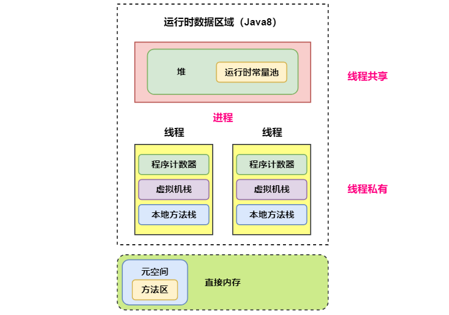
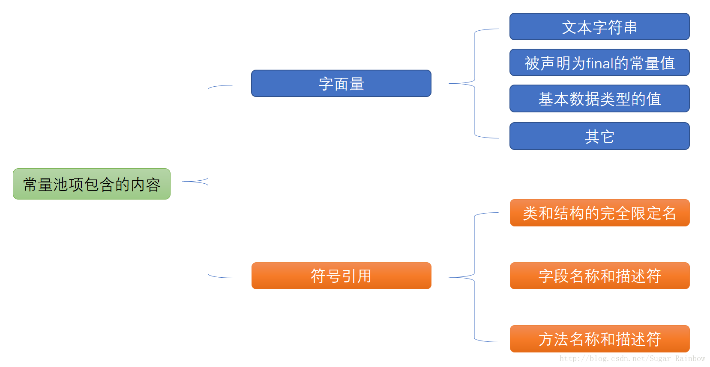

[TOC]

### JVM运行时数据区域

**程序计数器、Java 虚拟机栈和本地方法栈**是线程==**私有**==的，每个线程都有分配这些内存。其余的是线程共享部分，分为 Java6 和 Java8 版本。线程私有即随着线程的创建而创建，随着线程的死亡而死亡。

以下是 Java6 版本，方法区在虚拟机进程中存在于单独的内存中，线程共享。


以下是 **Java8** 版本的**运行时数据区**，方法区由**元空间**实现。元空间存在于**直接内存**中。




#### 程序计数器

线程私有。

记录正在执行的虚拟机**字节码指令的地址**（如果正在执行的是本地方法则为空）。

可以看成是当前线程执行字节码的**行号**指示器。

**每个线程**都需要有一个**独立的程序计数器**，各个线程之间计数器**互不影响**，独立存储，使线程切换后能够恢复到正确的执行位置。

此内存区域是唯一一个**没有**规定 OutOfMemoryError 的区域。


#### 虚拟机栈

线程私有。

栈内存说的就是虚拟机栈。由一个个栈帧组成。

每个 Java 方法在执行的同时会创建一个栈帧用于**存储局部变量表**、操作数栈、常量池引用等信息。

**局部变量表主要存放了编译器可知的各种数据类型**（boolean、byte、char、short、int、float、long、double）、**对象引用**（reference 类型，它不同于对象本身，可能是一个指向对象起始地址的引用指针，也可能是指向一个代表对象的句柄或其他与此对象相关的位置）。

从方法调用直至执行完成的过程，就对应着一个**栈帧**在 Java 虚拟机栈中**入栈和出栈**的过程。

**栈帧结构**如下。

每个 **Java 方法**在执行的同时会创建一个==**栈帧**==用于存储**局部变量表、操作数栈、常量池**引用等信息。从方法调用直至执行完成的过程，就对应着一个**栈帧**在 Java ==虚拟机栈==中**入栈和出栈**的过程。栈帧结构如下。


可以通过 **-Xss** 这个虚拟机参数来指定**每个线程**的 Java 虚拟机**栈内存**大小：

```java
java -Xss512M TestJava
```

该区域可能抛出以下异常：

- 当线程请求的栈深度超过最大值，会抛出 **StackOverflowError** 异常；
- 栈可以进行动态扩展，但如果无法申请到足够内存，会抛出 **OutOfMemoryError** 异常。

> **扩展：方法如何调用？**

Java 栈可用类比数据结构中栈，Java 栈中保存的主要内容是**栈帧**，每一次函数调用都会有一个对应的栈帧被压入 Java 栈，每一个函数调用结束后，都会有一个栈帧被弹出。

Java 方法有两种返回方式：

1. return 语句。
2. 抛出异常。

不管哪种返回方式都会**导致栈帧被弹出**。


#### 本地方法栈

本地方法栈与 Java 虚拟机栈类似，它们之间的区别只不过是虚拟机栈为虚拟机执行 Java 方法服务，而本地方法栈则为虚拟机使用 **Native方法**服务。也是线程**私有**的。

本地方法一般是用其它语言（C、C++ 或汇编语言等）编写的，并且被编译为基于本机硬件和操作系统的程序，对待这些方法需要特别处理。

本地方法被执行的时候，在本地方法栈也会创建一个栈帧，用于存放该本地方法的局部变量表、操作数栈、动态链接、出口信息。方法执行完毕后相应的栈帧也会出栈并释放内存空间，也会出现 StackOverFlowError 和 OutOfMemoryError 两种错误。


#### 堆

线程共享。

所有==**对象实例**==及数组都在这里分配**内存**，是垃圾收集的主要区域（"**GC 堆**"）。

现代的垃圾收集器基本都是采用**分代收集算法**，其主要的思想是针对**不同类型的对象**采取不同的垃圾回收算法。可以将堆分成**两块**：

- **新生代**（Young Generation）
- **老年代**（Old Generation）

也可以细致一点分为 Eden 空间、From Survivor 空间、To Survivor 空间等，进一步划分的目的是更好地回收内存，或者更快地分配内存。

> **OutOfMemoryError 异常** 

堆不需要连续内存，并且可以**动态增加**其内存，增加失败会抛出 **OutOfMemoryError** 异常。并且出现这种错误之后的表现形式还会有几种：

1. **OutOfMemoryError: GC Overhead Limit Exceeded**：当 JVM 花太多时间执行垃圾回收并且只能回收很少的堆空间时，就会发生此错误。
2. **java.lang.OutOfMemoryError: Java heap space**：假如在创建新的对象时, 堆内存中的空间不足以存放新创建的对象, 就会引发 java.lang.OutOfMemoryError: Java heap space 错误。(和本机物理内存无关，和你配置的内存大小有关！)
3. ......

> **堆内存参数配置**

可以通过 ==-Xms 和 -Xmx== 这两个虚拟机参数来指定一个程序的**堆内存**大小，第一个参数设置初始值，第二个参数设置最大值。

```java
java -Xms1M -Xmx2M HackTheJava
```


#### 方法区

线程共享区域。

用于存放已被加载的**类信息、常量、静态变量、即时编译器编译后的代码**等数据。有人喜欢称其为**永久代**。

和堆一样不需要连续的内存，并且可以动态扩展，动态扩展失败一样会抛出 **OutOfMemoryError** 异常。

对这块区域进行垃圾回收的主要目标是对**常量池的回收和对类的卸载**，但是一般比较难实现，回收效果与效率很低。

HotSpot 虚拟机把它当成**永久代**来进行垃圾回收。但很难确定永久代的大小，因为它受到很多因素影响，并且每次 Full GC 之后永久代的大小都会改变，所以经常会抛出 OutOfMemoryError 异常。为了更容易管理方法区，从 JDK 1.8 开始，移除永久代，并把**方法区移至==元空间==**，它位于本地内存中，而不是虚拟机内存中。

**方法区是一个 JVM 规范，永久代与元空间都是其一种实现方式**。在 JDK 1.8 之后，原来永久代的数据被分到了==堆和元空间==中。**元空间存储类的元信息，静态变量和常量池等放入堆中。**

> **方法区和永久代的关系**

《Java 虚拟机规范》只是规定了有方法区这么个概念和它的作用，并没有规定如何去实现它。那么，在不同的 JVM 上方法区的实现肯定是不同的了。 **方法区和永久代的关系很像 Java 中接口和类的关系，类实现了接口，而永久代就是 HotSpot 虚拟机对虚拟机规范中方法区的一种实现方式。** 也就是说，永久代是 HotSpot 的概念，方法区是 Java 虚拟机规范中的定义，是一种规范，而永久代是一种实现，一个是标准一个是实现，其他的虚拟机实现并没有永久代这一说法。

> **参数设置**

JDK 1.8 的时候，方法区（HotSpot 的永久代）被彻底移除了（JDK1.7 就已经开始了），取而代之是元空间，元空间使用的是**直接内存**。

下面是一些常用参数：

```java
-XX:MetaspaceSize = N 		// 设置 Metaspace 的初始（和最小大小）
-XX:MaxMetaspaceSize = N 	// 设置 Metaspace 的最大大小
```

与永久代很大的不同就是，如果不指定大小的话，随着更多类的创建，虚拟机会耗尽所有可用的系统内存。

>  **为什么要将永久代 (PermGen) 替换为元空间 (MetaSpace) 呢?**

1、整个永久代有一个 JVM 本身设置固定大小上限，无法进行调整，而元空间使用的是直接内存，受本机可用内存的限制，虽然元空间仍旧可能溢出，但是比原来出现的几率会更小。

当你元空间溢出时会得到如下错误： java.lang.OutOfMemoryError: MetaSpace

你可以使用 `-XX：MaxMetaspaceSize` 标志设置最大元空间大小，默认值为 unlimited，这意味着它只受系统内存的限制。`-XX：MetaspaceSize` 调整标志定义元空间的初始大小如果未指定此标志，则 Metaspace 将根据运行时的应用程序需求动态地重新调整大小。

2、元空间里面存放的是类的元数据，这样加载多少类的元数据就不由 `MaxPermSize` 控制了, 而由系统的实际可用空间来控制，这样能加载的类就更多了。

3、在 JDK8，合并 HotSpot 和 JRockit 的代码时, JRockit 从来没有一个叫永久代的东西, 合并之后就没有必要额外的设置这么一个永久代的地方了。


#### **运行时常量池**



运行时常量池是**方法区**的一部分。

Class 文件中的**常量池**（编译器生成的字面量和符号引用）会在**类加载**后被放入这个区域。

除了在编译期生成的常量，还允许**动态生成**（即运行期间将新的常量放入池中），例如 String 类的 intern()。

**JDK1.7 及之后版本的 JVM 已经将运行时常量池从方法区中移了出来，在 Java 堆（Heap）中开辟了一块区域存放运行时常量池。**


#### 直接内存

**直接内存并不是虚拟机运行时数据区的一部分，也不是虚拟机规范中定义的内存区域，但是这部分内存也被频繁地使用。而且也可能导致 OutOfMemoryError 错误出现。**

在 JDK 1.4 中新引入了 ==**NIO 类**==，它可以使用 Native 函数库直接分配**堆外内存**，然后通过 Java 堆里的 **DirectByteBuffer** 对象作为这块内存的引用进行操作。这样能在一些场景中显著提高性能，因为**避免**了在堆内存和堆外内存来回**拷贝**数据。

大量 NIO 操作会用到直接内存。

本机直接内存的分配**不会受到 Java 堆**大小的限制，但是受到本机总内存限制。


#### 参考资料

- https://blog.csdn.net/wangbiao007/article/details/78545189


