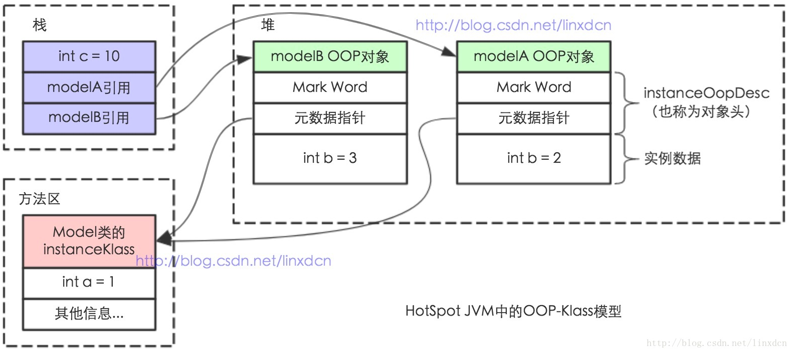
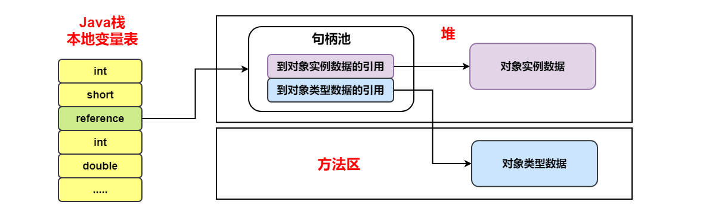
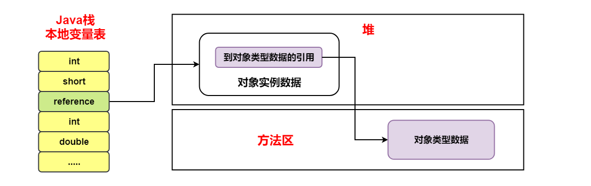

[TOC]

### 对象解析

#### 对象创建过程

在语言层面上，创建对象（例如克隆、反序列化）通常仅仅是一个 **new** 关键字而己，而在虚拟机中，对象（指普通 Java 对象，**非数组和Class 对象**等） 的创建是一个非常复杂的过程。

> **new 一个对象发生了什么？**


记住一点：**只要使用 new 方法，便需要创建新的对象。**

##### 1. 类加载检查

首先检查这个类**是否已被**加载、解析和初始化过。如果没有，那必须先执行相应的**类加载过程**。

##### 2. 内存分配

在**类加载检查**通过后，接下来虚拟机将为新生对象**分配内存**。

对象所需的内存大小在类加载完成后便可确定，为对象分配空间的任务等同于把一块确定大小的内存从 Java 堆中划分出来。

###### 内存分配方式

**内存分配方式**有 **“指针碰撞”** 和 **“空闲列表”** 两种，**选择那种分配方式由 Java 堆是否规整决定，而 Java 堆是否规整又由所采用的垃圾收集器是否带有压缩整理功能决定**。

- 假设 Java 堆中**内存是绝对规整**的，就仅仅是把指针向空闲空间那边挪动一段与对象大小相等的距离，这种分配方式称为“**指针碰撞**”（ Bump the Pointer）。

- 如果 Java 堆中的**内存并不是规整**的，已使用的内存和空闲的内存相互交错，虚拟机就必须维护一个列表，记录哪些内存块是可用的， 在分配的时候从列表中找到一块足够大的空间划分给对象实例， 并更新列表上的记录，这种分配方式称为“**空闲列表**”（ Free List ）。

因此，在使用 Serial、ParNew 等带 Compact（紧凑）过程的收集器时，系统采用的分配算法是**指针碰撞**，而使用 CMS 这种基于 Mark-Sweep 算法的收集器时，通常采用**空闲列表**。

###### **内存分配并发问题**

创建对象的时候有一个很重要的问题就是**线程安全**，因为在实际开发过程中，创建对象是很频繁的事情，作为虚拟机来说，必须要保证线程是安全的，通常来讲，虚拟机采用两种方式来保证线程安全：

- **CAS + 失败重试：** CAS 是乐观锁的一种实现方式。所谓乐观锁就是，每次不加锁而是假设没有冲突而去完成某项操作，如果因为冲突失败就重试，直到成功为止。**虚拟机采用 CAS 配上失败重试的方式保证更新操作的原子性。**
- **TLAB：** 为每一个线程预先在 Eden 区分配一块儿内存，JVM 在给线程中的对象分配内存时，首先在 TLAB 分配，当对象大于 TLAB 中的剩余内存或 TLAB 的内存已用尽时，再采用上述的 CAS 进行内存分配

##### 3. 初始化零值

相当于给属性设置**默认值**。

内存分配完成后，虚拟机需要将分配到的**内存空间都初始化为零值**（不包括对象头），这一步操作保证了对象的**实例字段**在 Java 代码中可以**不赋初始值**就直接使用，程序能访问到这些字段的数据类型所对应的零值。

##### 4. 设置对象头

初始化零值完成之后，**虚拟机要对对象进行必要的设置**，例如这个对象是那个类的实例、如何才能找到类的元数据信息、对象的哈希码、对象的 GC 分代年龄等信息。 **这些信息存放在对象头中。** 另外，根据虚拟机当前运行**状态**的不同，如是否启用偏向锁等，对象头会有不同的设置方式。

##### 5. 执行 init 方法

从虚拟机的视角来看此时一个**新的对象**已经产生了，但从 Java 程序的视角来看，对象创建才刚开始，方法还没有执行，**所有的字段都还为零**。

之后便执行 **\<init> 方法** 把对象按照程序员的意愿进行初始化，这样一个真正可用的对象才算完全产生出来。


#### 对象的内存布局

内存中 Java 是如何保存对象的？

在 HotSpot 虚拟机中，对象在内存中存储布局分为 **3 块区域**：**对象头（Header）、实例数据（Instance Data）、对齐填充（Padding）**，下面详细讲解各部分内容。

###### **① 对象头**

HotSpot 虚拟机的对象头包括两部分（非数组对象）信息，如下图所示：

- 第一部分用于存储对象自身的**运行时数据**，如哈希码（HashCode）、GC 分代年龄、锁状态标志、线程持有的锁、偏向线程 ID、偏向时间戳、对象分代年龄，这部分信息称为**“Mark Word”**；Mark Word 被设计成一个非固定的数据结构以便在极小的空间内存储尽量多的信息，它会根据自己的状态**复用**自己的存储空间。
- 第二部分是**类型指针**，即对象指向它的**类元数据**的指针，虚拟机通过这个指针来确定这个对象是**哪个类**的实例；
- 如果对象是一个 Java **数组**，那在对象头中还必须有**一块**用于记录**数组长度**的数据。因为虚拟机可以通过普通 Java 对象的元数据信息确定 Java 对象的大小，但是从数组的元数据中无法确定数组的大小。

**Mark Word** 在不同的锁状态下存储的内容不同，在 32 位 JVM 中是这么存的：


###### **② 实例数据**

实例数据部分是对象**真正**存储的**有效信息**，也是在程序代码中所定义的各种类型的字段内容。


###### **③ 对齐填充**

对齐填充不是必然存在的，没有特别的含义，它仅起到**占位符**的作用。

由于 HotSpot VM 的自动内存管理系统要求对象起始地址必须是 8 字节的整数倍，也就是说对象的大小必须是 8 字节的整数倍。对象头部分是 8 字节的倍数，所以当对象实例数据部分没有对齐时，就需要通过对齐填充来补全。


> **如何估算对象大小**？

32 位系统下，当使用 **new Object()** 时，JVM 将会分配 8（Mark Word + 类型指针） 字节的空间，128 个 Object 对象将占用 1KB 的空间。
如果是 new Integer()，那么对象里还有一个 int 值，其占用 4 字节，这个对象也就是 8 + 4 = 12 字节，对齐后，该对象就是 16 字节。

以上只是一些简单的对象，那么对象的内部属性是怎么排布的？

```java
Class A {
    int i;
    byte b;
    String str;
}
```

其中对象头部占用 ‘Mark Word’ （4） + ‘类型指针’ （4） = 8 字节；byte 8 位长，占用 1 字节；int 32 位长，占用 4 字节；String 只有引用，占用 4 字节；
那么对象 A 一共占用了 8+1+4+4 = 17 字节，按照 8 字节对齐原则，对象大小也就是 24 字节。

这个计算看起来是没有问题的，对象的大小也确实是 24 字节，但是对齐（padding）的位置并不对：

在 HotSpot VM 中，对象排布时，间隙是在 4 字节基础上的（在 32 位和 64 位压缩模式下），上述例子中，int 后面的 byte，空隙只剩下 3 字节，接下来的 String 对象引用需要 4 字节来存放，因此 byte 和对象引用之间就会有 3 字节对齐，对象引用排布后，最后会有 4 字节对齐，因此结果上依然是 7 字节对齐。


#### 对象访问定位

为了表示对象的属性、方法等信息，不得不需要**结构描述**。每一个  Java类，在被 JVM 加载的时候，JVM 会给这个类创建一个`instanceKlass` 类型数据，保存在**方法区**，用来在 JVM 层表示该 Java 类。Hotspot VM 使用**对象头部的一个元数据指针指向 Class 区域**的方式来找到对象的 Class 描述，以及内部的方法、属性入口。如下图所示：




Java 程序通过**栈**上的 ==**reference 数据**==来操作堆上的**具体对象**，由于 reference 类型在 Java 虚拟机规范中只规定了一个指向对象引用。而没有规定这个引用应该通过何种方式去定位、访问堆中的对象的具体位置，它取决于 Java 虚拟机实现。目前主要有两种实现方式 **①使用句柄**和 **②直接指针**：

###### ① 使用句柄

**使用句柄（类似间接指针）：**在 Java **堆**中划分出一块**内存**来作为**句柄池**，reference 中存储的就是**对象的句柄地址**，句柄中包含对象实例数据与类型各自具体地址信息。示例图如下图所示。



###### ② 直接指针

**直接指针访问：**Java 堆中的对象布要考虑如何放置访问类型数据相关的信息，而 **reference** 中存储的**直接就是对象地址**。示例图如下图所示。**Hotspot 虚拟机采用此种方式**。




**两者的比较：**

- **句柄**的好处是 reference 中存储的是**稳定的句柄地址**，在对象被移动时只会改变句柄中的实例数据指针，而 reference 本身不需要修改。

- **直接指针访问**的最大好处就是速度更快，节省一次指针定位时间开销。


#### 参考资料

- 《深入理解 Java 虚拟机：JVM 高级特性与最佳实践（第二版》
- 《实战 java 虚拟机》
- https://docs.oracle.com/javase/specs/index.html
- http://www.pointsoftware.ch/en/under-the-hood-runtime-data-areas-javas-memory-model/
- [https://dzone.com/articles/jvm-permgen-%E2%80%93-where-art-thou](https://dzone.com/articles/jvm-permgen-–-where-art-thou)
- https://stackoverflow.com/questions/9095748/method-area-and-permgen
- 深入解析String#internhttps://tech.meituan.com/2014/03/06/in-depth-understanding-string-intern.html