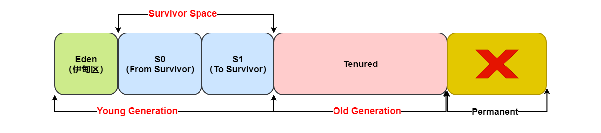
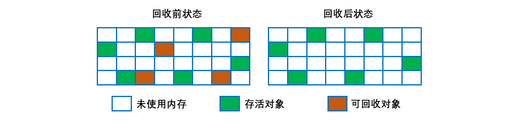
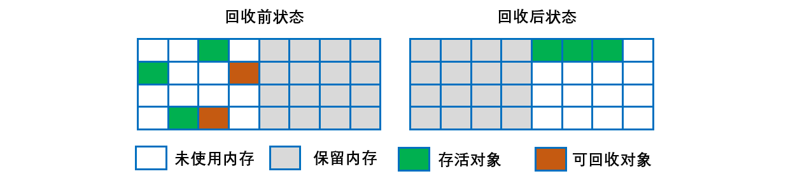
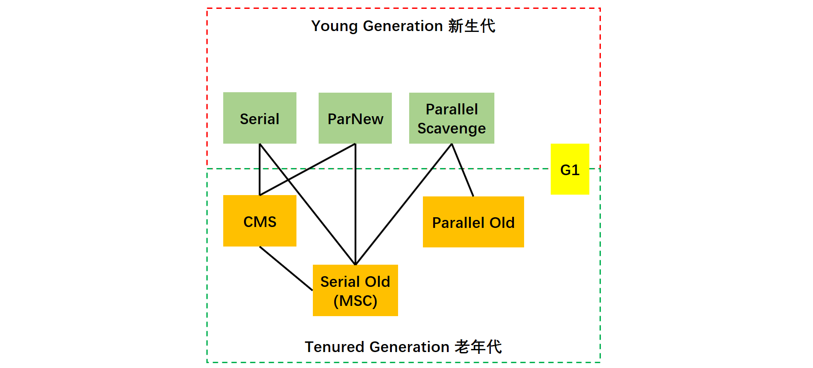
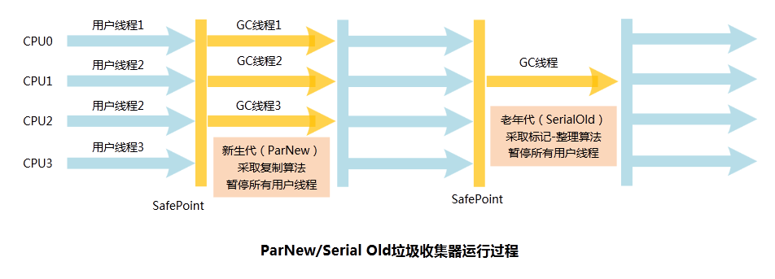
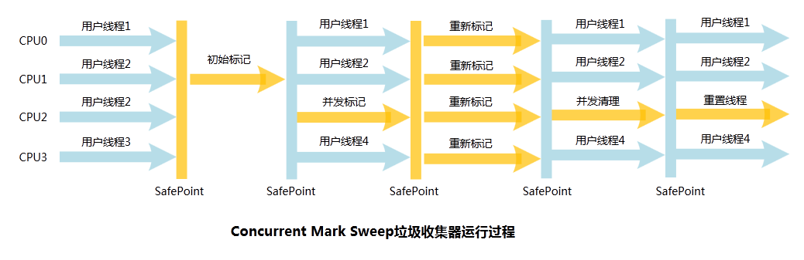
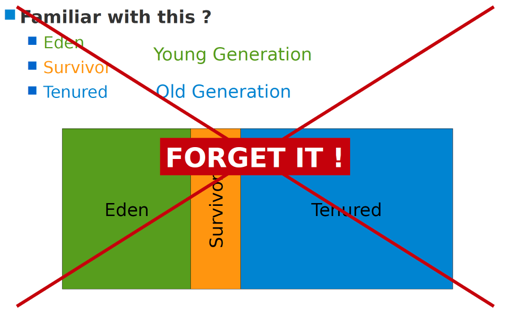

[TOC]

### 内存分配与垃圾收集

需解决：对象是如何分配内存的？何时进行垃圾回收？怎么回收？

Java 的自动**内存管理**主要是针对对象内存的回收和对象内存的分配。同时，Java 自动内存管理最核心的功能是 **堆** 内存中对象的分配与回收。

Java 堆是垃圾收集器管理的主要区域，因此也被称作 **GC 堆（Garbage Collected Heap）**.从垃圾回收的角度，由于现在收集器基本都采用**分代垃圾收集算法**，所以 Java 堆还可以细分为：**新生代和老年代**。

再细致一点有：Eden 空间、From Survivor、To Survivor 空间等。

**进一步划分的目的是更好地回收内存，或者更快地分配内存。**

#### 堆的基本结构

HotSpot 虚拟机堆内存的基本结构如下，分为：

- 新生代（含 Eden 区，From Survivor 区和 To Survivor 区）
- 老年代
- 永久代（已经移除）。




针对新生代和老年代有不同的 GC 方法即 Minor GC 和 Full GC。↓

> **Minor GC 和 Full GC 有什么不同**?

- **新生代 GC（Minor GC）**: 指发生**新生代**的的垃圾收集动作，Minor GC 非常**频繁**，回收速度一般也比较快。
- **老年代 GC（Major GC/Full GC）**: 指发生在**老年代**的 GC，出现了 Major GC 经常会伴随至少一次的 Minor GC（并非绝对），Major GC 的速度一般会比 Minor GC 的**慢** 10 倍以上。

> **S0 与 S1 的区别与联系？**

经过这次 GC 后，Eden 区和 "From" 区已经被清空。这个时候，"From" 和 "To" 会**交换**他们的角色（复制），也就是新的 "To" 就是上次 GC 前的“From”，新的 "From" 就是上次 GC 前的 "To"。

不管怎样，都会保证名为 To 的 Survivor 区域是空的。Minor GC 会一直重复这样的过程，直到“To”区被填满，"To"区被填满之后，会将所有对象移动到老年代中。这两个区一次只用一个，Minor GC 时采用复制算法将 Eden 区和 一个 Survivor 区的存活对象复制到另一个区中。

因此在新生代中垃圾回收算法多为**复制算法**。


#### 内存泄漏与内存溢出

##### 1. 内存泄漏

**内存泄露**：是指无用对象（不再使用的对象）持续占有内存或无用对象的内存得不到及时释放，从而造成的内存空间的浪费称为内存泄露。内存泄露有时不严重且不易察觉，这样开发者就不知道存在内存泄露，但有时也会很严重，会提示 `Out of memory`。

在 Java 中，内存泄漏就是存在一些被分配的对象，这些对象有下面两个特点

- 这些对象是可达的，即在有向图中，存在通路可以与其相连；
- 这些对象是无用的，即程序以后不会再使用这些对象。

如果对象满足这两个条件，这些对象就可以判定为 Java 中的内存泄漏，这些对象不会被 GC 所回收，然而它却占用内存。

给出一个 Java 内存泄漏的典型例子，

```java
Vector v = new Vector(10);
for (int i = 1; i < 100; i++) {
    Object o = new Object();
    v.add(o);
    o = null;   
}
```

在这个例子中，我们循环申请Object对象，并将所申请的对象放入一个 Vector 中，如果我们仅仅释放引用本身，那么 Vector 仍然引用该对象，所以这个对象对 GC 来说是不可回收的。因此，如果对象加入到Vector 后，还必须从 Vector 中删除，最简单的方法就是将 Vector 对象设置为 null。 

##### 2. 内存泄漏原因

那么，Java 内存泄漏根本原因是什么呢？长生命周期的对象持有短生命周期对象的引用就很可能发生内存泄露，尽管短生命周期对象已经不再需要，但是因为长生命周期对象持有它的引用而导致不能被回收，这就是 Java 中内存泄露的发生场景。具体主要有如下几大类

###### (1) 静态集合类

静态集合类，使用Set、Vector、HashMap等集合类的时候需要特别注意。当这些类被定义成静态的时候，由于他们的生命周期跟应用程序一样长，这时候就有可能发生内存泄漏。 

```java
// 例子 
class StaticTest { 
    private static Vector v = new Vector(10); 
    public void init() { 
        for (int i = 1; i < 100; i++) { 
            Object object = new Object(); 
            v.add(object); 
            object = null; 
        } 
    } 
} 
```

在上面的代码中，循环申请object对象，并添加到Vector中，然后设置object=null（就是清除栈中引用变量object）,但是这些对象被vector引用着，必然不能被GC回收，造成内存泄露。因此要释放这些对象，还需要将它们从vector中删除，最简单的方法就是将vector=null,清空集合类中的引用。 

######  (2) 监听器

在 Java 编程中，我们都需要和监听器打交道，通常一个应用中会用到很多监听器，我们会调用一个控件，诸如 `addXXXListener()` 等方法来增加监听器，但往往在释放的时候却没有去删除这些监听器，从而增加了内存泄漏的机会。 

###### (3) 各种连接

比如数据库连接（dataSourse.getConnection()），网络连接 (socket) 和 IO 连接，除非其显式的调用了其close() 方 法将其连接关闭，否则是不会自动被 GC 回收的。对于 Resultset 和 Statement 对象可以不进行显式回收，但 Connection 一定要显式回收，因为 Connection 在任何时候都无法自动回收，而 Connection一旦回收，Resultset 和 Statement 对象就会立即为 NULL。但是如果使用连接池，情况就不一样了，除了要显式地关闭连接，还必须显式地关闭 Resultset Statement 对象（关闭其中一个，另外一个也会关闭），否则就会造成大量的 Statement 对象无法释放，从而引起内存泄漏。这种情况下一般都会在 try 里面去的连接，在 finally 里面释放连接。 

###### (4) 内部类和外部模块等的引用

内部类的引用是比较容易遗忘的一种，而且一旦没释放可能导致一系列的后继类对象没有释放。在调用外部模块的时候，也应该注意防止内存泄漏，如果模块A调用了外部模块B的一个方法，如： `public void register(Object o) ` 这个方法有可能就使得A模块持有传入对象的引用，这时候需要查看B模块是否提供了出去引用的方法，这种情况容易忽略，而且发生内存泄漏的话，还比较难察觉。 

###### (5)单例模式

因为单利对象初始化后将在 JVM 的整个生命周期内存在，如果它持有一个外部对象的（生命周期比较短）引用，那么这个外部对象就不能被回收，从而导致内存泄漏。如果这个外部对象还持有其他对象的引用，那么内存泄漏更严重。 

##### 3.  **内存泄露查询工具**

- **MemoryAnalyzer**：一个功能丰富的 JAVA **堆转储**文件分析工具，可以帮助你发现内存漏洞和减少内存消耗 
- **EclipseMAT**：是一款开源的 JAVA 内存分析软件，查找内存泄漏，能容易找到大块内存并验证谁在一直占用它，它是基于 Eclipse RCP(Rich Client Platform)，可以下载 RCP 的独立版本或者 Eclipse 的插件 。
- **JProbe**：分析 Java 的内存泄漏。 

##### 4. 内存溢出

**内存溢出**：指程序运行过程中**无法申请到足够的内存**而导致的一种错误。**内存泄露是内存溢出的一种诱因**，不是唯一因素。


#### 内存分配策略

基于上述堆结构的划分，以下是 Hotspot 虚拟机在 **Serial/Serial Old** 收集器下的内存分配与回收策略。

##### 1. 对象优先在Eden分配

大多数情况下，对象在**新生代 Eden** 上分配，当 Eden 空间不够时，发起 **Minor GC**。

##### 2. 大对象直接进入老年代

**大对象**是指需要**连续内存空间**的对象，最典型的大对象是那种**很长的字符串以及数组**。

经常出现大对象会提前触发垃圾收集以获取足够的连续空间分配给大对象。避免为大对象分配内存时由于分配担保机制带来的复制而**降低效率**。

**-XX:PretenureSizeThreshold**，大于此值的对象**直接在老年代**分配，避免在 Eden 和 Survivor 之间的大量内存复制（新生代采用复制算法收集内存）。该参数只对 Serial 和 ParNew 两个收集器有效。

##### 3. 长期存活的对象进入老年代

为对象定义**年龄计数器**，对象在 Eden 出生并经过 **Minor GC** 依然存活，将移动到 **Survivor** 中，年龄就增加 1 岁，增加到**一定年龄**则移动到老年代中。默认晋升年龄并不都是 15，这个是要**区分垃圾收集器**的，CMS 就是 6。

-**XX:MaxTenuringThreshold** 用来定义**年龄的阈值**。

##### 4. 动态对象年龄判定

虚拟机并不是永远要求对象的年龄必须达到 **MaxTenuringThreshold** 才能晋升老年代，如果在 **Survivor 中相同年龄所有对象大小的总和大于 Survivor 空间的一半**，则年龄大于或等于该年龄的对象可以直接进入老年代，**无需**等到 MaxTenuringThreshold 中要求的年龄。

##### 5. 空间分配担保

在发生 **Minor GC** 之前，虚拟机先检查**老年代最大可用的连续空间**是否大于**新生代所有对象总空间**，如果条件成立的话，那么 Minor GC 可以确认是**安全**的。

担保失败触发 Full GC。

如果**不成立**的话虚拟机会查看 HandlePromotionFailure 的值是否**允许担保失败**，如果允许那么就会继续检查老年代最大可用的连续空间是否大于历次晋升到老年代对象的平均大小，如果大于，将尝试着进行一次 Minor GC；如果小于（则空间分配担保失败），或者 HandlePromotionFailure 的值**不允许冒险**，那么就要进行一次 **Full GC**。


#### Minor GC与Full GC

##### 1. Minor GC的触发条件

发生在**新生代**上，因为新生代对象存活时间很短，因此 Minor GC 会**频繁**执行，执行的速度一般也会比较快。

- 新生代中的垃圾收集动作，采用的是**复制算法**。
- 对于较大的对象，在 Minor GC 的时候可以直接进入**老年代**。

##### 2. Full GC的触发条件

对于 Minor GC，其触发条件非常简单，当 **Eden 空间满**时，就将触发一次 **Minor GC**。

Full GC 发生在**老年代**上，老年代对象其存活时间长，因此 Full GC **很少执行**，执行速度会比 Minor GC 慢很多。而 Full GC 则相对复杂，有以下条件：

###### (1). 调用 System.gc()

只是**建议**虚拟机执行 Full GC，但是虚拟机**不一定**真正去执行。不建议使用这种方式，而是让虚拟机管理内存。（常考）

###### (2). 老年代空间不足

**老年代空间不足**的常见场景为前文所讲的大对象直接进入老年代、长期存活的对象进入老年代等。

为了避免以上原因引起的 Full GC，应当尽量**不要创建过大的对象以及数组**。

除此之外，可以**通过 -Xmn 虚拟机参数调大新生代的大小，让对象尽量在新生代被回收掉**，不进入老年代。

还可以通过 **-XX:MaxTenuringThreshold** 调大对象进入老年代的年龄，让对象在新生代多存活一段时间。

###### (3). 空间分配担保失败

使用**复制算法**的 Minor GC 需要老年代的内存空间作担保，如果**担保失败**会执行一次 **Full GC**。

###### (4). JDK1.7 及以前的永久代空间不足

在 JDK 1.7 及以前，HotSpot 虚拟机中的**方法区是用永久代**实现的，永久代中存放的为一些 Class 的信息、常量、静态变量等数据。

当系统中要加载的类、反射的类和调用的方法较多时，永久代可能会**被占满**，Spring 这种就经常使用反射，在未配置为采用 CMS GC 的情况下也会执行 Full GC。如果经过 Full GC 仍然回收不了，那么虚拟机会抛出 java.lang.OutOfMemoryError。

为避免以上原因引起的 Full GC，可采用的方法为**增大永久代空间或转为使用 CMS GC**。

###### (5). Concurrent Mode Failure

执行 CMS GC 的过程中同时有对象要放入老年代，而此时老年代空间不足（可能是 GC 过程中浮动垃圾过多导致暂时性的空间不足），便会报 Concurrent Mode Failure 错误，并触发 Full GC。


#### 判断对象是否可回收？

##### 1. 引用计数算法

为对象添加一个**引用计数器**，当对象增加一个引用时计数器加 1，引用失效时计数器减 1。引用计数为 0 的对象可被回收。

在两个对象出现**循环引用**的情况下，此时引用计数器永远不为 0，导致**无法**对它们进行回收。

难以解决循环引用问题。

```java
public class CircularReferenceTest {

    private Object instance = null;

    public static void main(String[] args) {
        CircularReferenceTest a = new CircularReferenceTest();
        CircularReferenceTest b = new CircularReferenceTest();
        // 循环引用
        a.instance = b;
        b.instance = a;
        // 同时置空
        a = null;
        b = null;
        // doSomething();
    }
}
```

在上述代码中，a 与 b 引用的对象实例互相持有了对象的引用，因此当我们把对 a 对象与 b 对象的引用去除之后，由于两个对象还存在互相之间的引用，导致两个 Test 对象无法被回收。

##### 2. 可达性分析算法

以 **GC Roots** 为起始点进行搜索，可达的对象都是存活的，不可达的对象可被回收。是主流的判断方法。

Java 虚拟机使用该算法来判断对象是否可被回收，**GC Roots 对象**有如下：

- 虚拟机**栈**中**引用的对象**。
- 方法区中**类静态属性引用**的对象。
- 常量池中**常量**引用的对象。
- 本地方法栈中 JNI （即一般说的 Native 方法）引用的对象。


> **不可达的对象并非“非死不可”**

即使在可达性分析法中不可达的对象，也并非是“非死不可”的，这时候它们暂时处于“**缓刑阶段**”，要真正宣告一个对象死亡，至少要经历**两次标记**过程。

可达性分析法中不可达的对象被**第一次标记**并且进行一次**筛选**，筛选的条件是**此对象是否有必要执行 finalize 方法**。当对象没有覆盖 finalize 方法，或 finalize 方法已经被虚拟机调用过时，虚拟机将这两种情况视为**没有必要执行**。

被判定为需要执行的对象将会被放在**一个队列**中进行**第二次标记**，除非这个对象与**引用链**上的任何一个对象建立关联，否则就会被真的回收。


#### 静态方法区的类回收

Java 虚拟机规范中确实说过可以**不要求虚拟机在方法区实现垃圾收集**。因为方法区主要存放**永久代**对象，而永久代对象的回收率比新生代低很多，所以在方法区上进行**回收性价比不高**，且回收的条件非常**苛刻**。

> 主要是对**常量池**的回收和对**类的卸载**。（废弃常量与无用的类）

为了避免内存溢出，在大量使用**反射和动态代理**的场景都需要虚拟机具备**类卸载功能**。

**类的卸载**条件很多，需要满足以下三个条件，并且满足了条件也不一定会被卸载，同时满足以下的条件才是无用的类：

- 该类所有的**实例都已经被回收**，此时堆中不存在该类的任何实例。
- 加载该类的 **ClassLoader** 已经被回收。
- 该类对应的 Class 对象没有在任何地方被引用，也就无法在任何地方通过反射访问该类方法。

在大量使用反射、动态代理、GGLib 等 ByteCode 框架、动态生成 Jsp 以及 OSGI 这类**频繁自定义 ClassLoader** 的场景都需要**虚拟机具备类卸载**的功能，以保证永久代不会溢出。


#### finalize()

##### 1. 概述

类似 C++ 的析构函数，用于关闭外部资源。但是 try-finally 等方式可以做得更好，并且该方法运行代价很高，不确定性大，无法保证各个对象的调用顺序，因此**最好不要使用**。

当一个对象可被回收时，如果需要执行该对象的 finalize() 方法，那么就有可能在该方法中让对象**重新被引用**，从而实现**自救**。自救**只能进行一次**，如果回收的对象之前调用了 finalize() 方法自救，后面回收时**不会**再调用该方法。

建议忘记这个方法的存在。

使用可达性分析可以判断一个对象的死亡。

上面提到了判断死亡的依据，但被判断死亡后，还有生还的机会。

##### 2. 对象自救

**如何自我救赎：**

1. 对象覆写了 **finalize**() 方法（这样在被**判死后才会调用此方法**，才有机会做最后的救赎）；

2. 在 finalize() 方法中**重新引用到 "GC  Roots" 链**上（如把当前对象的引用 this 赋值给某对象的类变量/成员变量，重新建立可达的引用）。

需要注意：

finalize() 只会在**对象内存回收前被调用一次** (The finalize method is never invoked more than once by a Java virtual machine for any given object. )

finalize() 的调用具有**不确定性**，只保证方法会调用，但**不保证方法里的任务会被执行完**（比如一个对象手脚不够利索，磨磨叽叽，还在自救的过程中，被杀死回收了）。

##### 3. finalize作用

虽然以上以对象救赎举例，但 finalize() 的作用往往被认为是**用来做最后的资源回收**。

基于在自我救赎中的表现来看，此方法有很大的**不确定性**（不保证方法中的任务执行完）而且运行代价较高。所以用来回收资源也不会有什么好的表现。

综上：finalize() 方法并没有什么鸟用。


#### 引用类型

无论是通过引用计数算法判断对象的引用数量，还是通过可达性分析算法判断对象是否可达，判定**对象是否可被回收都与引用**有关。

Java 提供了四种强度不同的引用类型。**==强软弱虚==**（强度递减）。

##### 1. 强引用

被强引用关联的对象**不会**被回收。

使用 new 一个新对象的方式来创建强引用，最普遍，类似生活必需品。

当内存空间不足，Java 虚拟机**宁愿**抛出 OutOfMemoryError 错误，使程序异常终止，也不会靠随意回收具有强引用的对象来解决内存不足问题。

```java
Object obj = new Object();
```

##### 2. 软引用

被软引用关联的对象只有在**内存不够**的情况下才会被回收。

类似可有可无的生活用品。如果内存足够，垃圾回收器就**不会**回收它，如果没有回收，那么就可以继续使用。

软引用可用来实现**内存敏感的高速缓存**。

使用 **SoftReference** 类来创建软引用。

```java
Object obj = new Object();
SoftReference<Object> sf = new SoftReference<Object>(obj);
obj = null;  // 使对象只被软引用关联
```

##### 3. 弱引用

弱引用与软引用的区别在于：只具有弱引用的对象拥有更短暂的生命周期。

被弱引用关联的对象只要被发现就**一定会被回收**而不管内存是否足够，也就是说它只能存活到下一次垃圾回收发生之前。

使用 WeakReference 类来创建弱引用。

```java
Object obj = new Object();
WeakReference<Object> wf = new WeakReference<Object>(obj);
obj = null;
```

##### 4. 虚引用

又称为幽灵引用或者幻影引用，一个对象是否有虚引用的存在，不会对其生存时间造成影响，也**无法**通过虚引用得到一个对象。

如果一个对象仅持有虚引用，那么它就和**没有任何引用一样**，在任何时候都可能被垃圾回收。

为一个对象设置虚引用的**唯一目的**是能在这个对象被回收时收到一个系统通知。

使用 **PhantomReference** 来创建虚引用。

```java
Object obj = new Object();
PhantomReference<Object> pf = new PhantomReference<Object>(obj, null);
obj = null;
```

> **引用队列**

软引用和弱引用都可以和一个**引用队列**（ReferenceQueue）联合使用，如果软引用或弱引用所引用的对象被垃圾回收，JAVA 虚拟机就会把这个软引用或弱引用加入到与之关联的引用队列中。 虚引用**必须和引用队列**（ReferenceQueue）联合使用。当垃圾回收器准备回收一个对象时，如果发现它还有虚引用，就会在回收对象的内存之前，把这个虚引用加入到与之关联的引用队列中。程序可以通过判断引用队列中是否已经加入了虚引用，来了解被引用的对象是否将要被垃圾回收。程序如果发现某个虚引用已经被加入到引用队列，那么就可以在所引用的对象的内存被回收之前采取必要的行动。


#### 垃圾收集算法

主要有四种算法。

##### 1. 标记-清除算法

主要分为**标记**与**清除**两个步骤。

在标记阶段，程序会检查每个对象是否为**活动对象**，如果是活动对象，则程序会在**对象头部**打上标记。

在清除阶段，会进行对象回收并取消标志位，另外，还会判断回收后的分块与前一个空闲分块是否连续，若连续，会**合并这两个分块**。回收对象就是把对象作为分块，**连接到被称为 “空闲链表” 的单向链表**，之后进行分配时只需要**遍历**这个空闲链表，就可以找到分块。

在分配时，程序会搜索空闲链表寻找空间大于等于新对象大小 size 的块 block。如果它找到的块等于 size，会直接返回这个分块；如果找到的块大于 size，会将块分割成大小为 size 与 (block - size) 的两部分，返回大小为 size 的分块，并把大小为 (block - size) 的块返回给空闲链表。



**问题**：

- 标记和清除过程效率**都不高**；
- 会产生大量不连续的**内存碎片**，导致无法给**大对象**分配内存。如果后面一直没有内存给大对象就会一直触发 Full GC。

##### 2. 标记-整理算法

让所有存活的对象都**向一端移动**，然后直接清理掉端边界以外的内存。适用于**老年代**的特点（大对象，且存活时间长的对象）。


**优点**:

- **不会产生内存碎片**

**不足**:

- 需要**移动**大量对象，处理效率比较低。

##### 3. 复制算法

将内存划分为大小相等的**两块**，每次**只使用其中一块**，当这一块内存用完了就将还存活的对象复制到另一块上面，然后再把使用过的内存空间进行一次清理。

主要不足是只使用了内存的**一半**。



现在的商业虚拟机**==都采用==**这种收集算法回收==**新生代**==，但是**并不是划分为大小相等**的两块，而是一块**较大的 Eden 空间和两块较小的 Survivor 空间**，每次使用 Eden 和其中**一块 Survivor**。就是前述的 S0 和 S1 区域，一个用完复制到另一个中，确保总是有一半是干净的内存。

在回收时，将 Eden 和 Survivor 中还存活着的对象全部**复制到另一块 Survivor** 上，最后清理 Eden 和使用过的那一块 Survivor。

HotSpot 虚拟机的 Eden 和 Survivor 大小比例默认为 ==**8:1**==，保证了内存的利用率达到 90%。如果每次回收有多于 10% 的对象存活，那么一块 Survivor 就**不够用**了，此时需要依赖于**老年代进行空间分配担保**，也就是借用老年代的空间存储放不下的对象。如果空间担保失败，则触发  Full GC。

不足：存活对象过多的话导致**复制**开销较大。

##### 4. 分代收集算法

现在的商业虚拟机采用**分代收集算法**，它根据对象存活周期将内存划分为**几块**（新生代、老年代），根据各个年代的**特点**选择**合适**的垃圾收集算法（这就是为什么堆要分成几个区的原因）。

一般将堆分为**新生代和老年代**。

- **新生代**使用：**复制算法**
- **老年代**使用：**标记 - 清除** 或者 **标记 - 整理** 算法（老年代中对象存活率较高）

在**新生代**中，每次收集都会有**大量对象死去**，所以可以选择**复制算法**，只需要付出少量对象的复制成本就可以完成每次垃圾收集。

而老年代的**对象存活几率是比较高**的，而且没有额外的空间对它进行分配担保，所以我们必须选择“**标记-清除**”或“**标记-整理**”算法进行垃圾收集。


#### HotSpot虚拟机的垃圾收集算法实现

##### 1. 枚举根节点GC Roots

从可达性分析中从 **GC Roots** 节点找引用链这个操作为例，可以作为 GC Roots 的节点主要在全局性的引用（例如常量或者类静态属性）与执行上下文（例如栈帧中的本地变量表）中。

但是现在很多应用仅仅方法区就有数百兆，如果要**逐个检查**这里面的引用，那么必然会消耗很多的时间。

另外，可达性分析对执行时间的敏感还体现在 **GC 停顿**上，因为这项分析工作必须在一个能确保一致性的快照中进行 —— 这里的“一致性”指的是在整个分析过程中整个执行系统看起来就像是被冻结在某个时间点上，不可以出现分析过程中对象引用关系还在不停变化的情况，该点不满足的话分析结果准确性就无法得到保证。

这点是导致 GC 进行时必须停顿所有 Java 执行线程的其中一个重要原因，即使是号称不会发生停顿的 CMS 收集器中，枚举根节点也是必须要停顿的。

由于目前主流 Java 虚拟机使用的都是**准确式 GC**，所以当执行系统停顿下来后，并不需要一个不漏的检查完成所有执行上下文和全局的引用位置，**虚拟机应当是有办法直接得知那些地方存放着对象引用的。** 在 HotSpot  的实现中，是使用一组被称为 **OopMap** 的数据结构来达到这个目的的，在类加载的时候，HotSpot 就把对象内什么偏移量上是什么类型的数据计算出来，在 JIT 编译过程中，也会在特定的位置记录下栈和寄存器中哪些位置是引用。

这样， GC 在扫描时就可以直接得知这些信息了。

在类加载完成的时候，HotSpot就把对象上什么偏移量是什么类型计算出来，并放入OopMap数据结构中了

##### 2. 安全点

在 OopMap 的帮助下，HotSpot 可以快速并且准确的**完成 GC Roots 枚举**，但是一个很现实的问题随之而来：可能导致引用关系变化，或者说 OopMap 内容变化的指令非常多，如果为每一条指令都生成对应的 OopMap，那么将需要大量的额外空间，这样 GC 的空间成本将会变得很高。

实际上，HotSpot 也的确没有为每一条指令都生成 OopMap，只是在**“特定的位置” 记录了这些信息**，这些位置被称为是安全点，**即程序执行时并非是在所有地方都能停顿下来开始 GC ，只有==到达安全点时才能暂停==。**

安全点的选择既不能太少以至于让 GC 等待太长时间，也不能过于频繁以至于过分增大运行时负荷。

**所以，安全点的选定基本上是以程序“是否具有让程序长时间执行的特征”为标准进行选定的——因为每条指令执行的时间都非常短暂，程序不太可能因为指令流长度太长这个原因而过长时间运行，“长时间执行”的最明显特征就是指令序列复用，例如方法调用、循环跳转、异常跳转等，所以具有这些功能的指令才会产生安全点。**

##### 3. 安全区域

使用安全点似乎已经完美解决了如何进入 GC 的问题，但实际情况却并不一定，安全点机制保证了程序执行，在不太长的时间内就会遇到可以进入 GC 的安全点。

但是线程“不执行”的时候呢？所谓不执行就是没有分配 CPU 时间，典型的例子就是线程处于 Sleep 状态或者 Blocked 状态，这时候线程无法响应 JVM 的中断请求，“走”到安全点去中断挂起，JVM 显然也不太可能等待线程重新被分配 CPU 时间。

对于这种状况，就需要安全区域来解决。

**安全区域就是在一段代码片段中，引用关系不会发生变化，在这个区域中的==任意地方==开始 GC 都是安全的。**

在线程执行到安全区域中的代码时，首先标识自己已经进入了安全区域，那样，当这段时间里 JVM 要发起 GC 时，就不用管标识自己为安全区域状态的线程了。

当线程要离开安全区域时，它要检查系统是否已经完成了根节点枚举（或者是整个 GC 过程），如果完成了，那线程就继续执行，否则它就必须等待直到收到可以安全离开安全区域的信号为止。


#### 垃圾收集器

**如果说收集算法是内存回收的方法论，那么垃圾收集器就是内存回收的具体实现。**

垃圾收集（GC）主要是针对**==堆和方法区==**进行。**程序计数器、虚拟机栈和本地方法栈这三个区域属于线程私有**的，只存在于线程的生命周期内，线程结束之后就会消失，因此**不需要**对这三个区域进行垃圾回收。

没有万能的垃圾收集器，**我们能做的就是根据具体应用场景选择适合自己的垃圾收集器**。

下图是 HotSpot 虚拟机中的 7 个垃圾收集器，**连线**表示垃圾收集器可以**配合使用**。注意哪些收集器使用的范围。

- 新生代收集器：Serial、ParNew、Parallel Scavenge 收集器
- 老年代收集器：Serial Old、ParNew Old、CMS 收集器
- 新生代与老年代均可：G1 收集器



> **几个概念**

- **单线程与多线程**：单线程指的是垃圾收集器**只使用一个线程**，而多线程使用多个线程；
- **串行与并行**：串行指的是垃圾收集器与用户程序交替执行，这意味着在执行垃圾收集的时候需要**停顿用户程序**；并行指的是垃圾收集器和用户程序同时执行。只有**CMS 和 G1 是并行**方式执行。

> **停顿时间与吞吐量的权衡**

- **==停顿时间==越短就越适合需要与==用户交互==的程序，良好的响应速度能提升用户体验。**使用 Parallel Scavenge 和 Parallel Old 收集器。

- **==高吞吐量==则可以高效率地利用 CPU 时间，尽快完成程序的运算任务，适合在==后台运算而不需要太多交互==的任务。** 可以使用 CMS 收集器。

##### 1. Serial收集器

Serial 翻译为串行，也就是说它以**串行的方式执行**。

它是**单线程**的收集器，只会使用一个线程进行垃圾收集工作。它在垃圾收集时**必须暂停其他**的工作线程，直到收集结束。参考下图。GC 线程是单线程的。


它的优点是**简单高效**，在单个 CPU 环境下，由于没有线程交互的开销，因此拥有**最高的单线程收集效率**。

它是虚拟机运行在 **Client** 模式下的默认新生代收集器，因为在该场景下内存一般来说不会很大。

##### 2. ParNew收集器

它是 Serial 收集器对应的**多线程**版本。多条垃圾收集线程**并行**工作，但此时用户线程仍然处于**等待**状态，除多个线程外，其余行为（控制参数、收集算法、回收策略等等）和 Serial 收集器**完全一样**。

它是虚拟机在 **Server** 模式下默认的**新生代收集器**，除了性能原因外，主要是因为除了 Serial 收集器，只有它能与 **CMS** 收集器配合使用。



默认开启的线程数量与 CPU 数量相同，可以使用 -XX:ParallelGCThreads 参数来设置线程数。

##### 3. Parallel Scavenge收集器

与 ParNew 一样是**多线程**收集器。关注**吞吐量**。因此它被称为**“吞吐量优先”**收集器。这里的**吞吐量指 CPU 用于运行用户程序的时间占总时间的比值**。


可以通过一个开关参数打开 GC **自适应的调节策略**（GC Ergonomics），就不需要手工指定新生代的大小（-Xmn）、Eden 和 Survivor 区的比例、晋升老年代对象年龄等细节参数了。虚拟机会根据当前系统的运行情况收集性能监控信息，动态调整这些参数以提供最合适的停顿时间或者最大的吞吐量。

停顿时间越短就越适合需要与用户交互的程序，良好的响应速度能提升用户体验。而高吞吐量则可以高效率地利用 CPU 时间，尽快完成程序的运算任务，主要适合在后台运算而不需要太多交互的任务。

缩短停顿时间是以牺牲吞吐量和新生代空间来换取的：新生代空间变小，垃圾回收变得频繁，导致吞吐量下降。

**自适应调节策略**是 Parallel Scavenge 与 ParNew 收集器的一个重要区别。

**与 ParNew 的不同之处：**

其它收集器关注点是尽可能缩短垃圾收集时用户线程的停顿时间（响应时间），而它的目标是达到一个可控制的吞吐量，它被称为 **吞吐量优先收集器**。

> 吞吐量指 CPU 用于运行用户代码的时间占总时间的比值
>
> 吞吐量 = 运行用户代码时间 / (运行用户代码时间 + 垃圾收集时间)

Parallel Scavenge 收集器气提供了两个参数用于**精确控制吞吐量**

- **最大垃圾收集停顿时间：** -XX:MaxGCPauseMills
- **吞吐量大小：**-XX:GCTimeRatio

**MaxGCPauseMills** 参数允许的值是一个大于0的毫秒数，收集器将尽可能地保证内存回收所花费的时间不超过设定值。但 GC 的停顿时间缩短是以牺牲吞吐量和新生代空间来换取的。停顿时间下降，但吞吐量也降下来了。

**GCTimeRatio** 参数的值是一个大于0且小于100的整数，也就是垃圾收集时间占总时间的比例，相当于吞吐量的倒数。区间 1/(1+99) ~ 1/(1+1)，即 1% ~ 50%。

由于与吞吐量关系密切，Parallel Scavenge 收集器也经常称为 “吞吐量优先“ 收集器。

**-XX:+UserAdaptiveSizePolicy**： GC 自适应调节策略（GC Ergonomics），打开参数后，就不需要手工指定新生代的大小（-Xmn）、Eden 与 Survivor 区的比例（-XX:SurvivorRatio）、晋升老年代对象的年龄（-XX:PretenureSizeThreshold）等细节参数了。

##### 4. Serial Old收集器

是 **Serial** 收集器的**老年代**版本，也是给 **Client** 场景下的虚拟机使用。它同样是一个单线程收集器，使用 ”标记-整理“ 算法。


如果用在 Server 场景下，它有两大用途：

- 在 JDK 1.5 以及之前版本（Parallel Old 诞生以前）中与 Parallel Scavenge 收集器搭配使用。
- 作为 CMS 收集器的后备预案，在并发收集发生 Concurrent Mode Failure 时使用。

##### 5. Parallel Old收集器

是 **Parallel Scavenge** 收集器的**老年代**版本。也是关注**吞吐量**。使用多线程和 ”标记-整理“ 算法。


在注重**吞吐量**以及 **CPU 资源敏感**的场合，都可以优先考虑 Parallel Scavenge 加 Parallel Old 收集器。

##### 6. ==CMS 收集器==

CMS（Concurrent Mark Sweep），Mark Sweep 指的是**标记 - 清除算法**。是一种以**==获取最短回收停顿时间==**为目标的收集器，注重用户体验。比如**服务器尤其重视服务响应速度**，希望系统的停顿时间最短。

###### 收集流程

分为以下四个流程：

- **初始标记**：仅仅只是标记一下 GC Roots 能直接关联到的对象，速度很快，需要停顿。
- **并发标记**：进行 GC Roots Tracing 的过程，它在整个回收过程中耗时最长，不需要停顿。
- **重新标记**：为了修正并发标记期间因用户程序继续运作而导致标记产生变动的那一部分对象的标记记录，需要停顿。
- **并发清理**：不需要停顿。

在整个过程中耗时最长的并发标记和并发清除过程中，收集器线程都可以与用户线程一起工作，**不需要进行停顿**。



**具有以下缺点：**

- **吞吐量低**：缩短停顿时间是以牺牲吞吐量和新生代空间来换取的：新生代空间变小，垃圾回收变得频繁，导致吞吐量下降。导致 CPU 利用率不够高。
- **无法处理浮动垃圾**，可能出现 Concurrent Mode Failure。**浮动垃圾**是指并发清除阶段由于**用户线程继续运行**而产生的垃圾，这部分垃圾只能到**下一次** GC 时才能进行回收。由于浮动垃圾的存在，因此需要预留出一部分内存，意味着 CMS 收集不能像其它收集器那样等待老年代快满的时候再回收。如果预留的内存不够存放浮动垃圾，就会出现 Concurrent Mode Failure，这时虚拟机将临时启用 Serial Old 来替代 CMS。
- **标记 - 清除算法导致的空间碎片**，往往出现老年代空间剩余，但无法找到足够大连续空间来分配当前对象，不得不提前触发一次 **Full GC**。

##### 7. G1收集器

**G1**（Garbage-First），它是一款**面向服务端**应用的垃圾收集器，**以极高概率满足 GC 停顿时间要求的同时,还具备高吞吐量性能特征.**。Oracle 官方计划在 JDK9 中将 G1 变成默认的垃圾收集器，以替代 CMS。

- 首先，G1 的设计原则就是简单可行的性能调优。
- 其次，G1 将新生代，老年代的物理空间划分取消了**。**

堆被分为新生代和老年代，其它收集器进行收集的范围都是整个新生代或者老年代中的一个，而 **G1 可以直接对新生代和老年代一起回收。**



G1 把**堆**划分成多个大小相等的**独立区域**（Region），新生代和老年代**不再**物理隔离。如下图所示。


通过引入 ==**Region**== 的概念，从而将原来的一整块内存空间划分成多个的**小空间**，使得每个**小空间**可以**单独**进行垃圾回收。这种划分方法带来了很大的灵活性，使得可预测的停顿时间模型成为可能。通过记录每个 Region 垃圾回收时间以及回收所获得的空间（这两个值是通过过去回收的经验获得），并维护一个**优先列表**，每次根据允许的收集时间，优先回收**价值最大**的 Region。

每个 Region 都有一个 **Remembered Set**，用来记录该 Region 对象的引用对象所在的 Region。通过使用 Remembered Set，在做可达性分析的时候就可以**避免全堆扫描**。


如果**不计算**维护 Remembered Set 的操作，G1 收集器的运作大致可划分为以下几个步骤：

- **初始标记**
- **并发标记**
- **最终标记**：为了修正在**并发标记期间**因用户程序**继续运作**而导致标记产生变动的那一部分标记记录，虚拟机将这段时间对象变化记录在线程的 Remembered Set Logs 里面，最终标记阶段需要把 Remembered Set Logs 的数据合并到 Remembered Set 中。这阶段需要停顿线程，但是可并行执行。
- **筛选回收**：首先对各个 Region 中的**回收价值和成本进行排序**，根据用户所期望的 GC 停顿时间来制定回收计划。此阶段其实也可以做到与用户程序一起并发执行，但是因为只回收**一部分 Region**，时间是用户可控制的，而且停顿用户线程将大幅度提高收集效率。

具备如下**特点**：

- **并行与并发**

- 空间整合：**整体**来看是基于“**标记 - 整理**”算法实现的收集器，从**局部**（两个 Region 之间）上来看是基于“**复制**”算法实现的，这意味着运行期间**不会产生内存空间碎片**。
- 可预测的停顿：能让使用者明确指定在一个长度为 M 毫秒的时间片段内，消耗在 GC 上的时间不得超过 N 毫秒。

##### 8. 比较

|        收集器         | 单线程/并行 | 串行/并发 |  新生代/老年代  |       收集算法       |     目标     |                   适用场景                    |
| :-------------------: | :---------: | :-------: | :-------------: | :------------------: | :----------: | :-------------------------------------------: |
|      **Serial**       |   单线程    |   串行    |     新生代      |         复制         | 响应速度优先 |          单 CPU 环境下的 Client 模式          |
|      **ParNew**       |    并行     |   串行    |     新生代      |       复制算法       | 响应速度优先 |   多 CPU 环境时在 Server 模式下与 CMS 配合    |
| **Parallel Scavenge** |    并行     |   串行    |     新生代      |       复制算法       |  吞吐量优先  |       在后台运算而不需要太多交互的任务        |
|    **Serial Old**     |   单线程    |   串行    |     老年代      |      标记-整理       | 响应速度优先 |  单 CPU 环境下的 Client 模式、CMS 的后备预案  |
|   **Parallel Old**    |    并行     |   串行    |     老年代      |      标记-整理       |  吞吐量优先  |       在后台运算而不需要太多交互的任务        |
|        **CMS**        |    并行     |   并发    |     老年代      |      标记-清除       | 响应速度优先 | 集中在互联网站或 B/S 系统服务端上的 Java 应用 |
|        **G1**         |    并行     |   并发    | 新生代 + 老年代 | 标记-整理 + 复制算法 | 响应速度优先 |         面向服务端应用，将来替换 CMS          |


#### GC 日志

查看日志对应的参数列表

```java
-XX:+PrintGC 输出GC日志
-XX:+PrintGCDetails 输出GC的详细日志
-XX:+PrintGCTimeStamps 输出GC的时间戳（以基准时间的形式）
-XX:+PrintGCDateStamps 输出GC的时间戳（以日期的形式，如 2013-05-04T21:53:59.234+0800）
-XX:+PrintHeapAtGC 在进行GC的前后打印出堆的信息
-Xloggc:../logs/gc.log 日志文件的输出路径
```

一份摘自《深入理解 Java 虚拟机》中的一段 **GC 日志**

```java
33.125:[GC[DefNew:3324K->152K(3712K), 0.0025925 secs]3324K->152K(11904K), 0.0031680 secs]
100.667:[Full GC[Tenured:0 K->210K(10240K), 0.0149142secs]4603K->210K(19456K), [Perm:2999K->2999K(21248K)], 0.0150007 secs][Times:user=0.01 sys=0.00, real=0.02 secs]
```

如何理解？

- 首先 33.125 和 100.667 这个数值的意义是代表 GC 发生的**时间**，该数字是 GC 启动以来的时间
- GC 和 Full GC 则代表这次 GC 发生的**类型**，如果为 Full GC。则代表这次 GC 是S top The World 的。如果通      过 System.gc() 方法触发的则会显示 Full GC(System)。
- DefNew、Tenured、Perm 表示 GC 发生的**区域**，这里显示的区域名称与使用的 GC 收集器是密切相关的。
- 3324K-＞152K（3712K）则代表 **GC 前**该区域内已使用的**容量**->**GC后**该区域内已使用的容量（该区域内      的总容量）。
- 之后的 0.0025925 secs 表示这次 GC 所占用的时间单位为**秒**。
- 3324K->152K(11904K) 则是 **GC 前** Java 堆已使用容量-＞**GC 后** Java 堆已使用容量（Java 堆总容量）。
- [Times:user=0.01 sys=0.00, real=0.02 secs]这里面的 user、sys、real 分别代表用户态消耗 CPU 的时间      和内核态消耗的 CPU 的时间和操作开始到结束所经历的时间。


#### 垃圾收集器参数总结

垃圾收集相关的常用参数

|              参数              |                             描述                             |
| :----------------------------: | :----------------------------------------------------------: |
|          UseSerialGC           | 虚拟机运行在 Client 模式下的默认值，打开此开关后，使用 Serial + Serial Old 的收集器组合进行内存回收 |
|          UseParNewGC           | 打开此开关后，使用  ParNew + Serial Old 的收集器组合进行内存回收 |
|       UseConcMarkSweepGC       | 打开此开关后，使用 ParNew+ CMS + Serial Old 的收集器组合进行内存回收。Serial Old 收集器将作为 CMS 收集器出现 Concurrent Mode Failure 失败后的后备收集器使用 |
|         UseParallelGC          | 虚拟机运行在 Server 模式下的默认值，打开此开关后，使用 Parallel Scavenge + Serial Old (PS Mark Sweep) 的收集器组合进行内存回收 |
|       UserParallelOldGC        | 打开此开关后，使用 Parallel Scavenge + Parallel Old 的收集器组合进行内存回收 |
|       **SurvivorRatio**        | 新生代中 Eden 区域与 Survivor 区域的容量比值，默认为 8，代表Eden: Survivor = **8:1** |
|     PretenureSizeThreshold     | 直接晋升到老年代的对象大小，设置这个参数后，大于这个参数的对象将直接在老年代分配 |
|      MaxTenuringThreshold      | 晋升到老年代的对象年龄。每个对象在坚持过一次 Minor GC 之后，年龄就增加1，当超过这个参数值时就进入老年代 |
|     UseAdaptiveSizePolicy      |     动态调整 Java 堆中各个区域的大小以及进入老年代的年龄     |
|     HandlePromotionFailure     | 是否允许分配担保失败，即老年代的剩余空间不足以应付新生代的整个Eden 和 Survivor 区的所有对象都存活的极端情况 |
|       ParallelGCThreads        |              设置并行 GC 时进行内存回收的线程数              |
|          GCTimeRatio           | GC 时间占总时间的比率，默认值是 99， 即允许 1% 的 GC 时间。仅在使用 Parallel Scavenge 收集器时生效 |
|        MaxGCPauseMillis        | 设置 GC 的**最大停顿**时间。仅在使用 Parallel Scavenge 收集器时生效 |
| CMSInitiatingOccupancyFraction | 设置 CMS 收集器在老年代时间被使用多少后触发垃圾收集。默认值为68%，仅在使用 CMS 收集器时生效 |
| UseCMSCompactAtFullCollection  | 设置 CMS 收集器在完成垃圾收集后是否要进行一次内存碎片整理。仅在使用 CMS 收集器时生效 |
|   CMSFullGCsBeforeCompaction   | 设置 CMS 收集器在进行若干次垃圾收集后再启动一次内存碎片整理，仅在使用 CMS 收集器时生效 |


#### 常见面试题

- 如何判断对象是否死亡（两种方法）。
- 简单的介绍一下强引用、软引用、弱引用、虚引用（虚引用与软引用和弱引用的区别、使用软引用能带来的好处）。
- 如何判断一个常量是废弃常量
- 如何判断一个类是无用的类
- 垃圾收集有哪些算法，各自的特点？
- HotSpot 为什么要分为新生代和老年代？
- 常见的垃圾回收器有哪些？
- 介绍一下 CMS,G1 收集器。
- Minor Gc 和 Full GC 有什么不同呢？


#### 补充

> **如何判断一个常量是废弃常量**?

Java 8 之后运行时常量池从方法区移动到了**堆**中，因此也有 GC 发生。

运行时常量池主要回收的是**废弃的常量**。那么，我们如何判断一个常量是废弃常量呢？

假如在常量池中存在字符串 "abc"，如果**当前没有任何 String 对象引用该字符串常量**的话，就说明常量 "abc" 就是废弃常量，如果这时发生内存回收的话而且有必要的话，"abc" 就会被系统清理出常量池。


#### **参考资料**

- 如何阅读GC日志：https://www.jianshu.com/p/4e508ed55155

- 《深入理解 Java 虚拟机：JVM 高级特性与最佳实践（第二版》
- https://my.oschina.net/hosee/blog/644618
- https://docs.oracle.com/javase/specs/jvms/se8/html/index.html


