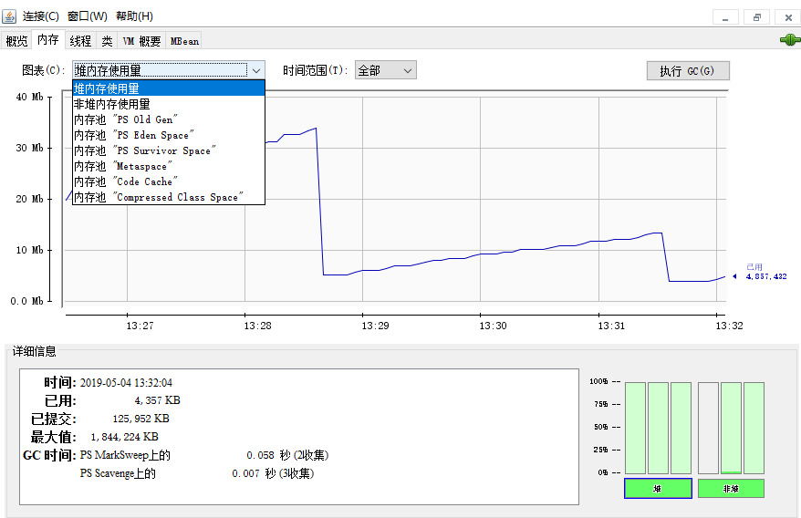

[TOC]

### JDK 监控和故障处理工具

给一个系统定位问题可以分析**运行日志、异常堆栈、GC日志、线程快照文件（threaddump/javacore文件）、堆转储快照（heapdump/hprof文件）**等内容。

#### JDK的命令行工具

这些命令在 JDK 安装目录下的 **bin** 目录下：

|    名称    |                           主要作用                           |
| :--------: | :----------------------------------------------------------: |
|  **jps**   | Jvm Process Status Tool, 显示指定系统内所有的 HotSpot 虚拟机**进程** |
| **jstat**  | Jvm Statistics Monitoring Tool, 用于收集 HotSpot **虚拟机各方面的运行数据** |
| **jinfo**  |     Configuration Info for Java，显示**虚拟机配置**信息      |
|  **jmap**  | Memory Map for Java,生成虚拟机的**内存转储快照**（heapdump 文件） |
|  **jhat**  | Jvm Heap Dump Browser，用于**分析 heapmap 文件**，它会建立一个 http/html 服务器让用户可以在浏览器上查看分析结果 |
| **jstack** |       Stack Trace for Java , 显示虚拟机的**线程快照**        |

##### 1. jps：虚拟机进程状况工具

以列出正在运行的**虚拟机进程**，并显示虚拟机执行**主类名称**以及这些进程的本地虚拟机**唯一ID**。

```java
jps命令格式 jps [options] [hostid]
```

例子：

```java
C:\Users\Nano>jps
7360 NettyClient2
17396
7972 Launcher
16504 Jps
17340 NettyServer
```

- `jps -l`:  输出主类的全名，如果进程执行的是 Jar 包，输出 Jar 路径。

```java
C:\Users\Nano>jps -l
7360 firstNettyDemo.NettyClient2
17396
7972 org.jetbrains.jps.cmdline.Launcher
16492 sun.tools.jps.Jps
17340 firstNettyDemo.NettyServer
```

- `jps -v`：输出虚拟机进程启动时 **JVM 参数**。

- `jps -m`：输出传递给 Java 进程 **main() 函数的参数**。

##### 2. jstat：监视虚拟机各种运行状态信息

jstat 是用于监视虚拟机各种**运行状态信息**的命令行工具。它可以显示本地或者远程虚拟机进程中的**类装载、内存、垃圾回收、JIT编译**等运行数据，在仅提供了纯文本控制台环境的服务器上，它将是**运行期定位虚拟机性能问题的==首选工具==**。

jstat 的命令格式：

```java
jstat -<option> [-t] [-h<lines>] <vmid> [<interval> [<count>]]
```

比如 

```java
jstat -gc -h3 31736 1000 10
```

表示分析进程 id 为 31736 的 gc 情况，每隔 1000ms 打印一次记录，打印 10 次停止，每 3 行后打印指标头部。

常见的 **option** 如下：

```java
jstat -class vmid 		// 显示 ClassLoader 的相关信息
jstat -compiler vmid 	// 显示 JIT 编译的相关信息
jstat -gc vmid   		// 显示与 GC 相关的堆信息
jstat -gccapacity vmid 	// 显示各个代的容量及使用情况
jstat -gcnew vmid 		// 显示新生代信息
jstat -gcnewcapcacity vmid 	// 显示新生代大小与使用情况
jstat -gcold vmid 		// 显示老年代和永久代的信息
jstat -gcoldcapacity vmid 	// 显示老年代的大小
jstat -gcpermcapacity vmid 	// 显示永久代大小
jstat -gcutil vmid 		// 显示垃圾收集信息
```

##### 3. jinfo: 实时地查看和调整虚拟机各项参数

- `jinfo vmid` : 输出当前 jvm 进程的**全部参数和系统属性** (第一部分是系统的属性，第二部分是 JVM 的参数)。

- `jinfo -flag name vmid` : 输出**对应名称的参数**的具体值。比如输出 MaxHeapSize、查看当前 jvm 进程是否开启打印 GC 日志 ( `-XX:PrintGCDetails` :详细 GC 日志模式，这两个都是默认关闭的)。

```
C:\Users\Nano>jinfo  -flag MaxHeapSize 17340
-XX:MaxHeapSize=2124414976
C:\Users\Nano>jinfo  -flag PrintGC 17340
-XX:-PrintGC
```

##### 4. jmap：生成堆转储快照

jmap 命令用于生成==**堆转储快照**==。jmap 的作用并不仅仅为了获取 **dump 文件**，它还可以查询 finalize 执行队列、Java 堆和永久代的详细信息。**如空间使用率、当前用的是哪种收集器等**。

jmap 的命令格式 

```java
jmap [option] vmid
```

示例：将指定应用程序的堆快照输出到桌面。后面，可以通过 jhat、Visual VM 等工具**分析**该堆文件。

```java
C:\Users\Nano>jmap -dump:format=b,file=C:\Users\SnailClimb\Desktop\heap.hprof 17340
Dumping heap to C:\Users\SnailClimb\Desktop\heap.hprof ...
Heap dump file created
```

Sun JDK 提供 jhat 与 jmap 搭配使用，来**分析 dump 生成的堆快照**。jhat 内置了一个微型的 HTTP/HTML 服务器，生成 dump 文件的分析结果后，可以在**浏览器**中查看。

```java
C:\Users\Nano>jhat C:\Users\SnailClimb\Desktop\heap.hprof
Reading from C:\Users\SnailClimb\Desktop\heap.hprof...
Dump file created Sat May 04 12:30:31 CST 2019
Snapshot read, resolving...
Resolving 131419 objects...
Chasing references, expect 26 dots..........................
Eliminating duplicate references..........................
Snapshot resolved.
Started HTTP server on port 7000
Server is ready.
```

访问 http://localhost:7000/ 即可。


##### 6. jstack：生成虚拟机当前时刻的线程快照

jstack 命令用于生成虚拟机当前时刻的**线程快照**（一般称为 **threaddump** 或者 javacore 文件）。线程快照就是当前虚拟机内每一条线程正在执行的**方法堆栈集合**，生成线程快照的主要目的是**定位线程出现长时间==停顿==的原因**，如**线程死锁、死循环、请求外部资源导致长时间等待**等。

jstack 命令格式 

```java
jstack [option] vmid（进程号）
```

**下面是一个线程死锁的代码。通过 `jstack` 命令进行死锁检查，输出死锁信息，找到发生死锁的线程。**

```java
public class DeadLockDemo {
    private static Object resource1 = new Object();	// 资源 1
    private static Object resource2 = new Object();	// 资源 2

    public static void main(String[] args) {
        new Thread(() -> {
            // 锁定资源1
            synchronized (resource1) {
                System.out.println(Thread.currentThread() + "get resource1");
                try {
                    Thread.sleep(1000);
                } catch (InterruptedException e) {
                    e.printStackTrace();
                }
                System.out.println(Thread.currentThread() + "waiting get resource2");
                // 请求资源2
                synchronized (resource2) {
                    System.out.println(Thread.currentThread() + "get resource2");
                }
            }
        }, "线程 1").start();

        new Thread(() -> {
            // 锁定资源1
            synchronized (resource2) {
                System.out.println(Thread.currentThread() + "get resource2");
                try {
                    Thread.sleep(1000);
                } catch (InterruptedException e) {
                    e.printStackTrace();
                }
                System.out.println(Thread.currentThread() + "waiting get resource1");
                // 请求资源2
                synchronized (resource1) {
                    System.out.println(Thread.currentThread() + "get resource1");
                }
            }
        }, "线程 2").start();
    }
}
```

输出

```java
Thread[线程 1,5,main]get resource1
Thread[线程 2,5,main]get resource2
Thread[线程 1,5,main]waiting get resource2
Thread[线程 2,5,main]waiting get resource1
```

两个线程互相等待资源，造成死锁。

**通过 `jstack` 命令分析：**

```java
// 输出当前线程信息
C:\Users\Nano>jps
13792 KotlinCompileDaemon
7360 NettyClient2
17396
7972 Launcher
8932 Launcher
9256 DeadLockDemo
10764 Jps
17340 NettyServer
// 查看指定进程号的线程快照
C:\Users\Nano>jstack 9256
```

输出的部分内容如下：

```java
Found one Java-level deadlock:
=============================
"线程 2":
  waiting to lock monitor 0x000000000333e668 (object 0x00000000d5efe1c0, a java.lang.Object),
  which is held by "线程 1"
"线程 1":
  waiting to lock monitor 0x000000000333be88 (object 0x00000000d5efe1d0, a java.lang.Object),
  which is held by "线程 2"

Java stack information for the threads listed above:
===================================================
"线程 2":
        at DeadLockDemo.lambda$main$1(DeadLockDemo.java:31)
        - waiting to lock <0x00000000d5efe1c0> (a java.lang.Object)
        - locked <0x00000000d5efe1d0> (a java.lang.Object)
        at DeadLockDemo$$Lambda$2/1078694789.run(Unknown Source)
        at java.lang.Thread.run(Thread.java:748)
"线程 1":
        at DeadLockDemo.lambda$main$0(DeadLockDemo.java:16)
        - waiting to lock <0x00000000d5efe1d0> (a java.lang.Object)
        - locked <0x00000000d5efe1c0> (a java.lang.Object)
        at DeadLockDemo$$Lambda$1/1324119927.run(Unknown Source)
        at java.lang.Thread.run(Thread.java:748)

Found 1 deadlock.
```

 `jstack` 命令已经找到发生死锁的线程的具体信息。


#### JDK 的可视化工具

JDK 中除了提供大量的命令行工具外，还有两个功能强大的可视化工具：JConsole 和 VisualVM。

##### 1. JConsole

JConsole 工具在  JDK/bin 目录下，启动 JConsole 后，将自动搜索本机运行的 Jvm 进程，不需要 jps 命令来查询指定。双击其中一个 Jvm 进程即可开始监控，也可使用“远程进程”来连接远程服务器。

提供内存监控和线程监控的功能。



##### 2. VisualVM：多合一故障处理工具

VisualVM 是一个集成多个 JDK 命令行工具的可视化工具。VisualVM 基于 NetBeans 平台开发，它具备了插件扩展功能的特性，通过插件的扩展，可用于显示虚拟机进程及进程的配置和环境信息(jps，jinfo)，监视应用程序的CPU、GC、堆、方法区及线程的信息(jstat、jstack)等。VisualVM 在 JDK/bin 目录下。

可以直接在生产环境使用。

- 生成、浏览堆转储快照。
- 分析程序性能。


#### 堆转储

> **堆转储是啥？**

**Heap Dump** 也叫**堆转储文件**，是一个 Java 进程在**某个时间点上的内存快照**。

Heap Dump 有多种类型的。不过总体上 Heap Dump 在触发快照的时候都保存了 Java 对象和类的信息。

通常在写 Heap Dump 文件前会**触发一次 Full GC**，所以 Heap Dump 文件中保存的是 Full GC 后留下的对象信息。

> **堆转储可以干什么？**

一般在 Heap Dump 文件中可以获取到如下信息：

- 对象信息：类、成员变量、直接量以及引用值；
- 类信息：类加载器、名称、超类、静态成员；
- Garbage Collections Roots：JVM 可达的对象；
- 线程栈以及本地变量：获取快照时的线程栈信息，以及局部变量的详细信息。

因此可以分析如下问题：

- 找出内存泄漏的原因；
- 找出重复引用的 jar 或类；
- 分析集合的使用；
- 分析类加载器。

对 Heap Dump 的分析就是对应用的内存使用进行分析，从而更加合理地使用内存。

> **如何获取堆转储文件？**

1. **设置虚拟机参数-XX:+HeapDumpOnOutOfMemoryError**

设置此参数可以在发生 **OutOfMemoryError** 后获取到一份 HPROF 二进制 Heap Dump 文件：

```java
-XX:+HeapDumpOnOutOfMemoryError
```

生成的文件会直接写入到工作目录。

2. **设置虚拟机参数-XX:+HeapDumpOnCtrlBreak**

设置这个参数就可以在需要的时候按下 **CTRL+BREAK** 组合键**随时**获取一份 Heap Dump 文件。

```java
-XX:+HeapDumpOnCtrlBreak
```

3. **使用 jmap 工具**

这个算是用的**最多**的方式了吧。参考前述内容即可。

```java
jmap -dump:format=b,file=<filename.hprof> <pid>
```

4. **使用 jconsole 工具**


#### **参考资料**

- 虚拟机性能监控与故障处理工具：http://blog.csdn.net/wsyw126/article/details/62422005
- 堆转储分析：https://blog.csdn.net/hehmxy/article/details/89114116

