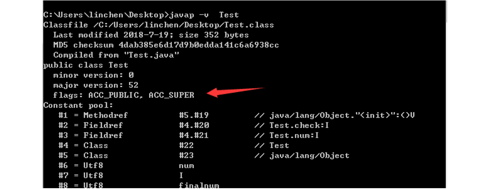

[TOC]

### 类文件结构

#### 平台无关性

各种不同平台的虚拟机与所有平台都使用统一的程序存储格式--**字节码**，是构成**平台无关性的基石**。

实现语言无关性的基础仍然是**虚拟机和字节码的存储格式**。把代码编译成 Class 文件，虚拟机并不关心 Class 的来源是何种语言。


#### Class 类文件的结构

Class 文件是一组以 **8 位**字节数为基础单位的**二进制流**，各个数据项目严格按照顺序紧凑排列在 Class 文件之中，中间没有添加任何分隔符，整个 Class 文件存储的内容几乎全部是程序的必要的数据。

Class 文件类似于 C 语言**结构体**的伪结构的存储数据，这种结构中只有两种数据类型：

- **无符号数**
- **表**

**无符号数**属于基本的**数据类型**，下表展示了对应的类型介绍：

| 数据类型 | 字节数 |
| :------: | :----: |
|    u1    |   1    |
|    u2    |   2    |
|    u4    |   4    |
|    u8    |   8    |

无符号数可以用来描述**数字，索引引用，数量值**或者按照UTF-8编码构成的**字符串值**。

**表**是由**多个无符号数**或者其他表作为数据项构成的复合数据类型，所有表习惯性以 "**info**" 结尾，表用于描述有层次结构的复合结构数据。整个 Class 文件本质上就是一张**表**。

无论是**无符号数还是表**，当需要描述同一类型但是数量不定的多个数据的时候，经常会使用一个前置容量计数器加若干个连续的数据项的形式，这时候称之为某一类型的**集合**。

根据 Java 虚拟机规范，类文件由单个 ClassFile 结构组成：

```c
ClassFile {
    u4             magic; // Class 文件的标志
    u2             minor_version;// Class 的小版本号
    u2             major_version;// Class 的大版本号
    u2             constant_pool_count;// 常量池的数量
    cp_info        constant_pool[constant_pool_count-1];// 常量池
    u2             access_flags;// Class 的访问标记
    u2             this_class;// 当前类
    u2             super_class;// 父类
    u2             interfaces_count;// 接口
    u2             interfaces[interfaces_count];// 一个类可以实现多个接口
    u2             fields_count;// Class 文件的字段属性
    field_info     fields[fields_count];// 一个类会可以有个字段
    u2             methods_count;// Class 文件的方法数量
    method_info    methods[methods_count];// 一个类可以有个多个方法
    u2             attributes_count;// 此类的属性表中的属性数
    attribute_info attributes[attributes_count];// 属性表集合
}
```

这里讲下面 Java 文件通过 javac 编译为  **.class** 文件：

```java
public class Test {
    private static int num = 3;
    private static final int finalnum = 3;
    private int check;
    public Test(){
    	check = 23;
    }
}
```

class 文件对应的**字节流码**:

```java
cafe babe 0000 0034 0018 0a00 0500 1309
0004 0014 0900 0400 1507 0016 0700 1701
0003 6e75 6d01 0001 4901 0008 6669 6e61
6c6e 756d 0100 0d43 6f6e 7374 616e 7456
616c 7565 0300 0000 0301 0005 6368 6563
6b01 0006 3c69 6e69 743e 0100 0328 2956
0100 0443 6f64 6501 000f 4c69 6e65 4e75
6d62 6572 5461 626c 6501 0008 3c63 6c69
6e69 743e 0100 0a53 6f75 7263 6546 696c
6501 0009 5465 7374 2e6a 6176 610c 000c
000d 0c00 0b00 070c 0006 0007 0100 0454
6573 7401 0010 6a61 7661 2f6c 616e 672f
4f62 6a65 6374 0021 0004 0005 0000 0003
000a 0006 0007 0000 001a 0008 0007 0001
0009 0000 0002 000a 0002 000b 0007 0000
0002 0001 000c 000d 0001 000e 0000 002b
0002 0001 0000 000b 2ab7 0001 2a10 17b5
0002 b100 0000 0100 0f00 0000 0e00 0300
0000 0500 0400 0600 0a00 0700 0800 1000
0d00 0100 0e00 0000 1d00 0100 0000 0000
0506 b300 03b1 0000 0001 000f 0000 0006
0001 0000 0002 0001 0011 0000 0002 0012
```

**Class文件字节码结构组织示意图** （之前在网上保存的，非常不错，原出处不明）：


##### 1. 魔数

可以看到第一个字符为 u4 类型的 **magic** 变量，称之为魔数，该变量来表明是否是一个虚拟机能接受的 Class 文件。上面的 Class 字节流显示 4 个字节 magic 是 0xcafe babe，咖啡宝贝的意思。

##### 2. 主次版本号

minor_version 代表 Java 的**次版本号**占**两个字节**，major_version 代表**主版本号**也占两个字节。在上述 Class 文件中：

- minor_version：0x0000
- major_version：0x0034

34 代表十进制的 52，说明 Java 版本为1.8，可以通过 `java -version` 来验证准确性。

##### 3. 常量池

```c
u2             constant_pool_count;// 常量池的数量
cp_info        constant_pool[constant_pool_count-1];// 常量池
```

接下来的是常量池的**入口**，常量池可以理解为 Class 文件中的**资源仓库**。由于常量池的数量是**不固定**的，所以需要放置 u2 类型的数据来表示常量池容量的**计数值** constant_pool_count，即上述 Class 文件中的 0x0018，转换为十进制为 24，表明当前常量池中有 23 项常量，索引范围为 1-24。

常量池中主要存放着两大类常量：**字面量(Literal)**以及**符号引用**(Symbolic References)。

字面量接近于 Java 层中的**常量**的概念，如文本字符串，申明为 final 的常量值等等。

符号引用则属于**编译原理**方面的概念，主要包括下面三类：

- 类和接口的全限定名
- 字段的名称和描述符
- 方法的名称和描述符

Java 在执行 javac 编译的时候，不像 c 和 c++ 一样有链接的步骤，而是在虚拟机加载 Class 文件时候进行**动态**的链接。**也就说在Class文件中不会保存各个方法，字段的最终内存信息，音这些字段，方法的符号引用不经过运行期转化的话是无法获得真正的内存入口的。**当虚拟机运行的时候，需要从 Class 文件的**常量池获得对应的符号引用**，然后在类创建或者运行时解析，翻译到具体的内存地址当中。

常量池中每一项常量都是一个**表**，这 14 种表有一个共同的特点：**开始的第一位是一个 u1 类型的标志位 -tag 来标识常量的类型，代表当前这个常量属于哪种常量类型．**

|               类型               | 标志（tag） |          描述          |
| :------------------------------: | :---------: | :--------------------: |
|        CONSTANT_utf8_info        |      1      |   UTF-8编码的字符串    |
|      CONSTANT_Integer_info       |      3      |       整形字面量       |
|       CONSTANT_Float_info        |      4      |      浮点型字面量      |
|        CONSTANT_Long_info        |     ５      |      长整型字面量      |
|       CONSTANT_Double_info       |     ６      |   双精度浮点型字面量   |
|       CONSTANT_Class_info        |     ７      |   类或接口的符号引用   |
|       CONSTANT_String_info       |     ８      |    字符串类型字面量    |
|      CONSTANT_Fieldref_info      |     ９      |     字段的符号引用     |
|     CONSTANT_Methodref_info      |     10      | **类中方法的符号引用** |
| CONSTANT_InterfaceMethodref_info |     11      |  接口中方法的符号引用  |
|    CONSTANT_NameAndType_info     |     12      |  字段或方法的符号引用  |
|     CONSTANT_MothodType_info     |     16      |      标志方法类型      |
|    CONSTANT_MethodHandle_info    |     15      |      表示方法句柄      |
|   CONSTANT_InvokeDynamic_info    |     18      | 表示一个动态方法调用点 |

`.class` 文件可以通过`javap -v class类名` 指令来看一下其常量池中的信息(`javap -v  class类名-> temp.txt` ：将结果输出到 temp.txt 文件)。

上述都是字面量和符号引用。

CONSTANT_Methodref_info 这个符号引用包括两部分， 一部分是该方法所在的**类**， 另一部分是该方法的方法名和描述符。 这就是所谓的 “**类中方法的符号引用**”。

```c
CONSTANT_Methodref_info {
    u1 tag;
    u2 class_index;             // CONSTANT_Class_info
    u2 name_and_type_index;     // CONSTANT_NameAndType_info
}
```

这里如果一直通过 Class 的字节码去看就太费劲了，我们可以 javap 来代替对应的查看操作，调用获得常量池的信息

```java
javap -p Test
```

截图如下:


上图中 Constant pool 表示 Class 文件中的常量池，图中总共 23 个常量值，跟我们上面通过字节码计算的方式得出的结果一致。可以看到第一个CONSTANT_Methodref_info 对应的是 **init** 方法，来自于 Obejct 类，返回值为 void，参数为空。

##### 4. 访问标志

在常量池结束之后，紧接着的两个字节表示访问标志，这个标志用于**识别类或者接口层次的访问信息**，包括：

- 这个 Class 是**类还是接口**
- 是否定义为 **public** 类型
- 是否定义为 **abstract** 类型
- 如果是类，是否被声明为 **final** 类型
- ...

这个我们也可以通过 javap 命令来看到对应的标志：



可以看到 Test 类的 flag 为 **ACC_PUBLIC 和 ACC_SUPER**。

##### 5. 类索引，父索引和接口索引集合

类索引 (this_class) 以及父类索引 (super_class) 都是一个 u2 类型的数据，接口索引集合(interfaces)是一组 u2 类型的数据集合，在 Class 文件中，通过上述三个数据来**确定这个类的==继承关系==**。

**类索引**确定这个类的**全限定名**，**父类索引**确定这个类的**父类的全限定名**，除了 Object 类 之外，其他的所有类的父类索引都不为 0，**接口索引**集合用来描述该类实现了**哪些接口**。

##### 6. 字段表集合

```c
u2             fields_count;// Class 文件的字段的个数
field_info     fields[fields_count];// 一个类会可以有个字段
```

字段表用于描述接口或者类中**声明的变量**。字段包括**静态**变量以及**实例**变量，但**不包括**在方法内部声明的**局部变量**。

一个字段可以包含的信息如下：

- 字段的作用域 (public, private, protected)
- 实例变量还是类变量(有无 static 修饰符)
- 可变性(final)
- 并发可见性(volatile，强制从主内存中读写)
- 是否可序列化(transient)
- 字段数据类型(基本类型，对象，数组)
- 字段名称

各个修饰符都可以用布尔值来设定是否存在，对于字段的数据类型以及名称，则只能引用常量池中的常量来描述了。

##### 7. 方法表集合

```c
u2             methods_count;// Class 文件的方法的数量
method_info    methods[methods_count];// 一个类可以有个多个方法
```

Class 文件存储格式中对**方法的描述**与对字段的描述几乎是一样的。

因为 **volatile** 以及 **transient** 关键字**不能修饰方法**，所以方法表的访问标志中**没有** ACC_VOLATILE 和ACC_TRANSIENT 标志。但是可以使用 **synchronized，native，strictfp 和 abstract** 关键字修饰方法，则对应增加了访问标志。

如果父类方法在子类中**没有被重写**，那么方法表集合中就不会出现父类的方法信息，但是有可能出现由**编译器自动添加**的方法，比如 \<init> 和 \<clinit> 方法。

##### 8. 属性表集合

在 Class 文件，字段表，方法表中都可以携带自己的属性表集合，以用于描述某些场景专有的信息。与 Class 文件中其它的数据项目要求的顺序、长度和内容不同，属性表集合的限制稍微宽松一些，不再要求各个属性表具有严格的顺序，并且只要不与已有的属性名重复，任何人实现的编译器都可以向属性表中写 入自己定义的属性信息，Java 虚拟机运行时会忽略掉它不认识的属性。


#### 参考资料

- <https://docs.oracle.com/javase/specs/jvms/se7/html/jvms-4.html>
- <https://coolshell.cn/articles/9229.html>
- <https://blog.csdn.net/luanlouis/article/details/39960815>
- 《实战 Java 虚拟机》


