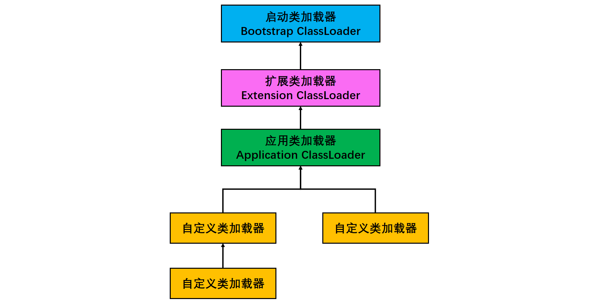

[TOC]

### 类加载机制

#### 类的生命周期

注意对比之前 **new 一个关键字会发生什么**部分的内容。

类的**生命周期**如下图所示。


具体包括以下几个阶段：

- **加载（Loading）** 

- **连接**

  - **验证（Verification）** 

  - **准备（Preparation）** 
  - **解析（Resolution）** 

- **初始化（Initialization）** 

- 使用（Using）

- 卸载（Unloading）

其中**验证、准备、解析** 3 个步骤统称为**连接**。

**加载、验证、准备、初始化、卸载**这几个阶段的顺序是确定的，而==**解析阶段**==则不一定：它在某些情况下**可以**在**初始化阶段之后**再开始，这是为了支持 Java 语言的运行时绑定（也称为**动态绑定**）。

通常上述的过程都是相互**交叉混合**进行的，通常会在一个阶段执行时调用、激活另一个阶段。

类是在**运行期**间第一次使用时**动态加载**的，而不是一次性加载所有类。如果一次性加载会占用很多的内存。

##### 1. 加载

加载是类加载的一个阶段，注意不要混淆。

加载过程完成以下三件事：

- 通过类的完全限定名称获取定义该类的**二进制**字节流。
- 将该字节流表示的静态存储结构转换为方法区的运行时存储结构。
- 在内存中生成一个代表该类的 **Class 对象**，作为方法区中该类各种数据的访问入口。


其中**类的二进制字节流**可以从以下方式中获取：

- **文件**：从 ZIP 包读取，这很常见，最终成为日后 JAR、EAR、WAR 格式的基础。
- **网络**：从网络中获取，这种场景最典型的应用是 Applet。
- **运行时计算生成**：这种场景使用得最多得就是动态代理技术，在 java.lang.reflect.Proxy 中，就是用了 ProxyGenerator.generateProxyClass 的代理类的二进制字节流。
- **由其他文件生成**：由其他文件生成，典型场景是 JSP 应用，即由 JSP 文件生成对应的 Class 类。
- **数据库**：从数据库读取，这种场景相对少见，例如有些中间件服务器（如 SAP Netweaver）可以选择把程序安装到数据库中来完成程序代码在集群间的分发。 

> **数组类与非数组类的加载**

**注意：** **非数组类**加载阶段既可以使用系统提供的类加载器来完成，也可以由**用户自定义的类加载器**去完成。（即重写一个类加载器的 **loadClass**() 方法）

对于**数组类**而言有些不同，数组类本身不通过类加载器创建，它是由 Java **虚拟机直接创建**的。但是数组类的**元素类型**最终是要靠**类加载器**去创建。

##### 2. 验证

验证是连接阶段的第一步，这一阶段的**目的是为了确保 Class 文件的字节流中包含的信息符合当前虚拟机的要求**，并且不会危害虚拟机自身的安全。

虚拟机如果不检查输入的字节流，并对其完全信任的话，很可能会因为载入了有害的字节流而导致系统崩溃，所以验证是虚拟机对自身保护的一项重要工作。这个阶段是否严谨，直接决定了 Java 虚拟机是否能承受恶意代码的攻击。

从整体上看，验证阶段大致上会完成 4 个阶段的校验工作：**文件格式、元数据、字节码、符号引用**。

###### ① 文件格式验证

验证字节流是否符合 **Class 文件格式的规范**，并且能被当前版本的虚拟机处理。该验证阶段的主要目的是保证输入的字节流能正确地解析并存储于方法区之内。

- 是否以 0xCAFEBABE 开头，前四个字节为魔数。
- 版本号是否合理，如：JDK1.8（52.0）、JDK1.7（51.0）。

###### ② 元数据验证

该阶段对字节码描述的信息进行**语义分析**，保证不存在不符合 Java 语言规范的元数据信息。

- 是否有父类？
- 继承了 final 类？
- 非抽象类实现了所有的抽象方法？

###### ③ 字节码验证

通过数据流和控制流分析，确保程序语义是合法、符合逻辑的。

- 运行检查
- 栈数据类型和操作码数据参数吻合
- 跳转指令指定到合理的位置

###### ④ 符号引用验证

最后一个阶段的校验发生在**虚拟机将符号**引用转化为**直接引用**的时候，这个转化动作将在连接的第三个阶段——解析阶段中发生。符号引用验证的目的是确保解析动作能正常执行。

验证的内容主要有：

- 符号引用中通过字符串描述的**全限定名**是否能找到对应的**类**；
- 在指定类中是否存在符号方法的**字段描述**及简单名称所描述的**方法和字段**；
- 符号引用中的类、字段和方法的**访问性**（private、protected、public、default）是否可被当前类访问。

##### 3. 准备

准备阶段是正式为**类变量分配内存**并设置类变量**==初始值==**的阶段，这些变量所使用的内存都将在方法区中进行分配。（备注：这时候进行内存分配的==**仅包括类变量**==（被 static 修饰的变量），而**不包括实例变量**，实例变量将会在对象实例化时随着对象一起分配在 Java 堆中）。

初始值通常是数据类型的**零值**。

实例变量不会在这阶段分配内存，它将会在对象实例化时随着对象一起分配在堆中。注意，实例化不是类加载的一个过程，类加载发生在所有实例化操作之前，并且类加载只进行一次，实例化可以进行多次。

初始值一般为 **0 值**，例如下面的类变量 value 被初始化为 0 而不是 123，在初始化的 **\<clinit> 中才会被设置为 1**。

基本数据类型的零值表：

| 数据类型 |   零值    | 数据类型  | 零值  |
| :------: | :-------: | :-------: | :---: |
|   int    |     0     |  boolean  | false |
|   long   |    0L     |   float   | 0.0f  |
|  short   | (short) 0 |  double   | 0.0d  |
|   char   | '\u0000'  | reference | null  |
|   byte   | (byte) 0  |           |       |

**注意**

```java
public static int value = 123;
```

那么变量 value 在准备阶段过后的==**初始值为 0**== 而不是 123，这时候尚未开始执行任何 Java  方法，把 value 赋值为123 的动作将在**初始化阶段**才会被执行。

一些特殊情况（加了 final 修饰符）：如果类变量是**常量**，那么它**将初始化为表达式所定义的值**而不是 0。

```java
public static final int value = 123; 
```

编译时 Javac 将会为 value 生成 **ConstantValue  属性**，在准备阶段虚拟机就会根据 ConstantValue 的设置将 value 赋值为 123。

**注意**：方法内部的**局部变量**不像类变量具有“准备阶段”，所以在**程序中必须初始化**使用。没有赋初始值是不能使用的。

##### 4. 解析

将常量池的**符号引用**替换为**==直接引用==**的过程。

- 类或接口的解析
- 字段解析
- 类方法解析
- 接口方法解析

其中解析过程在某些情况下可以在初始化阶段之后再开始，这是为了支持 Java 的**动态绑定**。

> **那么符号引用与直接引用有什么关联呢？**

- **符号引用**(Symbolic References)： 符号引用以一组**符号**来描述所引用的目标，符号可以是符合约定的任何形式的字面量，符号引用与虚拟机实现的内存布局无关，引用的目标并**不一定**已经加载到**内存**中。

- **直接引用**（Direct References）: 直接引用可以是**直接指向目标**的指针、相对偏移量或是一个能间接定位到目标的句柄。直接引用与虚拟机实现的内存布局相关，引用的**目标必定已经在内存**中存在。

虚拟机规范没有规定解析阶段发生的具体时间，虚拟机实现可以根据需要来判断到底是在类被加载时解析还是等到一个符号引用将要被使用前才去解析。
解析动作主要针对类或接口、字段、类方法、接口方法、方法类型、方法句柄和调用点限定符 **7 类符号引用**进行。

对一个符号引用进行多次解析请求是很常见的，为了避免这个问题，虚拟机实现可以在第一个解析成功后，**缓存结果**，后续使用这个结果即可。但是如果第一次失败，后面都会失败。

综上，**解析阶段是虚拟机将常量池内的==符号引用==替换为==直接引用==的过程，也就是得到类或者字段、方法在==内存==中的指针或者偏移量。**

##### 5. 初始化

初始化阶段才**真正开始执行类中定义的 Java 程序**代码。初始化阶段是虚拟机执行==**类构造器 \<clinit>() 方法**==的过程。

在准备阶段，类变量已经赋过一次系统要求的**初始值**（零值），而在初始化阶段，根据**程序员写的代码**来初始化类变量和其它资源。

- \<clinit>() 是由编译器自动收集类中所有**类变量**的赋值动作和静态语句块中的语句合并产生的，编译器收集的顺序由语句在源文件中出现的顺序决定。特别注意的是，**==静态语句块只能访问到定义在它之前的类变量，定义在它之后的类变量只能赋值，不能访问==**。例如以下代码：

```java
public class Test {
    static {
        i = 0;                // 给变量赋值可以正常编译通过
        System.out.print(i);  // 这句编译器会提示“非法向前引用”
    }
    static int i = 1;
}
```

- 虚拟机中第一个被执行的  &lt;clinit>() 方法的类肯定是 java.lang.**Object**。
- 由于**父类的 &lt;clinit>() 方法先执行**，也就意味着**父类中定义的静态语句块的执行要==优先于子类==**。例如以下代码：

```java
static class Parent {
    public static int A = 1;
    static {
        A = 2;
    }
}

static class Sub extends Parent {
    public static int B = A;
}

public static void main(String[] args) {
     System.out.println(Sub.B); 
     // 2
}
```

- 接口中**不可以**使用静态语句块，但仍然有类变量初始化的赋值操作，因此**接口与类一样都会生成 &lt;clinit>()** 方法。但接口与类不同的是，执行接口的 &lt;clinit>() 方法不需要先执行父接口的 &lt;clinit>() 方法。只有当父接口中定义的变量使用时，父接口才会初始化。另外，接口的实现类在初始化时也一样不会执行接口的 &lt;clinit>() 方法。
- **虚拟机会保证一个类的 &lt;clinit>() 方法在多线程环境下被正确的==加锁和同步==**，如果多个线程同时初始化一个类，只会有一个线程执行这个类的 &lt;clinit>() 方法，其它线程都会**阻塞等待**，直到活动线程执行 &lt;clinit>() 方法完毕。如果在一个类的 &lt;clinit>() 方法中有耗时的操作，就可能造成多个线程阻塞，在实际过程中此种阻塞很隐蔽。

##### 6. 卸载

卸载类即该类的 Class 对象被 GC。

卸载类需要满足 3 个要求（就是类被 GC 的条件）:

1. 该类的所有的实例对象都已被 GC，也就是说堆不存在该类的实例对象。
2. 该类没有在其他任何地方被引用。
3. 该类的类加载器的实例已被 GC。

上面的要求很难达到，所有 GC 还是一般发生在**堆**中。

只要想通一点就好了，JDK 自带的 BootstrapClassLoader, ExtensionClassLoader, ApplicationClassLoader 负责加载 JDK 提供的类，所以它们(类加载器的实例)肯定不会被回收。而我们自定义的类加载器的实例是可以被回收的，所以使用我们自定义加载器加载的类是可以被卸载掉的。


#### 类初始化的时机

##### 1. **主动引用**

虚拟机规范中并没有强制约束何时进行加载，但是规范严格规定了有且只有下列**五种**情况**必须对类进行初始化**（加载、验证、准备都会随之发生）：

- 遇到 **new、getstatic、putstatic、invokestatic**  这四条字节码指令时，如果类没有进行过初始化，则必须先触发其初始化。最常见的生成这 4 条指令的场景是：使用 new  关键字实例化对象的时候；读取或设置一个类的静态字段（被 final  修饰、已在编译期把结果放入常量池的静态字段除外）的时候；以及调用一个类的静态方法的时候。
- 使用 java.lang.**reflect 包**的方法对类进行**反射调用**的时候，如果类没有进行初始化，则需要先触发其初始化。
- 当初始化**一个类**的时候，如果发现其**父类还没有进行过初始化**，则需要先**触发其父类的初始化**。
- 当虚拟机启动时，用户需要指定一个要执行的**主类**（包含 main() 方法的那个类），虚拟机会先初始化这个主类；
- 当使用 JDK 1.7 的**动态语言支持**时，如果一个 java.lang.invoke.**MethodHandle** 实例最后的解析结果为  REF_getStatic, REF_putStatic, REF_invokeStatic  的方法句柄，并且这个方法句柄所对应的类没有进行过初始化，则需要先触发其初始化；

而对于接口，当一个接口在初始化时，并不要求其父接口全部都完成了初始化，只有在**真正使用到父接口**时（如引用父接口中定义的常量）才会初始化。

##### 2. **被动引用**

**所有引用类的方式都不会触发初始化称为==被动引用==，下面是3个被动引用例子：**

**①通过子类引用父类==静态==字段，不会导致子类初始化；**

```java
public class SuperClass {
    static {
        System.out.println("SuperClass（父类）被初始化了。。。");
    }
    public static int value = 66;
}
```

```java
public class Subclass extends SuperClass {
    static {
        System.out.println("Subclass（子类）被初始化了。。。");

    }
}
```

```java
public class Test1 {

    public static void main(String[] args) {

        // 1:通过子类调用父类的静态字段不会导致子类初始化
        // System.out.println(Subclass.value);//SuperClass（父类）被初始化了。。。66
        // 2:通过数组定义引用类，不会触发此类的初始化
        SuperClass[] superClasses = new SuperClass[3];
        // 3:通过new 创建对象,可以实现类初始化，必须把1下面的代码注释掉才有效果不然经过1的时候类已经初始化了，下面这条语句也就没用了。
        //SuperClass superClass = new SuperClass();
    }
}
```

**②通过==数组定义==引用类，==不会==触发此类的初始化；该过程会对==数组类==进行初始化，数组类是一个由虚拟机自动生成的、直接继承自 Object 的子类，其中包含了数组的属性和方法。**

```java
SuperClass[] sca = new SuperClass[10];
```

**③==常量==在编译阶段会存入调用类的==常量池==中，本质上并没有直接引用定义常量的类，因此==不会==触发定义常量的类的初始化。**

```java
public class ConstClass {
    static {
        System.out.println("ConstClass被初始化了。。。");
    }
    public static final String HELLO = "hello world";
}
```

```java
public class Test2 {

    public static void main(String[] args) {
        // 输出结果：hello world
        System.out.println(ConstClass.HELLO);
    }
}
```


#### 类加载器

虚拟机将加载二进制字节流的动作放在虚拟机外实现，让程序自己决定如何获取所需要的实现类。实现这个动作的代码模块称为”**类加载器**“。

##### 1. 类的相等

**两个类相等**，需要类本身相等，并且使用**同一个类加载器**进行加载。这是因为每一个类加载器都拥有一个**独立的类名称空间**。**相同的字节码被不同的类加载器加载的类不相等**。

这里的**相等**，包括类的 Class 对象的 **equals**() 方法、**isAssignableFrom**() 方法、**isInstance**() 方法的返回结果为 true，也包括使用 instanceof 关键字做对象所属关系判定结果为 true。

**类加载器**在**类层次划分、OSGi、热部署和代码加密**等领域有重要作用。

##### 2. 分类

从 Java 虚拟机的角度来讲，只存在以下两种不同的类加载器：

- **启动类加载器（Bootstrap ClassLoader）**，使用 C++ 实现，是虚拟机自身的一部分；

- **所有其它**类的加载器，使用 Java 实现，独立于虚拟机，**继承**自抽象类 java.lang.**ClassLoader**。

从 Java 开发人员的角度看，类加载器可以划分得更细致一些：

- **==启动类加载器（Bootstrap ClassLoader）==**此类加载器负责将存放在 &lt;**JRE_HOME>\lib** 目录中的，或者被 -**Xbootclasspath** 参数所指定的路径中的，并且是虚拟机识别的（仅按照文件名识别，如 rt.jar，名字不符合的类库即使放在 lib 目录中也不会被加载）类库加载到虚拟机内存中。启动类加载器无法被 Java 程序直接引用，用户在编写自定义类加载器时，如果需要把加载请求委派给启动类加载器，直接使用 null 代替即可。
- **==扩展类加载器（Extension ClassLoader）==**这个类加载器是由 ExtClassLoader（sun.misc.Launcher$ExtClassLoader）实现的。它负责将 &lt;**JAVA_HOME>\lib\ext** 或者被 java.ext.dir 系统变量所指定路径中的所有类库加载到内存中，开发者可以直接使用扩展类加载器。
- **==系统类加载器（Application ClassLoader）==**这个类加载器是由 AppClassLoader（sun.misc.Launcher$AppClassLoader）实现的。由于这个类加载器是 ClassLoader 中的 **getSystemClassLoader**() 方法的返回值，因此一般称为**系统类加载器**。它负责**加载用户类路径（ClassPath）上所指定**的类库，开发者可以直接使用这个类加载器，如果应用程序中没有自定义过自己的类加载器，一般情况下这个就是程序中**默认**的类加载器。

应用程序是由三种类加载器互相配合从而实现类加载，除此之外还可以加入自己定义的类加载器。

##### 3. 自定义类加载器

自定义类载器步骤：   

- 定义一个类，继承 ClassLoader。
- 重写 loadClass 方法。
- 实例化 Class 对象。

自定义类加载器的优势

- 类加载器是 Java 语言的一项创新，也是 Java  语言流行的重要原因之一，它最初的设计是为了满足 java applet 的需求而开发出来的。
- 高度的灵活性。
- 通过自定义类加载器可以实现热部署。
- 代码加密。

自定义类加载器需要继承 **java.lang.ClassLoader**。

以下代码中的 FileSystemClassLoader 是**自定义**类加载器，用于加载**文件系统**上的类。它首先根据类的全名在文件系统上查找类的字节代码文件（.class 文件），然后**读取**该文件内容，最后通过 **defineClass()** 方法来把这些字节代码转换成 **java.lang.Class 类**的实例。

java.lang.ClassLoader 的 **loadClass**() 实现了**双亲委派模型**的逻辑，**自定义类加载器一般不去重写它**，但是需要**重写 findClass() 方法**。

```java
// 自定义文件系统类加载器
public class FileSystemClassLoader extends ClassLoader {

    private String rootDir;

    public FileSystemClassLoader(String rootDir) {
        this.rootDir = rootDir;
    }
	
    protected Class<?> findClass(String name) throws ClassNotFoundException {
        byte[] classData = getClassData(name);
        if (classData == null) {
            throw new ClassNotFoundException();
        } else {
            return defineClass(name, classData, 0, classData.length);
        }
    }

    private byte[] getClassData(String className) {
        String path = classNameToPath(className);
        try {
            InputStream ins = new FileInputStream(path);
            ByteArrayOutputStream baos = new ByteArrayOutputStream();
            int bufferSize = 4096;
            byte[] buffer = new byte[bufferSize];
            int bytesNumRead;
            while ((bytesNumRead = ins.read(buffer)) != -1) {
                baos.write(buffer, 0, bytesNumRead);
            }
            return baos.toByteArray();
        } catch (IOException e) {
            e.printStackTrace();
        }
        return null;
    }

    private String classNameToPath(String className) {
        return rootDir + File.separatorChar
                + className.replace('.', File.separatorChar) + ".class";
    }
}
```

##### 4. 自定义类加载器的典型应用

- **Tomcat**，类加载器架构，自己定义了多个类加载器。
  - 保证了同一个服务器的两个 Web 应用程序的 Java 类库**隔离**；
  - 保证了同一个服务器的两个 Web 应用程序的 Java 类库又可以**相互共享**；比如多个 Spring 组织的应用程序不能共享，会造成资源浪费；
  - 保证了服务器尽可能保证自身的安全不受不受部署 Web 应用程序影响；
  - 支持 JSP 应用的服务器，大多需要支持热替换 (HotSwap) 功能。
- OSGi(Open Service GateWay Initiative)，是基于 Java 语言的**动态模块化**规范。已成为 Java 世界的“事实上”的模块化标准，最为熟悉的案例的 Eclipse IDE。


#### 双亲委派模型

下图展示了类加载器之间的层次关系，称为**==双亲委派模型==**（Parents Delegation Model）。该模型要求除了顶层的启动类加载器外，其它的类加载器都要有自己的父类加载器。这里的父子关系一般通过**组合关系**（Composition）来实现，而不是继承关系（Inheritance）。



##### 1. **工作过程**

每一个类都有一个对应它的类加载器。系统中的 ClassLoder 在协同工作的时候会默认使用 **双亲委派模型** 。

即在类加载的时候，系统会首先判断当前类是否被加载过。已经被加载的类会直接返回，否则才会尝试加载。

加载的时候，首先会把该请求委派该父类加载器的 `loadClass()` 处理，因此所有的请求最终都应该传送到**顶层**的启动类加载器 `BootstrapClassLoader` 中。

当父类加载器无法处理时，子加载器才会尝试自己去加载。当父类加载器为 null 时，会使用启动类加载器 `BootstrapClassLoader` 作为父类加载器。

每个类加载都有一个父类加载器，测试一下。

```java
public class ClassLoaderTest {
    public static void main(String[] args) {
        System.out.println("Current ClassLoader is: " + ClassLoaderTest.class.getClassLoader());
        System.out.println("The Parent ClassLoader is: " + ClassLoaderTest.class.getClassLoader().getParent());
        System.out.println("The GrandParent ClassLoader is: " + ClassLoaderTest.class.getClassLoader().getParent().getParent());
    }
}
```

```java
Current ClassLoader is: jdk.internal.loader.ClassLoaders$AppClassLoader@1f89ab83
The Parent ClassLoader is: jdk.internal.loader.ClassLoaders$PlatformClassLoader@340f438e
The GrandParent ClassLoader is: null
```

`AppClassLoader`的父类加载器为`ExtClassLoader` `ExtClassLoader`的父类加载器为null，**null并不代表`ExtClassLoader`没有父类加载器，而是 `BootstrapClassLoader`** 。

##### 2. **好处**

使用双亲委派模型来组织类加载器之间的关系，有一个显而易见的**好处**就是 Java 类随着它的类加载器一起具备了一种带有优先级的层次关系。从而使得**基础类得到统一**。

双亲委派模型保证了 Java 程序的稳定运行，可以**避免类的重复加载**（JVM 区分不同类的方式不仅仅根据类名，相同的类文件被不同的类加载器加载产生的是两个不同的类），也**保证了 Java 的核心 API 优先加载不被篡改**。如果没有使用双亲委派模型，而是每个类加载器加载自己的话就会出现一些问题，比如我们编写一个称为 `java.lang.Object` 类的话，那么程序运行的时候，系统就会出现多个不同的 `Object` 类。

注意：双亲委派模型是 Java 设计者们推荐给开发者们的一种类加载器实现方式，并不是一个强制性的约束模型。在 Java 的世界中大部分的类加载器都遵循这个模型，但也有例外。

##### 3. **源码片段**

以下是抽象类 java.lang.ClassLoader 的代码片段，其中的 loadClass() 方法运行过程如下：**先检查类是否已经加载过，如果没有则让==父类==加载器去加载。当父类加载器加载失败时抛出 ClassNotFoundException，此时尝试自己去加载。**

```java
private final ClassLoader parent; 
protected Class<?> loadClass(String name, boolean resolve) throws ClassNotFoundException {
    synchronized (getClassLoadingLock(name)) {
        // 首先，检查请求的类是否已经被加载过
        Class<?> c = findLoadedClass(name);
        if (c == null) {
            long t0 = System.nanoTime();
            try {
                if (parent != null) {// 父加载器不为空，调用父加载器loadClass()方法处理
                    c = parent.loadClass(name, false);
                } else {// 父加载器为空，使用启动类加载器 BootstrapClassLoader 加载
                    c = findBootstrapClassOrNull(name);
                }
            } catch (ClassNotFoundException e) {
                // 抛出异常说明父类加载器无法完成加载请求
            }

            if (c == null) {
                long t1 = System.nanoTime();
                // 自己尝试加载
                c = findClass(name);

                // this is the defining class loader; record the stats
                sun.misc.PerfCounter.getParentDelegationTime().addTime(t1 - t0);
                sun.misc.PerfCounter.getFindClassTime().addElapsedTimeFrom(t1);
                sun.misc.PerfCounter.getFindClasses().increment();
            }
        }
        if (resolve) {
            resolveClass(c);
        }
        return c;
    }
}
```

> **loadClass(), findClass(), defineClass()** 的区别？

- **loadclass**(): 判断是否已加载，使用双亲委派模型，请求父加载器，都为空，使用 findclass() 。

- **findclass**(): 根据名称或位置加载 .class 字节码,然后使用 defineClass()。

- **defineclass()**：解析定义 .class 字节流，返回 class 对象


##### 4. 破坏双亲委派模型

不想用双亲委派模型，如何打破双亲委派模型？

1. **自定义类加载器**，重写 **loadClass**() 方法；
2. 使用**线程上下文类加载器**；

> **双亲委派模型“被破坏”历史**

**第一次破坏**是因为类加载器和抽象类 java.lang.ClassLoader 在 JDK1.0 就存在的，而双亲委派模型在 JDK1.2 之后才被引入，为了兼容已经存在的用户自定义类加载器，引入双亲委派模型时做了一定的妥协：在java.lang.ClassLoader 中引入了一个 findClass() 方法，在此之前，用户去继承 java.lang.Classloader 的唯一目的就是重写 loadClass() 方法。JDK1.2 之后不提倡用户去覆盖 loadClass() 方法，而是把自己的类加载逻辑写到**findClass**() 方法中，如果 loadClass() 方法中如果父类加载失败，则会调用自己的 findClass() 方法来完成加载，这样就可以保证新写出来的类加载器是符合双亲委派模型规则的。

**第二次破坏**是因为模型自身的缺陷，现实中存在这样的场景：基础的类加载器需要求调用用户的代码，而基础的类加载器可能不认识用户的代码。为此，Java 设计团队引入的设计时“**线程上下文类加载器**（Thread Context ClassLoader）”。这样可以通过父类加载器请求子类加载器去完成类加载动作。已经违背了双亲委派模型的一般性原则。

**第三次破坏** 是由于用户对程序**动态性**的追求导致的。这里所说的动态性是指：“代码热替换”、“模块热部署”等等比较热门的词。说白了就是希望应用程序能够像我们的计算机外设一样，接上鼠标、U盘不用重启机器就能立即使用。OSGi 是当前业界“事实上”的 Java 模块化标准，OSGi 实现**模块化热部署的关键是它==自定义的类加载器==机制的实现**。每一个程序模块（OSGi 中称为 Bundle）都有一个自己的**类加载器**，当需要更换一个 Bundle 时，就把 **==Bundle 连同类加载器一起换掉==**以实现代码的热替换。在 OSGi 环境下，类加载器不再是双亲委派模型中的树状结构，而是进一步发展为更加复杂的网状结构。


#### 参考资料

- https://blog.csdn.net/xiaobao5214/article/details/81674215
- https://blog.csdn.net/xyang81/article/details/7292380
- https://juejin.im/post/5c04892351882516e70dcc9b
- http://gityuan.com/2016/01/24/java-classloader/
- https://blog.csdn.net/qq_31777123/article/details/80036682


