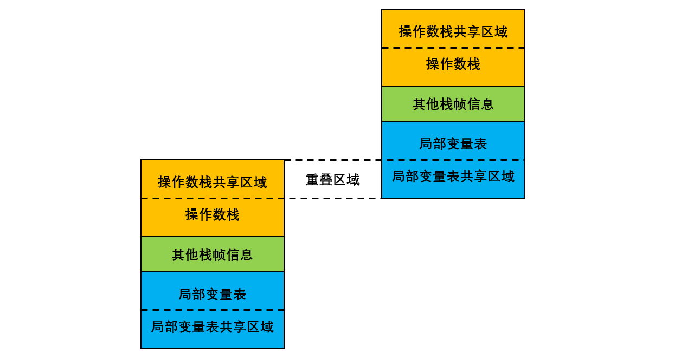

[TOC]

### 虚拟机方法调用与指令执行引擎

执行引擎是 Java 虚拟机最核心的组成部件之一。虚拟机的执行引擎由自己实现，所以可以**自行定制指令集**与执行引擎的结构体系，并且能够执行那些不被硬件直接支持的指令集格式。

所有的 Java 虚拟机的执行引擎都是一致的：**输入的是字节码文件，处理过程是字节码解析的等效过程，输出的是执行结果**。本节将主要从概念模型的角度来讲解**虚拟机的方法调用和字节码执行**。


#### 字节码指令简介

> **基于栈的指令集和基于寄存器的指令集**

Java 编译器输出的指令流，基本上是一种**基于栈的指令集架构（Instruction Set Architecture，ISA）**，**依赖==操作数栈==进行工作**。与之相对应的另一套常用的指令集架构是**基于寄存器的指令集**， **依赖寄存器进行工作**。

那么，**基于栈的指令集和基于寄存器的指令集这两者有什么不同呢？**

举个简单例子，分别使用这两种指令计算 1 + 1 的结果，**基于==栈==的指令集会是这个样子：**

```c
iconst_1
iconst_1
iadd
istore_0
```

两条 iconst_1 指令连续把两个常量 1 **压入栈**后，iadd 指令把栈顶的两个值**出栈、相加**，然后将结果**放回栈顶**，最后 istore_0 把栈顶的值放到局部变量表中的第 0 个 Slot 中。

**如果基于寄存器的指令集，那程序可能会是这个样子：**

```c
mov eax, 1
add eax, 1
```

mov 指令把 EAX 寄存器的值设置为 1，然后 add 指令再把这个值加 1，将结果就**保存在 EAX 寄存器**里面。

**基于栈的指令集主要的优点就是==可移植==，寄存器是由硬件直接提供，程序直接依赖这些硬件寄存器则不可避免地要受到硬件的约束。**

栈架构的指令集还有一些其他的优点，如代码相对更加紧凑，编译器实现更加简单等。
栈架构指令集的主要**缺点**是执行速度相对来说会稍微**慢**一些。


Java 虚拟机的**指令**由一个字节长度的、代表着某种特定操作含义的数字（称为**操作码**，Opcode）以及跟随其后的零至多个代表此操作所需参数（称为**操作数**，Operands）而构成。由于 Java 虚拟机采用**面向操作数栈**而不是寄存器的架构，所以大多数的指令都不包含操作数，只有一个**操作码**。

在 Java 虚拟机的指令集中，大多数的指令都包含了其操作所对应的**数据类型信息**（看指令就大概知道意思）。例如，iload 指令用于从局部变量表中加载 int 型的数据到操作数栈中，而 fload 指令加载的则是 float 类型的数据。这两条指令的操作在虚拟机内部可能会是由同一段代码来实现的，但在 Class 文件中它们必须拥有各自独立的操作码。

对于大部分与数据类型相关的字节码指令，它们的**操作码助记符**中都有特殊的字符来表明专门为哪种数据类型服务：**i 代表对 int 类型的数据操作，l 代表 long，s 代表 short，b 代表 byte，c 代表 char，f 代表 float，d 代表 double，a 代表 reference。**也有一些指令的助记符中没有明确地指明操作类型的字母，如 arraylength 指令，它没有代表数据类型的特殊字符，但操作数永远只能是一个数组类型的对象。还有另外一些指令，如无条件跳转指令 goto 则是与数据类型无关的。

在处理 boolean、byte、short 和 char 类型的数组时，也会**转换**为使用对应的 **int 类型**的字节码指令来处理。因此，大多数对于 boolean、byte、short 和 char 类型数据的操作，**实际上都是使用相应的 int 类型作为运算类型**（Computational Type）。

##### 1. 加载和存储指令

加载和存储指令用于将数据在栈帧中的**局部变量表**和**操作数栈**之间来回传输，这类指令包括如下内容（未列全）。

- 将一个**局部变量**加载到操作栈：iload、lload、fload、dload、aload。
- 将一个**数值**从操作数栈存储到局部变量表：istore、lstore、fstore、dstore、astore。
- 将一个**常**量加载到操作数栈：bipush、sipush、ldc、ldc_w、ldc2_w、aconst_null、iconst_m1。
- 扩充局部变量的访问索引的指令：wide。

存储数据的操作数栈和局部变量表主要就是由**加载和存储指令**进行操作，除此之外，还有少量指令，如访问对象的字段或数组元素的指令也会向操作数栈传输数据。

##### 2. 运算指令

运算或算术指令用于**对两个操作数栈上的值**进行某种特定运算，并把结果重新**存入到操作栈顶**。大体上算术指令可以分为两种：对**整型**数据进行运算的指令与对**浮点型**数据进行运算的指令，无论是哪种算术指令，都使用 Java 虚拟机的数据类型，由于没有直接支持 byte、short、char 和 boolean 类型的算术指令，对于这类数据的运算，应**使用操作 int 类型**的指令代替。整数与浮点数的算术指令在溢出和被零除的时候也有各自不同的行为表现，所有的算术指令如下。

- 加法指令：iadd、ladd、fadd、dadd。
- 减法指令：isub、lsub、fsub、dsub。
- 乘法指令：imul、lmul、fmul、dmul。
- 除法指令：idiv、ldiv、fdiv、ddiv。
- 求余指令：irem、lrem、frem、drem。
- 取反指令：ineg、lneg、fneg、dneg。
- 位移指令：ishl、ishr、iushr、lshl、lshr、lushr。
- 按位或指令：ior、lor。
- 按位与指令：iand、land。
- 按位异或指令：ixor、lxor。
- 局部变量自增指令：iinc。
- 比较指令：dcmpg、dcmpl、fcmpg、fcmpl、lcmp。

Java 虚拟机要求在进行浮点数运算时，所有的运算结果都必须舍入到适当的精度，非精确的结果必须舍入为可被表示的最接近的精确值。

##### 3. 类型转换指令

类型转换指令可以将两种不同的**数值**类型进行相互转换，这些转换操作一般用于实现用户代码中的显示类型转换操作，或者用来处理本节开篇所提到的字节码指令集中数据类型相关指令无法与数据类型一一对应的问题。

- int 类型到 long、float 或者 double 类型。
- long 类型到 float、double 类型。
- float 类型到 double 类型。

尽管数据类型**窄化转换**可能会发生上限溢出、下限溢出和精度丢失等情况，但是 Java 虚拟机规范中明确规定数值类型的窄化转换指令永远**不可能**导致虚拟机抛出运行时异常。

##### 4. 对象创建与访问指令

虽然类实例和数组都是**对象**，但 Java 虚拟机**对类实例和数组的创建与操作使用了不同的字节码指令**（数组和普通类型创建过程是不同的）。对象创建后，就可以通过对象访问指令获取对象实例或者数组实例中的字段或者数组元素，这些指令如下。

- 创建**类实例**的指令：new。
- 创建**数组**的指令：newarray、anewarray、multianewarray。
- 访问类字段（static 字段，或者成为类变量）和实例字段（非 static 字段，或者成为实例变量）的指令：getfield、putfield、getstatic、putstatic。
- 把一个数组元素加载到操作数栈的指令：baload、caload、saload、iaload、laload、faload、daload、aaload。
- 将一个操作数栈的值存储到数组元素中的指令：bastore、castore、sastore、iastore、fastore、dastore、aastore。
- 取数组长度的指令：arraylength。
- 检查类实例类型的指令：instanceof、checkcast。

##### 5. 操作数栈管理指令

​    如同操作一个普通数据结构中的堆栈那样，Java 虚拟机提供了一些用于**直接操作操作数栈**的指令，包括：

- 将操作数栈的栈顶一个或两个元素**出栈**：pop、pop2。
- 复制栈顶一个或两个数值并将复制值或双份的复制重新压入栈顶：dup、dup2、dup_x1、dup2_x1、dup_x2、dup2_x2。
- 将栈最顶端的两个数值**互换**：swap。

##### 6. 控制转移指令

控制转移指令可以让 Java 虚拟机有条件或无条件地从指定的位置指令而不是控制转移指令的下一条指令继续执行程序，从概念模型上理解，可以认为控制转移指令就是在有条件或无条件地**修改 PC 寄存器**的值。控制转移指令如下。

- **条件**分支：ifeq、iflt、ifle、ifne、ifgt、ifge、ifnull、ifnonnull、if_icmpeq、if_icmpne、if_icmplt、if_icmpgt、if_icmple、if_icmpge、if_acmpeq 和 if_acmpne。
- **复合条件**分支：tableswitch、lookupswitch。
- **无条件**分支：goto、goto_w、jsr、jsr_w、ret。

##### 7. 方法调用和返回指令

​    方法调用（分派、执行过程），先列举以下 5 条用于方法调用的指令。

- **invokevirtual**  指令用于调用对象的**实例方法**，根据对象的实际类型进行分派（虚方法分派），这也是 Java 语言中最常见的方法分派方式。
- **invokeinterface**  指令用于调用**接口方法**，它会在运行时搜索一下实现了这个接口方法的对象，找出适合的方法进行调用。
- **invokespecial**  指令用于调用一些需要**特殊处理的实例方法**，包括实例初始化方法、私有方法和父类方法。
- **invokestatic**  指令用于调用**类方法**（**static** 方法）。
- **invokedynamic**  指令用于在运行时**动态解析**出调用点限定符所引用的方法，并执行该方法，前面 4 条调用指令的分派逻辑都固化在 Java 虚拟机内部，而 invokedynamic 指令的分派逻辑是由用户所设定的引导方法决定的。

##### 8. 异常处理指令

在 Java 程序中显式抛出异常的操作（throw 语句）都由 **athrow** 指令来实现，除了用 throw 语句显式抛出异常情况之外，Java 虚拟机规范还规定了许多运行时异常会在其他 Java 虚拟机指令检测到异常状况时自动抛出。

##### 9. ==同步指令==

Java 虚拟机可以支持==**方法级**==（类级不是）的同步和方法内部一段指令序列的同步，这两种同步结构都是使用**管程**（Monitor）来支持的。

同步一段指令集序列通常是由 Java 语言中的 **synchronized** 语句块来表示的，Java 虚拟机的指令集中有 **==monitorenter 和 monitorexit 两条指令来支持 synchronized 关键字的语义==**，正确实现 synchronized 关键字需要 javac 编译器与 Java 虚拟机两者共同协作支持。

编译器必须确保无论方法通过何种方式完成，方法中调用过的每条 monitorenter 指令**都必须执行其对应的 monitorexit** 指令，而无论这个方法是正常结束还是异常结束。


#### 运行时栈帧结构

**栈帧（Stack Frame）** 是用于支持虚拟机**方法调用与执行**的数据结构，它是虚拟机运行时数据区中**虚拟机栈（Virtual Machine Stack）的栈元素**。

每一个方法从调用开始至执行完成的过程，都对应着一个栈帧在虚拟机栈里面从入栈到出栈的过程。

**栈帧**结构如下图所示。


每一个栈帧都存储了方法的**局部变量表、操作数栈、动态连接、方法返回地址**和一些额外的**附加信息**。

一个栈帧需要分配多少内存，不会受到程序运行期变量数据的影响，而仅仅取决于具体的虚拟机实现。

在活动线程中，只有位于**栈顶**的栈帧才是有效的，称为**当前栈帧**，与这个栈帧相关联的方法称为**当前方法**。

##### 1. 局部变量表

局部变量表是一组**变量值**存储空间，用于**存放方法参数和方法内定义的局部变量**。
局部变量表的容量以**变量槽**（Variable Slot）为最小单位。 一个 Slot 可以存放一个 **32 位**以内（boolean、byte、char、short、int、float、reference 等）的数据类型，**reference 类型**表示一个**对象实例**的引用，用于指向对象的地址。

**虚拟机通过==索引定位==的方式使用局部变量表**，索引值的范围从 0 开始至局部变量表最大的 Slot 数量。

**为了节省栈帧空间，局部变量 Slot 可以==重用==**，方法体中定义的变量，其作用域并不一定会覆盖整个方法体。如果当前字节码 PC 计数器的值超出了某个变量的作用域，那么这个变量的 Slot 就可以交给其他变量使用。

```java
注意：局部变量不像类变量具有“准备阶段”，所以必须初始化。没有赋初始值是不能使用的。
```

##### 2. 操作数栈

**Java 虚拟机的解释执行引擎成为“==基于栈的执行引擎==”，这里的“栈”就是指的“操作数栈”。**

**操作数栈（Operand Stack）**是一个**后入先出栈**。当一个方法执行开始时，这个方法的操作数栈是**空**的，在方法执行过程中，会有各种**字节码**指令往操作数栈中写入和提取内容，也就是 **出栈/入栈**操作。



如上图所示两个栈帧，在概念模型中，一个活动线程中两个**栈帧**是相互**独立**的。但大多数虚拟机实现都会做一些**优化**处理：让下一个栈帧的**部分操作数栈**与上一个栈帧的部分**局部变量表**重叠在一起，这样的好处是方法调用时可以**共享一部分数据**，而无须进行额外的参数复制传递。

##### 3. 动态连接

每个栈帧都包含一个**指向运行时常量池**中该栈帧所属**方法**的引用，持有这个引用是为了支持方法调用过程中的**动态连接**；

字节码中方法调用指令是以**常量池**中的**指向方法的符号**引用为参数的，有一部分符号引用会在类加载阶段或第一次使用的时候转化为**直接引用**，这种转化称为 **静态解析**，另外一部分在每次的运行期间转化为直接引用，这部分称为**动态连接**。

##### 4. 方法返回地址

当一个方法被执行后，有两种方式退出这个方法：

- 第一种是执行引擎遇到任意一个方法返回的字节码指令，这种退出方法的方式称为**正常完成出口（Normal Method Invocation Completion）**。
- 另外一种是在方法执行过程中遇到了异常，并且这个异常没有在方法体内得到处理（即本方法异常处理表中没有匹配的异常处理器），就会导致方法退出，这种退出方式称为**异常完成出口（Abrupt Method Invocation Completion）**。
  注意：这种退出方式**不会**给上层调用者产生任何返回值。

**无论采用何种退出方式，在方法退出后，都需要返回到方法==被调用==的位置，程序才能继续执行**，方法返回时可能需要在**栈帧**中保存一些信息，用来帮助恢复它的**上层方法**的执行状态。

方法**退出**的过程实际上等同于把**当前栈帧出栈**，因此退出时可能执行的操作有：恢复上层方法的局部变量表和操作数栈，把返回值（如果有的话）压入调用者栈帧的操作数栈中，调整 PC 计数器的值以指向方法调用指令后面的一条指令等。

##### 5. 附加信息

虚拟机规范允许虚拟机实现向栈帧中添加一些自定义的附加信息，例如与调试相关的信息等。


#### 方法调用

虚拟机如何调用方法？

方法调用阶段的目的：**确定被调用方法的==版本（哪一个方法）==，不涉及方法内部的具体运行过程**，在程序运行时，进行方法调用是最普遍、最频繁的操作。

**一切==方法调用==在 Class 文件里存储的都只是==符号引用==，这是需要在==类加载期间或者是运行期间==，才能确定为方法在实际运行时内存中的==入口地址==（相当于之前说的==直接引用==）**。

##### 1. 静态解析

“**==编译期可知，运行期不可变==**”的方法（**静态方法和私有方法**），在类加载的解析阶段，会将其**符号引用**转化为**直接引用（入口地址）**。这类方法的调用称为“**解析（Resolution）**”。

符合这种条件的有**静态方法、私有方法、实例构造器、父类方法** 4 类。这些方法称之为**非虚方法**。这些方法类加载时可以确定**入口地址**。

在 Java 虚拟机中提供了 5 条方法调用字节码指令：

- **invokestatic**: 调用静态方法 
- **invokespecial**: 调用实例构造器方法、私有方法、父类方法
- **invokevirtual**: 调用所有的虚方法
- **invokeinterface**: 调用接口方法，会在运行时在确定一个实现此接口的对象
- **invokedynamic**: 先在运行时动态解析出点限定符所引用的方法，然后再执行该方法，在此之前的 4 条调用命令的分派逻辑是固化在 Java 虚拟机内部的，而 invokedynamic 指令的分派逻辑是由用户所设定的引导方法决定的。

##### 2. 分派

**分派调用过程将会揭示==多态性==特征的一些最基本的体现，如==“重载”和“重写”==在 Java 虚拟中是如何实现的。**

###### **① 静态分派**

所有依赖**静态类型**来定位方法执行版本的分派动作，都称为**静态分派**。静态分派发生在**编译**阶段。

**静态分派**最典型的应用就是==**方法重载**==。

```java
public class StaticDispatch {
    static abstract class Human {
    }

    static class Man extends Human {
    }

    static class Woman extends Human {
    }

    public void sayhello(Human guy) {
        System.out.println("Human guy");
    }

    public void sayhello(Man guy) {
        System.out.println("Man guy");
    }

    public void sayhello(Woman guy) {
        System.out.println("Woman guy");
    }

    public static void main(String[] args) {
        Human man = new Man();
        Human woman = new Woman();
        StaticDispatch staticDispatch = new StaticDispatch();
        staticDispatch.sayhello(man);  // Human guy
        staticDispatch.sayhello(woman);// Human guy
    }
}
```

运行结果：

```java
Human guy
Human guy
```

**为什么会出现这样的结果呢？**

```java
Human man = new Man(); 
```

其中的 Human 称为变量的**==静态类型==（Static Type）**, Man 称为变量的**==实际类型（动态类型）==（Actual Type）**。
**两者的区别是**：静态类型在**编译器**可知，而实际类型到**运行期**才确定下来。
在重载时通过参数的**静态类型**而不是实际类型作为判定依据，因此，在编译阶段，Javac 编译器会根据**参数的静态类型**决定使用**哪个重载版本**。

使用哪个重载版本，就完全取决于**传入参数的数量和数据类型**。

所以选择了 sayhello(Human) 作为调用目标，并把这个方法的符号引用写到 main()方法里的两条 invokevirtual 指令的参数中。

###### ② 动态分派

在**运行期**根据**实际类**型确定方法执行版本的分派过程称为**==动态分派==**。最典型的应用就是**==方法覆写==**。

```java
public class DynamicDisptch {

    static abstract class Human {
        abstract void sayhello();
    }

    static class Man extends Human {

        @Override
        void sayhello() {
            System.out.println("man");
        }
    }

    static class Woman extends Human {

        @Override
        void sayhello() {
            System.out.println("woman");
        }
    }

    public static void main(String[] args) {
        Human man = new Man();
        Human woman = new Woman();
        man.sayhello();
        woman.sayhello();
        // 动态类型变为Woman
        man = new Woman();
        man.sayhello();
    }
}
```

运行结果：

```java
man
woman
woman
```

###### **③ 单分派和多分派**

方法的接收者、方法的参数都可以称为方法的宗量。根据分批基于多少种宗量，可以将分派划分为单分派和多分派。**单分派是根据一个宗量对目标方法进行选择的，多分派是根据多于一个的宗量对目标方法进行选择的。**

Java 在进行静态分派时，选择目标方法要依据两点：一是变量的静态类型是哪个类型，二是方法参数是什么类型。因为要根据两个宗量进行选择，所以 Java 语言的**静态分派属于多分派类型**。

运行时阶段的动态分派过程，由于编译器已经确定了目标方法的签名（包括方法参数），运行时虚拟机只需要确定方法的接收者的实际类型，就可以分派。因为是根据一个宗量作为选择依据，所以 Java 语言的**动态分派属于单分派类型**。

###### **④ 动态分派的实现**

由于**动态分派**是非常频繁的动作，而动态分派在方法版本选择过程中又需要在方法元数据中搜索合适的目标方法，虚拟机实现出于性能的考虑，通常不直接进行如此频繁的搜索，而是采用**优化方法**。

其中一种“稳定优化”手段是：在类的方法区中建立一个==**虚方法表**==（Virtual Method Table, 也称 vtable, 与此对应也存在**接口方法表**——Interface Method Table，也称 itable）。**使用虚方法表索引来代替元数据查找以提高性能。其原理与C++的虚函数表类似。**

虚方法表中存放的是各个方法的**实际入口地址**。如果某个方法在子类中没有被重写，那子类的虚方法表里面的地址入口和父类中该方法相同，都指向**父类的实现入口**。**虚方法表一般在类加载的连接阶段进行初始化**。

##### 3. 动态类型语言的支持

JDK 新增加了 **invokedynamic** 指令来是实现“**动态类型语言**”。

> **静态语言和动态语言的区别**

- **静态语言（强类型语言）**：
  静态语言是在**编译时变量的数据类型即可确定**的语言，多数静态类型语言要求在使用变量之前必须**声明**数据类型。 
  例如：C++、Java、Delphi、C# 等。
- **动态语言（弱类型语言）** ：
  动态语言是在**运行时确定数据类型**的语言。变量使用之前不需要类型声明，通常变量的类型是被赋值的那个值的类型。 
  例如 PHP/ASP/Ruby/Python/Perl/ABAP/SQL/JavaScript/Unix Shell 等等。
- **强类型定义语言** ：
  强制数据类型定义的语言。也就是说，一旦一个变量被指定了某个数据类型，如果不经过强制转换，那么它就永远是这个数据类型了。举个例子：如果你定义了一个整型变量 a,那么程序根本不可能将 a 当作字符串类型处理。强类型定义语言是类型安全的语言。
- **弱类型定义语言** ：
  数据类型可以被忽略的语言。它与强类型定义语言相反, 一个变量可以赋不同数据类型的值。强类型定义语言在速度上可能略逊色于弱类型定义语言，但是强类型定义语言带来的严谨性能够有效的避免许多错误。


#### 基于栈的字节码==解释执行引擎==

虚拟机如何调用方法的内容已经讲解完毕，现在我们来探讨虚拟机是**如何执行方法中的字节码指令**。

##### 解释执行

Java 语言经常被人们定位为 **“解释执行”语言**，在 Java 初生的 JDK1.0 时代，这种定义还比较准确的，但当主流的虚拟机中都包含了**即时编译**后，Class 文件中的代码到底会被解释执行还是编译执行，就成了只有虚拟机自己才能准确判断的事情。再后来，Java 也发展出来了直接生成本地代码的编译器 [如何 GCJ（GNU Compiler for the Java）]，而 C/C++ 也出现了通过解释器执行的版本（如 CINT），这时候再笼统的说“解释执行”，对于整个 Java 语言来说就成了几乎没有任何意义的概念，**只有确定了谈论对象是某种具体的 Java 实现版本和执行引擎运行模式时，谈解释执行还是编译执行才会比较确切**。

Java 语言中，javac 编译器完成了程序代码经过词法分析、语法分析到抽象语法树，再遍历语法树生成线性的字节码指令流的过程，因为这一部分动作是在 Java 虚拟机**之外**进行的，而**解释器在虚拟机内部**，所以 Java 程序的编译就是半独立实现的。


