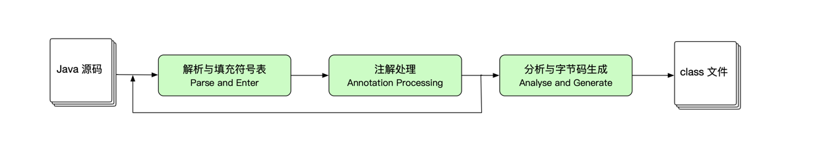
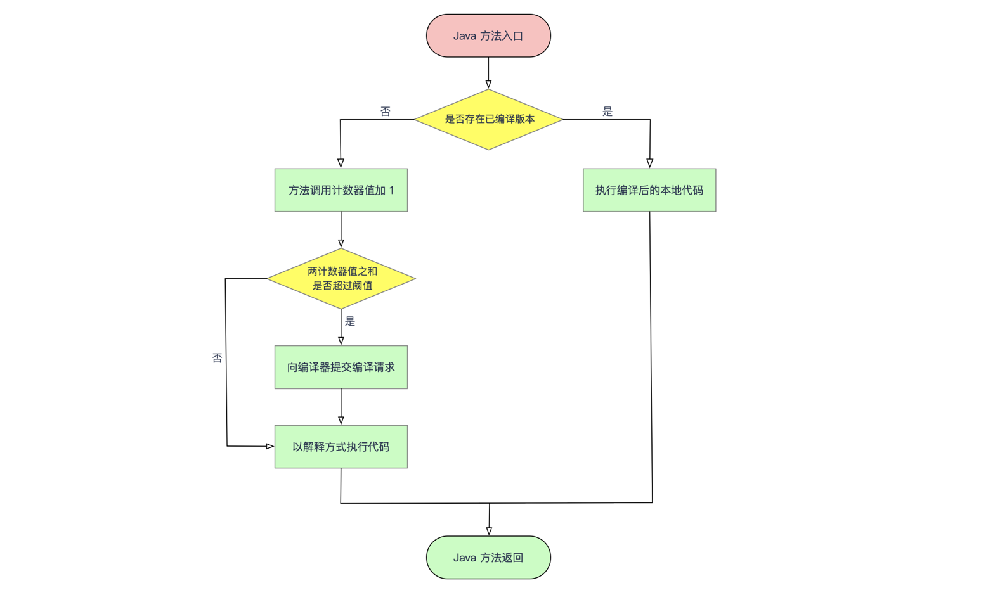
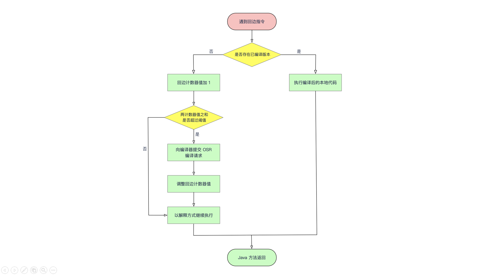

[TOC]

### 程序编译与代码优化

下文从虚拟机层面来看看虚拟机在**编译期间与运行期**对编写的代码采用了哪些优化手段。

#### 编译期优化（早期优化）

Java 语言的「**编译期**」其实是一段「不确定」的操作过程。可能是：

- **前端编译器**：（如 **Javac**）把 *.java 文件编译成 *.class 文件的过程。
- **即时编译器**：程序**运行期**的即时编译器（**JIT 编译器**，Just In Time Compiler）把字节码文件编译成机器码的过程。
- **静态提前编译器**：（AOT 编译器，Ahead Of Time Compiler）**直接**把 *.java 文件编译成本地机器码的过程。

Javac 这类编译器对代码的运行效率**几乎没有**任何优化措施，虚拟机设计团队把对性能的**优化**都放到了**后端的即时编译器**中，这样可以让那些**不是**由 Javac 产生的 class 文件（如 Groovy、Kotlin 等语言产生的 class 文件）也能享受到编译器优化带来的好处。

但是 **Javac** 做了很多针对 Java 语言编码过程的优化措施来改善程序员的编码风格、提升编码效率。相当多新生的 Java 语法特性，都是靠**编译器**的「**语法糖**」来实现的，而不是依赖虚拟机的底层改进来支持。

Java 中**即时编译器**在**运行期**的优化过程对于程序运行来说更重要，而**前端编译器**在编译期的优化过程对于**程序编码**来说更加友好。

##### 1. Javac 编译器

Javac 编译器的编译过程大致可分为 3 个步骤：

1. 解析与填充**符号表**；
2. 插入式注解处理器的**注解处理**；
3. 分析与**字节码生成**。

这 3 个步骤之间的关系如下图所示：



###### ① 解析与填充符号表

解析步骤包含了；完成词法分析和语法分析之后，下一步就是**填充符号表的过程**。符号表是由一组符号地址和符号信息构成的表格。在语义分析中，符号表所登记的内容将用于语义检查和产生中间代码。在目标代码生成阶段，当对符号名进行地址分配时，符号表是**地址分配**的依据。语法分析后编译器获得了程序代码的**抽象语法树**表示。

###### ② 注解处理器

注解（Annotation）是在 JDK 1.5 中新增的，有了编译器注解处理的标准 API 后，我们的代码就可以干涉编译器的行为，比如在编译期生成 **class 文件**。

###### ③ 语义分析与字节码生成

**字节码生成**是 Javac 编译过程的最后一个阶段，字节码生成阶段不仅仅是把前面各个步骤所生成的信息（语法树、符号表）转化成字节码写到磁盘中，编译器还进行了**少量的代码添加和转换**工作。

在字节码生成阶段，除了生成构造器以外，还有一些其它的**代码替换**工作用于优化程序的实现逻辑，如把字符串的加操作替换为 StringBiulder 或 StringBuffer。

##### 2. Java语法糖

语法糖不会提供实质性的功能改进，但能提升开发效率、语法的严谨性、减少编码出错的机会。

###### ① 泛型与类型擦除

泛型顾名思义就是类型泛化，本质是参数化类型的应用，也就是说操作的数据类型被指定为一个参数。这种参数可以用在类、接口和方法的创建中，分别称为泛型类、泛型接口和泛型方法。

在 Java 语言还没有泛型的时候，只能通过 Object 是所有类型的父类和强制类型转换两个特点的配合来实现类型泛化。例如 HashMap 的 get() 方法返回的就是一个 Object 对象，那么**只有程序员和运行期的虚拟机才知道这个 Object 到底是个什么类型的对象**。在编译期间，编译器无法检查这个 Object 的强制类型转换是否成功，如果仅仅依赖程序员去保障这项操作的正确性，许多 **ClassCastException** 的风险就会转嫁到程序运行期。

Java 语言中**泛型只在程序源码**中存在，在编译后的字节码文件中，就已经替换为原来的**原生类型**，并且在相应的地方插入了**强制类型转换的代码**。因此对于运行期的 Java 语言来说， ArrayList 与 ArrayList 是同一个类型，所以泛型实际上是 Java 语言的一个语法糖，这种泛型的实现方法称为**类型擦除**。

###### ② 自动装箱、拆箱与遍历循环

自动装箱、拆箱与遍历循环是 Java 语言中用得最多的语法糖。

下面是源码：

```java
public class SyntaxSugars {

    public static void main(String[] args){
        List<Integer> list = Arrays.asList(1,2,3,4,5);
        int sum = 0;
        for(int i : list){
            sum += i;
        }
        System.out.println("sum = " + sum);
    }
}
```

自动装箱、拆箱与遍历循环**编译之后**：

```java
public class SyntaxSugars {

    public static void main(String[] args) {
        List list = Arrays.asList(new Integer[]{
                Integer.valueOf(1),
                Integer.valueOf(2),
                Integer.valueOf(3),
                Integer.valueOf(4),
                Integer.valueOf(5)
        });

        int sum = 0;
        for (Iterator iterable = list.iterator(); iterable.hasNext(); ) {
            int i = ((Integer) iterable.next()).intValue();
            sum += i;
        }
        System.out.println("sum = " + sum);
    }
}
```

第一段代码包含了**泛型、自动装箱、自动拆箱、遍历循环和变长参数** 5 种语法糖，第二段代码则展示了它们在编译后的变化。

###### ③ 条件编译

Java 语言中**条件编译**的实现也是一颗语法糖，根据布尔常量值的真假，编译器会把分支中**不成立的代码块消除**。

```java
public static void main(String[] args) {
    if (true) {
        System.out.println("block 1");
    } else {
        System.out.println("block 2");
    }
}
```

上述代码经过编译后 class 文件的反编译结果：

```java
public static void main(String[] args) {
    System.out.println("block 1");
}
```


#### 运行期优化（晚期优化）

在部分商业虚拟机中，Java 最初是通过**解释器解释执行**的，当虚拟机发现某个方法或者代码块的运行特别频繁时，就会把这些代码认定为「**热点代码**」（Hot Spot Code）。

为了提高热点代码的执行效率，在运行时，虚拟机将会把这些代码编译成与**本地平台相关的机器码**，并进行各种层次的优化，完成这个任务的编译器称为==**即时编译器**（JIT，Just In Time）==。

即时编译器不是虚拟机必须的部分，Java 虚拟机规范并没有规定虚拟机内部必须要有即时编译器存在，更没有限定或指导即时编译器应该如何实现。但是 JIT 编译性能的好坏、代码优化程度的高低却是衡量一款商用虚拟机优秀与否的最关键指标之一。

##### 1. HotSpot 虚拟机的即时编译器

由于 Java 虚拟机规范中没有限定即时编译器如何实现，所以即时编译器完全取决于虚拟机的具体实现。此处以 HotSpot 为例明，主流虚拟机中 JIT 的实现有颇多相似之处。

###### ① 解释器与编译器

尽管并不是所有的 Java 虚拟机都采用解释器与编译器并存的架构，但许多主流的商用虚拟机，如 HotSpot、J9 等，都**同时包含解释器与编译器。**

> **解释器与编译器两者各有优势**

- 当程序需要**迅速启动和执行**的时候，**解释器**可以首先发挥作用，**省去编译的时间，立即执行**。在程序运行后，随着时间的推移，编译器逐渐发挥作用，把越来越多的代码编译成本地机器码之后，可以获得更高的执行效率。
- 当程序运行环境中内存资源限制较大（如部分嵌入式系统），可以使用**解释器**执行来节约内存，反之可以使用编译执行来提升效率。

###### ② 编译对象与触发条件

程序在运行过程中会被即时编译器编译的**对象**即「**热点代码**」，有两类：

- 被多次调用的**方法**；
- 被多次执行的**循环体**。

这两种情况都是对**整个方法**进行即时编译。

> **如何进行热点代码判断**？**啥时候触发？**

即时编译器的触发条件。

判断一段代码是不是热点代码，是不是需要触发即时编译，这样的行为称为「**热点探测**」。

HotSpot 虚拟机采用**基于计数器的热点探测**：采用这种方法的虚拟机会为每个方法（甚至代码块）建立**计数器**，统计方法的执行次数，如果执行次数超过一定的阈值就认为它是「**热点方法**」。

因此它为每个方法准备了**两类计数器**：**方法调用计数器**（Invocation Counter）和**回边计数器**（Back Edge Counter）。

在确定虚拟机运行参数的情况下，这两个计数器都有一个确定的**阈值**，当**计数器超过阈值就会触发 JIT 即时编译**。

###### **③ 方法调用计数器**

顾名思义，这个计数器用于**统计方法被调用的次数**。当一个方法被调用时，会首先检查该方法**是否存在被 JIT 编译**过的版本，如果存在，则优先使用编译后的本地代码来执行。如果不存在，则将此方法的调用计数器加 1，然后判断方法调用计数器与回边计数器之和是否超过方法调用计数器的阈值。如果超过阈值，将会向即时编译器提交一个该方法的代码编译请求。



如果不做任何设置，方法调用计数器统计的是一个相对的执行频率（非绝对次数），即**一段时间内方法调用的次数**。当超过一定的时间限度，如果方法的调用次数仍然不足以让它提交给即时编译器编译，那这个方法的调用计数器值就会被减少。

###### ④ 回边计数器

回边计数器的作用是**统计一个方法中循环体代码执行的次数**，在字节码中遇到控制流向后跳转的指令称为「**回边**」（Back Edge）。建立回边计数器统计的目的是为了触发 OSR 编译。

当解释器遇到一条回边指令时，会先查找将要执行的代码片段是否已经有编译好的版本，如果有，它将优先执行已编译的代码，否则就把回边计数器值加 1，然后判断方法调用计数器和回边计数器值之和是否超过计数器的阈值。当超过阈值时，将会提交一个 OSR 编译请求，并且把回边计数器的值降低一些，以便继续在解释器中执行循环，等待编译器输出编译结果。



回边计数器统计的就是该方法循环执行的**绝对次数**。

##### 2. 编译优化技术

**以编译方式执行本地代码比解释执行方式更快**，一方面是因为节约了虚拟机解释执行字节码额外消耗的时间；另一方面是因为虚拟机设计团队几乎把所有对代码的**优化**措施都集中到了即时编译器中。

下文是 HotSpot 虚拟机的**即时编译器在编译代码**时采用的优化技术。

###### ① 优化技术概览

代码优化技术有很多，实现这些优化也很有难度，但是大部分还是比较好理解的。

- 方法内联
- 冗余消除
- 复写传播
- 无用代码消除

从一段简单的代码开始，看看虚拟机会做哪些代码优化。

```java
static class B {
    int value;
    final int get() {
        return value;
    }
}

public void foo() {
    y = b.get();
    z = b.get();
    sum = y + z;
}
```

首先需要明确的是，这些代码优化是建立在代码的某种中间表示或者**机器码**上的，绝**不是建立在 Java 源码**上。这里之所使用 Java 代码来介绍是为了方便演示。

上面这段代码看起来简单，但是有许多可以优化的地方。

第一步是进行**方法内联**（Method Inlining），方法内联的**重要性**要高于其它优化措施。方法内联的目的主要有两个，一是去除方法调用的成本（比如建立栈帧），二是为其它优化建立良好的基础，方法内联膨胀之后可以便于更大范围上采取后续的优化手段，从而获得更好的优化效果。因此，各种编译器一般都会把内联优化放在优化序列的最前面。

内联优化后的代码如下：

```java
public void foo() {
    y = b.value;
    z = b.value;
    sum = y + z;
}
```

第二步进行**冗余消除**，代码中「z = b.value;」可以被替换成「z = y」。这样就**不用再去**访问对象 b 的局部变量。如果把 b.value 看做是一个表达式，那也可以把这项优化工作看成是**公共子表达式**消除。优化后的代码如下：

```java
public void foo() {
    y = b.value;
    z = y;
    sum = y + z;
}
```

第三步进行**复写传播**，因为这段代码里没有必要使用一个额外的变量 z，它与变量 y 是完全等价的，因此可以使用 y 来代替 z。复写传播后的代码如下：

```java
public void foo() {
    y = b.value;
    y = y;
    sum = y + y;
}
```

第四步进行**无用代码消除**。无用代码可能是永远不会执行的代码，也可能是完全没有意义的代码。因此，又被形象的成为「Dead Code」。上述代码中 y = y 是没有意义的，因此进行无用代码消除后的代码是这样的：

```java
public void foo() {
    y = b.value;
    sum = y + y;
}
```

经过这四次优化后，最新优化后的代码和优化前的代码所达到的效果是一致的，但是优化后的代码执行效率会更高。编译器的这些优化技术实现起来是很复杂的，但是想要理解它们还是很容易的。

接下来我们再讲讲如下几项最有代表性的优化技术是如何运作的，它们分别是：

- 公共子表达式消除；
- 数组边界检查消除；
- 方法内联；
- 逃逸分析。

###### ② 公共子表达式消除

如果一个**表达式 E** 已经计算过了，并且从先前的计算到现在 E 中所有变量的值都没有发生变化，那么 E 的这次出现就成了公共子表达式。对于这种表达式，没有必要花时间再对它进行计算，只需要直接使用前面计算过的表达式结果代替 E 就好了。如果这种优化仅限于程序的基本块内，便称为局部公共子表达式消除，如果这种优化的范围覆盖了多个基本块，那就称为全局公共子表达式消除。

###### ③ 数组边界检查消除

如果有一个数组 array[]，在 Java 中访问数组元素 array[i] 的时候，系统会自动进行**上下界的范围检查**，即检查 i 必须满足 i >= 0 && i < array.length，否则会抛出一个运行时异常：java.lang.ArrayIndexOutOfBoundsException，这就是数组边界检查。

对于虚拟机执行子系统来说，每次数组元素的读写都带有一次**隐含的条件判定**操作，对于拥有大量数组访问的程序代码，这是一种不小的性能开销。为了安全，数组边界检查是必须做的，但是数组边界检查并不一定每次都要进行。比如在循环的时候访问数组，如果编译器只要通过数据流分析就知道循环变量是不是在区间 [0, array.length] 之内，那在整个循环中就可以把数组的上下界检查消除。

###### ④ 方法内联

方法内联前面已经通过代码分析介绍过，这里就不再赘述了。

###### ⑤ 

逃逸分析不是直接优化代码的手段，而是为其它优化手段提供依据的分析技术。逃逸分析的基本行为就是分析对象的动态作用域：当一个对象在方法中被定义后，它可能被**外部方法所引用，例如作为调用参数传递到其它方法中，称为方法逃逸**。甚至还有可能被外部线程访问到，例如赋值给类变量或可以在其他线程中访问的实例变量，称为线程逃逸。


#### **参考资料**

- [深入理解Java虚拟机（程序编译与代码优化）](https://www.cnblogs.com/baronzhang/p/11108322.html)https://www.cnblogs.com/baronzhang/p/11108322.html