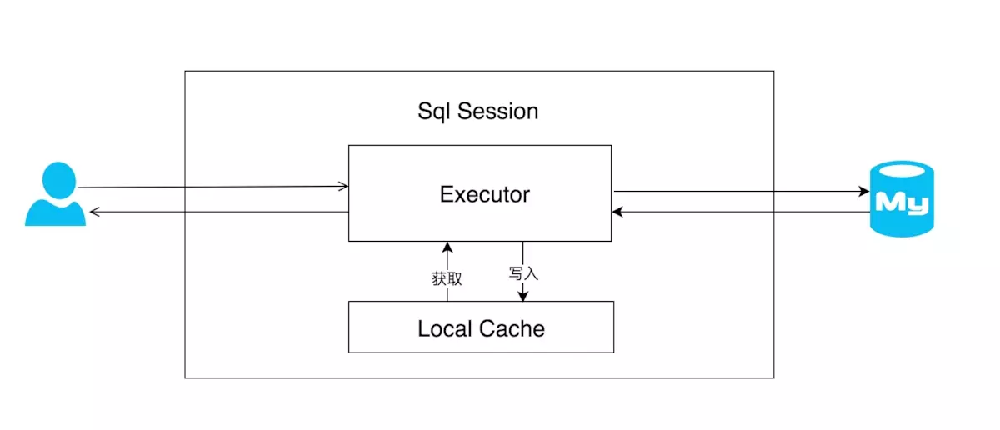
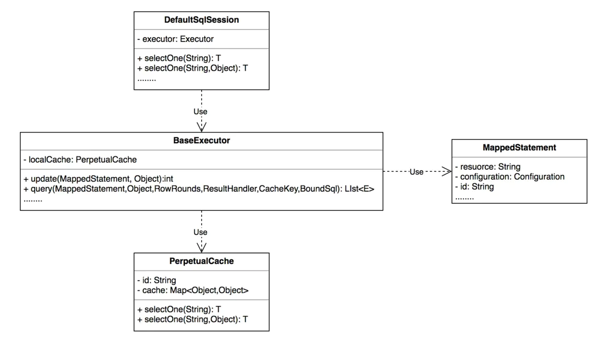
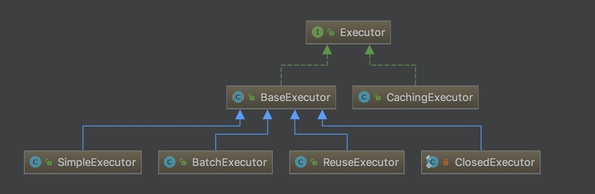
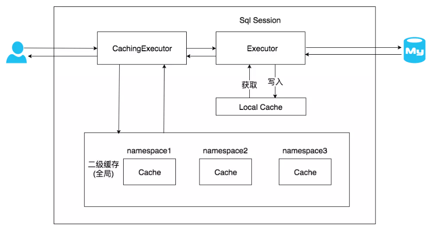
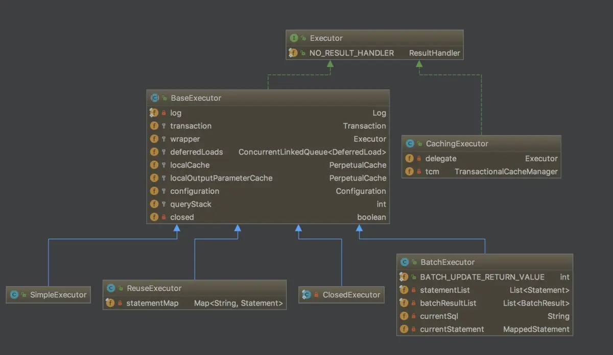
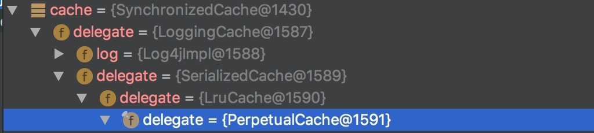

[TOC]

### MyBatis基础

#### 核心概念

MyBatis 是一款优秀的**持久层框架**，它支持定制化 SQL、存储过程以及高级映射。MyBatis 避免了几乎所有的 JDBC 代码和手动设置参数以及获取结果集。MyBatis 可以使用简单的 **XML 或注解来配置和映射原生类型**、接口和 Java 的 POJO（Plain Old Java Objects，普通老式 Java 对象）为数据库中的记录。

其它持久层解决方案对比：

- JDBC

- DataUtils

- JdbcTemplate

- Hibernate


#### Mapper文件

##### 1. sql语句块statement

通过原生 JDBC 写 DAO 的年代 ，程序员最怕莫过于 **拼接 SQL 语句**，拼接参数与设置返回结果集，Hibernate 将拼接 SQL时代成为过去，通过 ORM 映谢，完全不需要处理任何 SQL，但这又带来了新的问题就是。**无法编写自定义 SQL** 从而丧失了灵活活及更好的性能。MyBatis 通过 mapper 映射 SQL 很好解决了这一点。它无需在 JAVA 代码中拼接 SQL，而是将其**移至 mapper 文件集中处理 SQL**节约了大量的开发时间。

###### **Mapper中的元素：**

- cache – 对给定命名空间的缓存配置。

- resultMap – 结果集映射。

- sql – 可被其他语句引用的可重用语句块。

- insert – 插入语句

- update – 更新语句

- delete –删除语句

- select – 查询语句

###### **select 用法及属性**

示例：

```xml
<select id="selectById" resultType="com.tuling.mybatis.dao.Account">
    select * from account where id = #{id}
</select>
```

属性：

```xml
<select
        id="selectById"    
        parameterType="User" 
        resultType="hashmap"  
        resultMap="userResultMap" 
        flushCache="false"   
        useCache="true"     
        timeout="10"
        statementType= PREPARED">
```

- id：语句块的唯一标识 与接口中方法名称对应

- parameterType：参数java类型

- resultType：返回结果java类型

- resultMap：返回结果映射

- flushCache：true 每次调用都会刷新 一二级缓存

- useCache：true 是否保存至二级缓存当中去

######  **insert&update&delete 用法**

```xml
<insert
        id="addUser"  
        parameterType="User"  
        flushCache="true" 
        statementType="PREPARED"
        keyProperty=""    
        keyColumn=""    
        useGeneratedKeys="" 
        timeout="20">
```

- id：语句块的唯一标识 与接口中方法名称对应
- parameterType：参数java类型
- flushCache：true 每次调用都会刷新 一二级缓存
- statementType：执行类型
- keyProperty：主键对应的java 属性，多个用 逗号分割
- keyColumn：主键列，多个用 逗号分割
- useGeneratedKeys：插入成功后将 将值回设至 原参数

示例：

```xml
<insert id="addUser" keyColumn="id" keyProperty="id" useGeneratedKeys="true"
        parameterType="com.tuling.mybatis.dao.User">
    insert into user (name,updateTime,createTime) values (#{name},#{updateTime},#{createTime})
</insert>
```


#### 参数映射

参数映射是最强大功能之一，基可以通过以下方式进行引用。

- 单个简单参数引用：如果方法中只有一个参数可通过任意名称 进行引用。

- 多个简单参数引用：通过参数下标引用 #{arg0} #{arg1} 或 #{param1} ,#{param2}。

- 对像属性引用：直接通过对象属性名称引用，嵌套对像通过. 号进行引用。

- map key 值引用。

- 变量名称引用(需要 JDK1.8 支持) ：通过方法中参数名称引用，需要 JDK1.8 支持，且在编译时必须加上 -parameters 编译命令。


#### 结果集映射

结果集映射是指将 resultSet 中内容封装转换成 Java对像，在纯 JDBC 时代全部都是用调用 resultSet 的 getXXX(columnName) 来获取属性并封装。代码量大，编程效率低尤其当数据模型是 1 对多，或多对多这种复杂关系，这种封装代码将会变得非常复杂。结果集映射就是为解决这个问题通过 resultMap 集中处理 结果集与 JAVA 对象的关系。

**结果集自动映射**

在 select 中指定 **resultType**=“” 后无需要任何配置 myBatis 会基于 resultType 中的 Java 类型及属性**自动推断**生成 一个隐示的 resultMap 从而完成**结果映射**。

**resultMap**

但有时 JDBC 并不是与 Java Bean 完全贴合，这时就需要手动设置 resultMap。

```xml
<resultMap id="account2" type="com.tuling.mybatis.dao.Account">
    <id property="id"/>
    <result property="createTimestamp" column="createTimestamp"
            typeHandler="com.tuling.mybatis.dao.LongTimeHandler"/>
</resultMap>
```

这时在 select 元素中用 resultMap ="account2" 即可引用该 map 映射。

**基本元素与属性**

- **ID：**用于**结果集中的唯一标识**，在**缓存**中很有用，缓存对比 ID 字段进行匹配。

- **result：**设置一个某通过字段
- property：Java 中的类型
- jdbcType：
- javaType：
- column：
- typeHandler：

嵌套结果映射

关联 association 

示例：

```xml
<resultMap id="accountAndUser" type="com.tuling.mybatis.dao.Account">
    <id property="id" column="id"/>
    <association property="user" javaType="com.tuling.mybatis.dao.User">
        <id property="id" column="user_id"/>
        <result property="name" column="userName"/>
    </association>
</resultMap>

<select id="selectAccountAndUser" resultMap="accountAndUser">
    SELECT a.*, b.name userName from account a,user b where a.user_id=b.id
</select>
```

引入外部 Select

```xml
<!--基于多次查询拼装引入-->
<resultMap id="accountAndUser2" type="com.tuling.mybatis.dao.Account">
    <id property="id" column="id"/>
    <association property="user" javaType="com.tuling.mybatis.dao.User" select="selectUser" column="user_id">
    </association>
</resultMap>

<select id="selectUser" resultType="com.tuling.mybatis.dao.User">
    select * from user where id = #{id}
</select>
```


#### MyBatis缓存

MyBatis提供了一级缓存和二级缓存。

- 一级缓存：也称为本地缓存，用于保存用户在一次会话过程中查询的结果，用户一次会话中只能使用一个sqlSession，一级缓存是自动开启的，不允许关闭。
- 二级缓存：也称为全局缓存，是mapper级别的缓存，是针对一个表的查结果的存储，可以共享给所有针对这张表的查询的用户。也就是说对于mapper级别的缓存不同的sqlsession是可以共享的。

##### 1. 一级缓存

###### 一级缓存使用场景

订单表与会员表是存在**一对多**的关系 为了尽可能**减少 join 查询**，进行了**分阶段**查询，即先查询出订单表，再根据 member_id 字段查询出会员表，最后进行数据整合 。如果订单表中存在**重复**的 member_id，就会出现很多没必要的重复查询。

针对这种情况 MyBatis 通过一级缓存来实现，在**同一次查询会话中如果出现相同的语句及参数**，就会从缓存中取出不在走数据库查询。一级缓存**只能作用于查询会话**中，所以也叫做**会话缓存**。其实一级缓存生命周期比较短，因为限制挺多的。

**会话**就是一次完整的交流，再一次交流过程中包含多次请求响应，而发送的请求都是同一个用户，SqlSession 就是用户与数据库进行一次会话过程中使用的接口。

在应用运行过程中，在一次数据库会话中，执行多次查询条件完全相同的 SQL，会优先命中一级缓存，避免直接对数据库中直接查询。



示例：

```java
LabelMapper mapper = session.getMapper(LabelMapper.class);
Label label = mapper.getById(23);
Label label2 = mapper.getById(23);
Label label3 = sqlSessionFactory.openSession().getMapper(LabelMapper.class).getById(23);
Label label4 = session.getMapper(Label2Mapper.class).getById(23);
System.out.println(label == label2);	// true：缓存生效
System.out.println(label3 == label2);	// false：属于不同的session，缓存失效
System.out.println(label4 == label2);   // false：同一个session但是是不同的mapper，缓存失效
```

###### 一级缓存的生效条件

MyBatis 一级缓存是**默认开启**的。但是有的时候一级缓存**是会失效**的。可以结合上述的例子进行理解。

1. 必须是**相同的 SQL 和参数**。

2. 必须是**相同的会话 session**。

3. 必须是**相同的 namespace**，即同一个 **mapper**（即使是 session 相同但 mapper 不同也不行）。

4. 必须是**相同的 statement**，即同一个 mapper 接口中的**同一个方法**。即 mapper 中**两个方法**对应的 SQL 相同也不行。

5. 查询语句中间**没有执行** session.clearCache() 方法（代表**清空一级缓存**）。

6. 查询语句中间**没有执行 insert update delete 方法**（无论改变了什么记录，只要执行了这些方法都会导致一级缓存失效）。

###### 一级缓存源码解析

每个 SqlSession 中都持有 **Excutor**，每个 Excutor 中有一个 **LocalCache**。当用户发起询问时，MyBatis 根据当前执行的语句生成 **MappedStatement**，在 LocalCache 进行查询，如果缓存**命中**的话，直接返回结果给用户，如果缓存没有命中的话，查询数据库，结果写入 LocalCache，最后返回结果给用户。





**SqlSession：** 对外提供了用户和数据库之间交互需要的**所有方法**，隐藏了底层细节。默认实现类是 **DefaultSqlSession**。

**Executor：** SqlSession 向用户提供操作数据库的方法，但和数据库操作有关的**职责**都会**委托给 Executor**。Executor 有**两个实现类**，和**一级缓存关联的是 BaseExecutor**。

**BaseExecutor：** BaseExecutor 是一个实现了 Executor 接口的抽象类，定义若干抽象方法，在执行的时候，把具体的操作委托给**子类**进行执行。

**PerpetualCache：**对 Cache 接口最基本实现，内部**持有 HashMap**，对**一级缓存的操作**实则是对 HashMap 的操作。

SqlSession 初始化时会创建 Executor 的实例，Mybatis 默认使用的是 SimpleExecutor，初始化代码如下所示:

```java
public Executor newExecutor(Transaction transaction, ExecutorType executorType) {
    executorType = executorType == null ? defaultExecutorType : executorType;
    executorType = executorType == null ? ExecutorType.SIMPLE : executorType;
    Executor executor;
    if (ExecutorType.BATCH == executorType) {
        executor = new BatchExecutor(this, transaction);
    } else if (ExecutorType.REUSE == executorType) {
        executor = new ReuseExecutor(this, transaction);
    } else {
        executor = new SimpleExecutor(this, transaction);
    }
    // 如果启用二级缓存，使用CahingExecutor装饰类
    if (cacheEnabled) {
        executor = new CachingExecutor(executor);
    }
    executor = (Executor) interceptorChain.pluginAll(executor);
    return executor;
}
```

SqlSession 在**提交**的时候会**清空本地缓存**，因为 commit 操作一般对应**插入、更新或者删除**操作，**清空缓存防止读取脏数据**。

```java
@Override
public void commit(boolean required) throws SQLException {
    if (closed) {
        throw new ExecutorException("Cannot commit, transaction is already closed");
    }
    // 清空本地缓存
    clearLocalCache();
    flushStatements();
    if (required) {
        transaction.commit();
    }
}
```

sqlSession 的 insert 方法和 delete 方法，都会统一调用 **update 的流程。**

```java
@Override
public int insert(String statement, Object parameter) {
    return update(statement, parameter);
}
@Override
public int delete(String statement) {
    return update(statement, null);
}
```

update 方法也是委托给了 **Executor 执行**。BaseExecutor 的执行方法如下所示。

```java
@Override
public int update(MappedStatement ms, Object parameter) throws SQLException {
    ErrorContext.instance().resource(ms.getResource()).activity("executing an update").object(ms.getId());
    if (closed) {
        throw new ExecutorException("Executor was closed.");
    }
    clearLocalCache();
    return doUpdate(ms, parameter);
}
```

总结缓存**获取**的方法调用过程。

```java
>mapper.mapper.selectById(23)
 >org.apache.ibatis.session.defaults.DefaultSqlSession#selectList()
  >org.apache.ibatis.executor.CachingExecutor#query()	// 缓存执行器
   >org.apache.ibatis.executor.BaseExecutor#query() 142L	
    >org.apache.ibatis.cache.impl.PerpetualCache#getObject 55L	// 真正存放缓存数据的地方
```

总结缓存**存储**的方法调用过程。

```java
>mapper.mapper.selectById(23)
 >org.apache.ibatis.session.defaults.DefaultSqlSession#selectList()
  >org.apache.ibatis.executor.CachingExecutor#query()	// 缓存执行器
   >org.apache.ibatis.executor.BaseExecutor#query() 142L
    >org.apache.ibatis.executor.BaseExecutor#queryFromDatabase	// 发现没有缓存则直接从数据库查询
     >org.apache.ibatis.cache.impl.PerpetualCache#putObject	// 将数据放入缓存中
```

可以看到上述的缓存获取和存储的过程中，前面的步骤都是一样的，即先执行 DefaultSqlSession 的 selectList() 方法，然后执行到缓存执行器 CachingExecutor 的 query() 方法进行查询，进而调用 BaseExecutor 的 query() 方法。这里之前的步骤都是相同的，之后会看是否存在缓存，如果有缓存记录则直接获取缓存，否则直接查询数据库并放入到缓存中。

执行 **update** 等过程为什么会导致一级缓存**失效**？

通过对 **clearCache** 作为入口我们可能追踪到，一级缓存的实现 **PerpetualCache**。

```java
>org.apache.ibatis.session.defaults.DefaultSqlSession#clearCache
  >org.apache.ibatis.executor.CachingExecutor#clearLocalCache
     >org.apache.ibatis.executor.BaseExecutor#clearLocalCache
        >org.apache.ibatis.cache.impl.PerpetualCache#clear
```

###### 总结

- **MyBatis 一级缓存的生命周期和 SqlSession 一致**。
- MyBatis 一级缓存内部设计简单，只是一个没有容量限定的 HashMap，在缓存的功能性上有所欠缺。
- MyBatis 的一级缓存最大范围是 **SqlSession 内**部，有多个 SqlSession 或者分布式的环境下，数据库写操作会引起脏数据。
- MyBatis 和 **Spring 整合**后进行 mapper 代理开发，**不支持一级缓存**。

##### 2. 二级缓存

开启二级缓存后，会使用 **CachingExecutor** 装饰 Executor，进入一级缓存的**查询流程前**，先在 CachingExecutor 进行**二级缓存的查询**，具体的工作流程如下所示。**先查全局的二级缓存，如果没有则查各个 session 自己的一级缓存，如果没有再查数据库。**



二级缓存开启后，同一个 namespace 下的所有操作语句，都影响着**同一个 Cache**，即二级缓存被多个 SqlSession 共享，是一个**全局的变量**。

当开启缓存后，数据的查询执行的流程就是 **二级缓存 -> 一级缓存 -> 数据库**。

###### 二级缓存使用场景

业务系统中存在很多的静态数据如，字典表、菜单表、权限表等，这些数据的特性是不会轻易修改但又是查询的热点数据。一级缓存针对的是同一个会话当中相同SQL，并不适合这种热点数据的缓存场景。为了解决这个问题引入了二级缓存，它脱离于会话之外。

使用例子：在 Mapper 上加上 @CacheNamespace 注解。

```java
@CacheNamespace()
public interface LabelMapper {
    @Select("select * from t_label where id =#{id}")
    Label getById(Integer id);
}
```

属性说明：

```java
@CacheNamespace(
    implementation = PerpetualCache.class, // 缓存实现Cache接口实现类
    eviction = LruCache.class,	// 缓存算法 定义回收的策略，常见的有FIFO，LRU
    flushInterval = 60000, 		// 配置一定时间自动刷新缓存，单位是毫秒
    size = 1024,  				// 最大缓存引用对象 1024次查询的结果
    readWrite = true, 			// 是否可写
    blocking = false  			// 若缓存中找不到对应的key，是否会一直blocking，直到有对应的数据进入缓存
)
```

blocking 属性可以用于**防止缓存击穿**。这是通过**加锁**实现的。

也可以在 MyBatis 核心配置文件，通过 settings 标签开发二级缓存。

在对应的 **Mapper 文件**中**添加 cache 标签**。

###### 二级缓存使用条件

1. 当会话**提交或关闭**之后才会填充二级缓存，也就是必须调用 session.close() 方法后缓存才放到缓存池。

2. 必须是在**同一个命名空间**之下。

3. 必须是**相同的 statement 即同一个 mapper 接口**中的同一个方法。

4. 必须是**相同的 SQL 语句和参数**。

5. 如果 readWrite=true ，实体对像必须实现 Serializable 接口。

###### 二级缓存清除条件

1. 有修改会话提交之后，才会执行清空操作。
2. 任何一种增删改操作都会清空整个 namespace 中的缓存。

###### 源码分析

MyBatis 在为 SqlSession 对象创建 Excutor 对象时候，会 Executor 对象加上一个**装饰者：CachingExecutor**，这时 SqlSession 使用 CachingExecutor 对象来完成操作请求。CachingExecutor 对于查询请求，会先判断该查询请求在二级缓存中是否有缓存，如果有则直接返回缓存结果；如果没有再交给真正的 Executor 对象来完成查询操作，之后 CachingExecutor 会将真正 Executor 返回的查询结果放置到缓存中，然后再返回给用户。



源码分析从`CachingExecutor`的`query`方法展开，源代码走读过程中涉及到的知识点较多，不能一一详细讲解。

CachingExecutor 的 **query** 方法，首先会从 **MappedStatement** 中获得在配置初始化时赋予的 Cache。

```java
Cache cache = ms.getCache();
```

本质上是**装饰器模式**的使用，具体的**装饰链**是：

```java
SynchronizedCache -> LoggingCache -> SerializedCache -> LruCache -> PerpetualCache。
```



以下是具体这些 **Cache 实现类**的介绍，他们的组合为 Cache 赋予了不同的能力。

- **SynchronizedCache**： 同步 Cache，实现比较简单，直接使用 synchronized 修饰方法。
- **LoggingCache**： 日志功能，装饰类，用于记录缓存的命中率，如果开启了 DEBUG 模式，则会输出命中率日志。
- **SerializedCache**： 序列化功能，将值序列化后存到缓存中。该功能用于缓存返回一份实例的 Copy，用于保存线程安全。
- **LruCache**： 采用了 Lru 算法的 Cache 实现，移除最近最少使用的 key/value。
- **PerpetualCache**： 作为为最基础的缓存类，底层实现比较简单，直接使用了 HashMap。

可以为**每条 Mapper 语句**设置是否要**刷新缓存**,可以指定 select 语句是否使用缓存,如下所示:

```java
<select ... flushCache="false" useCache="true"/>
<insert ... flushCache="true"/>
<update ... flushCache="true"/>
<delete ... flushCache="true"/>
```

然后是判断是否需要**刷新缓存**，代码如下所示：

```java
flushCacheIfRequired(ms);
```

在默认的设置中`SELECT`语句**不会**刷新缓存，`insert/update/delte`**会**刷新缓存。进入该方法。代码如下所示：

```java
private void flushCacheIfRequired(MappedStatement ms) {
    Cache cache = ms.getCache();
    if (cache != null && ms.isFlushCacheRequired()) {      
      tcm.clear(cache);
    }
}
```

MyBatis的`CachingExecutor`持有了`TransactionalCacheManager`，即上述代码中的 tcm。

`TransactionalCacheManager`中持有了一个Map，代码如下所示：

```java
private Map<Cache, TransactionalCache> transactionalCaches = new HashMap<Cache, TransactionalCache>();
```

这个 Map 保存了 Cache 和用`TransactionalCache`包装后的 Cache 的映射关系。

`TransactionalCache`实现了 Cache 接口，`CachingExecutor`会默认使用他包装初始生成的 Cache，作用是如果事务提交，对缓存的操作才会生效，如果事务回滚或者不提交事务，则不对缓存产生影响。

在`TransactionalCache`的 clear，有以下两句。清空了需要在提交时加入缓存的列表，同时设定提交时清空缓存，代码如下所示：

```java
@Override
public void clear() {
	clearOnCommit = true;
	entriesToAddOnCommit.clear();
}
```

`CachingExecutor`继续往下走，`ensureNoOutParams`主要是用来处理存储过程的，暂时不用考虑。

```java
if (ms.isUseCache() && resultHandler == null) {
	ensureNoOutParams(ms, parameterObject, boundSql);
```

之后会尝试从tcm中获取缓存的列表。

```java
List<E> list = (List<E>) tcm.getObject(cache, key);
```

在`getObject`方法中，会把获取值的职责一路传递，最终到`PerpetualCache`。如果没有查到，会把key加入Miss集合，这个主要是为了统计命中率。

```java
Object object = delegate.getObject(key);
if (object == null) {
	entriesMissedInCache.add(key);
}
```

`CachingExecutor`继续往下走，如果查询到数据，则调用`tcm.putObject`方法，往缓存中放入值。

```java
if (list == null) {
	list = delegate.<E> query(ms, parameterObject, rowBounds, resultHandler, key, boundSql);
	tcm.putObject(cache, key, list); // issue #578 and #116
}
```

tcm的`put`方法也不是直接操作缓存，只是在把这次的数据和key放入待提交的Map中。

```java
@Override
public void putObject(Object key, Object object) {
    entriesToAddOnCommit.put(key, object);
}
```

从以上的代码分析中，我们可以明白，如果不调用`commit`方法的话，由于`TranscationalCache`的作用，并不会对二级缓存造成直接的影响。因此我们看看`Sqlsession`的`commit`方法中做了什么。代码如下所示：

```java
@Override
public void commit(boolean force) {
    try {
      executor.commit(isCommitOrRollbackRequired(force));
```

因为我们使用了CachingExecutor，首先会进入CachingExecutor实现的commit方法。

```java
@Override
public void commit(boolean required) throws SQLException {
    delegate.commit(required);
    tcm.commit();
}
```

会把具体commit的职责委托给包装的`Executor`。主要是看下`tcm.commit()`，tcm最终又会调用到`TrancationalCache`。

```java
public void commit() {
    if (clearOnCommit) {
      delegate.clear();
    }
    flushPendingEntries();
    reset();
}
```

看到这里的`clearOnCommit`就想起刚才`TrancationalCache`的`clear`方法设置的标志位，真正的清理Cache是放到这里来进行的。具体清理的职责委托给了包装的Cache类。之后进入`flushPendingEntries`方法。代码如下所示：

```java
private void flushPendingEntries() {
    for (Map.Entry<Object, Object> entry : entriesToAddOnCommit.entrySet()) {
      delegate.putObject(entry.getKey(), entry.getValue());
    }
    ................
}
```

在`flushPending`Entries中，将待提交的Map进行循环处理，委托给包装的Cache类，进行`putObject`的操作。

后续的查询操作会重复执行这套流程。如果是`insert|update|delete`的话，会统一进入`CachingExecutor`的`update`方法，其中调用了这个函数，代码如下所示：

```java
private void flushCacheIfRequired(MappedStatement ms) 
```

**在二级缓存执行流程后就会进入一级缓存的执行流程**，因此不再赘述。

**清除缓存**的方法调用总结：

```java
>org.apache.ibatis.session.defaults.DefaultSqlSession#selectList() 147L
  >org.apache.ibatis.executor.CachingExecutor#query() 81L
    >org.apache.ibatis.executor.CachingExecutor#query() 95L
     >org.apache.ibatis.executor.CachingExecutor#flushCacheIfRequired() 164L // 清除缓存
```

获取缓存**关键源码**！

```java
>org.apache.ibatis.cache.TransactionalCacheManager#getObject() 
  >org.apache.ibatis.cache.decorators.TransactionalCache#getObject() 
    >org.apache.ibatis.cache.decorators.SynchronizedCache#getObject() 
      >org.apache.ibatis.cache.decorators.LoggingCache#getObject() 
        >org.apache.ibatis.cache.decorators.SerializedCache#getObject() 
          >org.apache.ibatis.cache.decorators.ScheduledCache#getObject() 
            >org.apache.ibatis.cache.decorators.LruCache#getObject() 
              >org.apache.ibatis.cache.impl.PerpetualCache#getObject() 
```

保存二级缓存关键源码！

```java
>org.apache.ibatis.executor.CachingExecutor#close() 
  >org.apache.ibatis.cache.TransactionalCacheManager#commit() 
    >org.apache.ibatis.cache.decorators.TransactionalCache#flushPendingEntries() 
      >org.apache.ibatis.cache.decorators.SynchronizedCache#putObject() 
        >org.apache.ibatis.cache.decorators.LoggingCache#putObject() 
          >org.apache.ibatis.cache.decorators.SerializedCache#putObject() 
            >org.apache.ibatis.cache.decorators.ScheduledCache#putObject() 
              >org.apache.ibatis.cache.decorators.LruCache#putObject() 
                >org.apache.ibatis.cache.impl.PerpetualCache#putObject() 
```

###### 总结

1. MyBatis 的二级缓存相对于一级缓存来说，实现了`SqlSession`之间缓存数据的共享，同时粒度更加的细，能够到`namespace`级别，通过 **Cache 接口**实现类不同的组合，对 Cache 的可控性也更强。
2. MyBatis 在**多表查询**时，极大可能会出现**脏数据**，有设计上的缺陷，安全使用二级缓存的条件比较苛刻。
3. 在分布式环境下，由于默认的 MyBatis Cache 实现都是**基于本地**的，**分布式环境下必然会出现读取到脏数据**，需要使用集中式缓存将 MyBatis 的 Cache 接口实现，有一定的开发成本，直接**使用 Redis、Memcached 等分布式缓存可能成本更低，安全性也更高。**

建议 MyBatis 缓存特性在生产环境中进行关闭，**单纯作为一个 ORM 框架**使用可能更为合适。


#### 参考资料

- MyBatis缓存：https://www.jianshu.com/p/b4522c9212fb
- 美团MyBatis缓存总结：https://tech.meituan.com/2018/01/19/mybatis-cache.html